Listas de estaciones según entidad y estado
================
José Martínez<br>Michela Izzo

Versión HTML (más legible e interactiva),
[aquí](https://geofis.github.io/datos-meteoclimaticos-escenarios-cc/combinadas-lista-de-estaciones-activas.html)

## Paquetes

``` r
library(sf)
library(leaflet)
library(leaflet.extras)
library(mapview)
library(readODS)
library(readxl)
library(parzer)
library(tidyverse)
library(kableExtra)
library(fuzzyjoin)
library(janitor)
source('R/funciones.R')
leaflet_map_view <- . %>% setView(lat = 18.7, lng = -70.3, zoom = 8)
```

## Resultados

En el archivo `combinadas_v0.9.xlsx` se consolidaron los resultados de
los archivos aportados por ONAMET e INDRHI en un único archivo
combinado. Este producto derivado es, por lo tanto, una relación de
estaciones (en filas) con un conjunto de atributos (columnas)
específicos de cada una. Hasta el momento, se han consolidado las de
ONAMET (primeras cuatro hojas) e INDRHI (últimas dos hojas).

### ONAMET

ONAMET aportó dos archivos, cada uno conteniendo listas de estaciones
que entendemos son comunes. El primero contiene una relación de
estaciones con indicación de coordenadas
(`COORDENADAS 2022 DIVISION INSTRUMENTOS.xlsx`), mientras que el segundo
indica los periodos de medición de cada variable de cada estación
(`LISTADO PERIODO DE MEDICION DE CADA ESTACION(22)-1.xlsx`). El objetivo
de este análisis es producir un mapa de las estaciones que se consideran
activas, para lo cual necesitamos las coordenadas del primer archivo, y
el periodo de medición del segundo.

Para decidir cuáles estaciones se consideran activas, se buscó, mediante
expresión regular, la cadena de caracteres “2021” en las columnas que
contenían fechas (e.g. columnas PR, TX, etc.) de las listas de
estaciones con indicación de periodos de medición. Cada coincidencia
señalaba una estación que colecta datos hasta 2022. Se buscó “2021” como
equivalente de 2022 porque, como bien explicó ONAMET en el archivo
fuente, el año actual (2022) no se hace constar hasta tanto haya
transcurrido al completo.

``` r
archivo_combinadas <- 'combinadas_v0.91.xlsx'
onamet <- map(1:4, ~ read_xlsx(paste0('fuentes/combinadas/', archivo_combinadas), sheet = .x))
lista_con_periodo <- bind_rows(sapply(2:4, function(x) onamet[[x]], simplify = F)) %>% 
   rename_at(., vars(-'id',-'nombre'), ~ paste('var_', .))
indice_2022 <- sapply(lista_con_periodo %>% select(3:last_col()),
       function(x) grep('2021', x), simplify = F) %>%
  unlist(use.names = F) %>% unique %>% sort
total_2022 <- length(indice_2022)
#Estaciones que colectaban hasta 2022
lista_con_periodo_2022 <- lista_con_periodo[indice_2022,]
#Estaciones que colectaban hasta 2022 con correspondencia en tabla EMC (coordenadas)
lista_con_periodo_2022_coord <- lista_con_periodo_2022 %>% inner_join(onamet[[1]], by='nombre')
anadidas <- which(lista_con_periodo_2022_coord %>% pull(lat) %>% is.na())
```

En la lista de estaciones meteorológicas convencionales con indicación
de coordenadas, se encontraron 83, mientras que la lista de estaciones
con indicación de periodo de medición contenía 77 estaciones. De las
estaciones con indicación de periodo, se encontraron un total de 36
estaciones registrando datos hasta 2022. De estas, a 32 estaciones se
les localizaron sus homólogas en la lista de coordenadas, y a 4 (CABO
ENGAÑO, LA VEGA, LOYOLA (SCR ), SANTIAGO) no se les pudo localizar sus
correspondientes homólogas con coordenadas. En los casos de LA VEGA y
SANTIAGO, la incertidumbre se debió a que hay varias estaciones en
dichas ciudades, lo cual hacía difícil determinar con cuáles estaciones
hacerlas corresponder. Por lo tanto, en los archivos facilitados, **se
encontraron 87, de las que 36 se encontraban en estado “activa” y las
restantes 51 en estado “inactiva o no reportada”**.

Como se puede notar, **el mayor desafío que presentaron los datos de
ONAMET, fue determinar la correspondencia de las estaciones entre listas
debido a la ausencia de un código (clave) común**. Si bien cada lista de
estaciones asignaba códigos o nombres únicos a las estación, estos no
eran consistentes entre listas. Aunque muchas estaciones pudieron
emparejarse, en algunos casos hicimos la correspondencia con
incertidumbre o, directamente, no se pudo hacer la relación como ya se
refirió (ver también comentarios en globos en el archivo
combinadas_v0.91.xlsx). Entendemos que si cada estación contase con un
identificador único, la correspondencia se hubiese realizado de forma
más eficiente y certera.

Generamos una columna de estado, asignando estado “activa” a las que
recogen datos hasta 2022. Al mismo tiempo, para elaborar el mapa en
secciones posteriores, asignamos coordenadas *ad hoc* a las estaciones
que carecían de ellas. Incluimos la tabla resumen a continuación:

``` r
lista_con_periodo_2022_coord_todas <- lista_con_periodo_2022 %>%
  right_join(onamet[[1]], by='nombre') %>% rowwise() %>% 
  mutate(inactiva = all(is.na(c_across(starts_with('var_'))))) %>% 
  mutate(estado = ifelse(
    inactiva,
    'inactiva o no reportada',
    'activa')) %>%
  select(id, nombre_onamet, starts_with('var_'), lat, lon, h_m, estado) %>% 
  mutate(
    lat = case_when(
      nombre_onamet == 'LOYOLA (SCR )' ~ 18.411929,
      nombre_onamet == 'SANTIAGO'  ~ 19.50054,
      nombre_onamet == 'CABO ENGAÑO'  ~ 18.616784,
      nombre_onamet == 'LA VEGA'  ~ 19.22275,
      TRUE ~ lat),
    lon = case_when(
      nombre_onamet == 'LOYOLA (SCR )' ~ -70.112727,
      nombre_onamet == 'SANTIAGO'  ~ -70.69806,
      nombre_onamet == 'CABO ENGAÑO'  ~ -68.325500,
      nombre_onamet == 'LA VEGA'  ~ -70.53108,
      TRUE ~ lon),
    estado = case_when(
      nombre_onamet == 'BANÍ' ~ 'inactiva o no reportada', #Lista de estaciones con coords.
      # nombre_onamet == 'LA VEGA - IATESA' ~ 'inactiva o no reportada', #Lista de estaciones con coords.
      TRUE ~ estado)
    ) %>% 
  select(id, nombre_onamet, lat, lon, h_m, estado) %>% 
  inner_join(lista_con_periodo %>%
              select(nombre, starts_with('var_')) %>% 
              right_join(onamet[[1]] %>% select(nombre, nombre_onamet))
            )
# lista_con_periodo_2022_coord_todas %>% write_csv('estaciones_de_ONAMET_con_indicacion_de_estado.csv')
```

``` r
lista_con_periodo_2022_coord_todas %>%
  arrange(nombre_onamet) %>% 
  kable(booktabs=T) %>%
  kable_styling(latex_options = c("HOLD_position", "scale_down")) %>%
  gsub(' NA ', '', .)
```

<table class="table" style="margin-left: auto; margin-right: auto;">
<thead>
<tr>
<th style="text-align:right;">
id
</th>
<th style="text-align:left;">
nombre_onamet
</th>
<th style="text-align:right;">
lat
</th>
<th style="text-align:right;">
lon
</th>
<th style="text-align:right;">
h_m
</th>
<th style="text-align:left;">
estado
</th>
<th style="text-align:left;">
nombre
</th>
<th style="text-align:left;">
var\_ pr
</th>
<th style="text-align:left;">
var\_ tx
</th>
<th style="text-align:left;">
var\_ tm
</th>
<th style="text-align:left;">
var\_ pe
</th>
<th style="text-align:left;">
var\_ hs
</th>
<th style="text-align:left;">
var\_ dv
</th>
<th style="text-align:left;">
var\_ vv
</th>
<th style="text-align:left;">
var\_ vvmx
</th>
<th style="text-align:left;">
var\_ nb
</th>
<th style="text-align:left;">
var\_ hr
</th>
<th style="text-align:left;">
var\_ ro
</th>
<th style="text-align:left;">
var\_ tv
</th>
<th style="text-align:left;">
var\_ ev
</th>
</tr>
</thead>
<tbody>
<tr>
<td style="text-align:right;">
</td>
<td style="text-align:left;">
ALTAMIRA
</td>
<td style="text-align:right;">
19.67516
</td>
<td style="text-align:right;">
-70.83400
</td>
<td style="text-align:right;">
272
</td>
<td style="text-align:left;">
inactiva o no reportada
</td>
<td style="text-align:left;">
ALTAMIRA
</td>
<td style="text-align:left;">
1950-2013
</td>
<td style="text-align:left;">
1951-82
</td>
<td style="text-align:left;">
1951-82
</td>
<td style="text-align:left;">
</td>
<td style="text-align:left;">
</td>
<td style="text-align:left;">
</td>
<td style="text-align:left;">
</td>
<td style="text-align:left;">
</td>
<td style="text-align:left;">
</td>
<td style="text-align:left;">
</td>
<td style="text-align:left;">
</td>
<td style="text-align:left;">
</td>
<td style="text-align:left;">
</td>
</tr>
<tr>
<td style="text-align:right;">
</td>
<td style="text-align:left;">
ANGELINA
</td>
<td style="text-align:right;">
19.13138
</td>
<td style="text-align:right;">
-70.21977
</td>
<td style="text-align:right;">
54
</td>
<td style="text-align:left;">
inactiva o no reportada
</td>
<td style="text-align:left;">
</td>
<td style="text-align:left;">
</td>
<td style="text-align:left;">
</td>
<td style="text-align:left;">
</td>
<td style="text-align:left;">
</td>
<td style="text-align:left;">
</td>
<td style="text-align:left;">
</td>
<td style="text-align:left;">
</td>
<td style="text-align:left;">
</td>
<td style="text-align:left;">
</td>
<td style="text-align:left;">
</td>
<td style="text-align:left;">
</td>
<td style="text-align:left;">
</td>
<td style="text-align:left;">
</td>
</tr>
<tr>
<td style="text-align:right;">
78466
</td>
<td style="text-align:left;">
ARPT. ARROYO BARRIL
</td>
<td style="text-align:right;">
19.20050
</td>
<td style="text-align:right;">
-69.43144
</td>
<td style="text-align:right;">
37
</td>
<td style="text-align:left;">
activa
</td>
<td style="text-align:left;">
A. BARRIL
</td>
<td style="text-align:left;">
1976-88. 91-2021
</td>
<td style="text-align:left;">
1976-2021
</td>
<td style="text-align:left;">
1976-2021
</td>
<td style="text-align:left;">
1980-2021
</td>
<td style="text-align:left;">
</td>
<td style="text-align:left;">
1976-2021
</td>
<td style="text-align:left;">
1995-2021
</td>
<td style="text-align:left;">
1976-2021
</td>
<td style="text-align:left;">
1980-2021
</td>
<td style="text-align:left;">
1977-2021
</td>
<td style="text-align:left;">
1976-2021
</td>
<td style="text-align:left;">
1976-2006
</td>
<td style="text-align:left;">
</td>
</tr>
<tr>
<td style="text-align:right;">
21199
</td>
<td style="text-align:left;">
ARPT. DE LA ROMANA
</td>
<td style="text-align:right;">
18.44853
</td>
<td style="text-align:right;">
-68.90925
</td>
<td style="text-align:right;">
62
</td>
<td style="text-align:left;">
activa
</td>
<td style="text-align:left;">
LA ROMANA
</td>
<td style="text-align:left;">
1919, 1923-27, 1931-80, 2006-2021
</td>
<td style="text-align:left;">
1924-27, 1931-80, 2006-2021
</td>
<td style="text-align:left;">
1924-27, 1931-80, 2006-2021
</td>
<td style="text-align:left;">
2006-2021
</td>
<td style="text-align:left;">
2006-14
</td>
<td style="text-align:left;">
2006-2021
</td>
<td style="text-align:left;">
2006-2021
</td>
<td style="text-align:left;">
2006-2021
</td>
<td style="text-align:left;">
2006-2021
</td>
<td style="text-align:left;">
2006-2021
</td>
<td style="text-align:left;">
2006-2021
</td>
<td style="text-align:left;">
2006-2021
</td>
<td style="text-align:left;">
</td>
</tr>
<tr>
<td style="text-align:right;">
78485
</td>
<td style="text-align:left;">
ARPT. DE LAS AMÉRICAS
</td>
<td style="text-align:right;">
18.43306
</td>
<td style="text-align:right;">
-69.67959
</td>
<td style="text-align:right;">
7
</td>
<td style="text-align:left;">
activa
</td>
<td style="text-align:left;">
LAS AMERICAS
</td>
<td style="text-align:left;">
1957-2021
</td>
<td style="text-align:left;">
1960-2021
</td>
<td style="text-align:left;">
1960-2021
</td>
<td style="text-align:left;">
1957-2021
</td>
<td style="text-align:left;">
</td>
<td style="text-align:left;">
1957-2021
</td>
<td style="text-align:left;">
1957-2021
</td>
<td style="text-align:left;">
1956-13
</td>
<td style="text-align:left;">
1956-2021
</td>
<td style="text-align:left;">
1961-2021
</td>
<td style="text-align:left;">
1968-2021
</td>
<td style="text-align:left;">
1968-2021
</td>
<td style="text-align:left;">
</td>
</tr>
<tr>
<td style="text-align:right;">
</td>
<td style="text-align:left;">
ARPT. DE PUNTA CANA
</td>
<td style="text-align:right;">
18.56400
</td>
<td style="text-align:right;">
-68.35941
</td>
<td style="text-align:right;">
7
</td>
<td style="text-align:left;">
inactiva o no reportada
</td>
<td style="text-align:left;">
</td>
<td style="text-align:left;">
</td>
<td style="text-align:left;">
</td>
<td style="text-align:left;">
</td>
<td style="text-align:left;">
</td>
<td style="text-align:left;">
</td>
<td style="text-align:left;">
</td>
<td style="text-align:left;">
</td>
<td style="text-align:left;">
</td>
<td style="text-align:left;">
</td>
<td style="text-align:left;">
</td>
<td style="text-align:left;">
</td>
<td style="text-align:left;">
</td>
<td style="text-align:left;">
</td>
</tr>
<tr>
<td style="text-align:right;">
</td>
<td style="text-align:left;">
ARPT. DEL CIBAO
</td>
<td style="text-align:right;">
19.40305
</td>
<td style="text-align:right;">
-70.59781
</td>
<td style="text-align:right;">
170
</td>
<td style="text-align:left;">
inactiva o no reportada
</td>
<td style="text-align:left;">
</td>
<td style="text-align:left;">
</td>
<td style="text-align:left;">
</td>
<td style="text-align:left;">
</td>
<td style="text-align:left;">
</td>
<td style="text-align:left;">
</td>
<td style="text-align:left;">
</td>
<td style="text-align:left;">
</td>
<td style="text-align:left;">
</td>
<td style="text-align:left;">
</td>
<td style="text-align:left;">
</td>
<td style="text-align:left;">
</td>
<td style="text-align:left;">
</td>
<td style="text-align:left;">
</td>
</tr>
<tr>
<td style="text-align:right;">
</td>
<td style="text-align:left;">
ARPT. EL CATEY
</td>
<td style="text-align:right;">
19.26700
</td>
<td style="text-align:right;">
-69.73366
</td>
<td style="text-align:right;">
4
</td>
<td style="text-align:left;">
inactiva o no reportada
</td>
<td style="text-align:left;">
</td>
<td style="text-align:left;">
</td>
<td style="text-align:left;">
</td>
<td style="text-align:left;">
</td>
<td style="text-align:left;">
</td>
<td style="text-align:left;">
</td>
<td style="text-align:left;">
</td>
<td style="text-align:left;">
</td>
<td style="text-align:left;">
</td>
<td style="text-align:left;">
</td>
<td style="text-align:left;">
</td>
<td style="text-align:left;">
</td>
<td style="text-align:left;">
</td>
<td style="text-align:left;">
</td>
</tr>
<tr>
<td style="text-align:right;">
78457
</td>
<td style="text-align:left;">
ARPT. GREGORIO LUPERÓN
</td>
<td style="text-align:right;">
19.75416
</td>
<td style="text-align:right;">
-70.56316
</td>
<td style="text-align:right;">
16
</td>
<td style="text-align:left;">
activa
</td>
<td style="text-align:left;">
A. LA UNION
</td>
<td style="text-align:left;">
1977-2021
</td>
<td style="text-align:left;">
1977-2021
</td>
<td style="text-align:left;">
1977-2021
</td>
<td style="text-align:left;">
1976-2021
</td>
<td style="text-align:left;">
1977-83
</td>
<td style="text-align:left;">
1977-2021
</td>
<td style="text-align:left;">
1977-2021
</td>
<td style="text-align:left;">
1977-2021
</td>
<td style="text-align:left;">
1977-2021
</td>
<td style="text-align:left;">
1977-2021
</td>
<td style="text-align:left;">
1977-2014
</td>
<td style="text-align:left;">
1977-2021
</td>
<td style="text-align:left;">
</td>
</tr>
<tr>
<td style="text-align:right;">
</td>
<td style="text-align:left;">
ARPT. LA ISABELA
</td>
<td style="text-align:right;">
18.57696
</td>
<td style="text-align:right;">
-69.98158
</td>
<td style="text-align:right;">
22
</td>
<td style="text-align:left;">
inactiva o no reportada
</td>
<td style="text-align:left;">
</td>
<td style="text-align:left;">
</td>
<td style="text-align:left;">
</td>
<td style="text-align:left;">
</td>
<td style="text-align:left;">
</td>
<td style="text-align:left;">
</td>
<td style="text-align:left;">
</td>
<td style="text-align:left;">
</td>
<td style="text-align:left;">
</td>
<td style="text-align:left;">
</td>
<td style="text-align:left;">
</td>
<td style="text-align:left;">
</td>
<td style="text-align:left;">
</td>
<td style="text-align:left;">
</td>
</tr>
<tr>
<td style="text-align:right;">
78482
</td>
<td style="text-align:left;">
ARPT. MARÍA MONTEZ
</td>
<td style="text-align:right;">
18.24861
</td>
<td style="text-align:right;">
-71.12288
</td>
<td style="text-align:right;">
6
</td>
<td style="text-align:left;">
activa
</td>
<td style="text-align:left;">
BARAHONA
</td>
<td style="text-align:left;">
1931-2021
</td>
<td style="text-align:left;">
1951-95-2021
</td>
<td style="text-align:left;">
1951-2021
</td>
<td style="text-align:left;">
1975-2021
</td>
<td style="text-align:left;">
1975-88
</td>
<td style="text-align:left;">
1951-2021
</td>
<td style="text-align:left;">
1961-2021
</td>
<td style="text-align:left;">
1960-2021
</td>
<td style="text-align:left;">
1957-2021
</td>
<td style="text-align:left;">
1960-2021
</td>
<td style="text-align:left;">
1968-2021
</td>
<td style="text-align:left;">
1968-2021
</td>
<td style="text-align:left;">
1976-95
</td>
</tr>
<tr>
<td style="text-align:right;">
</td>
<td style="text-align:left;">
ARROYO LORO
</td>
<td style="text-align:right;">
18.81403
</td>
<td style="text-align:right;">
-71.27818
</td>
<td style="text-align:right;">
419
</td>
<td style="text-align:left;">
inactiva o no reportada
</td>
<td style="text-align:left;">
</td>
<td style="text-align:left;">
</td>
<td style="text-align:left;">
</td>
<td style="text-align:left;">
</td>
<td style="text-align:left;">
</td>
<td style="text-align:left;">
</td>
<td style="text-align:left;">
</td>
<td style="text-align:left;">
</td>
<td style="text-align:left;">
</td>
<td style="text-align:left;">
</td>
<td style="text-align:left;">
</td>
<td style="text-align:left;">
</td>
<td style="text-align:left;">
</td>
<td style="text-align:left;">
</td>
</tr>
<tr>
<td style="text-align:right;">
</td>
<td style="text-align:left;">
BANÍ
</td>
<td style="text-align:right;">
18.27867
</td>
<td style="text-align:right;">
-70.31014
</td>
<td style="text-align:right;">
57
</td>
<td style="text-align:left;">
inactiva o no reportada
</td>
<td style="text-align:left;">
BANI
</td>
<td style="text-align:left;">
1936-2008
</td>
<td style="text-align:left;">
1938-93
</td>
<td style="text-align:left;">
1938-93
</td>
<td style="text-align:left;">
</td>
<td style="text-align:left;">
</td>
<td style="text-align:left;">
</td>
<td style="text-align:left;">
</td>
<td style="text-align:left;">
</td>
<td style="text-align:left;">
</td>
<td style="text-align:left;">
</td>
<td style="text-align:left;">
</td>
<td style="text-align:left;">
</td>
<td style="text-align:left;">
</td>
</tr>
<tr>
<td style="text-align:right;">
</td>
<td style="text-align:left;">
BÁNICA
</td>
<td style="text-align:right;">
19.08156
</td>
<td style="text-align:right;">
-71.69836
</td>
<td style="text-align:right;">
285
</td>
<td style="text-align:left;">
inactiva o no reportada
</td>
<td style="text-align:left;">
</td>
<td style="text-align:left;">
</td>
<td style="text-align:left;">
</td>
<td style="text-align:left;">
</td>
<td style="text-align:left;">
</td>
<td style="text-align:left;">
</td>
<td style="text-align:left;">
</td>
<td style="text-align:left;">
</td>
<td style="text-align:left;">
</td>
<td style="text-align:left;">
</td>
<td style="text-align:left;">
</td>
<td style="text-align:left;">
</td>
<td style="text-align:left;">
</td>
<td style="text-align:left;">
</td>
</tr>
<tr>
<td style="text-align:right;">
</td>
<td style="text-align:left;">
BASE AÉREA DE SAN ISIDRO
</td>
<td style="text-align:right;">
18.49944
</td>
<td style="text-align:right;">
-69.76989
</td>
<td style="text-align:right;">
33
</td>
<td style="text-align:left;">
inactiva o no reportada
</td>
<td style="text-align:left;">
</td>
<td style="text-align:left;">
</td>
<td style="text-align:left;">
</td>
<td style="text-align:left;">
</td>
<td style="text-align:left;">
</td>
<td style="text-align:left;">
</td>
<td style="text-align:left;">
</td>
<td style="text-align:left;">
</td>
<td style="text-align:left;">
</td>
<td style="text-align:left;">
</td>
<td style="text-align:left;">
</td>
<td style="text-align:left;">
</td>
<td style="text-align:left;">
</td>
<td style="text-align:left;">
</td>
</tr>
<tr>
<td style="text-align:right;">
78473
</td>
<td style="text-align:left;">
BAYAGUANA
</td>
<td style="text-align:right;">
18.74216
</td>
<td style="text-align:right;">
-69.63083
</td>
<td style="text-align:right;">
53
</td>
<td style="text-align:left;">
activa
</td>
<td style="text-align:left;">
BAYAGUANA
</td>
<td style="text-align:left;">
1938-2021
</td>
<td style="text-align:left;">
1958-2021
</td>
<td style="text-align:left;">
1958-2021
</td>
<td style="text-align:left;">
1976-2021
</td>
<td style="text-align:left;">
</td>
<td style="text-align:left;">
1952-2021
</td>
<td style="text-align:left;">
</td>
<td style="text-align:left;">
1987-2021
</td>
<td style="text-align:left;">
1977-2021
</td>
<td style="text-align:left;">
1976-2021
</td>
<td style="text-align:left;">
1975-2021
</td>
<td style="text-align:left;">
1975-2021
</td>
<td style="text-align:left;">
</td>
</tr>
<tr>
<td style="text-align:right;">
</td>
<td style="text-align:left;">
BOHECHÍO
</td>
<td style="text-align:right;">
18.77747
</td>
<td style="text-align:right;">
-70.99150
</td>
<td style="text-align:right;">
478
</td>
<td style="text-align:left;">
inactiva o no reportada
</td>
<td style="text-align:left;">
</td>
<td style="text-align:left;">
</td>
<td style="text-align:left;">
</td>
<td style="text-align:left;">
</td>
<td style="text-align:left;">
</td>
<td style="text-align:left;">
</td>
<td style="text-align:left;">
</td>
<td style="text-align:left;">
</td>
<td style="text-align:left;">
</td>
<td style="text-align:left;">
</td>
<td style="text-align:left;">
</td>
<td style="text-align:left;">
</td>
<td style="text-align:left;">
</td>
<td style="text-align:left;">
</td>
</tr>
<tr>
<td style="text-align:right;">
</td>
<td style="text-align:left;">
BONAO
</td>
<td style="text-align:right;">
18.93317
</td>
<td style="text-align:right;">
-70.40500
</td>
<td style="text-align:right;">
175
</td>
<td style="text-align:left;">
inactiva o no reportada
</td>
<td style="text-align:left;">
BONAO
</td>
<td style="text-align:left;">
1939-96
</td>
<td style="text-align:left;">
1937-97
</td>
<td style="text-align:left;">
1937-97
</td>
<td style="text-align:left;">
</td>
<td style="text-align:left;">
1975-87
</td>
<td style="text-align:left;">
</td>
<td style="text-align:left;">
</td>
<td style="text-align:left;">
</td>
<td style="text-align:left;">
</td>
<td style="text-align:left;">
</td>
<td style="text-align:left;">
</td>
<td style="text-align:left;">
</td>
<td style="text-align:left;">
</td>
</tr>
<tr>
<td style="text-align:right;">
78478
</td>
<td style="text-align:left;">
CABO ENGAÑO
</td>
<td style="text-align:right;">
18.61678
</td>
<td style="text-align:right;">
-68.32550
</td>
<td style="text-align:right;">
</td>
<td style="text-align:left;">
activa
</td>
<td style="text-align:left;">
CABO ENGAÑO
</td>
<td style="text-align:left;">
1951-2021
</td>
<td style="text-align:left;">
1951-2021
</td>
<td style="text-align:left;">
1951-2021
</td>
<td style="text-align:left;">
1976-2021
</td>
<td style="text-align:left;">
1976-77
</td>
<td style="text-align:left;">
1951-2021
</td>
<td style="text-align:left;">
1951-2021
</td>
<td style="text-align:left;">
1976-2021
</td>
<td style="text-align:left;">
1951-2021
</td>
<td style="text-align:left;">
1952-2021
</td>
<td style="text-align:left;">
1968-2021
</td>
<td style="text-align:left;">
1968-2021
</td>
<td style="text-align:left;">
</td>
</tr>
<tr>
<td style="text-align:right;">
</td>
<td style="text-align:left;">
CABRAL
</td>
<td style="text-align:right;">
18.24784
</td>
<td style="text-align:right;">
-71.21920
</td>
<td style="text-align:right;">
26
</td>
<td style="text-align:left;">
inactiva o no reportada
</td>
<td style="text-align:left;">
CABRAL
</td>
<td style="text-align:left;">
1939-2003
</td>
<td style="text-align:left;">
1958-81
</td>
<td style="text-align:left;">
1958-81
</td>
<td style="text-align:left;">
</td>
<td style="text-align:left;">
1975-88
</td>
<td style="text-align:left;">
</td>
<td style="text-align:left;">
</td>
<td style="text-align:left;">
</td>
<td style="text-align:left;">
</td>
<td style="text-align:left;">
</td>
<td style="text-align:left;">
</td>
<td style="text-align:left;">
</td>
<td style="text-align:left;">
</td>
</tr>
<tr>
<td style="text-align:right;">
78464
</td>
<td style="text-align:left;">
CABRERA
</td>
<td style="text-align:right;">
19.64436
</td>
<td style="text-align:right;">
-69.90633
</td>
<td style="text-align:right;">
18
</td>
<td style="text-align:left;">
activa
</td>
<td style="text-align:left;">
CABRERA
</td>
<td style="text-align:left;">
1938-2003,06-07,09-2021
</td>
<td style="text-align:left;">
1960-83,06-07,096-2021
</td>
<td style="text-align:left;">
1960-83,06-07,096-2021
</td>
<td style="text-align:left;">
</td>
<td style="text-align:left;">
</td>
<td style="text-align:left;">
1981 -94,13-2021
</td>
<td style="text-align:left;">
1981 -94,13-2021
</td>
<td style="text-align:left;">
1975-90
</td>
<td style="text-align:left;">
</td>
<td style="text-align:left;">
1976-1999
</td>
<td style="text-align:left;">
1975-1986
</td>
<td style="text-align:left;">
1975-86
</td>
<td style="text-align:left;">
</td>
</tr>
<tr>
<td style="text-align:right;">
22584
</td>
<td style="text-align:left;">
CONSTANZA
</td>
<td style="text-align:right;">
18.91173
</td>
<td style="text-align:right;">
-70.71619
</td>
<td style="text-align:right;">
1202
</td>
<td style="text-align:left;">
activa
</td>
<td style="text-align:left;">
CONSTANZA
</td>
<td style="text-align:left;">
1931-91, 94-2013,2021
</td>
<td style="text-align:left;">
1931-2021
</td>
<td style="text-align:left;">
1931-2021
</td>
<td style="text-align:left;">
</td>
<td style="text-align:left;">
</td>
<td style="text-align:left;">
</td>
<td style="text-align:left;">
1966-91
</td>
<td style="text-align:left;">
</td>
<td style="text-align:left;">
</td>
<td style="text-align:left;">
1966-2007
</td>
<td style="text-align:left;">
</td>
<td style="text-align:left;">
</td>
<td style="text-align:left;">
</td>
</tr>
<tr>
<td style="text-align:right;">
</td>
<td style="text-align:left;">
COTUÍ
</td>
<td style="text-align:right;">
19.04825
</td>
<td style="text-align:right;">
-70.15273
</td>
<td style="text-align:right;">
79
</td>
<td style="text-align:left;">
inactiva o no reportada
</td>
<td style="text-align:left;">
COTUI
</td>
<td style="text-align:left;">
1938-2003
</td>
<td style="text-align:left;">
1938-40, 58-87
</td>
<td style="text-align:left;">
1938-87
</td>
<td style="text-align:left;">
</td>
<td style="text-align:left;">
</td>
<td style="text-align:left;">
</td>
<td style="text-align:left;">
</td>
<td style="text-align:left;">
</td>
<td style="text-align:left;">
</td>
<td style="text-align:left;">
</td>
<td style="text-align:left;">
</td>
<td style="text-align:left;">
</td>
<td style="text-align:left;">
</td>
</tr>
<tr>
<td style="text-align:right;">
</td>
<td style="text-align:left;">
DAJABÓN
</td>
<td style="text-align:right;">
19.54325
</td>
<td style="text-align:right;">
-71.70436
</td>
<td style="text-align:right;">
44
</td>
<td style="text-align:left;">
inactiva o no reportada
</td>
<td style="text-align:left;">
DAJABON
</td>
<td style="text-align:left;">
1931-2003
</td>
<td style="text-align:left;">
1959-2003
</td>
<td style="text-align:left;">
1959-2003
</td>
<td style="text-align:left;">
</td>
<td style="text-align:left;">
</td>
<td style="text-align:left;">
</td>
<td style="text-align:left;">
1959-68
</td>
<td style="text-align:left;">
</td>
<td style="text-align:left;">
</td>
<td style="text-align:left;">
</td>
<td style="text-align:left;">
</td>
<td style="text-align:left;">
</td>
<td style="text-align:left;">
</td>
</tr>
<tr>
<td style="text-align:right;">
</td>
<td style="text-align:left;">
DUVERGÉ
</td>
<td style="text-align:right;">
18.37666
</td>
<td style="text-align:right;">
-71.51814
</td>
<td style="text-align:right;">
1
</td>
<td style="text-align:left;">
inactiva o no reportada
</td>
<td style="text-align:left;">
DUVERGE
</td>
<td style="text-align:left;">
39-50, 60-85, 94-2004
</td>
<td style="text-align:left;">
1961-85
</td>
<td style="text-align:left;">
1961-85
</td>
<td style="text-align:left;">
</td>
<td style="text-align:left;">
</td>
<td style="text-align:left;">
</td>
<td style="text-align:left;">
</td>
<td style="text-align:left;">
</td>
<td style="text-align:left;">
</td>
<td style="text-align:left;">
</td>
<td style="text-align:left;">
</td>
<td style="text-align:left;">
</td>
<td style="text-align:left;">
</td>
</tr>
<tr>
<td style="text-align:right;">
</td>
<td style="text-align:left;">
EL CERCADO
</td>
<td style="text-align:right;">
18.72556
</td>
<td style="text-align:right;">
-71.51884
</td>
<td style="text-align:right;">
739
</td>
<td style="text-align:left;">
inactiva o no reportada
</td>
<td style="text-align:left;">
EL CERCADO
</td>
<td style="text-align:left;">
1939-2003
</td>
<td style="text-align:left;">
1958-96
</td>
<td style="text-align:left;">
1958-96
</td>
<td style="text-align:left;">
</td>
<td style="text-align:left;">
</td>
<td style="text-align:left;">
</td>
<td style="text-align:left;">
</td>
<td style="text-align:left;">
</td>
<td style="text-align:left;">
</td>
<td style="text-align:left;">
</td>
<td style="text-align:left;">
</td>
<td style="text-align:left;">
</td>
<td style="text-align:left;">
</td>
</tr>
<tr>
<td style="text-align:right;">
</td>
<td style="text-align:left;">
EL SEIBO
</td>
<td style="text-align:right;">
18.77438
</td>
<td style="text-align:right;">
-69.03995
</td>
<td style="text-align:right;">
94
</td>
<td style="text-align:left;">
inactiva o no reportada
</td>
<td style="text-align:left;">
EL SEYBO
</td>
<td style="text-align:left;">
1945-92
</td>
<td style="text-align:left;">
1945-92
</td>
<td style="text-align:left;">
1945-92
</td>
<td style="text-align:left;">
</td>
<td style="text-align:left;">
</td>
<td style="text-align:left;">
</td>
<td style="text-align:left;">
</td>
<td style="text-align:left;">
</td>
<td style="text-align:left;">
</td>
<td style="text-align:left;">
</td>
<td style="text-align:left;">
</td>
<td style="text-align:left;">
</td>
<td style="text-align:left;">
</td>
</tr>
<tr>
<td style="text-align:right;">
</td>
<td style="text-align:left;">
ELÍAS PIÑA
</td>
<td style="text-align:right;">
18.87600
</td>
<td style="text-align:right;">
-71.70133
</td>
<td style="text-align:right;">
402
</td>
<td style="text-align:left;">
inactiva o no reportada
</td>
<td style="text-align:left;">
ELIAS PIÑA
</td>
<td style="text-align:left;">
1938-97
</td>
<td style="text-align:left;">
1952-87
</td>
<td style="text-align:left;">
1952-87
</td>
<td style="text-align:left;">
</td>
<td style="text-align:left;">
</td>
<td style="text-align:left;">
</td>
<td style="text-align:left;">
</td>
<td style="text-align:left;">
</td>
<td style="text-align:left;">
</td>
<td style="text-align:left;">
</td>
<td style="text-align:left;">
</td>
<td style="text-align:left;">
</td>
<td style="text-align:left;">
</td>
</tr>
<tr>
<td style="text-align:right;">
</td>
<td style="text-align:left;">
ENRIQUILLO
</td>
<td style="text-align:right;">
17.89165
</td>
<td style="text-align:right;">
-71.24173
</td>
<td style="text-align:right;">
14
</td>
<td style="text-align:left;">
inactiva o no reportada
</td>
<td style="text-align:left;">
ENRIQUILLO
</td>
<td style="text-align:left;">
1939-92
</td>
<td style="text-align:left;">
1967-86
</td>
<td style="text-align:left;">
1967-86
</td>
<td style="text-align:left;">
</td>
<td style="text-align:left;">
</td>
<td style="text-align:left;">
</td>
<td style="text-align:left;">
</td>
<td style="text-align:left;">
</td>
<td style="text-align:left;">
</td>
<td style="text-align:left;">
</td>
<td style="text-align:left;">
</td>
<td style="text-align:left;">
</td>
<td style="text-align:left;">
</td>
</tr>
<tr>
<td style="text-align:right;">
</td>
<td style="text-align:left;">
GASPAR HERNÁNDEZ
</td>
<td style="text-align:right;">
19.62383
</td>
<td style="text-align:right;">
-70.27311
</td>
<td style="text-align:right;">
13
</td>
<td style="text-align:left;">
inactiva o no reportada
</td>
<td style="text-align:left;">
GASPAR HDEZ.
</td>
<td style="text-align:left;">
1938-2013
</td>
<td style="text-align:left;">
1964-87
</td>
<td style="text-align:left;">
1964-87
</td>
<td style="text-align:left;">
</td>
<td style="text-align:left;">
</td>
<td style="text-align:left;">
</td>
<td style="text-align:left;">
</td>
<td style="text-align:left;">
</td>
<td style="text-align:left;">
</td>
<td style="text-align:left;">
</td>
<td style="text-align:left;">
</td>
<td style="text-align:left;">
</td>
<td style="text-align:left;">
</td>
</tr>
<tr>
<td style="text-align:right;">
</td>
<td style="text-align:left;">
GURABO
</td>
<td style="text-align:right;">
19.49794
</td>
<td style="text-align:right;">
-70.66713
</td>
<td style="text-align:right;">
244
</td>
<td style="text-align:left;">
inactiva o no reportada
</td>
<td style="text-align:left;">
</td>
<td style="text-align:left;">
</td>
<td style="text-align:left;">
</td>
<td style="text-align:left;">
</td>
<td style="text-align:left;">
</td>
<td style="text-align:left;">
</td>
<td style="text-align:left;">
</td>
<td style="text-align:left;">
</td>
<td style="text-align:left;">
</td>
<td style="text-align:left;">
</td>
<td style="text-align:left;">
</td>
<td style="text-align:left;">
</td>
<td style="text-align:left;">
</td>
<td style="text-align:left;">
</td>
</tr>
<tr>
<td style="text-align:right;">
</td>
<td style="text-align:left;">
HATO MAYOR
</td>
<td style="text-align:right;">
18.77005
</td>
<td style="text-align:right;">
-69.25557
</td>
<td style="text-align:right;">
104
</td>
<td style="text-align:left;">
inactiva o no reportada
</td>
<td style="text-align:left;">
HATO MAYOR
</td>
<td style="text-align:left;">
1934-90
</td>
<td style="text-align:left;">
1951-89
</td>
<td style="text-align:left;">
1951-89
</td>
<td style="text-align:left;">
</td>
<td style="text-align:left;">
1983-95
</td>
<td style="text-align:left;">
</td>
<td style="text-align:left;">
</td>
<td style="text-align:left;">
</td>
<td style="text-align:left;">
</td>
<td style="text-align:left;">
</td>
<td style="text-align:left;">
</td>
<td style="text-align:left;">
</td>
<td style="text-align:left;">
</td>
</tr>
<tr>
<td style="text-align:right;">
</td>
<td style="text-align:left;">
HIGÜEY
</td>
<td style="text-align:right;">
18.62045
</td>
<td style="text-align:right;">
-68.70098
</td>
<td style="text-align:right;">
86
</td>
<td style="text-align:left;">
inactiva o no reportada
</td>
<td style="text-align:left;">
HIGUEY
</td>
<td style="text-align:left;">
1934-87, 95-96
</td>
<td style="text-align:left;">
1936-87
</td>
<td style="text-align:left;">
1936-87
</td>
<td style="text-align:left;">
</td>
<td style="text-align:left;">
</td>
<td style="text-align:left;">
</td>
<td style="text-align:left;">
</td>
<td style="text-align:left;">
</td>
<td style="text-align:left;">
</td>
<td style="text-align:left;">
</td>
<td style="text-align:left;">
</td>
<td style="text-align:left;">
</td>
<td style="text-align:left;">
</td>
</tr>
<tr>
<td style="text-align:right;">
22754
</td>
<td style="text-align:left;">
HONDO VALLE
</td>
<td style="text-align:right;">
18.71213
</td>
<td style="text-align:right;">
-71.69364
</td>
<td style="text-align:right;">
882
</td>
<td style="text-align:left;">
activa
</td>
<td style="text-align:left;">
HONDO VALLE
</td>
<td style="text-align:left;">
1953-2021
</td>
<td style="text-align:left;">
1953-1998,13-2021
</td>
<td style="text-align:left;">
1953-1998,13-2021
</td>
<td style="text-align:left;">
</td>
<td style="text-align:left;">
</td>
<td style="text-align:left;">
</td>
<td style="text-align:left;">
</td>
<td style="text-align:left;">
</td>
<td style="text-align:left;">
</td>
<td style="text-align:left;">
</td>
<td style="text-align:left;">
</td>
<td style="text-align:left;">
</td>
<td style="text-align:left;">
</td>
</tr>
<tr>
<td style="text-align:right;">
</td>
<td style="text-align:left;">
IMBERT
</td>
<td style="text-align:right;">
19.75626
</td>
<td style="text-align:right;">
-70.83042
</td>
<td style="text-align:right;">
128
</td>
<td style="text-align:left;">
inactiva o no reportada
</td>
<td style="text-align:left;">
IMBERT
</td>
<td style="text-align:left;">
1939-2003
</td>
<td style="text-align:left;">
1951-77
</td>
<td style="text-align:left;">
1951-77
</td>
<td style="text-align:left;">
</td>
<td style="text-align:left;">
</td>
<td style="text-align:left;">
</td>
<td style="text-align:left;">
</td>
<td style="text-align:left;">
</td>
<td style="text-align:left;">
</td>
<td style="text-align:left;">
</td>
<td style="text-align:left;">
</td>
<td style="text-align:left;">
</td>
<td style="text-align:left;">
</td>
</tr>
<tr>
<td style="text-align:right;">
23523
</td>
<td style="text-align:left;">
JARABACOA
</td>
<td style="text-align:right;">
19.12551
</td>
<td style="text-align:right;">
-70.60572
</td>
<td style="text-align:right;">
570
</td>
<td style="text-align:left;">
activa
</td>
<td style="text-align:left;">
JARABACOA
</td>
<td style="text-align:left;">
1931-2021
</td>
<td style="text-align:left;">
1932-82,86-01,11-2021
</td>
<td style="text-align:left;">
1932-82,86-01,11-2021
</td>
<td style="text-align:left;">
</td>
<td style="text-align:left;">
1976-95
</td>
<td style="text-align:left;">
</td>
<td style="text-align:left;">
</td>
<td style="text-align:left;">
</td>
<td style="text-align:left;">
</td>
<td style="text-align:left;">
</td>
<td style="text-align:left;">
</td>
<td style="text-align:left;">
</td>
<td style="text-align:left;">
</td>
</tr>
<tr>
<td style="text-align:right;">
</td>
<td style="text-align:left;">
JARDÍN BOTÁNICO NACIONAL
</td>
<td style="text-align:right;">
18.49489
</td>
<td style="text-align:right;">
-69.95293
</td>
<td style="text-align:right;">
48
</td>
<td style="text-align:left;">
inactiva o no reportada
</td>
<td style="text-align:left;">
</td>
<td style="text-align:left;">
</td>
<td style="text-align:left;">
</td>
<td style="text-align:left;">
</td>
<td style="text-align:left;">
</td>
<td style="text-align:left;">
</td>
<td style="text-align:left;">
</td>
<td style="text-align:left;">
</td>
<td style="text-align:left;">
</td>
<td style="text-align:left;">
</td>
<td style="text-align:left;">
</td>
<td style="text-align:left;">
</td>
<td style="text-align:left;">
</td>
<td style="text-align:left;">
</td>
</tr>
<tr>
<td style="text-align:right;">
78480
</td>
<td style="text-align:left;">
JIMANÍ
</td>
<td style="text-align:right;">
18.49278
</td>
<td style="text-align:right;">
-71.85301
</td>
<td style="text-align:right;">
45
</td>
<td style="text-align:left;">
activa
</td>
<td style="text-align:left;">
JIMANI
</td>
<td style="text-align:left;">
1948-2021
</td>
<td style="text-align:left;">
1961-2021
</td>
<td style="text-align:left;">
1961-2021
</td>
<td style="text-align:left;">
1985-2021
</td>
<td style="text-align:left;">
</td>
<td style="text-align:left;">
1948-2021
</td>
<td style="text-align:left;">
1979-2021
</td>
<td style="text-align:left;">
1976-2021
</td>
<td style="text-align:left;">
1976-2021
</td>
<td style="text-align:left;">
1976-2013
</td>
<td style="text-align:left;">
1977-2013
</td>
<td style="text-align:left;">
1976-2021
</td>
<td style="text-align:left;">
</td>
</tr>
<tr>
<td style="text-align:right;">
</td>
<td style="text-align:left;">
JUMA BONAO
</td>
<td style="text-align:right;">
18.90047
</td>
<td style="text-align:right;">
-70.38549
</td>
<td style="text-align:right;">
181
</td>
<td style="text-align:left;">
inactiva o no reportada
</td>
<td style="text-align:left;">
</td>
<td style="text-align:left;">
</td>
<td style="text-align:left;">
</td>
<td style="text-align:left;">
</td>
<td style="text-align:left;">
</td>
<td style="text-align:left;">
</td>
<td style="text-align:left;">
</td>
<td style="text-align:left;">
</td>
<td style="text-align:left;">
</td>
<td style="text-align:left;">
</td>
<td style="text-align:left;">
</td>
<td style="text-align:left;">
</td>
<td style="text-align:left;">
</td>
<td style="text-align:left;">
</td>
</tr>
<tr>
<td style="text-align:right;">
23551
</td>
<td style="text-align:left;">
LA VEGA
</td>
<td style="text-align:right;">
19.22275
</td>
<td style="text-align:right;">
-70.53108
</td>
<td style="text-align:right;">
</td>
<td style="text-align:left;">
activa
</td>
<td style="text-align:left;">
LA VEGA
</td>
<td style="text-align:left;">
1924-2006,09-2021
</td>
<td style="text-align:left;">
1941-92, 94-06,09-2021
</td>
<td style="text-align:left;">
1941-92, 94-06,09-2021
</td>
<td style="text-align:left;">
</td>
<td style="text-align:left;">
</td>
<td style="text-align:left;">
1941-06
</td>
<td style="text-align:left;">
</td>
<td style="text-align:left;">
</td>
<td style="text-align:left;">
1941-99,11-2021
</td>
<td style="text-align:left;">
1977-99,11-2021
</td>
<td style="text-align:left;">
</td>
<td style="text-align:left;">
</td>
<td style="text-align:left;">
</td>
</tr>
<tr>
<td style="text-align:right;">
</td>
<td style="text-align:left;">
LA VEGA - IATESA
</td>
<td style="text-align:right;">
19.25230
</td>
<td style="text-align:right;">
-70.55246
</td>
<td style="text-align:right;">
133
</td>
<td style="text-align:left;">
inactiva o no reportada
</td>
<td style="text-align:left;">
</td>
<td style="text-align:left;">
</td>
<td style="text-align:left;">
</td>
<td style="text-align:left;">
</td>
<td style="text-align:left;">
</td>
<td style="text-align:left;">
</td>
<td style="text-align:left;">
</td>
<td style="text-align:left;">
</td>
<td style="text-align:left;">
</td>
<td style="text-align:left;">
</td>
<td style="text-align:left;">
</td>
<td style="text-align:left;">
</td>
<td style="text-align:left;">
</td>
<td style="text-align:left;">
</td>
</tr>
<tr>
<td style="text-align:right;">
</td>
<td style="text-align:left;">
LA VEGA - M. A.
</td>
<td style="text-align:right;">
19.19920
</td>
<td style="text-align:right;">
-70.49850
</td>
<td style="text-align:right;">
82
</td>
<td style="text-align:left;">
inactiva o no reportada
</td>
<td style="text-align:left;">
</td>
<td style="text-align:left;">
</td>
<td style="text-align:left;">
</td>
<td style="text-align:left;">
</td>
<td style="text-align:left;">
</td>
<td style="text-align:left;">
</td>
<td style="text-align:left;">
</td>
<td style="text-align:left;">
</td>
<td style="text-align:left;">
</td>
<td style="text-align:left;">
</td>
<td style="text-align:left;">
</td>
<td style="text-align:left;">
</td>
<td style="text-align:left;">
</td>
<td style="text-align:left;">
</td>
</tr>
<tr>
<td style="text-align:right;">
22346
</td>
<td style="text-align:left;">
LA VICTORIA
</td>
<td style="text-align:right;">
18.59779
</td>
<td style="text-align:right;">
-69.83956
</td>
<td style="text-align:right;">
17
</td>
<td style="text-align:left;">
activa
</td>
<td style="text-align:left;">
LA VICTORIA
</td>
<td style="text-align:left;">
1938-89,10-13,2021
</td>
<td style="text-align:left;">
1958-89,95, 97,10-13,2021
</td>
<td style="text-align:left;">
1958-89,95, 97,10-13,2021
</td>
<td style="text-align:left;">
</td>
<td style="text-align:left;">
</td>
<td style="text-align:left;">
</td>
<td style="text-align:left;">
</td>
<td style="text-align:left;">
</td>
<td style="text-align:left;">
</td>
<td style="text-align:left;">
</td>
<td style="text-align:left;">
</td>
<td style="text-align:left;">
</td>
<td style="text-align:left;">
</td>
</tr>
<tr>
<td style="text-align:right;">
</td>
<td style="text-align:left;">
LAS MATAS DE FARFÁN
</td>
<td style="text-align:right;">
18.87478
</td>
<td style="text-align:right;">
-71.52819
</td>
<td style="text-align:right;">
430
</td>
<td style="text-align:left;">
inactiva o no reportada
</td>
<td style="text-align:left;">
LAS M. DE FARFAN
</td>
<td style="text-align:left;">
1948-2003
</td>
<td style="text-align:left;">
1958-2000
</td>
<td style="text-align:left;">
1958-2000
</td>
<td style="text-align:left;">
</td>
<td style="text-align:left;">
</td>
<td style="text-align:left;">
</td>
<td style="text-align:left;">
</td>
<td style="text-align:left;">
</td>
<td style="text-align:left;">
</td>
<td style="text-align:left;">
</td>
<td style="text-align:left;">
</td>
<td style="text-align:left;">
</td>
<td style="text-align:left;">
</td>
</tr>
<tr>
<td style="text-align:right;">
</td>
<td style="text-align:left;">
LAS MATAS DE SANTA CRUZ
</td>
<td style="text-align:right;">
19.65356
</td>
<td style="text-align:right;">
-71.50686
</td>
<td style="text-align:right;">
44
</td>
<td style="text-align:left;">
inactiva o no reportada
</td>
<td style="text-align:left;">
</td>
<td style="text-align:left;">
</td>
<td style="text-align:left;">
</td>
<td style="text-align:left;">
</td>
<td style="text-align:left;">
</td>
<td style="text-align:left;">
</td>
<td style="text-align:left;">
</td>
<td style="text-align:left;">
</td>
<td style="text-align:left;">
</td>
<td style="text-align:left;">
</td>
<td style="text-align:left;">
</td>
<td style="text-align:left;">
</td>
<td style="text-align:left;">
</td>
<td style="text-align:left;">
</td>
</tr>
<tr>
<td style="text-align:right;">
</td>
<td style="text-align:left;">
LIMÓN DEL YUNA
</td>
<td style="text-align:right;">
19.11985
</td>
<td style="text-align:right;">
-69.78488
</td>
<td style="text-align:right;">
11
</td>
<td style="text-align:left;">
inactiva o no reportada
</td>
<td style="text-align:left;">
</td>
<td style="text-align:left;">
</td>
<td style="text-align:left;">
</td>
<td style="text-align:left;">
</td>
<td style="text-align:left;">
</td>
<td style="text-align:left;">
</td>
<td style="text-align:left;">
</td>
<td style="text-align:left;">
</td>
<td style="text-align:left;">
</td>
<td style="text-align:left;">
</td>
<td style="text-align:left;">
</td>
<td style="text-align:left;">
</td>
<td style="text-align:left;">
</td>
<td style="text-align:left;">
</td>
</tr>
<tr>
<td style="text-align:right;">
</td>
<td style="text-align:left;">
LOMA DE CABRERA
</td>
<td style="text-align:right;">
19.41925
</td>
<td style="text-align:right;">
-71.61228
</td>
<td style="text-align:right;">
227
</td>
<td style="text-align:left;">
inactiva o no reportada
</td>
<td style="text-align:left;">
</td>
<td style="text-align:left;">
</td>
<td style="text-align:left;">
</td>
<td style="text-align:left;">
</td>
<td style="text-align:left;">
</td>
<td style="text-align:left;">
</td>
<td style="text-align:left;">
</td>
<td style="text-align:left;">
</td>
<td style="text-align:left;">
</td>
<td style="text-align:left;">
</td>
<td style="text-align:left;">
</td>
<td style="text-align:left;">
</td>
<td style="text-align:left;">
</td>
<td style="text-align:left;">
</td>
</tr>
<tr>
<td style="text-align:right;">
22239
</td>
<td style="text-align:left;">
LOS LLANOS
</td>
<td style="text-align:right;">
18.62499
</td>
<td style="text-align:right;">
-69.49096
</td>
<td style="text-align:right;">
41
</td>
<td style="text-align:left;">
activa
</td>
<td style="text-align:left;">
LOS LLANOS
</td>
<td style="text-align:left;">
1940-03,2013-2021
</td>
<td style="text-align:left;">
1977-86, 95, 97
</td>
<td style="text-align:left;">
1977-86, 95, 97
</td>
<td style="text-align:left;">
</td>
<td style="text-align:left;">
</td>
<td style="text-align:left;">
</td>
<td style="text-align:left;">
</td>
<td style="text-align:left;">
</td>
<td style="text-align:left;">
</td>
<td style="text-align:left;">
</td>
<td style="text-align:left;">
</td>
<td style="text-align:left;">
</td>
<td style="text-align:left;">
</td>
</tr>
<tr>
<td style="text-align:right;">
</td>
<td style="text-align:left;">
LOYOLA (SCR )
</td>
<td style="text-align:right;">
18.41193
</td>
<td style="text-align:right;">
-70.11273
</td>
<td style="text-align:right;">
</td>
<td style="text-align:left;">
activa
</td>
<td style="text-align:left;">
LOYOLA (SCR )
</td>
<td style="text-align:left;">
1981-2021
</td>
<td style="text-align:left;">
1981-2021
</td>
<td style="text-align:left;">
1981-2021
</td>
<td style="text-align:left;">
</td>
<td style="text-align:left;">
</td>
<td style="text-align:left;">
</td>
<td style="text-align:left;">
</td>
<td style="text-align:left;">
</td>
<td style="text-align:left;">
1981-99
</td>
<td style="text-align:left;">
1981-99
</td>
<td style="text-align:left;">
</td>
<td style="text-align:left;">
</td>
<td style="text-align:left;">
1981-99
</td>
</tr>
<tr>
<td style="text-align:right;">
</td>
<td style="text-align:left;">
LUPERÓN
</td>
<td style="text-align:right;">
19.88717
</td>
<td style="text-align:right;">
-70.96424
</td>
<td style="text-align:right;">
10
</td>
<td style="text-align:left;">
inactiva o no reportada
</td>
<td style="text-align:left;">
LUPERON
</td>
<td style="text-align:left;">
1949-2001
</td>
<td style="text-align:left;">
1949-51, 93-98
</td>
<td style="text-align:left;">
1949-51, 93-98
</td>
<td style="text-align:left;">
</td>
<td style="text-align:left;">
</td>
<td style="text-align:left;">
</td>
<td style="text-align:left;">
</td>
<td style="text-align:left;">
</td>
<td style="text-align:left;">
</td>
<td style="text-align:left;">
</td>
<td style="text-align:left;">
</td>
<td style="text-align:left;">
</td>
<td style="text-align:left;">
</td>
</tr>
<tr>
<td style="text-align:right;">
</td>
<td style="text-align:left;">
MAO
</td>
<td style="text-align:right;">
19.58833
</td>
<td style="text-align:right;">
-71.04966
</td>
<td style="text-align:right;">
65
</td>
<td style="text-align:left;">
inactiva o no reportada
</td>
<td style="text-align:left;">
MAO
</td>
<td style="text-align:left;">
1938-2007
</td>
<td style="text-align:left;">
1947-97
</td>
<td style="text-align:left;">
1947-97
</td>
<td style="text-align:left;">
</td>
<td style="text-align:left;">
</td>
<td style="text-align:left;">
</td>
<td style="text-align:left;">
</td>
<td style="text-align:left;">
</td>
<td style="text-align:left;">
</td>
<td style="text-align:left;">
</td>
<td style="text-align:left;">
</td>
<td style="text-align:left;">
</td>
<td style="text-align:left;">
</td>
</tr>
<tr>
<td style="text-align:right;">
</td>
<td style="text-align:left;">
MICHES
</td>
<td style="text-align:right;">
18.98099
</td>
<td style="text-align:right;">
-69.04221
</td>
<td style="text-align:right;">
14
</td>
<td style="text-align:left;">
inactiva o no reportada
</td>
<td style="text-align:left;">
MICHES
</td>
<td style="text-align:left;">
1931-81, 96-97
</td>
<td style="text-align:left;">
1957-82
</td>
<td style="text-align:left;">
1957-82
</td>
<td style="text-align:left;">
</td>
<td style="text-align:left;">
</td>
<td style="text-align:left;">
</td>
<td style="text-align:left;">
</td>
<td style="text-align:left;">
</td>
<td style="text-align:left;">
</td>
<td style="text-align:left;">
</td>
<td style="text-align:left;">
</td>
<td style="text-align:left;">
</td>
<td style="text-align:left;">
</td>
</tr>
<tr>
<td style="text-align:right;">
23591
</td>
<td style="text-align:left;">
MOCA
</td>
<td style="text-align:right;">
19.38811
</td>
<td style="text-align:right;">
-70.53213
</td>
<td style="text-align:right;">
179
</td>
<td style="text-align:left;">
activa
</td>
<td style="text-align:left;">
MOCA
</td>
<td style="text-align:left;">
1931-2021
</td>
<td style="text-align:left;">
38-87, 95-2021
</td>
<td style="text-align:left;">
1938-87,95-2021
</td>
<td style="text-align:left;">
</td>
<td style="text-align:left;">
</td>
<td style="text-align:left;">
</td>
<td style="text-align:left;">
</td>
<td style="text-align:left;">
</td>
<td style="text-align:left;">
</td>
<td style="text-align:left;">
</td>
<td style="text-align:left;">
</td>
<td style="text-align:left;">
</td>
<td style="text-align:left;">
</td>
</tr>
<tr>
<td style="text-align:right;">
23693
</td>
<td style="text-align:left;">
MONCIÓN
</td>
<td style="text-align:right;">
19.40988
</td>
<td style="text-align:right;">
-71.16163
</td>
<td style="text-align:right;">
382
</td>
<td style="text-align:left;">
activa
</td>
<td style="text-align:left;">
MONCION
</td>
<td style="text-align:left;">
1931-2007,2014-2021
</td>
<td style="text-align:left;">
31-42, 51-96,14-2021
</td>
<td style="text-align:left;">
1931-42, 51-96,14-2021
</td>
<td style="text-align:left;">
</td>
<td style="text-align:left;">
</td>
<td style="text-align:left;">
</td>
<td style="text-align:left;">
</td>
<td style="text-align:left;">
</td>
<td style="text-align:left;">
</td>
<td style="text-align:left;">
</td>
<td style="text-align:left;">
</td>
<td style="text-align:left;">
</td>
<td style="text-align:left;">
</td>
</tr>
<tr>
<td style="text-align:right;">
78451
</td>
<td style="text-align:left;">
MONTE CRISTI
</td>
<td style="text-align:right;">
19.84988
</td>
<td style="text-align:right;">
-71.65350
</td>
<td style="text-align:right;">
8
</td>
<td style="text-align:left;">
activa
</td>
<td style="text-align:left;">
MONTE CRISTY
</td>
<td style="text-align:left;">
1933-2021
</td>
<td style="text-align:left;">
1951-2021
</td>
<td style="text-align:left;">
1951-2021
</td>
<td style="text-align:left;">
1976-95,2007-2021
</td>
<td style="text-align:left;">
1976-88
</td>
<td style="text-align:left;">
</td>
<td style="text-align:left;">
1976-2021
</td>
<td style="text-align:left;">
</td>
<td style="text-align:left;">
1976-2021
</td>
<td style="text-align:left;">
1976-2021
</td>
<td style="text-align:left;">
1976-2021
</td>
<td style="text-align:left;">
1976-2021
</td>
<td style="text-align:left;">
</td>
</tr>
<tr>
<td style="text-align:right;">
</td>
<td style="text-align:left;">
MONTE PLATA
</td>
<td style="text-align:right;">
18.80243
</td>
<td style="text-align:right;">
-69.78160
</td>
<td style="text-align:right;">
47
</td>
<td style="text-align:left;">
inactiva o no reportada
</td>
<td style="text-align:left;">
MONTE PLATA
</td>
<td style="text-align:left;">
1938-91
</td>
<td style="text-align:left;">
1952-87, 95, 87
</td>
<td style="text-align:left;">
1952-87, 95, 87
</td>
<td style="text-align:left;">
</td>
<td style="text-align:left;">
</td>
<td style="text-align:left;">
</td>
<td style="text-align:left;">
</td>
<td style="text-align:left;">
</td>
<td style="text-align:left;">
</td>
<td style="text-align:left;">
</td>
<td style="text-align:left;">
</td>
<td style="text-align:left;">
</td>
<td style="text-align:left;">
</td>
</tr>
<tr>
<td style="text-align:right;">
</td>
<td style="text-align:left;">
NAVARRETE
</td>
<td style="text-align:right;">
19.56062
</td>
<td style="text-align:right;">
-70.86739
</td>
<td style="text-align:right;">
137
</td>
<td style="text-align:left;">
inactiva o no reportada
</td>
<td style="text-align:left;">
</td>
<td style="text-align:left;">
</td>
<td style="text-align:left;">
</td>
<td style="text-align:left;">
</td>
<td style="text-align:left;">
</td>
<td style="text-align:left;">
</td>
<td style="text-align:left;">
</td>
<td style="text-align:left;">
</td>
<td style="text-align:left;">
</td>
<td style="text-align:left;">
</td>
<td style="text-align:left;">
</td>
<td style="text-align:left;">
</td>
<td style="text-align:left;">
</td>
<td style="text-align:left;">
</td>
</tr>
<tr>
<td style="text-align:right;">
</td>
<td style="text-align:left;">
NEIBA
</td>
<td style="text-align:right;">
18.48347
</td>
<td style="text-align:right;">
-71.41889
</td>
<td style="text-align:right;">
32
</td>
<td style="text-align:left;">
inactiva o no reportada
</td>
<td style="text-align:left;">
NEYBA
</td>
<td style="text-align:left;">
1943-88, 95-03
</td>
<td style="text-align:left;">
1950-92
</td>
<td style="text-align:left;">
1950-92
</td>
<td style="text-align:left;">
</td>
<td style="text-align:left;">
</td>
<td style="text-align:left;">
</td>
<td style="text-align:left;">
</td>
<td style="text-align:left;">
</td>
<td style="text-align:left;">
</td>
<td style="text-align:left;">
</td>
<td style="text-align:left;">
</td>
<td style="text-align:left;">
</td>
<td style="text-align:left;">
</td>
</tr>
<tr>
<td style="text-align:right;">
20668
</td>
<td style="text-align:left;">
OVIEDO
</td>
<td style="text-align:right;">
17.80205
</td>
<td style="text-align:right;">
-71.40403
</td>
<td style="text-align:right;">
35
</td>
<td style="text-align:left;">
activa
</td>
<td style="text-align:left;">
OVIEDO
</td>
<td style="text-align:left;">
1963-87, 94-03,2009-2021
</td>
<td style="text-align:left;">
1965-85,13-2021
</td>
<td style="text-align:left;">
1965-85,13,2021
</td>
<td style="text-align:left;">
</td>
<td style="text-align:left;">
</td>
<td style="text-align:left;">
</td>
<td style="text-align:left;">
</td>
<td style="text-align:left;">
</td>
<td style="text-align:left;">
</td>
<td style="text-align:left;">
</td>
<td style="text-align:left;">
</td>
<td style="text-align:left;">
</td>
<td style="text-align:left;">
</td>
</tr>
<tr>
<td style="text-align:right;">
22559
</td>
<td style="text-align:left;">
PADRE LAS CASAS
</td>
<td style="text-align:right;">
18.73026
</td>
<td style="text-align:right;">
-70.94115
</td>
<td style="text-align:right;">
505
</td>
<td style="text-align:left;">
activa
</td>
<td style="text-align:left;">
P. LAS CASAS
</td>
<td style="text-align:left;">
1937-2014
</td>
<td style="text-align:left;">
1950-82,13-2021
</td>
<td style="text-align:left;">
1950-82,13-2021
</td>
<td style="text-align:left;">
</td>
<td style="text-align:left;">
</td>
<td style="text-align:left;">
</td>
<td style="text-align:left;">
</td>
<td style="text-align:left;">
</td>
<td style="text-align:left;">
</td>
<td style="text-align:left;">
</td>
<td style="text-align:left;">
</td>
<td style="text-align:left;">
</td>
<td style="text-align:left;">
</td>
</tr>
<tr>
<td style="text-align:right;">
</td>
<td style="text-align:left;">
PARQUE MIRADOR NORTE
</td>
<td style="text-align:right;">
18.52763
</td>
<td style="text-align:right;">
-69.93112
</td>
<td style="text-align:right;">
22
</td>
<td style="text-align:left;">
inactiva o no reportada
</td>
<td style="text-align:left;">
</td>
<td style="text-align:left;">
</td>
<td style="text-align:left;">
</td>
<td style="text-align:left;">
</td>
<td style="text-align:left;">
</td>
<td style="text-align:left;">
</td>
<td style="text-align:left;">
</td>
<td style="text-align:left;">
</td>
<td style="text-align:left;">
</td>
<td style="text-align:left;">
</td>
<td style="text-align:left;">
</td>
<td style="text-align:left;">
</td>
<td style="text-align:left;">
</td>
<td style="text-align:left;">
</td>
</tr>
<tr>
<td style="text-align:right;">
</td>
<td style="text-align:left;">
PARQUE MIRADOR SUR
</td>
<td style="text-align:right;">
18.45298
</td>
<td style="text-align:right;">
-69.93416
</td>
<td style="text-align:right;">
44
</td>
<td style="text-align:left;">
inactiva o no reportada
</td>
<td style="text-align:left;">
</td>
<td style="text-align:left;">
</td>
<td style="text-align:left;">
</td>
<td style="text-align:left;">
</td>
<td style="text-align:left;">
</td>
<td style="text-align:left;">
</td>
<td style="text-align:left;">
</td>
<td style="text-align:left;">
</td>
<td style="text-align:left;">
</td>
<td style="text-align:left;">
</td>
<td style="text-align:left;">
</td>
<td style="text-align:left;">
</td>
<td style="text-align:left;">
</td>
<td style="text-align:left;">
</td>
</tr>
<tr>
<td style="text-align:right;">
</td>
<td style="text-align:left;">
PERALTA
</td>
<td style="text-align:right;">
18.57806
</td>
<td style="text-align:right;">
-70.75596
</td>
<td style="text-align:right;">
556
</td>
<td style="text-align:left;">
activa
</td>
<td style="text-align:left;">
PERALTA
</td>
<td style="text-align:left;">
1939-2021
</td>
<td style="text-align:left;">
</td>
<td style="text-align:left;">
</td>
<td style="text-align:left;">
</td>
<td style="text-align:left;">
</td>
<td style="text-align:left;">
</td>
<td style="text-align:left;">
</td>
<td style="text-align:left;">
</td>
<td style="text-align:left;">
</td>
<td style="text-align:left;">
</td>
<td style="text-align:left;">
</td>
<td style="text-align:left;">
</td>
<td style="text-align:left;">
</td>
</tr>
<tr>
<td style="text-align:right;">
21626
</td>
<td style="text-align:left;">
POLO
</td>
<td style="text-align:right;">
18.08746
</td>
<td style="text-align:right;">
-71.27231
</td>
<td style="text-align:right;">
713
</td>
<td style="text-align:left;">
activa
</td>
<td style="text-align:left;">
POLO
</td>
<td style="text-align:left;">
1948-2021
</td>
<td style="text-align:left;">
1951-2021
</td>
<td style="text-align:left;">
1951-2021
</td>
<td style="text-align:left;">
</td>
<td style="text-align:left;">
1978-84
</td>
<td style="text-align:left;">
</td>
<td style="text-align:left;">
</td>
<td style="text-align:left;">
</td>
<td style="text-align:left;">
1976-99
</td>
<td style="text-align:left;">
1966-99
</td>
<td style="text-align:left;">
</td>
<td style="text-align:left;">
</td>
<td style="text-align:left;">
</td>
</tr>
<tr>
<td style="text-align:right;">
</td>
<td style="text-align:left;">
RADIOSONDA
</td>
<td style="text-align:right;">
18.47416
</td>
<td style="text-align:right;">
-69.87016
</td>
<td style="text-align:right;">
16
</td>
<td style="text-align:left;">
inactiva o no reportada
</td>
<td style="text-align:left;">
</td>
<td style="text-align:left;">
</td>
<td style="text-align:left;">
</td>
<td style="text-align:left;">
</td>
<td style="text-align:left;">
</td>
<td style="text-align:left;">
</td>
<td style="text-align:left;">
</td>
<td style="text-align:left;">
</td>
<td style="text-align:left;">
</td>
<td style="text-align:left;">
</td>
<td style="text-align:left;">
</td>
<td style="text-align:left;">
</td>
<td style="text-align:left;">
</td>
<td style="text-align:left;">
</td>
</tr>
<tr>
<td style="text-align:right;">
22449
</td>
<td style="text-align:left;">
RANCHO ARRIBA
</td>
<td style="text-align:right;">
18.69438
</td>
<td style="text-align:right;">
-70.44973
</td>
<td style="text-align:right;">
681
</td>
<td style="text-align:left;">
activa
</td>
<td style="text-align:left;">
RANCHO ARRIBA
</td>
<td style="text-align:left;">
1939-2021
</td>
<td style="text-align:left;">
1961-81,2002,2021
</td>
<td style="text-align:left;">
1961-81,2002,2021
</td>
<td style="text-align:left;">
</td>
<td style="text-align:left;">
</td>
<td style="text-align:left;">
1971-00
</td>
<td style="text-align:left;">
</td>
<td style="text-align:left;">
</td>
<td style="text-align:left;">
1976-00
</td>
<td style="text-align:left;">
</td>
<td style="text-align:left;">
</td>
<td style="text-align:left;">
</td>
<td style="text-align:left;">
</td>
</tr>
<tr>
<td style="text-align:right;">
</td>
<td style="text-align:left;">
RESTAURACIÓN
</td>
<td style="text-align:right;">
19.31497
</td>
<td style="text-align:right;">
-71.68913
</td>
<td style="text-align:right;">
579
</td>
<td style="text-align:left;">
inactiva o no reportada
</td>
<td style="text-align:left;">
RESTAURACION
</td>
<td style="text-align:left;">
1939-98
</td>
<td style="text-align:left;">
1958-87
</td>
<td style="text-align:left;">
1958-87
</td>
<td style="text-align:left;">
</td>
<td style="text-align:left;">
</td>
<td style="text-align:left;">
</td>
<td style="text-align:left;">
</td>
<td style="text-align:left;">
</td>
<td style="text-align:left;">
</td>
<td style="text-align:left;">
</td>
<td style="text-align:left;">
</td>
<td style="text-align:left;">
</td>
<td style="text-align:left;">
</td>
</tr>
<tr>
<td style="text-align:right;">
24421
</td>
<td style="text-align:left;">
RÍO SAN JUAN
</td>
<td style="text-align:right;">
19.63251
</td>
<td style="text-align:right;">
-70.07475
</td>
<td style="text-align:right;">
17
</td>
<td style="text-align:left;">
activa
</td>
<td style="text-align:left;">
RIO SAN JUAN
</td>
<td style="text-align:left;">
1948-2021
</td>
<td style="text-align:left;">
1961-83,14-2021
</td>
<td style="text-align:left;">
1961-83,14-2021
</td>
<td style="text-align:left;">
</td>
<td style="text-align:left;">
</td>
<td style="text-align:left;">
</td>
<td style="text-align:left;">
</td>
<td style="text-align:left;">
</td>
<td style="text-align:left;">
</td>
<td style="text-align:left;">
</td>
<td style="text-align:left;">
</td>
<td style="text-align:left;">
</td>
<td style="text-align:left;">
</td>
</tr>
<tr>
<td style="text-align:right;">
78467
</td>
<td style="text-align:left;">
SABANA DE LA MAR
</td>
<td style="text-align:right;">
19.05267
</td>
<td style="text-align:right;">
-69.38883
</td>
<td style="text-align:right;">
11
</td>
<td style="text-align:left;">
activa
</td>
<td style="text-align:left;">
S. DE LA MAR
</td>
<td style="text-align:left;">
1939-2021
</td>
<td style="text-align:left;">
1940-2021
</td>
<td style="text-align:left;">
1940-2021
</td>
<td style="text-align:left;">
1976-2021
</td>
<td style="text-align:left;">
1976-88
</td>
<td style="text-align:left;">
1951-2021
</td>
<td style="text-align:left;">
1957-2021
</td>
<td style="text-align:left;">
1951-2021
</td>
<td style="text-align:left;">
1951-2021
</td>
<td style="text-align:left;">
1957-2021
</td>
<td style="text-align:left;">
1968-2014
</td>
<td style="text-align:left;">
1969-2021
</td>
<td style="text-align:left;">
</td>
</tr>
<tr>
<td style="text-align:right;">
</td>
<td style="text-align:left;">
SABANA GRANDE DE BOYÁ
</td>
<td style="text-align:right;">
18.94384
</td>
<td style="text-align:right;">
-69.80099
</td>
<td style="text-align:right;">
280
</td>
<td style="text-align:left;">
inactiva o no reportada
</td>
<td style="text-align:left;">
</td>
<td style="text-align:left;">
</td>
<td style="text-align:left;">
</td>
<td style="text-align:left;">
</td>
<td style="text-align:left;">
</td>
<td style="text-align:left;">
</td>
<td style="text-align:left;">
</td>
<td style="text-align:left;">
</td>
<td style="text-align:left;">
</td>
<td style="text-align:left;">
</td>
<td style="text-align:left;">
</td>
<td style="text-align:left;">
</td>
<td style="text-align:left;">
</td>
<td style="text-align:left;">
</td>
</tr>
<tr>
<td style="text-align:right;">
23489
</td>
<td style="text-align:left;">
SALCEDO
</td>
<td style="text-align:right;">
19.37531
</td>
<td style="text-align:right;">
-70.41498
</td>
<td style="text-align:right;">
193
</td>
<td style="text-align:left;">
activa
</td>
<td style="text-align:left;">
SALCEDO
</td>
<td style="text-align:left;">
1931-2021
</td>
<td style="text-align:left;">
1939-2011
</td>
<td style="text-align:left;">
1939-2011
</td>
<td style="text-align:left;">
</td>
<td style="text-align:left;">
</td>
<td style="text-align:left;">
</td>
<td style="text-align:left;">
</td>
<td style="text-align:left;">
</td>
<td style="text-align:left;">
</td>
<td style="text-align:left;">
</td>
<td style="text-align:left;">
</td>
<td style="text-align:left;">
</td>
<td style="text-align:left;">
</td>
</tr>
<tr>
<td style="text-align:right;">
23256
</td>
<td style="text-align:left;">
SAMANÁ
</td>
<td style="text-align:right;">
19.20438
</td>
<td style="text-align:right;">
-69.33286
</td>
<td style="text-align:right;">
9
</td>
<td style="text-align:left;">
activa
</td>
<td style="text-align:left;">
SAMANA
</td>
<td style="text-align:left;">
1931-2021
</td>
<td style="text-align:left;">
1951-87,10-2021
</td>
<td style="text-align:left;">
1951-87,10-2021
</td>
<td style="text-align:left;">
</td>
<td style="text-align:left;">
</td>
<td style="text-align:left;">
</td>
<td style="text-align:left;">
</td>
<td style="text-align:left;">
</td>
<td style="text-align:left;">
</td>
<td style="text-align:left;">
</td>
<td style="text-align:left;">
</td>
<td style="text-align:left;">
</td>
<td style="text-align:left;">
</td>
</tr>
<tr>
<td style="text-align:right;">
</td>
<td style="text-align:left;">
SAN CRISTÓBAL
</td>
<td style="text-align:right;">
18.40710
</td>
<td style="text-align:right;">
-70.09011
</td>
<td style="text-align:right;">
23
</td>
<td style="text-align:left;">
inactiva o no reportada
</td>
<td style="text-align:left;">
SAN CRISTOBAL
</td>
<td style="text-align:left;">
1934-2005
</td>
<td style="text-align:left;">
1942-94
</td>
<td style="text-align:left;">
1942-94
</td>
<td style="text-align:left;">
</td>
<td style="text-align:left;">
1976-88
</td>
<td style="text-align:left;">
1949-84
</td>
<td style="text-align:left;">
41-75, 79, 88
</td>
<td style="text-align:left;">
1941-79
</td>
<td style="text-align:left;">
1951-2006
</td>
<td style="text-align:left;">
1942-2006
</td>
<td style="text-align:left;">
</td>
<td style="text-align:left;">
</td>
<td style="text-align:left;">
1976-87
</td>
</tr>
<tr>
<td style="text-align:right;">
22510
</td>
<td style="text-align:left;">
SAN JOSÉ DE OCOA
</td>
<td style="text-align:right;">
18.54200
</td>
<td style="text-align:right;">
-70.50950
</td>
<td style="text-align:right;">
469
</td>
<td style="text-align:left;">
activa
</td>
<td style="text-align:left;">
SAN J. OCOA
</td>
<td style="text-align:left;">
1931-2002,10-2021
</td>
<td style="text-align:left;">
1931-86,10-2021
</td>
<td style="text-align:left;">
1931-86,10-2021
</td>
<td style="text-align:left;">
</td>
<td style="text-align:left;">
</td>
<td style="text-align:left;">
</td>
<td style="text-align:left;">
</td>
<td style="text-align:left;">
</td>
<td style="text-align:left;">
</td>
<td style="text-align:left;">
</td>
<td style="text-align:left;">
</td>
<td style="text-align:left;">
</td>
<td style="text-align:left;">
</td>
</tr>
<tr>
<td style="text-align:right;">
21193
</td>
<td style="text-align:left;">
SAN RAFAEL DEL YUMA
</td>
<td style="text-align:right;">
18.42610
</td>
<td style="text-align:right;">
-68.67416
</td>
<td style="text-align:right;">
51
</td>
<td style="text-align:left;">
activa
</td>
<td style="text-align:left;">
SAN R. YUMA
</td>
<td style="text-align:left;">
1943-2021
</td>
<td style="text-align:left;">
1952-2021
</td>
<td style="text-align:left;">
1952-2021
</td>
<td style="text-align:left;">
</td>
<td style="text-align:left;">
</td>
<td style="text-align:left;">
</td>
<td style="text-align:left;">
</td>
<td style="text-align:left;">
</td>
<td style="text-align:left;">
</td>
<td style="text-align:left;">
</td>
<td style="text-align:left;">
</td>
<td style="text-align:left;">
</td>
<td style="text-align:left;">
</td>
</tr>
<tr>
<td style="text-align:right;">
23352
</td>
<td style="text-align:left;">
SÁNCHEZ
</td>
<td style="text-align:right;">
19.23314
</td>
<td style="text-align:right;">
-69.61311
</td>
<td style="text-align:right;">
32
</td>
<td style="text-align:left;">
activa
</td>
<td style="text-align:left;">
SANCHEZ
</td>
<td style="text-align:left;">
1931-2021
</td>
<td style="text-align:left;">
1939-84,12-2021
</td>
<td style="text-align:left;">
1939-84,12-2021
</td>
<td style="text-align:left;">
</td>
<td style="text-align:left;">
</td>
<td style="text-align:left;">
</td>
<td style="text-align:left;">
</td>
<td style="text-align:left;">
</td>
<td style="text-align:left;">
</td>
<td style="text-align:left;">
</td>
<td style="text-align:left;">
</td>
<td style="text-align:left;">
</td>
<td style="text-align:left;">
</td>
</tr>
<tr>
<td style="text-align:right;">
78460
</td>
<td style="text-align:left;">
SANTIAGO
</td>
<td style="text-align:right;">
19.50054
</td>
<td style="text-align:right;">
-70.69806
</td>
<td style="text-align:right;">
</td>
<td style="text-align:left;">
activa
</td>
<td style="text-align:left;">
SANTIAGO
</td>
<td style="text-align:left;">
1931-2021
</td>
<td style="text-align:left;">
1941-2021
</td>
<td style="text-align:left;">
1941-2021
</td>
<td style="text-align:left;">
1976-2021
</td>
<td style="text-align:left;">
1975-86
</td>
<td style="text-align:left;">
1943-2021
</td>
<td style="text-align:left;">
1959-2021
</td>
<td style="text-align:left;">
1959-2021
</td>
<td style="text-align:left;">
1941-2021
</td>
<td style="text-align:left;">
1959-2021
</td>
<td style="text-align:left;">
1968-2021
</td>
<td style="text-align:left;">
1968-2021
</td>
<td style="text-align:left;">
1976-95
</td>
</tr>
<tr>
<td style="text-align:right;">
</td>
<td style="text-align:left;">
SANTIAGO RODRÍGUEZ
</td>
<td style="text-align:right;">
19.47712
</td>
<td style="text-align:right;">
-71.33899
</td>
<td style="text-align:right;">
130
</td>
<td style="text-align:left;">
inactiva o no reportada
</td>
<td style="text-align:left;">
SANTIAGO RGUEZ.
</td>
<td style="text-align:left;">
38-40, 43,47-12
</td>
<td style="text-align:left;">
39-43, 59-65,77-82
</td>
<td style="text-align:left;">
1939-82
</td>
<td style="text-align:left;">
</td>
<td style="text-align:left;">
</td>
<td style="text-align:left;">
</td>
<td style="text-align:left;">
</td>
<td style="text-align:left;">
</td>
<td style="text-align:left;">
</td>
<td style="text-align:left;">
</td>
<td style="text-align:left;">
</td>
<td style="text-align:left;">
</td>
<td style="text-align:left;">
</td>
</tr>
<tr>
<td style="text-align:right;">
78486
</td>
<td style="text-align:left;">
SANTO DOMINGO ESTE
</td>
<td style="text-align:right;">
18.47339
</td>
<td style="text-align:right;">
-69.87053
</td>
<td style="text-align:right;">
14
</td>
<td style="text-align:left;">
activa
</td>
<td style="text-align:left;">
SANTO DOMINGO
</td>
<td style="text-align:left;">
1931-2021
</td>
<td style="text-align:left;">
1936-2021
</td>
<td style="text-align:left;">
1936-2021
</td>
<td style="text-align:left;">
1975-2021
</td>
<td style="text-align:left;">
1984-95
</td>
<td style="text-align:left;">
1947-2021
</td>
<td style="text-align:left;">
1951-14
</td>
<td style="text-align:left;">
1951-2021
</td>
<td style="text-align:left;">
1931-2021
</td>
<td style="text-align:left;">
1951-2021
</td>
<td style="text-align:left;">
1968-2021
</td>
<td style="text-align:left;">
1968-2021
</td>
<td style="text-align:left;">
1960-2021
</td>
</tr>
<tr>
<td style="text-align:right;">
</td>
<td style="text-align:left;">
TÁBARA ABAJO
</td>
<td style="text-align:right;">
18.46438
</td>
<td style="text-align:right;">
-70.86903
</td>
<td style="text-align:right;">
126
</td>
<td style="text-align:left;">
inactiva o no reportada
</td>
<td style="text-align:left;">
</td>
<td style="text-align:left;">
</td>
<td style="text-align:left;">
</td>
<td style="text-align:left;">
</td>
<td style="text-align:left;">
</td>
<td style="text-align:left;">
</td>
<td style="text-align:left;">
</td>
<td style="text-align:left;">
</td>
<td style="text-align:left;">
</td>
<td style="text-align:left;">
</td>
<td style="text-align:left;">
</td>
<td style="text-align:left;">
</td>
<td style="text-align:left;">
</td>
<td style="text-align:left;">
</td>
</tr>
<tr>
<td style="text-align:right;">
</td>
<td style="text-align:left;">
TAMBORIL
</td>
<td style="text-align:right;">
19.48342
</td>
<td style="text-align:right;">
-70.61141
</td>
<td style="text-align:right;">
257
</td>
<td style="text-align:left;">
inactiva o no reportada
</td>
<td style="text-align:left;">
</td>
<td style="text-align:left;">
</td>
<td style="text-align:left;">
</td>
<td style="text-align:left;">
</td>
<td style="text-align:left;">
</td>
<td style="text-align:left;">
</td>
<td style="text-align:left;">
</td>
<td style="text-align:left;">
</td>
<td style="text-align:left;">
</td>
<td style="text-align:left;">
</td>
<td style="text-align:left;">
</td>
<td style="text-align:left;">
</td>
<td style="text-align:left;">
</td>
<td style="text-align:left;">
</td>
</tr>
<tr>
<td style="text-align:right;">
22443
</td>
<td style="text-align:left;">
VILLA ALTAGRACIA
</td>
<td style="text-align:right;">
18.67582
</td>
<td style="text-align:right;">
-70.17060
</td>
<td style="text-align:right;">
183
</td>
<td style="text-align:left;">
activa
</td>
<td style="text-align:left;">
VILLA ALTAG.
</td>
<td style="text-align:left;">
1938-2021
</td>
<td style="text-align:left;">
1951-95,13-2021
</td>
<td style="text-align:left;">
1951-95,13-2021
</td>
<td style="text-align:left;">
</td>
<td style="text-align:left;">
</td>
<td style="text-align:left;">
</td>
<td style="text-align:left;">
</td>
<td style="text-align:left;">
</td>
<td style="text-align:left;">
</td>
<td style="text-align:left;">
</td>
<td style="text-align:left;">
</td>
<td style="text-align:left;">
</td>
<td style="text-align:left;">
</td>
</tr>
<tr>
<td style="text-align:right;">
</td>
<td style="text-align:left;">
VILLA ISABELA
</td>
<td style="text-align:right;">
19.82111
</td>
<td style="text-align:right;">
-71.05694
</td>
<td style="text-align:right;">
32
</td>
<td style="text-align:left;">
inactiva o no reportada
</td>
<td style="text-align:left;">
</td>
<td style="text-align:left;">
</td>
<td style="text-align:left;">
</td>
<td style="text-align:left;">
</td>
<td style="text-align:left;">
</td>
<td style="text-align:left;">
</td>
<td style="text-align:left;">
</td>
<td style="text-align:left;">
</td>
<td style="text-align:left;">
</td>
<td style="text-align:left;">
</td>
<td style="text-align:left;">
</td>
<td style="text-align:left;">
</td>
<td style="text-align:left;">
</td>
<td style="text-align:left;">
</td>
</tr>
<tr>
<td style="text-align:right;">
</td>
<td style="text-align:left;">
VILLA LOS ALMÁCIGOS
</td>
<td style="text-align:right;">
19.41080
</td>
<td style="text-align:right;">
-71.44328
</td>
<td style="text-align:right;">
214
</td>
<td style="text-align:left;">
inactiva o no reportada
</td>
<td style="text-align:left;">
</td>
<td style="text-align:left;">
</td>
<td style="text-align:left;">
</td>
<td style="text-align:left;">
</td>
<td style="text-align:left;">
</td>
<td style="text-align:left;">
</td>
<td style="text-align:left;">
</td>
<td style="text-align:left;">
</td>
<td style="text-align:left;">
</td>
<td style="text-align:left;">
</td>
<td style="text-align:left;">
</td>
<td style="text-align:left;">
</td>
<td style="text-align:left;">
</td>
<td style="text-align:left;">
</td>
</tr>
<tr>
<td style="text-align:right;">
23358
</td>
<td style="text-align:left;">
VILLA RIVA
</td>
<td style="text-align:right;">
19.17993
</td>
<td style="text-align:right;">
-69.91483
</td>
<td style="text-align:right;">
25
</td>
<td style="text-align:left;">
activa
</td>
<td style="text-align:left;">
VILLA RIVA
</td>
<td style="text-align:left;">
39-40, 52-80,87-2021
</td>
<td style="text-align:left;">
39-40, 52-73, 77-81,14-2021
</td>
<td style="text-align:left;">
39-40, 52-73, 77-81,14-2021
</td>
<td style="text-align:left;">
</td>
<td style="text-align:left;">
</td>
<td style="text-align:left;">
</td>
<td style="text-align:left;">
</td>
<td style="text-align:left;">
</td>
<td style="text-align:left;">
</td>
<td style="text-align:left;">
</td>
<td style="text-align:left;">
</td>
<td style="text-align:left;">
</td>
<td style="text-align:left;">
</td>
</tr>
<tr>
<td style="text-align:right;">
24659
</td>
<td style="text-align:left;">
VILLA VÁSQUEZ
</td>
<td style="text-align:right;">
19.74207
</td>
<td style="text-align:right;">
-71.45730
</td>
<td style="text-align:right;">
32
</td>
<td style="text-align:left;">
activa
</td>
<td style="text-align:left;">
VILLA VASQUEZ
</td>
<td style="text-align:left;">
1939-2021
</td>
<td style="text-align:left;">
1951-1986,13-2021
</td>
<td style="text-align:left;">
1951-1986,13-2021
</td>
<td style="text-align:left;">
</td>
<td style="text-align:left;">
</td>
<td style="text-align:left;">
</td>
<td style="text-align:left;">
</td>
<td style="text-align:left;">
</td>
<td style="text-align:left;">
</td>
<td style="text-align:left;">
</td>
<td style="text-align:left;">
</td>
<td style="text-align:left;">
</td>
<td style="text-align:left;">
</td>
</tr>
<tr>
<td style="text-align:right;">
</td>
<td style="text-align:left;">
YAMASÁ
</td>
<td style="text-align:right;">
18.77271
</td>
<td style="text-align:right;">
-70.02175
</td>
<td style="text-align:right;">
84
</td>
<td style="text-align:left;">
inactiva o no reportada
</td>
<td style="text-align:left;">
YAMASA
</td>
<td style="text-align:left;">
1938-2002
</td>
<td style="text-align:left;">
1952-83, 95, 97
</td>
<td style="text-align:left;">
1952-83, 95, 97
</td>
<td style="text-align:left;">
</td>
<td style="text-align:left;">
</td>
<td style="text-align:left;">
</td>
<td style="text-align:left;">
</td>
<td style="text-align:left;">
</td>
<td style="text-align:left;">
</td>
<td style="text-align:left;">
</td>
<td style="text-align:left;">
</td>
<td style="text-align:left;">
</td>
<td style="text-align:left;">
</td>
</tr>
</tbody>
</table>

La siguiente tabla muestra un resumen por estado:

``` r
onamet_estado <- lista_con_periodo_2022_coord_todas %>%
  group_by(estado) %>%
  summarise(n = n())
onamet_estado %>% 
  kable(booktabs=T) %>%
  kable_styling(
    full_width = F,
    latex_options = c("HOLD_position", "scale_down")) %>%
  gsub(' NA ', '', .)
```

<table class="table" style="width: auto !important; margin-left: auto; margin-right: auto;">
<thead>
<tr>
<th style="text-align:left;">
estado
</th>
<th style="text-align:right;">
n
</th>
</tr>
</thead>
<tbody>
<tr>
<td style="text-align:left;">
activa
</td>
<td style="text-align:right;">
36
</td>
</tr>
<tr>
<td style="text-align:left;">
inactiva o no reportada
</td>
<td style="text-align:right;">
51
</td>
</tr>
</tbody>
</table>

El mapa de las estaciones de ONAMET, según el estado actual de las
mismas, se muestra a continuación. Se recuerda que el mapa representa,
cartográficamente, lo contenido en la lista de estaciones y los
correspondientes periodos reportados de operación por ONAMET. <span
id="mapa-datos-2022"></span>

Versión interactiva del mapa,
[aquí](https://geofis.github.io/datos-meteoclimaticos-escenarios-cc/combinadas-lista-de-estaciones-activas.html#mapa-datos-2022)

``` r
lista_con_periodo_2022_coord_todas_sf <- st_as_sf(lista_con_periodo_2022_coord_todas,
                                                  coords = c('lon', 'lat'), crs = 4326)

fpal_estado <- colorFactor(
  palette = RColorBrewer::brewer.pal(length(unique(lista_con_periodo_2022_coord_todas_sf$estado)), 'Set1'),
  domain = unique(lista_con_periodo_2022_coord_todas_sf$estado), reverse = T)
leaflet(lista_con_periodo_2022_coord_todas_sf) %>%
  addCircleMarkers(
    radius = 5, label = ~ nombre_onamet, group = ~ estado,
    color = ~ fpal_estado(estado),
    stroke = F, fillOpacity = 1
  ) %>%
  addLegend(pal = fpal_estado, values = ~ estado, opacity = 1,
            title = "Estaciones<br>Meteorológicas<br>Convencionales<br>ONAMET<br>Estado") %>% 
  addTiles(group = 'OSM') %>%
  addProviderTiles("Esri.NatGeoWorldMap", group="ESRI Mapa") %>%
  addProviderTiles("Esri.WorldImagery", group="ESRI Imagen") %>%
  addProviderTiles("CartoDB.Positron", group= "CartoDB") %>%
  addLayersControl(
    baseGroups = c("ESRI Imagen", "CartoDB", "OSM", "ESRI Mapa"),    
    overlayGroups = ~ estado, position = 'bottomright',
    options = layersControlOptions(collapsed = FALSE)) %>% 
  leaflet_map_view %>% 
  addFullscreenControl()
```

<!-- -->

``` r
# Exportar
ruta_gpkg_est_climaticas_onamet <- 'out/con_indicacion_estatus_onamet.gpkg'
lista_con_periodo_2022_coord_todas_sf %>%
  st_write(ruta_gpkg_est_climaticas_onamet, delete_dsn = T, quiet = T, verbose = F)
ruta_csv_est_climaticas_onamet <- 'out/con_indicacion_estatus_onamet.csv'
lista_con_periodo_2022_coord_todas %>%
  select(ID = id, Nombre = nombre_onamet, Estado = estado, Longitud = lon, Latitud = lat) %>%
  write_csv(ruta_csv_est_climaticas_onamet)
```

> NOTA. Se han generado archivos GeoPackage
> (out/con_indicacion_estatus_onamet.gpkg) y CSV
> (out/con_indicacion_estatus_onamet.csv), de la lista de estaciones
> climáticas de ONAMET, depuradas según el procedimiento explicado en el
> texto.

### INDRHI

En el caso de INDRHI se utilizó un único archivo como fuente
(`Informe Final inventario estaciones hidrometeorológicas INDRHI, Rep. Dom..pdf`),
el cual fue elaborado por personal técnico de la institución en 2019,
con el objetivo de documentar el estado de sus estaciones
hidroclimáticas. El documento nos fue entregado en formato PDF, por lo
que hubo que extraer la información programáticamente. Las informaciones
sobre el estado de las estaciones fueron complementadas con
comunicaciones directas con personal del INDRHI.

``` r
indrhi <- map(5:6, ~ read_xlsx(paste0('fuentes/combinadas/', archivo_combinadas), sheet = .x))
```

Las estaciones reportadas en el informe son de dos tipos generales:
hidrométricas y climáticas. De las primeras, las hidrométricas, hay un
total de 175 estaciones, mientras que las climáticas representan un
total de 61 estaciones. En ambos casos, INDRHI clasificó las estaciones
según “estado” en tres categorías: Bueno, Regular, Malo.

#### Estaciones hidrométricas

``` r
indrhi_hidrometricas_resumen_estado <- indrhi[[1]] %>% group_by(Estado) %>%
  mutate(Estado = factor(Estado, levels=c('Bueno', 'Regular', 'Malo'))) %>%
  count()
indrhi_hidrometricas_resumen_estado %>%
  kable(booktabs=T) %>%
  kable_styling(
    full_width = F,
    latex_options = c("HOLD_position", "scale_down")) %>%
  gsub(' NA ', '', .)
```

<table class="table" style="width: auto !important; margin-left: auto; margin-right: auto;">
<thead>
<tr>
<th style="text-align:left;">
Estado
</th>
<th style="text-align:right;">
n
</th>
</tr>
</thead>
<tbody>
<tr>
<td style="text-align:left;">
Bueno
</td>
<td style="text-align:right;">
30
</td>
</tr>
<tr>
<td style="text-align:left;">
Regular
</td>
<td style="text-align:right;">
24
</td>
</tr>
<tr>
<td style="text-align:left;">
Malo
</td>
<td style="text-align:right;">
121
</td>
</tr>
</tbody>
</table>

Al momento de redactarse el presente documento, se nos informó que el
estado respecto de la línea base de 2019 se ha mantenido bastante
similar. En el referido informe, de un total de 175 estaciones
hidrométricas, 121 se encontraban en la categoría “Malo”, 24 en estado
“Regular” y 30 en la categoría “Bueno”. Las estaciones de la categoría
“Malo” se encontraban fuera operación al momento de realizarse el
referido informe, y presentaban daños significativos, por lo que su
restablecimiento podría resultar complicado. En el caso de las
estaciones en estado “Regular”, aunque no se encontraban en operación al
momento de realizarse el levantamiento en 2019, su restablecimiento
requería una inversión muy pequeña. Finalmente, las estaciones en estado
“Bueno” se encontraban en operación normal.

A modo de actualización, según Israel Acosta, encargado del departamento
de hidrología de INDRHI, se nos confirmó que el número de estaciones
según cada categoría de estado, ha cambiado muy poco en años recientes.
Añadió que se reportaron algunas incidencias en años recientes,
relacionadas con la estabilidad del personal responsable en terreno.
Acosta destacó además que una buena parte de las 24 estaciones en estado
regular, continúan siendo recuperables actualmente con una mínima
inversión.

En cuanto a la localización de las estaciones, la tabla de las
hidrométricas aportada por el INDRHI cuenta con dos pares columnas de
coordenadas bajo las denominaciones Latitud, Longitud, Latitud
Corregida, Longitud Corregida. El primer par contiene valores de lo que
parecen ser coordenadas de falso norte y falso este en la proyección UTM
(no se especifica datum, asumiremos WGS84), por lo que no se trata de
coordenadas latitud/longitud. El segundo par, con el mismo nombre y
sufijo “Corregida”, sugiere una mejora en la precisión, y sus
coordenadas (mayoritariamente) están expresadas en sistema sexagesimal
de latitud y longitud, aunque también hay algunas UTM entremezcladas.

Para garantizar la consistencia de las coordenadas, escribimos una
función, basada en expresiones regulares, que eligía de preferencia el
par de coordenadas del grupo “Corregida”; si este par no estaba
disponible, entonces elegía el par “normal”. Destacamos también que
algunas estaciones no disponían de coordenadas de ninguna clase
(e.g. estaciones N° 1, 105, 106, 116), y otras registraban valores
claramente erróneos y no atribuibles a ningún sistema de referencia
(e.g. estaciones N° 118, 119, 120). Nuestra función excluyó dichas
estaciones del mapa y de los análisis posteriores. Todas las coordenadas
fueron transformadas a sistema de coordenadas geográficas, WGS84
(EPSG:4326). La tabla exhaustiva de las estaciones, conteniendo las
coordenadas consolidadas y depuradas, se muestra a continuación.

``` r
coord_limpias <- bind_cols(lapply(
  c('Latitud', 'Longitud', 'Latitud Corregida', 'Longitud Corregida'),
  function(x)
    limpiar_coord(
      mi_vector = indrhi[[1]][,x, drop=T],
      sufijo = ifelse(grepl('Corregida', x), 'correg', 'normal'))))
coord_limpias$utm_x_consolidadas <- with(
  data = coord_limpias,
  expr = ifelse(is.na(utm_x_correg), utm_x_normal, utm_x_correg))
coord_limpias$utm_y_consolidadas <- with(
  data = coord_limpias,
  expr = ifelse(is.na(utm_y_correg), utm_y_normal, utm_y_correg))
indrhi_hidrometricas_coord_limpias <- cbind(indrhi[[1]], coord_limpias)

indrhi_hidrometricas_final <- indrhi_hidrometricas_coord_limpias %>% 
  select(`N°`, utm_x_consolidadas, utm_y_consolidadas) %>% 
  na.omit %>% 
  st_as_sf(coords = c('utm_x_consolidadas', 'utm_y_consolidadas'), crs = 32619) %>% 
  st_transform(4326) %>% 
  mutate(lon_dd_consolidadas = unlist(map(.$geometry, 1)),
         lat_dd_consolidadas = unlist(map(.$geometry, 2))) %>% 
  st_drop_geometry() %>% 
  right_join(indrhi_hidrometricas_coord_limpias, by = 'N°') %>% 
  mutate(lon_dd_consolidadas = ifelse(is.na(lon_dd_consolidadas), lon_dd_correg, lon_dd_consolidadas),
         lat_dd_consolidadas = ifelse(is.na(lat_dd_consolidadas), lat_dd_correg, lat_dd_consolidadas)) %>% 
  arrange(`N°`) %>% 
  select(-(utm_x_normal:utm_y_consolidadas), -(Latitud:`Longitud Corregida`)) %>% 
  relocate(matches('consolidadas'), .after = `Sub-cuenca`)
indrhi_hidrometricas_final %>% 
  kable(booktabs=T) %>%
  kable_styling(latex_options = c("HOLD_position", "scale_down")) %>%
  gsub(' NA ', '', .)
```

<table class="table" style="margin-left: auto; margin-right: auto;">
<thead>
<tr>
<th style="text-align:right;">
N°
</th>
<th style="text-align:right;">
Código
</th>
<th style="text-align:left;">
Nombre de la estación
</th>
<th style="text-align:left;">
Cuenca
</th>
<th style="text-align:left;">
Sub-cuenca
</th>
<th style="text-align:right;">
lon_dd_consolidadas
</th>
<th style="text-align:right;">
lat_dd_consolidadas
</th>
<th style="text-align:right;">
Altitud (m)
</th>
<th style="text-align:left;">
Mira - Periodo de registro
</th>
<th style="text-align:left;">
Estado
</th>
<th style="text-align:left;">
Transmisión de datos
</th>
<th style="text-align:left;">
Existe Curva de Gasto
</th>
<th style="text-align:left;">
Observación
</th>
</tr>
</thead>
<tbody>
<tr>
<td style="text-align:right;">
1
</td>
<td style="text-align:right;">
</td>
<td style="text-align:left;">
Isabela
</td>
<td style="text-align:left;">
Bajabonico
</td>
<td style="text-align:left;">
Puerto plata
</td>
<td style="text-align:right;">
</td>
<td style="text-align:right;">
</td>
<td style="text-align:right;">
</td>
<td style="text-align:left;">
</td>
<td style="text-align:left;">
Bueno
</td>
<td style="text-align:left;">
Correo fisico: planilla en papel, mensual
</td>
<td style="text-align:left;">
no
</td>
<td style="text-align:left;">
La garita esta en mala condiciones, el Oservador esta invalido
</td>
</tr>
<tr>
<td style="text-align:right;">
2
</td>
<td style="text-align:right;">
311001
</td>
<td style="text-align:left;">
Batey Excabacion
</td>
<td style="text-align:left;">
Higuamo
</td>
<td style="text-align:left;">
</td>
<td style="text-align:right;">
-69.40147
</td>
<td style="text-align:right;">
18.63061
</td>
<td style="text-align:right;">
16
</td>
<td style="text-align:left;">
2015-2017
</td>
<td style="text-align:left;">
Malo
</td>
<td style="text-align:left;">
Correo físico: planilla en papel, mensual
</td>
<td style="text-align:left;">
Incomp.
</td>
<td style="text-align:left;">
el lugar se encuentra con maleza que fueron cortadas, y le falta la mira
\#3,4,6,7,8,9
</td>
</tr>
<tr>
<td style="text-align:right;">
3
</td>
<td style="text-align:right;">
532001
</td>
<td style="text-align:left;">
Puerto Escondido
</td>
<td style="text-align:left;">
Lago Enriquillo
</td>
<td style="text-align:left;">
Enriquillo/Río Las Damas
</td>
<td style="text-align:right;">
-71.58066
</td>
<td style="text-align:right;">
18.32454
</td>
<td style="text-align:right;">
425
</td>
<td style="text-align:left;">
1955-2019
</td>
<td style="text-align:left;">
Bueno
</td>
<td style="text-align:left;">
Correo físico: planilla en papel, mensual
</td>
<td style="text-align:left;">
si
</td>
<td style="text-align:left;">
Falta de mantenimiento
</td>
</tr>
<tr>
<td style="text-align:right;">
4
</td>
<td style="text-align:right;">
</td>
<td style="text-align:left;">
El Millo
</td>
<td style="text-align:left;">
Lago Enriquillo
</td>
<td style="text-align:left;">
Río Majagual/Enriquillo
</td>
<td style="text-align:right;">
-71.34922
</td>
<td style="text-align:right;">
18.54715
</td>
<td style="text-align:right;">
80
</td>
<td style="text-align:left;">
1984-2002
</td>
<td style="text-align:left;">
Malo
</td>
<td style="text-align:left;">
Correo físico: planilla en papel, mensual
</td>
<td style="text-align:left;">
si
</td>
<td style="text-align:left;">
Las crecidas del rio destruyeron la estación, debe ser reconstruida.
</td>
</tr>
<tr>
<td style="text-align:right;">
5
</td>
<td style="text-align:right;">
230001
</td>
<td style="text-align:left;">
Anamuya
</td>
<td style="text-align:left;">
Rio Anamuya
</td>
<td style="text-align:left;">
Anamuya
</td>
<td style="text-align:right;">
-68.64482
</td>
<td style="text-align:right;">
18.69947
</td>
<td style="text-align:right;">
68
</td>
<td style="text-align:left;">
2015-2017
</td>
<td style="text-align:left;">
Malo
</td>
<td style="text-align:left;">
Telemetría Satelital
</td>
<td style="text-align:left;">
Incomp.
</td>
<td style="text-align:left;">
La estación hidrométrica solo están las bases de las miras, no tienen
limnimetro.
</td>
</tr>
<tr>
<td style="text-align:right;">
6
</td>
<td style="text-align:right;">
45001
</td>
<td style="text-align:left;">
Rinconcito
</td>
<td style="text-align:left;">
Rio Artibonito
</td>
<td style="text-align:left;">
Artibonito/Río Macasias
</td>
<td style="text-align:right;">
-71.76762
</td>
<td style="text-align:right;">
18.95801
</td>
<td style="text-align:right;">
268
</td>
<td style="text-align:left;">
1955-2018
</td>
<td style="text-align:left;">
Bueno
</td>
<td style="text-align:left;">
Correo fisico: planilla en papel, mensual
</td>
<td style="text-align:left;">
si
</td>
<td style="text-align:left;">
Instrumentos descalibrados, Irresponsabilidad de los lectores y poca
supervision
</td>
</tr>
<tr>
<td style="text-align:right;">
7
</td>
<td style="text-align:right;">
</td>
<td style="text-align:left;">
Sonador
</td>
<td style="text-align:left;">
Rio Artibonito
</td>
<td style="text-align:left;">
Artibonito/Río Sonador
</td>
<td style="text-align:right;">
-71.57687
</td>
<td style="text-align:right;">
18.70537
</td>
<td style="text-align:right;">
760
</td>
<td style="text-align:left;">
1972-2013
</td>
<td style="text-align:left;">
Bueno
</td>
<td style="text-align:left;">
Correo físico: planilla en papel, mensual
</td>
<td style="text-align:left;">
si
</td>
<td style="text-align:left;">
No tiene lector de mira, fue pensionado: La mira esta en perfecta
condición.
</td>
</tr>
<tr>
<td style="text-align:right;">
8
</td>
<td style="text-align:right;">
543001
</td>
<td style="text-align:left;">
Puertecito
</td>
<td style="text-align:left;">
Rio Artibonito
</td>
<td style="text-align:left;">
Artibonito/Río Macasias
</td>
<td style="text-align:right;">
-71.50987
</td>
<td style="text-align:right;">
18.80093
</td>
<td style="text-align:right;">
605
</td>
<td style="text-align:left;">
1955-2017
</td>
<td style="text-align:left;">
Bueno
</td>
<td style="text-align:left;">
Correo físico: planilla en papel, mensual
</td>
<td style="text-align:left;">
si
</td>
<td style="text-align:left;">
Aun se puede considerar de utilidad, porque aun están funcionando y
reportando
</td>
</tr>
<tr>
<td style="text-align:right;">
9
</td>
<td style="text-align:right;">
542001
</td>
<td style="text-align:left;">
Cajuilito
</td>
<td style="text-align:left;">
Rio Artibonito
</td>
<td style="text-align:left;">
Artibonito/Río Tocino
</td>
<td style="text-align:right;">
-71.59966
</td>
<td style="text-align:right;">
19.08263
</td>
<td style="text-align:right;">
456
</td>
<td style="text-align:left;">
1978-2019
</td>
<td style="text-align:left;">
Bueno
</td>
<td style="text-align:left;">
Correo físico: planilla en papel, mensual
</td>
<td style="text-align:left;">
si
</td>
<td style="text-align:left;">
Aun se puede considerar de utilidad, porque aun están funcionando y
reportando
</td>
</tr>
<tr>
<td style="text-align:right;">
10
</td>
<td style="text-align:right;">
543002
</td>
<td style="text-align:left;">
Ranchitos
</td>
<td style="text-align:left;">
Rio Artibonito
</td>
<td style="text-align:left;">
Artibonito/Río Macasias
</td>
<td style="text-align:right;">
-71.61729
</td>
<td style="text-align:right;">
18.93246
</td>
<td style="text-align:right;">
380
</td>
<td style="text-align:left;">
1955-2019
</td>
<td style="text-align:left;">
Malo
</td>
<td style="text-align:left;">
Correo físico: planilla en papel, mensual
</td>
<td style="text-align:left;">
si
</td>
<td style="text-align:left;">
La Sección de mira hay que cambiarla porque cambio sus cauces. Datos no
son reales.
</td>
</tr>
<tr>
<td style="text-align:right;">
11
</td>
<td style="text-align:right;">
543101
</td>
<td style="text-align:left;">
Pozo Hondo
</td>
<td style="text-align:left;">
Rio Artibonito
</td>
<td style="text-align:left;">
Artibonito/Río Yacahueque
</td>
<td style="text-align:right;">
-71.48591
</td>
<td style="text-align:right;">
19.01005
</td>
<td style="text-align:right;">
315
</td>
<td style="text-align:left;">
1964-2019
</td>
<td style="text-align:left;">
Regular
</td>
<td style="text-align:left;">
Correo físico: planilla en papel, mensual
</td>
<td style="text-align:left;">
si
</td>
<td style="text-align:left;">
El muro esta en mala condiciones, La lectora de mira esta enferama
</td>
</tr>
<tr>
<td style="text-align:right;">
12
</td>
<td style="text-align:right;">
540002
</td>
<td style="text-align:left;">
Pedro Santana
</td>
<td style="text-align:left;">
Rio Artibonito
</td>
<td style="text-align:left;">
Río Artibonito
</td>
<td style="text-align:right;">
-71.69024
</td>
<td style="text-align:right;">
19.10257
</td>
<td style="text-align:right;">
278
</td>
<td style="text-align:left;">
1956-2019
</td>
<td style="text-align:left;">
Regular
</td>
<td style="text-align:left;">
Correo físico: planilla en papel, mensual
</td>
<td style="text-align:left;">
si
</td>
<td style="text-align:left;">
La mira 3 no tene regla
</td>
</tr>
<tr>
<td style="text-align:right;">
13
</td>
<td style="text-align:right;">
</td>
<td style="text-align:left;">
El Estrecho
</td>
<td style="text-align:left;">
Rio Bajabonico
</td>
<td style="text-align:left;">
Bajabonico
</td>
<td style="text-align:right;">
-70.94147
</td>
<td style="text-align:right;">
19.80553
</td>
<td style="text-align:right;">
40
</td>
<td style="text-align:left;">
1956-1965
</td>
<td style="text-align:left;">
Malo
</td>
<td style="text-align:left;">
Correo físico: planilla en papel, mensual
</td>
<td style="text-align:left;">
si
</td>
<td style="text-align:left;">
Las crecidas del rio destruyeron la estación, debe ser reconstruida.
</td>
</tr>
<tr>
<td style="text-align:right;">
14
</td>
<td style="text-align:right;">
60001
</td>
<td style="text-align:left;">
Imbert
</td>
<td style="text-align:left;">
Rio Bajabonico
</td>
<td style="text-align:left;">
Bajabonico
</td>
<td style="text-align:right;">
-70.82714
</td>
<td style="text-align:right;">
19.29927
</td>
<td style="text-align:right;">
123
</td>
<td style="text-align:left;">
1955-1993
</td>
<td style="text-align:left;">
Regular
</td>
<td style="text-align:left;">
Correo físico: planilla en papel, mensual
</td>
<td style="text-align:left;">
si
</td>
<td style="text-align:left;">
Faltan las miras 0,1 y 2. Además no tiene observador.
</td>
</tr>
<tr>
<td style="text-align:right;">
15
</td>
<td style="text-align:right;">
400001
</td>
<td style="text-align:left;">
El Recodo
</td>
<td style="text-align:left;">
Rio Bani
</td>
<td style="text-align:left;">
Río Baní
</td>
<td style="text-align:right;">
-70.33945
</td>
<td style="text-align:right;">
18.37361
</td>
<td style="text-align:right;">
230
</td>
<td style="text-align:left;">
1979-2006
</td>
<td style="text-align:left;">
Malo
</td>
<td style="text-align:left;">
Telemetría Satelital
</td>
<td style="text-align:left;">
si
</td>
<td style="text-align:left;">
La estacion ya no existe por crecida del rio bani.
</td>
</tr>
<tr>
<td style="text-align:right;">
16
</td>
<td style="text-align:right;">
</td>
<td style="text-align:left;">
Los Jengibres
</td>
<td style="text-align:left;">
Rio Boba
</td>
<td style="text-align:left;">
Boba/Boba
</td>
<td style="text-align:right;">
-70.04242
</td>
<td style="text-align:right;">
19.44386
</td>
<td style="text-align:right;">
17
</td>
<td style="text-align:left;">
1968-2013
</td>
<td style="text-align:left;">
Malo
</td>
<td style="text-align:left;">
Correo físico: planilla en papel, mensual
</td>
<td style="text-align:left;">
si
</td>
<td style="text-align:left;">
Las miras se deslizaron.
</td>
</tr>
<tr>
<td style="text-align:right;">
17
</td>
<td style="text-align:right;">
</td>
<td style="text-align:left;">
La Pinta
</td>
<td style="text-align:left;">
Rio Chacuey
</td>
<td style="text-align:left;">
Chacuey/Chacuey
</td>
<td style="text-align:right;">
-71.55150
</td>
<td style="text-align:right;">
19.64413
</td>
<td style="text-align:right;">
35
</td>
<td style="text-align:left;">
1964-1978
</td>
<td style="text-align:left;">
Malo
</td>
<td style="text-align:left;">
Correo físico: planilla en papel, mensual
</td>
<td style="text-align:left;">
si
</td>
<td style="text-align:left;">
Las crecidas del rio destruyeron la estación, debe ser reconstruida.
</td>
</tr>
<tr>
<td style="text-align:right;">
18
</td>
<td style="text-align:right;">
</td>
<td style="text-align:left;">
Manabao
</td>
<td style="text-align:left;">
Rio Chacuey
</td>
<td style="text-align:left;">
Yaque del Norte
</td>
<td style="text-align:right;">
-70.78760
</td>
<td style="text-align:right;">
19.07700
</td>
<td style="text-align:right;">
865
</td>
<td style="text-align:left;">
1963-2001
</td>
<td style="text-align:left;">
Malo
</td>
<td style="text-align:left;">
Correo físico: planilla en papel, mensual
</td>
<td style="text-align:left;">
si
</td>
<td style="text-align:left;">
Las crecidas del rio destruyeron la estación, debe ser reconstruida.
</td>
</tr>
<tr>
<td style="text-align:right;">
19
</td>
<td style="text-align:right;">
</td>
<td style="text-align:left;">
La Espensa
</td>
<td style="text-align:left;">
Rio Chacuey
</td>
<td style="text-align:left;">
Chacuey/Chacuey
</td>
<td style="text-align:right;">
-71.55428
</td>
<td style="text-align:right;">
19.57802
</td>
<td style="text-align:right;">
80
</td>
<td style="text-align:left;">
1977-1993
</td>
<td style="text-align:left;">
Regular
</td>
<td style="text-align:left;">
Correo fisico: planilla en papel, mensual
</td>
<td style="text-align:left;">
si
</td>
<td style="text-align:left;">
Le falta la mira 1
</td>
</tr>
<tr>
<td style="text-align:right;">
20
</td>
<td style="text-align:right;">
260001
</td>
<td style="text-align:left;">
Santa Lucía
</td>
<td style="text-align:left;">
Rio Chavón
</td>
<td style="text-align:left;">
Río Chavón
</td>
<td style="text-align:right;">
-68.93690
</td>
<td style="text-align:right;">
18.68206
</td>
<td style="text-align:right;">
77
</td>
<td style="text-align:left;">
1956-2001
</td>
<td style="text-align:left;">
Malo
</td>
<td style="text-align:left;">
Telemetría Satelital
</td>
<td style="text-align:left;">
si
</td>
<td style="text-align:left;">
Es necesario reubicar la estación, la sección esta en malas condiciones.
La caseta no tiene limnigrafo, las miras fueron derribadas por crecida
del rio.
</td>
</tr>
<tr>
<td style="text-align:right;">
21
</td>
<td style="text-align:right;">
240001
</td>
<td style="text-align:left;">
El Mamey
</td>
<td style="text-align:left;">
Rio Haina
</td>
<td style="text-align:left;">
Río Duey
</td>
<td style="text-align:right;">
-68.75111
</td>
<td style="text-align:right;">
18.66878
</td>
<td style="text-align:right;">
0
</td>
<td style="text-align:left;">
1968-2019
</td>
<td style="text-align:left;">
Bueno
</td>
<td style="text-align:left;">
Correo fisico: planilla en papel, mensual
</td>
<td style="text-align:left;">
si
</td>
<td style="text-align:left;">
Aun se puede considerar de utilidad, porque aun están funcionando y
reportando
</td>
</tr>
<tr>
<td style="text-align:right;">
22
</td>
<td style="text-align:right;">
340004
</td>
<td style="text-align:left;">
Los Corozos
</td>
<td style="text-align:left;">
Rio Haina
</td>
<td style="text-align:left;">
Río Haina
</td>
<td style="text-align:right;">
-70.12344
</td>
<td style="text-align:right;">
18.52466
</td>
<td style="text-align:right;">
63
</td>
<td style="text-align:left;">
1982-2007
</td>
<td style="text-align:left;">
Malo
</td>
<td style="text-align:left;">
Telemetría Satelital
</td>
<td style="text-align:left;">
si
</td>
<td style="text-align:left;">
La estacion no existe por crecida del Rio Haina, el observador fallecio.
</td>
</tr>
<tr>
<td style="text-align:right;">
23
</td>
<td style="text-align:right;">
10001
</td>
<td style="text-align:left;">
Don Miguel
</td>
<td style="text-align:left;">
Rio Masacre
</td>
<td style="text-align:left;">
Masacre/Masacre
</td>
<td style="text-align:right;">
-71.68351
</td>
<td style="text-align:right;">
19.49365
</td>
<td style="text-align:right;">
83
</td>
<td style="text-align:left;">
1955-2019
</td>
<td style="text-align:left;">
Bueno
</td>
<td style="text-align:left;">
Correo físico: planilla en papel, mensual
</td>
<td style="text-align:left;">
si
</td>
<td style="text-align:left;">
Aun se puede considerar de utilidad, porque aun están funcionando y
reportando
</td>
</tr>
<tr>
<td style="text-align:right;">
24
</td>
<td style="text-align:right;">
</td>
<td style="text-align:left;">
Carbonera
</td>
<td style="text-align:left;">
Rio Masacre
</td>
<td style="text-align:left;">
Masacre/Guajabo
</td>
<td style="text-align:right;">
-71.69400
</td>
<td style="text-align:right;">
19.59052
</td>
<td style="text-align:right;">
30
</td>
<td style="text-align:left;">
1964-1967
</td>
<td style="text-align:left;">
Malo
</td>
<td style="text-align:left;">
Correo físico: planilla en papel, mensual
</td>
<td style="text-align:left;">
si
</td>
<td style="text-align:left;">
Las crecidas del rio destruyeron la estación, debe ser reconstruida.
</td>
</tr>
<tr>
<td style="text-align:right;">
25
</td>
<td style="text-align:right;">
</td>
<td style="text-align:left;">
La Aduana
</td>
<td style="text-align:left;">
Rio Masacre
</td>
<td style="text-align:left;">
Masacre/Masacre
</td>
<td style="text-align:right;">
-71.71141
</td>
<td style="text-align:right;">
19.54847
</td>
<td style="text-align:right;">
42
</td>
<td style="text-align:left;">
1980-1999
</td>
<td style="text-align:left;">
Malo
</td>
<td style="text-align:left;">
Correo físico: planilla en papel, mensual
</td>
<td style="text-align:left;">
si
</td>
<td style="text-align:left;">
Las crecidas del rio destruyeron la estación, debe ser reconstruida.
</td>
</tr>
<tr>
<td style="text-align:right;">
26
</td>
<td style="text-align:right;">
160003
</td>
<td style="text-align:left;">
Cinta Negra
</td>
<td style="text-align:left;">
Rio Nagua
</td>
<td style="text-align:left;">
Nagua/Nagua
</td>
<td style="text-align:right;">
-69.96343
</td>
<td style="text-align:right;">
19.28035
</td>
<td style="text-align:right;">
39
</td>
<td style="text-align:left;">
1980-2018
</td>
<td style="text-align:left;">
Malo
</td>
<td style="text-align:left;">
Telemetría Satelital
</td>
<td style="text-align:left;">
si
</td>
<td style="text-align:left;">
Este observador abandono y dejo un sustituto, pero ese sustituto también
se fue hace 2 años. Por la apariencia de la caseta, puede ser que este
limnigrafo no este funcionando hace mucho tiempo.
</td>
</tr>
<tr>
<td style="text-align:right;">
27
</td>
<td style="text-align:right;">
</td>
<td style="text-align:left;">
Villa Nizao
</td>
<td style="text-align:left;">
Rio Nizaito
</td>
<td style="text-align:left;">
Nizaito
</td>
<td style="text-align:right;">
-71.18576
</td>
<td style="text-align:right;">
18.01662
</td>
<td style="text-align:right;">
121
</td>
<td style="text-align:left;">
1955-1998
</td>
<td style="text-align:left;">
Malo
</td>
<td style="text-align:left;">
Correo físico: planilla en papel, mensual
</td>
<td style="text-align:left;">
si
</td>
<td style="text-align:left;">
Las crecidas del rio destruyeron la estación, debe ser reconstruida.
</td>
</tr>
<tr>
<td style="text-align:right;">
28
</td>
<td style="text-align:right;">
380011
</td>
<td style="text-align:left;">
Bocaina
</td>
<td style="text-align:left;">
Rio Nizao
</td>
<td style="text-align:left;">
Río Nizao
</td>
<td style="text-align:right;">
-70.47316
</td>
<td style="text-align:right;">
18.67280
</td>
<td style="text-align:right;">
662
</td>
<td style="text-align:left;">
1980-2019
</td>
<td style="text-align:left;">
Malo
</td>
<td style="text-align:left;">
Telemetría Satelital
</td>
<td style="text-align:left;">
si
</td>
<td style="text-align:left;">
Existen dos casetas una con limnigrafo no funciona, y la otra para
telemétrica no tiene ningún equipo por vandalismo. Estación hidrométrica
con 4 bases. Solo tiene las miras 0 y 1, faltan las 2 y 3.
</td>
</tr>
<tr>
<td style="text-align:right;">
29
</td>
<td style="text-align:right;">
</td>
<td style="text-align:left;">
Jiguey
</td>
<td style="text-align:left;">
Rio Nizao
</td>
<td style="text-align:left;">
Rio Nizao
</td>
<td style="text-align:right;">
-70.37745
</td>
<td style="text-align:right;">
18.54599
</td>
<td style="text-align:right;">
573
</td>
<td style="text-align:left;">
2015-2017
</td>
<td style="text-align:left;">
Regular
</td>
<td style="text-align:left;">
Telemetría Satelital
</td>
<td style="text-align:left;">
Incomp.
</td>
<td style="text-align:left;">
Caseta no tiene candado ni batería.
</td>
</tr>
<tr>
<td style="text-align:right;">
30
</td>
<td style="text-align:right;">
</td>
<td style="text-align:left;">
Aguacate
</td>
<td style="text-align:left;">
Rio Nizao
</td>
<td style="text-align:left;">
Rio Nizao
</td>
<td style="text-align:right;">
-70.32149
</td>
<td style="text-align:right;">
18.49588
</td>
<td style="text-align:right;">
347
</td>
<td style="text-align:left;">
2015-2017
</td>
<td style="text-align:left;">
Regular
</td>
<td style="text-align:left;">
Telemetría Satelital
</td>
<td style="text-align:left;">
Incomp.
</td>
<td style="text-align:left;">
Caseta sin candado no tiene batería.
</td>
</tr>
<tr>
<td style="text-align:right;">
31
</td>
<td style="text-align:right;">
332321
</td>
<td style="text-align:left;">
El Salto
</td>
<td style="text-align:left;">
Rio Ozama
</td>
<td style="text-align:left;">
Comatillo
</td>
<td style="text-align:right;">
-69.60801
</td>
<td style="text-align:right;">
18.83988
</td>
<td style="text-align:right;">
144
</td>
<td style="text-align:left;">
2015-2017
</td>
<td style="text-align:left;">
Bueno
</td>
<td style="text-align:left;">
Telemetría Satelital
</td>
<td style="text-align:left;">
Incomp.
</td>
<td style="text-align:left;">
Sección de miras en buenas condiciones. No tiene observador(Cancelado)
</td>
</tr>
<tr>
<td style="text-align:right;">
32
</td>
<td style="text-align:right;">
333101
</td>
<td style="text-align:left;">
El Higuero
</td>
<td style="text-align:left;">
Rio Ozama
</td>
<td style="text-align:left;">
Río Higuero
</td>
<td style="text-align:right;">
-69.99933
</td>
<td style="text-align:right;">
18.61658
</td>
<td style="text-align:right;">
49
</td>
<td style="text-align:left;">
1959-1985
</td>
<td style="text-align:left;">
Malo
</td>
<td style="text-align:left;">
Telemetría Satelital
</td>
<td style="text-align:left;">
si
</td>
<td style="text-align:left;">
La estacion hidrometrica no existe por crecida del Rio Higuero, es
necesario reinstalar.
</td>
</tr>
<tr>
<td style="text-align:right;">
33
</td>
<td style="text-align:right;">
330001
</td>
<td style="text-align:left;">
Don Juan
</td>
<td style="text-align:left;">
Rio Ozama
</td>
<td style="text-align:left;">
Rio Ozama
</td>
<td style="text-align:right;">
-69.95100
</td>
<td style="text-align:right;">
18.81812
</td>
<td style="text-align:right;">
55
</td>
<td style="text-align:left;">
2015-2017
</td>
<td style="text-align:left;">
Malo
</td>
<td style="text-align:left;">
Telemetría Satelital
</td>
<td style="text-align:left;">
Incomp.
</td>
<td style="text-align:left;">
El rio cambio de cauce a unos 30 metros de la estación hidrométrica, es
necesario reubicar la estación.
</td>
</tr>
<tr>
<td style="text-align:right;">
34
</td>
<td style="text-align:right;">
332101
</td>
<td style="text-align:left;">
Los Hidalgos
</td>
<td style="text-align:left;">
Rio Ozama
</td>
<td style="text-align:left;">
Rio Sabana
</td>
<td style="text-align:right;">
-69.66440
</td>
<td style="text-align:right;">
18.87713
</td>
<td style="text-align:right;">
178
</td>
<td style="text-align:left;">
2015-2017
</td>
<td style="text-align:left;">
Malo
</td>
<td style="text-align:left;">
Telemetría Satelital
</td>
<td style="text-align:left;">
Incomp.
</td>
<td style="text-align:left;">
Sección de miras en condiciones precaria, se recomienda reubicar la
estación. No tiene observador (Falleció)
</td>
</tr>
<tr>
<td style="text-align:right;">
35
</td>
<td style="text-align:right;">
331001
</td>
<td style="text-align:left;">
El Cacique
</td>
<td style="text-align:left;">
Rio Ozama
</td>
<td style="text-align:left;">
Río Savita
</td>
<td style="text-align:right;">
-69.86123
</td>
<td style="text-align:right;">
18.81733
</td>
<td style="text-align:right;">
37
</td>
<td style="text-align:left;">
1955-2014
</td>
<td style="text-align:left;">
Regular
</td>
<td style="text-align:left;">
Correo fisico: planilla en papel, mensual
</td>
<td style="text-align:left;">
si
</td>
<td style="text-align:left;">
Hay que Reinstalar la mira 1,2. estan Dañadas(observador pencionado )
</td>
</tr>
<tr>
<td style="text-align:right;">
36
</td>
<td style="text-align:right;">
</td>
<td style="text-align:left;">
Valle de Samaná
</td>
<td style="text-align:left;">
Rio San Juan
</td>
<td style="text-align:left;">
San Juan/San Juan
</td>
<td style="text-align:right;">
-69.33747
</td>
<td style="text-align:right;">
19.26323
</td>
<td style="text-align:right;">
14
</td>
<td style="text-align:left;">
1980-2013
</td>
<td style="text-align:left;">
Malo
</td>
<td style="text-align:left;">
Correo físico: planilla en papel, mensual
</td>
<td style="text-align:left;">
si
</td>
<td style="text-align:left;">
Instrumentos descalibrados, Irresponsabilidad de los lectores y poca
supervisión
</td>
</tr>
<tr>
<td style="text-align:right;">
37
</td>
<td style="text-align:right;">
</td>
<td style="text-align:left;">
San Rafael I
</td>
<td style="text-align:left;">
Rio San Rafael
</td>
<td style="text-align:left;">
Río San Rafael
</td>
<td style="text-align:right;">
-71.13787
</td>
<td style="text-align:right;">
18.02911
</td>
<td style="text-align:right;">
0
</td>
<td style="text-align:left;">
1956-2013
</td>
<td style="text-align:left;">
Malo
</td>
<td style="text-align:left;">
Correo físico: planilla en papel, mensual
</td>
<td style="text-align:left;">
si
</td>
<td style="text-align:left;">
Instrumentos descalibrados, Irresponsabilidad de los lectores y poca
supervisión
</td>
</tr>
<tr>
<td style="text-align:right;">
38
</td>
<td style="text-align:right;">
</td>
<td style="text-align:left;">
San Rafael II
</td>
<td style="text-align:left;">
Rio San Rafael
</td>
<td style="text-align:left;">
Río San Rafael
</td>
<td style="text-align:right;">
-71.14120
</td>
<td style="text-align:right;">
18.03241
</td>
<td style="text-align:right;">
185
</td>
<td style="text-align:left;">
1980-2013
</td>
<td style="text-align:left;">
Malo
</td>
<td style="text-align:left;">
Correo físico: planilla en papel, mensual
</td>
<td style="text-align:left;">
si
</td>
<td style="text-align:left;">
Instrumentos descalibrados, Irresponsabilidad de los lectores y poca
supervisión
</td>
</tr>
<tr>
<td style="text-align:right;">
39
</td>
<td style="text-align:right;">
</td>
<td style="text-align:left;">
San Rafael
</td>
<td style="text-align:left;">
Rio San Rafael
</td>
<td style="text-align:left;">
Río San Rafael/Majagual
</td>
<td style="text-align:right;">
-71.14116
</td>
<td style="text-align:right;">
18.03042
</td>
<td style="text-align:right;">
156
</td>
<td style="text-align:left;">
1980-2013
</td>
<td style="text-align:left;">
Malo
</td>
<td style="text-align:left;">
Correo físico: planilla en papel, mensual
</td>
<td style="text-align:left;">
si
</td>
<td style="text-align:left;">
Instrumentos descalibrados, Irresponsabilidad de los lectores y poca
supervisión
</td>
</tr>
<tr>
<td style="text-align:right;">
40
</td>
<td style="text-align:right;">
300002
</td>
<td style="text-align:left;">
Paso al Medio
</td>
<td style="text-align:left;">
Rio Soco
</td>
<td style="text-align:left;">
Río Soco
</td>
<td style="text-align:right;">
-69.17193
</td>
<td style="text-align:right;">
18.56742
</td>
<td style="text-align:right;">
15
</td>
<td style="text-align:left;">
1957-2018
</td>
<td style="text-align:left;">
Malo
</td>
<td style="text-align:left;">
Correo físico: planilla en papel, mensual
</td>
<td style="text-align:left;">
si
</td>
<td style="text-align:left;">
hay que re instalar la mira 1,2,3,4 se la llevo la crecida del rio.
</td>
</tr>
<tr>
<td style="text-align:right;">
41
</td>
<td style="text-align:right;">
47002
</td>
<td style="text-align:left;">
Santa Cruz
</td>
<td style="text-align:left;">
Rio Yaque del Norte
</td>
<td style="text-align:left;">
Y.del B./Maguaca
</td>
<td style="text-align:right;">
-71.52177
</td>
<td style="text-align:right;">
19.62386
</td>
<td style="text-align:right;">
47
</td>
<td style="text-align:left;">
1964-1978
</td>
<td style="text-align:left;">
Bueno
</td>
<td style="text-align:left;">
Correo fisico: planilla en papel, mensual
</td>
<td style="text-align:left;">
si
</td>
<td style="text-align:left;">
Falta la mira \#5
</td>
</tr>
<tr>
<td style="text-align:right;">
42
</td>
<td style="text-align:right;">
45501
</td>
<td style="text-align:left;">
Puente Guayubin
</td>
<td style="text-align:left;">
Rio Yaque del Norte
</td>
<td style="text-align:left;">
Yaque del Norte
</td>
<td style="text-align:right;">
-71.39816
</td>
<td style="text-align:right;">
19.66163
</td>
<td style="text-align:right;">
25
</td>
<td style="text-align:left;">
1960-1966
</td>
<td style="text-align:left;">
Bueno
</td>
<td style="text-align:left;">
Correo fisico: planilla en papel, mensual
</td>
<td style="text-align:left;">
si
</td>
<td style="text-align:left;">
No hay observador
</td>
</tr>
<tr>
<td style="text-align:right;">
43
</td>
<td style="text-align:right;">
42006
</td>
<td style="text-align:left;">
Sabaneta
</td>
<td style="text-align:left;">
Rio Yaque del Norte
</td>
<td style="text-align:left;">
Y. del N./Bao
</td>
<td style="text-align:right;">
-70.97864
</td>
<td style="text-align:right;">
19.54565
</td>
<td style="text-align:right;">
767
</td>
<td style="text-align:left;">
1980-2018
</td>
<td style="text-align:left;">
Bueno
</td>
<td style="text-align:left;">
Correo fisico: planilla en papel, mensual
</td>
<td style="text-align:left;">
si
</td>
<td style="text-align:left;">
Falta la mira \#0 , observador con edad avanzada
</td>
</tr>
<tr>
<td style="text-align:right;">
44
</td>
<td style="text-align:right;">
42801
</td>
<td style="text-align:left;">
La Fortaleza
</td>
<td style="text-align:left;">
Rio Yaque del Norte
</td>
<td style="text-align:left;">
Y.del N/Janico
</td>
<td style="text-align:right;">
-70.83344
</td>
<td style="text-align:right;">
19.04703
</td>
<td style="text-align:right;">
407
</td>
<td style="text-align:left;">
1982-2019
</td>
<td style="text-align:left;">
Bueno
</td>
<td style="text-align:left;">
Correo fisico: planilla en papel, mensual
</td>
<td style="text-align:left;">
si
</td>
<td style="text-align:left;">
Solo le falta la \#0
</td>
</tr>
<tr>
<td style="text-align:right;">
45
</td>
<td style="text-align:right;">
40008
</td>
<td style="text-align:left;">
Puente San Rafael
</td>
<td style="text-align:left;">
Rio Yaque del Norte
</td>
<td style="text-align:left;">
Yaque del Norte
</td>
<td style="text-align:right;">
-71.05942
</td>
<td style="text-align:right;">
19.58971
</td>
<td style="text-align:right;">
62
</td>
<td style="text-align:left;">
1958-2017
</td>
<td style="text-align:left;">
Bueno
</td>
<td style="text-align:left;">
Correo fisico: planilla en papel, mensual
</td>
<td style="text-align:left;">
si
</td>
<td style="text-align:left;">
Mira 5 esta Gastada
</td>
</tr>
<tr>
<td style="text-align:right;">
46
</td>
<td style="text-align:right;">
40020
</td>
<td style="text-align:left;">
Peña Ranchadero
</td>
<td style="text-align:left;">
Rio Yaque del Norte
</td>
<td style="text-align:left;">
Yaque del Norte
</td>
<td style="text-align:right;">
-71.32977
</td>
<td style="text-align:right;">
19.65942
</td>
<td style="text-align:right;">
49
</td>
<td style="text-align:left;">
1977-2018
</td>
<td style="text-align:left;">
Bueno
</td>
<td style="text-align:left;">
Correo fisico: planilla en papel, mensual
</td>
<td style="text-align:left;">
si
</td>
<td style="text-align:left;">
Aun se puede considerar de utilidad, porque aun están funcionando y
reportando
</td>
</tr>
<tr>
<td style="text-align:right;">
47
</td>
<td style="text-align:right;">
43001
</td>
<td style="text-align:left;">
Inoa
</td>
<td style="text-align:left;">
Rio Yaque del Norte
</td>
<td style="text-align:left;">
Y. del N/Inoa
</td>
<td style="text-align:right;">
-70.95897
</td>
<td style="text-align:right;">
19.32357
</td>
<td style="text-align:right;">
331
</td>
<td style="text-align:left;">
1967-1995
</td>
<td style="text-align:left;">
Bueno
</td>
<td style="text-align:left;">
Correo físico: planilla en papel, mensual
</td>
<td style="text-align:left;">
si
</td>
<td style="text-align:left;">
Quien hace la observación es la sobrina.
</td>
</tr>
<tr>
<td style="text-align:right;">
48
</td>
<td style="text-align:right;">
40017
</td>
<td style="text-align:left;">
Boma
</td>
<td style="text-align:left;">
Rio Yaque del Norte
</td>
<td style="text-align:left;">
Yaque del Norte
</td>
<td style="text-align:right;">
-70.66224
</td>
<td style="text-align:right;">
19.16861
</td>
<td style="text-align:right;">
450
</td>
<td style="text-align:left;">
1971-2017
</td>
<td style="text-align:left;">
Bueno
</td>
<td style="text-align:left;">
Correo físico: planilla en papel, mensual
</td>
<td style="text-align:left;">
si
</td>
<td style="text-align:left;">
Aun se puede considerar de utilidad, porque aun están funcionando y
reportando
</td>
</tr>
<tr>
<td style="text-align:right;">
49
</td>
<td style="text-align:right;">
40007
</td>
<td style="text-align:left;">
Jinamagao
</td>
<td style="text-align:left;">
Rio Yaque del Norte
</td>
<td style="text-align:left;">
Yaque del Norte
</td>
<td style="text-align:right;">
-70.98202
</td>
<td style="text-align:right;">
19.54277
</td>
<td style="text-align:right;">
</td>
<td style="text-align:left;">
1960-2019
</td>
<td style="text-align:left;">
Bueno
</td>
<td style="text-align:left;">
Correo físico: planilla en papel, mensual
</td>
<td style="text-align:left;">
si
</td>
<td style="text-align:left;">
Aun se puede considerar de utilidad, porque aun están funcionando y
reportando
</td>
</tr>
<tr>
<td style="text-align:right;">
50
</td>
<td style="text-align:right;">
41202
</td>
<td style="text-align:left;">
Jarabacoa
</td>
<td style="text-align:left;">
Rio Yaque del Norte
</td>
<td style="text-align:left;">
Y. del N./Arroyo Cercado
</td>
<td style="text-align:right;">
-70.67840
</td>
<td style="text-align:right;">
19.08357
</td>
<td style="text-align:right;">
510
</td>
<td style="text-align:left;">
1964-1967
</td>
<td style="text-align:left;">
Malo
</td>
<td style="text-align:left;">
Correo fisico: planilla en papel, mensual
</td>
<td style="text-align:left;">
si
</td>
<td style="text-align:left;">
Esta estacion hay que reacerla completa
</td>
</tr>
<tr>
<td style="text-align:right;">
51
</td>
<td style="text-align:right;">
40010
</td>
<td style="text-align:left;">
Palo verde
</td>
<td style="text-align:left;">
Rio Yaque del Norte
</td>
<td style="text-align:left;">
Yaque del Norte
</td>
<td style="text-align:right;">
-71.55546
</td>
<td style="text-align:right;">
19.75778
</td>
<td style="text-align:right;">
11
</td>
<td style="text-align:left;">
1959-1995
</td>
<td style="text-align:left;">
Malo
</td>
<td style="text-align:left;">
Correo fisico: planilla en papel, mensual
</td>
<td style="text-align:left;">
si
</td>
<td style="text-align:left;">
Las crecidas del rio destruyeron la estacion, debe ser recontruida.
Tiene un observador nombrado
</td>
</tr>
<tr>
<td style="text-align:right;">
52
</td>
<td style="text-align:right;">
41740
</td>
<td style="text-align:left;">
Mata Grande
</td>
<td style="text-align:left;">
Rio Yaque del Norte
</td>
<td style="text-align:left;">
Y. del N./Antonsape Bueno
</td>
<td style="text-align:right;">
-70.99611
</td>
<td style="text-align:right;">
19.19532
</td>
<td style="text-align:right;">
910
</td>
<td style="text-align:left;">
1981-2019
</td>
<td style="text-align:left;">
Malo
</td>
<td style="text-align:left;">
Correo físico: planilla en papel, mensual
</td>
<td style="text-align:left;">
si
</td>
<td style="text-align:left;">
Esta estación se encuentra en mal estado.
</td>
</tr>
<tr>
<td style="text-align:right;">
53
</td>
<td style="text-align:right;">
45301
</td>
<td style="text-align:left;">
Cana Chapetón
</td>
<td style="text-align:left;">
Rio Yaque del Norte
</td>
<td style="text-align:left;">
Y. Del N./Cana
</td>
<td style="text-align:right;">
-71.25967
</td>
<td style="text-align:right;">
19.59789
</td>
<td style="text-align:right;">
65
</td>
<td style="text-align:left;">
1959-1966
</td>
<td style="text-align:left;">
Malo
</td>
<td style="text-align:left;">
Correo físico: planilla en papel, mensual
</td>
<td style="text-align:left;">
si
</td>
<td style="text-align:left;">
El rio arrastro la mira.
</td>
</tr>
<tr>
<td style="text-align:right;">
54
</td>
<td style="text-align:right;">
42203
</td>
<td style="text-align:left;">
Bejucal
</td>
<td style="text-align:left;">
Rio Yaque del Norte
</td>
<td style="text-align:left;">

25. del N./Guajuma
    </td>
    <td style="text-align:right;">
    -70.73507
    </td>
    <td style="text-align:right;">
    19.18246
    </td>
    <td style="text-align:right;">
    707
    </td>
    <td style="text-align:left;">
    1981-2000
    </td>
    <td style="text-align:left;">
    Malo
    </td>
    <td style="text-align:left;">
    Correo físico: planilla en papel, mensual
    </td>
    <td style="text-align:left;">
    si
    </td>
    <td style="text-align:left;">
    Estacion destruida totalmente.
    </td>
    </tr>
    <tr>
    <td style="text-align:right;">
    55
    </td>
    <td style="text-align:right;">
    </td>
    <td style="text-align:left;">
    Rincón
    </td>
    <td style="text-align:left;">
    Rio Yaque del Norte
    </td>
    <td style="text-align:left;">
    Y. Del N./Guayubín
    </td>
    <td style="text-align:right;">
    -71.38663
    </td>
    <td style="text-align:right;">
    19.52613
    </td>
    <td style="text-align:right;">
    128
    </td>
    <td style="text-align:left;">
    1964-1995
    </td>
    <td style="text-align:left;">
    Malo
    </td>
    <td style="text-align:left;">
    Correo físico: planilla en papel, mensual
    </td>
    <td style="text-align:left;">
    si
    </td>
    <td style="text-align:left;">
    Las crecidas del rio destruyeron la estación, debe ser reconstruida.
    </td>
    </tr>
    <tr>
    <td style="text-align:right;">
    56
    </td>
    <td style="text-align:right;">
    </td>
    <td style="text-align:left;">
    La Antona
    </td>
    <td style="text-align:left;">
    Rio Yaque del Norte
    </td>
    <td style="text-align:left;">
    Y. Del N./Guayubín
    </td>
    <td style="text-align:right;">
    -71.40289
    </td>
    <td style="text-align:right;">
    19.63025
    </td>
    <td style="text-align:right;">
    38
    </td>
    <td style="text-align:left;">
    1955-1966
    </td>
    <td style="text-align:left;">
    Malo
    </td>
    <td style="text-align:left;">
    Correo físico: planilla en papel, mensual
    </td>
    <td style="text-align:left;">
    si
    </td>
    <td style="text-align:left;">
    Las crecidas del rio destruyeron la estación, debe ser reconstruida.
    </td>
    </tr>
    <tr>
    <td style="text-align:right;">
    57
    </td>
    <td style="text-align:right;">
    </td>
    <td style="text-align:left;">
    Inaje
    </td>
    <td style="text-align:left;">
    Rio Yaque del Norte
    </td>
    <td style="text-align:left;">
    Y. Del N./Inaje
    </td>
    <td style="text-align:right;">
    -71.46927
    </td>
    <td style="text-align:right;">
    19.42135
    </td>
    <td style="text-align:right;">
    162
    </td>
    <td style="text-align:left;">
    1960-1961
    </td>
    <td style="text-align:left;">
    Malo
    </td>
    <td style="text-align:left;">
    Correo físico: planilla en papel, mensual
    </td>
    <td style="text-align:left;">
    si
    </td>
    <td style="text-align:left;">
    Las crecidas del rio destruyeron la estación, debe ser reconstruida.
    </td>
    </tr>
    <tr>
    <td style="text-align:right;">
    58
    </td>
    <td style="text-align:right;">
    </td>
    <td style="text-align:left;">
    Jicomé
    </td>
    <td style="text-align:left;">
    Rio Yaque del Norte
    </td>
    <td style="text-align:left;">
    Y. Del N./Jicomé
    </td>
    <td style="text-align:right;">
    -70.94842
    </td>
    <td style="text-align:right;">
    19.62802
    </td>
    <td style="text-align:right;">
    121
    </td>
    <td style="text-align:left;">
    1957-1958
    </td>
    <td style="text-align:left;">
    Malo
    </td>
    <td style="text-align:left;">
    Correo físico: planilla en papel, mensual
    </td>
    <td style="text-align:left;">
    si
    </td>
    <td style="text-align:left;">
    Las crecidas del rio destruyeron la estación, debe ser reconstruida.
    </td>
    </tr>
    <tr>
    <td style="text-align:right;">
    59
    </td>
    <td style="text-align:right;">
    </td>
    <td style="text-align:left;">
    La Gorra
    </td>
    <td style="text-align:left;">
    Rio Yaque del Norte
    </td>
    <td style="text-align:left;">
    Y. Del N./Maguaca
    </td>
    <td style="text-align:right;">
    -71.49482
    </td>
    <td style="text-align:right;">
    19.51830
    </td>
    <td style="text-align:right;">
    112
    </td>
    <td style="text-align:left;">
    1977-1977
    </td>
    <td style="text-align:left;">
    Malo
    </td>
    <td style="text-align:left;">
    Correo físico: planilla en papel, mensual
    </td>
    <td style="text-align:left;">
    si
    </td>
    <td style="text-align:left;">
    Las crecidas del rio destruyeron la estación, debe ser reconstruida.
    </td>
    </tr>
    <tr>
    <td style="text-align:right;">
    60
    </td>
    <td style="text-align:right;">
    </td>
    <td style="text-align:left;">
    Bulla
    </td>
    <td style="text-align:left;">
    Rio Yaque del Norte
    </td>
    <td style="text-align:left;">
    Y. Del N./Mao
    </td>
    <td style="text-align:right;">
    -71.07707
    </td>
    <td style="text-align:right;">
    19.41982
    </td>
    <td style="text-align:right;">
    295
    </td>
    <td style="text-align:left;">
    1967-2001
    </td>
    <td style="text-align:left;">
    Malo
    </td>
    <td style="text-align:left;">
    Correo físico: planilla en papel, mensual
    </td>
    <td style="text-align:left;">
    si
    </td>
    <td style="text-align:left;">
    Las crecidas del rio destruyeron la estación, debe ser reconstruida.
    </td>
    </tr>
    <tr>
    <td style="text-align:right;">
    61
    </td>
    <td style="text-align:right;">
    </td>
    <td style="text-align:left;">
    Chorrera
    </td>
    <td style="text-align:left;">
    Rio Yaque del Norte
    </td>
    <td style="text-align:left;">
    Y. Del N./Mao
    </td>
    <td style="text-align:right;">
    -71.08481
    </td>
    <td style="text-align:right;">
    19.46413
    </td>
    <td style="text-align:right;">
    108
    </td>
    <td style="text-align:left;">
    1957-1967
    </td>
    <td style="text-align:left;">
    Malo
    </td>
    <td style="text-align:left;">
    Correo físico: planilla en papel, mensual
    </td>
    <td style="text-align:left;">
    si
    </td>
    <td style="text-align:left;">
    Las crecidas del rio destruyeron la estación, debe ser reconstruida.
    </td>
    </tr>
    <tr>
    <td style="text-align:right;">
    62
    </td>
    <td style="text-align:right;">
    </td>
    <td style="text-align:left;">
    Martínez
    </td>
    <td style="text-align:left;">
    Rio Yaque del Norte
    </td>
    <td style="text-align:left;">
    Y. Del N./Mao
    </td>
    <td style="text-align:right;">
    -71.07953
    </td>
    <td style="text-align:right;">
    19.47052
    </td>
    <td style="text-align:right;">
    103
    </td>
    <td style="text-align:left;">
    1956-1965
    </td>
    <td style="text-align:left;">
    Malo
    </td>
    <td style="text-align:left;">
    Correo físico: planilla en papel, mensual
    </td>
    <td style="text-align:left;">
    si
    </td>
    <td style="text-align:left;">
    Las crecidas del rio destruyeron la estación, debe ser reconstruida.
    </td>
    </tr>
    <tr>
    <td style="text-align:right;">
    63
    </td>
    <td style="text-align:right;">
    </td>
    <td style="text-align:left;">
    Mata de Jobo
    </td>
    <td style="text-align:left;">
    Rio Yaque del Norte
    </td>
    <td style="text-align:left;">
    Y. Del N./Yaguajai
    </td>
    <td style="text-align:right;">
    -71.33121
    </td>
    <td style="text-align:right;">
    19.46497
    </td>
    <td style="text-align:right;">
    108
    </td>
    <td style="text-align:left;">
    1955-1965
    </td>
    <td style="text-align:left;">
    Malo
    </td>
    <td style="text-align:left;">
    Correo físico: planilla en papel, mensual
    </td>
    <td style="text-align:left;">
    si
    </td>
    <td style="text-align:left;">
    Las crecidas del rio destruyeron la estación, debe ser reconstruida.
    </td>
    </tr>
    <tr>
    <td style="text-align:right;">
    64
    </td>
    <td style="text-align:right;">
    </td>
    <td style="text-align:left;">
    Manabao
    </td>
    <td style="text-align:left;">
    Rio Yaque del Norte
    </td>
    <td style="text-align:left;">
    Y. del N./Arroyo Grande
    </td>
    <td style="text-align:right;">
    -70.78987
    </td>
    <td style="text-align:right;">
    19.06973
    </td>
    <td style="text-align:right;">
    901
    </td>
    <td style="text-align:left;">
    1955-1979
    </td>
    <td style="text-align:left;">
    Malo
    </td>
    <td style="text-align:left;">
    Correo físico: planilla en papel, mensual
    </td>
    <td style="text-align:left;">
    si
    </td>
    <td style="text-align:left;">
    Las crecidas del rio destruyeron la estación, debe ser reconstruida.
    </td>
    </tr>
    <tr>
    <td style="text-align:right;">
    65
    </td>
    <td style="text-align:right;">
    </td>
    <td style="text-align:left;">
    Paso Bajito
    </td>
    <td style="text-align:left;">
    Rio Yaque del Norte
    </td>
    <td style="text-align:left;">
    Y. Del N./Baiguate
    </td>
    <td style="text-align:right;">
    -70.66399
    </td>
    <td style="text-align:right;">
    19.01495
    </td>
    <td style="text-align:right;">
    982
    </td>
    <td style="text-align:left;">
    1981-2013
    </td>
    <td style="text-align:left;">
    Malo
    </td>
    <td style="text-align:left;">
    Correo físico: planilla en papel, mensual
    </td>
    <td style="text-align:left;">
    si
    </td>
    <td style="text-align:left;">
    Instrumentos descalibrados, Irresponsabilidad de los lectores y poca
    supervisión
    </td>
    </tr>
    <tr>
    <td style="text-align:right;">
    66
    </td>
    <td style="text-align:right;">
    </td>
    <td style="text-align:left;">
    Bao
    </td>
    <td style="text-align:left;">
    Rio Yaque del Norte
    </td>
    <td style="text-align:left;">
    Y. del N./Bao
    </td>
    <td style="text-align:right;">
    -70.79702
    </td>
    <td style="text-align:right;">
    19.30579
    </td>
    <td style="text-align:right;">
    308
    </td>
    <td style="text-align:left;">
    1955-1979
    </td>
    <td style="text-align:left;">
    Malo
    </td>
    <td style="text-align:left;">
    Correo físico: planilla en papel, mensual
    </td>
    <td style="text-align:left;">
    si
    </td>
    <td style="text-align:left;">
    Las crecidas del rio destruyeron la estación, debe ser reconstruida.
    </td>
    </tr>
    <tr>
    <td style="text-align:right;">
    67
    </td>
    <td style="text-align:right;">
    </td>
    <td style="text-align:left;">
    Sabana Iglesia
    </td>
    <td style="text-align:left;">
    Rio Yaque del Norte
    </td>
    <td style="text-align:left;">
    Y. del N./Bao
    </td>
    <td style="text-align:right;">
    -70.74619
    </td>
    <td style="text-align:right;">
    19.31413
    </td>
    <td style="text-align:right;">
    230
    </td>
    <td style="text-align:left;">
    1967-1980
    </td>
    <td style="text-align:left;">
    Malo
    </td>
    <td style="text-align:left;">
    Correo físico: planilla en papel, mensual
    </td>
    <td style="text-align:left;">
    si
    </td>
    <td style="text-align:left;">
    Las crecidas del rio destruyeron la estación, debe ser reconstruida.
    </td>
    </tr>
    <tr>
    <td style="text-align:right;">
    68
    </td>
    <td style="text-align:right;">
    </td>
    <td style="text-align:left;">
    El Puente
    </td>
    <td style="text-align:left;">
    Rio Yaque del Norte
    </td>
    <td style="text-align:left;">
    Y. del N./Dicayagua
    </td>
    <td style="text-align:right;">
    -70.76563
    </td>
    <td style="text-align:right;">
    19.45218
    </td>
    <td style="text-align:right;">
    143
    </td>
    <td style="text-align:left;">
    19774-1984
    </td>
    <td style="text-align:left;">
    Malo
    </td>
    <td style="text-align:left;">
    Correo físico: planilla en papel, mensual
    </td>
    <td style="text-align:left;">
    si
    </td>
    <td style="text-align:left;">
    Las crecidas del rio destruyeron la estación, debe ser reconstruida.
    </td>
    </tr>
    <tr>
    <td style="text-align:right;">
    69
    </td>
    <td style="text-align:right;">
    </td>
    <td style="text-align:left;">
    Guanajuma
    </td>
    <td style="text-align:left;">
    Rio Yaque del Norte
    </td>
    <td style="text-align:left;">

    25. del N./Guajuma
        </td>
        <td style="text-align:right;">
        -70.74535
        </td>
        <td style="text-align:right;">
        19.28108
        </td>
        <td style="text-align:right;">
        315
        </td>
        <td style="text-align:left;">
        1967-1979
        </td>
        <td style="text-align:left;">
        Malo
        </td>
        <td style="text-align:left;">
        Correo físico: planilla en papel, mensual
        </td>
        <td style="text-align:left;">
        si
        </td>
        <td style="text-align:left;">
        Las crecidas del rio destruyeron la estación, debe ser
        reconstruida.
        </td>
        </tr>
        <tr>
        <td style="text-align:right;">
        70
        </td>
        <td style="text-align:right;">
        </td>
        <td style="text-align:left;">
        Jamamú
        </td>
        <td style="text-align:left;">
        Rio Yaque del Norte
        </td>
        <td style="text-align:left;">
        Y. del N./Jamamu
        </td>
        <td style="text-align:right;">
        -70.93344
        </td>
        <td style="text-align:right;">
        19.19440
        </td>
        <td style="text-align:right;">
        707
        </td>
        <td style="text-align:left;">
        1981-1995
        </td>
        <td style="text-align:left;">
        Malo
        </td>
        <td style="text-align:left;">
        Correo físico: planilla en papel, mensual
        </td>
        <td style="text-align:left;">
        si
        </td>
        <td style="text-align:left;">
        Instrumentos descalibrados, Irresponsabilidad de los lectores y
        poca supervisión
        </td>
        </tr>
        <tr>
        <td style="text-align:right;">
        71
        </td>
        <td style="text-align:right;">
        </td>
        <td style="text-align:left;">
        Jamamú
        </td>
        <td style="text-align:left;">
        Rio Yaque del Norte
        </td>
        <td style="text-align:left;">
        Y. del N./Jamamu
        </td>
        <td style="text-align:right;">
        -70.93344
        </td>
        <td style="text-align:right;">
        19.19440
        </td>
        <td style="text-align:right;">
        707
        </td>
        <td style="text-align:left;">
        1981-1995
        </td>
        <td style="text-align:left;">
        Malo
        </td>
        <td style="text-align:left;">
        Correo físico: planilla en papel, mensual
        </td>
        <td style="text-align:left;">
        si
        </td>
        <td style="text-align:left;">
        Las crecidas del rio destruyeron la estación, debe ser
        reconstruida.
        </td>
        </tr>
        <tr>
        <td style="text-align:right;">
        72
        </td>
        <td style="text-align:right;">
        </td>
        <td style="text-align:left;">
        Casa de Máquina
        </td>
        <td style="text-align:left;">
        Rio Yaque del Norte
        </td>
        <td style="text-align:left;">
        Y. del N./jimenoa
        </td>
        <td style="text-align:right;">
        -70.59787
        </td>
        <td style="text-align:right;">
        19.09892
        </td>
        <td style="text-align:right;">
        602
        </td>
        <td style="text-align:left;">
        1981-1987
        </td>
        <td style="text-align:left;">
        Malo
        </td>
        <td style="text-align:left;">
        Correo físico: planilla en papel, mensual
        </td>
        <td style="text-align:left;">
        si
        </td>
        <td style="text-align:left;">
        Las crecidas del rio destruyeron la estación, debe ser
        reconstruida.
        </td>
        </tr>
        <tr>
        <td style="text-align:right;">
        73
        </td>
        <td style="text-align:right;">
        </td>
        <td style="text-align:left;">
        Hato Viejo
        </td>
        <td style="text-align:left;">
        Rio Yaque del Norte
        </td>
        <td style="text-align:left;">
        Y. del N./jimenoa
        </td>
        <td style="text-align:right;">
        -70.63414
        </td>
        <td style="text-align:right;">
        19.13474
        </td>
        <td style="text-align:right;">
        542
        </td>
        <td style="text-align:left;">
        1955-1995
        </td>
        <td style="text-align:left;">
        Malo
        </td>
        <td style="text-align:left;">
        Correo físico: planilla en papel, mensual
        </td>
        <td style="text-align:left;">
        si
        </td>
        <td style="text-align:left;">
        Las crecidas del rio destruyeron la estación, debe ser
        reconstruida.
        </td>
        </tr>
        <tr>
        <td style="text-align:right;">
        74
        </td>
        <td style="text-align:right;">
        </td>
        <td style="text-align:left;">
        Pinalito
        </td>
        <td style="text-align:left;">
        Rio Yaque del Norte
        </td>
        <td style="text-align:left;">
        Y. del N/ Jagua
        </td>
        <td style="text-align:right;">
        -70.75897
        </td>
        <td style="text-align:right;">
        19.29524
        </td>
        <td style="text-align:right;">
        283
        </td>
        <td style="text-align:left;">
        1955-1979
        </td>
        <td style="text-align:left;">
        Malo
        </td>
        <td style="text-align:left;">
        Correo físico: planilla en papel, mensual
        </td>
        <td style="text-align:left;">
        si
        </td>
        <td style="text-align:left;">
        Las crecidas del rio destruyeron la estación, debe ser
        reconstruida.
        </td>
        </tr>
        <tr>
        <td style="text-align:right;">
        75
        </td>
        <td style="text-align:right;">
        </td>
        <td style="text-align:left;">
        Potrero
        </td>
        <td style="text-align:left;">
        Rio Yaque del Norte
        </td>
        <td style="text-align:left;">
        Y. del N/Amina
        </td>
        <td style="text-align:right;">
        -70.96008
        </td>
        <td style="text-align:right;">
        19.46969
        </td>
        <td style="text-align:right;">
        115
        </td>
        <td style="text-align:left;">
        1955-1967
        </td>
        <td style="text-align:left;">
        Malo
        </td>
        <td style="text-align:left;">
        Correo físico: planilla en papel, mensual
        </td>
        <td style="text-align:left;">
        si
        </td>
        <td style="text-align:left;">
        Las crecidas del rio destruyeron la estación, debe ser
        reconstruida.
        </td>
        </tr>
        <tr>
        <td style="text-align:right;">
        76
        </td>
        <td style="text-align:right;">
        </td>
        <td style="text-align:left;">
        Paso de la Perra
        </td>
        <td style="text-align:left;">
        Rio Yaque del Norte
        </td>
        <td style="text-align:left;">
        Yaque del Norte
        </td>
        <td style="text-align:right;">
        -70.83966
        </td>
        <td style="text-align:right;">
        19.07752
        </td>
        <td style="text-align:right;">
        960
        </td>
        <td style="text-align:left;">
        </td>
        <td style="text-align:left;">
        Malo
        </td>
        <td style="text-align:left;">
        Correo físico: planilla en papel, mensual
        </td>
        <td style="text-align:left;">
        si
        </td>
        <td style="text-align:left;">
        Las crecidas del rio destruyeron la estación, debe ser
        reconstruida.
        </td>
        </tr>
        <tr>
        <td style="text-align:right;">
        77
        </td>
        <td style="text-align:right;">
        </td>
        <td style="text-align:left;">
        Pinar Quemado
        </td>
        <td style="text-align:left;">
        Rio Yaque del Norte
        </td>
        <td style="text-align:left;">
        Yaque del Norte
        </td>
        <td style="text-align:right;">
        -70.66513
        </td>
        <td style="text-align:right;">
        19.09502
        </td>
        <td style="text-align:right;">
        614
        </td>
        <td style="text-align:left;">
        1955-2001
        </td>
        <td style="text-align:left;">
        Malo
        </td>
        <td style="text-align:left;">
        Correo físico: planilla en papel, mensual
        </td>
        <td style="text-align:left;">
        si
        </td>
        <td style="text-align:left;">
        Las crecidas del rio destruyeron la estación, debe ser
        reconstruida.
        </td>
        </tr>
        <tr>
        <td style="text-align:right;">
        78
        </td>
        <td style="text-align:right;">
        </td>
        <td style="text-align:left;">
        Los Velazquitos
        </td>
        <td style="text-align:left;">
        Rio Yaque del Norte
        </td>
        <td style="text-align:left;">
        Yaque del Norte
        </td>
        <td style="text-align:right;">
        -70.67757
        </td>
        <td style="text-align:right;">
        19.21274
        </td>
        <td style="text-align:right;">
        375
        </td>
        <td style="text-align:left;">
        1981-1994
        </td>
        <td style="text-align:left;">
        Malo
        </td>
        <td style="text-align:left;">
        Correo físico: planilla en papel, mensual
        </td>
        <td style="text-align:left;">
        si
        </td>
        <td style="text-align:left;">
        Las crecidas del rio destruyeron la estación, debe ser
        reconstruida.
        </td>
        </tr>
        <tr>
        <td style="text-align:right;">
        79
        </td>
        <td style="text-align:right;">
        </td>
        <td style="text-align:left;">
        Tavera
        </td>
        <td style="text-align:left;">
        Rio Yaque del Norte
        </td>
        <td style="text-align:left;">
        Yaque del Norte
        </td>
        <td style="text-align:right;">
        -70.71535
        </td>
        <td style="text-align:right;">
        19.26135
        </td>
        <td style="text-align:right;">
        375
        </td>
        <td style="text-align:left;">
        1964-1971
        </td>
        <td style="text-align:left;">
        Malo
        </td>
        <td style="text-align:left;">
        Correo físico: planilla en papel, mensual
        </td>
        <td style="text-align:left;">
        si
        </td>
        <td style="text-align:left;">
        Las crecidas del rio destruyeron la estación, debe ser
        reconstruida.
        </td>
        </tr>
        <tr>
        <td style="text-align:right;">
        80
        </td>
        <td style="text-align:right;">
        </td>
        <td style="text-align:left;">
        Baitoa
        </td>
        <td style="text-align:left;">
        Rio Yaque del Norte
        </td>
        <td style="text-align:left;">
        Yaque del Norte
        </td>
        <td style="text-align:right;">
        -70.70896
        </td>
        <td style="text-align:right;">
        19.32774
        </td>
        <td style="text-align:right;">
        215
        </td>
        <td style="text-align:left;">
        1957-1966
        </td>
        <td style="text-align:left;">
        Malo
        </td>
        <td style="text-align:left;">
        Correo físico: planilla en papel, mensual
        </td>
        <td style="text-align:left;">
        si
        </td>
        <td style="text-align:left;">
        Las crecidas del rio destruyeron la estación, debe ser
        reconstruida.
        </td>
        </tr>
        <tr>
        <td style="text-align:right;">
        81
        </td>
        <td style="text-align:right;">
        </td>
        <td style="text-align:left;">
        Baitoa
        </td>
        <td style="text-align:left;">
        Rio Yaque del Norte
        </td>
        <td style="text-align:left;">
        Yaque del Norte
        </td>
        <td style="text-align:right;">
        -70.70896
        </td>
        <td style="text-align:right;">
        19.32774
        </td>
        <td style="text-align:right;">
        215
        </td>
        <td style="text-align:left;">
        1957-1966
        </td>
        <td style="text-align:left;">
        Malo
        </td>
        <td style="text-align:left;">
        Correo físico: planilla en papel, mensual
        </td>
        <td style="text-align:left;">
        si
        </td>
        <td style="text-align:left;">
        Las crecidas del rio destruyeron la estación, debe ser
        reconstruida.
        </td>
        </tr>
        <tr>
        <td style="text-align:right;">
        82
        </td>
        <td style="text-align:right;">
        </td>
        <td style="text-align:left;">
        López
        </td>
        <td style="text-align:left;">
        Rio Yaque del Norte
        </td>
        <td style="text-align:left;">
        Yaque del Norte
        </td>
        <td style="text-align:right;">
        -70.71118
        </td>
        <td style="text-align:right;">
        19.33413
        </td>
        <td style="text-align:right;">
        190
        </td>
        <td style="text-align:left;">
        1961-1966
        </td>
        <td style="text-align:left;">
        Malo
        </td>
        <td style="text-align:left;">
        Correo físico: planilla en papel, mensual
        </td>
        <td style="text-align:left;">
        si
        </td>
        <td style="text-align:left;">
        Las crecidas del rio destruyeron la estación, debe ser
        reconstruida.
        </td>
        </tr>
        <tr>
        <td style="text-align:right;">
        83
        </td>
        <td style="text-align:right;">
        </td>
        <td style="text-align:left;">
        López
        </td>
        <td style="text-align:left;">
        Rio Yaque del Norte
        </td>
        <td style="text-align:left;">
        Yaque del Norte
        </td>
        <td style="text-align:right;">
        -70.71118
        </td>
        <td style="text-align:right;">
        19.33413
        </td>
        <td style="text-align:right;">
        190
        </td>
        <td style="text-align:left;">
        1961-1966
        </td>
        <td style="text-align:left;">
        Malo
        </td>
        <td style="text-align:left;">
        Correo físico: planilla en papel, mensual
        </td>
        <td style="text-align:left;">
        si
        </td>
        <td style="text-align:left;">
        Las crecidas del rio destruyeron la estación, debe ser
        reconstruida.
        </td>
        </tr>
        <tr>
        <td style="text-align:right;">
        84
        </td>
        <td style="text-align:right;">
        </td>
        <td style="text-align:left;">
        Las Charcas
        </td>
        <td style="text-align:left;">
        Rio Yaque del Norte
        </td>
        <td style="text-align:left;">
        Yaque del Norte
        </td>
        <td style="text-align:right;">
        -70.71396
        </td>
        <td style="text-align:right;">
        19.40857
        </td>
        <td style="text-align:right;">
        164
        </td>
        <td style="text-align:left;">
        1967-1992
        </td>
        <td style="text-align:left;">
        Malo
        </td>
        <td style="text-align:left;">
        Correo físico: planilla en papel, mensual
        </td>
        <td style="text-align:left;">
        si
        </td>
        <td style="text-align:left;">
        Las crecidas del rio destruyeron la estación, debe ser
        reconstruida.
        </td>
        </tr>
        <tr>
        <td style="text-align:right;">
        85
        </td>
        <td style="text-align:right;">
        </td>
        <td style="text-align:left;">
        Pte. Viejo Santiago
        </td>
        <td style="text-align:left;">
        Rio Yaque del Norte
        </td>
        <td style="text-align:left;">
        Yaque del Norte
        </td>
        <td style="text-align:right;">
        -70.71174
        </td>
        <td style="text-align:right;">
        19.43107
        </td>
        <td style="text-align:right;">
        149
        </td>
        <td style="text-align:left;">
        1972-1975
        </td>
        <td style="text-align:left;">
        Malo
        </td>
        <td style="text-align:left;">
        Correo físico: planilla en papel, mensual
        </td>
        <td style="text-align:left;">
        si
        </td>
        <td style="text-align:left;">
        Las crecidas del rio destruyeron la estación, debe ser
        reconstruida.
        </td>
        </tr>
        <tr>
        <td style="text-align:right;">
        86
        </td>
        <td style="text-align:right;">
        </td>
        <td style="text-align:left;">
        Pte. Viejo Santiago
        </td>
        <td style="text-align:left;">
        Rio Yaque del Norte
        </td>
        <td style="text-align:left;">
        Yaque del Norte
        </td>
        <td style="text-align:right;">
        -70.71174
        </td>
        <td style="text-align:right;">
        19.43107
        </td>
        <td style="text-align:right;">
        149
        </td>
        <td style="text-align:left;">
        1972-1975
        </td>
        <td style="text-align:left;">
        Malo
        </td>
        <td style="text-align:left;">
        Correo físico: planilla en papel, mensual
        </td>
        <td style="text-align:left;">
        si
        </td>
        <td style="text-align:left;">
        Las crecidas del rio destruyeron la estación, debe ser
        reconstruida.
        </td>
        </tr>
        <tr>
        <td style="text-align:right;">
        87
        </td>
        <td style="text-align:right;">
        </td>
        <td style="text-align:left;">
        Santiago
        </td>
        <td style="text-align:left;">
        Rio Yaque del Norte
        </td>
        <td style="text-align:left;">
        Yaque del Norte
        </td>
        <td style="text-align:right;">
        -70.70313
        </td>
        <td style="text-align:right;">
        19.44135
        </td>
        <td style="text-align:right;">
        150
        </td>
        <td style="text-align:left;">
        1955-1966
        </td>
        <td style="text-align:left;">
        Malo
        </td>
        <td style="text-align:left;">
        Correo físico: planilla en papel, mensual
        </td>
        <td style="text-align:left;">
        si
        </td>
        <td style="text-align:left;">
        Las crecidas del rio destruyeron la estación, debe ser
        reconstruida.
        </td>
        </tr>
        <tr>
        <td style="text-align:right;">
        88
        </td>
        <td style="text-align:right;">
        </td>
        <td style="text-align:left;">
        Santiago
        </td>
        <td style="text-align:left;">
        Rio Yaque del Norte
        </td>
        <td style="text-align:left;">
        Yaque del Norte
        </td>
        <td style="text-align:right;">
        -70.70313
        </td>
        <td style="text-align:right;">
        19.44135
        </td>
        <td style="text-align:right;">
        150
        </td>
        <td style="text-align:left;">
        1955-1966
        </td>
        <td style="text-align:left;">
        Malo
        </td>
        <td style="text-align:left;">
        Correo físico: planilla en papel, mensual
        </td>
        <td style="text-align:left;">
        si
        </td>
        <td style="text-align:left;">
        Las crecidas del rio destruyeron la estación, debe ser
        reconstruida.
        </td>
        </tr>
        <tr>
        <td style="text-align:right;">
        89
        </td>
        <td style="text-align:right;">
        </td>
        <td style="text-align:left;">
        Hato Yaque
        </td>
        <td style="text-align:left;">
        Rio Yaque del Norte
        </td>
        <td style="text-align:left;">
        Yaque del Norte
        </td>
        <td style="text-align:right;">
        -70.79619
        </td>
        <td style="text-align:right;">
        19.50580
        </td>
        <td style="text-align:right;">
        120
        </td>
        <td style="text-align:left;">
        1967-1971
        </td>
        <td style="text-align:left;">
        Malo
        </td>
        <td style="text-align:left;">
        Correo físico: planilla en papel, mensual
        </td>
        <td style="text-align:left;">
        si
        </td>
        <td style="text-align:left;">
        Las crecidas del rio destruyeron la estación, debe ser
        reconstruida.
        </td>
        </tr>
        <tr>
        <td style="text-align:right;">
        90
        </td>
        <td style="text-align:right;">
        </td>
        <td style="text-align:left;">
        Cañeo
        </td>
        <td style="text-align:left;">
        Rio Yaque del Norte
        </td>
        <td style="text-align:left;">
        Yaque del Norte
        </td>
        <td style="text-align:right;">
        -70.98314
        </td>
        <td style="text-align:right;">
        19.54247
        </td>
        <td style="text-align:right;">
        80
        </td>
        <td style="text-align:left;">
        1967-1989
        </td>
        <td style="text-align:left;">
        Malo
        </td>
        <td style="text-align:left;">
        Correo físico: planilla en papel, mensual
        </td>
        <td style="text-align:left;">
        si
        </td>
        <td style="text-align:left;">
        Las crecidas del rio destruyeron la estación, debe ser
        reconstruida.
        </td>
        </tr>
        <tr>
        <td style="text-align:right;">
        91
        </td>
        <td style="text-align:right;">
        </td>
        <td style="text-align:left;">
        Jicome
        </td>
        <td style="text-align:left;">
        Rio Yaque del Norte
        </td>
        <td style="text-align:left;">
        Yaque del Norte
        </td>
        <td style="text-align:right;">
        -71.14731
        </td>
        <td style="text-align:right;">
        19.62497
        </td>
        <td style="text-align:right;">
        45
        </td>
        <td style="text-align:left;">
        1967-1974
        </td>
        <td style="text-align:left;">
        Malo
        </td>
        <td style="text-align:left;">
        Correo físico: planilla en papel, mensual
        </td>
        <td style="text-align:left;">
        si
        </td>
        <td style="text-align:left;">
        Las crecidas del rio destruyeron la estación, debe ser
        reconstruida.
        </td>
        </tr>
        <tr>
        <td style="text-align:right;">
        92
        </td>
        <td style="text-align:right;">
        </td>
        <td style="text-align:left;">
        La Caña
        </td>
        <td style="text-align:left;">
        Rio Yaque del Norte
        </td>
        <td style="text-align:left;">
        Yaque del Norte
        </td>
        <td style="text-align:right;">
        -71.52538
        </td>
        <td style="text-align:right;">
        19.62247
        </td>
        <td style="text-align:right;">
        44
        </td>
        <td style="text-align:left;">
        1959-1966
        </td>
        <td style="text-align:left;">
        Malo
        </td>
        <td style="text-align:left;">
        Correo físico: planilla en papel, mensual
        </td>
        <td style="text-align:left;">
        si
        </td>
        <td style="text-align:left;">
        Las crecidas del rio destruyeron la estación, debe ser
        reconstruida.
        </td>
        </tr>
        <tr>
        <td style="text-align:right;">
        93
        </td>
        <td style="text-align:right;">
        </td>
        <td style="text-align:left;">
        Dique Juan Gómez
        </td>
        <td style="text-align:left;">
        Rio Yaque del Norte
        </td>
        <td style="text-align:left;">
        Yaque del Norte
        </td>
        <td style="text-align:right;">
        -71.41705
        </td>
        <td style="text-align:right;">
        19.68913
        </td>
        <td style="text-align:right;">
        23
        </td>
        <td style="text-align:left;">
        1975-1994
        </td>
        <td style="text-align:left;">
        Malo
        </td>
        <td style="text-align:left;">
        Correo físico: planilla en papel, mensual
        </td>
        <td style="text-align:left;">
        si
        </td>
        <td style="text-align:left;">
        Las crecidas del rio destruyeron la estación, debe ser
        reconstruida.
        </td>
        </tr>
        <tr>
        <td style="text-align:right;">
        94
        </td>
        <td style="text-align:right;">
        42102
        </td>
        <td style="text-align:left;">
        El Higuero
        </td>
        <td style="text-align:left;">
        Rio Yaque del Norte
        </td>
        <td style="text-align:left;">
        Y. del N/ Jagua
        </td>
        <td style="text-align:right;">
        -70.83769
        </td>
        <td style="text-align:right;">
        19.24795
        </td>
        <td style="text-align:right;">
        485
        </td>
        <td style="text-align:left;">
        1979-2019
        </td>
        <td style="text-align:left;">
        Malo
        </td>
        <td style="text-align:left;">
        Telemetría Satelital
        </td>
        <td style="text-align:left;">
        si
        </td>
        <td style="text-align:left;">
        Estacion Satelital esta cerrada por fuera. Faltan antenas, panel
        y sensores del rio.
        </td>
        </tr>
        <tr>
        <td style="text-align:right;">
        95
        </td>
        <td style="text-align:right;">
        </td>
        <td style="text-align:left;">
        Redondo
        </td>
        <td style="text-align:left;">
        Rio Yaque del Norte
        </td>
        <td style="text-align:left;">
        Y. del N./jimenoa
        </td>
        <td style="text-align:right;">
        -70.58389
        </td>
        <td style="text-align:right;">
        19.02863
        </td>
        <td style="text-align:right;">
        996
        </td>
        <td style="text-align:left;">
        1981-1993
        </td>
        <td style="text-align:left;">
        Regular
        </td>
        <td style="text-align:left;">
        Correo fisico: planilla en papel, mensual
        </td>
        <td style="text-align:left;">
        si
        </td>
        <td style="text-align:left;">
        Falta la mira \#4 y esta tamado de maleza
        </td>
        </tr>
        <tr>
        <td style="text-align:right;">
        96
        </td>
        <td style="text-align:right;">
        42005
        </td>
        <td style="text-align:left;">
        Aguas Caliente
        </td>
        <td style="text-align:left;">
        Rio Yaque del Norte
        </td>
        <td style="text-align:left;">
        Y. del N./Bao
        </td>
        <td style="text-align:right;">
        -70.89814
        </td>
        <td style="text-align:right;">
        19.24524
        </td>
        <td style="text-align:right;">
        </td>
        <td style="text-align:left;">
        1979-1987
        </td>
        <td style="text-align:left;">
        Regular
        </td>
        <td style="text-align:left;">
        Correo físico: planilla en papel, mensual
        </td>
        <td style="text-align:left;">
        si
        </td>
        <td style="text-align:left;">
        Faltan las miras 0 y 1.
        </td>
        </tr>
        <tr>
        <td style="text-align:right;">
        97
        </td>
        <td style="text-align:right;">
        183101
        </td>
        <td style="text-align:left;">
        Pinalito
        </td>
        <td style="text-align:left;">
        Rio Yaque del Norte
        </td>
        <td style="text-align:left;">
        Y. del N/ Jagua
        </td>
        <td style="text-align:right;">
        -70.75897
        </td>
        <td style="text-align:right;">
        19.29524
        </td>
        <td style="text-align:right;">
        </td>
        <td style="text-align:left;">
        1955-2019
        </td>
        <td style="text-align:left;">
        Regular
        </td>
        <td style="text-align:left;">
        Correo físico: planilla en papel, mensual
        </td>
        <td style="text-align:left;">
        si
        </td>
        <td style="text-align:left;">
        Aun se puede considerar de utilidad, porque aun están
        funcionando y reportando
        </td>
        </tr>
        <tr>
        <td style="text-align:right;">
        98
        </td>
        <td style="text-align:right;">
        43001
        </td>
        <td style="text-align:left;">
        Inoa
        </td>
        <td style="text-align:left;">
        Rio Yaque del Norte
        </td>
        <td style="text-align:left;">
        Y. del N/Amina
        </td>
        <td style="text-align:right;">
        -70.98300
        </td>
        <td style="text-align:right;">
        19.35222
        </td>
        <td style="text-align:right;">
        348
        </td>
        <td style="text-align:left;">
        1967-2017
        </td>
        <td style="text-align:left;">
        Regular
        </td>
        <td style="text-align:left;">
        Correo físico: planilla en papel, mensual
        </td>
        <td style="text-align:left;">
        si
        </td>
        <td style="text-align:left;">
        Aun se puede considerar de utilidad, porque aun están
        funcionando y reportando
        </td>
        </tr>
        <tr>
        <td style="text-align:right;">
        99
        </td>
        <td style="text-align:right;">
        </td>
        <td style="text-align:left;">
        Paso de la Palma
        </td>
        <td style="text-align:left;">
        Rio Yaque del Norte
        </td>
        <td style="text-align:left;">
        Y. Del N./Maguaca
        </td>
        <td style="text-align:right;">
        -71.51604
        </td>
        <td style="text-align:right;">
        19.57455
        </td>
        <td style="text-align:right;">
        85
        </td>
        <td style="text-align:left;">
        1979-2018
        </td>
        <td style="text-align:left;">
        Regular
        </td>
        <td style="text-align:left;">
        Correo físico: planilla en papel, mensual
        </td>
        <td style="text-align:left;">
        si
        </td>
        <td style="text-align:left;">
        Instrumentos descalibrados, Irresponsabilidad de los lectores y
        poca supervisión
        </td>
        </tr>
        <tr>
        <td style="text-align:right;">
        100
        </td>
        <td style="text-align:right;">
        </td>
        <td style="text-align:left;">
        Los Pilones
        </td>
        <td style="text-align:left;">
        Rio Yaque del Norte
        </td>
        <td style="text-align:left;">
        Y. del N. /Baiguaque
        </td>
        <td style="text-align:right;">
        -70.77352
        </td>
        <td style="text-align:right;">
        19.25579
        </td>
        <td style="text-align:right;">
        459
        </td>
        <td style="text-align:left;">
        1979-2019
        </td>
        <td style="text-align:left;">
        Regular
        </td>
        <td style="text-align:left;">
        Correo físico: planilla en papel, mensual
        </td>
        <td style="text-align:left;">
        si
        </td>
        <td style="text-align:left;">
        Instrumentos descalibrados, Irresponsabilidad de los lectores y
        poca supervisión
        </td>
        </tr>
        <tr>
        <td style="text-align:right;">
        101
        </td>
        <td style="text-align:right;">
        42202
        </td>
        <td style="text-align:left;">
        El Cerrazo
        </td>
        <td style="text-align:left;">
        Rio Yaque del Norte
        </td>
        <td style="text-align:left;">

        25. del N./Guajuma
            </td>
            <td style="text-align:right;">
            -70.72710
            </td>
            <td style="text-align:right;">
            19.23592
            </td>
            <td style="text-align:right;">
            449
            </td>
            <td style="text-align:left;">
            1979-2018
            </td>
            <td style="text-align:left;">
            Regular
            </td>
            <td style="text-align:left;">
            Correo físico: planilla en papel, mensual
            </td>
            <td style="text-align:left;">
            si
            </td>
            <td style="text-align:left;">
            Faltan las 0 y 3.
            </td>
            </tr>
            <tr>
            <td style="text-align:right;">
            102
            </td>
            <td style="text-align:right;">
            491005
            </td>
            <td style="text-align:left;">
            Palomino
            </td>
            <td style="text-align:left;">
            Rio Yaque del Sur
            </td>
            <td style="text-align:left;">
            Y. del S./del Medio
            </td>
            <td style="text-align:right;">
            -70.96944
            </td>
            <td style="text-align:right;">
            18.80512
            </td>
            <td style="text-align:right;">
            0
            </td>
            <td style="text-align:left;">
            1978-2017
            </td>
            <td style="text-align:left;">
            Bueno
            </td>
            <td style="text-align:left;">
            Correo físico: planilla en papel, mensual
            </td>
            <td style="text-align:left;">
            si
            </td>
            <td style="text-align:left;">
            Aun se puede considerar de utilidad, porque aun están
            funcionando y reportando
            </td>
            </tr>
            <tr>
            <td style="text-align:right;">
            103
            </td>
            <td style="text-align:right;">
            493006
            </td>
            <td style="text-align:left;">
            Paso de Lima
            </td>
            <td style="text-align:left;">
            Rio Yaque del Sur
            </td>
            <td style="text-align:left;">
            Y. Del S./Río San Juan
            </td>
            <td style="text-align:right;">
            -71.29826
            </td>
            <td style="text-align:right;">
            19.02472
            </td>
            <td style="text-align:right;">
            673
            </td>
            <td style="text-align:left;">
            1975-2018
            </td>
            <td style="text-align:left;">
            Bueno
            </td>
            <td style="text-align:left;">
            Correo físico: planilla en papel, mensual
            </td>
            <td style="text-align:left;">
            si
            </td>
            <td style="text-align:left;">
            Hay que hacer limpieza del coral. La mira están bien
            0-1-2- 3. Punto de mira vieja se esta leyendo
            </td>
            </tr>
            <tr>
            <td style="text-align:right;">
            104
            </td>
            <td style="text-align:right;">
            493802
            </td>
            <td style="text-align:left;">
            Vallejuelo
            </td>
            <td style="text-align:left;">
            Rio Yaque del Sur
            </td>
            <td style="text-align:left;">
            Y.del S./Los Baos
            </td>
            <td style="text-align:right;">
            -71.31721
            </td>
            <td style="text-align:right;">
            18.65660
            </td>
            <td style="text-align:right;">
            654
            </td>
            <td style="text-align:left;">
            1978-2018
            </td>
            <td style="text-align:left;">
            Bueno
            </td>
            <td style="text-align:left;">
            Correo físico: planilla en papel, mensual
            </td>
            <td style="text-align:left;">
            si
            </td>
            <td style="text-align:left;">
            La lectora de mira esta enferma
            </td>
            </tr>
            <tr>
            <td style="text-align:right;">
            105
            </td>
            <td style="text-align:right;">
            </td>
            <td style="text-align:left;">
            La Meseta
            </td>
            <td style="text-align:left;">
            Rio Yaque del Sur
            </td>
            <td style="text-align:left;">
            </td>
            <td style="text-align:right;">
            </td>
            <td style="text-align:right;">
            </td>
            <td style="text-align:right;">
            </td>
            <td style="text-align:left;">
            1989-2019
            </td>
            <td style="text-align:left;">
            Bueno
            </td>
            <td style="text-align:left;">
            Correo físico: planilla en papel, mensual
            </td>
            <td style="text-align:left;">
            </td>
            <td style="text-align:left;">
            Actualmente están reportando
            </td>
            </tr>
            <tr>
            <td style="text-align:right;">
            106
            </td>
            <td style="text-align:right;">
            </td>
            <td style="text-align:left;">
            Cucurucho
            </td>
            <td style="text-align:left;">
            Rio Yaque del Sur
            </td>
            <td style="text-align:left;">
            </td>
            <td style="text-align:right;">
            </td>
            <td style="text-align:right;">
            </td>
            <td style="text-align:right;">
            </td>
            <td style="text-align:left;">
            1986-2019
            </td>
            <td style="text-align:left;">
            Bueno
            </td>
            <td style="text-align:left;">
            Correo físico: planilla en papel, mensual
            </td>
            <td style="text-align:left;">
            </td>
            <td style="text-align:left;">
            Actualmente están reportando
            </td>
            </tr>
            <tr>
            <td style="text-align:right;">
            107
            </td>
            <td style="text-align:right;">
            493601
            </td>
            <td style="text-align:left;">
            Hato Viejo
            </td>
            <td style="text-align:left;">
            Rio Yaque del Sur
            </td>
            <td style="text-align:left;">
            Y. del S./Arroyo Loro
            </td>
            <td style="text-align:right;">
            -71.25538
            </td>
            <td style="text-align:right;">
            18.79707
            </td>
            <td style="text-align:right;">
            381
            </td>
            <td style="text-align:left;">
            1971-2000
            </td>
            <td style="text-align:left;">
            Malo
            </td>
            <td style="text-align:left;">
            Correo físico: planilla en papel, mensual
            </td>
            <td style="text-align:left;">
            si
            </td>
            <td style="text-align:left;">
            Existe caseta vieja, La crecida se llevo el linigrafo, No
            tiene Lector de mira la estación.
            </td>
            </tr>
            <tr>
            <td style="text-align:right;">
            108
            </td>
            <td style="text-align:right;">
            </td>
            <td style="text-align:left;">
            Rosario
            </td>
            <td style="text-align:left;">
            Rio Yaque del Sur
            </td>
            <td style="text-align:left;">
            Rio San Juan
            </td>
            <td style="text-align:right;">
            </td>
            <td style="text-align:right;">
            </td>
            <td style="text-align:right;">
            381
            </td>
            <td style="text-align:left;">
            </td>
            <td style="text-align:left;">
            Malo
            </td>
            <td style="text-align:left;">
            Correo físico: planilla en papel, mensual
            </td>
            <td style="text-align:left;">
            si
            </td>
            <td style="text-align:left;">
            No existe nada, se tomo la coordenada en el punto viejo de
            la mira. La observadora fue cancelada.
            </td>
            </tr>
            <tr>
            <td style="text-align:right;">
            109
            </td>
            <td style="text-align:right;">
            </td>
            <td style="text-align:left;">
            Naranjal
            </td>
            <td style="text-align:left;">
            Rio Yaque del Sur
            </td>
            <td style="text-align:left;">
            Y. del S./Maguana
            </td>
            <td style="text-align:right;">
            </td>
            <td style="text-align:right;">
            </td>
            <td style="text-align:right;">
            </td>
            <td style="text-align:left;">
            1964-1967
            </td>
            <td style="text-align:left;">
            Malo
            </td>
            <td style="text-align:left;">
            Correo físico: planilla en papel, mensual
            </td>
            <td style="text-align:left;">
            si
            </td>
            <td style="text-align:left;">
            Existe una mira de 3, y el cause del Rio cambio
            </td>
            </tr>
            <tr>
            <td style="text-align:right;">
            110
            </td>
            <td style="text-align:right;">
            </td>
            <td style="text-align:left;">
            Palo Alto
            </td>
            <td style="text-align:left;">
            Rio Yaque del Sur
            </td>
            <td style="text-align:left;">
            Río Yaque del Sur
            </td>
            <td style="text-align:right;">
            -71.17364
            </td>
            <td style="text-align:right;">
            18.29928
            </td>
            <td style="text-align:right;">
            0
            </td>
            <td style="text-align:left;">
            1967-2011
            </td>
            <td style="text-align:left;">
            Malo
            </td>
            <td style="text-align:left;">
            Correo físico: planilla en papel, mensual
            </td>
            <td style="text-align:left;">
            si
            </td>
            <td style="text-align:left;">
            Las crecidas del rio destruyeron la estación, debe ser
            reconstruida.
            </td>
            </tr>
            <tr>
            <td style="text-align:right;">
            111
            </td>
            <td style="text-align:right;">
            </td>
            <td style="text-align:left;">
            Conuquito
            </td>
            <td style="text-align:left;">
            Rio Yaque del Sur
            </td>
            <td style="text-align:left;">
            Río Yaque del Sur
            </td>
            <td style="text-align:right;">
            -71.15148
            </td>
            <td style="text-align:right;">
            18.41161
            </td>
            <td style="text-align:right;">
            33
            </td>
            <td style="text-align:left;">
            1964-1993
            </td>
            <td style="text-align:left;">
            Malo
            </td>
            <td style="text-align:left;">
            Correo físico: planilla en papel, mensual
            </td>
            <td style="text-align:left;">
            si
            </td>
            <td style="text-align:left;">
            Instrumentos descalibrados, Irresponsabilidad de los
            lectores y poca supervisión
            </td>
            </tr>
            <tr>
            <td style="text-align:right;">
            112
            </td>
            <td style="text-align:right;">
            </td>
            <td style="text-align:left;">
            El Rodeo
            </td>
            <td style="text-align:left;">
            Rio Yaque del Sur
            </td>
            <td style="text-align:left;">
            Y. Del S./Arroyo Limón
            </td>
            <td style="text-align:right;">
            -71.26760
            </td>
            <td style="text-align:right;">
            19.00551
            </td>
            <td style="text-align:right;">
            0
            </td>
            <td style="text-align:left;">
            1982-1994
            </td>
            <td style="text-align:left;">
            Malo
            </td>
            <td style="text-align:left;">
            Correo físico: planilla en papel, mensual
            </td>
            <td style="text-align:left;">
            si
            </td>
            <td style="text-align:left;">
            Las crecidas del rio destruyeron la estación, debe ser
            reconstruida.
            </td>
            </tr>
            <tr>
            <td style="text-align:right;">
            113
            </td>
            <td style="text-align:right;">
            </td>
            <td style="text-align:left;">
            La Coja
            </td>
            <td style="text-align:left;">
            Rio Yaque del Sur
            </td>
            <td style="text-align:left;">
            Y. del S./Guayabal
            </td>
            <td style="text-align:right;">
            -70.81868
            </td>
            <td style="text-align:right;">
            18.76856
            </td>
            <td style="text-align:right;">
            0
            </td>
            <td style="text-align:left;">
            1982-2000
            </td>
            <td style="text-align:left;">
            Malo
            </td>
            <td style="text-align:left;">
            Correo físico: planilla en papel, mensual
            </td>
            <td style="text-align:left;">
            si
            </td>
            <td style="text-align:left;">
            Las crecidas del rio destruyeron la estación, debe ser
            reconstruida.
            </td>
            </tr>
            <tr>
            <td style="text-align:right;">
            114
            </td>
            <td style="text-align:right;">
            </td>
            <td style="text-align:left;">
            La Guama
            </td>
            <td style="text-align:left;">
            Rio Yaque del Sur
            </td>
            <td style="text-align:left;">
            Y. del S./Las Cuevas
            </td>
            <td style="text-align:right;">
            -70.81296
            </td>
            <td style="text-align:right;">
            18.72572
            </td>
            <td style="text-align:right;">
            770
            </td>
            <td style="text-align:left;">
            1982-2000
            </td>
            <td style="text-align:left;">
            Malo
            </td>
            <td style="text-align:left;">
            Correo físico: planilla en papel, mensual
            </td>
            <td style="text-align:left;">
            si
            </td>
            <td style="text-align:left;">
            Las crecidas del rio destruyeron la estación, debe ser
            reconstruida.
            </td>
            </tr>
            <tr>
            <td style="text-align:right;">
            115
            </td>
            <td style="text-align:right;">
            </td>
            <td style="text-align:left;">
            Naranjal
            </td>
            <td style="text-align:left;">
            Rio Yaque del Sur
            </td>
            <td style="text-align:left;">
            Y. del S./Maguana
            </td>
            <td style="text-align:right;">
            </td>
            <td style="text-align:right;">
            </td>
            <td style="text-align:right;">
            </td>
            <td style="text-align:left;">
            1964-1967
            </td>
            <td style="text-align:left;">
            Malo
            </td>
            <td style="text-align:left;">
            Correo físico: planilla en papel, mensual
            </td>
            <td style="text-align:left;">
            si
            </td>
            <td style="text-align:left;">
            Las crecidas del rio destruyeron la estación, debe ser
            reconstruida.
            </td>
            </tr>
            <tr>
            <td style="text-align:right;">
            116
            </td>
            <td style="text-align:right;">
            493201
            </td>
            <td style="text-align:left;">
            El Cacheo
            </td>
            <td style="text-align:left;">
            Rio Yaque del Sur
            </td>
            <td style="text-align:left;">
            Y. del S./Mijo
            </td>
            <td style="text-align:right;">
            </td>
            <td style="text-align:right;">
            </td>
            <td style="text-align:right;">
            </td>
            <td style="text-align:left;">
            1983-2018
            </td>
            <td style="text-align:left;">
            Regular
            </td>
            <td style="text-align:left;">
            Correo físico: planilla en papel, mensual
            </td>
            <td style="text-align:left;">
            </td>
            <td style="text-align:left;">
            Actualmente están reportando
            </td>
            </tr>
            <tr>
            <td style="text-align:right;">
            117
            </td>
            <td style="text-align:right;">
            </td>
            <td style="text-align:left;">
            Los Guiros
            </td>
            <td style="text-align:left;">
            Rio Yaque del Sur
            </td>
            <td style="text-align:left;">
            Río Yaque del Sur
            </td>
            <td style="text-align:right;">
            -71.00095
            </td>
            <td style="text-align:right;">
            18.51058
            </td>
            <td style="text-align:right;">
            0
            </td>
            <td style="text-align:left;">
            1985-2018
            </td>
            <td style="text-align:left;">
            Regular
            </td>
            <td style="text-align:left;">
            Correo físico: planilla en papel, mensual
            </td>
            <td style="text-align:left;">
            si
            </td>
            <td style="text-align:left;">
            Instrumentos descalibrados, Irresponsabilidad de los
            lectores y poca supervisión
            </td>
            </tr>
            <tr>
            <td style="text-align:right;">
            118
            </td>
            <td style="text-align:right;">
            </td>
            <td style="text-align:left;">
            Cañafistol
            </td>
            <td style="text-align:left;">
            Rio Yaque del Sur
            </td>
            <td style="text-align:left;">
            Rio San Juan
            </td>
            <td style="text-align:right;">
            </td>
            <td style="text-align:right;">
            </td>
            <td style="text-align:right;">
            492
            </td>
            <td style="text-align:left;">
            </td>
            <td style="text-align:left;">
            Regular
            </td>
            <td style="text-align:left;">
            Correo físico: planilla en papel, mensual
            </td>
            <td style="text-align:left;">
            si
            </td>
            <td style="text-align:left;">
            La mira esta fuera de cauce, se alejo 4 metros. Estación
            Hidrométrica Satelital.
            </td>
            </tr>
            <tr>
            <td style="text-align:right;">
            119
            </td>
            <td style="text-align:right;">
            </td>
            <td style="text-align:left;">
            El Cacheo
            </td>
            <td style="text-align:left;">
            Rio Yaque del Sur
            </td>
            <td style="text-align:left;">
            Y. del S./Arroyo Grande
            </td>
            <td style="text-align:right;">
            -71.11519
            </td>
            <td style="text-align:right;">
            18.81385
            </td>
            <td style="text-align:right;">
            460
            </td>
            <td style="text-align:left;">
            1983-2019
            </td>
            <td style="text-align:left;">
            Regular
            </td>
            <td style="text-align:left;">
            Correo físico: planilla en papel, mensual
            </td>
            <td style="text-align:left;">
            si
            </td>
            <td style="text-align:left;">
            Hay que cambiar la Mira-Cauce se aleja de la mira.
            </td>
            </tr>
            <tr>
            <td style="text-align:right;">
            120
            </td>
            <td style="text-align:right;">
            </td>
            <td style="text-align:left;">
            Paso de Lima
            </td>
            <td style="text-align:left;">
            Rio Yaque del Sur
            </td>
            <td style="text-align:left;">
            Y. Del S./Río San Juan
            </td>
            <td style="text-align:right;">
            -71.29826
            </td>
            <td style="text-align:right;">
            19.02472
            </td>
            <td style="text-align:right;">
            673
            </td>
            <td style="text-align:left;">
            1975-2018
            </td>
            <td style="text-align:left;">
            Regular
            </td>
            <td style="text-align:left;">
            Telemetría Satelital
            </td>
            <td style="text-align:left;">
            si
            </td>
            <td style="text-align:left;">
            Estación Satelital. Hidrolab no existe, se la llevo la
            crecida. Existían cuatro mira vieja la cual no sirven. La
            Nivelación de mira no sirven.
            </td>
            </tr>
            <tr>
            <td style="text-align:right;">
            121
            </td>
            <td style="text-align:right;">
            100003
            </td>
            <td style="text-align:left;">
            Yásica Arriba
            </td>
            <td style="text-align:left;">
            Rio Yasica
            </td>
            <td style="text-align:left;">
            Yásica/Yásica
            </td>
            <td style="text-align:right;">
            -70.59327
            </td>
            <td style="text-align:right;">
            19.63365
            </td>
            <td style="text-align:right;">
            120
            </td>
            <td style="text-align:left;">
            1971-2018
            </td>
            <td style="text-align:left;">
            Bueno
            </td>
            <td style="text-align:left;">
            Correo fisico: planilla en papel, mensual
            </td>
            <td style="text-align:left;">
            si
            </td>
            <td style="text-align:left;">
            No tiene observador
            </td>
            </tr>
            <tr>
            <td style="text-align:right;">
            122
            </td>
            <td style="text-align:right;">
            </td>
            <td style="text-align:left;">
            Palma Herrera
            </td>
            <td style="text-align:left;">
            Rio Yasica
            </td>
            <td style="text-align:left;">
            Yásica/Partido
            </td>
            <td style="text-align:right;">
            -70.41089
            </td>
            <td style="text-align:right;">
            19.55469
            </td>
            <td style="text-align:right;">
            140
            </td>
            <td style="text-align:left;">
            1964-1966
            </td>
            <td style="text-align:left;">
            Malo
            </td>
            <td style="text-align:left;">
            Correo físico: planilla en papel, mensual
            </td>
            <td style="text-align:left;">
            si
            </td>
            <td style="text-align:left;">
            Las crecidas del rio destruyeron la estación, debe ser
            reconstruida.
            </td>
            </tr>
            <tr>
            <td style="text-align:right;">
            123
            </td>
            <td style="text-align:right;">
            </td>
            <td style="text-align:left;">
            Sonador
            </td>
            <td style="text-align:left;">
            Rio Yasica
            </td>
            <td style="text-align:left;">
            Yásica/Sonador
            </td>
            <td style="text-align:right;">
            -70.53943
            </td>
            <td style="text-align:right;">
            19.59870
            </td>
            <td style="text-align:right;">
            133
            </td>
            <td style="text-align:left;">
            1956-1984
            </td>
            <td style="text-align:left;">
            Malo
            </td>
            <td style="text-align:left;">
            Correo físico: planilla en papel, mensual
            </td>
            <td style="text-align:left;">
            si
            </td>
            <td style="text-align:left;">
            Instrumentos descalibrados, Irresponsabilidad de los
            lectores y poca supervisión
            </td>
            </tr>
            <tr>
            <td style="text-align:right;">
            124
            </td>
            <td style="text-align:right;">
            101001
            </td>
            <td style="text-align:left;">
            Jamao
            </td>
            <td style="text-align:left;">
            Rio Yasica
            </td>
            <td style="text-align:left;">
            Yásica/Jamao
            </td>
            <td style="text-align:right;">
            -70.44828
            </td>
            <td style="text-align:right;">
            19.63171
            </td>
            <td style="text-align:right;">
            34
            </td>
            <td style="text-align:left;">
            1957-1987
            </td>
            <td style="text-align:left;">
            Malo
            </td>
            <td style="text-align:left;">
            Telemetría Satelital
            </td>
            <td style="text-align:left;">
            si
            </td>
            <td style="text-align:left;">
            La ultima crecida del Rio Jamao arrastro las miras.
            </td>
            </tr>
            <tr>
            <td style="text-align:right;">
            125
            </td>
            <td style="text-align:right;">
            100002
            </td>
            <td style="text-align:left;">
            Los Brazos
            </td>
            <td style="text-align:left;">
            Rio Yasica
            </td>
            <td style="text-align:left;">
            Yásica/Sonador
            </td>
            <td style="text-align:right;">
            -70.43089
            </td>
            <td style="text-align:right;">
            19.66052
            </td>
            <td style="text-align:right;">
            15
            </td>
            <td style="text-align:left;">
            1955-1996
            </td>
            <td style="text-align:left;">
            Malo
            </td>
            <td style="text-align:left;">
            Telemetría Satelital
            </td>
            <td style="text-align:left;">
            si
            </td>
            <td style="text-align:left;">
            Las miras fueron destruidas con la Tormenta Noel.
            </td>
            </tr>
            <tr>
            <td style="text-align:right;">
            126
            </td>
            <td style="text-align:right;">
            185502
            </td>
            <td style="text-align:left;">
            Santa Ana
            </td>
            <td style="text-align:left;">
            Rio Yuna
            </td>
            <td style="text-align:left;">
            Yuna/Cenoví
            </td>
            <td style="text-align:right;">
            -70.37064
            </td>
            <td style="text-align:right;">
            19.25907
            </td>
            <td style="text-align:right;">
            82
            </td>
            <td style="text-align:left;">
            1982-2019
            </td>
            <td style="text-align:left;">
            Bueno
            </td>
            <td style="text-align:left;">
            Correo físico: planilla en papel, mensual
            </td>
            <td style="text-align:left;">
            si
            </td>
            <td style="text-align:left;">
            Actualmente están reportando
            </td>
            </tr>
            <tr>
            <td style="text-align:right;">
            127
            </td>
            <td style="text-align:right;">
            120002
            </td>
            <td style="text-align:left;">
            Yuna
            </td>
            <td style="text-align:left;">
            Rio Yuna
            </td>
            <td style="text-align:left;">
            Yuna
            </td>
            <td style="text-align:right;">
            -70.25278
            </td>
            <td style="text-align:right;">
            18.94722
            </td>
            <td style="text-align:right;">
            76
            </td>
            <td style="text-align:left;">
            2015-2017
            </td>
            <td style="text-align:left;">
            Bueno
            </td>
            <td style="text-align:left;">
            Telemetría Satelital
            </td>
            <td style="text-align:left;">
            Incomp.
            </td>
            <td style="text-align:left;">
            Esta todo en buenas condiciones, pero no transmite.
            </td>
            </tr>
            <tr>
            <td style="text-align:right;">
            128
            </td>
            <td style="text-align:right;">
            181101
            </td>
            <td style="text-align:left;">
            Los Arroces
            </td>
            <td style="text-align:left;">
            Rio Yuna
            </td>
            <td style="text-align:left;">
            Yuna/Masipedro
            </td>
            <td style="text-align:right;">
            -70.16638
            </td>
            <td style="text-align:right;">
            18.97866
            </td>
            <td style="text-align:right;">
            218
            </td>
            <td style="text-align:left;">
            1983-2019
            </td>
            <td style="text-align:left;">
            Bueno
            </td>
            <td style="text-align:left;">
            Telemetría Satelital
            </td>
            <td style="text-align:left;">
            si
            </td>
            <td style="text-align:left;">
            La observadora de esta estación esta en proceso de pensión,
            esta muy enferma, por lo que seria conveniente nombrar un
            observador con urgencia.
            </td>
            </tr>
            <tr>
            <td style="text-align:right;">
            129
            </td>
            <td style="text-align:right;">
            </td>
            <td style="text-align:left;">
            Blanco (Presa)
            </td>
            <td style="text-align:left;">
            Rio Yuna
            </td>
            <td style="text-align:left;">
            Rio Blanco
            </td>
            <td style="text-align:right;">
            -70.52139
            </td>
            <td style="text-align:right;">
            18.88278
            </td>
            <td style="text-align:right;">
            465
            </td>
            <td style="text-align:left;">
            </td>
            <td style="text-align:left;">
            Malo
            </td>
            <td style="text-align:left;">
            Correo físico: planilla en papel, mensual
            </td>
            <td style="text-align:left;">
            si
            </td>
            <td style="text-align:left;">
            En el muro de la presa de Blanco
            </td>
            </tr>
            <tr>
            <td style="text-align:right;">
            130
            </td>
            <td style="text-align:right;">
            183001
            </td>
            <td style="text-align:left;">
            El Torito
            </td>
            <td style="text-align:left;">
            Rio Yuna
            </td>
            <td style="text-align:left;">
            Yuna/Blanco
            </td>
            <td style="text-align:right;">
            -70.45590
            </td>
            <td style="text-align:right;">
            18.75634
            </td>
            <td style="text-align:right;">
            760
            </td>
            <td style="text-align:left;">
            1982-2004
            </td>
            <td style="text-align:left;">
            Malo
            </td>
            <td style="text-align:left;">
            Correo físico: planilla en papel, mensual
            </td>
            <td style="text-align:left;">
            si
            </td>
            <td style="text-align:left;">
            Lleno de maleza dentro y Fuera del corral
            </td>
            </tr>
            <tr>
            <td style="text-align:right;">
            131
            </td>
            <td style="text-align:right;">
            </td>
            <td style="text-align:left;">
            Los Plátanos
            </td>
            <td style="text-align:left;">
            Rio Yuna
            </td>
            <td style="text-align:left;">
            Yuna/Maimón
            </td>
            <td style="text-align:right;">
            -70.31890
            </td>
            <td style="text-align:right;">
            18.78632
            </td>
            <td style="text-align:right;">
            240
            </td>
            <td style="text-align:left;">
            1958-1965
            </td>
            <td style="text-align:left;">
            Malo
            </td>
            <td style="text-align:left;">
            Correo físico: planilla en papel, mensual
            </td>
            <td style="text-align:left;">
            si
            </td>
            <td style="text-align:left;">
            Esta llena de maleza, y no tenemos llave para accesar. Esta
            transmitiendo.
            </td>
            </tr>
            <tr>
            <td style="text-align:right;">
            132
            </td>
            <td style="text-align:right;">
            </td>
            <td style="text-align:left;">
            Blanco
            </td>
            <td style="text-align:left;">
            Rio Yuna
            </td>
            <td style="text-align:left;">
            Yuna/Blanco
            </td>
            <td style="text-align:right;">
            -70.52146
            </td>
            <td style="text-align:right;">
            18.88300
            </td>
            <td style="text-align:right;">
            465
            </td>
            <td style="text-align:left;">
            1977-1988
            </td>
            <td style="text-align:left;">
            Malo
            </td>
            <td style="text-align:left;">
            Correo físico: planilla en papel, mensual
            </td>
            <td style="text-align:left;">
            si
            </td>
            <td style="text-align:left;">
            Las crecidas del rio destruyeron la estación. Actualmente no
            esta en la red de observación
            </td>
            </tr>
            <tr>
            <td style="text-align:right;">
            133
            </td>
            <td style="text-align:right;">
            </td>
            <td style="text-align:left;">
            Rodeo
            </td>
            <td style="text-align:left;">
            Rio Yuna
            </td>
            <td style="text-align:left;">
            Yuna/Blanco
            </td>
            <td style="text-align:right;">
            -70.56840
            </td>
            <td style="text-align:right;">
            18.88439
            </td>
            <td style="text-align:right;">
            660
            </td>
            <td style="text-align:left;">
            1977-1977
            </td>
            <td style="text-align:left;">
            Malo
            </td>
            <td style="text-align:left;">
            Correo físico: planilla en papel, mensual
            </td>
            <td style="text-align:left;">
            si
            </td>
            <td style="text-align:left;">
            Las crecidas del rio destruyeron la estación. Actualmente no
            esta en la red de observación
            </td>
            </tr>
            <tr>
            <td style="text-align:right;">
            134
            </td>
            <td style="text-align:right;">
            </td>
            <td style="text-align:left;">
            Tireo
            </td>
            <td style="text-align:left;">
            Rio Yuna
            </td>
            <td style="text-align:left;">
            Yuna/Blanco
            </td>
            <td style="text-align:right;">
            -70.63285
            </td>
            <td style="text-align:right;">
            18.91912
            </td>
            <td style="text-align:right;">
            1165
            </td>
            <td style="text-align:left;">
            1978-1979
            </td>
            <td style="text-align:left;">
            Malo
            </td>
            <td style="text-align:left;">
            Correo físico: planilla en papel, mensual
            </td>
            <td style="text-align:left;">
            si
            </td>
            <td style="text-align:left;">
            Las crecidas del rio destruyeron la estación. Actualmente no
            esta en la red de observación
            </td>
            </tr>
            <tr>
            <td style="text-align:right;">
            135
            </td>
            <td style="text-align:right;">
            </td>
            <td style="text-align:left;">
            Los Guázaros
            </td>
            <td style="text-align:left;">
            Rio Yuna
            </td>
            <td style="text-align:left;">
            Yuna/Caña Amarga
            </td>
            <td style="text-align:right;">
            -70.52646
            </td>
            <td style="text-align:right;">
            18.85579
            </td>
            <td style="text-align:right;">
            630
            </td>
            <td style="text-align:left;">
            1980-1988
            </td>
            <td style="text-align:left;">
            Malo
            </td>
            <td style="text-align:left;">
            Correo físico: planilla en papel, mensual
            </td>
            <td style="text-align:left;">
            si
            </td>
            <td style="text-align:left;">
            Las crecidas del rio destruyeron la estación. Actualmente no
            esta en la red de observación
            </td>
            </tr>
            <tr>
            <td style="text-align:right;">
            136
            </td>
            <td style="text-align:right;">
            </td>
            <td style="text-align:left;">
            Tireo
            </td>
            <td style="text-align:left;">
            Rio Yuna
            </td>
            <td style="text-align:left;">
            Yuna/Tireo
            </td>
            <td style="text-align:right;">
            -70.56840
            </td>
            <td style="text-align:right;">
            18.88439
            </td>
            <td style="text-align:right;">
            660
            </td>
            <td style="text-align:left;">
            1980-1995
            </td>
            <td style="text-align:left;">
            Malo
            </td>
            <td style="text-align:left;">
            Correo físico: planilla en papel, mensual
            </td>
            <td style="text-align:left;">
            si
            </td>
            <td style="text-align:left;">
            Las crecidas del río arrastró las miras
            </td>
            </tr>
            <tr>
            <td style="text-align:right;">
            137
            </td>
            <td style="text-align:right;">
            </td>
            <td style="text-align:left;">
            El Pino de Yuna
            </td>
            <td style="text-align:left;">
            Rio Yuna
            </td>
            <td style="text-align:left;">
            Yuna/Yuna
            </td>
            <td style="text-align:right;">
            -70.45618
            </td>
            <td style="text-align:right;">
            18.79550
            </td>
            <td style="text-align:right;">
            582
            </td>
            <td style="text-align:left;">
            1982-2006
            </td>
            <td style="text-align:left;">
            Malo
            </td>
            <td style="text-align:left;">
            Correo físico: planilla en papel, mensual
            </td>
            <td style="text-align:left;">
            si
            </td>
            <td style="text-align:left;">
            Las crecidas del rio destruyeron la estación, debe ser
            reconstruida. Tiene un observador nombrado
            </td>
            </tr>
            <tr>
            <td style="text-align:right;">
            138
            </td>
            <td style="text-align:right;">
            </td>
            <td style="text-align:left;">
            Piedra los Veganos
            </td>
            <td style="text-align:left;">
            Rio Yuna
            </td>
            <td style="text-align:left;">
            Yuna/Yuna
            </td>
            <td style="text-align:right;">
            -70.47173
            </td>
            <td style="text-align:right;">
            18.81995
            </td>
            <td style="text-align:right;">
            470
            </td>
            <td style="text-align:left;">
            1982-2004
            </td>
            <td style="text-align:left;">
            Malo
            </td>
            <td style="text-align:left;">
            Correo físico: planilla en papel, mensual
            </td>
            <td style="text-align:left;">
            si
            </td>
            <td style="text-align:left;">
            Las crecidas del rio destruyeron la estación. Actualmente no
            esta en la red de observación
            </td>
            </tr>
            <tr>
            <td style="text-align:right;">
            139
            </td>
            <td style="text-align:right;">
            </td>
            <td style="text-align:left;">
            Hatillo
            </td>
            <td style="text-align:left;">
            Rio Yuna
            </td>
            <td style="text-align:left;">
            Yuna/Yuna
            </td>
            <td style="text-align:right;">
            -70.25283
            </td>
            <td style="text-align:right;">
            18.94745
            </td>
            <td style="text-align:right;">
            </td>
            <td style="text-align:left;">
            1955-1970
            </td>
            <td style="text-align:left;">
            Malo
            </td>
            <td style="text-align:left;">
            Correo físico: planilla en papel, mensual
            </td>
            <td style="text-align:left;">
            si
            </td>
            <td style="text-align:left;">
            Las crecidas del rio destruyeron la estación. Actualmente no
            esta en la red de observación
            </td>
            </tr>
            <tr>
            <td style="text-align:right;">
            140
            </td>
            <td style="text-align:right;">
            </td>
            <td style="text-align:left;">
            Arroyón Arriba
            </td>
            <td style="text-align:left;">
            Rio Yuna
            </td>
            <td style="text-align:left;">
            Yuna/Arroyón
            </td>
            <td style="text-align:right;">
            -70.52827
            </td>
            <td style="text-align:right;">
            18.85972
            </td>
            <td style="text-align:right;">
            700
            </td>
            <td style="text-align:left;">
            1980-1984
            </td>
            <td style="text-align:left;">
            Malo
            </td>
            <td style="text-align:left;">
            Correo físico: planilla en papel, mensual
            </td>
            <td style="text-align:left;">
            si
            </td>
            <td style="text-align:left;">
            Las crecidas del rio destruyeron la estación, debe ser
            reconstruida.
            </td>
            </tr>
            <tr>
            <td style="text-align:right;">
            141
            </td>
            <td style="text-align:right;">
            </td>
            <td style="text-align:left;">
            Arroyón Abajo
            </td>
            <td style="text-align:left;">
            Rio Yuna
            </td>
            <td style="text-align:left;">
            Yuna/Arroyón
            </td>
            <td style="text-align:right;">
            -70.52354
            </td>
            <td style="text-align:right;">
            18.86066
            </td>
            <td style="text-align:right;">
            600
            </td>
            <td style="text-align:left;">
            1979-1987
            </td>
            <td style="text-align:left;">
            Malo
            </td>
            <td style="text-align:left;">
            Correo físico: planilla en papel, mensual
            </td>
            <td style="text-align:left;">
            si
            </td>
            <td style="text-align:left;">
            Las crecidas del rio destruyeron la estación, debe ser
            reconstruida.
            </td>
            </tr>
            <tr>
            <td style="text-align:right;">
            142
            </td>
            <td style="text-align:right;">
            </td>
            <td style="text-align:left;">
            Jeremías
            </td>
            <td style="text-align:left;">
            Rio Yuna
            </td>
            <td style="text-align:left;">
            Yuna/Camú
            </td>
            <td style="text-align:right;">
            -70.48597
            </td>
            <td style="text-align:right;">
            19.22554
            </td>
            <td style="text-align:right;">
            70
            </td>
            <td style="text-align:left;">
            1957-1961
            </td>
            <td style="text-align:left;">
            Malo
            </td>
            <td style="text-align:left;">
            Correo físico: planilla en papel, mensual
            </td>
            <td style="text-align:left;">
            si
            </td>
            <td style="text-align:left;">
            Las crecidas del rio destruyeron la estación, debe ser
            reconstruida.
            </td>
            </tr>
            <tr>
            <td style="text-align:right;">
            143
            </td>
            <td style="text-align:right;">
            </td>
            <td style="text-align:left;">
            Jamo
            </td>
            <td style="text-align:left;">
            Rio Yuna
            </td>
            <td style="text-align:left;">
            Yuna/Camú
            </td>
            <td style="text-align:right;">
            -70.48885
            </td>
            <td style="text-align:right;">
            19.22868
            </td>
            <td style="text-align:right;">
            65
            </td>
            <td style="text-align:left;">
            1973-1978
            </td>
            <td style="text-align:left;">
            Malo
            </td>
            <td style="text-align:left;">
            Correo físico: planilla en papel, mensual
            </td>
            <td style="text-align:left;">
            si
            </td>
            <td style="text-align:left;">
            Las crecidas del rio destruyeron la estación, debe ser
            reconstruida.
            </td>
            </tr>
            <tr>
            <td style="text-align:right;">
            144
            </td>
            <td style="text-align:right;">
            </td>
            <td style="text-align:left;">
            Cañabón
            </td>
            <td style="text-align:left;">
            Rio Yuna
            </td>
            <td style="text-align:left;">
            Yuna/Cañabón
            </td>
            <td style="text-align:right;">
            -70.41887
            </td>
            <td style="text-align:right;">
            19.05395
            </td>
            <td style="text-align:right;">
            118
            </td>
            <td style="text-align:left;">
            1964-1966
            </td>
            <td style="text-align:left;">
            Malo
            </td>
            <td style="text-align:left;">
            Correo físico: planilla en papel, mensual
            </td>
            <td style="text-align:left;">
            si
            </td>
            <td style="text-align:left;">
            Las crecidas del rio destruyeron la estación, debe ser
            reconstruida.
            </td>
            </tr>
            <tr>
            <td style="text-align:right;">
            145
            </td>
            <td style="text-align:right;">
            </td>
            <td style="text-align:left;">
            Cevicos
            </td>
            <td style="text-align:left;">
            Rio Yuna
            </td>
            <td style="text-align:left;">
            Yuna/Cevicos
            </td>
            <td style="text-align:right;">
            -69.98432
            </td>
            <td style="text-align:right;">
            19.00617
            </td>
            <td style="text-align:right;">
            78
            </td>
            <td style="text-align:left;">
            1963-1965
            </td>
            <td style="text-align:left;">
            Malo
            </td>
            <td style="text-align:left;">
            Correo físico: planilla en papel, mensual
            </td>
            <td style="text-align:left;">
            si
            </td>
            <td style="text-align:left;">
            Las crecidas del rio destruyeron la estación, debe ser
            reconstruida.
            </td>
            </tr>
            <tr>
            <td style="text-align:right;">
            146
            </td>
            <td style="text-align:right;">
            </td>
            <td style="text-align:left;">
            Sabana Grande
            </td>
            <td style="text-align:left;">
            Rio Yuna
            </td>
            <td style="text-align:left;">
            Yuna/Chacuey
            </td>
            <td style="text-align:right;">
            -70.06621
            </td>
            <td style="text-align:right;">
            19.03554
            </td>
            <td style="text-align:right;">
            50
            </td>
            <td style="text-align:left;">
            1959-1965
            </td>
            <td style="text-align:left;">
            Malo
            </td>
            <td style="text-align:left;">
            Correo físico: planilla en papel, mensual
            </td>
            <td style="text-align:left;">
            si
            </td>
            <td style="text-align:left;">
            Las crecidas del rio destruyeron la estación, debe ser
            reconstruida.
            </td>
            </tr>
            <tr>
            <td style="text-align:right;">
            147
            </td>
            <td style="text-align:right;">
            </td>
            <td style="text-align:left;">
            Jayaco
            </td>
            <td style="text-align:left;">
            Rio Yuna
            </td>
            <td style="text-align:left;">
            Yuna/Jima
            </td>
            <td style="text-align:right;">
            -70.43936
            </td>
            <td style="text-align:right;">
            19.00590
            </td>
            <td style="text-align:right;">
            161
            </td>
            <td style="text-align:left;">
            1955-1965
            </td>
            <td style="text-align:left;">
            Malo
            </td>
            <td style="text-align:left;">
            Correo físico: planilla en papel, mensual
            </td>
            <td style="text-align:left;">
            si
            </td>
            <td style="text-align:left;">
            Las crecidas del rio destruyeron la estación, debe ser
            reconstruida.
            </td>
            </tr>
            <tr>
            <td style="text-align:right;">
            148
            </td>
            <td style="text-align:right;">
            </td>
            <td style="text-align:left;">
            Blanco
            </td>
            <td style="text-align:left;">
            Rio Yuna
            </td>
            <td style="text-align:left;">
            Yuna/Juan de Jesús
            </td>
            <td style="text-align:right;">
            -70.36810
            </td>
            <td style="text-align:right;">
            18.88717
            </td>
            <td style="text-align:right;">
            630
            </td>
            <td style="text-align:left;">
            1980-1995
            </td>
            <td style="text-align:left;">
            Malo
            </td>
            <td style="text-align:left;">
            Correo físico: planilla en papel, mensual
            </td>
            <td style="text-align:left;">
            si
            </td>
            <td style="text-align:left;">
            Las crecidas del rio destruyeron la estación, debe ser
            reconstruida.
            </td>
            </tr>
            <tr>
            <td style="text-align:right;">
            149
            </td>
            <td style="text-align:right;">
            </td>
            <td style="text-align:left;">
            Naranjal
            </td>
            <td style="text-align:left;">
            Rio Yuna
            </td>
            <td style="text-align:left;">
            Yuna/Licey
            </td>
            <td style="text-align:right;">
            -70.51450
            </td>
            <td style="text-align:right;">
            19.32830
            </td>
            <td style="text-align:right;">
            96
            </td>
            <td style="text-align:left;">
            1964-1987
            </td>
            <td style="text-align:left;">
            Malo
            </td>
            <td style="text-align:left;">
            Correo físico: planilla en papel, mensual
            </td>
            <td style="text-align:left;">
            si
            </td>
            <td style="text-align:left;">
            Las crecidas del rio destruyeron la estación, debe ser
            reconstruida.
            </td>
            </tr>
            <tr>
            <td style="text-align:right;">
            150
            </td>
            <td style="text-align:right;">
            </td>
            <td style="text-align:left;">
            Maimón
            </td>
            <td style="text-align:left;">
            Rio Yuna
            </td>
            <td style="text-align:left;">
            Yuna/Maimón
            </td>
            <td style="text-align:right;">
            -70.28490
            </td>
            <td style="text-align:right;">
            18.89937
            </td>
            <td style="text-align:right;">
            120
            </td>
            <td style="text-align:left;">
            1968-2008
            </td>
            <td style="text-align:left;">
            Malo
            </td>
            <td style="text-align:left;">
            Correo físico: planilla en papel, mensual
            </td>
            <td style="text-align:left;">
            si
            </td>
            <td style="text-align:left;">
            Las crecidas del rio destruyeron la estación, debe ser
            reconstruida.
            </td>
            </tr>
            <tr>
            <td style="text-align:right;">
            151
            </td>
            <td style="text-align:right;">
            </td>
            <td style="text-align:left;">
            Los Guázaros
            </td>
            <td style="text-align:left;">
            Rio Yuna
            </td>
            <td style="text-align:left;">
            Yuna/Tireito
            </td>
            <td style="text-align:right;">
            -70.52257
            </td>
            <td style="text-align:right;">
            18.85886
            </td>
            <td style="text-align:right;">
            630
            </td>
            <td style="text-align:left;">
            1978-1990
            </td>
            <td style="text-align:left;">
            Malo
            </td>
            <td style="text-align:left;">
            Correo físico: planilla en papel, mensual
            </td>
            <td style="text-align:left;">
            si
            </td>
            <td style="text-align:left;">
            Las crecidas del rio destruyeron la estación, debe ser
            reconstruida.
            </td>
            </tr>
            <tr>
            <td style="text-align:right;">
            152
            </td>
            <td style="text-align:right;">
            </td>
            <td style="text-align:left;">
            El Meche
            </td>
            <td style="text-align:left;">
            Rio Yuna
            </td>
            <td style="text-align:left;">
            Yuna/Toro Flaco
            </td>
            <td style="text-align:right;">
            -70.53291
            </td>
            <td style="text-align:right;">
            18.84794
            </td>
            <td style="text-align:right;">
            700
            </td>
            <td style="text-align:left;">
            1980-1986
            </td>
            <td style="text-align:left;">
            Malo
            </td>
            <td style="text-align:left;">
            Correo físico: planilla en papel, mensual
            </td>
            <td style="text-align:left;">
            si
            </td>
            <td style="text-align:left;">
            Las crecidas del rio destruyeron la estación, debe ser
            reconstruida.
            </td>
            </tr>
            <tr>
            <td style="text-align:right;">
            153
            </td>
            <td style="text-align:right;">
            </td>
            <td style="text-align:left;">
            Rincón de Yuboa
            </td>
            <td style="text-align:left;">
            Rio Yuna
            </td>
            <td style="text-align:left;">
            Yuna/Yuboa
            </td>
            <td style="text-align:right;">
            -70.36157
            </td>
            <td style="text-align:right;">
            18.78331
            </td>
            <td style="text-align:right;">
            400
            </td>
            <td style="text-align:left;">
            1984-1988
            </td>
            <td style="text-align:left;">
            Malo
            </td>
            <td style="text-align:left;">
            Correo físico: planilla en papel, mensual
            </td>
            <td style="text-align:left;">
            si
            </td>
            <td style="text-align:left;">
            Las crecidas del rio destruyeron la estación, debe ser
            reconstruida.
            </td>
            </tr>
            <tr>
            <td style="text-align:right;">
            154
            </td>
            <td style="text-align:right;">
            </td>
            <td style="text-align:left;">
            Los Quemados
            </td>
            <td style="text-align:left;">
            Rio Yuna
            </td>
            <td style="text-align:left;">
            Yuna/Yuna
            </td>
            <td style="text-align:right;">
            -70.47314
            </td>
            <td style="text-align:right;">
            18.87916
            </td>
            <td style="text-align:right;">
            </td>
            <td style="text-align:left;">
            1962-1984
            </td>
            <td style="text-align:left;">
            Malo
            </td>
            <td style="text-align:left;">
            Correo físico: planilla en papel, mensual
            </td>
            <td style="text-align:left;">
            si
            </td>
            <td style="text-align:left;">
            Las crecidas del rio destruyeron la estación, debe ser
            reconstruida.
            </td>
            </tr>
            <tr>
            <td style="text-align:right;">
            155
            </td>
            <td style="text-align:right;">
            </td>
            <td style="text-align:left;">
            Bonao
            </td>
            <td style="text-align:left;">
            Rio Yuna
            </td>
            <td style="text-align:left;">
            Yuna/Yuna
            </td>
            <td style="text-align:right;">
            -70.40762
            </td>
            <td style="text-align:right;">
            18.95916
            </td>
            <td style="text-align:right;">
            155
            </td>
            <td style="text-align:left;">
            1960-1965
            </td>
            <td style="text-align:left;">
            Malo
            </td>
            <td style="text-align:left;">
            Correo físico: planilla en papel, mensual
            </td>
            <td style="text-align:left;">
            si
            </td>
            <td style="text-align:left;">
            Las crecidas del rio destruyeron la estación, debe ser
            reconstruida.
            </td>
            </tr>
            <tr>
            <td style="text-align:right;">
            156
            </td>
            <td style="text-align:right;">
            </td>
            <td style="text-align:left;">
            Los Corosos
            </td>
            <td style="text-align:left;">
            Rio Yuna
            </td>
            <td style="text-align:left;">
            Yuna/Yuna
            </td>
            <td style="text-align:right;">
            -70.20089
            </td>
            <td style="text-align:right;">
            19.05496
            </td>
            <td style="text-align:right;">
            55
            </td>
            <td style="text-align:left;">
            1959-1965
            </td>
            <td style="text-align:left;">
            Malo
            </td>
            <td style="text-align:left;">
            Correo físico: planilla en papel, mensual
            </td>
            <td style="text-align:left;">
            si
            </td>
            <td style="text-align:left;">
            Las crecidas del rio destruyeron la estación, debe ser
            reconstruida.
            </td>
            </tr>
            <tr>
            <td style="text-align:right;">
            157
            </td>
            <td style="text-align:right;">
            </td>
            <td style="text-align:left;">
            La Jagua
            </td>
            <td style="text-align:left;">
            Rio Yuna
            </td>
            <td style="text-align:left;">
            Yuna/Yuna
            </td>
            <td style="text-align:right;">
            -69.70796
            </td>
            <td style="text-align:right;">
            19.14882
            </td>
            <td style="text-align:right;">
            13
            </td>
            <td style="text-align:left;">
            1997-2004
            </td>
            <td style="text-align:left;">
            Malo
            </td>
            <td style="text-align:left;">
            Correo físico: planilla en papel, mensual
            </td>
            <td style="text-align:left;">
            si
            </td>
            <td style="text-align:left;">
            Las crecidas del rio destruyeron la estación, debe ser
            reconstruida.
            </td>
            </tr>
            <tr>
            <td style="text-align:right;">
            158
            </td>
            <td style="text-align:right;">
            185003
            </td>
            <td style="text-align:left;">
            La Bija
            </td>
            <td style="text-align:left;">
            Rio Yuna
            </td>
            <td style="text-align:left;">
            Yuna/Camú
            </td>
            <td style="text-align:right;">
            -70.12723
            </td>
            <td style="text-align:right;">
            19.14948
            </td>
            <td style="text-align:right;">
            28
            </td>
            <td style="text-align:left;">
            1968-2007
            </td>
            <td style="text-align:left;">
            Malo
            </td>
            <td style="text-align:left;">
            Telemetría Satelital
            </td>
            <td style="text-align:left;">
            si
            </td>
            <td style="text-align:left;">
            Esta estación fue vandalizada, solo quedo la caseta. La
            observadora en proceso de pensión; la señora ya no vive ahí.
            </td>
            </tr>
            <tr>
            <td style="text-align:right;">
            159
            </td>
            <td style="text-align:right;">
            185001
            </td>
            <td style="text-align:left;">
            Bayacanes
            </td>
            <td style="text-align:left;">
            Rio Yuna
            </td>
            <td style="text-align:left;">
            Yuna/Camú
            </td>
            <td style="text-align:right;">
            -70.58153
            </td>
            <td style="text-align:right;">
            19.23565
            </td>
            <td style="text-align:right;">
            130
            </td>
            <td style="text-align:left;">
            1960-1999
            </td>
            <td style="text-align:left;">
            Malo
            </td>
            <td style="text-align:left;">
            Telemetría Satelital
            </td>
            <td style="text-align:left;">
            si
            </td>
            <td style="text-align:left;">
            No hay miras. Vandalizada, solo queda la caseta.
            </td>
            </tr>
            <tr>
            <td style="text-align:right;">
            160
            </td>
            <td style="text-align:right;">
            185501
            </td>
            <td style="text-align:left;">
            Cenoví, Los Limones
            </td>
            <td style="text-align:left;">
            Rio Yuna
            </td>
            <td style="text-align:left;">
            Yuna/Cenoví
            </td>
            <td style="text-align:right;">
            -70.34906
            </td>
            <td style="text-align:right;">
            19.31966
            </td>
            <td style="text-align:right;">
            0
            </td>
            <td style="text-align:left;">
            2005-2008
            </td>
            <td style="text-align:left;">
            Malo
            </td>
            <td style="text-align:left;">
            Telemetría Satelital
            </td>
            <td style="text-align:left;">
            si
            </td>
            <td style="text-align:left;">
            Las miras fueron arrastradas por una crecida en la Tormenta
            Noel.
            </td>
            </tr>
            <tr>
            <td style="text-align:right;">
            161
            </td>
            <td style="text-align:right;">
            184003
            </td>
            <td style="text-align:left;">
            El pino de Yuna
            </td>
            <td style="text-align:left;">
            Rio Yuna
            </td>
            <td style="text-align:left;">
            Yuna/Maimón
            </td>
            <td style="text-align:right;">
            -70.29723
            </td>
            <td style="text-align:right;">
            18.89472
            </td>
            <td style="text-align:right;">
            98
            </td>
            <td style="text-align:left;">
            1956-1966
            </td>
            <td style="text-align:left;">
            Malo
            </td>
            <td style="text-align:left;">
            Telemetría Satelital
            </td>
            <td style="text-align:left;">
            si
            </td>
            <td style="text-align:left;">
            Esta estación desapareció a raíz de la tormenta Noel.
            </td>
            </tr>
            <tr>
            <td style="text-align:right;">
            162
            </td>
            <td style="text-align:right;">
            187002
            </td>
            <td style="text-align:left;">
            Abadesa
            </td>
            <td style="text-align:left;">
            Rio Yuna
            </td>
            <td style="text-align:left;">
            Yuna/Payabo
            </td>
            <td style="text-align:right;">
            -69.92643
            </td>
            <td style="text-align:right;">
            19.01863
            </td>
            <td style="text-align:right;">
            51
            </td>
            <td style="text-align:left;">
            2015-2017
            </td>
            <td style="text-align:left;">
            Malo
            </td>
            <td style="text-align:left;">
            Telemetría Satelital
            </td>
            <td style="text-align:left;">
            Incomp.
            </td>
            <td style="text-align:left;">
            La sección de mira no existen por la crecida del rio, no hay
            observador, esta pensionado.
            </td>
            </tr>
            <tr>
            <td style="text-align:right;">
            163
            </td>
            <td style="text-align:right;">
            184002
            </td>
            <td style="text-align:left;">
            Los Plátanos
            </td>
            <td style="text-align:left;">
            Rio Yuna
            </td>
            <td style="text-align:left;">
            Yuna/Yuna
            </td>
            <td style="text-align:right;">
            -70.11228
            </td>
            <td style="text-align:right;">
            19.12214
            </td>
            <td style="text-align:right;">
            39
            </td>
            <td style="text-align:left;">
            1971-1982
            </td>
            <td style="text-align:left;">
            Malo
            </td>
            <td style="text-align:left;">
            Telemetría Satelital
            </td>
            <td style="text-align:left;">
            si
            </td>
            <td style="text-align:left;">
            Las crecidas del rio destruyeron la estacion. Actualmente no
            esta en la red de observacion
            </td>
            </tr>
            <tr>
            <td style="text-align:right;">
            164
            </td>
            <td style="text-align:right;">
            185002
            </td>
            <td style="text-align:left;">
            Ranchito
            </td>
            <td style="text-align:left;">
            Rio Yuna
            </td>
            <td style="text-align:left;">
            Yuna/Camú
            </td>
            <td style="text-align:right;">
            -70.38872
            </td>
            <td style="text-align:right;">
            19.17508
            </td>
            <td style="text-align:right;">
            56
            </td>
            <td style="text-align:left;">
            1968-2006
            </td>
            <td style="text-align:left;">
            Malo
            </td>
            <td style="text-align:left;">
            Telemetría Satelital
            </td>
            <td style="text-align:left;">
            si
            </td>
            <td style="text-align:left;">
            Tiene un poco de malezas, no funciona.
            </td>
            </tr>
            <tr>
            <td style="text-align:right;">
            165
            </td>
            <td style="text-align:right;">
            188002
            </td>
            <td style="text-align:left;">
            Los Tres Pasos
            </td>
            <td style="text-align:left;">
            Rio Yuna
            </td>
            <td style="text-align:left;">
            Yuna/Chacuey
            </td>
            <td style="text-align:right;">
            -70.07879
            </td>
            <td style="text-align:right;">
            18.97640
            </td>
            <td style="text-align:right;">
            77
            </td>
            <td style="text-align:left;">
            1984-1993
            </td>
            <td style="text-align:left;">
            Malo
            </td>
            <td style="text-align:left;">
            Telemetría Satelital
            </td>
            <td style="text-align:left;">
            si
            </td>
            <td style="text-align:left;">
            Las miras no están y no tenemos llave para ver el
            limnigrafo.
            </td>
            </tr>
            <tr>
            <td style="text-align:right;">
            166
            </td>
            <td style="text-align:right;">
            188008
            </td>
            <td style="text-align:left;">
            La Cabirma
            </td>
            <td style="text-align:left;">
            Rio Yuna
            </td>
            <td style="text-align:left;">
            Yuna/Maguaca
            </td>
            <td style="text-align:right;">
            -70.11522
            </td>
            <td style="text-align:right;">
            18.97470
            </td>
            <td style="text-align:right;">
            46
            </td>
            <td style="text-align:left;">
            1982-2002
            </td>
            <td style="text-align:left;">
            Malo
            </td>
            <td style="text-align:left;">
            Telemetría Satelital
            </td>
            <td style="text-align:left;">
            si
            </td>
            <td style="text-align:left;">
            Las miras fueron arrastradas por el rio a raíz de una
            crecida, hace años. Hay un corral, recién construido, pero
            no instalaron la telemétrica.
            </td>
            </tr>
            <tr>
            <td style="text-align:right;">
            167
            </td>
            <td style="text-align:right;">
            183101
            </td>
            <td style="text-align:left;">
            Pinalito
            </td>
            <td style="text-align:left;">
            Rio Yuna
            </td>
            <td style="text-align:left;">
            Yuna/Tireo
            </td>
            <td style="text-align:right;">
            -70.28923
            </td>
            <td style="text-align:right;">
            18.89662
            </td>
            <td style="text-align:right;">
            1165
            </td>
            <td style="text-align:left;">
            1981-2019
            </td>
            <td style="text-align:left;">
            Malo
            </td>
            <td style="text-align:left;">
            Telemetría Satelital
            </td>
            <td style="text-align:left;">
            si
            </td>
            <td style="text-align:left;">
            No transmite, en mal estado total. Falta mira, además el 50%
            del corral esta en el suelo.
            </td>
            </tr>
            <tr>
            <td style="text-align:right;">
            168
            </td>
            <td style="text-align:right;">
            </td>
            <td style="text-align:left;">
            La Boca
            </td>
            <td style="text-align:left;">
            Rio Yuna
            </td>
            <td style="text-align:left;">
            Yuna/Jaya
            </td>
            <td style="text-align:right;">
            -70.30209
            </td>
            <td style="text-align:right;">
            19.24578
            </td>
            <td style="text-align:right;">
            87
            </td>
            <td style="text-align:left;">
            1982-2007
            </td>
            <td style="text-align:left;">
            Regular
            </td>
            <td style="text-align:left;">
            Correo físico: planilla en papel, mensual
            </td>
            <td style="text-align:left;">
            si
            </td>
            <td style="text-align:left;">
            Esta estación esta completa, pero no transmite.
            </td>
            </tr>
            <tr>
            <td style="text-align:right;">
            169
            </td>
            <td style="text-align:right;">
            185603
            </td>
            <td style="text-align:left;">
            Jaya
            </td>
            <td style="text-align:left;">
            Rio Yuna
            </td>
            <td style="text-align:left;">
            Yuna/Jaya
            </td>
            <td style="text-align:right;">
            -70.30250
            </td>
            <td style="text-align:right;">
            19.24556
            </td>
            <td style="text-align:right;">
            61
            </td>
            <td style="text-align:left;">
            2015-2017
            </td>
            <td style="text-align:left;">
            Regular
            </td>
            <td style="text-align:left;">
            Telemetría Satelital
            </td>
            <td style="text-align:left;">
            Incomp.
            </td>
            <td style="text-align:left;">
            Esta estación esta completa, pero no transmite.
            </td>
            </tr>
            <tr>
            <td style="text-align:right;">
            170
            </td>
            <td style="text-align:right;">
            185201
            </td>
            <td style="text-align:left;">
            Rincón
            </td>
            <td style="text-align:left;">
            Rio Yuna
            </td>
            <td style="text-align:left;">
            Yuna/Jima
            </td>
            <td style="text-align:right;">
            -70.40695
            </td>
            <td style="text-align:right;">
            19.10509
            </td>
            <td style="text-align:right;">
            80
            </td>
            <td style="text-align:left;">
            1957-1976
            </td>
            <td style="text-align:left;">
            Regular
            </td>
            <td style="text-align:left;">
            Telemetría Satelital
            </td>
            <td style="text-align:left;">
            si
            </td>
            <td style="text-align:left;">
            Esta estación esta completa, pero no transmite.
            </td>
            </tr>
            <tr>
            <td style="text-align:right;">
            171
            </td>
            <td style="text-align:right;">
            180003
            </td>
            <td style="text-align:left;">
            Villa Riva
            </td>
            <td style="text-align:left;">
            Rio Yuna
            </td>
            <td style="text-align:left;">
            Yuna/Yuna
            </td>
            <td style="text-align:right;">
            -69.90444
            </td>
            <td style="text-align:right;">
            19.17440
            </td>
            <td style="text-align:right;">
            10
            </td>
            <td style="text-align:left;">
            1955-2002
            </td>
            <td style="text-align:left;">
            Regular
            </td>
            <td style="text-align:left;">
            Telemetría Satelital
            </td>
            <td style="text-align:left;">
            si
            </td>
            <td style="text-align:left;">
            Quedan 2 miras.
            </td>
            </tr>
            <tr>
            <td style="text-align:right;">
            172
            </td>
            <td style="text-align:right;">
            180004
            </td>
            <td style="text-align:left;">
            El Limón
            </td>
            <td style="text-align:left;">
            Rio Yuna
            </td>
            <td style="text-align:left;">
            Yuna/Yuna
            </td>
            <td style="text-align:right;">
            -69.81921
            </td>
            <td style="text-align:right;">
            19.15301
            </td>
            <td style="text-align:right;">
            8
            </td>
            <td style="text-align:left;">
            1968-2019
            </td>
            <td style="text-align:left;">
            Regular
            </td>
            <td style="text-align:left;">
            Telemetría Satelital
            </td>
            <td style="text-align:left;">
            si
            </td>
            <td style="text-align:left;">
            A esta estación le falta 8 metros de miras, por lo que se le
            dificulta a la observadora hacer bien su trabajo.
            </td>
            </tr>
            <tr>
            <td style="text-align:right;">
            173
            </td>
            <td style="text-align:right;">
            42301
            </td>
            <td style="text-align:left;">
            BAIGUAQUEPILONES LOS
            </td>
            <td style="text-align:left;">
            Yaque del Norte
            </td>
            <td style="text-align:left;">
            Baiguaque
            </td>
            <td style="text-align:right;">
            -70.87945
            </td>
            <td style="text-align:right;">
            19.34889
            </td>
            <td style="text-align:right;">
            413
            </td>
            <td style="text-align:left;">
            1979 - 2018
            </td>
            <td style="text-align:left;">
            Bueno
            </td>
            <td style="text-align:left;">
            Correo físico: planilla en papel, mensual
            </td>
            <td style="text-align:left;">
            </td>
            <td style="text-align:left;">
            Falta la mira 0.
            </td>
            </tr>
            <tr>
            <td style="text-align:right;">
            174
            </td>
            <td style="text-align:right;">
            42301
            </td>
            <td style="text-align:left;">
            BAIGUAQUEPILONES LOS
            </td>
            <td style="text-align:left;">
            Yaque del Norte
            </td>
            <td style="text-align:left;">
            Baiguaque
            </td>
            <td style="text-align:right;">
            -70.87945
            </td>
            <td style="text-align:right;">
            19.34889
            </td>
            <td style="text-align:right;">
            413
            </td>
            <td style="text-align:left;">
            2015-2017
            </td>
            <td style="text-align:left;">
            Bueno
            </td>
            <td style="text-align:left;">
            Telemetría Satelital
            </td>
            <td style="text-align:left;">
            Incomp.
            </td>
            <td style="text-align:left;">
            Falta la mira 0.
            </td>
            </tr>
            <tr>
            <td style="text-align:right;">
            175
            </td>
            <td style="text-align:right;">
            </td>
            <td style="text-align:left;">
            Sabana Alta
            </td>
            <td style="text-align:left;">
            Yaque del Sur
            </td>
            <td style="text-align:left;">
            </td>
            <td style="text-align:right;">
            </td>
            <td style="text-align:right;">
            </td>
            <td style="text-align:right;">
            </td>
            <td style="text-align:left;">
            1985 - 2019
            </td>
            <td style="text-align:left;">
            Bueno
            </td>
            <td style="text-align:left;">
            Correo físico: planilla en papel, mensual
            </td>
            <td style="text-align:left;">
            </td>
            <td style="text-align:left;">
            Actualmente están reportando
            </td>
            </tr>
            </tbody>
            </table>

``` r
indrhi_hidrometricas_final_sf <- indrhi_hidrometricas_final %>% 
  mutate(excluir_sf = ifelse(is.na(lon_dd_consolidadas) | is.na(lat_dd_consolidadas), 'sí', 'no')) %>% 
  filter(excluir_sf=='no') %>% 
  st_as_sf(coords = c('lon_dd_consolidadas', 'lat_dd_consolidadas'), crs = 4326) %>% 
  select(-excluir_sf) %>%
  mutate(Estado = factor(Estado, levels = c('Bueno','Regular', 'Malo')))
```

Del total de 175 estaciones hidrométricas, para fines de representación,
descartamos 9 que no contaban con coordenadas, o que sus valores eran
erróneos. El mapa de estaciones hidrométricas con coordenadas depuradas
(166 estaciones), e indicación de sus correspondientes estados, se
muestra a continuación.

``` r
fpal_estado <- colorFactor(
  palette = c("#E41A1C", "#FFFF33","#4DAF4A"),
  # palette = RColorBrewer::brewer.pal(length(unique(indrhi_hidrometricas_final_sf$Estado)), 'Set1'),
  domain = unique(indrhi_hidrometricas_final_sf$Estado), reverse = T)
leaflet(indrhi_hidrometricas_final_sf) %>%
  addCircleMarkers(
    radius = 5, label = ~`N°`, group = ~ Estado,
    popup = ~ paste0('Codigo N°: ', `N°`, '<br>Nombre: ', `Nombre de la estación`, '<br>Estado: ', Estado),
    color = ~ fpal_estado(Estado),
    stroke = F, fillOpacity = 1
  ) %>%
  addLegend(pal = fpal_estado, values = ~ Estado, opacity = 1,
            title = "Estaciones<br>Hidrométricas<br>INDRHI<br>Estado") %>% 
  addTiles(group = 'OSM') %>%
  addProviderTiles("Esri.NatGeoWorldMap", group="ESRI Mapa") %>%
  addProviderTiles("Esri.WorldImagery", group="ESRI Imagen") %>%
  addProviderTiles("CartoDB.Positron", group= "CartoDB") %>%
  addLayersControl(
    baseGroups = c("ESRI Imagen", "CartoDB", "OSM", "ESRI Mapa"),
    overlayGroups = ~ Estado, position = 'bottomright',
    options = layersControlOptions(collapsed = FALSE)) %>% 
  leaflet_map_view %>% 
  addFullscreenControl()
```

<!-- -->

``` r
# Exportar
ruta_gpkg_est_hidrometricas_indrhi <- 'out/con_indicacion_estatus_hidrometricas_indrhi.gpkg'
indrhi_hidrometricas_final_sf %>%
  st_write(ruta_gpkg_est_hidrometricas_indrhi, delete_dsn = TRUE, quiet = T, verbose = F)
ruta_csv_est_hidrometricas_indrhi <- 'out/con_indicacion_estatus_hidrometricas_indrhi.csv'
indrhi_hidrometricas_final %>%
  select(ID = `Código`, Nombre = `Nombre de la estación`, Estado,
         Longitud = lon_dd_consolidadas, Latitud = lat_dd_consolidadas) %>%
  write_csv(ruta_csv_est_hidrometricas_indrhi)
```

> NOTA. Se han generado archivos GeoPackage
> (out/con_indicacion_estatus_hidrometricas_indrhi.gpkg) y CSV
> (out/con_indicacion_estatus_hidrometricas_indrhi.csv), de la lista de
> estaciones hidrométricas de INDRHI, depuradas según el procedimiento
> explicado en el texto.

#### Estaciones climáticas

``` r
# indrhi <- map(5:6, ~ read_xlsx('fuentes/combinadas/combinadas_v0.9.xlsx', sheet = .x))
indrhi_historico <- read_xlsx('fuentes/indrhi/Listado Red Medicion INDRHI_Historico_24-10-2022_revision_jr.xlsx')
indrhi[[2]] <- indrhi[[2]] %>% rename(Estado = Estatus) %>% 
  filter(!(`N°` == 18 | `N°` == 43)) %>% # Quitar Santana y Jarabacoa, duplicadas
  mutate(Estado = factor(Estado, labels = c('Bueno', 'Malo', 'Regular'))) %>% 
  mutate(Estado = factor(Estado, levels=c('Bueno', 'Regular', 'Malo')))
indrhi_climaticas_resumen_estado <- indrhi[[2]] %>% 
  select(`Código`, `Nombre de la  estación`, Estado) %>% 
  group_by(Estado) %>%
  count()
indrhi_climaticas_resumen_estado %>%
  kable(booktabs=T) %>%
  kable_styling(
    full_width = F,
    latex_options = c("HOLD_position", "scale_down")) %>%
  gsub(' NA ', '', .)
```

<table class="table" style="width: auto !important; margin-left: auto; margin-right: auto;">
<thead>
<tr>
<th style="text-align:left;">
Estado
</th>
<th style="text-align:right;">
n
</th>
</tr>
</thead>
<tbody>
<tr>
<td style="text-align:left;">
Bueno
</td>
<td style="text-align:right;">
17
</td>
</tr>
<tr>
<td style="text-align:left;">
Regular
</td>
<td style="text-align:right;">
12
</td>
</tr>
<tr>
<td style="text-align:left;">
Malo
</td>
<td style="text-align:right;">
32
</td>
</tr>
</tbody>
</table>

La fuente empleada para extraer la lista de estaciones climáticas, con
sus respectivos estados de operación, fue la misma que la usada para las
hidrométricas, es decir, el inventario procedente del PDF
`Informe Final inventario estaciones hidrometeorológicas INDRHI, Rep. Dom..pdf`.
La categorización de estaciones según estados indica que, del total de
61 estaciones climáticas, 32 se encontraban en la categoría “Malo”, 12
en estado “Regular” y 17 en la categoría “Bueno”.

La tabla fuente carecía del necesario atributo “coordenadas”, así que,
para avanzar en la generación del mapa de estaciones climáticas del
INDRHI, nuevamente hubo que manipular los datos (*data wrangling*).
Suplimos la ausencia de coordenadas uniendo la tabla inventario (sin
coordenadas) con una lista histórica de estaciones georreferenciadas
(mayoritariamente) con coordenadas UTM y/o LAT/LON. Esta última tabla
fue aportada por el departamento de hidrología de INDRHI, y corregida
puntualmente por nosotros
(`Listado Red Medicion INDRHI_Historico_24-10-2022_revision_jr.xlsx`).
Aprovechamos la existencia de campos comunes (códigos, nombre de
estación) entre este archivo y la tabla de inventario procedente del
PDF. No obstante, tres nuevas dificultades afloraron:

``` r
# Unión por código
indrhi[[2]] %>% mutate(Código = as.character(Código)) %>%
  select(CODIGO = Código, ESTACION = `Nombre de la  estación`) %>% 
  inner_join(indrhi_historico %>% select(ORDEN, CODIGO, `X (UTM)`, `Y (UTM)`), by = 'CODIGO') %>% 
  group_by(CODIGO) %>% 
  mutate(dist_x=max(`X (UTM)`) - min(`X (UTM)`), dist_y=max(`Y (UTM)`) - min(`Y (UTM)`)) %>% 
  write_csv('fuentes/indrhi/revision_estaciones_climaticas/para_revision_unidas_por_codigo.csv')
# Resto: no pudieron unirse por código, y se unieron por nombre de estación (búsqueda de texto difusa)
# Probados todos los métodos, "cosine" conservó el máximo posible e hizo las mejores coincidencias
sapply(
  c("osa", "lv", "dl", "hamming", "lcs", "qgram", "cosine", "jaccard", "jw","soundex"),
  function(x)
    indrhi[[2]] %>% mutate(Código = as.character(Código)) %>%
    select(CODIGO = Código, ESTACION = `Nombre de la  estación`) %>% 
    anti_join(indrhi_historico %>% select(ORDEN, CODIGO, `X (UTM)`, `Y (UTM)`), by = 'CODIGO') %>%
    select(-CODIGO) %>% 
    stringdist_left_join(
      y = indrhi_historico %>%
        select(ORDEN, ESTACION, `X (UTM)`, `Y (UTM)`, 'ESTACION',   'NOMBRE_CUE', 'UBICACION'),
      ignore_case = T, max_dist = 0.1, method = x,
      by = 'ESTACION', distance_col='distancia') %>% mutate(metodo=x) %>%
    write_csv(paste0('fuentes/indrhi/revision_estaciones_climaticas/para_revision_unidas_por_nombre_metodo_', x, '.csv')),
  simplify = F)
```

1.  En la tabla de inventario, el campo `Código` no fue rellenado para
    todas las estaciones. En este caso, se complementó la unión usando
    el campo nombre de estación. Usamos el criterio de provincia, cuenca
    y localidad, para asegurarnos que las estaciones con nombres
    genéricos (e.g. “CACHEO”) y uso generalizado, fuesen unívocamente
    identificadas en el par de tablas. Al unir por nombre estación,
    también se corría el riesgo de que, nombres coincidentes, no fuesen
    correctamente emparejados al comparar cadenas parecidas pero no
    exactamente iguales (diferencias de grafías, signos de puntuación,
    omisiones de artículos). Para ello, evaluamos coincidencia de los
    campos de nombres de estación en las dos tablas (la de inventario,
    sin coordenadas, y la histórica, con coordenadas), mediante
    coincidencia aproximada de cadenas, búsqueda de texto difuso y
    funciones de distancia de cadenas.

2.  En el archivo histórico, muchas estaciones son repeticiones
    (duplicados, triplicados, …), cada copia con coordenadas iguales y/o
    ligeramente diferentes entre sí. Normalmente, las distancias entre
    repeticiones eran de 0 a 100 m, pero también encontramos extremos,
    como 20 km (ver ejemplo en figura
    <a href="#fig:ejemplosrepetidas">1</a>), por lo que hubo eligir la
    instancia más probable según criterio propio, conocimiento del
    terreno y fuentes cartográficas en entorno SIG (software QGIS).

3.  No todas las estaciones disponían de coordenadas en el archivo
    histórico. Lógicamente, las estaciones sin coordenadas, las
    excluimos del mapa.


``` r
indrhi_climaticas_depurado <- indrhi[[2]] %>%
               select(ESTACION = `Nombre de la  estación`, Cuenca, `Sub-cuenca`, PROVINCIA,
                      Municipio, `Nivel de Tecnología`, Estado, `Proyecto /Red`, `Observación`) %>%
  left_join(bind_rows(
    read_ods('fuentes/indrhi/revision_estaciones_climaticas/para_revision_unidas_por_codigo.ods') %>% 
      select(ESTACION, ORDEN),
    read_ods('fuentes/indrhi/revision_estaciones_climaticas/para_revision_unidas_por_nombre_metodo_cosine.ods') %>% 
      select(ESTACION = ESTACION.x, ORDEN)),
             by = 'ESTACION') %>% 
  left_join(indrhi_historico %>% select(ORDEN, CODIGO, `X (UTM)`, `Y (UTM)`), by = 'ORDEN')
indrhi_climaticas_depurado_ll <- indrhi_climaticas_depurado %>%
  mutate(excluir_sf = ifelse(is.na(`X (UTM)`) | is.na(`Y (UTM)`), 'sí', 'no')) %>% 
  filter(excluir_sf=='no') %>% select(-excluir_sf) %>% 
  st_as_sf(coords = c('X (UTM)', 'Y (UTM)'), crs = 32619) %>% 
  st_transform(4326) %>% 
  mutate(lon_dd = unlist(map(.$geometry, 1)),
         lat_dd = unlist(map(.$geometry, 2))) %>% 
  st_drop_geometry() %>% 
  select(ESTACION, lon_dd, lat_dd) %>% 
  right_join(indrhi_climaticas_depurado, by = 'ESTACION') %>% 
  relocate(lon_dd:lat_dd, .after = Municipio)
indrhi_climaticas_depurado_ll %>% 
  select(-ORDEN, -`X (UTM)`, -`Y (UTM)`) %>% 
  arrange(ESTACION) %>% 
  kable(booktabs=T) %>%
  kable_styling(
    full_width = F,
    latex_options = c("HOLD_position", "scale_down")) %>%
  gsub(' NA ', '', .)
```

<table class="table" style="width: auto !important; margin-left: auto; margin-right: auto;">
<thead>
<tr>
<th style="text-align:left;">
ESTACION
</th>
<th style="text-align:left;">
Cuenca
</th>
<th style="text-align:left;">
Sub-cuenca
</th>
<th style="text-align:left;">
PROVINCIA
</th>
<th style="text-align:left;">
Municipio
</th>
<th style="text-align:right;">
lon_dd
</th>
<th style="text-align:right;">
lat_dd
</th>
<th style="text-align:left;">
Nivel de Tecnología
</th>
<th style="text-align:left;">
Estado
</th>
<th style="text-align:left;">
Proyecto /Red
</th>
<th style="text-align:left;">
Observación
</th>
<th style="text-align:left;">
CODIGO
</th>
</tr>
</thead>
<tbody>
<tr>
<td style="text-align:left;">
Angelina
</td>
<td style="text-align:left;">
Yuna
</td>
<td style="text-align:left;">
Yuna
</td>
<td style="text-align:left;">
Sánchez Ramírez
</td>
<td style="text-align:left;">
Cotui
</td>
<td style="text-align:right;">
-70.22229
</td>
<td style="text-align:right;">
19.13080
</td>
<td style="text-align:left;">
Convencional
</td>
<td style="text-align:left;">
Bueno
</td>
<td style="text-align:left;">
Red Tradicional Indrhi
</td>
<td style="text-align:left;">
Esta estación tiene muchos equipos, aunque funcionan están en mal
estado. De la garita no queda nada.
</td>
<td style="text-align:left;">
1815
</td>
</tr>
<tr>
<td style="text-align:left;">
Angostura
</td>
<td style="text-align:left;">
Enriquillo
</td>
<td style="text-align:left;">
Enriquillo
</td>
<td style="text-align:left;">
Independencia
</td>
<td style="text-align:left;">
Mella
</td>
<td style="text-align:right;">
-71.39485
</td>
<td style="text-align:right;">
18.26713
</td>
<td style="text-align:left;">
Convencional
</td>
<td style="text-align:left;">
Bueno
</td>
<td style="text-align:left;">
Red Tradicional Indrhi
</td>
<td style="text-align:left;">
La estación esta en malas condiciones
</td>
<td style="text-align:left;">
5312
</td>
</tr>
<tr>
<td style="text-align:left;">
Barraquito
</td>
<td style="text-align:left;">
Yuna
</td>
<td style="text-align:left;">
Yuna
</td>
<td style="text-align:left;">
Duarte
</td>
<td style="text-align:left;">
Villa Riva
</td>
<td style="text-align:right;">
-69.78891
</td>
<td style="text-align:right;">
19.12899
</td>
<td style="text-align:left;">
Convencional
</td>
<td style="text-align:left;">
Malo
</td>
<td style="text-align:left;">
Red Tradicional Indrhi
</td>
<td style="text-align:left;">
Esta estación esta en total abandono, no hemos podido contactar al
observador.
</td>
<td style="text-align:left;">
1814
</td>
</tr>
<tr>
<td style="text-align:left;">
Bayahibe
</td>
<td style="text-align:left;">
Chavón
</td>
<td style="text-align:left;">
Chavón
</td>
<td style="text-align:left;">
Higuey
</td>
<td style="text-align:left;">
Bayahibe
</td>
<td style="text-align:right;">
-68.84189
</td>
<td style="text-align:right;">
18.40092
</td>
<td style="text-align:left;">
Automática
</td>
<td style="text-align:left;">
Malo
</td>
<td style="text-align:left;">
Red Aquater 1998
</td>
<td style="text-align:left;">
Solo existe el corral, no tiene ningún tipo de equipos.
</td>
<td style="text-align:left;">
6688
</td>
</tr>
<tr>
<td style="text-align:left;">
Blanco (Presa)
</td>
<td style="text-align:left;">
Yuna
</td>
<td style="text-align:left;">
Blanco
</td>
<td style="text-align:left;">
Monseñor Noel
</td>
<td style="text-align:left;">
Bonao
</td>
<td style="text-align:right;">
-70.55812
</td>
<td style="text-align:right;">
18.88745
</td>
<td style="text-align:left;">
Automática
</td>
<td style="text-align:left;">
Regular
</td>
<td style="text-align:left;">
Red Banco Mundial 2015 (Sutron)
</td>
<td style="text-align:left;">
La estación esta llena de maleza, dentro y fuera del coral, además no
transmite.
</td>
<td style="text-align:left;">
183201
</td>
</tr>
<tr>
<td style="text-align:left;">
Boca de Mao
</td>
<td style="text-align:left;">
Yaque Del Norte
</td>
<td style="text-align:left;">
Yaque Del Norte
</td>
<td style="text-align:left;">
Valverde
</td>
<td style="text-align:left;">
Mao
</td>
<td style="text-align:right;">
-71.05147
</td>
<td style="text-align:right;">
19.58830
</td>
<td style="text-align:left;">
Convencional
</td>
<td style="text-align:left;">
Malo
</td>
<td style="text-align:left;">
Red Tradicional Indrhi
</td>
<td style="text-align:left;">
Solo funciona el Pluviómetro Mecánico.
</td>
<td style="text-align:left;">
406
</td>
</tr>
<tr>
<td style="text-align:left;">
Catanamatias
</td>
<td style="text-align:left;">
Artibonito
</td>
<td style="text-align:left;">
</td>
<td style="text-align:left;">
</td>
<td style="text-align:left;">
</td>
<td style="text-align:right;">
-71.40899
</td>
<td style="text-align:right;">
19.04968
</td>
<td style="text-align:left;">
Convencional
</td>
<td style="text-align:left;">
Bueno
</td>
<td style="text-align:left;">
Red Tradicional Indrhi
</td>
<td style="text-align:left;">
</td>
<td style="text-align:left;">
5408
</td>
</tr>
<tr>
<td style="text-align:left;">
Cenovi en Santa Ana
</td>
<td style="text-align:left;">
Yuna
</td>
<td style="text-align:left;">
Cenovi en Santa Ana
</td>
<td style="text-align:left;">
Duarte
</td>
<td style="text-align:left;">
San Francisco de Macorís
</td>
<td style="text-align:right;">
-70.34796
</td>
<td style="text-align:right;">
19.29467
</td>
<td style="text-align:left;">
Convencional/Auto mática
</td>
<td style="text-align:left;">
Regular
</td>
<td style="text-align:left;">
Red Banco Mundial 2015 (Sutron)
</td>
<td style="text-align:left;">
No funciona el tanque evaporímetro
</td>
<td style="text-align:left;">
1838
</td>
</tr>
<tr>
<td style="text-align:left;">
Cítricos Dominicanos
</td>
<td style="text-align:left;">
Haina
</td>
<td style="text-align:left;">
Guananito
</td>
<td style="text-align:left;">
San Cristóbal
</td>
<td style="text-align:left;">
Villa Altagracia
</td>
<td style="text-align:right;">
-70.24028
</td>
<td style="text-align:right;">
18.73897
</td>
<td style="text-align:left;">
Automática
</td>
<td style="text-align:left;">
Malo
</td>
<td style="text-align:left;">
Red Aquater 1998
</td>
<td style="text-align:left;">
Solo existe el corral, no tiene ningún tipo de equipos.
</td>
<td style="text-align:left;">
6696
</td>
</tr>
<tr>
<td style="text-align:left;">
Comate
</td>
<td style="text-align:left;">
Ozama
</td>
<td style="text-align:left;">
Rio Comate
</td>
<td style="text-align:left;">
Monte Plata
</td>
<td style="text-align:left;">
Bayaguana
</td>
<td style="text-align:right;">
-69.61664
</td>
<td style="text-align:right;">
18.74568
</td>
<td style="text-align:left;">
Automática
</td>
<td style="text-align:left;">
Malo
</td>
<td style="text-align:left;">
Red Aquater 1998
</td>
<td style="text-align:left;">
La estación no existe.
</td>
<td style="text-align:left;">
6391
</td>
</tr>
<tr>
<td style="text-align:left;">
Constanza
</td>
<td style="text-align:left;">
Yaque del Sur
</td>
<td style="text-align:left;">
</td>
<td style="text-align:left;">
La Vega
</td>
<td style="text-align:left;">
Constanza
</td>
<td style="text-align:right;">
-70.71674
</td>
<td style="text-align:right;">
18.91134
</td>
<td style="text-align:left;">
Convencional
</td>
<td style="text-align:left;">
Bueno
</td>
<td style="text-align:left;">
Red Tradicional Indrhi
</td>
<td style="text-align:left;">
Es una de las mejores estaciones en la región, de las mas estables.
</td>
<td style="text-align:left;">
4902
</td>
</tr>
<tr>
<td style="text-align:left;">
El Aguacate
</td>
<td style="text-align:left;">
Yuna
</td>
<td style="text-align:left;">
Yuna
</td>
<td style="text-align:left;">
Duarte
</td>
<td style="text-align:left;">
Villa Riva
</td>
<td style="text-align:right;">
-69.75949
</td>
<td style="text-align:right;">
19.17220
</td>
<td style="text-align:left;">
Convencional
</td>
<td style="text-align:left;">
Malo
</td>
<td style="text-align:left;">
Red Tradicional Indrhi
</td>
<td style="text-align:left;">
El Sindico de El Aguacate construyo un parque en el área de la estación.
</td>
<td style="text-align:left;">
1843
</td>
</tr>
<tr>
<td style="text-align:left;">
El Arroyaso
</td>
<td style="text-align:left;">
Yaque del Norte
</td>
<td style="text-align:left;">
</td>
<td style="text-align:left;">
La Vega
</td>
<td style="text-align:left;">
Jarabacoa
</td>
<td style="text-align:right;">
-70.53229
</td>
<td style="text-align:right;">
19.04496
</td>
<td style="text-align:left;">
Convencional
</td>
<td style="text-align:left;">
Malo
</td>
<td style="text-align:left;">
Red Tradicional Indrhi
</td>
<td style="text-align:left;">
En esta estación solo queda el anemómetro y el pluviómetro. No tiene
observador , las observaciones la hacen en el proyecto Ébano Verde.
</td>
<td style="text-align:left;">
467
</td>
</tr>
<tr>
<td style="text-align:left;">
El Limón
</td>
<td style="text-align:left;">
Yuna
</td>
<td style="text-align:left;">
Yuna
</td>
<td style="text-align:left;">
María Trinidad Sánchez
</td>
<td style="text-align:left;">
Nagua
</td>
<td style="text-align:right;">
-69.81945
</td>
<td style="text-align:right;">
19.15301
</td>
<td style="text-align:left;">
Automática
</td>
<td style="text-align:left;">
Regular
</td>
<td style="text-align:left;">
Red Banco Mundial 2015 (Sutron)
</td>
<td style="text-align:left;">
El candado de esta estación fue violado, pero todo lo demás esta ahí,
tiene un poco de maleza; esta estación no esta transmitiendo.
</td>
<td style="text-align:left;">
1803
</td>
</tr>
<tr>
<td style="text-align:left;">
El Memiso
</td>
<td style="text-align:left;">
Rio Ocoa
</td>
<td style="text-align:left;">
Rio Ocoa
</td>
<td style="text-align:left;">
Azua
</td>
<td style="text-align:left;">
Estebania
</td>
<td style="text-align:right;">
-70.57159
</td>
<td style="text-align:right;">
18.51421
</td>
<td style="text-align:left;">
Convencional
</td>
<td style="text-align:left;">
Bueno
</td>
<td style="text-align:left;">
Red Tradicional Indrhi
</td>
<td style="text-align:left;">
Estación libre de vegetación, el corral esta oxidado.
</td>
<td style="text-align:left;">
4425
</td>
</tr>
<tr>
<td style="text-align:left;">
El Naranjito
</td>
<td style="text-align:left;">
Yaque Del Norte
</td>
<td style="text-align:left;">
Yaque Del Norte
</td>
<td style="text-align:left;">
Santiago Rodríguez
</td>
<td style="text-align:left;">
</td>
<td style="text-align:right;">
-71.34351
</td>
<td style="text-align:right;">
19.47442
</td>
<td style="text-align:left;">
Convencional
</td>
<td style="text-align:left;">
Malo
</td>
<td style="text-align:left;">
Red Tradicional Indrhi
</td>
<td style="text-align:left;">
La observadora esta pensionada en espera del nombramiento de sustituta.
</td>
<td style="text-align:left;">
407
</td>
</tr>
<tr>
<td style="text-align:left;">
El Seibo
</td>
<td style="text-align:left;">
Soco
</td>
<td style="text-align:left;">
Rio Soco
</td>
<td style="text-align:left;">
El Seibo
</td>
<td style="text-align:left;">
El Seibo
</td>
<td style="text-align:right;">
-69.04444
</td>
<td style="text-align:right;">
18.76550
</td>
<td style="text-align:left;">
Convencional
</td>
<td style="text-align:left;">
Malo
</td>
<td style="text-align:left;">
Red Tradicional Indrhi
</td>
<td style="text-align:left;">
No existe ningún equipo en la estación por deterioro y vandalismo, el
corral se traslado al patio de la observadora para posible instalación
de estación con tecnología Gprs.
</td>
<td style="text-align:left;">
3001
</td>
</tr>
<tr>
<td style="text-align:left;">
Engombe
</td>
<td style="text-align:left;">
Haina
</td>
<td style="text-align:left;">
Haina
</td>
<td style="text-align:left;">
Santo Domingo
</td>
<td style="text-align:left;">
Santo Domingo Oeste
</td>
<td style="text-align:right;">
-70.00194
</td>
<td style="text-align:right;">
18.44941
</td>
<td style="text-align:left;">
Convencional
</td>
<td style="text-align:left;">
Regular
</td>
<td style="text-align:left;">
Red Tradicional Indrhi
</td>
<td style="text-align:left;">
Solo funciona el pluviómetro y el anemómetro, el corral en mal estado.
</td>
<td style="text-align:left;">
3401
</td>
</tr>
<tr>
<td style="text-align:left;">
Guarey-Guaigui
</td>
<td style="text-align:left;">
Yuna/Camu
</td>
<td style="text-align:left;">
Guaigui
</td>
<td style="text-align:left;">
La Vega
</td>
<td style="text-align:left;">
La Vega
</td>
<td style="text-align:right;">
</td>
<td style="text-align:right;">
</td>
<td style="text-align:left;">
Convencional/Auto mática
</td>
<td style="text-align:left;">
Bueno
</td>
<td style="text-align:left;">
Red Banco Mundial 2015 (Sutron)
</td>
<td style="text-align:left;">
Esta en perfecta condiciones, esta transmitiendo.
</td>
<td style="text-align:left;">
</td>
</tr>
<tr>
<td style="text-align:left;">
Hato Mayor
</td>
<td style="text-align:left;">
Higuamo
</td>
<td style="text-align:left;">
Higuamo
</td>
<td style="text-align:left;">
Hato Mayor
</td>
<td style="text-align:left;">
Hierba Buena
</td>
<td style="text-align:right;">
-69.25001
</td>
<td style="text-align:right;">
18.75023
</td>
<td style="text-align:left;">
Automática
</td>
<td style="text-align:left;">
Malo
</td>
<td style="text-align:left;">
Red Aquater 1998
</td>
<td style="text-align:left;">
La estación ya no existe.
</td>
<td style="text-align:left;">
3104
</td>
</tr>
<tr>
<td style="text-align:left;">
Higuerito
</td>
<td style="text-align:left;">
Artibonito
</td>
<td style="text-align:left;">
Artibonito
</td>
<td style="text-align:left;">
Elías Piña
</td>
<td style="text-align:left;">
Higuerito
</td>
<td style="text-align:right;">
-71.62430
</td>
<td style="text-align:right;">
18.99017
</td>
<td style="text-align:left;">
Automática
</td>
<td style="text-align:left;">
Malo
</td>
<td style="text-align:left;">
Red Aquater 1998
</td>
<td style="text-align:left;">
Esta estación necesita que se le instale un pluviómetro convencional, ya
que el sistema eléctrico no funciona. No tiene el panel solar, ni la
tarjeta de memoria; la base del tanque de evaporación esta destruida.
</td>
<td style="text-align:left;">
6701
</td>
</tr>
<tr>
<td style="text-align:left;">
Higuey
</td>
<td style="text-align:left;">
Rio Duey
</td>
<td style="text-align:left;">
Rio Duey
</td>
<td style="text-align:left;">
Higuey
</td>
<td style="text-align:left;">
Higuey
</td>
<td style="text-align:right;">
-68.69901
</td>
<td style="text-align:right;">
18.61992
</td>
<td style="text-align:left;">
Automática
</td>
<td style="text-align:left;">
Malo
</td>
<td style="text-align:left;">
Red Aquater 1998
</td>
<td style="text-align:left;">
Ya no existen estructura ni equipos de esta estación.
</td>
<td style="text-align:left;">
6392
</td>
</tr>
<tr>
<td style="text-align:left;">
Isa
</td>
<td style="text-align:left;">
Yaque Del Norte
</td>
<td style="text-align:left;">
Yaque Del Norte
</td>
<td style="text-align:left;">
Santiago
</td>
<td style="text-align:left;">
Santiago
</td>
<td style="text-align:right;">
-70.74591
</td>
<td style="text-align:right;">
19.44608
</td>
<td style="text-align:left;">
Convencional
</td>
<td style="text-align:left;">
Malo
</td>
<td style="text-align:left;">
Red Tradicional Indrhi
</td>
<td style="text-align:left;">
</td>
<td style="text-align:left;">
404
</td>
</tr>
<tr>
<td style="text-align:left;">
Jarabacoa
</td>
<td style="text-align:left;">
Yaque Del Norte
</td>
<td style="text-align:left;">
Yaque Del Norte
</td>
<td style="text-align:left;">
La Vega
</td>
<td style="text-align:left;">
Jarabacoa
</td>
<td style="text-align:right;">
-70.63896
</td>
<td style="text-align:right;">
19.13080
</td>
<td style="text-align:left;">
Automática
</td>
<td style="text-align:left;">
Bueno
</td>
<td style="text-align:left;">
Red Banco Mundial 2015 (Sutron)
</td>
<td style="text-align:left;">
Esta Transmitiendo.
</td>
<td style="text-align:left;">
401
</td>
</tr>
<tr>
<td style="text-align:left;">
José Contreras
</td>
<td style="text-align:left;">
Yuna
</td>
<td style="text-align:left;">
Yuna
</td>
<td style="text-align:left;">
Hermanas Mirabal
</td>
<td style="text-align:left;">
Villa Trina
</td>
<td style="text-align:right;">
-70.45006
</td>
<td style="text-align:right;">
19.46691
</td>
<td style="text-align:left;">
Automática
</td>
<td style="text-align:left;">
Regular
</td>
<td style="text-align:left;">
Red Banco Mundial 2015 (Sutron)
</td>
<td style="text-align:left;">
Esta todo, menos la garita; pero nada esta funcionando.
</td>
<td style="text-align:left;">
1816
</td>
</tr>
<tr>
<td style="text-align:left;">
Juma-Bonao
</td>
<td style="text-align:left;">
Yuna
</td>
<td style="text-align:left;">
Yuna
</td>
<td style="text-align:left;">
Monseñor Noel
</td>
<td style="text-align:left;">
Bonao
</td>
<td style="text-align:right;">
-70.38618
</td>
<td style="text-align:right;">
18.90023
</td>
<td style="text-align:left;">
Automática
</td>
<td style="text-align:left;">
Bueno
</td>
<td style="text-align:left;">
Red Banco Mundial 2015 (Sutron)
</td>
<td style="text-align:left;">
La telemétrica esta llena de maleza, el tanque de evaporación no esta
funcionando.
</td>
<td style="text-align:left;">
1802
</td>
</tr>
<tr>
<td style="text-align:left;">
Km 11 Carretera Sánchez
</td>
<td style="text-align:left;">
Yaque del Sur
</td>
<td style="text-align:left;">
Rio San Juan
</td>
<td style="text-align:left;">
San Juan de la Maguana
</td>
<td style="text-align:left;">
San Juan
</td>
<td style="text-align:right;">
-71.15053
</td>
<td style="text-align:right;">
18.75813
</td>
<td style="text-align:left;">
Convencional
</td>
<td style="text-align:left;">
Malo
</td>
<td style="text-align:left;">
Red Tradicional Indrhi
</td>
<td style="text-align:left;">
Estación en mal estado.
</td>
<td style="text-align:left;">
4903
</td>
</tr>
<tr>
<td style="text-align:left;">
Km 15
</td>
<td style="text-align:left;">
Yaque del Sur
</td>
<td style="text-align:left;">
</td>
<td style="text-align:left;">
Azua
</td>
<td style="text-align:left;">
Compostela
</td>
<td style="text-align:right;">
</td>
<td style="text-align:right;">
</td>
<td style="text-align:left;">
Convencional
</td>
<td style="text-align:left;">
Malo
</td>
<td style="text-align:left;">
Red Tradicional Indrhi
</td>
<td style="text-align:left;">
No funciona.
</td>
<td style="text-align:left;">
</td>
</tr>
<tr>
<td style="text-align:left;">
Km 15
</td>
<td style="text-align:left;">
Yaque del Sur
</td>
<td style="text-align:left;">
</td>
<td style="text-align:left;">
Azua
</td>
<td style="text-align:left;">
Compostela
</td>
<td style="text-align:right;">
</td>
<td style="text-align:right;">
</td>
<td style="text-align:left;">
Automática
</td>
<td style="text-align:left;">
Malo
</td>
<td style="text-align:left;">
Red Banco Mundial 2002 (SIAP)
</td>
<td style="text-align:left;">
</td>
<td style="text-align:left;">
</td>
</tr>
<tr>
<td style="text-align:left;">
La Antona
</td>
<td style="text-align:left;">
Yaque Del Norte
</td>
<td style="text-align:left;">
Yaque Del Norte
</td>
<td style="text-align:left;">
Montecristy
</td>
<td style="text-align:left;">
Guayubin
</td>
<td style="text-align:right;">
-71.40288
</td>
<td style="text-align:right;">
19.63358
</td>
<td style="text-align:left;">
Convencional
</td>
<td style="text-align:left;">
Bueno
</td>
<td style="text-align:left;">
Red Tradicional Indrhi
</td>
<td style="text-align:left;">
La observadora solicita que la estación sea trasladada mas cerca de su
residencia.
</td>
<td style="text-align:left;">
408
</td>
</tr>
<tr>
<td style="text-align:left;">
La Guama
</td>
<td style="text-align:left;">
Nisibon
</td>
<td style="text-align:left;">
</td>
<td style="text-align:left;">
Higuey
</td>
<td style="text-align:left;">
Nisibon
</td>
<td style="text-align:right;">
-68.66119
</td>
<td style="text-align:right;">
18.80965
</td>
<td style="text-align:left;">
Automática
</td>
<td style="text-align:left;">
Malo
</td>
<td style="text-align:left;">
Red Aquater 1998
</td>
<td style="text-align:left;">
La estación ya no existe.
</td>
<td style="text-align:left;">
6691
</td>
</tr>
<tr>
<td style="text-align:left;">
La Isabela
</td>
<td style="text-align:left;">
Bajabonico
</td>
<td style="text-align:left;">
</td>
<td style="text-align:left;">
Puerto Plata
</td>
<td style="text-align:left;">
Isabela
</td>
<td style="text-align:right;">
-71.06397
</td>
<td style="text-align:right;">
19.83025
</td>
<td style="text-align:left;">
Convencional
</td>
<td style="text-align:left;">
Bueno
</td>
<td style="text-align:left;">
Red Tradicional Indrhi
</td>
<td style="text-align:left;">
Observador invalido, lo ayuda su hijo.
</td>
<td style="text-align:left;">
602
</td>
</tr>
<tr>
<td style="text-align:left;">
La Peñita
</td>
<td style="text-align:left;">
Este
</td>
<td style="text-align:left;">
</td>
<td style="text-align:left;">
Hato Mayor
</td>
<td style="text-align:left;">
</td>
<td style="text-align:right;">
-70.27561
</td>
<td style="text-align:right;">
18.45551
</td>
<td style="text-align:left;">
Automática
</td>
<td style="text-align:left;">
Malo
</td>
<td style="text-align:left;">
Red Aquater 1998
</td>
<td style="text-align:left;">
Esta estación ya no existe, desconocidos retiraron la estación completa.
</td>
<td style="text-align:left;">
380009
</td>
</tr>
<tr>
<td style="text-align:left;">
Lago Enriquillo
</td>
<td style="text-align:left;">
Enriquillo
</td>
<td style="text-align:left;">
</td>
<td style="text-align:left;">
Independencia
</td>
<td style="text-align:left;">
Descubierta
</td>
<td style="text-align:right;">
-71.69811
</td>
<td style="text-align:right;">
18.55929
</td>
<td style="text-align:left;">
Automática
</td>
<td style="text-align:left;">
Malo
</td>
<td style="text-align:left;">
Red Banco Mundial 2015 (Sutron)
</td>
<td style="text-align:left;">
La estación climática tiene todos los equipos en buenas condiciones. No
esta funcionando por falta de mantenimiento. El hidrolab instalado para
medir el nivel del agua fue sustraído.
</td>
<td style="text-align:left;">
5323
</td>
</tr>
<tr>
<td style="text-align:left;">
Las Barias
</td>
<td style="text-align:left;">
Nizao
</td>
<td style="text-align:left;">
Nizao
</td>
<td style="text-align:left;">
Peravia
</td>
<td style="text-align:left;">
Pizarrete
</td>
<td style="text-align:right;">
</td>
<td style="text-align:right;">
</td>
<td style="text-align:left;">
Automática
</td>
<td style="text-align:left;">
Regular
</td>
<td style="text-align:left;">
Red Banco Mundial 2015 (Sutron)
</td>
<td style="text-align:left;">
Estación completa marca Sutron. La base del tanque de evaporación esta
deteriorada.
</td>
<td style="text-align:left;">
</td>
</tr>
<tr>
<td style="text-align:left;">
Los Arroyos
</td>
<td style="text-align:left;">
Rio Ocoa
</td>
<td style="text-align:left;">
Rio Ocoa
</td>
<td style="text-align:left;">
San José de Ocoa
</td>
<td style="text-align:left;">
Sabana Larga
</td>
<td style="text-align:right;">
-70.52916
</td>
<td style="text-align:right;">
18.64196
</td>
<td style="text-align:left;">
Convencional
</td>
<td style="text-align:left;">
Bueno
</td>
<td style="text-align:left;">
Red Tradicional Indrhi
</td>
<td style="text-align:left;">
Esta libre de vegetación, corral en mal estado.
</td>
<td style="text-align:left;">
4426
</td>
</tr>
<tr>
<td style="text-align:left;">
Los Botados
</td>
<td style="text-align:left;">
Yuna
</td>
<td style="text-align:left;">
Yuna
</td>
<td style="text-align:left;">
Monseñor Noel
</td>
<td style="text-align:left;">
Bonao
</td>
<td style="text-align:right;">
-70.57674
</td>
<td style="text-align:right;">
18.87078
</td>
<td style="text-align:left;">
Convencional/Auto mática
</td>
<td style="text-align:left;">
Malo
</td>
<td style="text-align:left;">
Red Banco Mundial 2015 (Sutron)
</td>
<td style="text-align:left;">
Esta llena de maleza, no funcionan, el observador de la estación
climática convencional fue cancelado, aun no han nombrado a nadie en su
lugar.
</td>
<td style="text-align:left;">
1817
</td>
</tr>
<tr>
<td style="text-align:left;">
Los Jengibres
</td>
<td style="text-align:left;">
Rio Boba
</td>
<td style="text-align:left;">
Rio Boba
</td>
<td style="text-align:left;">
María Trinidad Sánchez
</td>
<td style="text-align:left;">
Nagua
</td>
<td style="text-align:right;">
-70.04727
</td>
<td style="text-align:right;">
19.43913
</td>
<td style="text-align:left;">
Convencional
</td>
<td style="text-align:left;">
Malo
</td>
<td style="text-align:left;">
Red Tradicional Indrhi
</td>
<td style="text-align:left;">
La garita colapso y también los termómetros, el tanque de evaporación
tiene la base rota, por lo que no esta funcionando.
</td>
<td style="text-align:left;">
1501
</td>
</tr>
<tr>
<td style="text-align:left;">
Los Naranjos
</td>
<td style="text-align:left;">
Rio Duey
</td>
<td style="text-align:left;">
</td>
<td style="text-align:left;">
Higuey
</td>
<td style="text-align:left;">
San Rafael del Yuma
</td>
<td style="text-align:right;">
</td>
<td style="text-align:right;">
</td>
<td style="text-align:left;">
Automática
</td>
<td style="text-align:left;">
Malo
</td>
<td style="text-align:left;">
Red Aquater 1998
</td>
<td style="text-align:left;">
La estación ya no existe.
</td>
<td style="text-align:left;">
</td>
</tr>
<tr>
<td style="text-align:left;">
Matagrande
</td>
<td style="text-align:left;">
Yaque Del Norte
</td>
<td style="text-align:left;">
Yaque Del Norte
</td>
<td style="text-align:left;">
Santiago
</td>
<td style="text-align:left;">
Sajoma
</td>
<td style="text-align:right;">
-70.98758
</td>
<td style="text-align:right;">
19.20857
</td>
<td style="text-align:left;">
Convencional
</td>
<td style="text-align:left;">
Bueno
</td>
<td style="text-align:left;">
Red Tradicional Indrhi
</td>
<td style="text-align:left;">
Observador incapacitado, la labor la realizar su sobrina.
</td>
<td style="text-align:left;">
411
</td>
</tr>
<tr>
<td style="text-align:left;">
Matayaya
</td>
<td style="text-align:left;">
Artibonito
</td>
<td style="text-align:left;">
Artibonito
</td>
<td style="text-align:left;">
San Juan de la Maguana
</td>
<td style="text-align:left;">
Las Matas de Farfán
</td>
<td style="text-align:right;">
-71.58844
</td>
<td style="text-align:right;">
18.88357
</td>
<td style="text-align:left;">
Convencional
</td>
<td style="text-align:left;">
Bueno
</td>
<td style="text-align:left;">
Red Tradicional Indrhi
</td>
<td style="text-align:left;">
La garita no sirve, el termómetro mínima no sirve; la base del tanque de
evaporación no sirve.
</td>
<td style="text-align:left;">
5401
</td>
</tr>
<tr>
<td style="text-align:left;">
Medina
</td>
<td style="text-align:left;">
Haina
</td>
<td style="text-align:left;">
Haina
</td>
<td style="text-align:left;">
San Cristóbal
</td>
<td style="text-align:left;">
Medina
</td>
<td style="text-align:right;">
-70.14450
</td>
<td style="text-align:right;">
18.53523
</td>
<td style="text-align:left;">
Convencional
</td>
<td style="text-align:left;">
Bueno
</td>
<td style="text-align:left;">
Red Tradicional Indrhi
</td>
<td style="text-align:left;">
Vegetación dentro y fuera, garita en malas condiciones, pluviómetro
aceptable, base del pluviómetro deteriorada, al tanque de evaporación le
falta el gancho milimétrico, corral en mal estado.
</td>
<td style="text-align:left;">
3402
</td>
</tr>
<tr>
<td style="text-align:left;">
Naranjal
</td>
<td style="text-align:left;">
Rio Ocoa
</td>
<td style="text-align:left;">
Rio Ocoa
</td>
<td style="text-align:left;">
San José de Ocoa
</td>
<td style="text-align:left;">
Sabana Larga
</td>
<td style="text-align:right;">
-70.47712
</td>
<td style="text-align:right;">
18.54298
</td>
<td style="text-align:left;">
Convencional
</td>
<td style="text-align:left;">
Malo
</td>
<td style="text-align:left;">
Red Tradicional Indrhi
</td>
<td style="text-align:left;">
No existe estructura ni equipos de la estación, el observador falleció.
</td>
<td style="text-align:left;">
4401
</td>
</tr>
<tr>
<td style="text-align:left;">
Naranjito
</td>
<td style="text-align:left;">
Artibonito
</td>
<td style="text-align:left;">
Artibonito
</td>
<td style="text-align:left;">
</td>
<td style="text-align:left;">
</td>
<td style="text-align:right;">
-71.49733
</td>
<td style="text-align:right;">
19.28413
</td>
<td style="text-align:left;">
</td>
<td style="text-align:left;">
Bueno
</td>
<td style="text-align:left;">
Red Tradicional Indrhi
</td>
<td style="text-align:left;">
Falta mantenimiento preventivo
</td>
<td style="text-align:left;">
5410
</td>
</tr>
<tr>
<td style="text-align:left;">
Palo de Caja
</td>
<td style="text-align:left;">
Nizao
</td>
<td style="text-align:left;">
Nizao
</td>
<td style="text-align:left;">
San José de Ocoa
</td>
<td style="text-align:left;">
</td>
<td style="text-align:right;">
-70.40006
</td>
<td style="text-align:right;">
18.53078
</td>
<td style="text-align:left;">
Automática
</td>
<td style="text-align:left;">
Regular
</td>
<td style="text-align:left;">
Red Banco Mundial 2015 (Sutron)
</td>
<td style="text-align:left;">
Vegetación dentro del corral, fue limpiada la estación no esta
funcionando, el corral tiene ruptura por vandalismo.
</td>
<td style="text-align:left;">
3806
</td>
</tr>
<tr>
<td style="text-align:left;">
Peñón Barahona
</td>
<td style="text-align:left;">
Yaque del Sur
</td>
<td style="text-align:left;">
Yaque del Sur
</td>
<td style="text-align:left;">
Barahona
</td>
<td style="text-align:left;">
</td>
<td style="text-align:right;">
-71.18722
</td>
<td style="text-align:right;">
18.29662
</td>
<td style="text-align:left;">
Convencional
</td>
<td style="text-align:left;">
Malo
</td>
<td style="text-align:left;">
Red Tradicional Indrhi
</td>
<td style="text-align:left;">
La estación tiene que ser reparada.
</td>
<td style="text-align:left;">
4904
</td>
</tr>
<tr>
<td style="text-align:left;">
Presa de Montegrande
</td>
<td style="text-align:left;">
Yaque del Sur
</td>
<td style="text-align:left;">
</td>
<td style="text-align:left;">
Barahona
</td>
<td style="text-align:left;">
</td>
<td style="text-align:right;">
</td>
<td style="text-align:right;">
</td>
<td style="text-align:left;">
Automática
</td>
<td style="text-align:left;">
Malo
</td>
<td style="text-align:left;">
Red Banco Mundial 2002 (SIAP)
</td>
<td style="text-align:left;">
El pluviómetro esta desnivelado y no tenemos conocimiento de si esta
transmitiendo.
</td>
<td style="text-align:left;">
</td>
</tr>
<tr>
<td style="text-align:left;">
Presa de Aguacate
</td>
<td style="text-align:left;">
Nizao
</td>
<td style="text-align:left;">
Nizao
</td>
<td style="text-align:left;">
San Cristóbal
</td>
<td style="text-align:left;">
El Cacao
</td>
<td style="text-align:right;">
</td>
<td style="text-align:right;">
</td>
<td style="text-align:left;">
Automática
</td>
<td style="text-align:left;">
Regular
</td>
<td style="text-align:left;">
Red Banco Mundial 2015 (Sutron)
</td>
<td style="text-align:left;">
Estación completa marca Sutron. La estación tiene un poco de maleza en
su interior y no se pudo limpiar por no tener las llaves de la estación.
</td>
<td style="text-align:left;">
</td>
</tr>
<tr>
<td style="text-align:left;">
Presa Hatillo
</td>
<td style="text-align:left;">
Yuna
</td>
<td style="text-align:left;">
Yuna
</td>
<td style="text-align:left;">
Sánchez Ramírez
</td>
<td style="text-align:left;">
Cotui
</td>
<td style="text-align:right;">
-70.25283
</td>
<td style="text-align:right;">
18.94745
</td>
<td style="text-align:left;">
Automática
</td>
<td style="text-align:left;">
Regular
</td>
<td style="text-align:left;">
Red Banco Mundial 2015 (Sutron)
</td>
<td style="text-align:left;">
Todo en buena condiciones, pero no transmite.
</td>
<td style="text-align:left;">
1806
</td>
</tr>
<tr>
<td style="text-align:left;">
Presa Jiguez
</td>
<td style="text-align:left;">
Nizao
</td>
<td style="text-align:left;">
Nizao
</td>
<td style="text-align:left;">
San José de Ocoa
</td>
<td style="text-align:left;">
Jiguey
</td>
<td style="text-align:right;">
-70.38255
</td>
<td style="text-align:right;">
18.53328
</td>
<td style="text-align:left;">
Automática
</td>
<td style="text-align:left;">
Regular
</td>
<td style="text-align:left;">
Red Banco Mundial 2015 (Sutron)
</td>
<td style="text-align:left;">
La estación no tiene el panel solar, le fue robado; la estación no esta
funcionando.
</td>
<td style="text-align:left;">
380201
</td>
</tr>
<tr>
<td style="text-align:left;">
Pueblo Nuevo
</td>
<td style="text-align:left;">
Ozama
</td>
<td style="text-align:left;">
</td>
<td style="text-align:left;">
Monte Plata
</td>
<td style="text-align:left;">
Majagual
</td>
<td style="text-align:right;">
-70.17477
</td>
<td style="text-align:right;">
18.43995
</td>
<td style="text-align:left;">
Automática
</td>
<td style="text-align:left;">
Malo
</td>
<td style="text-align:left;">
Red Aquater 1998
</td>
<td style="text-align:left;">
La estación ya no existe.
</td>
<td style="text-align:left;">
361001
</td>
</tr>
<tr>
<td style="text-align:left;">
Puerto Escondido
</td>
<td style="text-align:left;">
Enriquillo
</td>
<td style="text-align:left;">
Las Damas
</td>
<td style="text-align:left;">
Independencia
</td>
<td style="text-align:left;">
Puerto Escondido
</td>
<td style="text-align:right;">
-71.57233
</td>
<td style="text-align:right;">
18.32106
</td>
<td style="text-align:left;">
Convencional
</td>
<td style="text-align:left;">
Malo
</td>
<td style="text-align:left;">
Red Tradicional Indrhi
</td>
<td style="text-align:left;">
Pluviómetro en mal estado; pero el tanque evaporímetro, el pluviógrafo y
el anemómetro están en buen estado.
</td>
<td style="text-align:left;">
532001
</td>
</tr>
<tr>
<td style="text-align:left;">
Quinigua
</td>
<td style="text-align:left;">
Yaque Del Norte
</td>
<td style="text-align:left;">
Yaque Del Norte
</td>
<td style="text-align:left;">
Santiago
</td>
<td style="text-align:left;">
Villa González
</td>
<td style="text-align:right;">
-70.77368
</td>
<td style="text-align:right;">
19.52663
</td>
<td style="text-align:left;">
Convencional
</td>
<td style="text-align:left;">
Malo
</td>
<td style="text-align:left;">
Red Tradicional Indrhi
</td>
<td style="text-align:left;">
</td>
<td style="text-align:left;">
405
</td>
</tr>
<tr>
<td style="text-align:left;">
Sabana de la Mar
</td>
<td style="text-align:left;">
Este
</td>
<td style="text-align:left;">
</td>
<td style="text-align:left;">
Hato Mayor
</td>
<td style="text-align:left;">
Sabana de la Mar
</td>
<td style="text-align:right;">
-69.38908
</td>
<td style="text-align:right;">
19.04605
</td>
<td style="text-align:left;">
Automática
</td>
<td style="text-align:left;">
Regular
</td>
<td style="text-align:left;">
Red Aquater 1998
</td>
<td style="text-align:left;">
Hay que confirmar su estado.
</td>
<td style="text-align:left;">
6693
</td>
</tr>
<tr>
<td style="text-align:left;">
Sabana Mula
</td>
<td style="text-align:left;">
Artibonito
</td>
<td style="text-align:left;">
Artibonito
</td>
<td style="text-align:left;">
</td>
<td style="text-align:left;">
</td>
<td style="text-align:right;">
-71.55650
</td>
<td style="text-align:right;">
19.03412
</td>
<td style="text-align:left;">
</td>
<td style="text-align:left;">
Bueno
</td>
<td style="text-align:left;">
Red Tradicional Indrhi
</td>
<td style="text-align:left;">
</td>
<td style="text-align:left;">
5411
</td>
</tr>
<tr>
<td style="text-align:left;">
Santana
</td>
<td style="text-align:left;">
Rio Bani
</td>
<td style="text-align:left;">
Rio Bani
</td>
<td style="text-align:left;">
Peravia
</td>
<td style="text-align:left;">
Bani
</td>
<td style="text-align:right;">
-70.21687
</td>
<td style="text-align:right;">
18.27898
</td>
<td style="text-align:left;">
Automática
</td>
<td style="text-align:left;">
Malo
</td>
<td style="text-align:left;">
Red Aquater 1998
</td>
<td style="text-align:left;">
En esta estación solo existe el corral, no tiene equipos.
</td>
<td style="text-align:left;">
6387
</td>
</tr>
<tr>
<td style="text-align:left;">
Tavera
</td>
<td style="text-align:left;">
Yaque Del Norte
</td>
<td style="text-align:left;">
Yaque Del Norte
</td>
<td style="text-align:left;">
Santiago
</td>
<td style="text-align:left;">
Janico
</td>
<td style="text-align:right;">
-70.71813
</td>
<td style="text-align:right;">
19.28357
</td>
<td style="text-align:left;">
Ambas
</td>
<td style="text-align:left;">
Malo
</td>
<td style="text-align:left;">
Red Tradicional Indrhi
</td>
<td style="text-align:left;">
</td>
<td style="text-align:left;">
402
</td>
</tr>
<tr>
<td style="text-align:left;">
Trepada Alta
</td>
<td style="text-align:left;">
Rio Yabon
</td>
<td style="text-align:left;">
Rio Yanigua
</td>
<td style="text-align:left;">
Hato Mayor
</td>
<td style="text-align:left;">
El Valle
</td>
<td style="text-align:right;">
-69.45930
</td>
<td style="text-align:right;">
18.97636
</td>
<td style="text-align:left;">
Automática
</td>
<td style="text-align:left;">
Malo
</td>
<td style="text-align:left;">
Red Aquater 1998
</td>
<td style="text-align:left;">
Esta estación no existe.
</td>
<td style="text-align:left;">
7320
</td>
</tr>
<tr>
<td style="text-align:left;">
Triple Ozama
</td>
<td style="text-align:left;">
Ozama
</td>
<td style="text-align:left;">
Ozama
</td>
<td style="text-align:left;">
Monte Plata
</td>
<td style="text-align:left;">
Don Juan
</td>
<td style="text-align:right;">
-69.94047
</td>
<td style="text-align:right;">
18.81030
</td>
<td style="text-align:left;">
Automática
</td>
<td style="text-align:left;">
Malo
</td>
<td style="text-align:left;">
Red Aquater 1998
</td>
<td style="text-align:left;">
La estación ya no existe.
</td>
<td style="text-align:left;">
6390
</td>
</tr>
<tr>
<td style="text-align:left;">
Valdesia
</td>
<td style="text-align:left;">
Nizao
</td>
<td style="text-align:left;">
Nizao
</td>
<td style="text-align:left;">
Peravia
</td>
<td style="text-align:left;">
</td>
<td style="text-align:right;">
-70.28061
</td>
<td style="text-align:right;">
18.40856
</td>
<td style="text-align:left;">
Automática
</td>
<td style="text-align:left;">
Regular
</td>
<td style="text-align:left;">
Red Banco Mundial 2015 (Sutron)
</td>
<td style="text-align:left;">
Estación completa marca Sutron. El tanque de evaporación tiene la base
de madera deteriorada.
</td>
<td style="text-align:left;">
3802
</td>
</tr>
<tr>
<td style="text-align:left;">
Vallejuelo
</td>
<td style="text-align:left;">
Yaque del Sur
</td>
<td style="text-align:left;">
</td>
<td style="text-align:left;">
San Juan de la Maguana
</td>
<td style="text-align:left;">
Vallejuelo
</td>
<td style="text-align:right;">
-71.33949
</td>
<td style="text-align:right;">
18.65774
</td>
<td style="text-align:left;">
Convencional
</td>
<td style="text-align:left;">
Bueno
</td>
<td style="text-align:left;">
Red Tradicional Indrhi
</td>
<td style="text-align:left;">
No existe garita y no tiene termómetro.
</td>
<td style="text-align:left;">
4915
</td>
</tr>
</tbody>
</table>

``` r
# sf
indrhi_climaticas_depurado_ll_sf <- indrhi_climaticas_depurado_ll %>% 
  mutate(excluir_sf = ifelse(is.na(lon_dd) | is.na(lat_dd), 'sí', 'no')) %>% 
  filter(excluir_sf=='no') %>% select(-excluir_sf) %>% 
  st_as_sf(coords = c('lon_dd', 'lat_dd'), crs = 4326)
```

Del total de 61 estaciones hidrométricas, para fines de representación,
descartamos 7 que no contaban con coordenadas. El mapa de estaciones
climáticas (54 estaciones), e indicación de sus correspondientes
estados, se muestra a continuación.

``` r
fpal_estado <- colorFactor(
  palette = c("#E41A1C", "#FFFF33","#4DAF4A"),
  # palette = RColorBrewer::brewer.pal(length(unique(indrhi_hidrometricas_final_sf$Estado)), 'Set1'),
  domain = unique(indrhi_climaticas_depurado_ll_sf$Estado), reverse = T)
leaflet(indrhi_climaticas_depurado_ll_sf) %>%
  addCircleMarkers(
    radius = 5, label = ~ESTACION, group = ~ Estado,
    popup = ~ paste0('Codigo N°: ', CODIGO, '<br>Nombre: ', ESTACION, '<br>Estado: ', Estado),
    color = ~ fpal_estado(Estado),
    stroke = F, fillOpacity = 1
  ) %>%
  addLegend(pal = fpal_estado, values = ~ Estado, opacity = 1,
            title = "Estaciones<br>Climáticas<br>INDRHI<br>Estado") %>% 
  addTiles(group = 'OSM') %>%
  addProviderTiles("Esri.NatGeoWorldMap", group="ESRI Mapa") %>%
  addProviderTiles("Esri.WorldImagery", group="ESRI Imagen") %>%
  addProviderTiles("CartoDB.Positron", group= "CartoDB") %>%
  addLayersControl(
    baseGroups = c("ESRI Imagen", "CartoDB", "OSM", "ESRI Mapa"),
    overlayGroups = ~ Estado, position = 'bottomright',
    options = layersControlOptions(collapsed = FALSE)) %>% 
  leaflet_map_view %>% 
  addFullscreenControl()
```

<!-- -->

``` r
# Exportar
ruta_gpkg_est_climaticas_indrhi <- 'out/con_indicacion_estatus_climaticas_indrhi.gpkg'
indrhi_climaticas_depurado_ll_sf %>%
  st_write(ruta_gpkg_est_climaticas_indrhi, delete_dsn = T, quiet = T, verbose = F)
ruta_csv_est_climaticas_indrhi <- 'out/con_indicacion_estatus_climaticas_indrhi.csv'
indrhi_climaticas_depurado_ll %>%
  select(Nombre = ESTACION, Estado,
         Longitud = lon_dd, Latitud = lat_dd) %>%
  write_csv(ruta_csv_est_climaticas_indrhi)
```

> NOTA. Se han generado archivos GeoPackage
> (out/con_indicacion_estatus_climaticas_indrhi.gpkg) y CSV
> (out/con_indicacion_estatus_climaticas_indrhi.csv), de la lista de
> estaciones climáticas de INDRHI, depuradas según el procedimiento
> explicado en el texto.

### Guakía Ambiente

Sin cambios respecto de la primera evaluación realizada en noviembre de
2022 (ver cuaderno
[consolidacion-lista-estaciones.md](consolidacion-lista-estaciones.md).

``` r
guakia_sf <- invisible(st_read('out/consolidado_estaciones_sf.gpkg', optional = T, quiet = T)) %>% 
  st_set_geometry('geom') %>% 
  filter(grepl('guakia', fuente, ignore.case = T)) %>% 
  select(Nombre = idOK) %>%
  mutate(Estado = 'activa o bueno', entidad = 'Guakía Ambiente',
         tipo = 'meteoclimática', propiedad = 'privada',
         Longtiud = st_coordinates(geom)[,1], Latitud = st_coordinates(geom)[,2])
guakia_sf %>% st_write('out/con_indicacion_estatus_guakia_climaticas.gpkg',
                       delete_dsn = T, quiet = T, verbose = F)
```

### REDDOM

Sin cambios respecto de la primera evaluación realizada en noviembre de
2022 (ver cuaderno
[consolidacion-lista-estaciones.md](consolidacion-lista-estaciones.md).

``` r
reddom_sf <- invisible(st_read('out/consolidado_estaciones_sf.gpkg', optional = T, quiet = T)) %>% 
  st_set_geometry('geom') %>% 
  filter(grepl('reddom', fuente, ignore.case = T)) %>% 
  select(Nombre = idOK) %>%
  mutate(Estado = 'activa o bueno', entidad = 'Fundación REDDOM',
         tipo = 'meteoclimática', propiedad = 'privada',
         Longtiud = st_coordinates(geom)[,1], Latitud = st_coordinates(geom)[,2])
reddom_sf %>% st_write('out/con_indicacion_estatus_reddom_climaticas.gpkg',
                       delete_dsn = T, quiet = T, verbose = F)
```

### INTEC

Sin cambios respecto de la primera evaluación realizada en noviembre de
2022 (ver cuaderno
[consolidacion-lista-estaciones.md](consolidacion-lista-estaciones.md).

``` r
intec_sf <- invisible(st_read('out/consolidado_estaciones_sf.gpkg', optional = T, quiet = T)) %>% 
  st_set_geometry('geom') %>% 
  filter(grepl('intec', fuente, ignore.case = T)) %>% 
  select(Nombre = idOK) %>%
  mutate(Estado = 'activa o bueno', entidad = 'INTEC',
         tipo = 'meteoclimática', propiedad = 'privada',
         Longtiud = st_coordinates(geom)[,1], Latitud = st_coordinates(geom)[,2])
intec_sf %>% st_write('out/con_indicacion_estatus_intec_climaticas.gpkg',
                      delete_dsn = T, quiet = T, verbose = F)
```

### PUCMM

Obtuvimos coordenadas por medio de correo electrónico, fechado 19 de
diciembre de 2022.

``` r
pucmm_df <- data.frame(lon = c(-70.682416, -69.929943), lat = c(19.4409224, 18.463916))
pucmm_sf <- st_as_sf(pucmm_df, coords = c("lon","lat"), crs = 4326) %>% 
  st_set_geometry('geom') %>% 
  mutate(Nombre = c('Campus PUCCM Santiago', 'Campus PUCMM Santo Domingo'),
         Estado = 'activa o bueno', entidad = 'PUCMM',
         tipo = 'meteoclimática', propiedad = 'privada',
         Longtiud = st_coordinates(geom)[,1], Latitud = st_coordinates(geom)[,2])
pucmm_sf %>% st_write('out/con_indicacion_estatus_pucmm_climaticas.gpkg',
                      delete_dsn = T, quiet = T, verbose = F)
```

### CAEI

Obtuvimos coordenadas de una estación meteoclimática durante reunión
virtual en diciembre de 2022 y, posteriormente, coordenadas de una red
de pluviómetros por correo electrónico.

``` r
caei_pluv_sf <- invisible(st_read('fuentes/caei/PluviometrosCAEI/PluviometrosCAEI.gpkg', optional = T, quiet = T)) %>%
  st_geometry() %>% st_geometry() %>% st_as_sf() %>% st_set_geometry('geom') %>% 
  mutate(tipo = 'pluviométrica') %>% st_zm()
caei_clim_df <- data.frame(lon = -(69+31/60+29.59/3600), lat = 18+35/60+37.83/3600)
caei_clim_sf <- st_as_sf(caei_clim_df, coords = c("lon","lat"), crs = 4326) %>%
  st_geometry() %>% st_as_sf() %>% st_set_geometry('geom') %>% 
  mutate(tipo = 'meteoclimática')
caei_sf <-  bind_rows(caei_pluv_sf, caei_clim_sf) %>% 
  mutate(Estado = 'activa o bueno', entidad = 'CAEI', propiedad = 'privada',
         Longtiud = st_coordinates(geom)[,1], Latitud = st_coordinates(geom)[,2])
caei_sf %>% st_write('out/con_indicacion_estatus_caei_climaticas_pluviometricas.gpkg',
                     delete_dsn = T, quiet = T, verbose = F)
```

### Universidad ISA

``` r
isa_df <- data.frame(lon = -70.7482792, lat = 19.4431974)
isa_sf <- st_as_sf(isa_df, coords = c("lon","lat"), crs = 4326) %>% 
  st_set_geometry('geom') %>% 
  mutate(Nombre = 'Estación Japonesa', Estado = 'activa o bueno', entidad = 'Universidad ISA',
         tipo = 'meteoclimática', propiedad = 'privada',
         Longtiud = st_coordinates(geom)[,1], Latitud = st_coordinates(geom)[,2])
isa_sf %>% st_write('out/con_indicacion_estatus_isa_climaticas.gpkg',
                    delete_dsn = T, quiet = T, verbose = F)
```

### Servicio Geológico Nacional (SGN)

``` r
sgn_df <- data.frame(x = c(417006, 392375), y = c(2053599, 2042564))
sgn_sf <- st_as_sf(sgn_df, coords = c("x","y"), crs = 32619) %>% 
  st_transform(4326) %>% st_set_geometry('geom') %>% 
  mutate(Nombre = c('Río Ozama en barrera de salinidad', 'Río Haina en Manoguayabo'),
         Estado = 'activa o bueno', entidad = 'SGN',
         tipo = 'hidrométrica', propiedad = 'pública',
         Longtiud = st_coordinates(geom)[,1], Latitud = st_coordinates(geom)[,2])
sgn_sf %>% st_write('out/con_indicacion_estatus_sgn_hidrometricas.gpkg',
                    delete_dsn = T, quiet = T, verbose = F)
```

### Entidades no representadas

De las instituciones listadas abajo, aunque recibimos documentación
sobre estaciones (históricas y/o actuales), o sostuvimos reuniones de
intercambio de información, no recibimos coordenadas.

- EGEHAINA

- Instituto Dominicano de Investigaciones Agropecuarias y Forestales
  (IDIAF)

- Instituto Dominicano del Café (INDOCAFE)

- JAD

Las razones ofrecidas por las entidades para no compartir coordenadas de
estaciones fueron diversas, desde cuestiones relacionadas con
confidencialidad, hasta pérdida de archivo digital o dificultad para
localizarlo.

## Consolidado

``` r
indrhi_p_consolidado_sf <- bind_rows(
  indrhi_climaticas_depurado_ll_sf %>%
    st_set_geometry('geom') %>% 
    select(Nombre = ESTACION, Estado) %>%
    mutate(tipo = 'meteoclimática'),
  indrhi_hidrometricas_final_sf %>%
    st_set_geometry('geom') %>% 
    select(Nombre = `Nombre de la estación`, Estado) %>% 
    mutate(tipo = 'hidrométrica')) %>% 
  mutate(entidad = 'INDRHI', propiedad = 'pública', Estado = as.character(Estado),
         Longtiud = st_coordinates(geom)[,1], Latitud = st_coordinates(geom)[,2]) %>% 
  mutate(Estado = case_when(
      Estado == 'Bueno' ~ 'activa o bueno',
      Estado == 'Regular' ~ 'regular',
      Estado == 'Malo' ~ 'inactiva o no reportada',
      TRUE ~ Estado))
onamet_p_consolidado_sf <- lista_con_periodo_2022_coord_todas_sf %>% 
  st_set_geometry('geom') %>% st_as_sf() %>% 
  select(Nombre = nombre_onamet, Estado = estado) %>% 
  mutate(tipo = 'meteoclimática', entidad = 'ONAMET', propiedad = 'pública', Estado = as.character(Estado),
         Longtiud = st_coordinates(geom)[,1], Latitud = st_coordinates(geom)[,2]) %>% 
  mutate(Estado = case_when(
      Estado == 'activa' ~ 'activa o bueno',
      TRUE ~ Estado))
consolidado_sf <- bind_rows(
  guakia_sf, intec_sf, pucmm_sf, reddom_sf, caei_sf, isa_sf, sgn_sf,
  indrhi_p_consolidado_sf, onamet_p_consolidado_sf) %>% 
  mutate(Estado = factor(Estado, levels = c('activa o bueno','regular', 'inactiva o no reportada')))
consolidado_sf %>%
  st_write('out/con_indicacion_estatus_consolidado.gpkg',
           delete_dsn = T, quiet = T, verbose = F)
consolidado_sf %>% st_drop_geometry %>% write_csv('out/con_indicacion_estatus_consolidado.csv')
```

Mapa de estaciones climáticas según estado

``` r
fpal_estado <- colorFactor(
  palette = c("#E41A1C", "#FFFF33","#4DAF4A"),
  domain = unique(consolidado_sf$Estado), reverse = T)
leaflet(consolidado_sf %>% filter(tipo == 'meteoclimática')) %>%
  addCircleMarkers(
    radius = 5, group = ~ Estado,
    popup = ~ paste0('Entidad: ', entidad, '<br>Nombre: ', Nombre, '<br>Estado: ', Estado),
    color = ~ fpal_estado(Estado),
    stroke = F, fillOpacity = 1
  ) %>%
  addLegend(pal = fpal_estado, values = ~ Estado, opacity = 1,
            title = "Estaciones<br>Climáticas<br>Estado") %>% 
  addTiles(group = 'OSM') %>%
  addProviderTiles("Esri.NatGeoWorldMap", group="ESRI Mapa") %>%
  addProviderTiles("Esri.WorldImagery", group="ESRI Imagen") %>%
  addProviderTiles("CartoDB.Positron", group= "CartoDB") %>%
  addLayersControl(
    baseGroups = c("ESRI Imagen", "CartoDB", "OSM", "ESRI Mapa"),
    overlayGroups = ~ Estado, position = 'bottomright',
    options = layersControlOptions(collapsed = FALSE)) %>% 
  leaflet_map_view %>% 
  addFullscreenControl()
```

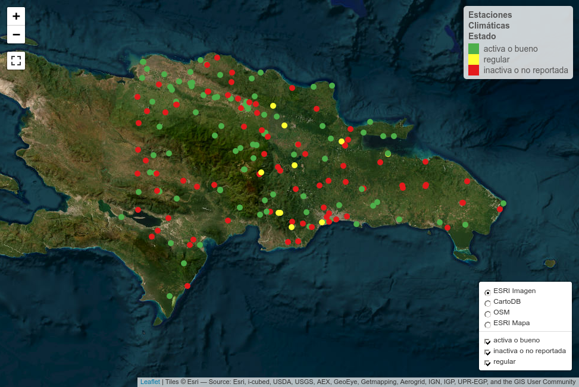<!-- -->

Mapa de estaciones hidrométricas según estado

``` r
leaflet(consolidado_sf %>% filter(tipo == 'hidrométrica')) %>%
  addCircleMarkers(
    radius = 5, group = ~ Estado,
    popup = ~ paste0('Entidad: ', entidad, '<br>Nombre: ', Nombre, '<br>Estado: ', Estado),
    color = ~ fpal_estado(Estado),
    stroke = F, fillOpacity = 1
  ) %>%
  addLegend(pal = fpal_estado, values = ~ Estado, opacity = 1,
            title = "Estaciones<br>Hidrométricas<br>Estado") %>% 
  addTiles(group = 'OSM') %>%
  addProviderTiles("Esri.NatGeoWorldMap", group="ESRI Mapa") %>%
  addProviderTiles("Esri.WorldImagery", group="ESRI Imagen") %>%
  addProviderTiles("CartoDB.Positron", group= "CartoDB") %>%
  addLayersControl(
    baseGroups = c("ESRI Imagen", "CartoDB", "OSM", "ESRI Mapa"),
    overlayGroups = ~ Estado, position = 'bottomright',
    options = layersControlOptions(collapsed = FALSE)) %>% 
  leaflet_map_view %>% 
  addFullscreenControl()
```

<!-- -->

Mapa de estaciones climáticas según propiedad

``` r
fpal_propiedad <- colorFactor(
  palette = c("#f1a340", "#998ec3"),
  domain = unique(consolidado_sf$propiedad))
leaflet(consolidado_sf %>% filter(tipo == 'meteoclimática')) %>%
  addCircleMarkers(
    radius = 5, group = ~ propiedad,
    popup = ~ paste0('Entidad: ', entidad, '<br>Nombre: ', Nombre, '<br>Estado: ', Estado),
    color = ~ fpal_propiedad(propiedad),
    stroke = F, fillOpacity = 1
  ) %>%
  addLegend(pal = fpal_propiedad, values = ~ propiedad, opacity = 1,
            title = "Estaciones<br>Climáticas<br>Propiedad") %>% 
  addTiles(group = 'OSM') %>%
  addProviderTiles("Esri.NatGeoWorldMap", group="ESRI Mapa") %>%
  addProviderTiles("Esri.WorldImagery", group="ESRI Imagen") %>%
  addProviderTiles("CartoDB.Positron", group= "CartoDB") %>%
  addLayersControl(
    baseGroups = c("ESRI Imagen", "CartoDB", "OSM", "ESRI Mapa"),
    overlayGroups = ~ propiedad, position = 'bottomright',
    options = layersControlOptions(collapsed = FALSE)) %>% 
  leaflet_map_view %>% 
  addFullscreenControl()
```

<!-- -->

Mapa de estaciones hidrométricas según propiedad (Yaque vendría aquí)

``` r
leaflet(consolidado_sf %>% filter(tipo == 'hidrométrica')) %>%
  addCircleMarkers(
    radius = 5, group = ~ propiedad,
    popup = ~ paste0('Entidad: ', entidad, '<br>Nombre: ', Nombre, '<br>Estado: ', Estado),
    color = ~ fpal_propiedad(propiedad),
    stroke = F, fillOpacity = 1
  ) %>%
  addLegend(pal = fpal_propiedad, values = ~ propiedad, opacity = 1,
            title = "Estaciones<br>Climáticas<br>Propiedad") %>% 
  addTiles(group = 'OSM') %>%
  addProviderTiles("Esri.NatGeoWorldMap", group="ESRI Mapa") %>%
  addProviderTiles("Esri.WorldImagery", group="ESRI Imagen") %>%
  addProviderTiles("CartoDB.Positron", group= "CartoDB") %>%
  addLayersControl(
    baseGroups = c("ESRI Imagen", "CartoDB", "OSM", "ESRI Mapa"),
    overlayGroups = ~ propiedad, position = 'bottomright',
    options = layersControlOptions(collapsed = FALSE)) %>% 
  leaflet_map_view %>% 
  addFullscreenControl()
```

<!-- -->

Mapa de estaciones climáticas según entidad

``` r
fpal_entidad <- colorFactor(
  palette = RColorBrewer::brewer.pal(length(unique(consolidado_sf$entidad)), 'Set1'),
  domain = unique(consolidado_sf$entidad))
leaflet(consolidado_sf %>% filter(tipo == 'meteoclimática')) %>%
  addCircleMarkers(
    radius = 5, group = ~ entidad,
    popup = ~ paste0('Entidad: ', entidad, '<br>Nombre: ', Nombre, '<br>Estado: ', Estado),
    color = ~ fpal_entidad(entidad),
    stroke = F, fillOpacity = 1
  ) %>%
  addLegend(pal = fpal_entidad, values = ~ entidad, opacity = 1,
            title = "Estaciones<br>Climáticas<br>Entidad") %>% 
  addTiles(group = 'OSM') %>%
  addProviderTiles("Esri.NatGeoWorldMap", group="ESRI Mapa") %>%
  addProviderTiles("Esri.WorldImagery", group="ESRI Imagen") %>%
  addProviderTiles("CartoDB.Positron", group= "CartoDB") %>%
  addLayersControl(
    baseGroups = c("ESRI Imagen", "CartoDB", "OSM", "ESRI Mapa"),
    overlayGroups = ~ entidad, position = 'bottomright',
    options = layersControlOptions(collapsed = FALSE)) %>% 
  leaflet_map_view %>% 
  addFullscreenControl()
```

<!-- -->

Mapa de estaciones hidrométricas según entidad

``` r
leaflet(consolidado_sf %>% filter(tipo == 'hidrométrica')) %>%
  addCircleMarkers(
    radius = 5, group = ~ entidad,
    popup = ~ paste0('Entidad: ', entidad, '<br>Nombre: ', Nombre, '<br>Estado: ', Estado),
    color = ~ fpal_entidad(entidad),
    stroke = F, fillOpacity = 1
  ) %>%
  addLegend(pal = fpal_entidad, values = ~ entidad, opacity = 1,
            title = "Estaciones<br>Hidrométricas<br>Entidad") %>% 
  addTiles(group = 'OSM') %>%
  addProviderTiles("Esri.NatGeoWorldMap", group="ESRI Mapa") %>%
  addProviderTiles("Esri.WorldImagery", group="ESRI Imagen") %>%
  addProviderTiles("CartoDB.Positron", group= "CartoDB") %>%
  addLayersControl(
    baseGroups = c("ESRI Imagen", "CartoDB", "OSM", "ESRI Mapa"),
    overlayGroups = ~ entidad, position = 'bottomright',
    options = layersControlOptions(collapsed = FALSE)) %>% 
  leaflet_map_view %>% 
  addFullscreenControl()
```

<!-- -->

Mapas individuales de estaciones climáticas por entidades según estado

``` r
ruta_ez_gh <- 'https://raw.githubusercontent.com/geofis/zonal-statistics/'
ez_ver <- 'd7f79365168e688f0d78f521e53fbf2da19244ef/'
pais_url <- paste0(ruta_ez_gh, ez_ver, 'inst/extdata/dr.gpkg')
pais <- invisible(st_read(pais_url, optional = T, layer = 'pais', quiet = T))
st_geometry(pais) <- "geometry"
map(unique(consolidado_sf %>% filter(tipo == 'meteoclimática') %>% pull(entidad)),
    function(x) {
      consolidado_sf %>% filter(entidad == x & tipo == 'meteoclimática') %>% 
      ggplot +
        geom_sf(data = pais, fill = 'transparent', color = 'grey50') +
        geom_sf(alpha = 0.8, aes(fill = Estado), shape = 21, size = 1.5) +
        scale_fill_manual(values = c('activa o bueno'='green', 'regular' = 'yellow', 'inactiva o no reportada' = 'red')) +
        labs(title = paste0('Estaciones climáticas de ', x)) +
       theme_bw() + 
       ggspatial::annotation_scale(style = 'ticks') +
       theme(legend.title = element_blank()) 
    })
```

    ## [[1]]

<!-- -->

    ## 
    ## [[2]]

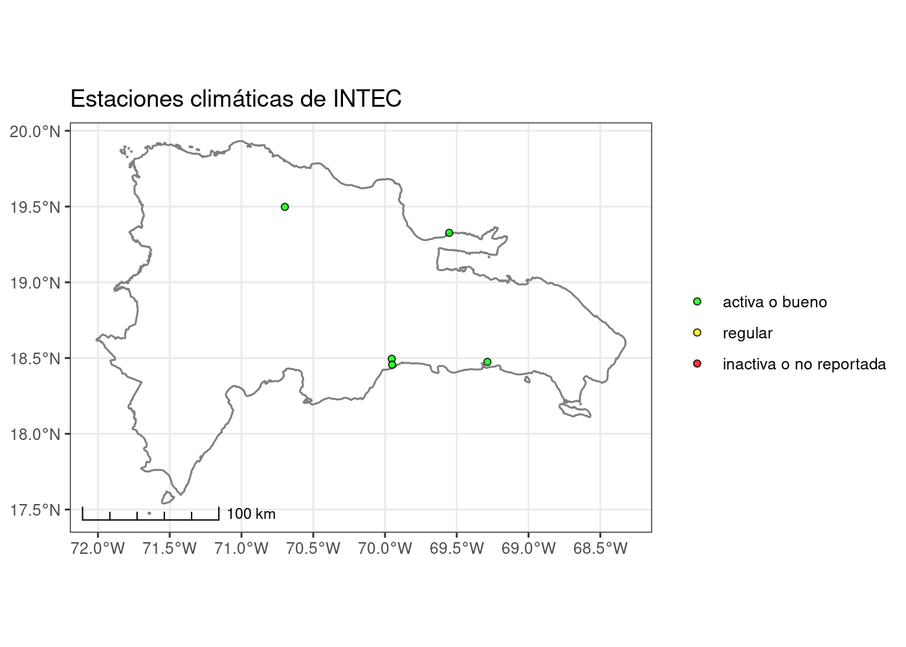<!-- -->

    ## 
    ## [[3]]

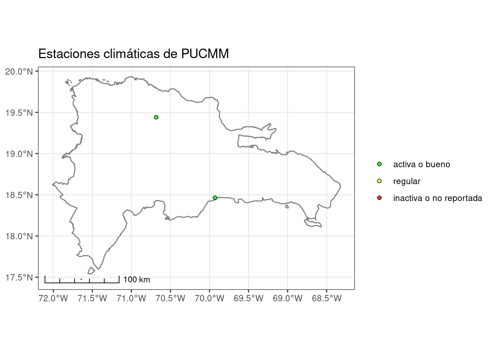<!-- -->

    ## 
    ## [[4]]

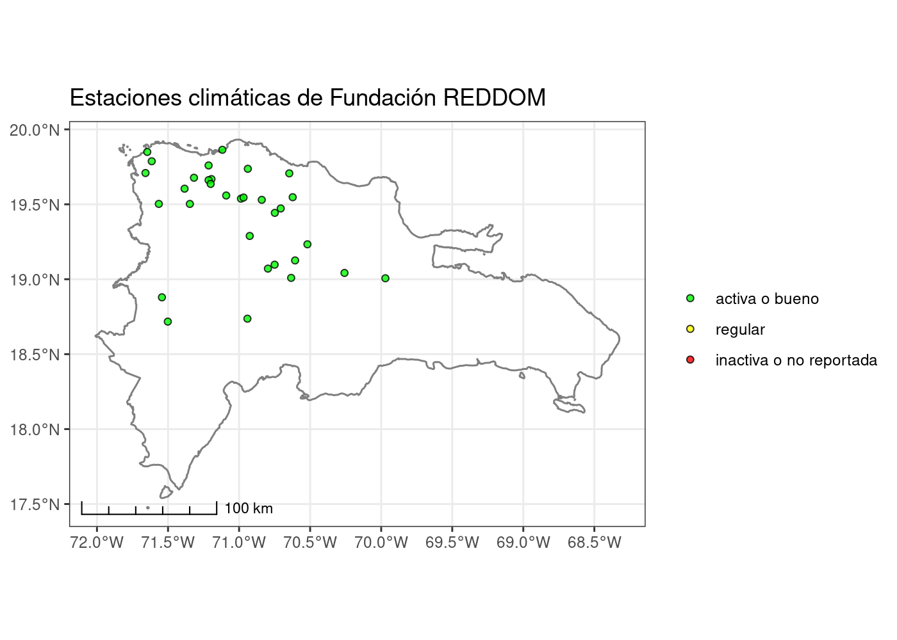<!-- -->

    ## 
    ## [[5]]

<!-- -->

    ## 
    ## [[6]]

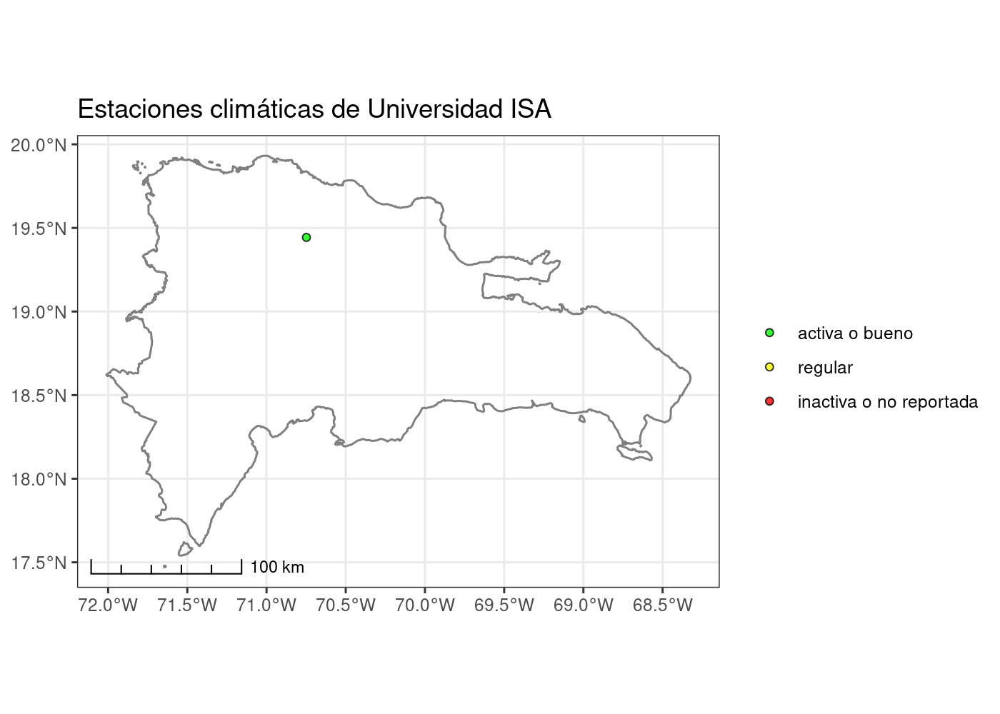<!-- -->

    ## 
    ## [[7]]

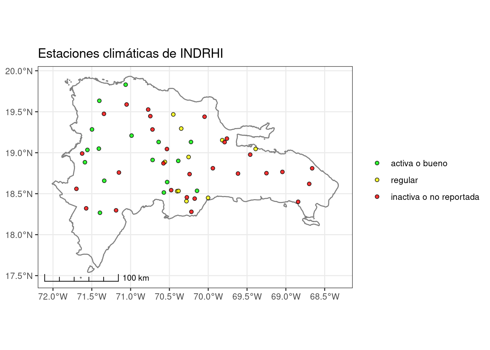<!-- -->

    ## 
    ## [[8]]

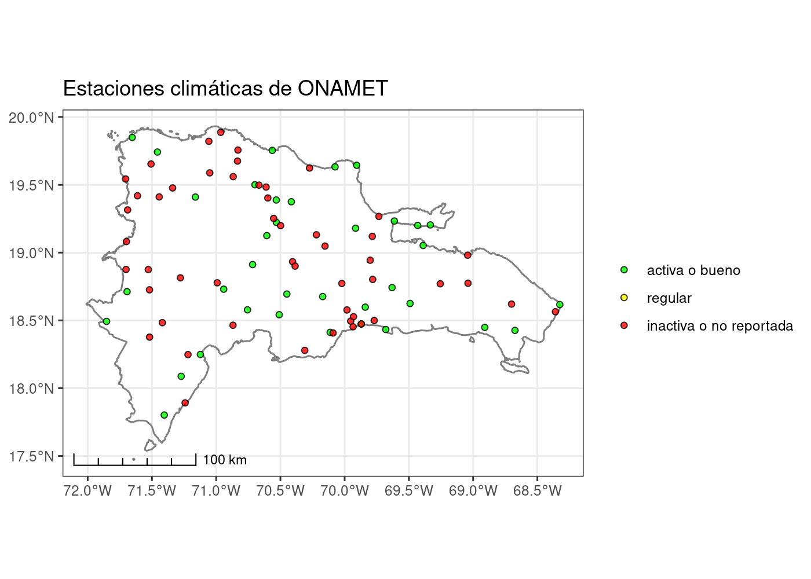<!-- -->

Mapa individuales de estaciones pluviométricas por entidades según
estado

``` r
map(unique(consolidado_sf %>% filter(tipo == 'pluviométrica') %>% pull(entidad)),
    function(x) {
      consolidado_sf %>% filter(entidad == x & tipo == 'pluviométrica') %>% 
      ggplot +
        geom_sf(data = pais, fill = 'transparent', color = 'grey50') +
        geom_sf(alpha = 0.8, aes(fill = Estado), shape = 21, size = 1.5) +
        scale_fill_manual(values = c('activa o bueno'='green', 'regular' = 'yellow', 'inactiva o no reportada' = 'red')) +
        labs(title = paste0('Estaciones pluviométricas de ', x)) +
       theme_bw() + 
       ggspatial::annotation_scale(style = 'ticks') +
       theme(legend.title = element_blank()) 
    })
```

    ## [[1]]

<!-- -->

Mapas individuales de estaciones hidrométricas por entidades según
estado

``` r
map(unique(consolidado_sf %>% filter(tipo == 'hidrométrica') %>% pull(entidad)),
    function(x) {
      consolidado_sf %>% filter(entidad == x & tipo == 'hidrométrica') %>% 
      ggplot +
        geom_sf(data = pais, fill = 'transparent', color = 'grey50') +
        geom_sf(alpha = 0.8, aes(fill = Estado), shape = 21, size = 1.5) +
        scale_fill_manual(values = c('activa o bueno'='green', 'regular' = 'yellow', 'inactiva o no reportada' = 'red')) +
        labs(title = paste0('Estaciones hidrométricas de ', x)) +
       theme_bw() + 
       ggspatial::annotation_scale(style = 'ticks') +
       theme(legend.title = element_blank()) 
    })
```

    ## [[1]]

<!-- -->

    ## 
    ## [[2]]

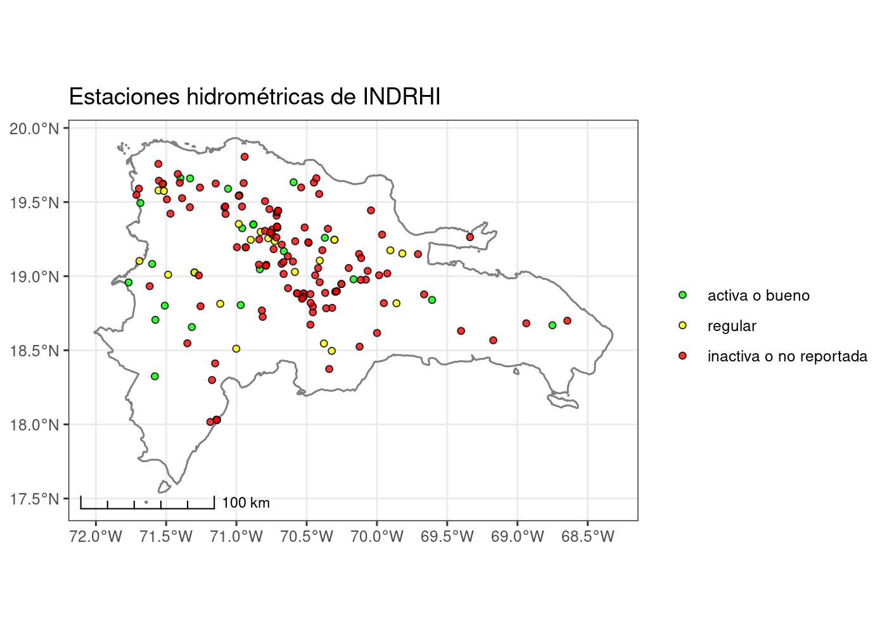<!-- -->

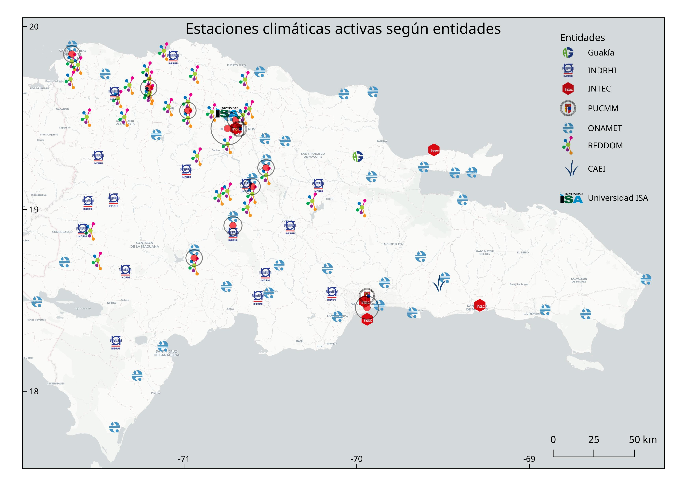


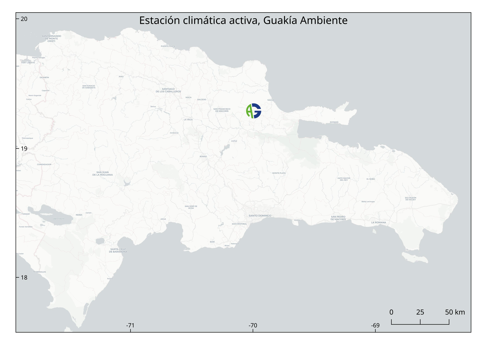

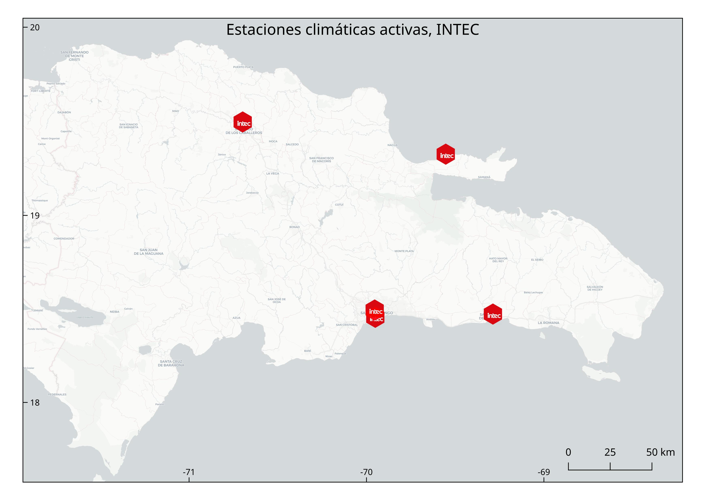


Impresión de tabla resumen

``` r
consolidado_sf %>% st_drop_geometry %>%
  select(entidad, tipo, Estado) %>% 
  group_by_all() %>% 
  count() %>% 
  pivot_wider(names_from = tipo, values_from = n, values_fill = 0) %>% 
  adorn_totals(c('row', 'col')) %>% 
  kable(booktabs=T) %>%
  kable_styling(latex_options = c("HOLD_position", "scale_down")) %>%
  gsub(' NA ', '', .)
```

<table class="table" style="margin-left: auto; margin-right: auto;">
<thead>
<tr>
<th style="text-align:left;">
entidad
</th>
<th style="text-align:left;">
Estado
</th>
<th style="text-align:right;">
meteoclimática
</th>
<th style="text-align:right;">
pluviométrica
</th>
<th style="text-align:right;">
hidrométrica
</th>
<th style="text-align:right;">
Total
</th>
</tr>
</thead>
<tbody>
<tr>
<td style="text-align:left;">
CAEI
</td>
<td style="text-align:left;">
activa o bueno
</td>
<td style="text-align:right;">
1
</td>
<td style="text-align:right;">
95
</td>
<td style="text-align:right;">
0
</td>
<td style="text-align:right;">
96
</td>
</tr>
<tr>
<td style="text-align:left;">
Fundación REDDOM
</td>
<td style="text-align:left;">
activa o bueno
</td>
<td style="text-align:right;">
32
</td>
<td style="text-align:right;">
0
</td>
<td style="text-align:right;">
0
</td>
<td style="text-align:right;">
32
</td>
</tr>
<tr>
<td style="text-align:left;">
Guakía Ambiente
</td>
<td style="text-align:left;">
activa o bueno
</td>
<td style="text-align:right;">
1
</td>
<td style="text-align:right;">
0
</td>
<td style="text-align:right;">
0
</td>
<td style="text-align:right;">
1
</td>
</tr>
<tr>
<td style="text-align:left;">
INDRHI
</td>
<td style="text-align:left;">
activa o bueno
</td>
<td style="text-align:right;">
16
</td>
<td style="text-align:right;">
0
</td>
<td style="text-align:right;">
26
</td>
<td style="text-align:right;">
42
</td>
</tr>
<tr>
<td style="text-align:left;">
INDRHI
</td>
<td style="text-align:left;">
regular
</td>
<td style="text-align:right;">
10
</td>
<td style="text-align:right;">
0
</td>
<td style="text-align:right;">
22
</td>
<td style="text-align:right;">
32
</td>
</tr>
<tr>
<td style="text-align:left;">
INDRHI
</td>
<td style="text-align:left;">
inactiva o no reportada
</td>
<td style="text-align:right;">
28
</td>
<td style="text-align:right;">
0
</td>
<td style="text-align:right;">
118
</td>
<td style="text-align:right;">
146
</td>
</tr>
<tr>
<td style="text-align:left;">
INTEC
</td>
<td style="text-align:left;">
activa o bueno
</td>
<td style="text-align:right;">
5
</td>
<td style="text-align:right;">
0
</td>
<td style="text-align:right;">
0
</td>
<td style="text-align:right;">
5
</td>
</tr>
<tr>
<td style="text-align:left;">
ONAMET
</td>
<td style="text-align:left;">
activa o bueno
</td>
<td style="text-align:right;">
36
</td>
<td style="text-align:right;">
0
</td>
<td style="text-align:right;">
0
</td>
<td style="text-align:right;">
36
</td>
</tr>
<tr>
<td style="text-align:left;">
ONAMET
</td>
<td style="text-align:left;">
inactiva o no reportada
</td>
<td style="text-align:right;">
51
</td>
<td style="text-align:right;">
0
</td>
<td style="text-align:right;">
0
</td>
<td style="text-align:right;">
51
</td>
</tr>
<tr>
<td style="text-align:left;">
PUCMM
</td>
<td style="text-align:left;">
activa o bueno
</td>
<td style="text-align:right;">
2
</td>
<td style="text-align:right;">
0
</td>
<td style="text-align:right;">
0
</td>
<td style="text-align:right;">
2
</td>
</tr>
<tr>
<td style="text-align:left;">
SGN
</td>
<td style="text-align:left;">
activa o bueno
</td>
<td style="text-align:right;">
0
</td>
<td style="text-align:right;">
0
</td>
<td style="text-align:right;">
2
</td>
<td style="text-align:right;">
2
</td>
</tr>
<tr>
<td style="text-align:left;">
Universidad ISA
</td>
<td style="text-align:left;">
activa o bueno
</td>
<td style="text-align:right;">
1
</td>
<td style="text-align:right;">
0
</td>
<td style="text-align:right;">
0
</td>
<td style="text-align:right;">
1
</td>
</tr>
<tr>
<td style="text-align:left;">
Total
</td>
<td style="text-align:left;">

- </td>
  <td style="text-align:right;">
  183
  </td>
  <td style="text-align:right;">
  95
  </td>
  <td style="text-align:right;">
  168
  </td>
  <td style="text-align:right;">
  446
  </td>
  </tr>
  </tbody>
  </table>

Impresión de tabla exhaustiva

``` r
consolidado_sf %>% st_drop_geometry %>%
  arrange(entidad) %>% 
  kable(booktabs=T) %>%
  kable_styling(latex_options = c("HOLD_position", "scale_down")) %>%
  gsub(' NA ', '', .)
```

<table class="table" style="margin-left: auto; margin-right: auto;">
<thead>
<tr>
<th style="text-align:left;">
Nombre
</th>
<th style="text-align:left;">
Estado
</th>
<th style="text-align:left;">
entidad
</th>
<th style="text-align:left;">
tipo
</th>
<th style="text-align:left;">
propiedad
</th>
<th style="text-align:right;">
Longtiud
</th>
<th style="text-align:right;">
Latitud
</th>
</tr>
</thead>
<tbody>
<tr>
<td style="text-align:left;">
</td>
<td style="text-align:left;">
activa o bueno
</td>
<td style="text-align:left;">
CAEI
</td>
<td style="text-align:left;">
pluviométrica
</td>
<td style="text-align:left;">
privada
</td>
<td style="text-align:right;">
-69.21889
</td>
<td style="text-align:right;">
18.55294
</td>
</tr>
<tr>
<td style="text-align:left;">
</td>
<td style="text-align:left;">
activa o bueno
</td>
<td style="text-align:left;">
CAEI
</td>
<td style="text-align:left;">
pluviométrica
</td>
<td style="text-align:left;">
privada
</td>
<td style="text-align:right;">
-69.18947
</td>
<td style="text-align:right;">
18.55230
</td>
</tr>
<tr>
<td style="text-align:left;">
</td>
<td style="text-align:left;">
activa o bueno
</td>
<td style="text-align:left;">
CAEI
</td>
<td style="text-align:left;">
pluviométrica
</td>
<td style="text-align:left;">
privada
</td>
<td style="text-align:right;">
-69.19707
</td>
<td style="text-align:right;">
18.57829
</td>
</tr>
<tr>
<td style="text-align:left;">
</td>
<td style="text-align:left;">
activa o bueno
</td>
<td style="text-align:left;">
CAEI
</td>
<td style="text-align:left;">
pluviométrica
</td>
<td style="text-align:left;">
privada
</td>
<td style="text-align:right;">
-69.17892
</td>
<td style="text-align:right;">
18.59604
</td>
</tr>
<tr>
<td style="text-align:left;">
</td>
<td style="text-align:left;">
activa o bueno
</td>
<td style="text-align:left;">
CAEI
</td>
<td style="text-align:left;">
pluviométrica
</td>
<td style="text-align:left;">
privada
</td>
<td style="text-align:right;">
-69.17080
</td>
<td style="text-align:right;">
18.58076
</td>
</tr>
<tr>
<td style="text-align:left;">
</td>
<td style="text-align:left;">
activa o bueno
</td>
<td style="text-align:left;">
CAEI
</td>
<td style="text-align:left;">
pluviométrica
</td>
<td style="text-align:left;">
privada
</td>
<td style="text-align:right;">
-69.32054
</td>
<td style="text-align:right;">
18.52682
</td>
</tr>
<tr>
<td style="text-align:left;">
</td>
<td style="text-align:left;">
activa o bueno
</td>
<td style="text-align:left;">
CAEI
</td>
<td style="text-align:left;">
pluviométrica
</td>
<td style="text-align:left;">
privada
</td>
<td style="text-align:right;">
-69.32006
</td>
<td style="text-align:right;">
18.50352
</td>
</tr>
<tr>
<td style="text-align:left;">
</td>
<td style="text-align:left;">
activa o bueno
</td>
<td style="text-align:left;">
CAEI
</td>
<td style="text-align:left;">
pluviométrica
</td>
<td style="text-align:left;">
privada
</td>
<td style="text-align:right;">
-69.53086
</td>
<td style="text-align:right;">
18.68998
</td>
</tr>
<tr>
<td style="text-align:left;">
</td>
<td style="text-align:left;">
activa o bueno
</td>
<td style="text-align:left;">
CAEI
</td>
<td style="text-align:left;">
pluviométrica
</td>
<td style="text-align:left;">
privada
</td>
<td style="text-align:right;">
-69.59511
</td>
<td style="text-align:right;">
18.69934
</td>
</tr>
<tr>
<td style="text-align:left;">
</td>
<td style="text-align:left;">
activa o bueno
</td>
<td style="text-align:left;">
CAEI
</td>
<td style="text-align:left;">
pluviométrica
</td>
<td style="text-align:left;">
privada
</td>
<td style="text-align:right;">
-69.45967
</td>
<td style="text-align:right;">
18.49031
</td>
</tr>
<tr>
<td style="text-align:left;">
</td>
<td style="text-align:left;">
activa o bueno
</td>
<td style="text-align:left;">
CAEI
</td>
<td style="text-align:left;">
pluviométrica
</td>
<td style="text-align:left;">
privada
</td>
<td style="text-align:right;">
-69.58603
</td>
<td style="text-align:right;">
18.69027
</td>
</tr>
<tr>
<td style="text-align:left;">
</td>
<td style="text-align:left;">
activa o bueno
</td>
<td style="text-align:left;">
CAEI
</td>
<td style="text-align:left;">
pluviométrica
</td>
<td style="text-align:left;">
privada
</td>
<td style="text-align:right;">
-69.57901
</td>
<td style="text-align:right;">
18.67273
</td>
</tr>
<tr>
<td style="text-align:left;">
</td>
<td style="text-align:left;">
activa o bueno
</td>
<td style="text-align:left;">
CAEI
</td>
<td style="text-align:left;">
pluviométrica
</td>
<td style="text-align:left;">
privada
</td>
<td style="text-align:right;">
-69.61238
</td>
<td style="text-align:right;">
18.62924
</td>
</tr>
<tr>
<td style="text-align:left;">
</td>
<td style="text-align:left;">
activa o bueno
</td>
<td style="text-align:left;">
CAEI
</td>
<td style="text-align:left;">
pluviométrica
</td>
<td style="text-align:left;">
privada
</td>
<td style="text-align:right;">
-69.54196
</td>
<td style="text-align:right;">
18.65939
</td>
</tr>
<tr>
<td style="text-align:left;">
</td>
<td style="text-align:left;">
activa o bueno
</td>
<td style="text-align:left;">
CAEI
</td>
<td style="text-align:left;">
pluviométrica
</td>
<td style="text-align:left;">
privada
</td>
<td style="text-align:right;">
-69.55103
</td>
<td style="text-align:right;">
18.63020
</td>
</tr>
<tr>
<td style="text-align:left;">
</td>
<td style="text-align:left;">
activa o bueno
</td>
<td style="text-align:left;">
CAEI
</td>
<td style="text-align:left;">
pluviométrica
</td>
<td style="text-align:left;">
privada
</td>
<td style="text-align:right;">
-69.50963
</td>
<td style="text-align:right;">
18.58394
</td>
</tr>
<tr>
<td style="text-align:left;">
</td>
<td style="text-align:left;">
activa o bueno
</td>
<td style="text-align:left;">
CAEI
</td>
<td style="text-align:left;">
pluviométrica
</td>
<td style="text-align:left;">
privada
</td>
<td style="text-align:right;">
-69.48853
</td>
<td style="text-align:right;">
18.49636
</td>
</tr>
<tr>
<td style="text-align:left;">
</td>
<td style="text-align:left;">
activa o bueno
</td>
<td style="text-align:left;">
CAEI
</td>
<td style="text-align:left;">
pluviométrica
</td>
<td style="text-align:left;">
privada
</td>
<td style="text-align:right;">
-69.33381
</td>
<td style="text-align:right;">
18.46710
</td>
</tr>
<tr>
<td style="text-align:left;">
</td>
<td style="text-align:left;">
activa o bueno
</td>
<td style="text-align:left;">
CAEI
</td>
<td style="text-align:left;">
pluviométrica
</td>
<td style="text-align:left;">
privada
</td>
<td style="text-align:right;">
-69.33716
</td>
<td style="text-align:right;">
18.46023
</td>
</tr>
<tr>
<td style="text-align:left;">
</td>
<td style="text-align:left;">
activa o bueno
</td>
<td style="text-align:left;">
CAEI
</td>
<td style="text-align:left;">
pluviométrica
</td>
<td style="text-align:left;">
privada
</td>
<td style="text-align:right;">
-69.36816
</td>
<td style="text-align:right;">
18.48667
</td>
</tr>
<tr>
<td style="text-align:left;">
</td>
<td style="text-align:left;">
activa o bueno
</td>
<td style="text-align:left;">
CAEI
</td>
<td style="text-align:left;">
pluviométrica
</td>
<td style="text-align:left;">
privada
</td>
<td style="text-align:right;">
-69.23283
</td>
<td style="text-align:right;">
18.51922
</td>
</tr>
<tr>
<td style="text-align:left;">
</td>
<td style="text-align:left;">
activa o bueno
</td>
<td style="text-align:left;">
CAEI
</td>
<td style="text-align:left;">
pluviométrica
</td>
<td style="text-align:left;">
privada
</td>
<td style="text-align:right;">
-69.55671
</td>
<td style="text-align:right;">
18.60408
</td>
</tr>
<tr>
<td style="text-align:left;">
</td>
<td style="text-align:left;">
activa o bueno
</td>
<td style="text-align:left;">
CAEI
</td>
<td style="text-align:left;">
pluviométrica
</td>
<td style="text-align:left;">
privada
</td>
<td style="text-align:right;">
-69.48490
</td>
<td style="text-align:right;">
18.57442
</td>
</tr>
<tr>
<td style="text-align:left;">
</td>
<td style="text-align:left;">
activa o bueno
</td>
<td style="text-align:left;">
CAEI
</td>
<td style="text-align:left;">
pluviométrica
</td>
<td style="text-align:left;">
privada
</td>
<td style="text-align:right;">
-69.49747
</td>
<td style="text-align:right;">
18.50183
</td>
</tr>
<tr>
<td style="text-align:left;">
</td>
<td style="text-align:left;">
activa o bueno
</td>
<td style="text-align:left;">
CAEI
</td>
<td style="text-align:left;">
pluviométrica
</td>
<td style="text-align:left;">
privada
</td>
<td style="text-align:right;">
-69.23041
</td>
<td style="text-align:right;">
18.53580
</td>
</tr>
<tr>
<td style="text-align:left;">
</td>
<td style="text-align:left;">
activa o bueno
</td>
<td style="text-align:left;">
CAEI
</td>
<td style="text-align:left;">
pluviométrica
</td>
<td style="text-align:left;">
privada
</td>
<td style="text-align:right;">
-69.22398
</td>
<td style="text-align:right;">
18.65683
</td>
</tr>
<tr>
<td style="text-align:left;">
</td>
<td style="text-align:left;">
activa o bueno
</td>
<td style="text-align:left;">
CAEI
</td>
<td style="text-align:left;">
pluviométrica
</td>
<td style="text-align:left;">
privada
</td>
<td style="text-align:right;">
-69.62645
</td>
<td style="text-align:right;">
18.68470
</td>
</tr>
<tr>
<td style="text-align:left;">
</td>
<td style="text-align:left;">
activa o bueno
</td>
<td style="text-align:left;">
CAEI
</td>
<td style="text-align:left;">
pluviométrica
</td>
<td style="text-align:left;">
privada
</td>
<td style="text-align:right;">
-69.59897
</td>
<td style="text-align:right;">
18.67025
</td>
</tr>
<tr>
<td style="text-align:left;">
</td>
<td style="text-align:left;">
activa o bueno
</td>
<td style="text-align:left;">
CAEI
</td>
<td style="text-align:left;">
pluviométrica
</td>
<td style="text-align:left;">
privada
</td>
<td style="text-align:right;">
-69.18396
</td>
<td style="text-align:right;">
18.60210
</td>
</tr>
<tr>
<td style="text-align:left;">
</td>
<td style="text-align:left;">
activa o bueno
</td>
<td style="text-align:left;">
CAEI
</td>
<td style="text-align:left;">
pluviométrica
</td>
<td style="text-align:left;">
privada
</td>
<td style="text-align:right;">
-69.32054
</td>
<td style="text-align:right;">
18.52682
</td>
</tr>
<tr>
<td style="text-align:left;">
</td>
<td style="text-align:left;">
activa o bueno
</td>
<td style="text-align:left;">
CAEI
</td>
<td style="text-align:left;">
pluviométrica
</td>
<td style="text-align:left;">
privada
</td>
<td style="text-align:right;">
-69.56018
</td>
<td style="text-align:right;">
18.69046
</td>
</tr>
<tr>
<td style="text-align:left;">
</td>
<td style="text-align:left;">
activa o bueno
</td>
<td style="text-align:left;">
CAEI
</td>
<td style="text-align:left;">
pluviométrica
</td>
<td style="text-align:left;">
privada
</td>
<td style="text-align:right;">
-69.27009
</td>
<td style="text-align:right;">
18.59312
</td>
</tr>
<tr>
<td style="text-align:left;">
</td>
<td style="text-align:left;">
activa o bueno
</td>
<td style="text-align:left;">
CAEI
</td>
<td style="text-align:left;">
pluviométrica
</td>
<td style="text-align:left;">
privada
</td>
<td style="text-align:right;">
-69.46264
</td>
<td style="text-align:right;">
18.51042
</td>
</tr>
<tr>
<td style="text-align:left;">
</td>
<td style="text-align:left;">
activa o bueno
</td>
<td style="text-align:left;">
CAEI
</td>
<td style="text-align:left;">
pluviométrica
</td>
<td style="text-align:left;">
privada
</td>
<td style="text-align:right;">
-69.43877
</td>
<td style="text-align:right;">
18.51227
</td>
</tr>
<tr>
<td style="text-align:left;">
</td>
<td style="text-align:left;">
activa o bueno
</td>
<td style="text-align:left;">
CAEI
</td>
<td style="text-align:left;">
pluviométrica
</td>
<td style="text-align:left;">
privada
</td>
<td style="text-align:right;">
-69.39803
</td>
<td style="text-align:right;">
18.51268
</td>
</tr>
<tr>
<td style="text-align:left;">
</td>
<td style="text-align:left;">
activa o bueno
</td>
<td style="text-align:left;">
CAEI
</td>
<td style="text-align:left;">
pluviométrica
</td>
<td style="text-align:left;">
privada
</td>
<td style="text-align:right;">
-69.53803
</td>
<td style="text-align:right;">
18.59163
</td>
</tr>
<tr>
<td style="text-align:left;">
</td>
<td style="text-align:left;">
activa o bueno
</td>
<td style="text-align:left;">
CAEI
</td>
<td style="text-align:left;">
pluviométrica
</td>
<td style="text-align:left;">
privada
</td>
<td style="text-align:right;">
-69.52501
</td>
<td style="text-align:right;">
18.59315
</td>
</tr>
<tr>
<td style="text-align:left;">
</td>
<td style="text-align:left;">
activa o bueno
</td>
<td style="text-align:left;">
CAEI
</td>
<td style="text-align:left;">
pluviométrica
</td>
<td style="text-align:left;">
privada
</td>
<td style="text-align:right;">
-69.22686
</td>
<td style="text-align:right;">
18.53883
</td>
</tr>
<tr>
<td style="text-align:left;">
</td>
<td style="text-align:left;">
activa o bueno
</td>
<td style="text-align:left;">
CAEI
</td>
<td style="text-align:left;">
pluviométrica
</td>
<td style="text-align:left;">
privada
</td>
<td style="text-align:right;">
-69.53132
</td>
<td style="text-align:right;">
18.66737
</td>
</tr>
<tr>
<td style="text-align:left;">
</td>
<td style="text-align:left;">
activa o bueno
</td>
<td style="text-align:left;">
CAEI
</td>
<td style="text-align:left;">
pluviométrica
</td>
<td style="text-align:left;">
privada
</td>
<td style="text-align:right;">
-69.51958
</td>
<td style="text-align:right;">
18.63589
</td>
</tr>
<tr>
<td style="text-align:left;">
</td>
<td style="text-align:left;">
activa o bueno
</td>
<td style="text-align:left;">
CAEI
</td>
<td style="text-align:left;">
pluviométrica
</td>
<td style="text-align:left;">
privada
</td>
<td style="text-align:right;">
-69.52051
</td>
<td style="text-align:right;">
18.59256
</td>
</tr>
<tr>
<td style="text-align:left;">
</td>
<td style="text-align:left;">
activa o bueno
</td>
<td style="text-align:left;">
CAEI
</td>
<td style="text-align:left;">
pluviométrica
</td>
<td style="text-align:left;">
privada
</td>
<td style="text-align:right;">
-69.27129
</td>
<td style="text-align:right;">
18.52132
</td>
</tr>
<tr>
<td style="text-align:left;">
</td>
<td style="text-align:left;">
activa o bueno
</td>
<td style="text-align:left;">
CAEI
</td>
<td style="text-align:left;">
pluviométrica
</td>
<td style="text-align:left;">
privada
</td>
<td style="text-align:right;">
-69.55889
</td>
<td style="text-align:right;">
18.62121
</td>
</tr>
<tr>
<td style="text-align:left;">
</td>
<td style="text-align:left;">
activa o bueno
</td>
<td style="text-align:left;">
CAEI
</td>
<td style="text-align:left;">
pluviométrica
</td>
<td style="text-align:left;">
privada
</td>
<td style="text-align:right;">
-69.56821
</td>
<td style="text-align:right;">
18.66182
</td>
</tr>
<tr>
<td style="text-align:left;">
</td>
<td style="text-align:left;">
activa o bueno
</td>
<td style="text-align:left;">
CAEI
</td>
<td style="text-align:left;">
pluviométrica
</td>
<td style="text-align:left;">
privada
</td>
<td style="text-align:right;">
-69.60786
</td>
<td style="text-align:right;">
18.58096
</td>
</tr>
<tr>
<td style="text-align:left;">
</td>
<td style="text-align:left;">
activa o bueno
</td>
<td style="text-align:left;">
CAEI
</td>
<td style="text-align:left;">
pluviométrica
</td>
<td style="text-align:left;">
privada
</td>
<td style="text-align:right;">
-69.23799
</td>
<td style="text-align:right;">
18.54002
</td>
</tr>
<tr>
<td style="text-align:left;">
</td>
<td style="text-align:left;">
activa o bueno
</td>
<td style="text-align:left;">
CAEI
</td>
<td style="text-align:left;">
pluviométrica
</td>
<td style="text-align:left;">
privada
</td>
<td style="text-align:right;">
-70.17930
</td>
<td style="text-align:right;">
18.32100
</td>
</tr>
<tr>
<td style="text-align:left;">
</td>
<td style="text-align:left;">
activa o bueno
</td>
<td style="text-align:left;">
CAEI
</td>
<td style="text-align:left;">
pluviométrica
</td>
<td style="text-align:left;">
privada
</td>
<td style="text-align:right;">
-70.20280
</td>
<td style="text-align:right;">
18.30830
</td>
</tr>
<tr>
<td style="text-align:left;">
</td>
<td style="text-align:left;">
activa o bueno
</td>
<td style="text-align:left;">
CAEI
</td>
<td style="text-align:left;">
pluviométrica
</td>
<td style="text-align:left;">
privada
</td>
<td style="text-align:right;">
-70.19860
</td>
<td style="text-align:right;">
18.33960
</td>
</tr>
<tr>
<td style="text-align:left;">
</td>
<td style="text-align:left;">
activa o bueno
</td>
<td style="text-align:left;">
CAEI
</td>
<td style="text-align:left;">
pluviométrica
</td>
<td style="text-align:left;">
privada
</td>
<td style="text-align:right;">
-70.22170
</td>
<td style="text-align:right;">
18.32930
</td>
</tr>
<tr>
<td style="text-align:left;">
</td>
<td style="text-align:left;">
activa o bueno
</td>
<td style="text-align:left;">
CAEI
</td>
<td style="text-align:left;">
pluviométrica
</td>
<td style="text-align:left;">
privada
</td>
<td style="text-align:right;">
-70.22770
</td>
<td style="text-align:right;">
18.27830
</td>
</tr>
<tr>
<td style="text-align:left;">
</td>
<td style="text-align:left;">
activa o bueno
</td>
<td style="text-align:left;">
CAEI
</td>
<td style="text-align:left;">
pluviométrica
</td>
<td style="text-align:left;">
privada
</td>
<td style="text-align:right;">
-70.24450
</td>
<td style="text-align:right;">
18.25720
</td>
</tr>
<tr>
<td style="text-align:left;">
</td>
<td style="text-align:left;">
activa o bueno
</td>
<td style="text-align:left;">
CAEI
</td>
<td style="text-align:left;">
pluviométrica
</td>
<td style="text-align:left;">
privada
</td>
<td style="text-align:right;">
-70.24698
</td>
<td style="text-align:right;">
18.24269
</td>
</tr>
<tr>
<td style="text-align:left;">
</td>
<td style="text-align:left;">
activa o bueno
</td>
<td style="text-align:left;">
CAEI
</td>
<td style="text-align:left;">
pluviométrica
</td>
<td style="text-align:left;">
privada
</td>
<td style="text-align:right;">
-70.18782
</td>
<td style="text-align:right;">
18.35632
</td>
</tr>
<tr>
<td style="text-align:left;">
</td>
<td style="text-align:left;">
activa o bueno
</td>
<td style="text-align:left;">
CAEI
</td>
<td style="text-align:left;">
pluviométrica
</td>
<td style="text-align:left;">
privada
</td>
<td style="text-align:right;">
-70.16364
</td>
<td style="text-align:right;">
18.33952
</td>
</tr>
<tr>
<td style="text-align:left;">
</td>
<td style="text-align:left;">
activa o bueno
</td>
<td style="text-align:left;">
CAEI
</td>
<td style="text-align:left;">
pluviométrica
</td>
<td style="text-align:left;">
privada
</td>
<td style="text-align:right;">
-69.62263
</td>
<td style="text-align:right;">
18.64301
</td>
</tr>
<tr>
<td style="text-align:left;">
</td>
<td style="text-align:left;">
activa o bueno
</td>
<td style="text-align:left;">
CAEI
</td>
<td style="text-align:left;">
pluviométrica
</td>
<td style="text-align:left;">
privada
</td>
<td style="text-align:right;">
-69.41818
</td>
<td style="text-align:right;">
18.54273
</td>
</tr>
<tr>
<td style="text-align:left;">
</td>
<td style="text-align:left;">
activa o bueno
</td>
<td style="text-align:left;">
CAEI
</td>
<td style="text-align:left;">
pluviométrica
</td>
<td style="text-align:left;">
privada
</td>
<td style="text-align:right;">
-69.48588
</td>
<td style="text-align:right;">
18.55482
</td>
</tr>
<tr>
<td style="text-align:left;">
</td>
<td style="text-align:left;">
activa o bueno
</td>
<td style="text-align:left;">
CAEI
</td>
<td style="text-align:left;">
pluviométrica
</td>
<td style="text-align:left;">
privada
</td>
<td style="text-align:right;">
-69.42933
</td>
<td style="text-align:right;">
18.55270
</td>
</tr>
<tr>
<td style="text-align:left;">
</td>
<td style="text-align:left;">
activa o bueno
</td>
<td style="text-align:left;">
CAEI
</td>
<td style="text-align:left;">
pluviométrica
</td>
<td style="text-align:left;">
privada
</td>
<td style="text-align:right;">
-69.42797
</td>
<td style="text-align:right;">
18.57315
</td>
</tr>
<tr>
<td style="text-align:left;">
</td>
<td style="text-align:left;">
activa o bueno
</td>
<td style="text-align:left;">
CAEI
</td>
<td style="text-align:left;">
pluviométrica
</td>
<td style="text-align:left;">
privada
</td>
<td style="text-align:right;">
-69.40927
</td>
<td style="text-align:right;">
18.57943
</td>
</tr>
<tr>
<td style="text-align:left;">
</td>
<td style="text-align:left;">
activa o bueno
</td>
<td style="text-align:left;">
CAEI
</td>
<td style="text-align:left;">
pluviométrica
</td>
<td style="text-align:left;">
privada
</td>
<td style="text-align:right;">
-69.43684
</td>
<td style="text-align:right;">
18.64077
</td>
</tr>
<tr>
<td style="text-align:left;">
</td>
<td style="text-align:left;">
activa o bueno
</td>
<td style="text-align:left;">
CAEI
</td>
<td style="text-align:left;">
pluviométrica
</td>
<td style="text-align:left;">
privada
</td>
<td style="text-align:right;">
-69.43904
</td>
<td style="text-align:right;">
18.67101
</td>
</tr>
<tr>
<td style="text-align:left;">
</td>
<td style="text-align:left;">
activa o bueno
</td>
<td style="text-align:left;">
CAEI
</td>
<td style="text-align:left;">
pluviométrica
</td>
<td style="text-align:left;">
privada
</td>
<td style="text-align:right;">
-69.42010
</td>
<td style="text-align:right;">
18.61537
</td>
</tr>
<tr>
<td style="text-align:left;">
</td>
<td style="text-align:left;">
activa o bueno
</td>
<td style="text-align:left;">
CAEI
</td>
<td style="text-align:left;">
pluviométrica
</td>
<td style="text-align:left;">
privada
</td>
<td style="text-align:right;">
-69.44632
</td>
<td style="text-align:right;">
18.59368
</td>
</tr>
<tr>
<td style="text-align:left;">
</td>
<td style="text-align:left;">
activa o bueno
</td>
<td style="text-align:left;">
CAEI
</td>
<td style="text-align:left;">
pluviométrica
</td>
<td style="text-align:left;">
privada
</td>
<td style="text-align:right;">
-69.45662
</td>
<td style="text-align:right;">
18.69537
</td>
</tr>
<tr>
<td style="text-align:left;">
</td>
<td style="text-align:left;">
activa o bueno
</td>
<td style="text-align:left;">
CAEI
</td>
<td style="text-align:left;">
pluviométrica
</td>
<td style="text-align:left;">
privada
</td>
<td style="text-align:right;">
-69.44525
</td>
<td style="text-align:right;">
18.73182
</td>
</tr>
<tr>
<td style="text-align:left;">
</td>
<td style="text-align:left;">
activa o bueno
</td>
<td style="text-align:left;">
CAEI
</td>
<td style="text-align:left;">
pluviométrica
</td>
<td style="text-align:left;">
privada
</td>
<td style="text-align:right;">
-69.43675
</td>
<td style="text-align:right;">
18.70216
</td>
</tr>
<tr>
<td style="text-align:left;">
</td>
<td style="text-align:left;">
activa o bueno
</td>
<td style="text-align:left;">
CAEI
</td>
<td style="text-align:left;">
pluviométrica
</td>
<td style="text-align:left;">
privada
</td>
<td style="text-align:right;">
-69.41941
</td>
<td style="text-align:right;">
18.68300
</td>
</tr>
<tr>
<td style="text-align:left;">
</td>
<td style="text-align:left;">
activa o bueno
</td>
<td style="text-align:left;">
CAEI
</td>
<td style="text-align:left;">
pluviométrica
</td>
<td style="text-align:left;">
privada
</td>
<td style="text-align:right;">
-69.39473
</td>
<td style="text-align:right;">
18.69982
</td>
</tr>
<tr>
<td style="text-align:left;">
</td>
<td style="text-align:left;">
activa o bueno
</td>
<td style="text-align:left;">
CAEI
</td>
<td style="text-align:left;">
pluviométrica
</td>
<td style="text-align:left;">
privada
</td>
<td style="text-align:right;">
-69.40992
</td>
<td style="text-align:right;">
18.71576
</td>
</tr>
<tr>
<td style="text-align:left;">
</td>
<td style="text-align:left;">
activa o bueno
</td>
<td style="text-align:left;">
CAEI
</td>
<td style="text-align:left;">
pluviométrica
</td>
<td style="text-align:left;">
privada
</td>
<td style="text-align:right;">
-69.42773
</td>
<td style="text-align:right;">
18.74102
</td>
</tr>
<tr>
<td style="text-align:left;">
</td>
<td style="text-align:left;">
activa o bueno
</td>
<td style="text-align:left;">
CAEI
</td>
<td style="text-align:left;">
pluviométrica
</td>
<td style="text-align:left;">
privada
</td>
<td style="text-align:right;">
-69.39123
</td>
<td style="text-align:right;">
18.66266
</td>
</tr>
<tr>
<td style="text-align:left;">
</td>
<td style="text-align:left;">
activa o bueno
</td>
<td style="text-align:left;">
CAEI
</td>
<td style="text-align:left;">
pluviométrica
</td>
<td style="text-align:left;">
privada
</td>
<td style="text-align:right;">
-69.36895
</td>
<td style="text-align:right;">
18.62069
</td>
</tr>
<tr>
<td style="text-align:left;">
</td>
<td style="text-align:left;">
activa o bueno
</td>
<td style="text-align:left;">
CAEI
</td>
<td style="text-align:left;">
pluviométrica
</td>
<td style="text-align:left;">
privada
</td>
<td style="text-align:right;">
-69.37292
</td>
<td style="text-align:right;">
18.68376
</td>
</tr>
<tr>
<td style="text-align:left;">
</td>
<td style="text-align:left;">
activa o bueno
</td>
<td style="text-align:left;">
CAEI
</td>
<td style="text-align:left;">
pluviométrica
</td>
<td style="text-align:left;">
privada
</td>
<td style="text-align:right;">
-69.33940
</td>
<td style="text-align:right;">
18.57404
</td>
</tr>
<tr>
<td style="text-align:left;">
</td>
<td style="text-align:left;">
activa o bueno
</td>
<td style="text-align:left;">
CAEI
</td>
<td style="text-align:left;">
pluviométrica
</td>
<td style="text-align:left;">
privada
</td>
<td style="text-align:right;">
-69.31271
</td>
<td style="text-align:right;">
18.58698
</td>
</tr>
<tr>
<td style="text-align:left;">
</td>
<td style="text-align:left;">
activa o bueno
</td>
<td style="text-align:left;">
CAEI
</td>
<td style="text-align:left;">
pluviométrica
</td>
<td style="text-align:left;">
privada
</td>
<td style="text-align:right;">
-69.31144
</td>
<td style="text-align:right;">
18.54462
</td>
</tr>
<tr>
<td style="text-align:left;">
</td>
<td style="text-align:left;">
activa o bueno
</td>
<td style="text-align:left;">
CAEI
</td>
<td style="text-align:left;">
pluviométrica
</td>
<td style="text-align:left;">
privada
</td>
<td style="text-align:right;">
-69.31994
</td>
<td style="text-align:right;">
18.61152
</td>
</tr>
<tr>
<td style="text-align:left;">
</td>
<td style="text-align:left;">
activa o bueno
</td>
<td style="text-align:left;">
CAEI
</td>
<td style="text-align:left;">
pluviométrica
</td>
<td style="text-align:left;">
privada
</td>
<td style="text-align:right;">
-69.31324
</td>
<td style="text-align:right;">
18.63391
</td>
</tr>
<tr>
<td style="text-align:left;">
</td>
<td style="text-align:left;">
activa o bueno
</td>
<td style="text-align:left;">
CAEI
</td>
<td style="text-align:left;">
pluviométrica
</td>
<td style="text-align:left;">
privada
</td>
<td style="text-align:right;">
-69.32827
</td>
<td style="text-align:right;">
18.59361
</td>
</tr>
<tr>
<td style="text-align:left;">
</td>
<td style="text-align:left;">
activa o bueno
</td>
<td style="text-align:left;">
CAEI
</td>
<td style="text-align:left;">
pluviométrica
</td>
<td style="text-align:left;">
privada
</td>
<td style="text-align:right;">
-69.32952
</td>
<td style="text-align:right;">
18.64137
</td>
</tr>
<tr>
<td style="text-align:left;">
</td>
<td style="text-align:left;">
activa o bueno
</td>
<td style="text-align:left;">
CAEI
</td>
<td style="text-align:left;">
pluviométrica
</td>
<td style="text-align:left;">
privada
</td>
<td style="text-align:right;">
-69.21798
</td>
<td style="text-align:right;">
18.57663
</td>
</tr>
<tr>
<td style="text-align:left;">
</td>
<td style="text-align:left;">
activa o bueno
</td>
<td style="text-align:left;">
CAEI
</td>
<td style="text-align:left;">
pluviométrica
</td>
<td style="text-align:left;">
privada
</td>
<td style="text-align:right;">
-69.18480
</td>
<td style="text-align:right;">
18.67372
</td>
</tr>
<tr>
<td style="text-align:left;">
</td>
<td style="text-align:left;">
activa o bueno
</td>
<td style="text-align:left;">
CAEI
</td>
<td style="text-align:left;">
pluviométrica
</td>
<td style="text-align:left;">
privada
</td>
<td style="text-align:right;">
-69.20693
</td>
<td style="text-align:right;">
18.51756
</td>
</tr>
<tr>
<td style="text-align:left;">
</td>
<td style="text-align:left;">
activa o bueno
</td>
<td style="text-align:left;">
CAEI
</td>
<td style="text-align:left;">
pluviométrica
</td>
<td style="text-align:left;">
privada
</td>
<td style="text-align:right;">
-69.24272
</td>
<td style="text-align:right;">
18.51155
</td>
</tr>
<tr>
<td style="text-align:left;">
</td>
<td style="text-align:left;">
activa o bueno
</td>
<td style="text-align:left;">
CAEI
</td>
<td style="text-align:left;">
pluviométrica
</td>
<td style="text-align:left;">
privada
</td>
<td style="text-align:right;">
-69.40861
</td>
<td style="text-align:right;">
18.55778
</td>
</tr>
<tr>
<td style="text-align:left;">
</td>
<td style="text-align:left;">
activa o bueno
</td>
<td style="text-align:left;">
CAEI
</td>
<td style="text-align:left;">
pluviométrica
</td>
<td style="text-align:left;">
privada
</td>
<td style="text-align:right;">
-69.50196
</td>
<td style="text-align:right;">
18.50637
</td>
</tr>
<tr>
<td style="text-align:left;">
</td>
<td style="text-align:left;">
activa o bueno
</td>
<td style="text-align:left;">
CAEI
</td>
<td style="text-align:left;">
pluviométrica
</td>
<td style="text-align:left;">
privada
</td>
<td style="text-align:right;">
-69.51059
</td>
<td style="text-align:right;">
18.48191
</td>
</tr>
<tr>
<td style="text-align:left;">
</td>
<td style="text-align:left;">
activa o bueno
</td>
<td style="text-align:left;">
CAEI
</td>
<td style="text-align:left;">
pluviométrica
</td>
<td style="text-align:left;">
privada
</td>
<td style="text-align:right;">
-69.46276
</td>
<td style="text-align:right;">
18.45942
</td>
</tr>
<tr>
<td style="text-align:left;">
</td>
<td style="text-align:left;">
activa o bueno
</td>
<td style="text-align:left;">
CAEI
</td>
<td style="text-align:left;">
pluviométrica
</td>
<td style="text-align:left;">
privada
</td>
<td style="text-align:right;">
-69.42882
</td>
<td style="text-align:right;">
18.59325
</td>
</tr>
<tr>
<td style="text-align:left;">
</td>
<td style="text-align:left;">
activa o bueno
</td>
<td style="text-align:left;">
CAEI
</td>
<td style="text-align:left;">
pluviométrica
</td>
<td style="text-align:left;">
privada
</td>
<td style="text-align:right;">
-69.38022
</td>
<td style="text-align:right;">
18.46860
</td>
</tr>
<tr>
<td style="text-align:left;">
</td>
<td style="text-align:left;">
activa o bueno
</td>
<td style="text-align:left;">
CAEI
</td>
<td style="text-align:left;">
pluviométrica
</td>
<td style="text-align:left;">
privada
</td>
<td style="text-align:right;">
-69.40572
</td>
<td style="text-align:right;">
18.52338
</td>
</tr>
<tr>
<td style="text-align:left;">
</td>
<td style="text-align:left;">
activa o bueno
</td>
<td style="text-align:left;">
CAEI
</td>
<td style="text-align:left;">
pluviométrica
</td>
<td style="text-align:left;">
privada
</td>
<td style="text-align:right;">
-69.38824
</td>
<td style="text-align:right;">
18.51864
</td>
</tr>
<tr>
<td style="text-align:left;">
</td>
<td style="text-align:left;">
activa o bueno
</td>
<td style="text-align:left;">
CAEI
</td>
<td style="text-align:left;">
pluviométrica
</td>
<td style="text-align:left;">
privada
</td>
<td style="text-align:right;">
-69.52489
</td>
<td style="text-align:right;">
18.59384
</td>
</tr>
<tr>
<td style="text-align:left;">
</td>
<td style="text-align:left;">
activa o bueno
</td>
<td style="text-align:left;">
CAEI
</td>
<td style="text-align:left;">
meteoclimática
</td>
<td style="text-align:left;">
privada
</td>
<td style="text-align:right;">
-69.52489
</td>
<td style="text-align:right;">
18.59384
</td>
</tr>
<tr>
<td style="text-align:left;">
Los_Tocones_Reddom
</td>
<td style="text-align:left;">
activa o bueno
</td>
<td style="text-align:left;">
Fundación REDDOM
</td>
<td style="text-align:left;">
meteoclimática
</td>
<td style="text-align:left;">
privada
</td>
<td style="text-align:right;">
-71.34635
</td>
<td style="text-align:right;">
19.50247
</td>
</tr>
<tr>
<td style="text-align:left;">
Chacuey_Reddom
</td>
<td style="text-align:left;">
activa o bueno
</td>
<td style="text-align:left;">
Fundación REDDOM
</td>
<td style="text-align:left;">
meteoclimática
</td>
<td style="text-align:left;">
privada
</td>
<td style="text-align:right;">
-71.56480
</td>
<td style="text-align:right;">
19.50264
</td>
</tr>
<tr>
<td style="text-align:left;">
Agua_de_Luis_Reddom
</td>
<td style="text-align:left;">
activa o bueno
</td>
<td style="text-align:left;">
Fundación REDDOM
</td>
<td style="text-align:left;">
meteoclimática
</td>
<td style="text-align:left;">
privada
</td>
<td style="text-align:right;">
-71.21466
</td>
<td style="text-align:right;">
19.75922
</td>
</tr>
<tr>
<td style="text-align:left;">
Juliana_Jaramillo_Reddom
</td>
<td style="text-align:left;">
activa o bueno
</td>
<td style="text-align:left;">
Fundación REDDOM
</td>
<td style="text-align:left;">
meteoclimática
</td>
<td style="text-align:left;">
privada
</td>
<td style="text-align:right;">
-71.61470
</td>
<td style="text-align:right;">
19.78727
</td>
</tr>
<tr>
<td style="text-align:left;">
Banamiel_Oficina_Reddom
</td>
<td style="text-align:left;">
activa o bueno
</td>
<td style="text-align:left;">
Fundación REDDOM
</td>
<td style="text-align:left;">
meteoclimática
</td>
<td style="text-align:left;">
privada
</td>
<td style="text-align:right;">
-71.19435
</td>
<td style="text-align:right;">
19.66831
</td>
</tr>
<tr>
<td style="text-align:left;">
Esnamarena_Reddom
</td>
<td style="text-align:left;">
activa o bueno
</td>
<td style="text-align:left;">
Fundación REDDOM
</td>
<td style="text-align:left;">
meteoclimática
</td>
<td style="text-align:left;">
privada
</td>
<td style="text-align:right;">
-70.60576
</td>
<td style="text-align:right;">
19.12550
</td>
</tr>
<tr>
<td style="text-align:left;">
Unisa_Reddom
</td>
<td style="text-align:left;">
activa o bueno
</td>
<td style="text-align:left;">
Fundación REDDOM
</td>
<td style="text-align:left;">
meteoclimática
</td>
<td style="text-align:left;">
privada
</td>
<td style="text-align:right;">
-70.74848
</td>
<td style="text-align:right;">
19.44292
</td>
</tr>
<tr>
<td style="text-align:left;">
Agrofrontera_Reddom
</td>
<td style="text-align:left;">
activa o bueno
</td>
<td style="text-align:left;">
Fundación REDDOM
</td>
<td style="text-align:left;">
meteoclimática
</td>
<td style="text-align:left;">
privada
</td>
<td style="text-align:right;">
-71.38353
</td>
<td style="text-align:right;">
19.60421
</td>
</tr>
<tr>
<td style="text-align:left;">
Los_Montones_Reddom
</td>
<td style="text-align:left;">
activa o bueno
</td>
<td style="text-align:left;">
Fundación REDDOM
</td>
<td style="text-align:left;">
meteoclimática
</td>
<td style="text-align:left;">
privada
</td>
<td style="text-align:right;">
-70.92510
</td>
<td style="text-align:right;">
19.28876
</td>
</tr>
<tr>
<td style="text-align:left;">
La_Guama_Reddom
</td>
<td style="text-align:left;">
activa o bueno
</td>
<td style="text-align:left;">
Fundación REDDOM
</td>
<td style="text-align:left;">
meteoclimática
</td>
<td style="text-align:left;">
privada
</td>
<td style="text-align:right;">
-71.50160
</td>
<td style="text-align:right;">
18.71723
</td>
</tr>
<tr>
<td style="text-align:left;">
Plan_Yaque_Manabao_Reddom
</td>
<td style="text-align:left;">
activa o bueno
</td>
<td style="text-align:left;">
Fundación REDDOM
</td>
<td style="text-align:left;">
meteoclimática
</td>
<td style="text-align:left;">
privada
</td>
<td style="text-align:right;">
-70.79701
</td>
<td style="text-align:right;">
19.07087
</td>
</tr>
<tr>
<td style="text-align:left;">
Ekoban1_Amina_Reddom
</td>
<td style="text-align:left;">
activa o bueno
</td>
<td style="text-align:left;">
Fundación REDDOM
</td>
<td style="text-align:left;">
meteoclimática
</td>
<td style="text-align:left;">
privada
</td>
<td style="text-align:right;">
-70.98673
</td>
<td style="text-align:right;">
19.53784
</td>
</tr>
<tr>
<td style="text-align:left;">
Banelino_Mao
</td>
<td style="text-align:left;">
activa o bueno
</td>
<td style="text-align:left;">
Fundación REDDOM
</td>
<td style="text-align:left;">
meteoclimática
</td>
<td style="text-align:left;">
privada
</td>
<td style="text-align:right;">
-71.09064
</td>
<td style="text-align:right;">
19.55873
</td>
</tr>
<tr>
<td style="text-align:left;">
Montecristi_Oficina_Banelino
</td>
<td style="text-align:left;">
activa o bueno
</td>
<td style="text-align:left;">
Fundación REDDOM
</td>
<td style="text-align:left;">
meteoclimática
</td>
<td style="text-align:left;">
privada
</td>
<td style="text-align:right;">
-71.64626
</td>
<td style="text-align:right;">
19.84958
</td>
</tr>
<tr>
<td style="text-align:left;">
Amina_Banelino
</td>
<td style="text-align:left;">
activa o bueno
</td>
<td style="text-align:left;">
Fundación REDDOM
</td>
<td style="text-align:left;">
meteoclimática
</td>
<td style="text-align:left;">
privada
</td>
<td style="text-align:right;">
-70.96859
</td>
<td style="text-align:right;">
19.54510
</td>
</tr>
<tr>
<td style="text-align:left;">
Judea_Nueva_Banamiel
</td>
<td style="text-align:left;">
activa o bueno
</td>
<td style="text-align:left;">
Fundación REDDOM
</td>
<td style="text-align:left;">
meteoclimática
</td>
<td style="text-align:left;">
privada
</td>
<td style="text-align:right;">
-71.65865
</td>
<td style="text-align:right;">
19.70878
</td>
</tr>
<tr>
<td style="text-align:left;">
Hatillo_Palma_Banelino
</td>
<td style="text-align:left;">
activa o bueno
</td>
<td style="text-align:left;">
Fundación REDDOM
</td>
<td style="text-align:left;">
meteoclimática
</td>
<td style="text-align:left;">
privada
</td>
<td style="text-align:right;">
-71.21455
</td>
<td style="text-align:right;">
19.66124
</td>
</tr>
<tr>
<td style="text-align:left;">
Hato_al_Medio_Banelino
</td>
<td style="text-align:left;">
activa o bueno
</td>
<td style="text-align:left;">
Fundación REDDOM
</td>
<td style="text-align:left;">
meteoclimática
</td>
<td style="text-align:left;">
privada
</td>
<td style="text-align:right;">
-71.31737
</td>
<td style="text-align:right;">
19.67714
</td>
</tr>
<tr>
<td style="text-align:left;">
Bananera_los_Rios
</td>
<td style="text-align:left;">
activa o bueno
</td>
<td style="text-align:left;">
Fundación REDDOM
</td>
<td style="text-align:left;">
meteoclimática
</td>
<td style="text-align:left;">
privada
</td>
<td style="text-align:right;">
-71.19988
</td>
<td style="text-align:right;">
19.63595
</td>
</tr>
<tr>
<td style="text-align:left;">
Novillero_Clay_REDDOM
</td>
<td style="text-align:left;">
activa o bueno
</td>
<td style="text-align:left;">
Fundación REDDOM
</td>
<td style="text-align:left;">
meteoclimática
</td>
<td style="text-align:left;">
privada
</td>
<td style="text-align:right;">
-71.11765
</td>
<td style="text-align:right;">
19.86363
</td>
</tr>
<tr>
<td style="text-align:left;">
Guananico_REDDOM
</td>
<td style="text-align:left;">
activa o bueno
</td>
<td style="text-align:left;">
Fundación REDDOM
</td>
<td style="text-align:left;">
meteoclimática
</td>
<td style="text-align:left;">
privada
</td>
<td style="text-align:right;">
-70.93845
</td>
<td style="text-align:right;">
19.73703
</td>
</tr>
<tr>
<td style="text-align:left;">
Puerto Plata_REDDOM
</td>
<td style="text-align:left;">
activa o bueno
</td>
<td style="text-align:left;">
Fundación REDDOM
</td>
<td style="text-align:left;">
meteoclimática
</td>
<td style="text-align:left;">
privada
</td>
<td style="text-align:right;">
-70.64679
</td>
<td style="text-align:right;">
19.70652
</td>
</tr>
<tr>
<td style="text-align:left;">
Jumunuco_REDDOM
</td>
<td style="text-align:left;">
activa o bueno
</td>
<td style="text-align:left;">
Fundación REDDOM
</td>
<td style="text-align:left;">
meteoclimática
</td>
<td style="text-align:left;">
privada
</td>
<td style="text-align:right;">
-70.74990
</td>
<td style="text-align:right;">
19.09705
</td>
</tr>
<tr>
<td style="text-align:left;">
La_Pita_REDDOM
</td>
<td style="text-align:left;">
activa o bueno
</td>
<td style="text-align:left;">
Fundación REDDOM
</td>
<td style="text-align:left;">
meteoclimática
</td>
<td style="text-align:left;">
privada
</td>
<td style="text-align:right;">
-70.63360
</td>
<td style="text-align:right;">
19.00903
</td>
</tr>
<tr>
<td style="text-align:left;">
Ucateci_LaVega_REDDOM
</td>
<td style="text-align:left;">
activa o bueno
</td>
<td style="text-align:left;">
Fundación REDDOM
</td>
<td style="text-align:left;">
meteoclimática
</td>
<td style="text-align:left;">
privada
</td>
<td style="text-align:right;">
-70.51910
</td>
<td style="text-align:right;">
19.23312
</td>
</tr>
<tr>
<td style="text-align:left;">
Las_Matas_de_Farfan_REDDOM
</td>
<td style="text-align:left;">
activa o bueno
</td>
<td style="text-align:left;">
Fundación REDDOM
</td>
<td style="text-align:left;">
meteoclimática
</td>
<td style="text-align:left;">
privada
</td>
<td style="text-align:right;">
-71.54292
</td>
<td style="text-align:right;">
18.87926
</td>
</tr>
<tr>
<td style="text-align:left;">
La_Cumbre_Reddom
</td>
<td style="text-align:left;">
activa o bueno
</td>
<td style="text-align:left;">
Fundación REDDOM
</td>
<td style="text-align:left;">
meteoclimática
</td>
<td style="text-align:left;">
privada
</td>
<td style="text-align:right;">
-70.62268
</td>
<td style="text-align:right;">
19.54729
</td>
</tr>
<tr>
<td style="text-align:left;">
Santiago_Apedi_Reddom
</td>
<td style="text-align:left;">
activa o bueno
</td>
<td style="text-align:left;">
Fundación REDDOM
</td>
<td style="text-align:left;">
meteoclimática
</td>
<td style="text-align:left;">
privada
</td>
<td style="text-align:right;">
-70.70682
</td>
<td style="text-align:right;">
19.47227
</td>
</tr>
<tr>
<td style="text-align:left;">
Cevicos_Reddom
</td>
<td style="text-align:left;">
activa o bueno
</td>
<td style="text-align:left;">
Fundación REDDOM
</td>
<td style="text-align:left;">
meteoclimática
</td>
<td style="text-align:left;">
privada
</td>
<td style="text-align:right;">
-69.97047
</td>
<td style="text-align:right;">
19.00639
</td>
</tr>
<tr>
<td style="text-align:left;">
Cimpa_Reddom
</td>
<td style="text-align:left;">
activa o bueno
</td>
<td style="text-align:left;">
Fundación REDDOM
</td>
<td style="text-align:left;">
meteoclimática
</td>
<td style="text-align:left;">
privada
</td>
<td style="text-align:right;">
-70.84041
</td>
<td style="text-align:right;">
19.52976
</td>
</tr>
<tr>
<td style="text-align:left;">
Conacado_Reddom
</td>
<td style="text-align:left;">
activa o bueno
</td>
<td style="text-align:left;">
Fundación REDDOM
</td>
<td style="text-align:left;">
meteoclimática
</td>
<td style="text-align:left;">
privada
</td>
<td style="text-align:right;">
-70.25831
</td>
<td style="text-align:right;">
19.04199
</td>
</tr>
<tr>
<td style="text-align:left;">
Sur_Futuro_Reddom
</td>
<td style="text-align:left;">
activa o bueno
</td>
<td style="text-align:left;">
Fundación REDDOM
</td>
<td style="text-align:left;">
meteoclimática
</td>
<td style="text-align:left;">
privada
</td>
<td style="text-align:right;">
-70.94145
</td>
<td style="text-align:right;">
18.73675
</td>
</tr>
<tr>
<td style="text-align:left;">
Vuelta Larga
</td>
<td style="text-align:left;">
activa o bueno
</td>
<td style="text-align:left;">
Guakía Ambiente
</td>
<td style="text-align:left;">
meteoclimática
</td>
<td style="text-align:left;">
privada
</td>
<td style="text-align:right;">
-69.99350
</td>
<td style="text-align:right;">
19.29050
</td>
</tr>
<tr>
<td style="text-align:left;">
Catanamatias
</td>
<td style="text-align:left;">
activa o bueno
</td>
<td style="text-align:left;">
INDRHI
</td>
<td style="text-align:left;">
meteoclimática
</td>
<td style="text-align:left;">
pública
</td>
<td style="text-align:right;">
-71.40899
</td>
<td style="text-align:right;">
19.04968
</td>
</tr>
<tr>
<td style="text-align:left;">
Matayaya
</td>
<td style="text-align:left;">
activa o bueno
</td>
<td style="text-align:left;">
INDRHI
</td>
<td style="text-align:left;">
meteoclimática
</td>
<td style="text-align:left;">
pública
</td>
<td style="text-align:right;">
-71.58844
</td>
<td style="text-align:right;">
18.88357
</td>
</tr>
<tr>
<td style="text-align:left;">
Naranjito
</td>
<td style="text-align:left;">
activa o bueno
</td>
<td style="text-align:left;">
INDRHI
</td>
<td style="text-align:left;">
meteoclimática
</td>
<td style="text-align:left;">
pública
</td>
<td style="text-align:right;">
-71.49733
</td>
<td style="text-align:right;">
19.28413
</td>
</tr>
<tr>
<td style="text-align:left;">
Sabana Mula
</td>
<td style="text-align:left;">
activa o bueno
</td>
<td style="text-align:left;">
INDRHI
</td>
<td style="text-align:left;">
meteoclimática
</td>
<td style="text-align:left;">
pública
</td>
<td style="text-align:right;">
-71.55650
</td>
<td style="text-align:right;">
19.03412
</td>
</tr>
<tr>
<td style="text-align:left;">
Higuerito
</td>
<td style="text-align:left;">
inactiva o no reportada
</td>
<td style="text-align:left;">
INDRHI
</td>
<td style="text-align:left;">
meteoclimática
</td>
<td style="text-align:left;">
pública
</td>
<td style="text-align:right;">
-71.62430
</td>
<td style="text-align:right;">
18.99017
</td>
</tr>
<tr>
<td style="text-align:left;">
La Isabela
</td>
<td style="text-align:left;">
activa o bueno
</td>
<td style="text-align:left;">
INDRHI
</td>
<td style="text-align:left;">
meteoclimática
</td>
<td style="text-align:left;">
pública
</td>
<td style="text-align:right;">
-71.06397
</td>
<td style="text-align:right;">
19.83025
</td>
</tr>
<tr>
<td style="text-align:left;">
Bayahibe
</td>
<td style="text-align:left;">
inactiva o no reportada
</td>
<td style="text-align:left;">
INDRHI
</td>
<td style="text-align:left;">
meteoclimática
</td>
<td style="text-align:left;">
pública
</td>
<td style="text-align:right;">
-68.84189
</td>
<td style="text-align:right;">
18.40092
</td>
</tr>
<tr>
<td style="text-align:left;">
Angostura
</td>
<td style="text-align:left;">
activa o bueno
</td>
<td style="text-align:left;">
INDRHI
</td>
<td style="text-align:left;">
meteoclimática
</td>
<td style="text-align:left;">
pública
</td>
<td style="text-align:right;">
-71.39485
</td>
<td style="text-align:right;">
18.26713
</td>
</tr>
<tr>
<td style="text-align:left;">
Lago Enriquillo
</td>
<td style="text-align:left;">
inactiva o no reportada
</td>
<td style="text-align:left;">
INDRHI
</td>
<td style="text-align:left;">
meteoclimática
</td>
<td style="text-align:left;">
pública
</td>
<td style="text-align:right;">
-71.69811
</td>
<td style="text-align:right;">
18.55929
</td>
</tr>
<tr>
<td style="text-align:left;">
Puerto Escondido
</td>
<td style="text-align:left;">
inactiva o no reportada
</td>
<td style="text-align:left;">
INDRHI
</td>
<td style="text-align:left;">
meteoclimática
</td>
<td style="text-align:left;">
pública
</td>
<td style="text-align:right;">
-71.57233
</td>
<td style="text-align:right;">
18.32106
</td>
</tr>
<tr>
<td style="text-align:left;">
La Peñita
</td>
<td style="text-align:left;">
inactiva o no reportada
</td>
<td style="text-align:left;">
INDRHI
</td>
<td style="text-align:left;">
meteoclimática
</td>
<td style="text-align:left;">
pública
</td>
<td style="text-align:right;">
-70.27561
</td>
<td style="text-align:right;">
18.45551
</td>
</tr>
<tr>
<td style="text-align:left;">
Sabana de la Mar
</td>
<td style="text-align:left;">
regular
</td>
<td style="text-align:left;">
INDRHI
</td>
<td style="text-align:left;">
meteoclimática
</td>
<td style="text-align:left;">
pública
</td>
<td style="text-align:right;">
-69.38908
</td>
<td style="text-align:right;">
19.04605
</td>
</tr>
<tr>
<td style="text-align:left;">
Medina
</td>
<td style="text-align:left;">
activa o bueno
</td>
<td style="text-align:left;">
INDRHI
</td>
<td style="text-align:left;">
meteoclimática
</td>
<td style="text-align:left;">
pública
</td>
<td style="text-align:right;">
-70.14450
</td>
<td style="text-align:right;">
18.53523
</td>
</tr>
<tr>
<td style="text-align:left;">
Cítricos Dominicanos
</td>
<td style="text-align:left;">
inactiva o no reportada
</td>
<td style="text-align:left;">
INDRHI
</td>
<td style="text-align:left;">
meteoclimática
</td>
<td style="text-align:left;">
pública
</td>
<td style="text-align:right;">
-70.24028
</td>
<td style="text-align:right;">
18.73897
</td>
</tr>
<tr>
<td style="text-align:left;">
Engombe
</td>
<td style="text-align:left;">
regular
</td>
<td style="text-align:left;">
INDRHI
</td>
<td style="text-align:left;">
meteoclimática
</td>
<td style="text-align:left;">
pública
</td>
<td style="text-align:right;">
-70.00194
</td>
<td style="text-align:right;">
18.44941
</td>
</tr>
<tr>
<td style="text-align:left;">
Hato Mayor
</td>
<td style="text-align:left;">
inactiva o no reportada
</td>
<td style="text-align:left;">
INDRHI
</td>
<td style="text-align:left;">
meteoclimática
</td>
<td style="text-align:left;">
pública
</td>
<td style="text-align:right;">
-69.25001
</td>
<td style="text-align:right;">
18.75023
</td>
</tr>
<tr>
<td style="text-align:left;">
La Guama
</td>
<td style="text-align:left;">
inactiva o no reportada
</td>
<td style="text-align:left;">
INDRHI
</td>
<td style="text-align:left;">
meteoclimática
</td>
<td style="text-align:left;">
pública
</td>
<td style="text-align:right;">
-68.66119
</td>
<td style="text-align:right;">
18.80965
</td>
</tr>
<tr>
<td style="text-align:left;">
Palo de Caja
</td>
<td style="text-align:left;">
regular
</td>
<td style="text-align:left;">
INDRHI
</td>
<td style="text-align:left;">
meteoclimática
</td>
<td style="text-align:left;">
pública
</td>
<td style="text-align:right;">
-70.40006
</td>
<td style="text-align:right;">
18.53078
</td>
</tr>
<tr>
<td style="text-align:left;">
Presa Jiguez
</td>
<td style="text-align:left;">
regular
</td>
<td style="text-align:left;">
INDRHI
</td>
<td style="text-align:left;">
meteoclimática
</td>
<td style="text-align:left;">
pública
</td>
<td style="text-align:right;">
-70.38255
</td>
<td style="text-align:right;">
18.53328
</td>
</tr>
<tr>
<td style="text-align:left;">
Valdesia
</td>
<td style="text-align:left;">
regular
</td>
<td style="text-align:left;">
INDRHI
</td>
<td style="text-align:left;">
meteoclimática
</td>
<td style="text-align:left;">
pública
</td>
<td style="text-align:right;">
-70.28061
</td>
<td style="text-align:right;">
18.40856
</td>
</tr>
<tr>
<td style="text-align:left;">
Comate
</td>
<td style="text-align:left;">
inactiva o no reportada
</td>
<td style="text-align:left;">
INDRHI
</td>
<td style="text-align:left;">
meteoclimática
</td>
<td style="text-align:left;">
pública
</td>
<td style="text-align:right;">
-69.61664
</td>
<td style="text-align:right;">
18.74568
</td>
</tr>
<tr>
<td style="text-align:left;">
Pueblo Nuevo
</td>
<td style="text-align:left;">
inactiva o no reportada
</td>
<td style="text-align:left;">
INDRHI
</td>
<td style="text-align:left;">
meteoclimática
</td>
<td style="text-align:left;">
pública
</td>
<td style="text-align:right;">
-70.17477
</td>
<td style="text-align:right;">
18.43995
</td>
</tr>
<tr>
<td style="text-align:left;">
Triple Ozama
</td>
<td style="text-align:left;">
inactiva o no reportada
</td>
<td style="text-align:left;">
INDRHI
</td>
<td style="text-align:left;">
meteoclimática
</td>
<td style="text-align:left;">
pública
</td>
<td style="text-align:right;">
-69.94047
</td>
<td style="text-align:right;">
18.81030
</td>
</tr>
<tr>
<td style="text-align:left;">
Santana
</td>
<td style="text-align:left;">
inactiva o no reportada
</td>
<td style="text-align:left;">
INDRHI
</td>
<td style="text-align:left;">
meteoclimática
</td>
<td style="text-align:left;">
pública
</td>
<td style="text-align:right;">
-70.21687
</td>
<td style="text-align:right;">
18.27898
</td>
</tr>
<tr>
<td style="text-align:left;">
Los Jengibres
</td>
<td style="text-align:left;">
inactiva o no reportada
</td>
<td style="text-align:left;">
INDRHI
</td>
<td style="text-align:left;">
meteoclimática
</td>
<td style="text-align:left;">
pública
</td>
<td style="text-align:right;">
-70.04727
</td>
<td style="text-align:right;">
19.43913
</td>
</tr>
<tr>
<td style="text-align:left;">
Higuey
</td>
<td style="text-align:left;">
inactiva o no reportada
</td>
<td style="text-align:left;">
INDRHI
</td>
<td style="text-align:left;">
meteoclimática
</td>
<td style="text-align:left;">
pública
</td>
<td style="text-align:right;">
-68.69901
</td>
<td style="text-align:right;">
18.61992
</td>
</tr>
<tr>
<td style="text-align:left;">
El Memiso
</td>
<td style="text-align:left;">
activa o bueno
</td>
<td style="text-align:left;">
INDRHI
</td>
<td style="text-align:left;">
meteoclimática
</td>
<td style="text-align:left;">
pública
</td>
<td style="text-align:right;">
-70.57159
</td>
<td style="text-align:right;">
18.51421
</td>
</tr>
<tr>
<td style="text-align:left;">
Los Arroyos
</td>
<td style="text-align:left;">
activa o bueno
</td>
<td style="text-align:left;">
INDRHI
</td>
<td style="text-align:left;">
meteoclimática
</td>
<td style="text-align:left;">
pública
</td>
<td style="text-align:right;">
-70.52916
</td>
<td style="text-align:right;">
18.64196
</td>
</tr>
<tr>
<td style="text-align:left;">
Naranjal
</td>
<td style="text-align:left;">
inactiva o no reportada
</td>
<td style="text-align:left;">
INDRHI
</td>
<td style="text-align:left;">
meteoclimática
</td>
<td style="text-align:left;">
pública
</td>
<td style="text-align:right;">
-70.47712
</td>
<td style="text-align:right;">
18.54298
</td>
</tr>
<tr>
<td style="text-align:left;">
Trepada Alta
</td>
<td style="text-align:left;">
inactiva o no reportada
</td>
<td style="text-align:left;">
INDRHI
</td>
<td style="text-align:left;">
meteoclimática
</td>
<td style="text-align:left;">
pública
</td>
<td style="text-align:right;">
-69.45930
</td>
<td style="text-align:right;">
18.97636
</td>
</tr>
<tr>
<td style="text-align:left;">
El Seibo
</td>
<td style="text-align:left;">
inactiva o no reportada
</td>
<td style="text-align:left;">
INDRHI
</td>
<td style="text-align:left;">
meteoclimática
</td>
<td style="text-align:left;">
pública
</td>
<td style="text-align:right;">
-69.04444
</td>
<td style="text-align:right;">
18.76550
</td>
</tr>
<tr>
<td style="text-align:left;">
Jarabacoa
</td>
<td style="text-align:left;">
activa o bueno
</td>
<td style="text-align:left;">
INDRHI
</td>
<td style="text-align:left;">
meteoclimática
</td>
<td style="text-align:left;">
pública
</td>
<td style="text-align:right;">
-70.63896
</td>
<td style="text-align:right;">
19.13080
</td>
</tr>
<tr>
<td style="text-align:left;">
La Antona
</td>
<td style="text-align:left;">
activa o bueno
</td>
<td style="text-align:left;">
INDRHI
</td>
<td style="text-align:left;">
meteoclimática
</td>
<td style="text-align:left;">
pública
</td>
<td style="text-align:right;">
-71.40288
</td>
<td style="text-align:right;">
19.63358
</td>
</tr>
<tr>
<td style="text-align:left;">
Matagrande
</td>
<td style="text-align:left;">
activa o bueno
</td>
<td style="text-align:left;">
INDRHI
</td>
<td style="text-align:left;">
meteoclimática
</td>
<td style="text-align:left;">
pública
</td>
<td style="text-align:right;">
-70.98758
</td>
<td style="text-align:right;">
19.20857
</td>
</tr>
<tr>
<td style="text-align:left;">
Boca de Mao
</td>
<td style="text-align:left;">
inactiva o no reportada
</td>
<td style="text-align:left;">
INDRHI
</td>
<td style="text-align:left;">
meteoclimática
</td>
<td style="text-align:left;">
pública
</td>
<td style="text-align:right;">
-71.05147
</td>
<td style="text-align:right;">
19.58830
</td>
</tr>
<tr>
<td style="text-align:left;">
El Arroyaso
</td>
<td style="text-align:left;">
inactiva o no reportada
</td>
<td style="text-align:left;">
INDRHI
</td>
<td style="text-align:left;">
meteoclimática
</td>
<td style="text-align:left;">
pública
</td>
<td style="text-align:right;">
-70.53229
</td>
<td style="text-align:right;">
19.04496
</td>
</tr>
<tr>
<td style="text-align:left;">
El Naranjito
</td>
<td style="text-align:left;">
inactiva o no reportada
</td>
<td style="text-align:left;">
INDRHI
</td>
<td style="text-align:left;">
meteoclimática
</td>
<td style="text-align:left;">
pública
</td>
<td style="text-align:right;">
-71.34351
</td>
<td style="text-align:right;">
19.47442
</td>
</tr>
<tr>
<td style="text-align:left;">
Isa
</td>
<td style="text-align:left;">
inactiva o no reportada
</td>
<td style="text-align:left;">
INDRHI
</td>
<td style="text-align:left;">
meteoclimática
</td>
<td style="text-align:left;">
pública
</td>
<td style="text-align:right;">
-70.74591
</td>
<td style="text-align:right;">
19.44608
</td>
</tr>
<tr>
<td style="text-align:left;">
Quinigua
</td>
<td style="text-align:left;">
inactiva o no reportada
</td>
<td style="text-align:left;">
INDRHI
</td>
<td style="text-align:left;">
meteoclimática
</td>
<td style="text-align:left;">
pública
</td>
<td style="text-align:right;">
-70.77368
</td>
<td style="text-align:right;">
19.52663
</td>
</tr>
<tr>
<td style="text-align:left;">
Tavera
</td>
<td style="text-align:left;">
inactiva o no reportada
</td>
<td style="text-align:left;">
INDRHI
</td>
<td style="text-align:left;">
meteoclimática
</td>
<td style="text-align:left;">
pública
</td>
<td style="text-align:right;">
-70.71813
</td>
<td style="text-align:right;">
19.28357
</td>
</tr>
<tr>
<td style="text-align:left;">
Constanza
</td>
<td style="text-align:left;">
activa o bueno
</td>
<td style="text-align:left;">
INDRHI
</td>
<td style="text-align:left;">
meteoclimática
</td>
<td style="text-align:left;">
pública
</td>
<td style="text-align:right;">
-70.71674
</td>
<td style="text-align:right;">
18.91134
</td>
</tr>
<tr>
<td style="text-align:left;">
Vallejuelo
</td>
<td style="text-align:left;">
activa o bueno
</td>
<td style="text-align:left;">
INDRHI
</td>
<td style="text-align:left;">
meteoclimática
</td>
<td style="text-align:left;">
pública
</td>
<td style="text-align:right;">
-71.33949
</td>
<td style="text-align:right;">
18.65774
</td>
</tr>
<tr>
<td style="text-align:left;">
Km 11 Carretera Sánchez
</td>
<td style="text-align:left;">
inactiva o no reportada
</td>
<td style="text-align:left;">
INDRHI
</td>
<td style="text-align:left;">
meteoclimática
</td>
<td style="text-align:left;">
pública
</td>
<td style="text-align:right;">
-71.15053
</td>
<td style="text-align:right;">
18.75813
</td>
</tr>
<tr>
<td style="text-align:left;">
Peñón Barahona
</td>
<td style="text-align:left;">
inactiva o no reportada
</td>
<td style="text-align:left;">
INDRHI
</td>
<td style="text-align:left;">
meteoclimática
</td>
<td style="text-align:left;">
pública
</td>
<td style="text-align:right;">
-71.18722
</td>
<td style="text-align:right;">
18.29662
</td>
</tr>
<tr>
<td style="text-align:left;">
Angelina
</td>
<td style="text-align:left;">
activa o bueno
</td>
<td style="text-align:left;">
INDRHI
</td>
<td style="text-align:left;">
meteoclimática
</td>
<td style="text-align:left;">
pública
</td>
<td style="text-align:right;">
-70.22229
</td>
<td style="text-align:right;">
19.13080
</td>
</tr>
<tr>
<td style="text-align:left;">
Juma-Bonao
</td>
<td style="text-align:left;">
activa o bueno
</td>
<td style="text-align:left;">
INDRHI
</td>
<td style="text-align:left;">
meteoclimática
</td>
<td style="text-align:left;">
pública
</td>
<td style="text-align:right;">
-70.38618
</td>
<td style="text-align:right;">
18.90023
</td>
</tr>
<tr>
<td style="text-align:left;">
Barraquito
</td>
<td style="text-align:left;">
inactiva o no reportada
</td>
<td style="text-align:left;">
INDRHI
</td>
<td style="text-align:left;">
meteoclimática
</td>
<td style="text-align:left;">
pública
</td>
<td style="text-align:right;">
-69.78891
</td>
<td style="text-align:right;">
19.12899
</td>
</tr>
<tr>
<td style="text-align:left;">
El Aguacate
</td>
<td style="text-align:left;">
inactiva o no reportada
</td>
<td style="text-align:left;">
INDRHI
</td>
<td style="text-align:left;">
meteoclimática
</td>
<td style="text-align:left;">
pública
</td>
<td style="text-align:right;">
-69.75949
</td>
<td style="text-align:right;">
19.17220
</td>
</tr>
<tr>
<td style="text-align:left;">
Los Botados
</td>
<td style="text-align:left;">
inactiva o no reportada
</td>
<td style="text-align:left;">
INDRHI
</td>
<td style="text-align:left;">
meteoclimática
</td>
<td style="text-align:left;">
pública
</td>
<td style="text-align:right;">
-70.57674
</td>
<td style="text-align:right;">
18.87078
</td>
</tr>
<tr>
<td style="text-align:left;">
Blanco (Presa)
</td>
<td style="text-align:left;">
regular
</td>
<td style="text-align:left;">
INDRHI
</td>
<td style="text-align:left;">
meteoclimática
</td>
<td style="text-align:left;">
pública
</td>
<td style="text-align:right;">
-70.55812
</td>
<td style="text-align:right;">
18.88745
</td>
</tr>
<tr>
<td style="text-align:left;">
Cenovi en Santa Ana
</td>
<td style="text-align:left;">
regular
</td>
<td style="text-align:left;">
INDRHI
</td>
<td style="text-align:left;">
meteoclimática
</td>
<td style="text-align:left;">
pública
</td>
<td style="text-align:right;">
-70.34796
</td>
<td style="text-align:right;">
19.29467
</td>
</tr>
<tr>
<td style="text-align:left;">
El Limón
</td>
<td style="text-align:left;">
regular
</td>
<td style="text-align:left;">
INDRHI
</td>
<td style="text-align:left;">
meteoclimática
</td>
<td style="text-align:left;">
pública
</td>
<td style="text-align:right;">
-69.81945
</td>
<td style="text-align:right;">
19.15301
</td>
</tr>
<tr>
<td style="text-align:left;">
José Contreras
</td>
<td style="text-align:left;">
regular
</td>
<td style="text-align:left;">
INDRHI
</td>
<td style="text-align:left;">
meteoclimática
</td>
<td style="text-align:left;">
pública
</td>
<td style="text-align:right;">
-70.45006
</td>
<td style="text-align:right;">
19.46691
</td>
</tr>
<tr>
<td style="text-align:left;">
Presa Hatillo
</td>
<td style="text-align:left;">
regular
</td>
<td style="text-align:left;">
INDRHI
</td>
<td style="text-align:left;">
meteoclimática
</td>
<td style="text-align:left;">
pública
</td>
<td style="text-align:right;">
-70.25283
</td>
<td style="text-align:right;">
18.94745
</td>
</tr>
<tr>
<td style="text-align:left;">
Batey Excabacion
</td>
<td style="text-align:left;">
inactiva o no reportada
</td>
<td style="text-align:left;">
INDRHI
</td>
<td style="text-align:left;">
hidrométrica
</td>
<td style="text-align:left;">
pública
</td>
<td style="text-align:right;">
-69.40147
</td>
<td style="text-align:right;">
18.63061
</td>
</tr>
<tr>
<td style="text-align:left;">
Puerto Escondido
</td>
<td style="text-align:left;">
activa o bueno
</td>
<td style="text-align:left;">
INDRHI
</td>
<td style="text-align:left;">
hidrométrica
</td>
<td style="text-align:left;">
pública
</td>
<td style="text-align:right;">
-71.58066
</td>
<td style="text-align:right;">
18.32454
</td>
</tr>
<tr>
<td style="text-align:left;">
El Millo
</td>
<td style="text-align:left;">
inactiva o no reportada
</td>
<td style="text-align:left;">
INDRHI
</td>
<td style="text-align:left;">
hidrométrica
</td>
<td style="text-align:left;">
pública
</td>
<td style="text-align:right;">
-71.34922
</td>
<td style="text-align:right;">
18.54715
</td>
</tr>
<tr>
<td style="text-align:left;">
Anamuya
</td>
<td style="text-align:left;">
inactiva o no reportada
</td>
<td style="text-align:left;">
INDRHI
</td>
<td style="text-align:left;">
hidrométrica
</td>
<td style="text-align:left;">
pública
</td>
<td style="text-align:right;">
-68.64482
</td>
<td style="text-align:right;">
18.69947
</td>
</tr>
<tr>
<td style="text-align:left;">
Rinconcito
</td>
<td style="text-align:left;">
activa o bueno
</td>
<td style="text-align:left;">
INDRHI
</td>
<td style="text-align:left;">
hidrométrica
</td>
<td style="text-align:left;">
pública
</td>
<td style="text-align:right;">
-71.76762
</td>
<td style="text-align:right;">
18.95801
</td>
</tr>
<tr>
<td style="text-align:left;">
Sonador
</td>
<td style="text-align:left;">
activa o bueno
</td>
<td style="text-align:left;">
INDRHI
</td>
<td style="text-align:left;">
hidrométrica
</td>
<td style="text-align:left;">
pública
</td>
<td style="text-align:right;">
-71.57687
</td>
<td style="text-align:right;">
18.70537
</td>
</tr>
<tr>
<td style="text-align:left;">
Puertecito
</td>
<td style="text-align:left;">
activa o bueno
</td>
<td style="text-align:left;">
INDRHI
</td>
<td style="text-align:left;">
hidrométrica
</td>
<td style="text-align:left;">
pública
</td>
<td style="text-align:right;">
-71.50987
</td>
<td style="text-align:right;">
18.80093
</td>
</tr>
<tr>
<td style="text-align:left;">
Cajuilito
</td>
<td style="text-align:left;">
activa o bueno
</td>
<td style="text-align:left;">
INDRHI
</td>
<td style="text-align:left;">
hidrométrica
</td>
<td style="text-align:left;">
pública
</td>
<td style="text-align:right;">
-71.59966
</td>
<td style="text-align:right;">
19.08263
</td>
</tr>
<tr>
<td style="text-align:left;">
Ranchitos
</td>
<td style="text-align:left;">
inactiva o no reportada
</td>
<td style="text-align:left;">
INDRHI
</td>
<td style="text-align:left;">
hidrométrica
</td>
<td style="text-align:left;">
pública
</td>
<td style="text-align:right;">
-71.61729
</td>
<td style="text-align:right;">
18.93246
</td>
</tr>
<tr>
<td style="text-align:left;">
Pozo Hondo
</td>
<td style="text-align:left;">
regular
</td>
<td style="text-align:left;">
INDRHI
</td>
<td style="text-align:left;">
hidrométrica
</td>
<td style="text-align:left;">
pública
</td>
<td style="text-align:right;">
-71.48591
</td>
<td style="text-align:right;">
19.01005
</td>
</tr>
<tr>
<td style="text-align:left;">
Pedro Santana
</td>
<td style="text-align:left;">
regular
</td>
<td style="text-align:left;">
INDRHI
</td>
<td style="text-align:left;">
hidrométrica
</td>
<td style="text-align:left;">
pública
</td>
<td style="text-align:right;">
-71.69024
</td>
<td style="text-align:right;">
19.10257
</td>
</tr>
<tr>
<td style="text-align:left;">
El Estrecho
</td>
<td style="text-align:left;">
inactiva o no reportada
</td>
<td style="text-align:left;">
INDRHI
</td>
<td style="text-align:left;">
hidrométrica
</td>
<td style="text-align:left;">
pública
</td>
<td style="text-align:right;">
-70.94147
</td>
<td style="text-align:right;">
19.80553
</td>
</tr>
<tr>
<td style="text-align:left;">
Imbert
</td>
<td style="text-align:left;">
regular
</td>
<td style="text-align:left;">
INDRHI
</td>
<td style="text-align:left;">
hidrométrica
</td>
<td style="text-align:left;">
pública
</td>
<td style="text-align:right;">
-70.82714
</td>
<td style="text-align:right;">
19.29927
</td>
</tr>
<tr>
<td style="text-align:left;">
El Recodo
</td>
<td style="text-align:left;">
inactiva o no reportada
</td>
<td style="text-align:left;">
INDRHI
</td>
<td style="text-align:left;">
hidrométrica
</td>
<td style="text-align:left;">
pública
</td>
<td style="text-align:right;">
-70.33945
</td>
<td style="text-align:right;">
18.37361
</td>
</tr>
<tr>
<td style="text-align:left;">
Los Jengibres
</td>
<td style="text-align:left;">
inactiva o no reportada
</td>
<td style="text-align:left;">
INDRHI
</td>
<td style="text-align:left;">
hidrométrica
</td>
<td style="text-align:left;">
pública
</td>
<td style="text-align:right;">
-70.04242
</td>
<td style="text-align:right;">
19.44386
</td>
</tr>
<tr>
<td style="text-align:left;">
La Pinta
</td>
<td style="text-align:left;">
inactiva o no reportada
</td>
<td style="text-align:left;">
INDRHI
</td>
<td style="text-align:left;">
hidrométrica
</td>
<td style="text-align:left;">
pública
</td>
<td style="text-align:right;">
-71.55150
</td>
<td style="text-align:right;">
19.64413
</td>
</tr>
<tr>
<td style="text-align:left;">
Manabao
</td>
<td style="text-align:left;">
inactiva o no reportada
</td>
<td style="text-align:left;">
INDRHI
</td>
<td style="text-align:left;">
hidrométrica
</td>
<td style="text-align:left;">
pública
</td>
<td style="text-align:right;">
-70.78760
</td>
<td style="text-align:right;">
19.07700
</td>
</tr>
<tr>
<td style="text-align:left;">
La Espensa
</td>
<td style="text-align:left;">
regular
</td>
<td style="text-align:left;">
INDRHI
</td>
<td style="text-align:left;">
hidrométrica
</td>
<td style="text-align:left;">
pública
</td>
<td style="text-align:right;">
-71.55428
</td>
<td style="text-align:right;">
19.57802
</td>
</tr>
<tr>
<td style="text-align:left;">
Santa Lucía
</td>
<td style="text-align:left;">
inactiva o no reportada
</td>
<td style="text-align:left;">
INDRHI
</td>
<td style="text-align:left;">
hidrométrica
</td>
<td style="text-align:left;">
pública
</td>
<td style="text-align:right;">
-68.93690
</td>
<td style="text-align:right;">
18.68206
</td>
</tr>
<tr>
<td style="text-align:left;">
El Mamey
</td>
<td style="text-align:left;">
activa o bueno
</td>
<td style="text-align:left;">
INDRHI
</td>
<td style="text-align:left;">
hidrométrica
</td>
<td style="text-align:left;">
pública
</td>
<td style="text-align:right;">
-68.75111
</td>
<td style="text-align:right;">
18.66878
</td>
</tr>
<tr>
<td style="text-align:left;">
Los Corozos
</td>
<td style="text-align:left;">
inactiva o no reportada
</td>
<td style="text-align:left;">
INDRHI
</td>
<td style="text-align:left;">
hidrométrica
</td>
<td style="text-align:left;">
pública
</td>
<td style="text-align:right;">
-70.12344
</td>
<td style="text-align:right;">
18.52466
</td>
</tr>
<tr>
<td style="text-align:left;">
Don Miguel
</td>
<td style="text-align:left;">
activa o bueno
</td>
<td style="text-align:left;">
INDRHI
</td>
<td style="text-align:left;">
hidrométrica
</td>
<td style="text-align:left;">
pública
</td>
<td style="text-align:right;">
-71.68351
</td>
<td style="text-align:right;">
19.49365
</td>
</tr>
<tr>
<td style="text-align:left;">
Carbonera
</td>
<td style="text-align:left;">
inactiva o no reportada
</td>
<td style="text-align:left;">
INDRHI
</td>
<td style="text-align:left;">
hidrométrica
</td>
<td style="text-align:left;">
pública
</td>
<td style="text-align:right;">
-71.69400
</td>
<td style="text-align:right;">
19.59052
</td>
</tr>
<tr>
<td style="text-align:left;">
La Aduana
</td>
<td style="text-align:left;">
inactiva o no reportada
</td>
<td style="text-align:left;">
INDRHI
</td>
<td style="text-align:left;">
hidrométrica
</td>
<td style="text-align:left;">
pública
</td>
<td style="text-align:right;">
-71.71141
</td>
<td style="text-align:right;">
19.54847
</td>
</tr>
<tr>
<td style="text-align:left;">
Cinta Negra
</td>
<td style="text-align:left;">
inactiva o no reportada
</td>
<td style="text-align:left;">
INDRHI
</td>
<td style="text-align:left;">
hidrométrica
</td>
<td style="text-align:left;">
pública
</td>
<td style="text-align:right;">
-69.96343
</td>
<td style="text-align:right;">
19.28035
</td>
</tr>
<tr>
<td style="text-align:left;">
Villa Nizao
</td>
<td style="text-align:left;">
inactiva o no reportada
</td>
<td style="text-align:left;">
INDRHI
</td>
<td style="text-align:left;">
hidrométrica
</td>
<td style="text-align:left;">
pública
</td>
<td style="text-align:right;">
-71.18576
</td>
<td style="text-align:right;">
18.01662
</td>
</tr>
<tr>
<td style="text-align:left;">
Bocaina
</td>
<td style="text-align:left;">
inactiva o no reportada
</td>
<td style="text-align:left;">
INDRHI
</td>
<td style="text-align:left;">
hidrométrica
</td>
<td style="text-align:left;">
pública
</td>
<td style="text-align:right;">
-70.47316
</td>
<td style="text-align:right;">
18.67280
</td>
</tr>
<tr>
<td style="text-align:left;">
Jiguey
</td>
<td style="text-align:left;">
regular
</td>
<td style="text-align:left;">
INDRHI
</td>
<td style="text-align:left;">
hidrométrica
</td>
<td style="text-align:left;">
pública
</td>
<td style="text-align:right;">
-70.37745
</td>
<td style="text-align:right;">
18.54599
</td>
</tr>
<tr>
<td style="text-align:left;">
Aguacate
</td>
<td style="text-align:left;">
regular
</td>
<td style="text-align:left;">
INDRHI
</td>
<td style="text-align:left;">
hidrométrica
</td>
<td style="text-align:left;">
pública
</td>
<td style="text-align:right;">
-70.32149
</td>
<td style="text-align:right;">
18.49588
</td>
</tr>
<tr>
<td style="text-align:left;">
El Salto
</td>
<td style="text-align:left;">
activa o bueno
</td>
<td style="text-align:left;">
INDRHI
</td>
<td style="text-align:left;">
hidrométrica
</td>
<td style="text-align:left;">
pública
</td>
<td style="text-align:right;">
-69.60801
</td>
<td style="text-align:right;">
18.83988
</td>
</tr>
<tr>
<td style="text-align:left;">
El Higuero
</td>
<td style="text-align:left;">
inactiva o no reportada
</td>
<td style="text-align:left;">
INDRHI
</td>
<td style="text-align:left;">
hidrométrica
</td>
<td style="text-align:left;">
pública
</td>
<td style="text-align:right;">
-69.99933
</td>
<td style="text-align:right;">
18.61658
</td>
</tr>
<tr>
<td style="text-align:left;">
Don Juan
</td>
<td style="text-align:left;">
inactiva o no reportada
</td>
<td style="text-align:left;">
INDRHI
</td>
<td style="text-align:left;">
hidrométrica
</td>
<td style="text-align:left;">
pública
</td>
<td style="text-align:right;">
-69.95100
</td>
<td style="text-align:right;">
18.81812
</td>
</tr>
<tr>
<td style="text-align:left;">
Los Hidalgos
</td>
<td style="text-align:left;">
inactiva o no reportada
</td>
<td style="text-align:left;">
INDRHI
</td>
<td style="text-align:left;">
hidrométrica
</td>
<td style="text-align:left;">
pública
</td>
<td style="text-align:right;">
-69.66440
</td>
<td style="text-align:right;">
18.87713
</td>
</tr>
<tr>
<td style="text-align:left;">
El Cacique
</td>
<td style="text-align:left;">
regular
</td>
<td style="text-align:left;">
INDRHI
</td>
<td style="text-align:left;">
hidrométrica
</td>
<td style="text-align:left;">
pública
</td>
<td style="text-align:right;">
-69.86123
</td>
<td style="text-align:right;">
18.81733
</td>
</tr>
<tr>
<td style="text-align:left;">
Valle de Samaná
</td>
<td style="text-align:left;">
inactiva o no reportada
</td>
<td style="text-align:left;">
INDRHI
</td>
<td style="text-align:left;">
hidrométrica
</td>
<td style="text-align:left;">
pública
</td>
<td style="text-align:right;">
-69.33747
</td>
<td style="text-align:right;">
19.26323
</td>
</tr>
<tr>
<td style="text-align:left;">
San Rafael I
</td>
<td style="text-align:left;">
inactiva o no reportada
</td>
<td style="text-align:left;">
INDRHI
</td>
<td style="text-align:left;">
hidrométrica
</td>
<td style="text-align:left;">
pública
</td>
<td style="text-align:right;">
-71.13787
</td>
<td style="text-align:right;">
18.02911
</td>
</tr>
<tr>
<td style="text-align:left;">
San Rafael II
</td>
<td style="text-align:left;">
inactiva o no reportada
</td>
<td style="text-align:left;">
INDRHI
</td>
<td style="text-align:left;">
hidrométrica
</td>
<td style="text-align:left;">
pública
</td>
<td style="text-align:right;">
-71.14120
</td>
<td style="text-align:right;">
18.03241
</td>
</tr>
<tr>
<td style="text-align:left;">
San Rafael
</td>
<td style="text-align:left;">
inactiva o no reportada
</td>
<td style="text-align:left;">
INDRHI
</td>
<td style="text-align:left;">
hidrométrica
</td>
<td style="text-align:left;">
pública
</td>
<td style="text-align:right;">
-71.14116
</td>
<td style="text-align:right;">
18.03042
</td>
</tr>
<tr>
<td style="text-align:left;">
Paso al Medio
</td>
<td style="text-align:left;">
inactiva o no reportada
</td>
<td style="text-align:left;">
INDRHI
</td>
<td style="text-align:left;">
hidrométrica
</td>
<td style="text-align:left;">
pública
</td>
<td style="text-align:right;">
-69.17193
</td>
<td style="text-align:right;">
18.56742
</td>
</tr>
<tr>
<td style="text-align:left;">
Santa Cruz
</td>
<td style="text-align:left;">
activa o bueno
</td>
<td style="text-align:left;">
INDRHI
</td>
<td style="text-align:left;">
hidrométrica
</td>
<td style="text-align:left;">
pública
</td>
<td style="text-align:right;">
-71.52177
</td>
<td style="text-align:right;">
19.62386
</td>
</tr>
<tr>
<td style="text-align:left;">
Puente Guayubin
</td>
<td style="text-align:left;">
activa o bueno
</td>
<td style="text-align:left;">
INDRHI
</td>
<td style="text-align:left;">
hidrométrica
</td>
<td style="text-align:left;">
pública
</td>
<td style="text-align:right;">
-71.39816
</td>
<td style="text-align:right;">
19.66163
</td>
</tr>
<tr>
<td style="text-align:left;">
Sabaneta
</td>
<td style="text-align:left;">
activa o bueno
</td>
<td style="text-align:left;">
INDRHI
</td>
<td style="text-align:left;">
hidrométrica
</td>
<td style="text-align:left;">
pública
</td>
<td style="text-align:right;">
-70.97864
</td>
<td style="text-align:right;">
19.54565
</td>
</tr>
<tr>
<td style="text-align:left;">
La Fortaleza
</td>
<td style="text-align:left;">
activa o bueno
</td>
<td style="text-align:left;">
INDRHI
</td>
<td style="text-align:left;">
hidrométrica
</td>
<td style="text-align:left;">
pública
</td>
<td style="text-align:right;">
-70.83344
</td>
<td style="text-align:right;">
19.04703
</td>
</tr>
<tr>
<td style="text-align:left;">
Puente San Rafael
</td>
<td style="text-align:left;">
activa o bueno
</td>
<td style="text-align:left;">
INDRHI
</td>
<td style="text-align:left;">
hidrométrica
</td>
<td style="text-align:left;">
pública
</td>
<td style="text-align:right;">
-71.05942
</td>
<td style="text-align:right;">
19.58971
</td>
</tr>
<tr>
<td style="text-align:left;">
Peña Ranchadero
</td>
<td style="text-align:left;">
activa o bueno
</td>
<td style="text-align:left;">
INDRHI
</td>
<td style="text-align:left;">
hidrométrica
</td>
<td style="text-align:left;">
pública
</td>
<td style="text-align:right;">
-71.32977
</td>
<td style="text-align:right;">
19.65942
</td>
</tr>
<tr>
<td style="text-align:left;">
Inoa
</td>
<td style="text-align:left;">
activa o bueno
</td>
<td style="text-align:left;">
INDRHI
</td>
<td style="text-align:left;">
hidrométrica
</td>
<td style="text-align:left;">
pública
</td>
<td style="text-align:right;">
-70.95897
</td>
<td style="text-align:right;">
19.32357
</td>
</tr>
<tr>
<td style="text-align:left;">
Boma
</td>
<td style="text-align:left;">
activa o bueno
</td>
<td style="text-align:left;">
INDRHI
</td>
<td style="text-align:left;">
hidrométrica
</td>
<td style="text-align:left;">
pública
</td>
<td style="text-align:right;">
-70.66224
</td>
<td style="text-align:right;">
19.16861
</td>
</tr>
<tr>
<td style="text-align:left;">
Jinamagao
</td>
<td style="text-align:left;">
activa o bueno
</td>
<td style="text-align:left;">
INDRHI
</td>
<td style="text-align:left;">
hidrométrica
</td>
<td style="text-align:left;">
pública
</td>
<td style="text-align:right;">
-70.98202
</td>
<td style="text-align:right;">
19.54277
</td>
</tr>
<tr>
<td style="text-align:left;">
Jarabacoa
</td>
<td style="text-align:left;">
inactiva o no reportada
</td>
<td style="text-align:left;">
INDRHI
</td>
<td style="text-align:left;">
hidrométrica
</td>
<td style="text-align:left;">
pública
</td>
<td style="text-align:right;">
-70.67840
</td>
<td style="text-align:right;">
19.08357
</td>
</tr>
<tr>
<td style="text-align:left;">
Palo verde
</td>
<td style="text-align:left;">
inactiva o no reportada
</td>
<td style="text-align:left;">
INDRHI
</td>
<td style="text-align:left;">
hidrométrica
</td>
<td style="text-align:left;">
pública
</td>
<td style="text-align:right;">
-71.55546
</td>
<td style="text-align:right;">
19.75778
</td>
</tr>
<tr>
<td style="text-align:left;">
Mata Grande
</td>
<td style="text-align:left;">
inactiva o no reportada
</td>
<td style="text-align:left;">
INDRHI
</td>
<td style="text-align:left;">
hidrométrica
</td>
<td style="text-align:left;">
pública
</td>
<td style="text-align:right;">
-70.99611
</td>
<td style="text-align:right;">
19.19532
</td>
</tr>
<tr>
<td style="text-align:left;">
Cana Chapetón
</td>
<td style="text-align:left;">
inactiva o no reportada
</td>
<td style="text-align:left;">
INDRHI
</td>
<td style="text-align:left;">
hidrométrica
</td>
<td style="text-align:left;">
pública
</td>
<td style="text-align:right;">
-71.25967
</td>
<td style="text-align:right;">
19.59789
</td>
</tr>
<tr>
<td style="text-align:left;">
Bejucal
</td>
<td style="text-align:left;">
inactiva o no reportada
</td>
<td style="text-align:left;">
INDRHI
</td>
<td style="text-align:left;">
hidrométrica
</td>
<td style="text-align:left;">
pública
</td>
<td style="text-align:right;">
-70.73507
</td>
<td style="text-align:right;">
19.18246
</td>
</tr>
<tr>
<td style="text-align:left;">
Rincón
</td>
<td style="text-align:left;">
inactiva o no reportada
</td>
<td style="text-align:left;">
INDRHI
</td>
<td style="text-align:left;">
hidrométrica
</td>
<td style="text-align:left;">
pública
</td>
<td style="text-align:right;">
-71.38663
</td>
<td style="text-align:right;">
19.52613
</td>
</tr>
<tr>
<td style="text-align:left;">
La Antona
</td>
<td style="text-align:left;">
inactiva o no reportada
</td>
<td style="text-align:left;">
INDRHI
</td>
<td style="text-align:left;">
hidrométrica
</td>
<td style="text-align:left;">
pública
</td>
<td style="text-align:right;">
-71.40289
</td>
<td style="text-align:right;">
19.63025
</td>
</tr>
<tr>
<td style="text-align:left;">
Inaje
</td>
<td style="text-align:left;">
inactiva o no reportada
</td>
<td style="text-align:left;">
INDRHI
</td>
<td style="text-align:left;">
hidrométrica
</td>
<td style="text-align:left;">
pública
</td>
<td style="text-align:right;">
-71.46927
</td>
<td style="text-align:right;">
19.42135
</td>
</tr>
<tr>
<td style="text-align:left;">
Jicomé
</td>
<td style="text-align:left;">
inactiva o no reportada
</td>
<td style="text-align:left;">
INDRHI
</td>
<td style="text-align:left;">
hidrométrica
</td>
<td style="text-align:left;">
pública
</td>
<td style="text-align:right;">
-70.94842
</td>
<td style="text-align:right;">
19.62802
</td>
</tr>
<tr>
<td style="text-align:left;">
La Gorra
</td>
<td style="text-align:left;">
inactiva o no reportada
</td>
<td style="text-align:left;">
INDRHI
</td>
<td style="text-align:left;">
hidrométrica
</td>
<td style="text-align:left;">
pública
</td>
<td style="text-align:right;">
-71.49482
</td>
<td style="text-align:right;">
19.51830
</td>
</tr>
<tr>
<td style="text-align:left;">
Bulla
</td>
<td style="text-align:left;">
inactiva o no reportada
</td>
<td style="text-align:left;">
INDRHI
</td>
<td style="text-align:left;">
hidrométrica
</td>
<td style="text-align:left;">
pública
</td>
<td style="text-align:right;">
-71.07707
</td>
<td style="text-align:right;">
19.41982
</td>
</tr>
<tr>
<td style="text-align:left;">
Chorrera
</td>
<td style="text-align:left;">
inactiva o no reportada
</td>
<td style="text-align:left;">
INDRHI
</td>
<td style="text-align:left;">
hidrométrica
</td>
<td style="text-align:left;">
pública
</td>
<td style="text-align:right;">
-71.08481
</td>
<td style="text-align:right;">
19.46413
</td>
</tr>
<tr>
<td style="text-align:left;">
Martínez
</td>
<td style="text-align:left;">
inactiva o no reportada
</td>
<td style="text-align:left;">
INDRHI
</td>
<td style="text-align:left;">
hidrométrica
</td>
<td style="text-align:left;">
pública
</td>
<td style="text-align:right;">
-71.07953
</td>
<td style="text-align:right;">
19.47052
</td>
</tr>
<tr>
<td style="text-align:left;">
Mata de Jobo
</td>
<td style="text-align:left;">
inactiva o no reportada
</td>
<td style="text-align:left;">
INDRHI
</td>
<td style="text-align:left;">
hidrométrica
</td>
<td style="text-align:left;">
pública
</td>
<td style="text-align:right;">
-71.33121
</td>
<td style="text-align:right;">
19.46497
</td>
</tr>
<tr>
<td style="text-align:left;">
Manabao
</td>
<td style="text-align:left;">
inactiva o no reportada
</td>
<td style="text-align:left;">
INDRHI
</td>
<td style="text-align:left;">
hidrométrica
</td>
<td style="text-align:left;">
pública
</td>
<td style="text-align:right;">
-70.78987
</td>
<td style="text-align:right;">
19.06973
</td>
</tr>
<tr>
<td style="text-align:left;">
Paso Bajito
</td>
<td style="text-align:left;">
inactiva o no reportada
</td>
<td style="text-align:left;">
INDRHI
</td>
<td style="text-align:left;">
hidrométrica
</td>
<td style="text-align:left;">
pública
</td>
<td style="text-align:right;">
-70.66399
</td>
<td style="text-align:right;">
19.01495
</td>
</tr>
<tr>
<td style="text-align:left;">
Bao
</td>
<td style="text-align:left;">
inactiva o no reportada
</td>
<td style="text-align:left;">
INDRHI
</td>
<td style="text-align:left;">
hidrométrica
</td>
<td style="text-align:left;">
pública
</td>
<td style="text-align:right;">
-70.79702
</td>
<td style="text-align:right;">
19.30579
</td>
</tr>
<tr>
<td style="text-align:left;">
Sabana Iglesia
</td>
<td style="text-align:left;">
inactiva o no reportada
</td>
<td style="text-align:left;">
INDRHI
</td>
<td style="text-align:left;">
hidrométrica
</td>
<td style="text-align:left;">
pública
</td>
<td style="text-align:right;">
-70.74619
</td>
<td style="text-align:right;">
19.31413
</td>
</tr>
<tr>
<td style="text-align:left;">
El Puente
</td>
<td style="text-align:left;">
inactiva o no reportada
</td>
<td style="text-align:left;">
INDRHI
</td>
<td style="text-align:left;">
hidrométrica
</td>
<td style="text-align:left;">
pública
</td>
<td style="text-align:right;">
-70.76563
</td>
<td style="text-align:right;">
19.45218
</td>
</tr>
<tr>
<td style="text-align:left;">
Guanajuma
</td>
<td style="text-align:left;">
inactiva o no reportada
</td>
<td style="text-align:left;">
INDRHI
</td>
<td style="text-align:left;">
hidrométrica
</td>
<td style="text-align:left;">
pública
</td>
<td style="text-align:right;">
-70.74535
</td>
<td style="text-align:right;">
19.28108
</td>
</tr>
<tr>
<td style="text-align:left;">
Jamamú
</td>
<td style="text-align:left;">
inactiva o no reportada
</td>
<td style="text-align:left;">
INDRHI
</td>
<td style="text-align:left;">
hidrométrica
</td>
<td style="text-align:left;">
pública
</td>
<td style="text-align:right;">
-70.93344
</td>
<td style="text-align:right;">
19.19440
</td>
</tr>
<tr>
<td style="text-align:left;">
Jamamú
</td>
<td style="text-align:left;">
inactiva o no reportada
</td>
<td style="text-align:left;">
INDRHI
</td>
<td style="text-align:left;">
hidrométrica
</td>
<td style="text-align:left;">
pública
</td>
<td style="text-align:right;">
-70.93344
</td>
<td style="text-align:right;">
19.19440
</td>
</tr>
<tr>
<td style="text-align:left;">
Casa de Máquina
</td>
<td style="text-align:left;">
inactiva o no reportada
</td>
<td style="text-align:left;">
INDRHI
</td>
<td style="text-align:left;">
hidrométrica
</td>
<td style="text-align:left;">
pública
</td>
<td style="text-align:right;">
-70.59787
</td>
<td style="text-align:right;">
19.09892
</td>
</tr>
<tr>
<td style="text-align:left;">
Hato Viejo
</td>
<td style="text-align:left;">
inactiva o no reportada
</td>
<td style="text-align:left;">
INDRHI
</td>
<td style="text-align:left;">
hidrométrica
</td>
<td style="text-align:left;">
pública
</td>
<td style="text-align:right;">
-70.63414
</td>
<td style="text-align:right;">
19.13474
</td>
</tr>
<tr>
<td style="text-align:left;">
Pinalito
</td>
<td style="text-align:left;">
inactiva o no reportada
</td>
<td style="text-align:left;">
INDRHI
</td>
<td style="text-align:left;">
hidrométrica
</td>
<td style="text-align:left;">
pública
</td>
<td style="text-align:right;">
-70.75897
</td>
<td style="text-align:right;">
19.29524
</td>
</tr>
<tr>
<td style="text-align:left;">
Potrero
</td>
<td style="text-align:left;">
inactiva o no reportada
</td>
<td style="text-align:left;">
INDRHI
</td>
<td style="text-align:left;">
hidrométrica
</td>
<td style="text-align:left;">
pública
</td>
<td style="text-align:right;">
-70.96008
</td>
<td style="text-align:right;">
19.46969
</td>
</tr>
<tr>
<td style="text-align:left;">
Paso de la Perra
</td>
<td style="text-align:left;">
inactiva o no reportada
</td>
<td style="text-align:left;">
INDRHI
</td>
<td style="text-align:left;">
hidrométrica
</td>
<td style="text-align:left;">
pública
</td>
<td style="text-align:right;">
-70.83966
</td>
<td style="text-align:right;">
19.07752
</td>
</tr>
<tr>
<td style="text-align:left;">
Pinar Quemado
</td>
<td style="text-align:left;">
inactiva o no reportada
</td>
<td style="text-align:left;">
INDRHI
</td>
<td style="text-align:left;">
hidrométrica
</td>
<td style="text-align:left;">
pública
</td>
<td style="text-align:right;">
-70.66513
</td>
<td style="text-align:right;">
19.09502
</td>
</tr>
<tr>
<td style="text-align:left;">
Los Velazquitos
</td>
<td style="text-align:left;">
inactiva o no reportada
</td>
<td style="text-align:left;">
INDRHI
</td>
<td style="text-align:left;">
hidrométrica
</td>
<td style="text-align:left;">
pública
</td>
<td style="text-align:right;">
-70.67757
</td>
<td style="text-align:right;">
19.21274
</td>
</tr>
<tr>
<td style="text-align:left;">
Tavera
</td>
<td style="text-align:left;">
inactiva o no reportada
</td>
<td style="text-align:left;">
INDRHI
</td>
<td style="text-align:left;">
hidrométrica
</td>
<td style="text-align:left;">
pública
</td>
<td style="text-align:right;">
-70.71535
</td>
<td style="text-align:right;">
19.26135
</td>
</tr>
<tr>
<td style="text-align:left;">
Baitoa
</td>
<td style="text-align:left;">
inactiva o no reportada
</td>
<td style="text-align:left;">
INDRHI
</td>
<td style="text-align:left;">
hidrométrica
</td>
<td style="text-align:left;">
pública
</td>
<td style="text-align:right;">
-70.70896
</td>
<td style="text-align:right;">
19.32774
</td>
</tr>
<tr>
<td style="text-align:left;">
Baitoa
</td>
<td style="text-align:left;">
inactiva o no reportada
</td>
<td style="text-align:left;">
INDRHI
</td>
<td style="text-align:left;">
hidrométrica
</td>
<td style="text-align:left;">
pública
</td>
<td style="text-align:right;">
-70.70896
</td>
<td style="text-align:right;">
19.32774
</td>
</tr>
<tr>
<td style="text-align:left;">
López
</td>
<td style="text-align:left;">
inactiva o no reportada
</td>
<td style="text-align:left;">
INDRHI
</td>
<td style="text-align:left;">
hidrométrica
</td>
<td style="text-align:left;">
pública
</td>
<td style="text-align:right;">
-70.71118
</td>
<td style="text-align:right;">
19.33413
</td>
</tr>
<tr>
<td style="text-align:left;">
López
</td>
<td style="text-align:left;">
inactiva o no reportada
</td>
<td style="text-align:left;">
INDRHI
</td>
<td style="text-align:left;">
hidrométrica
</td>
<td style="text-align:left;">
pública
</td>
<td style="text-align:right;">
-70.71118
</td>
<td style="text-align:right;">
19.33413
</td>
</tr>
<tr>
<td style="text-align:left;">
Las Charcas
</td>
<td style="text-align:left;">
inactiva o no reportada
</td>
<td style="text-align:left;">
INDRHI
</td>
<td style="text-align:left;">
hidrométrica
</td>
<td style="text-align:left;">
pública
</td>
<td style="text-align:right;">
-70.71396
</td>
<td style="text-align:right;">
19.40857
</td>
</tr>
<tr>
<td style="text-align:left;">
Pte. Viejo Santiago
</td>
<td style="text-align:left;">
inactiva o no reportada
</td>
<td style="text-align:left;">
INDRHI
</td>
<td style="text-align:left;">
hidrométrica
</td>
<td style="text-align:left;">
pública
</td>
<td style="text-align:right;">
-70.71174
</td>
<td style="text-align:right;">
19.43107
</td>
</tr>
<tr>
<td style="text-align:left;">
Pte. Viejo Santiago
</td>
<td style="text-align:left;">
inactiva o no reportada
</td>
<td style="text-align:left;">
INDRHI
</td>
<td style="text-align:left;">
hidrométrica
</td>
<td style="text-align:left;">
pública
</td>
<td style="text-align:right;">
-70.71174
</td>
<td style="text-align:right;">
19.43107
</td>
</tr>
<tr>
<td style="text-align:left;">
Santiago
</td>
<td style="text-align:left;">
inactiva o no reportada
</td>
<td style="text-align:left;">
INDRHI
</td>
<td style="text-align:left;">
hidrométrica
</td>
<td style="text-align:left;">
pública
</td>
<td style="text-align:right;">
-70.70313
</td>
<td style="text-align:right;">
19.44135
</td>
</tr>
<tr>
<td style="text-align:left;">
Santiago
</td>
<td style="text-align:left;">
inactiva o no reportada
</td>
<td style="text-align:left;">
INDRHI
</td>
<td style="text-align:left;">
hidrométrica
</td>
<td style="text-align:left;">
pública
</td>
<td style="text-align:right;">
-70.70313
</td>
<td style="text-align:right;">
19.44135
</td>
</tr>
<tr>
<td style="text-align:left;">
Hato Yaque
</td>
<td style="text-align:left;">
inactiva o no reportada
</td>
<td style="text-align:left;">
INDRHI
</td>
<td style="text-align:left;">
hidrométrica
</td>
<td style="text-align:left;">
pública
</td>
<td style="text-align:right;">
-70.79619
</td>
<td style="text-align:right;">
19.50580
</td>
</tr>
<tr>
<td style="text-align:left;">
Cañeo
</td>
<td style="text-align:left;">
inactiva o no reportada
</td>
<td style="text-align:left;">
INDRHI
</td>
<td style="text-align:left;">
hidrométrica
</td>
<td style="text-align:left;">
pública
</td>
<td style="text-align:right;">
-70.98314
</td>
<td style="text-align:right;">
19.54247
</td>
</tr>
<tr>
<td style="text-align:left;">
Jicome
</td>
<td style="text-align:left;">
inactiva o no reportada
</td>
<td style="text-align:left;">
INDRHI
</td>
<td style="text-align:left;">
hidrométrica
</td>
<td style="text-align:left;">
pública
</td>
<td style="text-align:right;">
-71.14731
</td>
<td style="text-align:right;">
19.62497
</td>
</tr>
<tr>
<td style="text-align:left;">
La Caña
</td>
<td style="text-align:left;">
inactiva o no reportada
</td>
<td style="text-align:left;">
INDRHI
</td>
<td style="text-align:left;">
hidrométrica
</td>
<td style="text-align:left;">
pública
</td>
<td style="text-align:right;">
-71.52538
</td>
<td style="text-align:right;">
19.62247
</td>
</tr>
<tr>
<td style="text-align:left;">
Dique Juan Gómez
</td>
<td style="text-align:left;">
inactiva o no reportada
</td>
<td style="text-align:left;">
INDRHI
</td>
<td style="text-align:left;">
hidrométrica
</td>
<td style="text-align:left;">
pública
</td>
<td style="text-align:right;">
-71.41705
</td>
<td style="text-align:right;">
19.68913
</td>
</tr>
<tr>
<td style="text-align:left;">
El Higuero
</td>
<td style="text-align:left;">
inactiva o no reportada
</td>
<td style="text-align:left;">
INDRHI
</td>
<td style="text-align:left;">
hidrométrica
</td>
<td style="text-align:left;">
pública
</td>
<td style="text-align:right;">
-70.83769
</td>
<td style="text-align:right;">
19.24795
</td>
</tr>
<tr>
<td style="text-align:left;">
Redondo
</td>
<td style="text-align:left;">
regular
</td>
<td style="text-align:left;">
INDRHI
</td>
<td style="text-align:left;">
hidrométrica
</td>
<td style="text-align:left;">
pública
</td>
<td style="text-align:right;">
-70.58389
</td>
<td style="text-align:right;">
19.02863
</td>
</tr>
<tr>
<td style="text-align:left;">
Aguas Caliente
</td>
<td style="text-align:left;">
regular
</td>
<td style="text-align:left;">
INDRHI
</td>
<td style="text-align:left;">
hidrométrica
</td>
<td style="text-align:left;">
pública
</td>
<td style="text-align:right;">
-70.89814
</td>
<td style="text-align:right;">
19.24524
</td>
</tr>
<tr>
<td style="text-align:left;">
Pinalito
</td>
<td style="text-align:left;">
regular
</td>
<td style="text-align:left;">
INDRHI
</td>
<td style="text-align:left;">
hidrométrica
</td>
<td style="text-align:left;">
pública
</td>
<td style="text-align:right;">
-70.75897
</td>
<td style="text-align:right;">
19.29524
</td>
</tr>
<tr>
<td style="text-align:left;">
Inoa
</td>
<td style="text-align:left;">
regular
</td>
<td style="text-align:left;">
INDRHI
</td>
<td style="text-align:left;">
hidrométrica
</td>
<td style="text-align:left;">
pública
</td>
<td style="text-align:right;">
-70.98300
</td>
<td style="text-align:right;">
19.35222
</td>
</tr>
<tr>
<td style="text-align:left;">
Paso de la Palma
</td>
<td style="text-align:left;">
regular
</td>
<td style="text-align:left;">
INDRHI
</td>
<td style="text-align:left;">
hidrométrica
</td>
<td style="text-align:left;">
pública
</td>
<td style="text-align:right;">
-71.51604
</td>
<td style="text-align:right;">
19.57455
</td>
</tr>
<tr>
<td style="text-align:left;">
Los Pilones
</td>
<td style="text-align:left;">
regular
</td>
<td style="text-align:left;">
INDRHI
</td>
<td style="text-align:left;">
hidrométrica
</td>
<td style="text-align:left;">
pública
</td>
<td style="text-align:right;">
-70.77352
</td>
<td style="text-align:right;">
19.25579
</td>
</tr>
<tr>
<td style="text-align:left;">
El Cerrazo
</td>
<td style="text-align:left;">
regular
</td>
<td style="text-align:left;">
INDRHI
</td>
<td style="text-align:left;">
hidrométrica
</td>
<td style="text-align:left;">
pública
</td>
<td style="text-align:right;">
-70.72710
</td>
<td style="text-align:right;">
19.23592
</td>
</tr>
<tr>
<td style="text-align:left;">
Palomino
</td>
<td style="text-align:left;">
activa o bueno
</td>
<td style="text-align:left;">
INDRHI
</td>
<td style="text-align:left;">
hidrométrica
</td>
<td style="text-align:left;">
pública
</td>
<td style="text-align:right;">
-70.96944
</td>
<td style="text-align:right;">
18.80512
</td>
</tr>
<tr>
<td style="text-align:left;">
Paso de Lima
</td>
<td style="text-align:left;">
activa o bueno
</td>
<td style="text-align:left;">
INDRHI
</td>
<td style="text-align:left;">
hidrométrica
</td>
<td style="text-align:left;">
pública
</td>
<td style="text-align:right;">
-71.29826
</td>
<td style="text-align:right;">
19.02472
</td>
</tr>
<tr>
<td style="text-align:left;">
Vallejuelo
</td>
<td style="text-align:left;">
activa o bueno
</td>
<td style="text-align:left;">
INDRHI
</td>
<td style="text-align:left;">
hidrométrica
</td>
<td style="text-align:left;">
pública
</td>
<td style="text-align:right;">
-71.31721
</td>
<td style="text-align:right;">
18.65660
</td>
</tr>
<tr>
<td style="text-align:left;">
Hato Viejo
</td>
<td style="text-align:left;">
inactiva o no reportada
</td>
<td style="text-align:left;">
INDRHI
</td>
<td style="text-align:left;">
hidrométrica
</td>
<td style="text-align:left;">
pública
</td>
<td style="text-align:right;">
-71.25538
</td>
<td style="text-align:right;">
18.79707
</td>
</tr>
<tr>
<td style="text-align:left;">
Palo Alto
</td>
<td style="text-align:left;">
inactiva o no reportada
</td>
<td style="text-align:left;">
INDRHI
</td>
<td style="text-align:left;">
hidrométrica
</td>
<td style="text-align:left;">
pública
</td>
<td style="text-align:right;">
-71.17364
</td>
<td style="text-align:right;">
18.29928
</td>
</tr>
<tr>
<td style="text-align:left;">
Conuquito
</td>
<td style="text-align:left;">
inactiva o no reportada
</td>
<td style="text-align:left;">
INDRHI
</td>
<td style="text-align:left;">
hidrométrica
</td>
<td style="text-align:left;">
pública
</td>
<td style="text-align:right;">
-71.15148
</td>
<td style="text-align:right;">
18.41161
</td>
</tr>
<tr>
<td style="text-align:left;">
El Rodeo
</td>
<td style="text-align:left;">
inactiva o no reportada
</td>
<td style="text-align:left;">
INDRHI
</td>
<td style="text-align:left;">
hidrométrica
</td>
<td style="text-align:left;">
pública
</td>
<td style="text-align:right;">
-71.26760
</td>
<td style="text-align:right;">
19.00551
</td>
</tr>
<tr>
<td style="text-align:left;">
La Coja
</td>
<td style="text-align:left;">
inactiva o no reportada
</td>
<td style="text-align:left;">
INDRHI
</td>
<td style="text-align:left;">
hidrométrica
</td>
<td style="text-align:left;">
pública
</td>
<td style="text-align:right;">
-70.81868
</td>
<td style="text-align:right;">
18.76856
</td>
</tr>
<tr>
<td style="text-align:left;">
La Guama
</td>
<td style="text-align:left;">
inactiva o no reportada
</td>
<td style="text-align:left;">
INDRHI
</td>
<td style="text-align:left;">
hidrométrica
</td>
<td style="text-align:left;">
pública
</td>
<td style="text-align:right;">
-70.81296
</td>
<td style="text-align:right;">
18.72572
</td>
</tr>
<tr>
<td style="text-align:left;">
Los Guiros
</td>
<td style="text-align:left;">
regular
</td>
<td style="text-align:left;">
INDRHI
</td>
<td style="text-align:left;">
hidrométrica
</td>
<td style="text-align:left;">
pública
</td>
<td style="text-align:right;">
-71.00095
</td>
<td style="text-align:right;">
18.51058
</td>
</tr>
<tr>
<td style="text-align:left;">
El Cacheo
</td>
<td style="text-align:left;">
regular
</td>
<td style="text-align:left;">
INDRHI
</td>
<td style="text-align:left;">
hidrométrica
</td>
<td style="text-align:left;">
pública
</td>
<td style="text-align:right;">
-71.11519
</td>
<td style="text-align:right;">
18.81385
</td>
</tr>
<tr>
<td style="text-align:left;">
Paso de Lima
</td>
<td style="text-align:left;">
regular
</td>
<td style="text-align:left;">
INDRHI
</td>
<td style="text-align:left;">
hidrométrica
</td>
<td style="text-align:left;">
pública
</td>
<td style="text-align:right;">
-71.29826
</td>
<td style="text-align:right;">
19.02472
</td>
</tr>
<tr>
<td style="text-align:left;">
Yásica Arriba
</td>
<td style="text-align:left;">
activa o bueno
</td>
<td style="text-align:left;">
INDRHI
</td>
<td style="text-align:left;">
hidrométrica
</td>
<td style="text-align:left;">
pública
</td>
<td style="text-align:right;">
-70.59327
</td>
<td style="text-align:right;">
19.63365
</td>
</tr>
<tr>
<td style="text-align:left;">
Palma Herrera
</td>
<td style="text-align:left;">
inactiva o no reportada
</td>
<td style="text-align:left;">
INDRHI
</td>
<td style="text-align:left;">
hidrométrica
</td>
<td style="text-align:left;">
pública
</td>
<td style="text-align:right;">
-70.41089
</td>
<td style="text-align:right;">
19.55469
</td>
</tr>
<tr>
<td style="text-align:left;">
Sonador
</td>
<td style="text-align:left;">
inactiva o no reportada
</td>
<td style="text-align:left;">
INDRHI
</td>
<td style="text-align:left;">
hidrométrica
</td>
<td style="text-align:left;">
pública
</td>
<td style="text-align:right;">
-70.53943
</td>
<td style="text-align:right;">
19.59870
</td>
</tr>
<tr>
<td style="text-align:left;">
Jamao
</td>
<td style="text-align:left;">
inactiva o no reportada
</td>
<td style="text-align:left;">
INDRHI
</td>
<td style="text-align:left;">
hidrométrica
</td>
<td style="text-align:left;">
pública
</td>
<td style="text-align:right;">
-70.44828
</td>
<td style="text-align:right;">
19.63171
</td>
</tr>
<tr>
<td style="text-align:left;">
Los Brazos
</td>
<td style="text-align:left;">
inactiva o no reportada
</td>
<td style="text-align:left;">
INDRHI
</td>
<td style="text-align:left;">
hidrométrica
</td>
<td style="text-align:left;">
pública
</td>
<td style="text-align:right;">
-70.43089
</td>
<td style="text-align:right;">
19.66052
</td>
</tr>
<tr>
<td style="text-align:left;">
Santa Ana
</td>
<td style="text-align:left;">
activa o bueno
</td>
<td style="text-align:left;">
INDRHI
</td>
<td style="text-align:left;">
hidrométrica
</td>
<td style="text-align:left;">
pública
</td>
<td style="text-align:right;">
-70.37064
</td>
<td style="text-align:right;">
19.25907
</td>
</tr>
<tr>
<td style="text-align:left;">
Yuna
</td>
<td style="text-align:left;">
activa o bueno
</td>
<td style="text-align:left;">
INDRHI
</td>
<td style="text-align:left;">
hidrométrica
</td>
<td style="text-align:left;">
pública
</td>
<td style="text-align:right;">
-70.25278
</td>
<td style="text-align:right;">
18.94722
</td>
</tr>
<tr>
<td style="text-align:left;">
Los Arroces
</td>
<td style="text-align:left;">
activa o bueno
</td>
<td style="text-align:left;">
INDRHI
</td>
<td style="text-align:left;">
hidrométrica
</td>
<td style="text-align:left;">
pública
</td>
<td style="text-align:right;">
-70.16638
</td>
<td style="text-align:right;">
18.97866
</td>
</tr>
<tr>
<td style="text-align:left;">
Blanco (Presa)
</td>
<td style="text-align:left;">
inactiva o no reportada
</td>
<td style="text-align:left;">
INDRHI
</td>
<td style="text-align:left;">
hidrométrica
</td>
<td style="text-align:left;">
pública
</td>
<td style="text-align:right;">
-70.52139
</td>
<td style="text-align:right;">
18.88278
</td>
</tr>
<tr>
<td style="text-align:left;">
El Torito
</td>
<td style="text-align:left;">
inactiva o no reportada
</td>
<td style="text-align:left;">
INDRHI
</td>
<td style="text-align:left;">
hidrométrica
</td>
<td style="text-align:left;">
pública
</td>
<td style="text-align:right;">
-70.45590
</td>
<td style="text-align:right;">
18.75634
</td>
</tr>
<tr>
<td style="text-align:left;">
Los Plátanos
</td>
<td style="text-align:left;">
inactiva o no reportada
</td>
<td style="text-align:left;">
INDRHI
</td>
<td style="text-align:left;">
hidrométrica
</td>
<td style="text-align:left;">
pública
</td>
<td style="text-align:right;">
-70.31890
</td>
<td style="text-align:right;">
18.78632
</td>
</tr>
<tr>
<td style="text-align:left;">
Blanco
</td>
<td style="text-align:left;">
inactiva o no reportada
</td>
<td style="text-align:left;">
INDRHI
</td>
<td style="text-align:left;">
hidrométrica
</td>
<td style="text-align:left;">
pública
</td>
<td style="text-align:right;">
-70.52146
</td>
<td style="text-align:right;">
18.88300
</td>
</tr>
<tr>
<td style="text-align:left;">
Rodeo
</td>
<td style="text-align:left;">
inactiva o no reportada
</td>
<td style="text-align:left;">
INDRHI
</td>
<td style="text-align:left;">
hidrométrica
</td>
<td style="text-align:left;">
pública
</td>
<td style="text-align:right;">
-70.56840
</td>
<td style="text-align:right;">
18.88439
</td>
</tr>
<tr>
<td style="text-align:left;">
Tireo
</td>
<td style="text-align:left;">
inactiva o no reportada
</td>
<td style="text-align:left;">
INDRHI
</td>
<td style="text-align:left;">
hidrométrica
</td>
<td style="text-align:left;">
pública
</td>
<td style="text-align:right;">
-70.63285
</td>
<td style="text-align:right;">
18.91912
</td>
</tr>
<tr>
<td style="text-align:left;">
Los Guázaros
</td>
<td style="text-align:left;">
inactiva o no reportada
</td>
<td style="text-align:left;">
INDRHI
</td>
<td style="text-align:left;">
hidrométrica
</td>
<td style="text-align:left;">
pública
</td>
<td style="text-align:right;">
-70.52646
</td>
<td style="text-align:right;">
18.85579
</td>
</tr>
<tr>
<td style="text-align:left;">
Tireo
</td>
<td style="text-align:left;">
inactiva o no reportada
</td>
<td style="text-align:left;">
INDRHI
</td>
<td style="text-align:left;">
hidrométrica
</td>
<td style="text-align:left;">
pública
</td>
<td style="text-align:right;">
-70.56840
</td>
<td style="text-align:right;">
18.88439
</td>
</tr>
<tr>
<td style="text-align:left;">
El Pino de Yuna
</td>
<td style="text-align:left;">
inactiva o no reportada
</td>
<td style="text-align:left;">
INDRHI
</td>
<td style="text-align:left;">
hidrométrica
</td>
<td style="text-align:left;">
pública
</td>
<td style="text-align:right;">
-70.45618
</td>
<td style="text-align:right;">
18.79550
</td>
</tr>
<tr>
<td style="text-align:left;">
Piedra los Veganos
</td>
<td style="text-align:left;">
inactiva o no reportada
</td>
<td style="text-align:left;">
INDRHI
</td>
<td style="text-align:left;">
hidrométrica
</td>
<td style="text-align:left;">
pública
</td>
<td style="text-align:right;">
-70.47173
</td>
<td style="text-align:right;">
18.81995
</td>
</tr>
<tr>
<td style="text-align:left;">
Hatillo
</td>
<td style="text-align:left;">
inactiva o no reportada
</td>
<td style="text-align:left;">
INDRHI
</td>
<td style="text-align:left;">
hidrométrica
</td>
<td style="text-align:left;">
pública
</td>
<td style="text-align:right;">
-70.25283
</td>
<td style="text-align:right;">
18.94745
</td>
</tr>
<tr>
<td style="text-align:left;">
Arroyón Arriba
</td>
<td style="text-align:left;">
inactiva o no reportada
</td>
<td style="text-align:left;">
INDRHI
</td>
<td style="text-align:left;">
hidrométrica
</td>
<td style="text-align:left;">
pública
</td>
<td style="text-align:right;">
-70.52827
</td>
<td style="text-align:right;">
18.85972
</td>
</tr>
<tr>
<td style="text-align:left;">
Arroyón Abajo
</td>
<td style="text-align:left;">
inactiva o no reportada
</td>
<td style="text-align:left;">
INDRHI
</td>
<td style="text-align:left;">
hidrométrica
</td>
<td style="text-align:left;">
pública
</td>
<td style="text-align:right;">
-70.52354
</td>
<td style="text-align:right;">
18.86066
</td>
</tr>
<tr>
<td style="text-align:left;">
Jeremías
</td>
<td style="text-align:left;">
inactiva o no reportada
</td>
<td style="text-align:left;">
INDRHI
</td>
<td style="text-align:left;">
hidrométrica
</td>
<td style="text-align:left;">
pública
</td>
<td style="text-align:right;">
-70.48597
</td>
<td style="text-align:right;">
19.22554
</td>
</tr>
<tr>
<td style="text-align:left;">
Jamo
</td>
<td style="text-align:left;">
inactiva o no reportada
</td>
<td style="text-align:left;">
INDRHI
</td>
<td style="text-align:left;">
hidrométrica
</td>
<td style="text-align:left;">
pública
</td>
<td style="text-align:right;">
-70.48885
</td>
<td style="text-align:right;">
19.22868
</td>
</tr>
<tr>
<td style="text-align:left;">
Cañabón
</td>
<td style="text-align:left;">
inactiva o no reportada
</td>
<td style="text-align:left;">
INDRHI
</td>
<td style="text-align:left;">
hidrométrica
</td>
<td style="text-align:left;">
pública
</td>
<td style="text-align:right;">
-70.41887
</td>
<td style="text-align:right;">
19.05395
</td>
</tr>
<tr>
<td style="text-align:left;">
Cevicos
</td>
<td style="text-align:left;">
inactiva o no reportada
</td>
<td style="text-align:left;">
INDRHI
</td>
<td style="text-align:left;">
hidrométrica
</td>
<td style="text-align:left;">
pública
</td>
<td style="text-align:right;">
-69.98432
</td>
<td style="text-align:right;">
19.00617
</td>
</tr>
<tr>
<td style="text-align:left;">
Sabana Grande
</td>
<td style="text-align:left;">
inactiva o no reportada
</td>
<td style="text-align:left;">
INDRHI
</td>
<td style="text-align:left;">
hidrométrica
</td>
<td style="text-align:left;">
pública
</td>
<td style="text-align:right;">
-70.06621
</td>
<td style="text-align:right;">
19.03554
</td>
</tr>
<tr>
<td style="text-align:left;">
Jayaco
</td>
<td style="text-align:left;">
inactiva o no reportada
</td>
<td style="text-align:left;">
INDRHI
</td>
<td style="text-align:left;">
hidrométrica
</td>
<td style="text-align:left;">
pública
</td>
<td style="text-align:right;">
-70.43936
</td>
<td style="text-align:right;">
19.00590
</td>
</tr>
<tr>
<td style="text-align:left;">
Blanco
</td>
<td style="text-align:left;">
inactiva o no reportada
</td>
<td style="text-align:left;">
INDRHI
</td>
<td style="text-align:left;">
hidrométrica
</td>
<td style="text-align:left;">
pública
</td>
<td style="text-align:right;">
-70.36810
</td>
<td style="text-align:right;">
18.88717
</td>
</tr>
<tr>
<td style="text-align:left;">
Naranjal
</td>
<td style="text-align:left;">
inactiva o no reportada
</td>
<td style="text-align:left;">
INDRHI
</td>
<td style="text-align:left;">
hidrométrica
</td>
<td style="text-align:left;">
pública
</td>
<td style="text-align:right;">
-70.51450
</td>
<td style="text-align:right;">
19.32830
</td>
</tr>
<tr>
<td style="text-align:left;">
Maimón
</td>
<td style="text-align:left;">
inactiva o no reportada
</td>
<td style="text-align:left;">
INDRHI
</td>
<td style="text-align:left;">
hidrométrica
</td>
<td style="text-align:left;">
pública
</td>
<td style="text-align:right;">
-70.28490
</td>
<td style="text-align:right;">
18.89937
</td>
</tr>
<tr>
<td style="text-align:left;">
Los Guázaros
</td>
<td style="text-align:left;">
inactiva o no reportada
</td>
<td style="text-align:left;">
INDRHI
</td>
<td style="text-align:left;">
hidrométrica
</td>
<td style="text-align:left;">
pública
</td>
<td style="text-align:right;">
-70.52257
</td>
<td style="text-align:right;">
18.85886
</td>
</tr>
<tr>
<td style="text-align:left;">
El Meche
</td>
<td style="text-align:left;">
inactiva o no reportada
</td>
<td style="text-align:left;">
INDRHI
</td>
<td style="text-align:left;">
hidrométrica
</td>
<td style="text-align:left;">
pública
</td>
<td style="text-align:right;">
-70.53291
</td>
<td style="text-align:right;">
18.84794
</td>
</tr>
<tr>
<td style="text-align:left;">
Rincón de Yuboa
</td>
<td style="text-align:left;">
inactiva o no reportada
</td>
<td style="text-align:left;">
INDRHI
</td>
<td style="text-align:left;">
hidrométrica
</td>
<td style="text-align:left;">
pública
</td>
<td style="text-align:right;">
-70.36157
</td>
<td style="text-align:right;">
18.78331
</td>
</tr>
<tr>
<td style="text-align:left;">
Los Quemados
</td>
<td style="text-align:left;">
inactiva o no reportada
</td>
<td style="text-align:left;">
INDRHI
</td>
<td style="text-align:left;">
hidrométrica
</td>
<td style="text-align:left;">
pública
</td>
<td style="text-align:right;">
-70.47314
</td>
<td style="text-align:right;">
18.87916
</td>
</tr>
<tr>
<td style="text-align:left;">
Bonao
</td>
<td style="text-align:left;">
inactiva o no reportada
</td>
<td style="text-align:left;">
INDRHI
</td>
<td style="text-align:left;">
hidrométrica
</td>
<td style="text-align:left;">
pública
</td>
<td style="text-align:right;">
-70.40762
</td>
<td style="text-align:right;">
18.95916
</td>
</tr>
<tr>
<td style="text-align:left;">
Los Corosos
</td>
<td style="text-align:left;">
inactiva o no reportada
</td>
<td style="text-align:left;">
INDRHI
</td>
<td style="text-align:left;">
hidrométrica
</td>
<td style="text-align:left;">
pública
</td>
<td style="text-align:right;">
-70.20089
</td>
<td style="text-align:right;">
19.05496
</td>
</tr>
<tr>
<td style="text-align:left;">
La Jagua
</td>
<td style="text-align:left;">
inactiva o no reportada
</td>
<td style="text-align:left;">
INDRHI
</td>
<td style="text-align:left;">
hidrométrica
</td>
<td style="text-align:left;">
pública
</td>
<td style="text-align:right;">
-69.70796
</td>
<td style="text-align:right;">
19.14882
</td>
</tr>
<tr>
<td style="text-align:left;">
La Bija
</td>
<td style="text-align:left;">
inactiva o no reportada
</td>
<td style="text-align:left;">
INDRHI
</td>
<td style="text-align:left;">
hidrométrica
</td>
<td style="text-align:left;">
pública
</td>
<td style="text-align:right;">
-70.12723
</td>
<td style="text-align:right;">
19.14948
</td>
</tr>
<tr>
<td style="text-align:left;">
Bayacanes
</td>
<td style="text-align:left;">
inactiva o no reportada
</td>
<td style="text-align:left;">
INDRHI
</td>
<td style="text-align:left;">
hidrométrica
</td>
<td style="text-align:left;">
pública
</td>
<td style="text-align:right;">
-70.58153
</td>
<td style="text-align:right;">
19.23565
</td>
</tr>
<tr>
<td style="text-align:left;">
Cenoví, Los Limones
</td>
<td style="text-align:left;">
inactiva o no reportada
</td>
<td style="text-align:left;">
INDRHI
</td>
<td style="text-align:left;">
hidrométrica
</td>
<td style="text-align:left;">
pública
</td>
<td style="text-align:right;">
-70.34906
</td>
<td style="text-align:right;">
19.31966
</td>
</tr>
<tr>
<td style="text-align:left;">
El pino de Yuna
</td>
<td style="text-align:left;">
inactiva o no reportada
</td>
<td style="text-align:left;">
INDRHI
</td>
<td style="text-align:left;">
hidrométrica
</td>
<td style="text-align:left;">
pública
</td>
<td style="text-align:right;">
-70.29723
</td>
<td style="text-align:right;">
18.89472
</td>
</tr>
<tr>
<td style="text-align:left;">
Abadesa
</td>
<td style="text-align:left;">
inactiva o no reportada
</td>
<td style="text-align:left;">
INDRHI
</td>
<td style="text-align:left;">
hidrométrica
</td>
<td style="text-align:left;">
pública
</td>
<td style="text-align:right;">
-69.92643
</td>
<td style="text-align:right;">
19.01863
</td>
</tr>
<tr>
<td style="text-align:left;">
Los Plátanos
</td>
<td style="text-align:left;">
inactiva o no reportada
</td>
<td style="text-align:left;">
INDRHI
</td>
<td style="text-align:left;">
hidrométrica
</td>
<td style="text-align:left;">
pública
</td>
<td style="text-align:right;">
-70.11228
</td>
<td style="text-align:right;">
19.12214
</td>
</tr>
<tr>
<td style="text-align:left;">
Ranchito
</td>
<td style="text-align:left;">
inactiva o no reportada
</td>
<td style="text-align:left;">
INDRHI
</td>
<td style="text-align:left;">
hidrométrica
</td>
<td style="text-align:left;">
pública
</td>
<td style="text-align:right;">
-70.38872
</td>
<td style="text-align:right;">
19.17508
</td>
</tr>
<tr>
<td style="text-align:left;">
Los Tres Pasos
</td>
<td style="text-align:left;">
inactiva o no reportada
</td>
<td style="text-align:left;">
INDRHI
</td>
<td style="text-align:left;">
hidrométrica
</td>
<td style="text-align:left;">
pública
</td>
<td style="text-align:right;">
-70.07879
</td>
<td style="text-align:right;">
18.97640
</td>
</tr>
<tr>
<td style="text-align:left;">
La Cabirma
</td>
<td style="text-align:left;">
inactiva o no reportada
</td>
<td style="text-align:left;">
INDRHI
</td>
<td style="text-align:left;">
hidrométrica
</td>
<td style="text-align:left;">
pública
</td>
<td style="text-align:right;">
-70.11522
</td>
<td style="text-align:right;">
18.97470
</td>
</tr>
<tr>
<td style="text-align:left;">
Pinalito
</td>
<td style="text-align:left;">
inactiva o no reportada
</td>
<td style="text-align:left;">
INDRHI
</td>
<td style="text-align:left;">
hidrométrica
</td>
<td style="text-align:left;">
pública
</td>
<td style="text-align:right;">
-70.28923
</td>
<td style="text-align:right;">
18.89662
</td>
</tr>
<tr>
<td style="text-align:left;">
La Boca
</td>
<td style="text-align:left;">
regular
</td>
<td style="text-align:left;">
INDRHI
</td>
<td style="text-align:left;">
hidrométrica
</td>
<td style="text-align:left;">
pública
</td>
<td style="text-align:right;">
-70.30209
</td>
<td style="text-align:right;">
19.24578
</td>
</tr>
<tr>
<td style="text-align:left;">
Jaya
</td>
<td style="text-align:left;">
regular
</td>
<td style="text-align:left;">
INDRHI
</td>
<td style="text-align:left;">
hidrométrica
</td>
<td style="text-align:left;">
pública
</td>
<td style="text-align:right;">
-70.30250
</td>
<td style="text-align:right;">
19.24556
</td>
</tr>
<tr>
<td style="text-align:left;">
Rincón
</td>
<td style="text-align:left;">
regular
</td>
<td style="text-align:left;">
INDRHI
</td>
<td style="text-align:left;">
hidrométrica
</td>
<td style="text-align:left;">
pública
</td>
<td style="text-align:right;">
-70.40695
</td>
<td style="text-align:right;">
19.10509
</td>
</tr>
<tr>
<td style="text-align:left;">
Villa Riva
</td>
<td style="text-align:left;">
regular
</td>
<td style="text-align:left;">
INDRHI
</td>
<td style="text-align:left;">
hidrométrica
</td>
<td style="text-align:left;">
pública
</td>
<td style="text-align:right;">
-69.90444
</td>
<td style="text-align:right;">
19.17440
</td>
</tr>
<tr>
<td style="text-align:left;">
El Limón
</td>
<td style="text-align:left;">
regular
</td>
<td style="text-align:left;">
INDRHI
</td>
<td style="text-align:left;">
hidrométrica
</td>
<td style="text-align:left;">
pública
</td>
<td style="text-align:right;">
-69.81921
</td>
<td style="text-align:right;">
19.15301
</td>
</tr>
<tr>
<td style="text-align:left;">
BAIGUAQUEPILONES LOS
</td>
<td style="text-align:left;">
activa o bueno
</td>
<td style="text-align:left;">
INDRHI
</td>
<td style="text-align:left;">
hidrométrica
</td>
<td style="text-align:left;">
pública
</td>
<td style="text-align:right;">
-70.87945
</td>
<td style="text-align:right;">
19.34889
</td>
</tr>
<tr>
<td style="text-align:left;">
BAIGUAQUEPILONES LOS
</td>
<td style="text-align:left;">
activa o bueno
</td>
<td style="text-align:left;">
INDRHI
</td>
<td style="text-align:left;">
hidrométrica
</td>
<td style="text-align:left;">
pública
</td>
<td style="text-align:right;">
-70.87945
</td>
<td style="text-align:right;">
19.34889
</td>
</tr>
<tr>
<td style="text-align:left;">
Jardín Botánico de Santo Domingo
</td>
<td style="text-align:left;">
activa o bueno
</td>
<td style="text-align:left;">
INTEC
</td>
<td style="text-align:left;">
meteoclimática
</td>
<td style="text-align:left;">
privada
</td>
<td style="text-align:right;">
-69.95306
</td>
<td style="text-align:right;">
18.49500
</td>
</tr>
<tr>
<td style="text-align:left;">
San Pedro de Macorís
</td>
<td style="text-align:left;">
activa o bueno
</td>
<td style="text-align:left;">
INTEC
</td>
<td style="text-align:left;">
meteoclimática
</td>
<td style="text-align:left;">
privada
</td>
<td style="text-align:right;">
-69.28655
</td>
<td style="text-align:right;">
18.47433
</td>
</tr>
<tr>
<td style="text-align:left;">
Las Terrenas
</td>
<td style="text-align:left;">
activa o bueno
</td>
<td style="text-align:left;">
INTEC
</td>
<td style="text-align:left;">
meteoclimática
</td>
<td style="text-align:left;">
privada
</td>
<td style="text-align:right;">
-69.55257
</td>
<td style="text-align:right;">
19.03248
</td>
</tr>
<tr>
<td style="text-align:left;">
Jardín Botánico de Santiago
</td>
<td style="text-align:left;">
activa o bueno
</td>
<td style="text-align:left;">
INTEC
</td>
<td style="text-align:left;">
meteoclimática
</td>
<td style="text-align:left;">
privada
</td>
<td style="text-align:right;">
-70.69772
</td>
<td style="text-align:right;">
19.49751
</td>
</tr>
<tr>
<td style="text-align:left;">
Colegio Quisqueya, Santo Domingo
</td>
<td style="text-align:left;">
activa o bueno
</td>
<td style="text-align:left;">
INTEC
</td>
<td style="text-align:left;">
meteoclimática
</td>
<td style="text-align:left;">
privada
</td>
<td style="text-align:right;">
-69.95045
</td>
<td style="text-align:right;">
18.45637
</td>
</tr>
<tr>
<td style="text-align:left;">
ARPT. ARROYO BARRIL
</td>
<td style="text-align:left;">
activa o bueno
</td>
<td style="text-align:left;">
ONAMET
</td>
<td style="text-align:left;">
meteoclimática
</td>
<td style="text-align:left;">
pública
</td>
<td style="text-align:right;">
-69.43144
</td>
<td style="text-align:right;">
19.20050
</td>
</tr>
<tr>
<td style="text-align:left;">
ARPT. GREGORIO LUPERÓN
</td>
<td style="text-align:left;">
activa o bueno
</td>
<td style="text-align:left;">
ONAMET
</td>
<td style="text-align:left;">
meteoclimática
</td>
<td style="text-align:left;">
pública
</td>
<td style="text-align:right;">
-70.56316
</td>
<td style="text-align:right;">
19.75416
</td>
</tr>
<tr>
<td style="text-align:left;">
ARPT. MARÍA MONTEZ
</td>
<td style="text-align:left;">
activa o bueno
</td>
<td style="text-align:left;">
ONAMET
</td>
<td style="text-align:left;">
meteoclimática
</td>
<td style="text-align:left;">
pública
</td>
<td style="text-align:right;">
-71.12288
</td>
<td style="text-align:right;">
18.24861
</td>
</tr>
<tr>
<td style="text-align:left;">
BAYAGUANA
</td>
<td style="text-align:left;">
activa o bueno
</td>
<td style="text-align:left;">
ONAMET
</td>
<td style="text-align:left;">
meteoclimática
</td>
<td style="text-align:left;">
pública
</td>
<td style="text-align:right;">
-69.63083
</td>
<td style="text-align:right;">
18.74216
</td>
</tr>
<tr>
<td style="text-align:left;">
CABO ENGAÑO
</td>
<td style="text-align:left;">
activa o bueno
</td>
<td style="text-align:left;">
ONAMET
</td>
<td style="text-align:left;">
meteoclimática
</td>
<td style="text-align:left;">
pública
</td>
<td style="text-align:right;">
-68.32550
</td>
<td style="text-align:right;">
18.61678
</td>
</tr>
<tr>
<td style="text-align:left;">
CABRERA
</td>
<td style="text-align:left;">
activa o bueno
</td>
<td style="text-align:left;">
ONAMET
</td>
<td style="text-align:left;">
meteoclimática
</td>
<td style="text-align:left;">
pública
</td>
<td style="text-align:right;">
-69.90633
</td>
<td style="text-align:right;">
19.64436
</td>
</tr>
<tr>
<td style="text-align:left;">
CONSTANZA
</td>
<td style="text-align:left;">
activa o bueno
</td>
<td style="text-align:left;">
ONAMET
</td>
<td style="text-align:left;">
meteoclimática
</td>
<td style="text-align:left;">
pública
</td>
<td style="text-align:right;">
-70.71619
</td>
<td style="text-align:right;">
18.91173
</td>
</tr>
<tr>
<td style="text-align:left;">
HONDO VALLE
</td>
<td style="text-align:left;">
activa o bueno
</td>
<td style="text-align:left;">
ONAMET
</td>
<td style="text-align:left;">
meteoclimática
</td>
<td style="text-align:left;">
pública
</td>
<td style="text-align:right;">
-71.69364
</td>
<td style="text-align:right;">
18.71213
</td>
</tr>
<tr>
<td style="text-align:left;">
JARABACOA
</td>
<td style="text-align:left;">
activa o bueno
</td>
<td style="text-align:left;">
ONAMET
</td>
<td style="text-align:left;">
meteoclimática
</td>
<td style="text-align:left;">
pública
</td>
<td style="text-align:right;">
-70.60572
</td>
<td style="text-align:right;">
19.12551
</td>
</tr>
<tr>
<td style="text-align:left;">
JIMANÍ
</td>
<td style="text-align:left;">
activa o bueno
</td>
<td style="text-align:left;">
ONAMET
</td>
<td style="text-align:left;">
meteoclimática
</td>
<td style="text-align:left;">
pública
</td>
<td style="text-align:right;">
-71.85301
</td>
<td style="text-align:right;">
18.49278
</td>
</tr>
<tr>
<td style="text-align:left;">
ARPT. DE LA ROMANA
</td>
<td style="text-align:left;">
activa o bueno
</td>
<td style="text-align:left;">
ONAMET
</td>
<td style="text-align:left;">
meteoclimática
</td>
<td style="text-align:left;">
pública
</td>
<td style="text-align:right;">
-68.90925
</td>
<td style="text-align:right;">
18.44853
</td>
</tr>
<tr>
<td style="text-align:left;">
LA VEGA
</td>
<td style="text-align:left;">
activa o bueno
</td>
<td style="text-align:left;">
ONAMET
</td>
<td style="text-align:left;">
meteoclimática
</td>
<td style="text-align:left;">
pública
</td>
<td style="text-align:right;">
-70.53108
</td>
<td style="text-align:right;">
19.22275
</td>
</tr>
<tr>
<td style="text-align:left;">
LA VICTORIA
</td>
<td style="text-align:left;">
activa o bueno
</td>
<td style="text-align:left;">
ONAMET
</td>
<td style="text-align:left;">
meteoclimática
</td>
<td style="text-align:left;">
pública
</td>
<td style="text-align:right;">
-69.83956
</td>
<td style="text-align:right;">
18.59779
</td>
</tr>
<tr>
<td style="text-align:left;">
ARPT. DE LAS AMÉRICAS
</td>
<td style="text-align:left;">
activa o bueno
</td>
<td style="text-align:left;">
ONAMET
</td>
<td style="text-align:left;">
meteoclimática
</td>
<td style="text-align:left;">
pública
</td>
<td style="text-align:right;">
-69.67959
</td>
<td style="text-align:right;">
18.43306
</td>
</tr>
<tr>
<td style="text-align:left;">
LOS LLANOS
</td>
<td style="text-align:left;">
activa o bueno
</td>
<td style="text-align:left;">
ONAMET
</td>
<td style="text-align:left;">
meteoclimática
</td>
<td style="text-align:left;">
pública
</td>
<td style="text-align:right;">
-69.49096
</td>
<td style="text-align:right;">
18.62499
</td>
</tr>
<tr>
<td style="text-align:left;">
LOYOLA (SCR )
</td>
<td style="text-align:left;">
activa o bueno
</td>
<td style="text-align:left;">
ONAMET
</td>
<td style="text-align:left;">
meteoclimática
</td>
<td style="text-align:left;">
pública
</td>
<td style="text-align:right;">
-70.11273
</td>
<td style="text-align:right;">
18.41193
</td>
</tr>
<tr>
<td style="text-align:left;">
MOCA
</td>
<td style="text-align:left;">
activa o bueno
</td>
<td style="text-align:left;">
ONAMET
</td>
<td style="text-align:left;">
meteoclimática
</td>
<td style="text-align:left;">
pública
</td>
<td style="text-align:right;">
-70.53213
</td>
<td style="text-align:right;">
19.38811
</td>
</tr>
<tr>
<td style="text-align:left;">
MONCIÓN
</td>
<td style="text-align:left;">
activa o bueno
</td>
<td style="text-align:left;">
ONAMET
</td>
<td style="text-align:left;">
meteoclimática
</td>
<td style="text-align:left;">
pública
</td>
<td style="text-align:right;">
-71.16163
</td>
<td style="text-align:right;">
19.40988
</td>
</tr>
<tr>
<td style="text-align:left;">
MONTE CRISTI
</td>
<td style="text-align:left;">
activa o bueno
</td>
<td style="text-align:left;">
ONAMET
</td>
<td style="text-align:left;">
meteoclimática
</td>
<td style="text-align:left;">
pública
</td>
<td style="text-align:right;">
-71.65350
</td>
<td style="text-align:right;">
19.84988
</td>
</tr>
<tr>
<td style="text-align:left;">
OVIEDO
</td>
<td style="text-align:left;">
activa o bueno
</td>
<td style="text-align:left;">
ONAMET
</td>
<td style="text-align:left;">
meteoclimática
</td>
<td style="text-align:left;">
pública
</td>
<td style="text-align:right;">
-71.40403
</td>
<td style="text-align:right;">
17.80205
</td>
</tr>
<tr>
<td style="text-align:left;">
PADRE LAS CASAS
</td>
<td style="text-align:left;">
activa o bueno
</td>
<td style="text-align:left;">
ONAMET
</td>
<td style="text-align:left;">
meteoclimática
</td>
<td style="text-align:left;">
pública
</td>
<td style="text-align:right;">
-70.94115
</td>
<td style="text-align:right;">
18.73026
</td>
</tr>
<tr>
<td style="text-align:left;">
PERALTA
</td>
<td style="text-align:left;">
activa o bueno
</td>
<td style="text-align:left;">
ONAMET
</td>
<td style="text-align:left;">
meteoclimática
</td>
<td style="text-align:left;">
pública
</td>
<td style="text-align:right;">
-70.75596
</td>
<td style="text-align:right;">
18.57806
</td>
</tr>
<tr>
<td style="text-align:left;">
POLO
</td>
<td style="text-align:left;">
activa o bueno
</td>
<td style="text-align:left;">
ONAMET
</td>
<td style="text-align:left;">
meteoclimática
</td>
<td style="text-align:left;">
pública
</td>
<td style="text-align:right;">
-71.27231
</td>
<td style="text-align:right;">
18.08746
</td>
</tr>
<tr>
<td style="text-align:left;">
RANCHO ARRIBA
</td>
<td style="text-align:left;">
activa o bueno
</td>
<td style="text-align:left;">
ONAMET
</td>
<td style="text-align:left;">
meteoclimática
</td>
<td style="text-align:left;">
pública
</td>
<td style="text-align:right;">
-70.44973
</td>
<td style="text-align:right;">
18.69438
</td>
</tr>
<tr>
<td style="text-align:left;">
RÍO SAN JUAN
</td>
<td style="text-align:left;">
activa o bueno
</td>
<td style="text-align:left;">
ONAMET
</td>
<td style="text-align:left;">
meteoclimática
</td>
<td style="text-align:left;">
pública
</td>
<td style="text-align:right;">
-70.07475
</td>
<td style="text-align:right;">
19.63251
</td>
</tr>
<tr>
<td style="text-align:left;">
SABANA DE LA MAR
</td>
<td style="text-align:left;">
activa o bueno
</td>
<td style="text-align:left;">
ONAMET
</td>
<td style="text-align:left;">
meteoclimática
</td>
<td style="text-align:left;">
pública
</td>
<td style="text-align:right;">
-69.38883
</td>
<td style="text-align:right;">
19.05267
</td>
</tr>
<tr>
<td style="text-align:left;">
SALCEDO
</td>
<td style="text-align:left;">
activa o bueno
</td>
<td style="text-align:left;">
ONAMET
</td>
<td style="text-align:left;">
meteoclimática
</td>
<td style="text-align:left;">
pública
</td>
<td style="text-align:right;">
-70.41498
</td>
<td style="text-align:right;">
19.37531
</td>
</tr>
<tr>
<td style="text-align:left;">
SAMANÁ
</td>
<td style="text-align:left;">
activa o bueno
</td>
<td style="text-align:left;">
ONAMET
</td>
<td style="text-align:left;">
meteoclimática
</td>
<td style="text-align:left;">
pública
</td>
<td style="text-align:right;">
-69.33286
</td>
<td style="text-align:right;">
19.20438
</td>
</tr>
<tr>
<td style="text-align:left;">
SAN JOSÉ DE OCOA
</td>
<td style="text-align:left;">
activa o bueno
</td>
<td style="text-align:left;">
ONAMET
</td>
<td style="text-align:left;">
meteoclimática
</td>
<td style="text-align:left;">
pública
</td>
<td style="text-align:right;">
-70.50950
</td>
<td style="text-align:right;">
18.54200
</td>
</tr>
<tr>
<td style="text-align:left;">
SAN RAFAEL DEL YUMA
</td>
<td style="text-align:left;">
activa o bueno
</td>
<td style="text-align:left;">
ONAMET
</td>
<td style="text-align:left;">
meteoclimática
</td>
<td style="text-align:left;">
pública
</td>
<td style="text-align:right;">
-68.67416
</td>
<td style="text-align:right;">
18.42610
</td>
</tr>
<tr>
<td style="text-align:left;">
SÁNCHEZ
</td>
<td style="text-align:left;">
activa o bueno
</td>
<td style="text-align:left;">
ONAMET
</td>
<td style="text-align:left;">
meteoclimática
</td>
<td style="text-align:left;">
pública
</td>
<td style="text-align:right;">
-69.61311
</td>
<td style="text-align:right;">
19.23314
</td>
</tr>
<tr>
<td style="text-align:left;">
SANTIAGO
</td>
<td style="text-align:left;">
activa o bueno
</td>
<td style="text-align:left;">
ONAMET
</td>
<td style="text-align:left;">
meteoclimática
</td>
<td style="text-align:left;">
pública
</td>
<td style="text-align:right;">
-70.69806
</td>
<td style="text-align:right;">
19.50054
</td>
</tr>
<tr>
<td style="text-align:left;">
SANTO DOMINGO ESTE
</td>
<td style="text-align:left;">
activa o bueno
</td>
<td style="text-align:left;">
ONAMET
</td>
<td style="text-align:left;">
meteoclimática
</td>
<td style="text-align:left;">
pública
</td>
<td style="text-align:right;">
-69.87053
</td>
<td style="text-align:right;">
18.47339
</td>
</tr>
<tr>
<td style="text-align:left;">
VILLA RIVA
</td>
<td style="text-align:left;">
activa o bueno
</td>
<td style="text-align:left;">
ONAMET
</td>
<td style="text-align:left;">
meteoclimática
</td>
<td style="text-align:left;">
pública
</td>
<td style="text-align:right;">
-69.91483
</td>
<td style="text-align:right;">
19.17993
</td>
</tr>
<tr>
<td style="text-align:left;">
VILLA VÁSQUEZ
</td>
<td style="text-align:left;">
activa o bueno
</td>
<td style="text-align:left;">
ONAMET
</td>
<td style="text-align:left;">
meteoclimática
</td>
<td style="text-align:left;">
pública
</td>
<td style="text-align:right;">
-71.45730
</td>
<td style="text-align:right;">
19.74207
</td>
</tr>
<tr>
<td style="text-align:left;">
VILLA ALTAGRACIA
</td>
<td style="text-align:left;">
activa o bueno
</td>
<td style="text-align:left;">
ONAMET
</td>
<td style="text-align:left;">
meteoclimática
</td>
<td style="text-align:left;">
pública
</td>
<td style="text-align:right;">
-70.17060
</td>
<td style="text-align:right;">
18.67582
</td>
</tr>
<tr>
<td style="text-align:left;">
ALTAMIRA
</td>
<td style="text-align:left;">
inactiva o no reportada
</td>
<td style="text-align:left;">
ONAMET
</td>
<td style="text-align:left;">
meteoclimática
</td>
<td style="text-align:left;">
pública
</td>
<td style="text-align:right;">
-70.83400
</td>
<td style="text-align:right;">
19.67516
</td>
</tr>
<tr>
<td style="text-align:left;">
ANGELINA
</td>
<td style="text-align:left;">
inactiva o no reportada
</td>
<td style="text-align:left;">
ONAMET
</td>
<td style="text-align:left;">
meteoclimática
</td>
<td style="text-align:left;">
pública
</td>
<td style="text-align:right;">
-70.21977
</td>
<td style="text-align:right;">
19.13138
</td>
</tr>
<tr>
<td style="text-align:left;">
ARPT. DE PUNTA CANA
</td>
<td style="text-align:left;">
inactiva o no reportada
</td>
<td style="text-align:left;">
ONAMET
</td>
<td style="text-align:left;">
meteoclimática
</td>
<td style="text-align:left;">
pública
</td>
<td style="text-align:right;">
-68.35941
</td>
<td style="text-align:right;">
18.56400
</td>
</tr>
<tr>
<td style="text-align:left;">
ARPT. DEL CIBAO
</td>
<td style="text-align:left;">
inactiva o no reportada
</td>
<td style="text-align:left;">
ONAMET
</td>
<td style="text-align:left;">
meteoclimática
</td>
<td style="text-align:left;">
pública
</td>
<td style="text-align:right;">
-70.59781
</td>
<td style="text-align:right;">
19.40305
</td>
</tr>
<tr>
<td style="text-align:left;">
ARPT. EL CATEY
</td>
<td style="text-align:left;">
inactiva o no reportada
</td>
<td style="text-align:left;">
ONAMET
</td>
<td style="text-align:left;">
meteoclimática
</td>
<td style="text-align:left;">
pública
</td>
<td style="text-align:right;">
-69.73366
</td>
<td style="text-align:right;">
19.26700
</td>
</tr>
<tr>
<td style="text-align:left;">
ARPT. LA ISABELA
</td>
<td style="text-align:left;">
inactiva o no reportada
</td>
<td style="text-align:left;">
ONAMET
</td>
<td style="text-align:left;">
meteoclimática
</td>
<td style="text-align:left;">
pública
</td>
<td style="text-align:right;">
-69.98158
</td>
<td style="text-align:right;">
18.57696
</td>
</tr>
<tr>
<td style="text-align:left;">
ARROYO LORO
</td>
<td style="text-align:left;">
inactiva o no reportada
</td>
<td style="text-align:left;">
ONAMET
</td>
<td style="text-align:left;">
meteoclimática
</td>
<td style="text-align:left;">
pública
</td>
<td style="text-align:right;">
-71.27818
</td>
<td style="text-align:right;">
18.81403
</td>
</tr>
<tr>
<td style="text-align:left;">
BANÍ
</td>
<td style="text-align:left;">
inactiva o no reportada
</td>
<td style="text-align:left;">
ONAMET
</td>
<td style="text-align:left;">
meteoclimática
</td>
<td style="text-align:left;">
pública
</td>
<td style="text-align:right;">
-70.31014
</td>
<td style="text-align:right;">
18.27867
</td>
</tr>
<tr>
<td style="text-align:left;">
BÁNICA
</td>
<td style="text-align:left;">
inactiva o no reportada
</td>
<td style="text-align:left;">
ONAMET
</td>
<td style="text-align:left;">
meteoclimática
</td>
<td style="text-align:left;">
pública
</td>
<td style="text-align:right;">
-71.69836
</td>
<td style="text-align:right;">
19.08156
</td>
</tr>
<tr>
<td style="text-align:left;">
BASE AÉREA DE SAN ISIDRO
</td>
<td style="text-align:left;">
inactiva o no reportada
</td>
<td style="text-align:left;">
ONAMET
</td>
<td style="text-align:left;">
meteoclimática
</td>
<td style="text-align:left;">
pública
</td>
<td style="text-align:right;">
-69.76989
</td>
<td style="text-align:right;">
18.49944
</td>
</tr>
<tr>
<td style="text-align:left;">
BOHECHÍO
</td>
<td style="text-align:left;">
inactiva o no reportada
</td>
<td style="text-align:left;">
ONAMET
</td>
<td style="text-align:left;">
meteoclimática
</td>
<td style="text-align:left;">
pública
</td>
<td style="text-align:right;">
-70.99150
</td>
<td style="text-align:right;">
18.77747
</td>
</tr>
<tr>
<td style="text-align:left;">
BONAO
</td>
<td style="text-align:left;">
inactiva o no reportada
</td>
<td style="text-align:left;">
ONAMET
</td>
<td style="text-align:left;">
meteoclimática
</td>
<td style="text-align:left;">
pública
</td>
<td style="text-align:right;">
-70.40500
</td>
<td style="text-align:right;">
18.93317
</td>
</tr>
<tr>
<td style="text-align:left;">
CABRAL
</td>
<td style="text-align:left;">
inactiva o no reportada
</td>
<td style="text-align:left;">
ONAMET
</td>
<td style="text-align:left;">
meteoclimática
</td>
<td style="text-align:left;">
pública
</td>
<td style="text-align:right;">
-71.21920
</td>
<td style="text-align:right;">
18.24784
</td>
</tr>
<tr>
<td style="text-align:left;">
COTUÍ
</td>
<td style="text-align:left;">
inactiva o no reportada
</td>
<td style="text-align:left;">
ONAMET
</td>
<td style="text-align:left;">
meteoclimática
</td>
<td style="text-align:left;">
pública
</td>
<td style="text-align:right;">
-70.15273
</td>
<td style="text-align:right;">
19.04825
</td>
</tr>
<tr>
<td style="text-align:left;">
DAJABÓN
</td>
<td style="text-align:left;">
inactiva o no reportada
</td>
<td style="text-align:left;">
ONAMET
</td>
<td style="text-align:left;">
meteoclimática
</td>
<td style="text-align:left;">
pública
</td>
<td style="text-align:right;">
-71.70436
</td>
<td style="text-align:right;">
19.54325
</td>
</tr>
<tr>
<td style="text-align:left;">
DUVERGÉ
</td>
<td style="text-align:left;">
inactiva o no reportada
</td>
<td style="text-align:left;">
ONAMET
</td>
<td style="text-align:left;">
meteoclimática
</td>
<td style="text-align:left;">
pública
</td>
<td style="text-align:right;">
-71.51814
</td>
<td style="text-align:right;">
18.37666
</td>
</tr>
<tr>
<td style="text-align:left;">
EL CERCADO
</td>
<td style="text-align:left;">
inactiva o no reportada
</td>
<td style="text-align:left;">
ONAMET
</td>
<td style="text-align:left;">
meteoclimática
</td>
<td style="text-align:left;">
pública
</td>
<td style="text-align:right;">
-71.51884
</td>
<td style="text-align:right;">
18.72556
</td>
</tr>
<tr>
<td style="text-align:left;">
EL SEIBO
</td>
<td style="text-align:left;">
inactiva o no reportada
</td>
<td style="text-align:left;">
ONAMET
</td>
<td style="text-align:left;">
meteoclimática
</td>
<td style="text-align:left;">
pública
</td>
<td style="text-align:right;">
-69.03995
</td>
<td style="text-align:right;">
18.77438
</td>
</tr>
<tr>
<td style="text-align:left;">
ELÍAS PIÑA
</td>
<td style="text-align:left;">
inactiva o no reportada
</td>
<td style="text-align:left;">
ONAMET
</td>
<td style="text-align:left;">
meteoclimática
</td>
<td style="text-align:left;">
pública
</td>
<td style="text-align:right;">
-71.70133
</td>
<td style="text-align:right;">
18.87600
</td>
</tr>
<tr>
<td style="text-align:left;">
ENRIQUILLO
</td>
<td style="text-align:left;">
inactiva o no reportada
</td>
<td style="text-align:left;">
ONAMET
</td>
<td style="text-align:left;">
meteoclimática
</td>
<td style="text-align:left;">
pública
</td>
<td style="text-align:right;">
-71.24173
</td>
<td style="text-align:right;">
17.89165
</td>
</tr>
<tr>
<td style="text-align:left;">
GASPAR HERNÁNDEZ
</td>
<td style="text-align:left;">
inactiva o no reportada
</td>
<td style="text-align:left;">
ONAMET
</td>
<td style="text-align:left;">
meteoclimática
</td>
<td style="text-align:left;">
pública
</td>
<td style="text-align:right;">
-70.27311
</td>
<td style="text-align:right;">
19.62383
</td>
</tr>
<tr>
<td style="text-align:left;">
GURABO
</td>
<td style="text-align:left;">
inactiva o no reportada
</td>
<td style="text-align:left;">
ONAMET
</td>
<td style="text-align:left;">
meteoclimática
</td>
<td style="text-align:left;">
pública
</td>
<td style="text-align:right;">
-70.66713
</td>
<td style="text-align:right;">
19.49794
</td>
</tr>
<tr>
<td style="text-align:left;">
HATO MAYOR
</td>
<td style="text-align:left;">
inactiva o no reportada
</td>
<td style="text-align:left;">
ONAMET
</td>
<td style="text-align:left;">
meteoclimática
</td>
<td style="text-align:left;">
pública
</td>
<td style="text-align:right;">
-69.25557
</td>
<td style="text-align:right;">
18.77005
</td>
</tr>
<tr>
<td style="text-align:left;">
HIGÜEY
</td>
<td style="text-align:left;">
inactiva o no reportada
</td>
<td style="text-align:left;">
ONAMET
</td>
<td style="text-align:left;">
meteoclimática
</td>
<td style="text-align:left;">
pública
</td>
<td style="text-align:right;">
-68.70098
</td>
<td style="text-align:right;">
18.62045
</td>
</tr>
<tr>
<td style="text-align:left;">
IMBERT
</td>
<td style="text-align:left;">
inactiva o no reportada
</td>
<td style="text-align:left;">
ONAMET
</td>
<td style="text-align:left;">
meteoclimática
</td>
<td style="text-align:left;">
pública
</td>
<td style="text-align:right;">
-70.83042
</td>
<td style="text-align:right;">
19.75626
</td>
</tr>
<tr>
<td style="text-align:left;">
JARDÍN BOTÁNICO NACIONAL
</td>
<td style="text-align:left;">
inactiva o no reportada
</td>
<td style="text-align:left;">
ONAMET
</td>
<td style="text-align:left;">
meteoclimática
</td>
<td style="text-align:left;">
pública
</td>
<td style="text-align:right;">
-69.95293
</td>
<td style="text-align:right;">
18.49489
</td>
</tr>
<tr>
<td style="text-align:left;">
JUMA BONAO
</td>
<td style="text-align:left;">
inactiva o no reportada
</td>
<td style="text-align:left;">
ONAMET
</td>
<td style="text-align:left;">
meteoclimática
</td>
<td style="text-align:left;">
pública
</td>
<td style="text-align:right;">
-70.38549
</td>
<td style="text-align:right;">
18.90047
</td>
</tr>
<tr>
<td style="text-align:left;">
LA VEGA - IATESA
</td>
<td style="text-align:left;">
inactiva o no reportada
</td>
<td style="text-align:left;">
ONAMET
</td>
<td style="text-align:left;">
meteoclimática
</td>
<td style="text-align:left;">
pública
</td>
<td style="text-align:right;">
-70.55246
</td>
<td style="text-align:right;">
19.25230
</td>
</tr>
<tr>
<td style="text-align:left;">
LA VEGA - M. A.
</td>
<td style="text-align:left;">
inactiva o no reportada
</td>
<td style="text-align:left;">
ONAMET
</td>
<td style="text-align:left;">
meteoclimática
</td>
<td style="text-align:left;">
pública
</td>
<td style="text-align:right;">
-70.49850
</td>
<td style="text-align:right;">
19.19920
</td>
</tr>
<tr>
<td style="text-align:left;">
LAS MATAS DE FARFÁN
</td>
<td style="text-align:left;">
inactiva o no reportada
</td>
<td style="text-align:left;">
ONAMET
</td>
<td style="text-align:left;">
meteoclimática
</td>
<td style="text-align:left;">
pública
</td>
<td style="text-align:right;">
-71.52819
</td>
<td style="text-align:right;">
18.87478
</td>
</tr>
<tr>
<td style="text-align:left;">
LAS MATAS DE SANTA CRUZ
</td>
<td style="text-align:left;">
inactiva o no reportada
</td>
<td style="text-align:left;">
ONAMET
</td>
<td style="text-align:left;">
meteoclimática
</td>
<td style="text-align:left;">
pública
</td>
<td style="text-align:right;">
-71.50686
</td>
<td style="text-align:right;">
19.65356
</td>
</tr>
<tr>
<td style="text-align:left;">
LIMÓN DEL YUNA
</td>
<td style="text-align:left;">
inactiva o no reportada
</td>
<td style="text-align:left;">
ONAMET
</td>
<td style="text-align:left;">
meteoclimática
</td>
<td style="text-align:left;">
pública
</td>
<td style="text-align:right;">
-69.78488
</td>
<td style="text-align:right;">
19.11985
</td>
</tr>
<tr>
<td style="text-align:left;">
LOMA DE CABRERA
</td>
<td style="text-align:left;">
inactiva o no reportada
</td>
<td style="text-align:left;">
ONAMET
</td>
<td style="text-align:left;">
meteoclimática
</td>
<td style="text-align:left;">
pública
</td>
<td style="text-align:right;">
-71.61228
</td>
<td style="text-align:right;">
19.41925
</td>
</tr>
<tr>
<td style="text-align:left;">
LUPERÓN
</td>
<td style="text-align:left;">
inactiva o no reportada
</td>
<td style="text-align:left;">
ONAMET
</td>
<td style="text-align:left;">
meteoclimática
</td>
<td style="text-align:left;">
pública
</td>
<td style="text-align:right;">
-70.96424
</td>
<td style="text-align:right;">
19.88717
</td>
</tr>
<tr>
<td style="text-align:left;">
MAO
</td>
<td style="text-align:left;">
inactiva o no reportada
</td>
<td style="text-align:left;">
ONAMET
</td>
<td style="text-align:left;">
meteoclimática
</td>
<td style="text-align:left;">
pública
</td>
<td style="text-align:right;">
-71.04966
</td>
<td style="text-align:right;">
19.58833
</td>
</tr>
<tr>
<td style="text-align:left;">
MICHES
</td>
<td style="text-align:left;">
inactiva o no reportada
</td>
<td style="text-align:left;">
ONAMET
</td>
<td style="text-align:left;">
meteoclimática
</td>
<td style="text-align:left;">
pública
</td>
<td style="text-align:right;">
-69.04221
</td>
<td style="text-align:right;">
18.98099
</td>
</tr>
<tr>
<td style="text-align:left;">
MONTE PLATA
</td>
<td style="text-align:left;">
inactiva o no reportada
</td>
<td style="text-align:left;">
ONAMET
</td>
<td style="text-align:left;">
meteoclimática
</td>
<td style="text-align:left;">
pública
</td>
<td style="text-align:right;">
-69.78160
</td>
<td style="text-align:right;">
18.80243
</td>
</tr>
<tr>
<td style="text-align:left;">
NAVARRETE
</td>
<td style="text-align:left;">
inactiva o no reportada
</td>
<td style="text-align:left;">
ONAMET
</td>
<td style="text-align:left;">
meteoclimática
</td>
<td style="text-align:left;">
pública
</td>
<td style="text-align:right;">
-70.86739
</td>
<td style="text-align:right;">
19.56062
</td>
</tr>
<tr>
<td style="text-align:left;">
NEIBA
</td>
<td style="text-align:left;">
inactiva o no reportada
</td>
<td style="text-align:left;">
ONAMET
</td>
<td style="text-align:left;">
meteoclimática
</td>
<td style="text-align:left;">
pública
</td>
<td style="text-align:right;">
-71.41889
</td>
<td style="text-align:right;">
18.48347
</td>
</tr>
<tr>
<td style="text-align:left;">
PARQUE MIRADOR NORTE
</td>
<td style="text-align:left;">
inactiva o no reportada
</td>
<td style="text-align:left;">
ONAMET
</td>
<td style="text-align:left;">
meteoclimática
</td>
<td style="text-align:left;">
pública
</td>
<td style="text-align:right;">
-69.93112
</td>
<td style="text-align:right;">
18.52763
</td>
</tr>
<tr>
<td style="text-align:left;">
PARQUE MIRADOR SUR
</td>
<td style="text-align:left;">
inactiva o no reportada
</td>
<td style="text-align:left;">
ONAMET
</td>
<td style="text-align:left;">
meteoclimática
</td>
<td style="text-align:left;">
pública
</td>
<td style="text-align:right;">
-69.93416
</td>
<td style="text-align:right;">
18.45298
</td>
</tr>
<tr>
<td style="text-align:left;">
RADIOSONDA
</td>
<td style="text-align:left;">
inactiva o no reportada
</td>
<td style="text-align:left;">
ONAMET
</td>
<td style="text-align:left;">
meteoclimática
</td>
<td style="text-align:left;">
pública
</td>
<td style="text-align:right;">
-69.87016
</td>
<td style="text-align:right;">
18.47416
</td>
</tr>
<tr>
<td style="text-align:left;">
RESTAURACIÓN
</td>
<td style="text-align:left;">
inactiva o no reportada
</td>
<td style="text-align:left;">
ONAMET
</td>
<td style="text-align:left;">
meteoclimática
</td>
<td style="text-align:left;">
pública
</td>
<td style="text-align:right;">
-71.68913
</td>
<td style="text-align:right;">
19.31497
</td>
</tr>
<tr>
<td style="text-align:left;">
SABANA GRANDE DE BOYÁ
</td>
<td style="text-align:left;">
inactiva o no reportada
</td>
<td style="text-align:left;">
ONAMET
</td>
<td style="text-align:left;">
meteoclimática
</td>
<td style="text-align:left;">
pública
</td>
<td style="text-align:right;">
-69.80099
</td>
<td style="text-align:right;">
18.94384
</td>
</tr>
<tr>
<td style="text-align:left;">
SAN CRISTÓBAL
</td>
<td style="text-align:left;">
inactiva o no reportada
</td>
<td style="text-align:left;">
ONAMET
</td>
<td style="text-align:left;">
meteoclimática
</td>
<td style="text-align:left;">
pública
</td>
<td style="text-align:right;">
-70.09011
</td>
<td style="text-align:right;">
18.40710
</td>
</tr>
<tr>
<td style="text-align:left;">
SANTIAGO RODRÍGUEZ
</td>
<td style="text-align:left;">
inactiva o no reportada
</td>
<td style="text-align:left;">
ONAMET
</td>
<td style="text-align:left;">
meteoclimática
</td>
<td style="text-align:left;">
pública
</td>
<td style="text-align:right;">
-71.33899
</td>
<td style="text-align:right;">
19.47712
</td>
</tr>
<tr>
<td style="text-align:left;">
TÁBARA ABAJO
</td>
<td style="text-align:left;">
inactiva o no reportada
</td>
<td style="text-align:left;">
ONAMET
</td>
<td style="text-align:left;">
meteoclimática
</td>
<td style="text-align:left;">
pública
</td>
<td style="text-align:right;">
-70.86903
</td>
<td style="text-align:right;">
18.46438
</td>
</tr>
<tr>
<td style="text-align:left;">
TAMBORIL
</td>
<td style="text-align:left;">
inactiva o no reportada
</td>
<td style="text-align:left;">
ONAMET
</td>
<td style="text-align:left;">
meteoclimática
</td>
<td style="text-align:left;">
pública
</td>
<td style="text-align:right;">
-70.61141
</td>
<td style="text-align:right;">
19.48342
</td>
</tr>
<tr>
<td style="text-align:left;">
VILLA ISABELA
</td>
<td style="text-align:left;">
inactiva o no reportada
</td>
<td style="text-align:left;">
ONAMET
</td>
<td style="text-align:left;">
meteoclimática
</td>
<td style="text-align:left;">
pública
</td>
<td style="text-align:right;">
-71.05694
</td>
<td style="text-align:right;">
19.82111
</td>
</tr>
<tr>
<td style="text-align:left;">
VILLA LOS ALMÁCIGOS
</td>
<td style="text-align:left;">
inactiva o no reportada
</td>
<td style="text-align:left;">
ONAMET
</td>
<td style="text-align:left;">
meteoclimática
</td>
<td style="text-align:left;">
pública
</td>
<td style="text-align:right;">
-71.44328
</td>
<td style="text-align:right;">
19.41080
</td>
</tr>
<tr>
<td style="text-align:left;">
YAMASÁ
</td>
<td style="text-align:left;">
inactiva o no reportada
</td>
<td style="text-align:left;">
ONAMET
</td>
<td style="text-align:left;">
meteoclimática
</td>
<td style="text-align:left;">
pública
</td>
<td style="text-align:right;">
-70.02175
</td>
<td style="text-align:right;">
18.77271
</td>
</tr>
<tr>
<td style="text-align:left;">
Campus PUCCM Santiago
</td>
<td style="text-align:left;">
activa o bueno
</td>
<td style="text-align:left;">
PUCMM
</td>
<td style="text-align:left;">
meteoclimática
</td>
<td style="text-align:left;">
privada
</td>
<td style="text-align:right;">
-70.68242
</td>
<td style="text-align:right;">
19.44092
</td>
</tr>
<tr>
<td style="text-align:left;">
Campus PUCMM Santo Domingo
</td>
<td style="text-align:left;">
activa o bueno
</td>
<td style="text-align:left;">
PUCMM
</td>
<td style="text-align:left;">
meteoclimática
</td>
<td style="text-align:left;">
privada
</td>
<td style="text-align:right;">
-69.92994
</td>
<td style="text-align:right;">
18.46392
</td>
</tr>
<tr>
<td style="text-align:left;">
Río Ozama en barrera de salinidad
</td>
<td style="text-align:left;">
activa o bueno
</td>
<td style="text-align:left;">
SGN
</td>
<td style="text-align:left;">
hidrométrica
</td>
<td style="text-align:left;">
pública
</td>
<td style="text-align:right;">
-69.78653
</td>
<td style="text-align:right;">
18.57151
</td>
</tr>
<tr>
<td style="text-align:left;">
Río Haina en Manoguayabo
</td>
<td style="text-align:left;">
activa o bueno
</td>
<td style="text-align:left;">
SGN
</td>
<td style="text-align:left;">
hidrométrica
</td>
<td style="text-align:left;">
pública
</td>
<td style="text-align:right;">
-70.01934
</td>
<td style="text-align:right;">
18.47068
</td>
</tr>
<tr>
<td style="text-align:left;">
Estación Japonesa
</td>
<td style="text-align:left;">
activa o bueno
</td>
<td style="text-align:left;">
Universidad ISA
</td>
<td style="text-align:left;">
meteoclimática
</td>
<td style="text-align:left;">
privada
</td>
<td style="text-align:right;">
-70.74828
</td>
<td style="text-align:right;">
19.44320
</td>
</tr>
</tbody>
</table>
