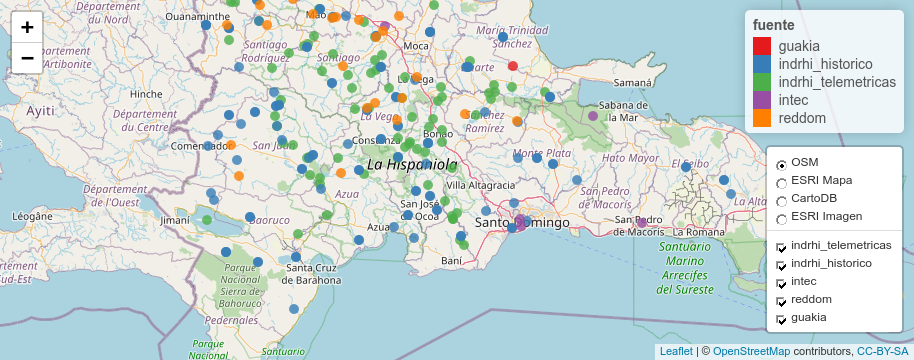

Consolidación de listas de estaciones
================
José Ramón Martínez Batlle

## Paquetes

``` r
library(sf)
library(leaflet)
library(mapview)
library(readODS)
library(readxl)
library(parzer)
library(tidyverse)
library(kableExtra)
```

## INDRHI

``` r
indrhi_telemetricas <- read_ods('fuentes/indrhi/Red_Telem_Estacion_Coord-Sept2015.ods')
(indrhi_telemetricas$longitudOK <- indrhi_telemetricas$LONGITUDE)
```

    ##  [1] -70.32160 -70.62646 -70.77352 -70.89926 -70.58584 -71.25837 -70.22777
    ##  [8] -70.71508 -70.26369 -71.08871 -70.54757 -71.11614 -69.81783 -70.62604
    ## [15]        NA -71.12742 -70.74397 -70.47666 -70.98084 -70.74962 -70.87758
    ## [22] -70.60563 -70.38149 -70.43285 -70.42573 -70.33145 -70.38617 -70.55785
    ## [29]        NA -71.31816 -70.86349 -71.04454 -71.67741 -70.12722 -70.81393
    ## [36] -71.54533 -70.81007 -71.05605 -70.58701 -71.26733 -71.14037 -70.36923
    ## [43] -70.29978 -70.75035 -71.22621 -70.45285 -70.00061 -70.45951 -71.55993
    ## [50] -70.95723 -71.29954 -71.33083 -70.09642 -70.32160 -70.56257 -71.54095
    ## [57] -71.52094 -71.28982 -70.72323 -70.52201 -70.28450 -70.19479 -70.72317
    ## [64] -70.33061 -71.11788 -71.01629 -70.40451 -71.05242 -70.09364 -71.06009
    ## [71] -70.38680 -71.55622 -71.38983 -71.10808 -71.17593 -71.20339        NA
    ## [78] -70.67452 -70.78758 -70.38368 -70.11311

``` r
(indrhi_telemetricas$latitudOK <- indrhi_telemetricas$LATITUDE)
```

    ##  [1] 18.49549 18.81051 19.25579 19.24246 19.23111 18.89250 19.31833 19.34857
    ##  [9] 18.36074 19.44524 19.02523 18.81878 19.15302 18.91602       NA 18.81294
    ## [17] 19.27134 18.84583 19.35139 19.44306 19.17718 19.12217 19.12813 19.01495
    ## [25] 19.60457 18.76217 18.89773 18.89467       NA 19.27940 19.06694 19.26524
    ## [33] 18.49239 19.15219 18.73013 19.66520 19.51798 18.67977 18.86912 19.11350
    ## [41] 19.39273 18.58828 18.52605 19.32107 19.35968 18.97579 19.18329 18.67162
    ## [49] 19.75847 18.81170 19.03106 19.65944 19.19022 18.49548 18.88467 19.62107
    ## [57] 19.62190 18.97662 19.28742 18.85912 18.38744 19.03358 19.28702 18.50985
    ## [65] 19.40663 18.51539 19.10774 18.70863 19.15409 19.58691 19.17966 19.42274
    ## [73] 19.52162 18.72538 18.41478 18.88026       NA 19.17857 19.07495 18.95745
    ## [81] 19.11913

``` r
indrhi_telemetricas$idOK <- indrhi_telemetricas$`STATION SITE`
indrhi_telemetricas %>%
  kable(booktabs=T) %>%
  kable_styling(latex_options = c("HOLD_position", "scale_down"))
```

<table class="table" style="margin-left: auto; margin-right: auto;">
<thead>
<tr>
<th style="text-align:left;">
STATION NAME
</th>
<th style="text-align:left;">
PROJECT
</th>
<th style="text-align:left;">
STATION SITE
</th>
<th style="text-align:left;">
STATION TYPE
</th>
<th style="text-align:right;">
LATITUDE
</th>
<th style="text-align:right;">
LONGITUDE
</th>
<th style="text-align:left;">
ADDRESS
</th>
<th style="text-align:left;">
VERIFICAR/TRANS
</th>
<th style="text-align:right;">
longitudOK
</th>
<th style="text-align:right;">
latitudOK
</th>
<th style="text-align:left;">
idOK
</th>
</tr>
</thead>
<tbody>
<tr>
<td style="text-align:left;">
HIDRO4
</td>
<td style="text-align:left;">
MONTE GRANDE
</td>
<td style="text-align:left;">
AGUACATE
</td>
<td style="text-align:left;">
Hidrométrica
</td>
<td style="text-align:right;">
18.49549
</td>
<td style="text-align:right;">
-70.32160
</td>
<td style="text-align:left;">
90870560
</td>
<td style="text-align:left;">
NA
</td>
<td style="text-align:right;">
-70.32160
</td>
<td style="text-align:right;">
18.49549
</td>
<td style="text-align:left;">
AGUACATE
</td>
</tr>
<tr>
<td style="text-align:left;">
NA
</td>
<td style="text-align:left;">
INDRHI
</td>
<td style="text-align:left;">
ALTO BANDERA
</td>
<td style="text-align:left;">
Climática
</td>
<td style="text-align:right;">
18.81051
</td>
<td style="text-align:right;">
-70.62646
</td>
<td style="text-align:left;">
9081B620
</td>
<td style="text-align:left;">
NA
</td>
<td style="text-align:right;">
-70.62646
</td>
<td style="text-align:right;">
18.81051
</td>
<td style="text-align:left;">
ALTO BANDERA
</td>
</tr>
<tr>
<td style="text-align:left;">
NA
</td>
<td style="text-align:left;">
INDRHI
</td>
<td style="text-align:left;">
BAIGUAQUE LOS PILONES
</td>
<td style="text-align:left;">
Hidrométrica
</td>
<td style="text-align:right;">
19.25579
</td>
<td style="text-align:right;">
-70.77352
</td>
<td style="text-align:left;">
90856572
</td>
<td style="text-align:left;">
NA
</td>
<td style="text-align:right;">
-70.77352
</td>
<td style="text-align:right;">
19.25579
</td>
<td style="text-align:left;">
BAIGUAQUE LOS PILONES
</td>
</tr>
<tr>
<td style="text-align:left;">
NA
</td>
<td style="text-align:left;">
INDRHI
</td>
<td style="text-align:left;">
BAO AGUA CALIENTE
</td>
<td style="text-align:left;">
Hidrométrica
</td>
<td style="text-align:right;">
19.24246
</td>
<td style="text-align:right;">
-70.89926
</td>
<td style="text-align:left;">
9085E366
</td>
<td style="text-align:left;">
NA
</td>
<td style="text-align:right;">
-70.89926
</td>
<td style="text-align:right;">
19.24246
</td>
<td style="text-align:left;">
BAO AGUA CALIENTE
</td>
</tr>
<tr>
<td style="text-align:left;">
NA
</td>
<td style="text-align:left;">
INDRHI
</td>
<td style="text-align:left;">
CAMU BAYACANES
</td>
<td style="text-align:left;">
Hidrométrica
</td>
<td style="text-align:right;">
19.23111
</td>
<td style="text-align:right;">
-70.58584
</td>
<td style="text-align:left;">
9083C544
</td>
<td style="text-align:left;">
NA
</td>
<td style="text-align:right;">
-70.58584
</td>
<td style="text-align:right;">
19.23111
</td>
<td style="text-align:left;">
CAMU BAYACANES
</td>
</tr>
<tr>
<td style="text-align:left;">
HIDRO3
</td>
<td style="text-align:left;">
MONTE GRANDE
</td>
<td style="text-align:left;">
CANAFISTOL
</td>
<td style="text-align:left;">
Hidrométrica
</td>
<td style="text-align:right;">
18.89250
</td>
<td style="text-align:right;">
-71.25837
</td>
<td style="text-align:left;">
9086A762
</td>
<td style="text-align:left;">
NA
</td>
<td style="text-align:right;">
-71.25837
</td>
<td style="text-align:right;">
18.89250
</td>
<td style="text-align:left;">
CANAFISTOL
</td>
</tr>
<tr>
<td style="text-align:left;">
NA
</td>
<td style="text-align:left;">
INDRHI
</td>
<td style="text-align:left;">
CENOVI
</td>
<td style="text-align:left;">
Climática
</td>
<td style="text-align:right;">
19.31833
</td>
<td style="text-align:right;">
-70.22777
</td>
<td style="text-align:left;">
9084F2EA
</td>
<td style="text-align:left;">
NA
</td>
<td style="text-align:right;">
-70.22777
</td>
<td style="text-align:right;">
19.31833
</td>
<td style="text-align:left;">
CENOVI
</td>
</tr>
<tr>
<td style="text-align:left;">
NA
</td>
<td style="text-align:left;">
INDRHI
</td>
<td style="text-align:left;">
CONTRAEMBALSE DE LOPEZ
</td>
<td style="text-align:left;">
Presa+Climática
</td>
<td style="text-align:right;">
19.34857
</td>
<td style="text-align:right;">
-70.71508
</td>
<td style="text-align:left;">
90816048
</td>
<td style="text-align:left;">
NA
</td>
<td style="text-align:right;">
-70.71508
</td>
<td style="text-align:right;">
19.34857
</td>
<td style="text-align:left;">
CONTRAEMBALSE DE LOPEZ
</td>
</tr>
<tr>
<td style="text-align:left;">
NA
</td>
<td style="text-align:left;">
INDRHI
</td>
<td style="text-align:left;">
CONTRAEMBALSE LAS BARIAS
</td>
<td style="text-align:left;">
Presa+Climática
</td>
<td style="text-align:right;">
18.36074
</td>
<td style="text-align:right;">
-70.26369
</td>
<td style="text-align:left;">
9081C0B0
</td>
<td style="text-align:left;">
9086818E
</td>
<td style="text-align:right;">
-70.26369
</td>
<td style="text-align:right;">
18.36074
</td>
<td style="text-align:left;">
CONTRAEMBALSE LAS BARIAS
</td>
</tr>
<tr>
<td style="text-align:left;">
NA
</td>
<td style="text-align:left;">
INDRHI
</td>
<td style="text-align:left;">
CONTRAEMBALSE MONCION
</td>
<td style="text-align:left;">
Presa+Climática
</td>
<td style="text-align:right;">
19.44524
</td>
<td style="text-align:right;">
-71.08871
</td>
<td style="text-align:left;">
9081F52A
</td>
<td style="text-align:left;">
NA
</td>
<td style="text-align:right;">
-71.08871
</td>
<td style="text-align:right;">
19.44524
</td>
<td style="text-align:left;">
CONTRAEMBALSE MONCION
</td>
</tr>
<tr>
<td style="text-align:left;">
NA
</td>
<td style="text-align:left;">
INDRHI
</td>
<td style="text-align:left;">
EL ARROYASO
</td>
<td style="text-align:left;">
Pluviométrica
</td>
<td style="text-align:right;">
19.02523
</td>
<td style="text-align:right;">
-70.54757
</td>
<td style="text-align:left;">
908062B2
</td>
<td style="text-align:left;">
NA
</td>
<td style="text-align:right;">
-70.54757
</td>
<td style="text-align:right;">
19.02523
</td>
<td style="text-align:left;">
EL ARROYASO
</td>
</tr>
<tr>
<td style="text-align:left;">
HIDRO1
</td>
<td style="text-align:left;">
MONTE GRANDE
</td>
<td style="text-align:left;">
EL CACHEO
</td>
<td style="text-align:left;">
Hidrométrica
</td>
<td style="text-align:right;">
18.81878
</td>
<td style="text-align:right;">
-71.11614
</td>
<td style="text-align:left;">
9087466A
</td>
<td style="text-align:left;">
NA
</td>
<td style="text-align:right;">
-71.11614
</td>
<td style="text-align:right;">
18.81878
</td>
<td style="text-align:left;">
EL CACHEO
</td>
</tr>
<tr>
<td style="text-align:left;">
NA
</td>
<td style="text-align:left;">
INDRHI
</td>
<td style="text-align:left;">
EL LIMON
</td>
<td style="text-align:left;">
Hidrométrica+Climática
</td>
<td style="text-align:right;">
19.15302
</td>
<td style="text-align:right;">
-69.81783
</td>
<td style="text-align:left;">
9086F71E
</td>
<td style="text-align:left;">
NA
</td>
<td style="text-align:right;">
-69.81783
</td>
<td style="text-align:right;">
19.15302
</td>
<td style="text-align:left;">
EL LIMON
</td>
</tr>
<tr>
<td style="text-align:left;">
NA
</td>
<td style="text-align:left;">
INDRHI
</td>
<td style="text-align:left;">
EL PINALITO, CONSTANZA
</td>
<td style="text-align:left;">
Hidrométrica
</td>
<td style="text-align:right;">
18.91602
</td>
<td style="text-align:right;">
-70.62604
</td>
<td style="text-align:left;">
9081D3C6
</td>
<td style="text-align:left;">
NA
</td>
<td style="text-align:right;">
-70.62604
</td>
<td style="text-align:right;">
18.91602
</td>
<td style="text-align:left;">
EL PINALITO, CONSTANZA
</td>
</tr>
<tr>
<td style="text-align:left;">
NA
</td>
<td style="text-align:left;">
NA
</td>
<td style="text-align:left;">
LA COJA (LISTA SIAP)
</td>
<td style="text-align:left;">
NA
</td>
<td style="text-align:right;">
NA
</td>
<td style="text-align:right;">
NA
</td>
<td style="text-align:left;">
NA
</td>
<td style="text-align:left;">
908730FA
</td>
<td style="text-align:right;">
NA
</td>
<td style="text-align:right;">
NA
</td>
<td style="text-align:left;">
LA COJA (LISTA SIAP)
</td>
</tr>
<tr>
<td style="text-align:left;">
NA
</td>
<td style="text-align:left;">
MONTE GRANDE
</td>
<td style="text-align:left;">
EL POPOTE
</td>
<td style="text-align:left;">
Climática
</td>
<td style="text-align:right;">
18.81294
</td>
<td style="text-align:right;">
-71.12742
</td>
<td style="text-align:left;">
908183BA
</td>
<td style="text-align:left;">
NA
</td>
<td style="text-align:right;">
-71.12742
</td>
<td style="text-align:right;">
18.81294
</td>
<td style="text-align:left;">
EL POPOTE
</td>
</tr>
<tr>
<td style="text-align:left;">
NA
</td>
<td style="text-align:left;">
INDRHI
</td>
<td style="text-align:left;">
GUANAJUMA EL CERRAZO
</td>
<td style="text-align:left;">
Hidrométrica
</td>
<td style="text-align:right;">
19.27134
</td>
<td style="text-align:right;">
-70.74397
</td>
<td style="text-align:left;">
90855000000000
</td>
<td style="text-align:left;">
NA
</td>
<td style="text-align:right;">
-70.74397
</td>
<td style="text-align:right;">
19.27134
</td>
<td style="text-align:left;">
GUANAJUMA EL CERRAZO
</td>
</tr>
<tr>
<td style="text-align:left;">
NA
</td>
<td style="text-align:left;">
INDRHI
</td>
<td style="text-align:left;">
GUAREY (PRESA GUAGUI)
</td>
<td style="text-align:left;">
Climática
</td>
<td style="text-align:right;">
18.84583
</td>
<td style="text-align:right;">
-70.47666
</td>
<td style="text-align:left;">
908021B8
</td>
<td style="text-align:left;">
NA
</td>
<td style="text-align:right;">
-70.47666
</td>
<td style="text-align:right;">
18.84583
</td>
<td style="text-align:left;">
GUAREY (PRESA GUAGUI)
</td>
</tr>
<tr>
<td style="text-align:left;">
NA
</td>
<td style="text-align:left;">
INDRHI
</td>
<td style="text-align:left;">
INOA
</td>
<td style="text-align:left;">
Hidrométrica
</td>
<td style="text-align:right;">
19.35139
</td>
<td style="text-align:right;">
-70.98084
</td>
<td style="text-align:left;">
90857604
</td>
<td style="text-align:left;">
NA
</td>
<td style="text-align:right;">
-70.98084
</td>
<td style="text-align:right;">
19.35139
</td>
<td style="text-align:left;">
INOA
</td>
</tr>
<tr>
<td style="text-align:left;">
NA
</td>
<td style="text-align:left;">
INDRHI
</td>
<td style="text-align:left;">
ISA
</td>
<td style="text-align:left;">
Climática
</td>
<td style="text-align:right;">
19.44306
</td>
<td style="text-align:right;">
-70.74962
</td>
<td style="text-align:left;">
908146A4
</td>
<td style="text-align:left;">
NA
</td>
<td style="text-align:right;">
-70.74962
</td>
<td style="text-align:right;">
19.44306
</td>
<td style="text-align:left;">
ISA
</td>
</tr>
<tr>
<td style="text-align:left;">
NA
</td>
<td style="text-align:left;">
INDRHI
</td>
<td style="text-align:left;">
JAGUA LOS LIMONES
</td>
<td style="text-align:left;">
Hidrométrica
</td>
<td style="text-align:right;">
19.17718
</td>
<td style="text-align:right;">
-70.87758
</td>
<td style="text-align:left;">
9085B31A
</td>
<td style="text-align:left;">
NA
</td>
<td style="text-align:right;">
-70.87758
</td>
<td style="text-align:right;">
19.17718
</td>
<td style="text-align:left;">
JAGUA LOS LIMONES
</td>
</tr>
<tr>
<td style="text-align:left;">
NA
</td>
<td style="text-align:left;">
INDRHI
</td>
<td style="text-align:left;">
JARABACOA
</td>
<td style="text-align:left;">
Climática
</td>
<td style="text-align:right;">
19.12217
</td>
<td style="text-align:right;">
-70.60563
</td>
<td style="text-align:left;">
9081A556
</td>
<td style="text-align:left;">
NA
</td>
<td style="text-align:right;">
-70.60563
</td>
<td style="text-align:right;">
19.12217
</td>
<td style="text-align:left;">
JARABACOA
</td>
</tr>
<tr>
<td style="text-align:left;">
NA
</td>
<td style="text-align:left;">
INDRHI
</td>
<td style="text-align:left;">
JIMA ABAJO burbuj
</td>
<td style="text-align:left;">
Hidrométrica
</td>
<td style="text-align:right;">
19.12813
</td>
<td style="text-align:right;">
-70.38149
</td>
<td style="text-align:left;">
9085350E
</td>
<td style="text-align:left;">
NA
</td>
<td style="text-align:right;">
-70.38149
</td>
<td style="text-align:right;">
19.12813
</td>
<td style="text-align:left;">
JIMA ABAJO burbuj
</td>
</tr>
<tr>
<td style="text-align:left;">
NA
</td>
<td style="text-align:left;">
INDRHI
</td>
<td style="text-align:left;">
JIMA CAÑADA DE PIEDRA (burbuja
</td>
<td style="text-align:left;">
Hidrométrica
</td>
<td style="text-align:right;">
19.01495
</td>
<td style="text-align:right;">
-70.43285
</td>
<td style="text-align:left;">
9083E3A8
</td>
<td style="text-align:left;">
NA
</td>
<td style="text-align:right;">
-70.43285
</td>
<td style="text-align:right;">
19.01495
</td>
<td style="text-align:left;">
JIMA CAÑADA DE PIEDRA (burbuja
</td>
</tr>
<tr>
<td style="text-align:left;">
NA
</td>
<td style="text-align:left;">
INDRHI
</td>
<td style="text-align:left;">
JOSE CONTRERAS
</td>
<td style="text-align:left;">
Climática
</td>
<td style="text-align:right;">
19.60457
</td>
<td style="text-align:right;">
-70.42573
</td>
<td style="text-align:left;">
908326B6
</td>
<td style="text-align:left;">
NA
</td>
<td style="text-align:right;">
-70.42573
</td>
<td style="text-align:right;">
19.60457
</td>
<td style="text-align:left;">
JOSE CONTRERAS
</td>
</tr>
<tr>
<td style="text-align:left;">
NA
</td>
<td style="text-align:left;">
INDRHI
</td>
<td style="text-align:left;">
JUAN ADRIAN(LOS PLATANOS)
</td>
<td style="text-align:left;">
Pluviométrica
</td>
<td style="text-align:right;">
18.76217
</td>
<td style="text-align:right;">
-70.33145
</td>
<td style="text-align:left;">
9080F7D0
</td>
<td style="text-align:left;">
NA
</td>
<td style="text-align:right;">
-70.33145
</td>
<td style="text-align:right;">
18.76217
</td>
<td style="text-align:left;">
JUAN ADRIAN(LOS PLATANOS)
</td>
</tr>
<tr>
<td style="text-align:left;">
NA
</td>
<td style="text-align:left;">
INDRHI
</td>
<td style="text-align:left;">
JUMA
</td>
<td style="text-align:left;">
Climática
</td>
<td style="text-align:right;">
18.89773
</td>
<td style="text-align:right;">
-70.38617
</td>
<td style="text-align:left;">
90805728
</td>
<td style="text-align:left;">
NA
</td>
<td style="text-align:right;">
-70.38617
</td>
<td style="text-align:right;">
18.89773
</td>
<td style="text-align:left;">
JUMA
</td>
</tr>
<tr>
<td style="text-align:left;">
NA
</td>
<td style="text-align:left;">
INDRHI
</td>
<td style="text-align:left;">
LA CEIBA
</td>
<td style="text-align:left;">
Pluviométrica
</td>
<td style="text-align:right;">
18.89467
</td>
<td style="text-align:right;">
-70.55785
</td>
<td style="text-align:left;">
9080B4DA
</td>
<td style="text-align:left;">
NA
</td>
<td style="text-align:right;">
-70.55785
</td>
<td style="text-align:right;">
18.89467
</td>
<td style="text-align:left;">
LA CEIBA
</td>
</tr>
<tr>
<td style="text-align:left;">
NA
</td>
<td style="text-align:left;">
NA
</td>
<td style="text-align:left;">
LOS FRIOS (LISTA SIAP)
</td>
<td style="text-align:left;">
NA
</td>
<td style="text-align:right;">
NA
</td>
<td style="text-align:right;">
NA
</td>
<td style="text-align:left;">
NA
</td>
<td style="text-align:left;">
908365BC
</td>
<td style="text-align:right;">
NA
</td>
<td style="text-align:right;">
NA
</td>
<td style="text-align:left;">
LOS FRIOS (LISTA SIAP)
</td>
</tr>
<tr>
<td style="text-align:left;">
NA
</td>
<td style="text-align:left;">
INDRHI
</td>
<td style="text-align:left;">
LA CIDRA
</td>
<td style="text-align:left;">
Pluviométrica
</td>
<td style="text-align:right;">
19.27940
</td>
<td style="text-align:right;">
-71.31816
</td>
<td style="text-align:left;">
90812342
</td>
<td style="text-align:left;">
NA
</td>
<td style="text-align:right;">
-71.31816
</td>
<td style="text-align:right;">
19.27940
</td>
<td style="text-align:left;">
LA CIDRA
</td>
</tr>
<tr>
<td style="text-align:left;">
NA
</td>
<td style="text-align:left;">
INDRHI
</td>
<td style="text-align:left;">
LA CIENAGA, MANABAO
</td>
<td style="text-align:left;">
Hidrométrica
</td>
<td style="text-align:right;">
19.06694
</td>
<td style="text-align:right;">
-70.86349
</td>
<td style="text-align:left;">
90809236
</td>
<td style="text-align:left;">
NA
</td>
<td style="text-align:right;">
-70.86349
</td>
<td style="text-align:right;">
19.06694
</td>
<td style="text-align:left;">
LA CIENAGA, MANABAO
</td>
</tr>
<tr>
<td style="text-align:left;">
NA
</td>
<td style="text-align:left;">
INDRHI
</td>
<td style="text-align:left;">
LA DIFERENCIA
</td>
<td style="text-align:left;">
Climática
</td>
<td style="text-align:right;">
19.26524
</td>
<td style="text-align:right;">
-71.04454
</td>
<td style="text-align:left;">
908155D2
</td>
<td style="text-align:left;">
NA
</td>
<td style="text-align:right;">
-71.04454
</td>
<td style="text-align:right;">
19.26524
</td>
<td style="text-align:left;">
LA DIFERENCIA
</td>
</tr>
<tr>
<td style="text-align:left;">
NA
</td>
<td style="text-align:left;">
INDRHI
</td>
<td style="text-align:left;">
LAGO ENRIQUILLO
</td>
<td style="text-align:left;">
Presa+Climática
</td>
<td style="text-align:right;">
18.49239
</td>
<td style="text-align:right;">
-71.67741
</td>
<td style="text-align:left;">
90813034
</td>
<td style="text-align:left;">
NA
</td>
<td style="text-align:right;">
-71.67741
</td>
<td style="text-align:right;">
18.49239
</td>
<td style="text-align:left;">
LAGO ENRIQUILLO
</td>
</tr>
<tr>
<td style="text-align:left;">
NA
</td>
<td style="text-align:left;">
INDRHI
</td>
<td style="text-align:left;">
LAS BIJA
</td>
<td style="text-align:left;">
Hidrométrica
</td>
<td style="text-align:right;">
19.15219
</td>
<td style="text-align:right;">
-70.12722
</td>
<td style="text-align:left;">
908297C2
</td>
<td style="text-align:left;">
NA
</td>
<td style="text-align:right;">
-70.12722
</td>
<td style="text-align:right;">
19.15219
</td>
<td style="text-align:left;">
LAS BIJA
</td>
</tr>
<tr>
<td style="text-align:left;">
NA
</td>
<td style="text-align:left;">
MONTE GRANDE
</td>
<td style="text-align:left;">
LAS GUAMAS
</td>
<td style="text-align:left;">
Hidrométrica+Pluv+Calidad Agua
</td>
<td style="text-align:right;">
18.73013
</td>
<td style="text-align:right;">
-70.81393
</td>
<td style="text-align:left;">
9087238C
</td>
<td style="text-align:left;">
NA
</td>
<td style="text-align:right;">
-70.81393
</td>
<td style="text-align:right;">
18.73013
</td>
<td style="text-align:left;">
LAS GUAMAS
</td>
</tr>
<tr>
<td style="text-align:left;">
NA
</td>
<td style="text-align:left;">
INDRHI
</td>
<td style="text-align:left;">
LAS MATAS DE SANTA CRUZ
</td>
<td style="text-align:left;">
Pluviométrica
</td>
<td style="text-align:right;">
19.66520
</td>
<td style="text-align:right;">
-71.54533
</td>
<td style="text-align:left;">
90800754
</td>
<td style="text-align:left;">
NA
</td>
<td style="text-align:right;">
-71.54533
</td>
<td style="text-align:right;">
19.66520
</td>
<td style="text-align:left;">
LAS MATAS DE SANTA CRUZ
</td>
</tr>
<tr>
<td style="text-align:left;">
NA
</td>
<td style="text-align:left;">
INDRHI
</td>
<td style="text-align:left;">
LOS ALMACIGOS
</td>
<td style="text-align:left;">
Hidrométrica
</td>
<td style="text-align:right;">
19.51798
</td>
<td style="text-align:right;">
-70.81007
</td>
<td style="text-align:left;">
9084A296
</td>
<td style="text-align:left;">
NA
</td>
<td style="text-align:right;">
-70.81007
</td>
<td style="text-align:right;">
19.51798
</td>
<td style="text-align:left;">
LOS ALMACIGOS
</td>
</tr>
<tr>
<td style="text-align:left;">
HIDROPLUVCA4
</td>
<td style="text-align:left;">
MONTE GRANDE
</td>
<td style="text-align:left;">
LOS BANCOS
</td>
<td style="text-align:left;">
Hidrométrica+Pluv+Calidad Agua
</td>
<td style="text-align:right;">
18.67977
</td>
<td style="text-align:right;">
-71.05605
</td>
<td style="text-align:left;">
9086E468
</td>
<td style="text-align:left;">
NA
</td>
<td style="text-align:right;">
-71.05605
</td>
<td style="text-align:right;">
18.67977
</td>
<td style="text-align:left;">
LOS BANCOS
</td>
</tr>
<tr>
<td style="text-align:left;">
NA
</td>
<td style="text-align:left;">
INDRHI
</td>
<td style="text-align:left;">
LOS BOTADOS
</td>
<td style="text-align:left;">
Climática
</td>
<td style="text-align:right;">
18.86912
</td>
<td style="text-align:right;">
-70.58701
</td>
<td style="text-align:left;">
90808140
</td>
<td style="text-align:left;">
NA
</td>
<td style="text-align:right;">
-70.58701
</td>
<td style="text-align:right;">
18.86912
</td>
<td style="text-align:left;">
LOS BOTADOS
</td>
</tr>
<tr>
<td style="text-align:left;">
NA
</td>
<td style="text-align:left;">
MONTE GRANDE
</td>
<td style="text-align:left;">
LOS PINALES
</td>
<td style="text-align:left;">
Climática
</td>
<td style="text-align:right;">
19.11350
</td>
<td style="text-align:right;">
-71.26733
</td>
<td style="text-align:left;">
90826746
</td>
<td style="text-align:left;">
NA
</td>
<td style="text-align:right;">
-71.26733
</td>
<td style="text-align:right;">
19.11350
</td>
<td style="text-align:left;">
LOS PINALES
</td>
</tr>
<tr>
<td style="text-align:left;">
PLUVIO
</td>
<td style="text-align:left;">
INDRHI
</td>
<td style="text-align:left;">
MAGUA MONCION
</td>
<td style="text-align:left;">
Pluviométrica
</td>
<td style="text-align:right;">
19.39273
</td>
<td style="text-align:right;">
-71.14037
</td>
<td style="text-align:left;">
908116D8
</td>
<td style="text-align:left;">
NA
</td>
<td style="text-align:right;">
-71.14037
</td>
<td style="text-align:right;">
19.39273
</td>
<td style="text-align:left;">
MAGUA MONCION
</td>
</tr>
<tr>
<td style="text-align:left;">
NA
</td>
<td style="text-align:left;">
INDRHI
</td>
<td style="text-align:left;">
MAHOMA EL ROSALITO
</td>
<td style="text-align:left;">
Hidrométrica
</td>
<td style="text-align:right;">
18.58828
</td>
<td style="text-align:right;">
-70.36923
</td>
<td style="text-align:left;">
90863200
</td>
<td style="text-align:left;">
NA
</td>
<td style="text-align:right;">
-70.36923
</td>
<td style="text-align:right;">
18.58828
</td>
<td style="text-align:left;">
MAHOMA EL ROSALITO
</td>
</tr>
<tr>
<td style="text-align:left;">
NA
</td>
<td style="text-align:left;">
INDRHI
</td>
<td style="text-align:left;">
MAHOMITA EL CACAO
</td>
<td style="text-align:left;">
Hidrométrica
</td>
<td style="text-align:right;">
18.52605
</td>
<td style="text-align:right;">
-70.29978
</td>
<td style="text-align:left;">
90864490
</td>
<td style="text-align:left;">
NA
</td>
<td style="text-align:right;">
-70.29978
</td>
<td style="text-align:right;">
18.52605
</td>
<td style="text-align:left;">
MAHOMITA EL CACAO
</td>
</tr>
<tr>
<td style="text-align:left;">
NA
</td>
<td style="text-align:left;">
INDRHI
</td>
<td style="text-align:left;">
MAO LA CIDRA (burbuj
</td>
<td style="text-align:left;">
Hidrométrica
</td>
<td style="text-align:right;">
19.32107
</td>
<td style="text-align:right;">
-70.75035
</td>
<td style="text-align:left;">
9087551C
</td>
<td style="text-align:left;">
NA
</td>
<td style="text-align:right;">
-70.75035
</td>
<td style="text-align:right;">
19.32107
</td>
<td style="text-align:left;">
MAO LA CIDRA (burbuj
</td>
</tr>
<tr>
<td style="text-align:left;">
NA
</td>
<td style="text-align:left;">
INDRHI
</td>
<td style="text-align:left;">
MAO MESETA
</td>
<td style="text-align:left;">
Hidrométrica
</td>
<td style="text-align:right;">
19.35968
</td>
<td style="text-align:right;">
-71.22621
</td>
<td style="text-align:left;">
9086079A
</td>
<td style="text-align:left;">
NA
</td>
<td style="text-align:right;">
-71.22621
</td>
<td style="text-align:right;">
19.35968
</td>
<td style="text-align:left;">
MAO MESETA
</td>
</tr>
<tr>
<td style="text-align:left;">
NA
</td>
<td style="text-align:left;">
INDRHI
</td>
<td style="text-align:left;">
MASIPEDRO LOS ARROCES
</td>
<td style="text-align:left;">
Hidrométrica
</td>
<td style="text-align:right;">
18.97579
</td>
<td style="text-align:right;">
-70.45285
</td>
<td style="text-align:left;">
9083D632
</td>
<td style="text-align:left;">
NA
</td>
<td style="text-align:right;">
-70.45285
</td>
<td style="text-align:right;">
18.97579
</td>
<td style="text-align:left;">
MASIPEDRO LOS ARROCES
</td>
</tr>
<tr>
<td style="text-align:left;">
NA
</td>
<td style="text-align:left;">
INDRHI
</td>
<td style="text-align:left;">
MATA GRANDE
</td>
<td style="text-align:left;">
Climática
</td>
<td style="text-align:right;">
19.18329
</td>
<td style="text-align:right;">
-70.00061
</td>
<td style="text-align:left;">
9082A258
</td>
<td style="text-align:left;">
NA
</td>
<td style="text-align:right;">
-70.00061
</td>
<td style="text-align:right;">
19.18329
</td>
<td style="text-align:left;">
MATA GRANDE
</td>
</tr>
<tr>
<td style="text-align:left;">
NA
</td>
<td style="text-align:left;">
INDRHI
</td>
<td style="text-align:left;">
NIZAO BOCAINA
</td>
<td style="text-align:left;">
Hidrométrica
</td>
<td style="text-align:right;">
18.67162
</td>
<td style="text-align:right;">
-70.45951
</td>
<td style="text-align:left;">
90862176
</td>
<td style="text-align:left;">
NA
</td>
<td style="text-align:right;">
-70.45951
</td>
<td style="text-align:right;">
18.67162
</td>
<td style="text-align:left;">
NIZAO BOCAINA
</td>
</tr>
<tr>
<td style="text-align:left;">
NA
</td>
<td style="text-align:left;">
INDRHI
</td>
<td style="text-align:left;">
PALO VERDE
</td>
<td style="text-align:left;">
Hidrométrica
</td>
<td style="text-align:right;">
19.75847
</td>
<td style="text-align:right;">
-71.55993
</td>
<td style="text-align:left;">
9082D4C8
</td>
<td style="text-align:left;">
NA
</td>
<td style="text-align:right;">
-71.55993
</td>
<td style="text-align:right;">
19.75847
</td>
<td style="text-align:left;">
PALO VERDE
</td>
</tr>
<tr>
<td style="text-align:left;">
NA
</td>
<td style="text-align:left;">
MONTE GRANDE
</td>
<td style="text-align:left;">
PALOMINO
</td>
<td style="text-align:left;">
Hidro+Pluvio+Calidad Agua
</td>
<td style="text-align:right;">
18.81170
</td>
<td style="text-align:right;">
-70.95723
</td>
<td style="text-align:left;">
90871616
</td>
<td style="text-align:left;">
NA
</td>
<td style="text-align:right;">
-70.95723
</td>
<td style="text-align:right;">
18.81170
</td>
<td style="text-align:left;">
PALOMINO
</td>
</tr>
<tr>
<td style="text-align:left;">
HIDROPLUVCA1
</td>
<td style="text-align:left;">
MONTE GRANDE
</td>
<td style="text-align:left;">
PASO DE LIMA
</td>
<td style="text-align:left;">
Hidrométrica+Pluv+Calidad Agua
</td>
<td style="text-align:right;">
19.03106
</td>
<td style="text-align:right;">
-71.29954
</td>
<td style="text-align:left;">
9086D1F2
</td>
<td style="text-align:left;">
NA
</td>
<td style="text-align:right;">
-71.29954
</td>
<td style="text-align:right;">
19.03106
</td>
<td style="text-align:left;">
PASO DE LIMA
</td>
</tr>
<tr>
<td style="text-align:left;">
NA
</td>
<td style="text-align:left;">
INDRHI
</td>
<td style="text-align:left;">
PEÑA RANCHADERO
</td>
<td style="text-align:left;">
Hidrométrica
</td>
<td style="text-align:right;">
19.65944
</td>
<td style="text-align:right;">
-71.33083
</td>
<td style="text-align:left;">
908032CE
</td>
<td style="text-align:left;">
NA
</td>
<td style="text-align:right;">
-71.33083
</td>
<td style="text-align:right;">
19.65944
</td>
<td style="text-align:left;">
PEÑA RANCHADERO
</td>
</tr>
<tr>
<td style="text-align:left;">
NA
</td>
<td style="text-align:left;">
INDRHI
</td>
<td style="text-align:left;">
PIMENTEL
</td>
<td style="text-align:left;">
Hidrométrica
</td>
<td style="text-align:right;">
19.19022
</td>
<td style="text-align:right;">
-70.09642
</td>
<td style="text-align:left;">
9083132C
</td>
<td style="text-align:left;">
NA
</td>
<td style="text-align:right;">
-70.09642
</td>
<td style="text-align:right;">
19.19022
</td>
<td style="text-align:left;">
PIMENTEL
</td>
</tr>
<tr>
<td style="text-align:left;">
NA
</td>
<td style="text-align:left;">
INDRHI
</td>
<td style="text-align:left;">
PRESA AGUACATE
</td>
<td style="text-align:left;">
Presa+Climática
</td>
<td style="text-align:right;">
18.49548
</td>
<td style="text-align:right;">
-70.32160
</td>
<td style="text-align:left;">
9082B12E
</td>
<td style="text-align:left;">
NA
</td>
<td style="text-align:right;">
-70.32160
</td>
<td style="text-align:right;">
18.49548
</td>
<td style="text-align:left;">
PRESA AGUACATE
</td>
</tr>
<tr>
<td style="text-align:left;">
NA
</td>
<td style="text-align:left;">
INDRHI
</td>
<td style="text-align:left;">
PRESA DE BLANCO
</td>
<td style="text-align:left;">
Presa+Climática
</td>
<td style="text-align:right;">
18.88467
</td>
<td style="text-align:right;">
-70.56257
</td>
<td style="text-align:left;">
9080A7AC
</td>
<td style="text-align:left;">
NA
</td>
<td style="text-align:right;">
-70.56257
</td>
<td style="text-align:right;">
18.88467
</td>
<td style="text-align:left;">
PRESA DE BLANCO
</td>
</tr>
<tr>
<td style="text-align:left;">
NA
</td>
<td style="text-align:left;">
INDRHI
</td>
<td style="text-align:left;">
PRESA DE CHACUEY
</td>
<td style="text-align:left;">
Presa+Climática
</td>
<td style="text-align:right;">
19.62107
</td>
<td style="text-align:right;">
-71.54095
</td>
<td style="text-align:left;">
90876086
</td>
<td style="text-align:left;">
90876086
</td>
<td style="text-align:right;">
-71.54095
</td>
<td style="text-align:right;">
19.62107
</td>
<td style="text-align:left;">
PRESA DE CHACUEY
</td>
</tr>
<tr>
<td style="text-align:left;">
NA
</td>
<td style="text-align:left;">
INDRHI
</td>
<td style="text-align:left;">
PRESA DE MAGUACA
</td>
<td style="text-align:left;">
Presa+Climática
</td>
<td style="text-align:right;">
19.62190
</td>
<td style="text-align:right;">
-71.52094
</td>
<td style="text-align:left;">
908105AE
</td>
<td style="text-align:left;">
NA
</td>
<td style="text-align:right;">
-71.52094
</td>
<td style="text-align:right;">
19.62190
</td>
<td style="text-align:left;">
PRESA DE MAGUACA
</td>
</tr>
<tr>
<td style="text-align:left;">
CLIMAHIDROCA3
</td>
<td style="text-align:left;">
MONTE GRANDE
</td>
<td style="text-align:left;">
PRESA DE SABANETA
</td>
<td style="text-align:left;">
Hidrométrica+Clima+Calidad Agua
</td>
<td style="text-align:right;">
18.97662
</td>
<td style="text-align:right;">
-71.28982
</td>
<td style="text-align:left;">
9086C284
</td>
<td style="text-align:left;">
NA
</td>
<td style="text-align:right;">
-71.28982
</td>
<td style="text-align:right;">
18.97662
</td>
<td style="text-align:left;">
PRESA DE SABANETA
</td>
</tr>
<tr>
<td style="text-align:left;">
NA
</td>
<td style="text-align:left;">
INDRHI
</td>
<td style="text-align:left;">
PRESA DE TAVERA
</td>
<td style="text-align:left;">
Climática
</td>
<td style="text-align:right;">
19.28742
</td>
<td style="text-align:right;">
-70.72323
</td>
<td style="text-align:left;">
908071C4
</td>
<td style="text-align:left;">
NA
</td>
<td style="text-align:right;">
-70.72323
</td>
<td style="text-align:right;">
19.28742
</td>
<td style="text-align:left;">
PRESA DE TAVERA
</td>
</tr>
<tr>
<td style="text-align:left;">
NA
</td>
<td style="text-align:left;">
INDRHI
</td>
<td style="text-align:left;">
PRESA DE TIREITO
</td>
<td style="text-align:left;">
Presa+Climática
</td>
<td style="text-align:right;">
18.85912
</td>
<td style="text-align:right;">
-70.52201
</td>
<td style="text-align:left;">
9080445E
</td>
<td style="text-align:left;">
NA
</td>
<td style="text-align:right;">
-70.52201
</td>
<td style="text-align:right;">
18.85912
</td>
<td style="text-align:left;">
PRESA DE TIREITO
</td>
</tr>
<tr>
<td style="text-align:left;">
CLIMAPRESACA
</td>
<td style="text-align:left;">
INDRHI
</td>
<td style="text-align:left;">
PRESA DE VALDESIA
</td>
<td style="text-align:left;">
Presa+Calidad Agua+Climática
</td>
<td style="text-align:right;">
18.38744
</td>
<td style="text-align:right;">
-70.28450
</td>
<td style="text-align:left;">
908190CC
</td>
<td style="text-align:left;">
NA
</td>
<td style="text-align:right;">
-70.28450
</td>
<td style="text-align:right;">
18.38744
</td>
<td style="text-align:left;">
PRESA DE VALDESIA
</td>
</tr>
<tr>
<td style="text-align:left;">
NA
</td>
<td style="text-align:left;">
INDRHI
</td>
<td style="text-align:left;">
PRESA HATILLO
</td>
<td style="text-align:left;">
Presa+Calidad Agua+Climática
</td>
<td style="text-align:right;">
19.03358
</td>
<td style="text-align:right;">
-70.19479
</td>
<td style="text-align:left;">
908773F0
</td>
<td style="text-align:left;">
NA
</td>
<td style="text-align:right;">
-70.19479
</td>
<td style="text-align:right;">
19.03358
</td>
<td style="text-align:left;">
PRESA HATILLO
</td>
</tr>
<tr>
<td style="text-align:left;">
NA
</td>
<td style="text-align:left;">
INDRHI
</td>
<td style="text-align:left;">
PRESA DE TAVERA
</td>
<td style="text-align:left;">
Presa+Calidad Agua
</td>
<td style="text-align:right;">
19.28702
</td>
<td style="text-align:right;">
-70.72317
</td>
<td style="text-align:left;">
NA
</td>
<td style="text-align:left;">
NA
</td>
<td style="text-align:right;">
-70.72317
</td>
<td style="text-align:right;">
19.28702
</td>
<td style="text-align:left;">
PRESA DE TAVERA
</td>
</tr>
<tr>
<td style="text-align:left;">
CLIMAPRESA
</td>
<td style="text-align:left;">
INDRHI
</td>
<td style="text-align:left;">
PRESA JIGUEY
</td>
<td style="text-align:left;">
Presa+Climática
</td>
<td style="text-align:right;">
18.50985
</td>
<td style="text-align:right;">
-70.33061
</td>
<td style="text-align:left;">
90801422
</td>
<td style="text-align:left;">
NA
</td>
<td style="text-align:right;">
-70.33061
</td>
<td style="text-align:right;">
18.50985
</td>
<td style="text-align:left;">
PRESA JIGUEY
</td>
</tr>
<tr>
<td style="text-align:left;">
CLIMAPRESACA
</td>
<td style="text-align:left;">
INDRHI
</td>
<td style="text-align:left;">
PRESA MONCION
</td>
<td style="text-align:left;">
Presa+Calidad Agua+Climática
</td>
<td style="text-align:right;">
19.40663
</td>
<td style="text-align:right;">
-71.11788
</td>
<td style="text-align:left;">
9082244C
</td>
<td style="text-align:left;">
NA
</td>
<td style="text-align:right;">
-71.11788
</td>
<td style="text-align:right;">
19.40663
</td>
<td style="text-align:left;">
PRESA MONCION
</td>
</tr>
<tr>
<td style="text-align:left;">
CLIMAHIDROCA4
</td>
<td style="text-align:left;">
MONTE GRANDE
</td>
<td style="text-align:left;">
PRESA MONTE GRANDE
</td>
<td style="text-align:left;">
Hidrométrica+Clima+Calidad Agua
</td>
<td style="text-align:right;">
18.51539
</td>
<td style="text-align:right;">
-71.01629
</td>
<td style="text-align:left;">
908284B4
</td>
<td style="text-align:left;">
NA
</td>
<td style="text-align:right;">
-71.01629
</td>
<td style="text-align:right;">
18.51539
</td>
<td style="text-align:left;">
PRESA MONTE GRANDE
</td>
</tr>
<tr>
<td style="text-align:left;">
NA
</td>
<td style="text-align:left;">
INDRHI
</td>
<td style="text-align:left;">
PRESA RINCON
</td>
<td style="text-align:left;">
Presa+Calidad Agua+Climática
</td>
<td style="text-align:right;">
19.10774
</td>
<td style="text-align:right;">
-70.40451
</td>
<td style="text-align:left;">
908252DC
</td>
<td style="text-align:left;">
NA
</td>
<td style="text-align:right;">
-70.40451
</td>
<td style="text-align:right;">
19.10774
</td>
<td style="text-align:left;">
PRESA RINCON
</td>
</tr>
<tr>
<td style="text-align:left;">
NA
</td>
<td style="text-align:left;">
MONTE GRANDE
</td>
<td style="text-align:left;">
PRESA SABANA YEGUA
</td>
<td style="text-align:left;">
Hidrométrica+Clima+Calidad Agua
</td>
<td style="text-align:right;">
18.70863
</td>
<td style="text-align:right;">
-71.05242
</td>
<td style="text-align:left;">
9080D13C
</td>
<td style="text-align:left;">
NA
</td>
<td style="text-align:right;">
-71.05242
</td>
<td style="text-align:right;">
18.70863
</td>
<td style="text-align:left;">
PRESA SABANA YEGUA
</td>
</tr>
<tr>
<td style="text-align:left;">
NA
</td>
<td style="text-align:left;">
INDRHI
</td>
<td style="text-align:left;">
PUENTE LA BARCA
</td>
<td style="text-align:left;">
Hidro + Sonda
</td>
<td style="text-align:right;">
19.15409
</td>
<td style="text-align:right;">
-70.09364
</td>
<td style="text-align:left;">
908376CA
</td>
<td style="text-align:left;">
NA
</td>
<td style="text-align:right;">
-70.09364
</td>
<td style="text-align:right;">
19.15409
</td>
<td style="text-align:left;">
PUENTE LA BARCA
</td>
</tr>
<tr>
<td style="text-align:left;">
NA
</td>
<td style="text-align:left;">
INDRHI
</td>
<td style="text-align:left;">
PUENTE SAN RAFAEL(MAO)
</td>
<td style="text-align:left;">
Hidrométrica
</td>
<td style="text-align:right;">
19.58691
</td>
<td style="text-align:right;">
-71.06009
</td>
<td style="text-align:left;">
90858680
</td>
<td style="text-align:left;">
NA
</td>
<td style="text-align:right;">
-71.06009
</td>
<td style="text-align:right;">
19.58691
</td>
<td style="text-align:left;">
PUENTE SAN RAFAEL(MAO)
</td>
</tr>
<tr>
<td style="text-align:left;">
NA
</td>
<td style="text-align:left;">
INDRHI
</td>
<td style="text-align:left;">
RANCHITO
</td>
<td style="text-align:left;">
Hidrométrica
</td>
<td style="text-align:right;">
19.17966
</td>
<td style="text-align:right;">
-70.38680
</td>
<td style="text-align:left;">
9082373A
</td>
<td style="text-align:left;">
NA
</td>
<td style="text-align:right;">
-70.38680
</td>
<td style="text-align:right;">
19.17966
</td>
<td style="text-align:left;">
RANCHITO
</td>
</tr>
<tr>
<td style="text-align:left;">
NA
</td>
<td style="text-align:left;">
INDRHI
</td>
<td style="text-align:left;">
RESBALOSO
</td>
<td style="text-align:left;">
Pluviométrica
</td>
<td style="text-align:right;">
19.42274
</td>
<td style="text-align:right;">
-71.55622
</td>
<td style="text-align:left;">
9081733E
</td>
<td style="text-align:left;">
NA
</td>
<td style="text-align:right;">
-71.55622
</td>
<td style="text-align:right;">
19.42274
</td>
<td style="text-align:left;">
RESBALOSO
</td>
</tr>
<tr>
<td style="text-align:left;">
NA
</td>
<td style="text-align:left;">
INDRHI
</td>
<td style="text-align:left;">
RINCON
</td>
<td style="text-align:left;">
Hidrométrica
</td>
<td style="text-align:right;">
19.52162
</td>
<td style="text-align:right;">
-71.38983
</td>
<td style="text-align:left;">
908595F6
</td>
<td style="text-align:left;">
NA
</td>
<td style="text-align:right;">
-71.38983
</td>
<td style="text-align:right;">
19.52162
</td>
<td style="text-align:left;">
RINCON
</td>
</tr>
<tr>
<td style="text-align:left;">
HIDRO2
</td>
<td style="text-align:left;">
MONTE GRANDE
</td>
<td style="text-align:left;">
SABANA ALTA
</td>
<td style="text-align:left;">
Hidrométrica
</td>
<td style="text-align:right;">
18.72538
</td>
<td style="text-align:right;">
-71.10808
</td>
<td style="text-align:left;">
908692F8
</td>
<td style="text-align:left;">
NA
</td>
<td style="text-align:right;">
-71.10808
</td>
<td style="text-align:right;">
18.72538
</td>
<td style="text-align:left;">
SABANA ALTA
</td>
</tr>
<tr>
<td style="text-align:left;">
CLIMA4
</td>
<td style="text-align:left;">
MONTE GRANDE
</td>
<td style="text-align:left;">
TAMAYO
</td>
<td style="text-align:left;">
Climática
</td>
<td style="text-align:right;">
18.41478
</td>
<td style="text-align:right;">
-71.17593
</td>
<td style="text-align:left;">
90834350
</td>
<td style="text-align:left;">
NA
</td>
<td style="text-align:right;">
-71.17593
</td>
<td style="text-align:right;">
18.41478
</td>
<td style="text-align:left;">
TAMAYO
</td>
</tr>
<tr>
<td style="text-align:left;">
NA
</td>
<td style="text-align:left;">
INDRHI
</td>
<td style="text-align:left;">
VALLE DE BAO
</td>
<td style="text-align:left;">
Pluviométrica
</td>
<td style="text-align:right;">
18.88026
</td>
<td style="text-align:right;">
-71.20339
</td>
<td style="text-align:left;">
9083005A
</td>
<td style="text-align:left;">
NA
</td>
<td style="text-align:right;">
-71.20339
</td>
<td style="text-align:right;">
18.88026
</td>
<td style="text-align:left;">
VALLE DE BAO
</td>
</tr>
<tr>
<td style="text-align:left;">
CLIMA2
</td>
<td style="text-align:left;">
MONTE GRANDE
</td>
<td style="text-align:left;">
VALLE DEL TETERO
</td>
<td style="text-align:left;">
Climática
</td>
<td style="text-align:right;">
NA
</td>
<td style="text-align:right;">
NA
</td>
<td style="text-align:left;">
908211D6
</td>
<td style="text-align:left;">
NA
</td>
<td style="text-align:right;">
NA
</td>
<td style="text-align:right;">
NA
</td>
<td style="text-align:left;">
VALLE DEL TETERO
</td>
</tr>
<tr>
<td style="text-align:left;">
NA
</td>
<td style="text-align:left;">
INDRHI
</td>
<td style="text-align:left;">
YAQUE DEL NORTE BOMA
</td>
<td style="text-align:left;">
Hidrométrica
</td>
<td style="text-align:right;">
19.17857
</td>
<td style="text-align:right;">
-70.67452
</td>
<td style="text-align:left;">
9083864E
</td>
<td style="text-align:left;">
NA
</td>
<td style="text-align:right;">
-70.67452
</td>
<td style="text-align:right;">
19.17857
</td>
<td style="text-align:left;">
YAQUE DEL NORTE BOMA
</td>
</tr>
<tr>
<td style="text-align:left;">
NA
</td>
<td style="text-align:left;">
INDRHI
</td>
<td style="text-align:left;">
YAQUE DEL NORTE MANABAO
</td>
<td style="text-align:left;">
Hidrométrica+Climática
</td>
<td style="text-align:right;">
19.07495
</td>
<td style="text-align:right;">
-70.78758
</td>
<td style="text-align:left;">
9083A0A2
</td>
<td style="text-align:left;">
NA
</td>
<td style="text-align:right;">
-70.78758
</td>
<td style="text-align:right;">
19.07495
</td>
<td style="text-align:left;">
YAQUE DEL NORTE MANABAO
</td>
</tr>
<tr>
<td style="text-align:left;">
NA
</td>
<td style="text-align:left;">
INDRHI
</td>
<td style="text-align:left;">
YUNA LA VERDE
</td>
<td style="text-align:left;">
Hidrométrica
</td>
<td style="text-align:right;">
18.95745
</td>
<td style="text-align:right;">
-70.38368
</td>
<td style="text-align:left;">
9083F0DE
</td>
<td style="text-align:left;">
NA
</td>
<td style="text-align:right;">
-70.38368
</td>
<td style="text-align:right;">
18.95745
</td>
<td style="text-align:left;">
YUNA LA VERDE
</td>
</tr>
<tr>
<td style="text-align:left;">
NA
</td>
<td style="text-align:left;">
INDRHI
</td>
<td style="text-align:left;">
YUNA PLATANAL
</td>
<td style="text-align:left;">
Hidrométrica
</td>
<td style="text-align:right;">
19.11913
</td>
<td style="text-align:right;">
-70.11311
</td>
<td style="text-align:left;">
9084026E
</td>
<td style="text-align:left;">
NA
</td>
<td style="text-align:right;">
-70.11311
</td>
<td style="text-align:right;">
19.11913
</td>
<td style="text-align:left;">
YUNA PLATANAL
</td>
</tr>
</tbody>
</table>

``` r
indrhi_historico <- read_excel(
  path = 'fuentes/indrhi/Listado Red Medicion INDRHI_Historico_24-10-2022_revision_jr.xlsx'
  )
indrhi_historico$longitudOK <- 0 - parse_lon(indrhi_historico$LONGITUD)
head(indrhi_historico$longitudOK, 50)
```

    ##  [1] -71.67778 -71.55556       NaN       NaN -71.67778 -71.40889       NaN
    ##  [8] -71.55639       NaN -68.83278 -70.00195       NaN       NaN       NaN
    ## [15] -71.39611 -71.43750 -71.57222 -71.67778 -71.55556       NaN       NaN
    ## [22] -70.41250 -70.45194       NaN -70.28056 -70.57139       NaN -70.52944
    ## [29]       NaN -69.91666 -69.04444       NaN -70.63889       NaN       NaN
    ## [36] -70.74583 -71.05139 -71.40278 -70.62778 -70.79444 -70.98750 -71.12278
    ## [43]       NaN       NaN       NaN       NaN       NaN       NaN       NaN
    ## [50] -71.28083

``` r
indrhi_historico$latitudOK <- parse_lon(indrhi_historico$LATITUD)
head(indrhi_historico$latitudOK, 50)
```

    ##  [1] 19.50278 19.48889      NaN      NaN 19.50278 19.04944      NaN 19.03389
    ##  [9]      NaN 18.69611 18.45000      NaN      NaN      NaN 18.27000 18.50472
    ## [17] 18.32083 19.50278 19.48889      NaN      NaN 18.54167 18.61472      NaN
    ## [25] 18.40833 18.51583      NaN 18.64305      NaN 18.48333 18.76528      NaN
    ## [33] 19.13056      NaN      NaN 19.44583 19.58805 19.63333 18.98056 19.06389
    ## [41] 19.20083 19.38694      NaN      NaN      NaN      NaN      NaN      NaN
    ## [49]      NaN 19.08611

``` r
indrhi_historico$idOK <- indrhi_historico$ESTACION
indrhi_historico[1:130, ] %>%
  kable(booktabs=T) %>%
  kable_styling(latex_options = c("HOLD_position", "scale_down"))
```

<table class="table" style="margin-left: auto; margin-right: auto;">
<thead>
<tr>
<th style="text-align:right;">
ORDEN
</th>
<th style="text-align:left;">
CODIGO
</th>
<th style="text-align:right;">
X (UTM)
</th>
<th style="text-align:right;">
Y (UTM)
</th>
<th style="text-align:right;">
ELEVACION
</th>
<th style="text-align:left;">
ESTACION
</th>
<th style="text-align:left;">
NOMBRE_CUE
</th>
<th style="text-align:left;">
UBICACION
</th>
<th style="text-align:left;">
TIPO
</th>
<th style="text-align:left;">
LATITUD
</th>
<th style="text-align:left;">
LONGITUD
</th>
<th style="text-align:right;">
PRECIPITAC
</th>
<th style="text-align:right;">
DESDE
</th>
<th style="text-align:right;">
HASTA
</th>
<th style="text-align:right;">
DESDE \<\> 0
</th>
<th style="text-align:right;">
HASTA \<\> 0
</th>
<th style="text-align:right;">
¿Tiene ambas fechas?
</th>
<th style="text-align:right;">
longitudOK
</th>
<th style="text-align:right;">
latitudOK
</th>
<th style="text-align:left;">
idOK
</th>
</tr>
</thead>
<tbody>
<tr>
<td style="text-align:right;">
1
</td>
<td style="text-align:left;">
101
</td>
<td style="text-align:right;">
218900
</td>
<td style="text-align:right;">
2158700
</td>
<td style="text-align:right;">
45
</td>
<td style="text-align:left;">
DON MIGUEL
</td>
<td style="text-align:left;">
Rio Masacre
</td>
<td style="text-align:left;">
Don Miguel
</td>
<td style="text-align:left;">
CL NO
</td>
<td style="text-align:left;">
19 30 10
</td>
<td style="text-align:left;">
71 40 40
</td>
<td style="text-align:right;">
1424.5
</td>
<td style="text-align:right;">
65
</td>
<td style="text-align:right;">
96
</td>
<td style="text-align:right;">
65
</td>
<td style="text-align:right;">
96
</td>
<td style="text-align:right;">
1
</td>
<td style="text-align:right;">
-71.67778
</td>
<td style="text-align:right;">
19.50278
</td>
<td style="text-align:left;">
DON MIGUEL
</td>
</tr>
<tr>
<td style="text-align:right;">
2
</td>
<td style="text-align:left;">
201
</td>
<td style="text-align:right;">
231700
</td>
<td style="text-align:right;">
2156900
</td>
<td style="text-align:right;">
200
</td>
<td style="text-align:left;">
PARTIDO
</td>
<td style="text-align:left;">
Rio Chacuey
</td>
<td style="text-align:left;">
Partido
</td>
<td style="text-align:left;">
LT
</td>
<td style="text-align:left;">
19 29 20
</td>
<td style="text-align:left;">
71 33 20
</td>
<td style="text-align:right;">
1425.6
</td>
<td style="text-align:right;">
61
</td>
<td style="text-align:right;">
96
</td>
<td style="text-align:right;">
61
</td>
<td style="text-align:right;">
96
</td>
<td style="text-align:right;">
1
</td>
<td style="text-align:right;">
-71.55556
</td>
<td style="text-align:right;">
19.48889
</td>
<td style="text-align:left;">
PARTIDO
</td>
</tr>
<tr>
<td style="text-align:right;">
3
</td>
<td style="text-align:left;">
402
</td>
<td style="text-align:right;">
319400
</td>
<td style="text-align:right;">
2134600
</td>
<td style="text-align:right;">
300
</td>
<td style="text-align:left;">
TAVERA
</td>
<td style="text-align:left;">
Rio Yaque del Norte
</td>
<td style="text-align:left;">
Tavera
</td>
<td style="text-align:left;">
LT
</td>
<td style="text-align:left;">
NA
</td>
<td style="text-align:left;">
NA
</td>
<td style="text-align:right;">
NA
</td>
<td style="text-align:right;">
NA
</td>
<td style="text-align:right;">
NA
</td>
<td style="text-align:right;">
NA
</td>
<td style="text-align:right;">
NA
</td>
<td style="text-align:right;">
NA
</td>
<td style="text-align:right;">
NaN
</td>
<td style="text-align:right;">
NaN
</td>
<td style="text-align:left;">
TAVERA
</td>
</tr>
<tr>
<td style="text-align:right;">
4
</td>
<td style="text-align:left;">
401
</td>
<td style="text-align:right;">
328200
</td>
<td style="text-align:right;">
2115900
</td>
<td style="text-align:right;">
500
</td>
<td style="text-align:left;">
JARABACOA
</td>
<td style="text-align:left;">
Rio Yaque del Norte
</td>
<td style="text-align:left;">
Jarabacoa
</td>
<td style="text-align:left;">
CL INDR
</td>
<td style="text-align:left;">
NA
</td>
<td style="text-align:left;">
NA
</td>
<td style="text-align:right;">
NA
</td>
<td style="text-align:right;">
NA
</td>
<td style="text-align:right;">
NA
</td>
<td style="text-align:right;">
NA
</td>
<td style="text-align:right;">
NA
</td>
<td style="text-align:right;">
NA
</td>
<td style="text-align:right;">
NaN
</td>
<td style="text-align:right;">
NaN
</td>
<td style="text-align:left;">
JARABACOA
</td>
</tr>
<tr>
<td style="text-align:right;">
5
</td>
<td style="text-align:left;">
101
</td>
<td style="text-align:right;">
218900
</td>
<td style="text-align:right;">
2158600
</td>
<td style="text-align:right;">
5
</td>
<td style="text-align:left;">
DON MIGUEL
</td>
<td style="text-align:left;">
Rio Yaque del Norte
</td>
<td style="text-align:left;">
DON MIGUEL
</td>
<td style="text-align:left;">
LT
</td>
<td style="text-align:left;">
19 30 10
</td>
<td style="text-align:left;">
71 40 40
</td>
<td style="text-align:right;">
1424.5
</td>
<td style="text-align:right;">
65
</td>
<td style="text-align:right;">
96
</td>
<td style="text-align:right;">
65
</td>
<td style="text-align:right;">
96
</td>
<td style="text-align:right;">
1
</td>
<td style="text-align:right;">
-71.67778
</td>
<td style="text-align:right;">
19.50278
</td>
<td style="text-align:left;">
DON MIGUEL
</td>
</tr>
<tr>
<td style="text-align:right;">
6
</td>
<td style="text-align:left;">
5408
</td>
<td style="text-align:right;">
246400
</td>
<td style="text-align:right;">
2107600
</td>
<td style="text-align:right;">
1215
</td>
<td style="text-align:left;">
CATANAMATIA
</td>
<td style="text-align:left;">
Rio Artibonito
</td>
<td style="text-align:left;">
Catanamatia
</td>
<td style="text-align:left;">
CL INDR
</td>
<td style="text-align:left;">
19 02 58
</td>
<td style="text-align:left;">
71 24 32
</td>
<td style="text-align:right;">
1421.6
</td>
<td style="text-align:right;">
79
</td>
<td style="text-align:right;">
96
</td>
<td style="text-align:right;">
79
</td>
<td style="text-align:right;">
96
</td>
<td style="text-align:right;">
1
</td>
<td style="text-align:right;">
-71.40889
</td>
<td style="text-align:right;">
19.04944
</td>
<td style="text-align:left;">
CATANAMATIA
</td>
</tr>
<tr>
<td style="text-align:right;">
7
</td>
<td style="text-align:left;">
5401
</td>
<td style="text-align:right;">
227100
</td>
<td style="text-align:right;">
2089700
</td>
<td style="text-align:right;">
430
</td>
<td style="text-align:left;">
MATAYAYA
</td>
<td style="text-align:left;">
Rio Artibonito
</td>
<td style="text-align:left;">
Matayaya
</td>
<td style="text-align:left;">
CL INDR
</td>
<td style="text-align:left;">
NA
</td>
<td style="text-align:left;">
NA
</td>
<td style="text-align:right;">
NA
</td>
<td style="text-align:right;">
NA
</td>
<td style="text-align:right;">
NA
</td>
<td style="text-align:right;">
NA
</td>
<td style="text-align:right;">
NA
</td>
<td style="text-align:right;">
NA
</td>
<td style="text-align:right;">
NaN
</td>
<td style="text-align:right;">
NaN
</td>
<td style="text-align:left;">
MATAYAYA
</td>
</tr>
<tr>
<td style="text-align:right;">
8
</td>
<td style="text-align:left;">
5411
</td>
<td style="text-align:right;">
230913
</td>
<td style="text-align:right;">
2106562
</td>
<td style="text-align:right;">
518
</td>
<td style="text-align:left;">
SABANA MULA
</td>
<td style="text-align:left;">
Rio Artibonito
</td>
<td style="text-align:left;">
Sabana Mula
</td>
<td style="text-align:left;">
CL NO
</td>
<td style="text-align:left;">
19 02 02
</td>
<td style="text-align:left;">
71 33 23
</td>
<td style="text-align:right;">
964.8
</td>
<td style="text-align:right;">
81
</td>
<td style="text-align:right;">
96
</td>
<td style="text-align:right;">
81
</td>
<td style="text-align:right;">
96
</td>
<td style="text-align:right;">
1
</td>
<td style="text-align:right;">
-71.55639
</td>
<td style="text-align:right;">
19.03389
</td>
<td style="text-align:left;">
SABANA MULA
</td>
</tr>
<tr>
<td style="text-align:right;">
9
</td>
<td style="text-align:left;">
602
</td>
<td style="text-align:right;">
283831
</td>
<td style="text-align:right;">
2194018
</td>
<td style="text-align:right;">
30
</td>
<td style="text-align:left;">
LA ISABELA
</td>
<td style="text-align:left;">
Rio Bajabonico
</td>
<td style="text-align:left;">
La Isabela
</td>
<td style="text-align:left;">
CL INDR
</td>
<td style="text-align:left;">
NA
</td>
<td style="text-align:left;">
NA
</td>
<td style="text-align:right;">
NA
</td>
<td style="text-align:right;">
NA
</td>
<td style="text-align:right;">
NA
</td>
<td style="text-align:right;">
NA
</td>
<td style="text-align:right;">
NA
</td>
<td style="text-align:right;">
NA
</td>
<td style="text-align:right;">
NaN
</td>
<td style="text-align:right;">
NaN
</td>
<td style="text-align:left;">
LA ISABELA
</td>
</tr>
<tr>
<td style="text-align:right;">
10
</td>
<td style="text-align:left;">
2603
</td>
<td style="text-align:right;">
517633
</td>
<td style="text-align:right;">
2067237
</td>
<td style="text-align:right;">
130
</td>
<td style="text-align:left;">
NARANJO DE CHINA
</td>
<td style="text-align:left;">
Rio Chavon
</td>
<td style="text-align:left;">
Naranjo de China
</td>
<td style="text-align:left;">
LH
</td>
<td style="text-align:left;">
18 41 46
</td>
<td style="text-align:left;">
68 49 58
</td>
<td style="text-align:right;">
1655.0
</td>
<td style="text-align:right;">
0
</td>
<td style="text-align:right;">
0
</td>
<td style="text-align:right;">
NA
</td>
<td style="text-align:right;">
NA
</td>
<td style="text-align:right;">
NA
</td>
<td style="text-align:right;">
-68.83278
</td>
<td style="text-align:right;">
18.69611
</td>
<td style="text-align:left;">
NARANJO DE CHINA
</td>
</tr>
<tr>
<td style="text-align:right;">
11
</td>
<td style="text-align:left;">
3401
</td>
<td style="text-align:right;">
394200
</td>
<td style="text-align:right;">
2040200
</td>
<td style="text-align:right;">
10
</td>
<td style="text-align:left;">
ENGOMBE
</td>
<td style="text-align:left;">
Rio Haina
</td>
<td style="text-align:left;">
Engombe
</td>
<td style="text-align:left;">
CL INDR
</td>
<td style="text-align:left;">
18 27 00
</td>
<td style="text-align:left;">
70 00 07
</td>
<td style="text-align:right;">
1636.4
</td>
<td style="text-align:right;">
0
</td>
<td style="text-align:right;">
0
</td>
<td style="text-align:right;">
NA
</td>
<td style="text-align:right;">
NA
</td>
<td style="text-align:right;">
NA
</td>
<td style="text-align:right;">
-70.00195
</td>
<td style="text-align:right;">
18.45000
</td>
<td style="text-align:left;">
ENGOMBE
</td>
</tr>
<tr>
<td style="text-align:right;">
12
</td>
<td style="text-align:left;">
3403
</td>
<td style="text-align:right;">
371783
</td>
<td style="text-align:right;">
2057889
</td>
<td style="text-align:right;">
220
</td>
<td style="text-align:left;">
Presa Mana - La Finca
</td>
<td style="text-align:left;">
Rio Haina
</td>
<td style="text-align:left;">
Presa Mana - La Finca
</td>
<td style="text-align:left;">
LH
</td>
<td style="text-align:left;">
NA
</td>
<td style="text-align:left;">
NA
</td>
<td style="text-align:right;">
NA
</td>
<td style="text-align:right;">
NA
</td>
<td style="text-align:right;">
NA
</td>
<td style="text-align:right;">
NA
</td>
<td style="text-align:right;">
NA
</td>
<td style="text-align:right;">
NA
</td>
<td style="text-align:right;">
NaN
</td>
<td style="text-align:right;">
NaN
</td>
<td style="text-align:left;">
Presa Mana - La Finca
</td>
</tr>
<tr>
<td style="text-align:right;">
13
</td>
<td style="text-align:left;">
4601
</td>
<td style="text-align:right;">
312800
</td>
<td style="text-align:right;">
2055500
</td>
<td style="text-align:right;">
500
</td>
<td style="text-align:left;">
PERALTA
</td>
<td style="text-align:left;">
Rio Jura
</td>
<td style="text-align:left;">
Peralta
</td>
<td style="text-align:left;">
CL NO
</td>
<td style="text-align:left;">
NA
</td>
<td style="text-align:left;">
NA
</td>
<td style="text-align:right;">
NA
</td>
<td style="text-align:right;">
NA
</td>
<td style="text-align:right;">
NA
</td>
<td style="text-align:right;">
NA
</td>
<td style="text-align:right;">
NA
</td>
<td style="text-align:right;">
NA
</td>
<td style="text-align:right;">
NaN
</td>
<td style="text-align:right;">
NaN
</td>
<td style="text-align:left;">
PERALTA
</td>
</tr>
<tr>
<td style="text-align:right;">
14
</td>
<td style="text-align:left;">
4602
</td>
<td style="text-align:right;">
317100
</td>
<td style="text-align:right;">
2042200
</td>
<td style="text-align:right;">
140
</td>
<td style="text-align:left;">
RESOLI
</td>
<td style="text-align:left;">
Rio Jura
</td>
<td style="text-align:left;">
Resoli
</td>
<td style="text-align:left;">
CL NO
</td>
<td style="text-align:left;">
NA
</td>
<td style="text-align:left;">
NA
</td>
<td style="text-align:right;">
NA
</td>
<td style="text-align:right;">
NA
</td>
<td style="text-align:right;">
NA
</td>
<td style="text-align:right;">
NA
</td>
<td style="text-align:right;">
NA
</td>
<td style="text-align:right;">
NA
</td>
<td style="text-align:right;">
NaN
</td>
<td style="text-align:right;">
NaN
</td>
<td style="text-align:left;">
RESOLI
</td>
</tr>
<tr>
<td style="text-align:right;">
15
</td>
<td style="text-align:left;">
5312
</td>
<td style="text-align:right;">
246800
</td>
<td style="text-align:right;">
2021400
</td>
<td style="text-align:right;">
35
</td>
<td style="text-align:left;">
ANGOSTURA
</td>
<td style="text-align:left;">
Lago Enriquillo
</td>
<td style="text-align:left;">
Angostura
</td>
<td style="text-align:left;">
CL INDR
</td>
<td style="text-align:left;">
18 16 12
</td>
<td style="text-align:left;">
71 23 46
</td>
<td style="text-align:right;">
543.9
</td>
<td style="text-align:right;">
76
</td>
<td style="text-align:right;">
96
</td>
<td style="text-align:right;">
76
</td>
<td style="text-align:right;">
96
</td>
<td style="text-align:right;">
1
</td>
<td style="text-align:right;">
-71.39611
</td>
<td style="text-align:right;">
18.27000
</td>
<td style="text-align:left;">
ANGOSTURA
</td>
</tr>
<tr>
<td style="text-align:right;">
16
</td>
<td style="text-align:left;">
5301
</td>
<td style="text-align:right;">
242700
</td>
<td style="text-align:right;">
2047500
</td>
<td style="text-align:right;">
100
</td>
<td style="text-align:left;">
NEYBA
</td>
<td style="text-align:left;">
Lago Enriquillo
</td>
<td style="text-align:left;">
Neyba
</td>
<td style="text-align:left;">
CL NO
</td>
<td style="text-align:left;">
18 30 17
</td>
<td style="text-align:left;">
71 26 15
</td>
<td style="text-align:right;">
584.4
</td>
<td style="text-align:right;">
68
</td>
<td style="text-align:right;">
94
</td>
<td style="text-align:right;">
68
</td>
<td style="text-align:right;">
94
</td>
<td style="text-align:right;">
1
</td>
<td style="text-align:right;">
-71.43750
</td>
<td style="text-align:right;">
18.50472
</td>
<td style="text-align:left;">
NEYBA
</td>
</tr>
<tr>
<td style="text-align:right;">
17
</td>
<td style="text-align:left;">
5302
</td>
<td style="text-align:right;">
228100
</td>
<td style="text-align:right;">
2027400
</td>
<td style="text-align:right;">
400
</td>
<td style="text-align:left;">
PUERTO ESCONDIDO
</td>
<td style="text-align:left;">
Lago Enriquillo
</td>
<td style="text-align:left;">
Puerto Escondido
</td>
<td style="text-align:left;">
CL INDR
</td>
<td style="text-align:left;">
18 19 15
</td>
<td style="text-align:left;">
71 34 20
</td>
<td style="text-align:right;">
621.1
</td>
<td style="text-align:right;">
67
</td>
<td style="text-align:right;">
96
</td>
<td style="text-align:right;">
67
</td>
<td style="text-align:right;">
96
</td>
<td style="text-align:right;">
1
</td>
<td style="text-align:right;">
-71.57222
</td>
<td style="text-align:right;">
18.32083
</td>
<td style="text-align:left;">
PUERTO ESCONDIDO
</td>
</tr>
<tr>
<td style="text-align:right;">
18
</td>
<td style="text-align:left;">
101
</td>
<td style="text-align:right;">
218930
</td>
<td style="text-align:right;">
2158681
</td>
<td style="text-align:right;">
45
</td>
<td style="text-align:left;">
DON MIGUEL
</td>
<td style="text-align:left;">
Rio Chacuey
</td>
<td style="text-align:left;">
Don Miguel
</td>
<td style="text-align:left;">
LH
</td>
<td style="text-align:left;">
19 30 10
</td>
<td style="text-align:left;">
71 40 40
</td>
<td style="text-align:right;">
1424.5
</td>
<td style="text-align:right;">
65
</td>
<td style="text-align:right;">
96
</td>
<td style="text-align:right;">
65
</td>
<td style="text-align:right;">
96
</td>
<td style="text-align:right;">
1
</td>
<td style="text-align:right;">
-71.67778
</td>
<td style="text-align:right;">
19.50278
</td>
<td style="text-align:left;">
DON MIGUEL
</td>
</tr>
<tr>
<td style="text-align:right;">
19
</td>
<td style="text-align:left;">
201
</td>
<td style="text-align:right;">
231743
</td>
<td style="text-align:right;">
2156947
</td>
<td style="text-align:right;">
200
</td>
<td style="text-align:left;">
PARTIDO
</td>
<td style="text-align:left;">
Rio Chacuey
</td>
<td style="text-align:left;">
Partido
</td>
<td style="text-align:left;">
LD NO
</td>
<td style="text-align:left;">
19 29 20
</td>
<td style="text-align:left;">
71 33 20
</td>
<td style="text-align:right;">
1425.6
</td>
<td style="text-align:right;">
61
</td>
<td style="text-align:right;">
96
</td>
<td style="text-align:right;">
61
</td>
<td style="text-align:right;">
96
</td>
<td style="text-align:right;">
1
</td>
<td style="text-align:right;">
-71.55556
</td>
<td style="text-align:right;">
19.48889
</td>
<td style="text-align:left;">
PARTIDO
</td>
</tr>
<tr>
<td style="text-align:right;">
20
</td>
<td style="text-align:left;">
1601
</td>
<td style="text-align:right;">
398389
</td>
<td style="text-align:right;">
2131443
</td>
<td style="text-align:right;">
180
</td>
<td style="text-align:left;">
Cinta Negra
</td>
<td style="text-align:left;">
Rio Nagua
</td>
<td style="text-align:left;">
Cinta Negra
</td>
<td style="text-align:left;">
LH
</td>
<td style="text-align:left;">
NA
</td>
<td style="text-align:left;">
NA
</td>
<td style="text-align:right;">
NA
</td>
<td style="text-align:right;">
NA
</td>
<td style="text-align:right;">
NA
</td>
<td style="text-align:right;">
NA
</td>
<td style="text-align:right;">
NA
</td>
<td style="text-align:right;">
NA
</td>
<td style="text-align:right;">
NaN
</td>
<td style="text-align:right;">
NaN
</td>
<td style="text-align:left;">
Cinta Negra
</td>
</tr>
<tr>
<td style="text-align:right;">
21
</td>
<td style="text-align:left;">
1602
</td>
<td style="text-align:right;">
398389
</td>
<td style="text-align:right;">
2131443
</td>
<td style="text-align:right;">
180
</td>
<td style="text-align:left;">
El Pozo - Nagua
</td>
<td style="text-align:left;">
Rio Nagua
</td>
<td style="text-align:left;">
El Pozo - Nagua
</td>
<td style="text-align:left;">
LH
</td>
<td style="text-align:left;">
NA
</td>
<td style="text-align:left;">
NA
</td>
<td style="text-align:right;">
NA
</td>
<td style="text-align:right;">
NA
</td>
<td style="text-align:right;">
NA
</td>
<td style="text-align:right;">
NA
</td>
<td style="text-align:right;">
NA
</td>
<td style="text-align:right;">
NA
</td>
<td style="text-align:right;">
NaN
</td>
<td style="text-align:right;">
NaN
</td>
<td style="text-align:left;">
El Pozo - Nagua
</td>
</tr>
<tr>
<td style="text-align:right;">
22
</td>
<td style="text-align:left;">
3804
</td>
<td style="text-align:right;">
350914
</td>
<td style="text-align:right;">
2050725
</td>
<td style="text-align:right;">
1170
</td>
<td style="text-align:left;">
LA LAGUNA
</td>
<td style="text-align:left;">
Rio Nizao
</td>
<td style="text-align:left;">
La Laguna
</td>
<td style="text-align:left;">
LH
</td>
<td style="text-align:left;">
18 32 30
</td>
<td style="text-align:left;">
70 24 45
</td>
<td style="text-align:right;">
967.9
</td>
<td style="text-align:right;">
62
</td>
<td style="text-align:right;">
94
</td>
<td style="text-align:right;">
62
</td>
<td style="text-align:right;">
94
</td>
<td style="text-align:right;">
1
</td>
<td style="text-align:right;">
-70.41250
</td>
<td style="text-align:right;">
18.54167
</td>
<td style="text-align:left;">
LA LAGUNA
</td>
</tr>
<tr>
<td style="text-align:right;">
23
</td>
<td style="text-align:left;">
3801
</td>
<td style="text-align:right;">
346800
</td>
<td style="text-align:right;">
2058800
</td>
<td style="text-align:right;">
580
</td>
<td style="text-align:left;">
NIZAO
</td>
<td style="text-align:left;">
Rio Nizao
</td>
<td style="text-align:left;">
Nizao
</td>
<td style="text-align:left;">
CL NO
</td>
<td style="text-align:left;">
18 36 53
</td>
<td style="text-align:left;">
70 27 07
</td>
<td style="text-align:right;">
1054.0
</td>
<td style="text-align:right;">
0
</td>
<td style="text-align:right;">
0
</td>
<td style="text-align:right;">
NA
</td>
<td style="text-align:right;">
NA
</td>
<td style="text-align:right;">
NA
</td>
<td style="text-align:right;">
-70.45194
</td>
<td style="text-align:right;">
18.61472
</td>
<td style="text-align:left;">
NIZAO
</td>
</tr>
<tr>
<td style="text-align:right;">
24
</td>
<td style="text-align:left;">
3806
</td>
<td style="text-align:right;">
352224
</td>
<td style="text-align:right;">
2049485
</td>
<td style="text-align:right;">
680
</td>
<td style="text-align:left;">
Palo de Caja
</td>
<td style="text-align:left;">
Rio Nizao
</td>
<td style="text-align:left;">
Palo de Caja
</td>
<td style="text-align:left;">
LH
</td>
<td style="text-align:left;">
NA
</td>
<td style="text-align:left;">
NA
</td>
<td style="text-align:right;">
NA
</td>
<td style="text-align:right;">
NA
</td>
<td style="text-align:right;">
NA
</td>
<td style="text-align:right;">
NA
</td>
<td style="text-align:right;">
NA
</td>
<td style="text-align:right;">
NA
</td>
<td style="text-align:right;">
NaN
</td>
<td style="text-align:right;">
NaN
</td>
<td style="text-align:left;">
Palo de Caja
</td>
</tr>
<tr>
<td style="text-align:right;">
25
</td>
<td style="text-align:left;">
3802
</td>
<td style="text-align:right;">
364700
</td>
<td style="text-align:right;">
2035800
</td>
<td style="text-align:right;">
160
</td>
<td style="text-align:left;">
VALDESIA
</td>
<td style="text-align:left;">
Rio Nizao
</td>
<td style="text-align:left;">
Valdesia
</td>
<td style="text-align:left;">
CL NO
</td>
<td style="text-align:left;">
18 24 30
</td>
<td style="text-align:left;">
70 16 50
</td>
<td style="text-align:right;">
1726.0
</td>
<td style="text-align:right;">
63
</td>
<td style="text-align:right;">
96
</td>
<td style="text-align:right;">
63
</td>
<td style="text-align:right;">
96
</td>
<td style="text-align:right;">
1
</td>
<td style="text-align:right;">
-70.28056
</td>
<td style="text-align:right;">
18.40833
</td>
<td style="text-align:left;">
VALDESIA
</td>
</tr>
<tr>
<td style="text-align:right;">
26
</td>
<td style="text-align:left;">
4425
</td>
<td style="text-align:right;">
334100
</td>
<td style="text-align:right;">
2047800
</td>
<td style="text-align:right;">
530
</td>
<td style="text-align:left;">
EL MEMISO
</td>
<td style="text-align:left;">
Rio Ocoa
</td>
<td style="text-align:left;">
El Memiso
</td>
<td style="text-align:left;">
CL INDR
</td>
<td style="text-align:left;">
18 30 57
</td>
<td style="text-align:left;">
70 34 17
</td>
<td style="text-align:right;">
1106.6
</td>
<td style="text-align:right;">
0
</td>
<td style="text-align:right;">
0
</td>
<td style="text-align:right;">
NA
</td>
<td style="text-align:right;">
NA
</td>
<td style="text-align:right;">
NA
</td>
<td style="text-align:right;">
-70.57139
</td>
<td style="text-align:right;">
18.51583
</td>
<td style="text-align:left;">
EL MEMISO
</td>
</tr>
<tr>
<td style="text-align:right;">
27
</td>
<td style="text-align:left;">
4401
</td>
<td style="text-align:right;">
344100
</td>
<td style="text-align:right;">
2050900
</td>
<td style="text-align:right;">
600
</td>
<td style="text-align:left;">
EL NARANJAL OCOA
</td>
<td style="text-align:left;">
Rio Ocoa
</td>
<td style="text-align:left;">
El Naranjal - Ocoa
</td>
<td style="text-align:left;">
CL INDR
</td>
<td style="text-align:left;">
NA
</td>
<td style="text-align:left;">
NA
</td>
<td style="text-align:right;">
NA
</td>
<td style="text-align:right;">
NA
</td>
<td style="text-align:right;">
NA
</td>
<td style="text-align:right;">
NA
</td>
<td style="text-align:right;">
NA
</td>
<td style="text-align:right;">
NA
</td>
<td style="text-align:right;">
NaN
</td>
<td style="text-align:right;">
NaN
</td>
<td style="text-align:left;">
EL NARANJAL OCOA
</td>
</tr>
<tr>
<td style="text-align:right;">
28
</td>
<td style="text-align:left;">
4426
</td>
<td style="text-align:right;">
338700
</td>
<td style="text-align:right;">
2061900
</td>
<td style="text-align:right;">
1000
</td>
<td style="text-align:left;">
LOS ARROYOS
</td>
<td style="text-align:left;">
Rio Ocoa
</td>
<td style="text-align:left;">
Los Arroyos
</td>
<td style="text-align:left;">
CL INDR
</td>
<td style="text-align:left;">
18 38 35
</td>
<td style="text-align:left;">
70 31 46
</td>
<td style="text-align:right;">
1338.8
</td>
<td style="text-align:right;">
0
</td>
<td style="text-align:right;">
0
</td>
<td style="text-align:right;">
NA
</td>
<td style="text-align:right;">
NA
</td>
<td style="text-align:right;">
NA
</td>
<td style="text-align:right;">
-70.52944
</td>
<td style="text-align:right;">
18.64306
</td>
<td style="text-align:left;">
LOS ARROYOS
</td>
</tr>
<tr>
<td style="text-align:right;">
29
</td>
<td style="text-align:left;">
3306
</td>
<td style="text-align:right;">
420889
</td>
<td style="text-align:right;">
2095674
</td>
<td style="text-align:right;">
320
</td>
<td style="text-align:left;">
Gonzalo
</td>
<td style="text-align:left;">
Rio Ozama
</td>
<td style="text-align:left;">
Gonzalo
</td>
<td style="text-align:left;">
LH
</td>
<td style="text-align:left;">
NA
</td>
<td style="text-align:left;">
NA
</td>
<td style="text-align:right;">
NA
</td>
<td style="text-align:right;">
NA
</td>
<td style="text-align:right;">
NA
</td>
<td style="text-align:right;">
NA
</td>
<td style="text-align:right;">
NA
</td>
<td style="text-align:right;">
NA
</td>
<td style="text-align:right;">
NaN
</td>
<td style="text-align:right;">
NaN
</td>
<td style="text-align:left;">
Gonzalo
</td>
</tr>
<tr>
<td style="text-align:right;">
30
</td>
<td style="text-align:left;">
3313
</td>
<td style="text-align:right;">
403220
</td>
<td style="text-align:right;">
2043932
</td>
<td style="text-align:right;">
47
</td>
<td style="text-align:left;">
STO DGO
</td>
<td style="text-align:left;">
Rio Ozama
</td>
<td style="text-align:left;">
Santo Domingo
</td>
<td style="text-align:left;">
LH
</td>
<td style="text-align:left;">
18 29 00
</td>
<td style="text-align:left;">
69 55 00
</td>
<td style="text-align:right;">
1438.2
</td>
<td style="text-align:right;">
31
</td>
<td style="text-align:right;">
80
</td>
<td style="text-align:right;">
31
</td>
<td style="text-align:right;">
80
</td>
<td style="text-align:right;">
1
</td>
<td style="text-align:right;">
-69.91666
</td>
<td style="text-align:right;">
18.48333
</td>
<td style="text-align:left;">
STO DGO
</td>
</tr>
<tr>
<td style="text-align:right;">
31
</td>
<td style="text-align:left;">
3001
</td>
<td style="text-align:right;">
495316
</td>
<td style="text-align:right;">
2074882
</td>
<td style="text-align:right;">
120
</td>
<td style="text-align:left;">
EL SEYBO
</td>
<td style="text-align:left;">
Rio Soco
</td>
<td style="text-align:left;">
El Seybo
</td>
<td style="text-align:left;">
LH
</td>
<td style="text-align:left;">
18 45 55
</td>
<td style="text-align:left;">
69 02 40
</td>
<td style="text-align:right;">
1263.3
</td>
<td style="text-align:right;">
68
</td>
<td style="text-align:right;">
96
</td>
<td style="text-align:right;">
68
</td>
<td style="text-align:right;">
96
</td>
<td style="text-align:right;">
1
</td>
<td style="text-align:right;">
-69.04444
</td>
<td style="text-align:right;">
18.76528
</td>
<td style="text-align:left;">
EL SEYBO
</td>
</tr>
<tr>
<td style="text-align:right;">
32
</td>
<td style="text-align:left;">
3003
</td>
<td style="text-align:right;">
484729
</td>
<td style="text-align:right;">
2089703
</td>
<td style="text-align:right;">
500
</td>
<td style="text-align:left;">
Pedro S nchez
</td>
<td style="text-align:left;">
Rio Soco
</td>
<td style="text-align:left;">
Pedro S nchez
</td>
<td style="text-align:left;">
LH
</td>
<td style="text-align:left;">
NA
</td>
<td style="text-align:left;">
NA
</td>
<td style="text-align:right;">
NA
</td>
<td style="text-align:right;">
NA
</td>
<td style="text-align:right;">
NA
</td>
<td style="text-align:right;">
NA
</td>
<td style="text-align:right;">
NA
</td>
<td style="text-align:right;">
NA
</td>
<td style="text-align:right;">
NaN
</td>
<td style="text-align:right;">
NaN
</td>
<td style="text-align:left;">
Pedro S nchez
</td>
</tr>
<tr>
<td style="text-align:right;">
33
</td>
<td style="text-align:left;">
401
</td>
<td style="text-align:right;">
327616
</td>
<td style="text-align:right;">
2116108
</td>
<td style="text-align:right;">
500
</td>
<td style="text-align:left;">
JARABACOA
</td>
<td style="text-align:left;">
Rio Yaque del Norte
</td>
<td style="text-align:left;">
JARABACOA
</td>
<td style="text-align:left;">
LH
</td>
<td style="text-align:left;">
19 07 50
</td>
<td style="text-align:left;">
70 38 20
</td>
<td style="text-align:right;">
1517.2
</td>
<td style="text-align:right;">
68
</td>
<td style="text-align:right;">
96
</td>
<td style="text-align:right;">
68
</td>
<td style="text-align:right;">
96
</td>
<td style="text-align:right;">
1
</td>
<td style="text-align:right;">
-70.63889
</td>
<td style="text-align:right;">
19.13056
</td>
<td style="text-align:left;">
JARABACOA
</td>
</tr>
<tr>
<td style="text-align:right;">
34
</td>
<td style="text-align:left;">
402
</td>
<td style="text-align:right;">
319272
</td>
<td style="text-align:right;">
2114650
</td>
<td style="text-align:right;">
300
</td>
<td style="text-align:left;">
TAVERA
</td>
<td style="text-align:left;">
Rio Yaque del Norte
</td>
<td style="text-align:left;">
TAVERA
</td>
<td style="text-align:left;">
LH
</td>
<td style="text-align:left;">
NA
</td>
<td style="text-align:left;">
NA
</td>
<td style="text-align:right;">
NA
</td>
<td style="text-align:right;">
NA
</td>
<td style="text-align:right;">
NA
</td>
<td style="text-align:right;">
NA
</td>
<td style="text-align:right;">
NA
</td>
<td style="text-align:right;">
NA
</td>
<td style="text-align:right;">
NaN
</td>
<td style="text-align:right;">
NaN
</td>
<td style="text-align:left;">
TAVERA
</td>
</tr>
<tr>
<td style="text-align:right;">
35
</td>
<td style="text-align:left;">
403
</td>
<td style="text-align:right;">
296306
</td>
<td style="text-align:right;">
2139186
</td>
<td style="text-align:right;">
530
</td>
<td style="text-align:left;">
S. JOSE DE LAS MATAS
</td>
<td style="text-align:left;">
Rio Yaque del Norte
</td>
<td style="text-align:left;">
S. Jose de las Matas
</td>
<td style="text-align:left;">
CL NO
</td>
<td style="text-align:left;">
NA
</td>
<td style="text-align:left;">
NA
</td>
<td style="text-align:right;">
NA
</td>
<td style="text-align:right;">
NA
</td>
<td style="text-align:right;">
NA
</td>
<td style="text-align:right;">
NA
</td>
<td style="text-align:right;">
NA
</td>
<td style="text-align:right;">
NA
</td>
<td style="text-align:right;">
NaN
</td>
<td style="text-align:right;">
NaN
</td>
<td style="text-align:left;">
S. JOSE DE LAS MATAS
</td>
</tr>
<tr>
<td style="text-align:right;">
36
</td>
<td style="text-align:left;">
404
</td>
<td style="text-align:right;">
316716
</td>
<td style="text-align:right;">
2151116
</td>
<td style="text-align:right;">
160
</td>
<td style="text-align:left;">
SANTIAGO ISA
</td>
<td style="text-align:left;">
Rio Yaque del Norte
</td>
<td style="text-align:left;">
Santiago Isa
</td>
<td style="text-align:left;">
CL INDR
</td>
<td style="text-align:left;">
19 26 45
</td>
<td style="text-align:left;">
70 44 45
</td>
<td style="text-align:right;">
965.2
</td>
<td style="text-align:right;">
67
</td>
<td style="text-align:right;">
95
</td>
<td style="text-align:right;">
67
</td>
<td style="text-align:right;">
95
</td>
<td style="text-align:right;">
1
</td>
<td style="text-align:right;">
-70.74583
</td>
<td style="text-align:right;">
19.44583
</td>
<td style="text-align:left;">
SANTIAGO ISA
</td>
</tr>
<tr>
<td style="text-align:right;">
37
</td>
<td style="text-align:left;">
406
</td>
<td style="text-align:right;">
284817
</td>
<td style="text-align:right;">
2167215
</td>
<td style="text-align:right;">
60
</td>
<td style="text-align:left;">
MAO VALVERDE
</td>
<td style="text-align:left;">
Rio Yaque del Norte
</td>
<td style="text-align:left;">
Mao Valverde
</td>
<td style="text-align:left;">
CL INDR
</td>
<td style="text-align:left;">
19 35 17
</td>
<td style="text-align:left;">
71 03 05
</td>
<td style="text-align:right;">
647.6
</td>
<td style="text-align:right;">
68
</td>
<td style="text-align:right;">
96
</td>
<td style="text-align:right;">
68
</td>
<td style="text-align:right;">
96
</td>
<td style="text-align:right;">
1
</td>
<td style="text-align:right;">
-71.05139
</td>
<td style="text-align:right;">
19.58805
</td>
<td style="text-align:left;">
MAO VALVERDE
</td>
</tr>
<tr>
<td style="text-align:right;">
38
</td>
<td style="text-align:left;">
408
</td>
<td style="text-align:right;">
248012
</td>
<td style="text-align:right;">
2172710
</td>
<td style="text-align:right;">
48
</td>
<td style="text-align:left;">
LA ANTONA
</td>
<td style="text-align:left;">
Rio Yaque del Norte
</td>
<td style="text-align:left;">
La Antona
</td>
<td style="text-align:left;">
CL INDR
</td>
<td style="text-align:left;">
19 38 00
</td>
<td style="text-align:left;">
71 24 10
</td>
<td style="text-align:right;">
714.9
</td>
<td style="text-align:right;">
67
</td>
<td style="text-align:right;">
96
</td>
<td style="text-align:right;">
67
</td>
<td style="text-align:right;">
96
</td>
<td style="text-align:right;">
1
</td>
<td style="text-align:right;">
-71.40278
</td>
<td style="text-align:right;">
19.63333
</td>
<td style="text-align:left;">
LA ANTONA
</td>
</tr>
<tr>
<td style="text-align:right;">
39
</td>
<td style="text-align:left;">
409
</td>
<td style="text-align:right;">
328631
</td>
<td style="text-align:right;">
2099494
</td>
<td style="text-align:right;">
1120
</td>
<td style="text-align:left;">
EL RIO CONSTANZA
</td>
<td style="text-align:left;">
Rio Yaque del Norte
</td>
<td style="text-align:left;">
EL RIO CONSTANZA
</td>
<td style="text-align:left;">
LH
</td>
<td style="text-align:left;">
18 58 50
</td>
<td style="text-align:left;">
70 37 40
</td>
<td style="text-align:right;">
1317.6
</td>
<td style="text-align:right;">
60
</td>
<td style="text-align:right;">
94
</td>
<td style="text-align:right;">
60
</td>
<td style="text-align:right;">
94
</td>
<td style="text-align:right;">
1
</td>
<td style="text-align:right;">
-70.62778
</td>
<td style="text-align:right;">
18.98056
</td>
<td style="text-align:left;">
EL RIO CONSTANZA
</td>
</tr>
<tr>
<td style="text-align:right;">
40
</td>
<td style="text-align:left;">
410
</td>
<td style="text-align:right;">
311175
</td>
<td style="text-align:right;">
2108889
</td>
<td style="text-align:right;">
900
</td>
<td style="text-align:left;">
MANABAO
</td>
<td style="text-align:left;">
Rio Yaque del Norte
</td>
<td style="text-align:left;">
Manabao
</td>
<td style="text-align:left;">
LH
</td>
<td style="text-align:left;">
19 03 50
</td>
<td style="text-align:left;">
70 47 40
</td>
<td style="text-align:right;">
1522.2
</td>
<td style="text-align:right;">
60
</td>
<td style="text-align:right;">
0
</td>
<td style="text-align:right;">
60
</td>
<td style="text-align:right;">
NA
</td>
<td style="text-align:right;">
NA
</td>
<td style="text-align:right;">
-70.79444
</td>
<td style="text-align:right;">
19.06389
</td>
<td style="text-align:left;">
MANABAO
</td>
</tr>
<tr>
<td style="text-align:right;">
41
</td>
<td style="text-align:left;">
411
</td>
<td style="text-align:right;">
291036
</td>
<td style="text-align:right;">
2125098
</td>
<td style="text-align:right;">
1000
</td>
<td style="text-align:left;">
MATA GRANDE
</td>
<td style="text-align:left;">
Rio Yaque del Norte
</td>
<td style="text-align:left;">
Mata Grande
</td>
<td style="text-align:left;">
CL INDR
</td>
<td style="text-align:left;">
19 12 03
</td>
<td style="text-align:left;">
70 59 15
</td>
<td style="text-align:right;">
1858.7
</td>
<td style="text-align:right;">
60
</td>
<td style="text-align:right;">
86
</td>
<td style="text-align:right;">
60
</td>
<td style="text-align:right;">
86
</td>
<td style="text-align:right;">
1
</td>
<td style="text-align:right;">
-70.98750
</td>
<td style="text-align:right;">
19.20083
</td>
<td style="text-align:left;">
MATA GRANDE
</td>
</tr>
<tr>
<td style="text-align:right;">
42
</td>
<td style="text-align:left;">
412
</td>
<td style="text-align:right;">
277050
</td>
<td style="text-align:right;">
2145041
</td>
<td style="text-align:right;">
220
</td>
<td style="text-align:left;">
MAGUA MONCION
</td>
<td style="text-align:left;">
Rio Yaque del Norte
</td>
<td style="text-align:left;">
MAGUA MONCION
</td>
<td style="text-align:left;">
LH
</td>
<td style="text-align:left;">
19 23 13
</td>
<td style="text-align:left;">
71 07 22
</td>
<td style="text-align:right;">
1184.6
</td>
<td style="text-align:right;">
60
</td>
<td style="text-align:right;">
96
</td>
<td style="text-align:right;">
60
</td>
<td style="text-align:right;">
96
</td>
<td style="text-align:right;">
1
</td>
<td style="text-align:right;">
-71.12278
</td>
<td style="text-align:right;">
19.38694
</td>
<td style="text-align:left;">
MAGUA MONCION
</td>
</tr>
<tr>
<td style="text-align:right;">
43
</td>
<td style="text-align:left;">
430
</td>
<td style="text-align:right;">
290079
</td>
<td style="text-align:right;">
2105242
</td>
<td style="text-align:right;">
3072
</td>
<td style="text-align:left;">
PICO DUARTE
</td>
<td style="text-align:left;">
Rio Yaque del Norte
</td>
<td style="text-align:left;">
PICO DUARTE
</td>
<td style="text-align:left;">
LH
</td>
<td style="text-align:left;">
NA
</td>
<td style="text-align:left;">
NA
</td>
<td style="text-align:right;">
NA
</td>
<td style="text-align:right;">
NA
</td>
<td style="text-align:right;">
NA
</td>
<td style="text-align:right;">
NA
</td>
<td style="text-align:right;">
NA
</td>
<td style="text-align:right;">
NA
</td>
<td style="text-align:right;">
NaN
</td>
<td style="text-align:right;">
NaN
</td>
<td style="text-align:left;">
PICO DUARTE
</td>
</tr>
<tr>
<td style="text-align:right;">
44
</td>
<td style="text-align:left;">
438
</td>
<td style="text-align:right;">
313981
</td>
<td style="text-align:right;">
2120330
</td>
<td style="text-align:right;">
760
</td>
<td style="text-align:left;">
JANEY
</td>
<td style="text-align:left;">
Rio Yaque del Norte
</td>
<td style="text-align:left;">
JANEY
</td>
<td style="text-align:left;">
LH
</td>
<td style="text-align:left;">
NA
</td>
<td style="text-align:left;">
NA
</td>
<td style="text-align:right;">
NA
</td>
<td style="text-align:right;">
NA
</td>
<td style="text-align:right;">
NA
</td>
<td style="text-align:right;">
NA
</td>
<td style="text-align:right;">
NA
</td>
<td style="text-align:right;">
NA
</td>
<td style="text-align:right;">
NaN
</td>
<td style="text-align:right;">
NaN
</td>
<td style="text-align:left;">
JANEY
</td>
</tr>
<tr>
<td style="text-align:right;">
45
</td>
<td style="text-align:left;">
439
</td>
<td style="text-align:right;">
284694
</td>
<td style="text-align:right;">
2117514
</td>
<td style="text-align:right;">
NA
</td>
<td style="text-align:left;">
LOMA DE LOS RIOS
</td>
<td style="text-align:left;">
Rio Yaque del Norte
</td>
<td style="text-align:left;">
LOMA DE LOS RIOS
</td>
<td style="text-align:left;">
LH
</td>
<td style="text-align:left;">
NA
</td>
<td style="text-align:left;">
NA
</td>
<td style="text-align:right;">
NA
</td>
<td style="text-align:right;">
NA
</td>
<td style="text-align:right;">
NA
</td>
<td style="text-align:right;">
NA
</td>
<td style="text-align:right;">
NA
</td>
<td style="text-align:right;">
NA
</td>
<td style="text-align:right;">
NaN
</td>
<td style="text-align:right;">
NaN
</td>
<td style="text-align:left;">
LOMA DE LOS RIOS
</td>
</tr>
<tr>
<td style="text-align:right;">
46
</td>
<td style="text-align:left;">
440
</td>
<td style="text-align:right;">
307340
</td>
<td style="text-align:right;">
2133500
</td>
<td style="text-align:right;">
960
</td>
<td style="text-align:left;">
CAGUEYES
</td>
<td style="text-align:left;">
Rio Yaque del Norte
</td>
<td style="text-align:left;">
Caguelyes
</td>
<td style="text-align:left;">
LD INDH
</td>
<td style="text-align:left;">
NA
</td>
<td style="text-align:left;">
NA
</td>
<td style="text-align:right;">
NA
</td>
<td style="text-align:right;">
NA
</td>
<td style="text-align:right;">
NA
</td>
<td style="text-align:right;">
NA
</td>
<td style="text-align:right;">
NA
</td>
<td style="text-align:right;">
NA
</td>
<td style="text-align:right;">
NaN
</td>
<td style="text-align:right;">
NaN
</td>
<td style="text-align:left;">
CAGUEYES
</td>
</tr>
<tr>
<td style="text-align:right;">
47
</td>
<td style="text-align:left;">
441
</td>
<td style="text-align:right;">
300531
</td>
<td style="text-align:right;">
2119672
</td>
<td style="text-align:right;">
615
</td>
<td style="text-align:left;">
DONAJA
</td>
<td style="text-align:left;">
Rio Yaque del Norte
</td>
<td style="text-align:left;">
DONAJA
</td>
<td style="text-align:left;">
LH
</td>
<td style="text-align:left;">
NA
</td>
<td style="text-align:left;">
NA
</td>
<td style="text-align:right;">
NA
</td>
<td style="text-align:right;">
NA
</td>
<td style="text-align:right;">
NA
</td>
<td style="text-align:right;">
NA
</td>
<td style="text-align:right;">
NA
</td>
<td style="text-align:right;">
NA
</td>
<td style="text-align:right;">
NaN
</td>
<td style="text-align:right;">
NaN
</td>
<td style="text-align:left;">
DONAJA
</td>
</tr>
<tr>
<td style="text-align:right;">
48
</td>
<td style="text-align:left;">
445
</td>
<td style="text-align:right;">
324650
</td>
<td style="text-align:right;">
2111493
</td>
<td style="text-align:right;">
NA
</td>
<td style="text-align:left;">
LA PITA JARABACOA
</td>
<td style="text-align:left;">
Rio Yaque del Norte
</td>
<td style="text-align:left;">
LA PITA JARABACOA
</td>
<td style="text-align:left;">
LH
</td>
<td style="text-align:left;">
NA
</td>
<td style="text-align:left;">
NA
</td>
<td style="text-align:right;">
NA
</td>
<td style="text-align:right;">
NA
</td>
<td style="text-align:right;">
NA
</td>
<td style="text-align:right;">
NA
</td>
<td style="text-align:right;">
NA
</td>
<td style="text-align:right;">
NA
</td>
<td style="text-align:right;">
NaN
</td>
<td style="text-align:right;">
NaN
</td>
<td style="text-align:left;">
LA PITA JARABACOA
</td>
</tr>
<tr>
<td style="text-align:right;">
49
</td>
<td style="text-align:left;">
449
</td>
<td style="text-align:right;">
302066
</td>
<td style="text-align:right;">
2112982
</td>
<td style="text-align:right;">
NA
</td>
<td style="text-align:left;">
LOMA QUEMADA
</td>
<td style="text-align:left;">
Rio Yaque del Norte
</td>
<td style="text-align:left;">
LOMA QUEMADA
</td>
<td style="text-align:left;">
LH
</td>
<td style="text-align:left;">
NA
</td>
<td style="text-align:left;">
NA
</td>
<td style="text-align:right;">
NA
</td>
<td style="text-align:right;">
NA
</td>
<td style="text-align:right;">
NA
</td>
<td style="text-align:right;">
NA
</td>
<td style="text-align:right;">
NA
</td>
<td style="text-align:right;">
NA
</td>
<td style="text-align:right;">
NaN
</td>
<td style="text-align:right;">
NaN
</td>
<td style="text-align:left;">
LOMA QUEMADA
</td>
</tr>
<tr>
<td style="text-align:right;">
50
</td>
<td style="text-align:left;">
4924
</td>
<td style="text-align:right;">
260006
</td>
<td style="text-align:right;">
2111944
</td>
<td style="text-align:right;">
1160
</td>
<td style="text-align:left;">
LOS VALENCIO
</td>
<td style="text-align:left;">
Rio Yaque del Sur
</td>
<td style="text-align:left;">
LOS VALENCIO
</td>
<td style="text-align:left;">
LH
</td>
<td style="text-align:left;">
19 05 10
</td>
<td style="text-align:left;">
71 16 51
</td>
<td style="text-align:right;">
1113.8
</td>
<td style="text-align:right;">
83
</td>
<td style="text-align:right;">
0
</td>
<td style="text-align:right;">
83
</td>
<td style="text-align:right;">
NA
</td>
<td style="text-align:right;">
NA
</td>
<td style="text-align:right;">
-71.28083
</td>
<td style="text-align:right;">
19.08611
</td>
<td style="text-align:left;">
LOS VALENCIO
</td>
</tr>
<tr>
<td style="text-align:right;">
51
</td>
<td style="text-align:left;">
4939
</td>
<td style="text-align:right;">
317708
</td>
<td style="text-align:right;">
2095262
</td>
<td style="text-align:right;">
1340
</td>
<td style="text-align:left;">
TIBURCIO
</td>
<td style="text-align:left;">
Rio Yaque del Sur
</td>
<td style="text-align:left;">
TIBURCIO
</td>
<td style="text-align:left;">
LH
</td>
<td style="text-align:left;">
NA
</td>
<td style="text-align:left;">
NA
</td>
<td style="text-align:right;">
NA
</td>
<td style="text-align:right;">
NA
</td>
<td style="text-align:right;">
NA
</td>
<td style="text-align:right;">
NA
</td>
<td style="text-align:right;">
NA
</td>
<td style="text-align:right;">
NA
</td>
<td style="text-align:right;">
NaN
</td>
<td style="text-align:right;">
NaN
</td>
<td style="text-align:left;">
TIBURCIO
</td>
</tr>
<tr>
<td style="text-align:right;">
52
</td>
<td style="text-align:left;">
4979
</td>
<td style="text-align:right;">
323162
</td>
<td style="text-align:right;">
2090321
</td>
<td style="text-align:right;">
1420
</td>
<td style="text-align:left;">
LOS MAGUEYES
</td>
<td style="text-align:left;">
Rio Yaque del Sur
</td>
<td style="text-align:left;">
LOS MAGUEYES
</td>
<td style="text-align:left;">
LH
</td>
<td style="text-align:left;">
NA
</td>
<td style="text-align:left;">
NA
</td>
<td style="text-align:right;">
NA
</td>
<td style="text-align:right;">
NA
</td>
<td style="text-align:right;">
NA
</td>
<td style="text-align:right;">
NA
</td>
<td style="text-align:right;">
NA
</td>
<td style="text-align:right;">
NA
</td>
<td style="text-align:right;">
NaN
</td>
<td style="text-align:right;">
NaN
</td>
<td style="text-align:left;">
LOS MAGUEYES
</td>
</tr>
<tr>
<td style="text-align:right;">
53
</td>
<td style="text-align:left;">
4983
</td>
<td style="text-align:right;">
319196
</td>
<td style="text-align:right;">
2091896
</td>
<td style="text-align:right;">
1215
</td>
<td style="text-align:left;">
EL VALLE CONSTANZA
</td>
<td style="text-align:left;">
Rio Yaque del Sur
</td>
<td style="text-align:left;">
Constanza
</td>
<td style="text-align:left;">
LD NO
</td>
<td style="text-align:left;">
18 54 40
</td>
<td style="text-align:left;">
70 43 00
</td>
<td style="text-align:right;">
938.1
</td>
<td style="text-align:right;">
68
</td>
<td style="text-align:right;">
96
</td>
<td style="text-align:right;">
68
</td>
<td style="text-align:right;">
96
</td>
<td style="text-align:right;">
1
</td>
<td style="text-align:right;">
-70.71667
</td>
<td style="text-align:right;">
18.91111
</td>
<td style="text-align:left;">
EL VALLE CONSTANZA
</td>
</tr>
<tr>
<td style="text-align:right;">
54
</td>
<td style="text-align:left;">
4901
</td>
<td style="text-align:right;">
322600
</td>
<td style="text-align:right;">
2080300
</td>
<td style="text-align:right;">
2300
</td>
<td style="text-align:left;">
VALLE NUEVO
</td>
<td style="text-align:left;">
Rio Yaque del Sur
</td>
<td style="text-align:left;">
Constanza
</td>
<td style="text-align:left;">
CL NO
</td>
<td style="text-align:left;">
NA
</td>
<td style="text-align:left;">
NA
</td>
<td style="text-align:right;">
NA
</td>
<td style="text-align:right;">
NA
</td>
<td style="text-align:right;">
NA
</td>
<td style="text-align:right;">
NA
</td>
<td style="text-align:right;">
NA
</td>
<td style="text-align:right;">
NA
</td>
<td style="text-align:right;">
NaN
</td>
<td style="text-align:right;">
NaN
</td>
<td style="text-align:left;">
VALLE NUEVO
</td>
</tr>
<tr>
<td style="text-align:right;">
55
</td>
<td style="text-align:left;">
4929
</td>
<td style="text-align:right;">
286357
</td>
<td style="text-align:right;">
2104638
</td>
<td style="text-align:right;">
1580
</td>
<td style="text-align:left;">
TIERRA SUCIA
</td>
<td style="text-align:left;">
Rio Yaque del Sur
</td>
<td style="text-align:left;">
TIERRA SUCIA
</td>
<td style="text-align:left;">
LH
</td>
<td style="text-align:left;">
NA
</td>
<td style="text-align:left;">
NA
</td>
<td style="text-align:right;">
NA
</td>
<td style="text-align:right;">
NA
</td>
<td style="text-align:right;">
NA
</td>
<td style="text-align:right;">
NA
</td>
<td style="text-align:right;">
NA
</td>
<td style="text-align:right;">
NA
</td>
<td style="text-align:right;">
NaN
</td>
<td style="text-align:right;">
NaN
</td>
<td style="text-align:left;">
TIERRA SUCIA
</td>
</tr>
<tr>
<td style="text-align:right;">
56
</td>
<td style="text-align:left;">
4932
</td>
<td style="text-align:right;">
276120
</td>
<td style="text-align:right;">
2104698
</td>
<td style="text-align:right;">
2000
</td>
<td style="text-align:left;">
AGUITA FRIA
</td>
<td style="text-align:left;">
Rio Yaque del Sur
</td>
<td style="text-align:left;">
AGUITA FRIA
</td>
<td style="text-align:left;">
LH
</td>
<td style="text-align:left;">
NA
</td>
<td style="text-align:left;">
NA
</td>
<td style="text-align:right;">
NA
</td>
<td style="text-align:right;">
NA
</td>
<td style="text-align:right;">
NA
</td>
<td style="text-align:right;">
NA
</td>
<td style="text-align:right;">
NA
</td>
<td style="text-align:right;">
NA
</td>
<td style="text-align:right;">
NaN
</td>
<td style="text-align:right;">
NaN
</td>
<td style="text-align:left;">
AGUITA FRIA
</td>
</tr>
<tr>
<td style="text-align:right;">
57
</td>
<td style="text-align:left;">
4935
</td>
<td style="text-align:right;">
275417
</td>
<td style="text-align:right;">
2094987
</td>
<td style="text-align:right;">
1370
</td>
<td style="text-align:left;">
MANO JAVIER
</td>
<td style="text-align:left;">
Rio Yaque del Sur
</td>
<td style="text-align:left;">
MANO JAVIER
</td>
<td style="text-align:left;">
LH
</td>
<td style="text-align:left;">
NA
</td>
<td style="text-align:left;">
NA
</td>
<td style="text-align:right;">
NA
</td>
<td style="text-align:right;">
NA
</td>
<td style="text-align:right;">
NA
</td>
<td style="text-align:right;">
NA
</td>
<td style="text-align:right;">
NA
</td>
<td style="text-align:right;">
NA
</td>
<td style="text-align:right;">
NaN
</td>
<td style="text-align:right;">
NaN
</td>
<td style="text-align:left;">
MANO JAVIER
</td>
</tr>
<tr>
<td style="text-align:right;">
58
</td>
<td style="text-align:left;">
4942
</td>
<td style="text-align:right;">
317716
</td>
<td style="text-align:right;">
2096873
</td>
<td style="text-align:right;">
1650
</td>
<td style="text-align:left;">
ALTO DEL ACUCHADERO
</td>
<td style="text-align:left;">
Rio Yaque del Sur
</td>
<td style="text-align:left;">
ALTO DEL ACUCHADERO
</td>
<td style="text-align:left;">
LH
</td>
<td style="text-align:left;">
NA
</td>
<td style="text-align:left;">
NA
</td>
<td style="text-align:right;">
NA
</td>
<td style="text-align:right;">
NA
</td>
<td style="text-align:right;">
NA
</td>
<td style="text-align:right;">
NA
</td>
<td style="text-align:right;">
NA
</td>
<td style="text-align:right;">
NA
</td>
<td style="text-align:right;">
NaN
</td>
<td style="text-align:right;">
NaN
</td>
<td style="text-align:left;">
ALTO DEL ACUCHADERO
</td>
</tr>
<tr>
<td style="text-align:right;">
59
</td>
<td style="text-align:left;">
4951
</td>
<td style="text-align:right;">
298404
</td>
<td style="text-align:right;">
2098845
</td>
<td style="text-align:right;">
1390
</td>
<td style="text-align:left;">
EL VALLECITO
</td>
<td style="text-align:left;">
Rio Yaque del Sur
</td>
<td style="text-align:left;">
EL VALLECITO
</td>
<td style="text-align:left;">
LH
</td>
<td style="text-align:left;">
NA
</td>
<td style="text-align:left;">
NA
</td>
<td style="text-align:right;">
NA
</td>
<td style="text-align:right;">
NA
</td>
<td style="text-align:right;">
NA
</td>
<td style="text-align:right;">
NA
</td>
<td style="text-align:right;">
NA
</td>
<td style="text-align:right;">
NA
</td>
<td style="text-align:right;">
NaN
</td>
<td style="text-align:right;">
NaN
</td>
<td style="text-align:left;">
EL VALLECITO
</td>
</tr>
<tr>
<td style="text-align:right;">
60
</td>
<td style="text-align:left;">
4956
</td>
<td style="text-align:right;">
297836
</td>
<td style="text-align:right;">
2086257
</td>
<td style="text-align:right;">
0
</td>
<td style="text-align:left;">
GAJO DEL MONTE
</td>
<td style="text-align:left;">
Rio Yaque del Sur
</td>
<td style="text-align:left;">
GAJO DEL MONTE
</td>
<td style="text-align:left;">
LH
</td>
<td style="text-align:left;">
NA
</td>
<td style="text-align:left;">
NA
</td>
<td style="text-align:right;">
NA
</td>
<td style="text-align:right;">
NA
</td>
<td style="text-align:right;">
NA
</td>
<td style="text-align:right;">
NA
</td>
<td style="text-align:right;">
NA
</td>
<td style="text-align:right;">
NA
</td>
<td style="text-align:right;">
NaN
</td>
<td style="text-align:right;">
NaN
</td>
<td style="text-align:left;">
GAJO DEL MONTE
</td>
</tr>
<tr>
<td style="text-align:right;">
61
</td>
<td style="text-align:left;">
4964
</td>
<td style="text-align:right;">
301210
</td>
<td style="text-align:right;">
2071045
</td>
<td style="text-align:right;">
1030
</td>
<td style="text-align:left;">
MONTE BONITO
</td>
<td style="text-align:left;">
Rio Yaque del Sur
</td>
<td style="text-align:left;">
MONTE BONITO
</td>
<td style="text-align:left;">
LH
</td>
<td style="text-align:left;">
NA
</td>
<td style="text-align:left;">
NA
</td>
<td style="text-align:right;">
NA
</td>
<td style="text-align:right;">
NA
</td>
<td style="text-align:right;">
NA
</td>
<td style="text-align:right;">
NA
</td>
<td style="text-align:right;">
NA
</td>
<td style="text-align:right;">
NA
</td>
<td style="text-align:right;">
NaN
</td>
<td style="text-align:right;">
NaN
</td>
<td style="text-align:left;">
MONTE BONITO
</td>
</tr>
<tr>
<td style="text-align:right;">
62
</td>
<td style="text-align:left;">
4967
</td>
<td style="text-align:right;">
313626
</td>
<td style="text-align:right;">
2067350
</td>
<td style="text-align:right;">
880
</td>
<td style="text-align:left;">
NARANJITO LAS CUEVAS
</td>
<td style="text-align:left;">
Rio Yaque del Sur
</td>
<td style="text-align:left;">
NARANJITO LAS CUEVAS
</td>
<td style="text-align:left;">
LH
</td>
<td style="text-align:left;">
NA
</td>
<td style="text-align:left;">
NA
</td>
<td style="text-align:right;">
NA
</td>
<td style="text-align:right;">
NA
</td>
<td style="text-align:right;">
NA
</td>
<td style="text-align:right;">
NA
</td>
<td style="text-align:right;">
NA
</td>
<td style="text-align:right;">
NA
</td>
<td style="text-align:right;">
NaN
</td>
<td style="text-align:right;">
NaN
</td>
<td style="text-align:left;">
NARANJITO LAS CUEVAS
</td>
</tr>
<tr>
<td style="text-align:right;">
63
</td>
<td style="text-align:left;">
4970
</td>
<td style="text-align:right;">
316680
</td>
<td style="text-align:right;">
2071072
</td>
<td style="text-align:right;">
1760
</td>
<td style="text-align:left;">
LOMA DE ATANACIO
</td>
<td style="text-align:left;">
Rio Yaque del Sur
</td>
<td style="text-align:left;">
LOMA DE ATANACIO
</td>
<td style="text-align:left;">
LH
</td>
<td style="text-align:left;">
NA
</td>
<td style="text-align:left;">
NA
</td>
<td style="text-align:right;">
NA
</td>
<td style="text-align:right;">
NA
</td>
<td style="text-align:right;">
NA
</td>
<td style="text-align:right;">
NA
</td>
<td style="text-align:right;">
NA
</td>
<td style="text-align:right;">
NA
</td>
<td style="text-align:right;">
NaN
</td>
<td style="text-align:right;">
NaN
</td>
<td style="text-align:left;">
LOMA DE ATANACIO
</td>
</tr>
<tr>
<td style="text-align:right;">
64
</td>
<td style="text-align:left;">
4972
</td>
<td style="text-align:right;">
320852
</td>
<td style="text-align:right;">
2078350
</td>
<td style="text-align:right;">
2420
</td>
<td style="text-align:left;">
CABEZA ARR. GUAYABAL
</td>
<td style="text-align:left;">
Rio Yaque del Sur
</td>
<td style="text-align:left;">
GUAYABAL
</td>
<td style="text-align:left;">
LH
</td>
<td style="text-align:left;">
NA
</td>
<td style="text-align:left;">
NA
</td>
<td style="text-align:right;">
NA
</td>
<td style="text-align:right;">
NA
</td>
<td style="text-align:right;">
NA
</td>
<td style="text-align:right;">
NA
</td>
<td style="text-align:right;">
NA
</td>
<td style="text-align:right;">
NA
</td>
<td style="text-align:right;">
NaN
</td>
<td style="text-align:right;">
NaN
</td>
<td style="text-align:left;">
CABEZA ARR. GUAYABAL
</td>
</tr>
<tr>
<td style="text-align:right;">
65
</td>
<td style="text-align:left;">
4973
</td>
<td style="text-align:right;">
323564
</td>
<td style="text-align:right;">
2080200
</td>
<td style="text-align:right;">
1980
</td>
<td style="text-align:left;">
VALLE LOS MANIELEROS
</td>
<td style="text-align:left;">
Rio Yaque del Sur
</td>
<td style="text-align:left;">
VALLE LOS MANIELEROS
</td>
<td style="text-align:left;">
LH
</td>
<td style="text-align:left;">
NA
</td>
<td style="text-align:left;">
NA
</td>
<td style="text-align:right;">
NA
</td>
<td style="text-align:right;">
NA
</td>
<td style="text-align:right;">
NA
</td>
<td style="text-align:right;">
NA
</td>
<td style="text-align:right;">
NA
</td>
<td style="text-align:right;">
NA
</td>
<td style="text-align:right;">
NaN
</td>
<td style="text-align:right;">
NaN
</td>
<td style="text-align:left;">
VALLE LOS MANIELEROS
</td>
</tr>
<tr>
<td style="text-align:right;">
66
</td>
<td style="text-align:left;">
4976
</td>
<td style="text-align:right;">
330317
</td>
<td style="text-align:right;">
2066056
</td>
<td style="text-align:right;">
1690
</td>
<td style="text-align:left;">
LAS ESPINAS
</td>
<td style="text-align:left;">
Rio Yaque del Sur
</td>
<td style="text-align:left;">
LAS ESPINAS
</td>
<td style="text-align:left;">
LH
</td>
<td style="text-align:left;">
NA
</td>
<td style="text-align:left;">
NA
</td>
<td style="text-align:right;">
NA
</td>
<td style="text-align:right;">
NA
</td>
<td style="text-align:right;">
NA
</td>
<td style="text-align:right;">
NA
</td>
<td style="text-align:right;">
NA
</td>
<td style="text-align:right;">
NA
</td>
<td style="text-align:right;">
NaN
</td>
<td style="text-align:right;">
NaN
</td>
<td style="text-align:left;">
LAS ESPINAS
</td>
</tr>
<tr>
<td style="text-align:right;">
67
</td>
<td style="text-align:left;">
4923
</td>
<td style="text-align:right;">
270328
</td>
<td style="text-align:right;">
2116519
</td>
<td style="text-align:right;">
1685
</td>
<td style="text-align:left;">
LOS BARREROS
</td>
<td style="text-align:left;">
Rio Yaque del Sur
</td>
<td style="text-align:left;">
LOS BARREROS
</td>
<td style="text-align:left;">
LH
</td>
<td style="text-align:left;">
NA
</td>
<td style="text-align:left;">
NA
</td>
<td style="text-align:right;">
NA
</td>
<td style="text-align:right;">
NA
</td>
<td style="text-align:right;">
NA
</td>
<td style="text-align:right;">
NA
</td>
<td style="text-align:right;">
NA
</td>
<td style="text-align:right;">
NA
</td>
<td style="text-align:right;">
NaN
</td>
<td style="text-align:right;">
NaN
</td>
<td style="text-align:left;">
LOS BARREROS
</td>
</tr>
<tr>
<td style="text-align:right;">
68
</td>
<td style="text-align:left;">
1801
</td>
<td style="text-align:right;">
369672
</td>
<td style="text-align:right;">
2132977
</td>
<td style="text-align:right;">
110
</td>
<td style="text-align:left;">
SAN FCO. DE MACORIS
</td>
<td style="text-align:left;">
Yuna
</td>
<td style="text-align:left;">
San Francisco de Macoris
</td>
<td style="text-align:left;">
LH
</td>
<td style="text-align:left;">
19 17 10
</td>
<td style="text-align:left;">
70 14 25
</td>
<td style="text-align:right;">
1420.4
</td>
<td style="text-align:right;">
0
</td>
<td style="text-align:right;">
0
</td>
<td style="text-align:right;">
NA
</td>
<td style="text-align:right;">
NA
</td>
<td style="text-align:right;">
NA
</td>
<td style="text-align:right;">
-70.24028
</td>
<td style="text-align:right;">
19.28611
</td>
<td style="text-align:left;">
SAN FCO. DE MACORIS
</td>
</tr>
<tr>
<td style="text-align:right;">
69
</td>
<td style="text-align:left;">
1802
</td>
<td style="text-align:right;">
354007
</td>
<td style="text-align:right;">
2090360
</td>
<td style="text-align:right;">
178
</td>
<td style="text-align:left;">
JUMA BONAO
</td>
<td style="text-align:left;">
Yuna
</td>
<td style="text-align:left;">
Juma - Bonao
</td>
<td style="text-align:left;">
LH
</td>
<td style="text-align:left;">
NA
</td>
<td style="text-align:left;">
NA
</td>
<td style="text-align:right;">
NA
</td>
<td style="text-align:right;">
NA
</td>
<td style="text-align:right;">
NA
</td>
<td style="text-align:right;">
NA
</td>
<td style="text-align:right;">
NA
</td>
<td style="text-align:right;">
NA
</td>
<td style="text-align:right;">
NaN
</td>
<td style="text-align:right;">
NaN
</td>
<td style="text-align:left;">
JUMA BONAO
</td>
</tr>
<tr>
<td style="text-align:right;">
70
</td>
<td style="text-align:left;">
1803
</td>
<td style="text-align:right;">
413830
</td>
<td style="text-align:right;">
2117960
</td>
<td style="text-align:right;">
8
</td>
<td style="text-align:left;">
EL LIMON
</td>
<td style="text-align:left;">
Yuna
</td>
<td style="text-align:left;">
Limon del Yuna
</td>
<td style="text-align:left;">
LH
</td>
<td style="text-align:left;">
NA
</td>
<td style="text-align:left;">
NA
</td>
<td style="text-align:right;">
NA
</td>
<td style="text-align:right;">
NA
</td>
<td style="text-align:right;">
NA
</td>
<td style="text-align:right;">
NA
</td>
<td style="text-align:right;">
NA
</td>
<td style="text-align:right;">
NA
</td>
<td style="text-align:right;">
NaN
</td>
<td style="text-align:right;">
NaN
</td>
<td style="text-align:left;">
EL LIMON
</td>
</tr>
<tr>
<td style="text-align:right;">
71
</td>
<td style="text-align:left;">
1806
</td>
<td style="text-align:right;">
368090
</td>
<td style="text-align:right;">
2095481
</td>
<td style="text-align:right;">
80
</td>
<td style="text-align:left;">
HATILLO YUNA
</td>
<td style="text-align:left;">
Yuna
</td>
<td style="text-align:left;">
Hatillo
</td>
<td style="text-align:left;">
LH
</td>
<td style="text-align:left;">
NA
</td>
<td style="text-align:left;">
NA
</td>
<td style="text-align:right;">
NA
</td>
<td style="text-align:right;">
NA
</td>
<td style="text-align:right;">
NA
</td>
<td style="text-align:right;">
NA
</td>
<td style="text-align:right;">
NA
</td>
<td style="text-align:right;">
NA
</td>
<td style="text-align:right;">
NaN
</td>
<td style="text-align:right;">
NaN
</td>
<td style="text-align:left;">
HATILLO YUNA
</td>
</tr>
<tr>
<td style="text-align:right;">
72
</td>
<td style="text-align:left;">
1814
</td>
<td style="text-align:right;">
417029
</td>
<td style="text-align:right;">
2115287
</td>
<td style="text-align:right;">
48
</td>
<td style="text-align:left;">
BARRAQUITO
</td>
<td style="text-align:left;">
Yuna
</td>
<td style="text-align:left;">
Barraquito
</td>
<td style="text-align:left;">
LH
</td>
<td style="text-align:left;">
19 07 50
</td>
<td style="text-align:left;">
69 47 20
</td>
<td style="text-align:right;">
2014.4
</td>
<td style="text-align:right;">
0
</td>
<td style="text-align:right;">
0
</td>
<td style="text-align:right;">
NA
</td>
<td style="text-align:right;">
NA
</td>
<td style="text-align:right;">
NA
</td>
<td style="text-align:right;">
-69.78889
</td>
<td style="text-align:right;">
19.13056
</td>
<td style="text-align:left;">
BARRAQUITO
</td>
</tr>
<tr>
<td style="text-align:right;">
73
</td>
<td style="text-align:left;">
1816
</td>
<td style="text-align:right;">
347799
</td>
<td style="text-align:right;">
2153133
</td>
<td style="text-align:right;">
685
</td>
<td style="text-align:left;">
JOSE CONTRERAS
</td>
<td style="text-align:left;">
Yuna
</td>
<td style="text-align:left;">
Jose Contreras
</td>
<td style="text-align:left;">
LH
</td>
<td style="text-align:left;">
19 28 00
</td>
<td style="text-align:left;">
70 27 00
</td>
<td style="text-align:right;">
1640.9
</td>
<td style="text-align:right;">
0
</td>
<td style="text-align:right;">
0
</td>
<td style="text-align:right;">
NA
</td>
<td style="text-align:right;">
NA
</td>
<td style="text-align:right;">
NA
</td>
<td style="text-align:right;">
-70.45000
</td>
<td style="text-align:right;">
19.46667
</td>
<td style="text-align:left;">
JOSE CONTRERAS
</td>
</tr>
<tr>
<td style="text-align:right;">
74
</td>
<td style="text-align:left;">
1817
</td>
<td style="text-align:right;">
333904
</td>
<td style="text-align:right;">
2087269
</td>
<td style="text-align:right;">
1020
</td>
<td style="text-align:left;">
LOS BOTADOS
</td>
<td style="text-align:left;">
Yuna
</td>
<td style="text-align:left;">
Los Botados
</td>
<td style="text-align:left;">
LH
</td>
<td style="text-align:left;">
NA
</td>
<td style="text-align:left;">
NA
</td>
<td style="text-align:right;">
NA
</td>
<td style="text-align:right;">
NA
</td>
<td style="text-align:right;">
NA
</td>
<td style="text-align:right;">
NA
</td>
<td style="text-align:right;">
NA
</td>
<td style="text-align:right;">
NA
</td>
<td style="text-align:right;">
NaN
</td>
<td style="text-align:right;">
NaN
</td>
<td style="text-align:left;">
LOS BOTADOS
</td>
</tr>
<tr>
<td style="text-align:right;">
75
</td>
<td style="text-align:left;">
1818
</td>
<td style="text-align:right;">
339058
</td>
<td style="text-align:right;">
2056786
</td>
<td style="text-align:right;">
1096
</td>
<td style="text-align:left;">
Los Mechesitos
</td>
<td style="text-align:left;">
Yuna
</td>
<td style="text-align:left;">
Los Mechesitos
</td>
<td style="text-align:left;">
TEL LD
</td>
<td style="text-align:left;">
NA
</td>
<td style="text-align:left;">
NA
</td>
<td style="text-align:right;">
NA
</td>
<td style="text-align:right;">
NA
</td>
<td style="text-align:right;">
NA
</td>
<td style="text-align:right;">
NA
</td>
<td style="text-align:right;">
NA
</td>
<td style="text-align:right;">
NA
</td>
<td style="text-align:right;">
NaN
</td>
<td style="text-align:right;">
NaN
</td>
<td style="text-align:left;">
Los Mechesitos
</td>
</tr>
<tr>
<td style="text-align:right;">
76
</td>
<td style="text-align:left;">
1823
</td>
<td style="text-align:right;">
319443
</td>
<td style="text-align:right;">
2099242
</td>
<td style="text-align:right;">
1540
</td>
<td style="text-align:left;">
Cruz de Cuaba
</td>
<td style="text-align:left;">
Yuna
</td>
<td style="text-align:left;">
Cruz de Cuaba
</td>
<td style="text-align:left;">
LH
</td>
<td style="text-align:left;">
NA
</td>
<td style="text-align:left;">
NA
</td>
<td style="text-align:right;">
NA
</td>
<td style="text-align:right;">
NA
</td>
<td style="text-align:right;">
NA
</td>
<td style="text-align:right;">
NA
</td>
<td style="text-align:right;">
NA
</td>
<td style="text-align:right;">
NA
</td>
<td style="text-align:right;">
NaN
</td>
<td style="text-align:right;">
NaN
</td>
<td style="text-align:left;">
Cruz de Cuaba
</td>
</tr>
<tr>
<td style="text-align:right;">
77
</td>
<td style="text-align:left;">
1828
</td>
<td style="text-align:right;">
348411
</td>
<td style="text-align:right;">
2075032
</td>
<td style="text-align:right;">
1100
</td>
<td style="text-align:left;">
El Torito
</td>
<td style="text-align:left;">
Yuna
</td>
<td style="text-align:left;">
El Torito
</td>
<td style="text-align:left;">
LH
</td>
<td style="text-align:left;">
NA
</td>
<td style="text-align:left;">
NA
</td>
<td style="text-align:right;">
NA
</td>
<td style="text-align:right;">
NA
</td>
<td style="text-align:right;">
NA
</td>
<td style="text-align:right;">
NA
</td>
<td style="text-align:right;">
NA
</td>
<td style="text-align:right;">
NA
</td>
<td style="text-align:right;">
NaN
</td>
<td style="text-align:right;">
NaN
</td>
<td style="text-align:left;">
El Torito
</td>
</tr>
<tr>
<td style="text-align:right;">
78
</td>
<td style="text-align:left;">
1830
</td>
<td style="text-align:right;">
344802
</td>
<td style="text-align:right;">
2077829
</td>
<td style="text-align:right;">
1225
</td>
<td style="text-align:left;">
EL NOVILLO
</td>
<td style="text-align:left;">
Yuna
</td>
<td style="text-align:left;">
El Novillo
</td>
<td style="text-align:left;">
LH
</td>
<td style="text-align:left;">
NA
</td>
<td style="text-align:left;">
NA
</td>
<td style="text-align:right;">
NA
</td>
<td style="text-align:right;">
NA
</td>
<td style="text-align:right;">
NA
</td>
<td style="text-align:right;">
NA
</td>
<td style="text-align:right;">
NA
</td>
<td style="text-align:right;">
NA
</td>
<td style="text-align:right;">
NaN
</td>
<td style="text-align:right;">
NaN
</td>
<td style="text-align:left;">
EL NOVILLO
</td>
</tr>
<tr>
<td style="text-align:right;">
79
</td>
<td style="text-align:left;">
1835
</td>
<td style="text-align:right;">
359511
</td>
<td style="text-align:right;">
2082939
</td>
<td style="text-align:right;">
0
</td>
<td style="text-align:left;">
Loma del Medio
</td>
<td style="text-align:left;">
Rio Yuna
</td>
<td style="text-align:left;">
Loma del Medio
</td>
<td style="text-align:left;">
LH
</td>
<td style="text-align:left;">
NA
</td>
<td style="text-align:left;">
NA
</td>
<td style="text-align:right;">
NA
</td>
<td style="text-align:right;">
NA
</td>
<td style="text-align:right;">
NA
</td>
<td style="text-align:right;">
NA
</td>
<td style="text-align:right;">
NA
</td>
<td style="text-align:right;">
NA
</td>
<td style="text-align:right;">
NaN
</td>
<td style="text-align:right;">
NaN
</td>
<td style="text-align:left;">
Loma del Medio
</td>
</tr>
<tr>
<td style="text-align:right;">
80
</td>
<td style="text-align:left;">
1815
</td>
<td style="text-align:right;">
371447
</td>
<td style="text-align:right;">
2115750
</td>
<td style="text-align:right;">
48
</td>
<td style="text-align:left;">
LA ANGELINA
</td>
<td style="text-align:left;">
Yuna
</td>
<td style="text-align:left;">
La Angelina
</td>
<td style="text-align:left;">
LD NO
</td>
<td style="text-align:left;">
NA
</td>
<td style="text-align:left;">
NA
</td>
<td style="text-align:right;">
NA
</td>
<td style="text-align:right;">
NA
</td>
<td style="text-align:right;">
NA
</td>
<td style="text-align:right;">
NA
</td>
<td style="text-align:right;">
NA
</td>
<td style="text-align:right;">
NA
</td>
<td style="text-align:right;">
NaN
</td>
<td style="text-align:right;">
NaN
</td>
<td style="text-align:left;">
LA ANGELINA
</td>
</tr>
<tr>
<td style="text-align:right;">
81
</td>
<td style="text-align:left;">
1843
</td>
<td style="text-align:right;">
420145
</td>
<td style="text-align:right;">
2120055
</td>
<td style="text-align:right;">
20
</td>
<td style="text-align:left;">
EL AGUACATE
</td>
<td style="text-align:left;">
Rio Yuna
</td>
<td style="text-align:left;">
El Aguacate
</td>
<td style="text-align:left;">
LH
</td>
<td style="text-align:left;">
NA
</td>
<td style="text-align:left;">
NA
</td>
<td style="text-align:right;">
NA
</td>
<td style="text-align:right;">
NA
</td>
<td style="text-align:right;">
NA
</td>
<td style="text-align:right;">
NA
</td>
<td style="text-align:right;">
NA
</td>
<td style="text-align:right;">
NA
</td>
<td style="text-align:right;">
NaN
</td>
<td style="text-align:right;">
NaN
</td>
<td style="text-align:left;">
EL AGUACATE
</td>
</tr>
<tr>
<td style="text-align:right;">
82
</td>
<td style="text-align:left;">
4903
</td>
<td style="text-align:right;">
273277
</td>
<td style="text-align:right;">
2075390
</td>
<td style="text-align:right;">
378
</td>
<td style="text-align:left;">
SAN JUAN DE LA MAGUANA
</td>
<td style="text-align:left;">
Rio Yaque del Sur
</td>
<td style="text-align:left;">
San Juan de la Maguana
</td>
<td style="text-align:left;">
CL INDR
</td>
<td style="text-align:left;">
18 45 27
</td>
<td style="text-align:left;">
71 09 02
</td>
<td style="text-align:right;">
685.9
</td>
<td style="text-align:right;">
67
</td>
<td style="text-align:right;">
96
</td>
<td style="text-align:right;">
67
</td>
<td style="text-align:right;">
96
</td>
<td style="text-align:right;">
1
</td>
<td style="text-align:right;">
-71.15056
</td>
<td style="text-align:right;">
18.75750
</td>
<td style="text-align:left;">
SAN JUAN DE LA MAGUANA
</td>
</tr>
<tr>
<td style="text-align:right;">
83
</td>
<td style="text-align:left;">
4904
</td>
<td style="text-align:right;">
268800
</td>
<td style="text-align:right;">
2024389
</td>
<td style="text-align:right;">
4
</td>
<td style="text-align:left;">
EL PENON
</td>
<td style="text-align:left;">
Rio Yaque del Sur
</td>
<td style="text-align:left;">
El Peñon
</td>
<td style="text-align:left;">
CL INDR
</td>
<td style="text-align:left;">
18 17 47
</td>
<td style="text-align:left;">
71 11 16
</td>
<td style="text-align:right;">
652.9
</td>
<td style="text-align:right;">
68
</td>
<td style="text-align:right;">
96
</td>
<td style="text-align:right;">
68
</td>
<td style="text-align:right;">
96
</td>
<td style="text-align:right;">
1
</td>
<td style="text-align:right;">
-71.18777
</td>
<td style="text-align:right;">
18.29639
</td>
<td style="text-align:left;">
EL PENON
</td>
</tr>
<tr>
<td style="text-align:right;">
84
</td>
<td style="text-align:left;">
4906
</td>
<td style="text-align:right;">
257261
</td>
<td style="text-align:right;">
2000764
</td>
<td style="text-align:right;">
861
</td>
<td style="text-align:left;">
LA CIENEGA
</td>
<td style="text-align:left;">
Rio Yaque del Sur
</td>
<td style="text-align:left;">
La Cienaga
</td>
<td style="text-align:left;">
LH
</td>
<td style="text-align:left;">
19 04 54
</td>
<td style="text-align:left;">
71 17 36
</td>
<td style="text-align:right;">
1077.9
</td>
<td style="text-align:right;">
60
</td>
<td style="text-align:right;">
96
</td>
<td style="text-align:right;">
60
</td>
<td style="text-align:right;">
96
</td>
<td style="text-align:right;">
1
</td>
<td style="text-align:right;">
-71.29333
</td>
<td style="text-align:right;">
19.08167
</td>
<td style="text-align:left;">
LA CIENEGA
</td>
</tr>
<tr>
<td style="text-align:right;">
85
</td>
<td style="text-align:left;">
4907
</td>
<td style="text-align:right;">
279637
</td>
<td style="text-align:right;">
2083096
</td>
<td style="text-align:right;">
520
</td>
<td style="text-align:left;">
LA FLORIDA
</td>
<td style="text-align:left;">
Rio Yaque del Sur
</td>
<td style="text-align:left;">
La Florida
</td>
<td style="text-align:left;">
LH
</td>
<td style="text-align:left;">
18 49 40
</td>
<td style="text-align:left;">
71 05 28
</td>
<td style="text-align:right;">
1320.2
</td>
<td style="text-align:right;">
60
</td>
<td style="text-align:right;">
96
</td>
<td style="text-align:right;">
60
</td>
<td style="text-align:right;">
96
</td>
<td style="text-align:right;">
1
</td>
<td style="text-align:right;">
-71.09111
</td>
<td style="text-align:right;">
18.82778
</td>
<td style="text-align:left;">
LA FLORIDA
</td>
</tr>
<tr>
<td style="text-align:right;">
86
</td>
<td style="text-align:left;">
4916
</td>
<td style="text-align:right;">
306000
</td>
<td style="text-align:right;">
2074000
</td>
<td style="text-align:right;">
710
</td>
<td style="text-align:left;">
GUAYABAL P. LAS CASAS
</td>
<td style="text-align:left;">
Rio Yaque del Sur
</td>
<td style="text-align:left;">
Padre Las Casas
</td>
<td style="text-align:left;">
CL INDR
</td>
<td style="text-align:left;">
18 45 00
</td>
<td style="text-align:left;">
70 50 26
</td>
<td style="text-align:right;">
1102.6
</td>
<td style="text-align:right;">
79
</td>
<td style="text-align:right;">
96
</td>
<td style="text-align:right;">
79
</td>
<td style="text-align:right;">
96
</td>
<td style="text-align:right;">
1
</td>
<td style="text-align:right;">
-70.84055
</td>
<td style="text-align:right;">
18.75000
</td>
<td style="text-align:left;">
GUAYABAL P. LAS CASAS
</td>
</tr>
<tr>
<td style="text-align:right;">
87
</td>
<td style="text-align:left;">
4922
</td>
<td style="text-align:right;">
263969
</td>
<td style="text-align:right;">
2117614
</td>
<td style="text-align:right;">
1620
</td>
<td style="text-align:left;">
Los Pinales
</td>
<td style="text-align:left;">
Rio Yaque del Sur
</td>
<td style="text-align:left;">
Los Pinales
</td>
<td style="text-align:left;">
LH
</td>
<td style="text-align:left;">
NA
</td>
<td style="text-align:left;">
NA
</td>
<td style="text-align:right;">
NA
</td>
<td style="text-align:right;">
NA
</td>
<td style="text-align:right;">
NA
</td>
<td style="text-align:right;">
NA
</td>
<td style="text-align:right;">
NA
</td>
<td style="text-align:right;">
NA
</td>
<td style="text-align:right;">
NaN
</td>
<td style="text-align:right;">
NaN
</td>
<td style="text-align:left;">
Los Pinales
</td>
</tr>
<tr>
<td style="text-align:right;">
88
</td>
<td style="text-align:left;">
230001
</td>
<td style="text-align:right;">
431988
</td>
<td style="text-align:right;">
2067567
</td>
<td style="text-align:right;">
38
</td>
<td style="text-align:left;">
Anamuya
</td>
<td style="text-align:left;">
Rio Anamuya/Anamuya
</td>
<td style="text-align:left;">
Anamuya
</td>
<td style="text-align:left;">
QD INDR
</td>
<td style="text-align:left;">
NA
</td>
<td style="text-align:left;">
NA
</td>
<td style="text-align:right;">
NA
</td>
<td style="text-align:right;">
NA
</td>
<td style="text-align:right;">
NA
</td>
<td style="text-align:right;">
NA
</td>
<td style="text-align:right;">
NA
</td>
<td style="text-align:right;">
NA
</td>
<td style="text-align:right;">
NaN
</td>
<td style="text-align:right;">
NaN
</td>
<td style="text-align:left;">
Anamuya
</td>
</tr>
<tr>
<td style="text-align:right;">
89
</td>
<td style="text-align:left;">
540001
</td>
<td style="text-align:right;">
222841
</td>
<td style="text-align:right;">
2118527
</td>
<td style="text-align:right;">
279
</td>
<td style="text-align:left;">
El Corte
</td>
<td style="text-align:left;">
Rio Artibonito
</td>
<td style="text-align:left;">
El Corte
</td>
<td style="text-align:left;">
QD INDR
</td>
<td style="text-align:left;">
NA
</td>
<td style="text-align:left;">
NA
</td>
<td style="text-align:right;">
NA
</td>
<td style="text-align:right;">
NA
</td>
<td style="text-align:right;">
NA
</td>
<td style="text-align:right;">
NA
</td>
<td style="text-align:right;">
NA
</td>
<td style="text-align:right;">
NA
</td>
<td style="text-align:right;">
NaN
</td>
<td style="text-align:right;">
NaN
</td>
<td style="text-align:left;">
El Corte
</td>
</tr>
<tr>
<td style="text-align:right;">
90
</td>
<td style="text-align:left;">
540003
</td>
<td style="text-align:right;">
196317
</td>
<td style="text-align:right;">
2097342
</td>
<td style="text-align:right;">
155
</td>
<td style="text-align:left;">
LAS DOS BOCAS
</td>
<td style="text-align:left;">
Rio Artibonito
</td>
<td style="text-align:left;">
Las Dos Bocas
</td>
<td style="text-align:left;">
QD INDR
</td>
<td style="text-align:left;">
NA
</td>
<td style="text-align:left;">
NA
</td>
<td style="text-align:right;">
NA
</td>
<td style="text-align:right;">
NA
</td>
<td style="text-align:right;">
NA
</td>
<td style="text-align:right;">
NA
</td>
<td style="text-align:right;">
NA
</td>
<td style="text-align:right;">
NA
</td>
<td style="text-align:right;">
NaN
</td>
<td style="text-align:right;">
NaN
</td>
<td style="text-align:left;">
LAS DOS BOCAS
</td>
</tr>
<tr>
<td style="text-align:right;">
91
</td>
<td style="text-align:left;">
540002
</td>
<td style="text-align:right;">
216783
</td>
<td style="text-align:right;">
2114404
</td>
<td style="text-align:right;">
253
</td>
<td style="text-align:left;">
Pedro Santa
</td>
<td style="text-align:left;">
Rio Artibonito
</td>
<td style="text-align:left;">
Pedro Santa
</td>
<td style="text-align:left;">
QD INDR
</td>
<td style="text-align:left;">
NA
</td>
<td style="text-align:left;">
NA
</td>
<td style="text-align:right;">
NA
</td>
<td style="text-align:right;">
NA
</td>
<td style="text-align:right;">
NA
</td>
<td style="text-align:right;">
NA
</td>
<td style="text-align:right;">
NA
</td>
<td style="text-align:right;">
NA
</td>
<td style="text-align:right;">
NaN
</td>
<td style="text-align:right;">
NaN
</td>
<td style="text-align:left;">
Pedro Santa
</td>
</tr>
<tr>
<td style="text-align:right;">
92
</td>
<td style="text-align:left;">
543501
</td>
<td style="text-align:right;">
222455
</td>
<td style="text-align:right;">
2088841
</td>
<td style="text-align:right;">
400
</td>
<td style="text-align:left;">
Olivero
</td>
<td style="text-align:left;">
Rio Artibonito/Arroyo Alonz
</td>
<td style="text-align:left;">
Olivero
</td>
<td style="text-align:left;">
QD INDR
</td>
<td style="text-align:left;">
NA
</td>
<td style="text-align:left;">
NA
</td>
<td style="text-align:right;">
NA
</td>
<td style="text-align:right;">
NA
</td>
<td style="text-align:right;">
NA
</td>
<td style="text-align:right;">
NA
</td>
<td style="text-align:right;">
NA
</td>
<td style="text-align:right;">
NA
</td>
<td style="text-align:right;">
NaN
</td>
<td style="text-align:right;">
NaN
</td>
<td style="text-align:left;">
Olivero
</td>
</tr>
<tr>
<td style="text-align:right;">
93
</td>
<td style="text-align:left;">
543301
</td>
<td style="text-align:right;">
230571
</td>
<td style="text-align:right;">
2097091
</td>
<td style="text-align:right;">
390
</td>
<td style="text-align:left;">
Manjil
</td>
<td style="text-align:left;">
Rio Artibonito/Arroyo Leand
</td>
<td style="text-align:left;">
Manjil
</td>
<td style="text-align:left;">
QD INDR
</td>
<td style="text-align:left;">
NA
</td>
<td style="text-align:left;">
NA
</td>
<td style="text-align:right;">
NA
</td>
<td style="text-align:right;">
NA
</td>
<td style="text-align:right;">
NA
</td>
<td style="text-align:right;">
NA
</td>
<td style="text-align:right;">
NA
</td>
<td style="text-align:right;">
NA
</td>
<td style="text-align:right;">
NaN
</td>
<td style="text-align:right;">
NaN
</td>
<td style="text-align:left;">
Manjil
</td>
</tr>
<tr>
<td style="text-align:right;">
94
</td>
<td style="text-align:left;">
543201
</td>
<td style="text-align:right;">
221671
</td>
<td style="text-align:right;">
2071561
</td>
<td style="text-align:right;">
780
</td>
<td style="text-align:left;">
Los Guineos
</td>
<td style="text-align:left;">
Rio Artibonito/Caña
</td>
<td style="text-align:left;">
Los Guineos
</td>
<td style="text-align:left;">
QD INDR
</td>
<td style="text-align:left;">
NA
</td>
<td style="text-align:left;">
NA
</td>
<td style="text-align:right;">
NA
</td>
<td style="text-align:right;">
NA
</td>
<td style="text-align:right;">
NA
</td>
<td style="text-align:right;">
NA
</td>
<td style="text-align:right;">
NA
</td>
<td style="text-align:right;">
NA
</td>
<td style="text-align:right;">
NaN
</td>
<td style="text-align:right;">
NaN
</td>
<td style="text-align:left;">
Los Guineos
</td>
</tr>
<tr>
<td style="text-align:right;">
95
</td>
<td style="text-align:left;">
543202
</td>
<td style="text-align:right;">
226005
</td>
<td style="text-align:right;">
2091250
</td>
<td style="text-align:right;">
371
</td>
<td style="text-align:left;">
Olivero
</td>
<td style="text-align:left;">
Rio Artibonito/Caña
</td>
<td style="text-align:left;">
Olivero
</td>
<td style="text-align:left;">
QD INDR
</td>
<td style="text-align:left;">
NA
</td>
<td style="text-align:left;">
NA
</td>
<td style="text-align:right;">
NA
</td>
<td style="text-align:right;">
NA
</td>
<td style="text-align:right;">
NA
</td>
<td style="text-align:right;">
NA
</td>
<td style="text-align:right;">
NA
</td>
<td style="text-align:right;">
NA
</td>
<td style="text-align:right;">
NaN
</td>
<td style="text-align:right;">
NaN
</td>
<td style="text-align:left;">
Olivero
</td>
</tr>
<tr>
<td style="text-align:right;">
96
</td>
<td style="text-align:left;">
543601
</td>
<td style="text-align:right;">
218997
</td>
<td style="text-align:right;">
2088739
</td>
<td style="text-align:right;">
363
</td>
<td style="text-align:left;">
El¡as Pi¤a
</td>
<td style="text-align:left;">
Rio Artibonito/Guazumal
</td>
<td style="text-align:left;">
El¡as Pi¤a
</td>
<td style="text-align:left;">
QD INDR
</td>
<td style="text-align:left;">
NA
</td>
<td style="text-align:left;">
NA
</td>
<td style="text-align:right;">
NA
</td>
<td style="text-align:right;">
NA
</td>
<td style="text-align:right;">
NA
</td>
<td style="text-align:right;">
NA
</td>
<td style="text-align:right;">
NA
</td>
<td style="text-align:right;">
NA
</td>
<td style="text-align:right;">
NaN
</td>
<td style="text-align:right;">
NaN
</td>
<td style="text-align:left;">
El¡as Pi¤a
</td>
</tr>
<tr>
<td style="text-align:right;">
97
</td>
<td style="text-align:left;">
541002
</td>
<td style="text-align:right;">
222928
</td>
<td style="text-align:right;">
2118434
</td>
<td style="text-align:right;">
281
</td>
<td style="text-align:left;">
El Corte
</td>
<td style="text-align:left;">
Rio Artibonito/Joca
</td>
<td style="text-align:left;">
El Corte
</td>
<td style="text-align:left;">
QD INDR
</td>
<td style="text-align:left;">
NA
</td>
<td style="text-align:left;">
NA
</td>
<td style="text-align:right;">
NA
</td>
<td style="text-align:right;">
NA
</td>
<td style="text-align:right;">
NA
</td>
<td style="text-align:right;">
NA
</td>
<td style="text-align:right;">
NA
</td>
<td style="text-align:right;">
NA
</td>
<td style="text-align:right;">
NaN
</td>
<td style="text-align:right;">
NaN
</td>
<td style="text-align:left;">
El Corte
</td>
</tr>
<tr>
<td style="text-align:right;">
98
</td>
<td style="text-align:left;">
541001
</td>
<td style="text-align:right;">
225328
</td>
<td style="text-align:right;">
2118582
</td>
<td style="text-align:right;">
313
</td>
<td style="text-align:left;">
Los Brito
</td>
<td style="text-align:left;">
Rio Artibonito/Joca
</td>
<td style="text-align:left;">
Los Brito
</td>
<td style="text-align:left;">
QD INDR
</td>
<td style="text-align:left;">
NA
</td>
<td style="text-align:left;">
NA
</td>
<td style="text-align:right;">
NA
</td>
<td style="text-align:right;">
NA
</td>
<td style="text-align:right;">
NA
</td>
<td style="text-align:right;">
NA
</td>
<td style="text-align:right;">
NA
</td>
<td style="text-align:right;">
NA
</td>
<td style="text-align:right;">
NaN
</td>
<td style="text-align:right;">
NaN
</td>
<td style="text-align:left;">
Los Brito
</td>
</tr>
<tr>
<td style="text-align:right;">
99
</td>
<td style="text-align:left;">
543003
</td>
<td style="text-align:right;">
197924
</td>
<td style="text-align:right;">
2097101
</td>
<td style="text-align:right;">
156
</td>
<td style="text-align:left;">
Las Dos Boc
</td>
<td style="text-align:left;">
Rio Artibonito/Macas¡as
</td>
<td style="text-align:left;">
Las Dos Boc
</td>
<td style="text-align:left;">
QD INDR
</td>
<td style="text-align:left;">
NA
</td>
<td style="text-align:left;">
NA
</td>
<td style="text-align:right;">
NA
</td>
<td style="text-align:right;">
NA
</td>
<td style="text-align:right;">
NA
</td>
<td style="text-align:right;">
NA
</td>
<td style="text-align:right;">
NA
</td>
<td style="text-align:right;">
NA
</td>
<td style="text-align:right;">
NaN
</td>
<td style="text-align:right;">
NaN
</td>
<td style="text-align:left;">
Las Dos Boc
</td>
</tr>
<tr>
<td style="text-align:right;">
100
</td>
<td style="text-align:left;">
543001
</td>
<td style="text-align:right;">
235183
</td>
<td style="text-align:right;">
2071366
</td>
<td style="text-align:right;">
574
</td>
<td style="text-align:left;">
Puertecito
</td>
<td style="text-align:left;">
Rio Artibonito/Macas¡as
</td>
<td style="text-align:left;">
Puertecito
</td>
<td style="text-align:left;">
QD INDR
</td>
<td style="text-align:left;">
NA
</td>
<td style="text-align:left;">
NA
</td>
<td style="text-align:right;">
NA
</td>
<td style="text-align:right;">
NA
</td>
<td style="text-align:right;">
NA
</td>
<td style="text-align:right;">
NA
</td>
<td style="text-align:right;">
NA
</td>
<td style="text-align:right;">
NA
</td>
<td style="text-align:right;">
NaN
</td>
<td style="text-align:right;">
NaN
</td>
<td style="text-align:left;">
Puertecito
</td>
</tr>
<tr>
<td style="text-align:right;">
101
</td>
<td style="text-align:left;">
543002
</td>
<td style="text-align:right;">
224863
</td>
<td style="text-align:right;">
2095205
</td>
<td style="text-align:right;">
328
</td>
<td style="text-align:left;">
Ranchito
</td>
<td style="text-align:left;">
Rio Artibonito/Macas¡as
</td>
<td style="text-align:left;">
Ranchito
</td>
<td style="text-align:left;">
QD INDR
</td>
<td style="text-align:left;">
NA
</td>
<td style="text-align:left;">
NA
</td>
<td style="text-align:right;">
NA
</td>
<td style="text-align:right;">
NA
</td>
<td style="text-align:right;">
NA
</td>
<td style="text-align:right;">
NA
</td>
<td style="text-align:right;">
NA
</td>
<td style="text-align:right;">
NA
</td>
<td style="text-align:right;">
NaN
</td>
<td style="text-align:right;">
NaN
</td>
<td style="text-align:left;">
Ranchito
</td>
</tr>
<tr>
<td style="text-align:right;">
102
</td>
<td style="text-align:left;">
543004
</td>
<td style="text-align:right;">
208546
</td>
<td style="text-align:right;">
2098470
</td>
<td style="text-align:right;">
268
</td>
<td style="text-align:left;">
Rinconcito
</td>
<td style="text-align:left;">
Rio Artibonito/Macas¡as
</td>
<td style="text-align:left;">
Rinconcito
</td>
<td style="text-align:left;">
QD INDR
</td>
<td style="text-align:left;">
NA
</td>
<td style="text-align:left;">
NA
</td>
<td style="text-align:right;">
NA
</td>
<td style="text-align:right;">
NA
</td>
<td style="text-align:right;">
NA
</td>
<td style="text-align:right;">
NA
</td>
<td style="text-align:right;">
NA
</td>
<td style="text-align:right;">
NA
</td>
<td style="text-align:right;">
NaN
</td>
<td style="text-align:right;">
NaN
</td>
<td style="text-align:left;">
Rinconcito
</td>
</tr>
<tr>
<td style="text-align:right;">
103
</td>
<td style="text-align:left;">
543401
</td>
<td style="text-align:right;">
227827
</td>
<td style="text-align:right;">
2069471
</td>
<td style="text-align:right;">
780
</td>
<td style="text-align:left;">
Sonador
</td>
<td style="text-align:left;">
Rio Artibonito/Sonador
</td>
<td style="text-align:left;">
Sonador
</td>
<td style="text-align:left;">
QD INDR
</td>
<td style="text-align:left;">
NA
</td>
<td style="text-align:left;">
NA
</td>
<td style="text-align:right;">
NA
</td>
<td style="text-align:right;">
NA
</td>
<td style="text-align:right;">
NA
</td>
<td style="text-align:right;">
NA
</td>
<td style="text-align:right;">
NA
</td>
<td style="text-align:right;">
NA
</td>
<td style="text-align:right;">
NaN
</td>
<td style="text-align:right;">
NaN
</td>
<td style="text-align:left;">
Sonador
</td>
</tr>
<tr>
<td style="text-align:right;">
104
</td>
<td style="text-align:left;">
542001
</td>
<td style="text-align:right;">
227426
</td>
<td style="text-align:right;">
2180089
</td>
<td style="text-align:right;">
430
</td>
<td style="text-align:left;">
Cajuilito
</td>
<td style="text-align:left;">
Rio Artibonito/Tocino
</td>
<td style="text-align:left;">
Cajuilito
</td>
<td style="text-align:left;">
QD INDR
</td>
<td style="text-align:left;">
NA
</td>
<td style="text-align:left;">
NA
</td>
<td style="text-align:right;">
NA
</td>
<td style="text-align:right;">
NA
</td>
<td style="text-align:right;">
NA
</td>
<td style="text-align:right;">
NA
</td>
<td style="text-align:right;">
NA
</td>
<td style="text-align:right;">
NA
</td>
<td style="text-align:right;">
NaN
</td>
<td style="text-align:right;">
NaN
</td>
<td style="text-align:left;">
Cajuilito
</td>
</tr>
<tr>
<td style="text-align:right;">
105
</td>
<td style="text-align:left;">
543102
</td>
<td style="text-align:right;">
232063
</td>
<td style="text-align:right;">
2099100
</td>
<td style="text-align:right;">
390
</td>
<td style="text-align:left;">
Ca¤a Segura
</td>
<td style="text-align:left;">
Rio Artibonito/Yacahueque
</td>
<td style="text-align:left;">
Ca¤a Segura
</td>
<td style="text-align:left;">
QD INDR
</td>
<td style="text-align:left;">
NA
</td>
<td style="text-align:left;">
NA
</td>
<td style="text-align:right;">
NA
</td>
<td style="text-align:right;">
NA
</td>
<td style="text-align:right;">
NA
</td>
<td style="text-align:right;">
NA
</td>
<td style="text-align:right;">
NA
</td>
<td style="text-align:right;">
NA
</td>
<td style="text-align:right;">
NaN
</td>
<td style="text-align:right;">
NaN
</td>
<td style="text-align:left;">
Ca¤a Segura
</td>
</tr>
<tr>
<td style="text-align:right;">
106
</td>
<td style="text-align:left;">
543101
</td>
<td style="text-align:right;">
237224
</td>
<td style="text-align:right;">
2101795
</td>
<td style="text-align:right;">
484
</td>
<td style="text-align:left;">
Pozo Hondo
</td>
<td style="text-align:left;">
Rio Artibonito/Macas¡as
</td>
<td style="text-align:left;">
Pozo Hondo
</td>
<td style="text-align:left;">
QD INDR
</td>
<td style="text-align:left;">
NA
</td>
<td style="text-align:left;">
NA
</td>
<td style="text-align:right;">
NA
</td>
<td style="text-align:right;">
NA
</td>
<td style="text-align:right;">
NA
</td>
<td style="text-align:right;">
NA
</td>
<td style="text-align:right;">
NA
</td>
<td style="text-align:right;">
NA
</td>
<td style="text-align:right;">
NaN
</td>
<td style="text-align:right;">
NaN
</td>
<td style="text-align:left;">
Pozo Hondo
</td>
</tr>
<tr>
<td style="text-align:right;">
107
</td>
<td style="text-align:left;">
60002
</td>
<td style="text-align:right;">
296634
</td>
<td style="text-align:right;">
2191129
</td>
<td style="text-align:right;">
40
</td>
<td style="text-align:left;">
El Estrecho
</td>
<td style="text-align:left;">
Rio Bajabonico
</td>
<td style="text-align:left;">
El Estrecho
</td>
<td style="text-align:left;">
QD INDR
</td>
<td style="text-align:left;">
NA
</td>
<td style="text-align:left;">
NA
</td>
<td style="text-align:right;">
NA
</td>
<td style="text-align:right;">
NA
</td>
<td style="text-align:right;">
NA
</td>
<td style="text-align:right;">
NA
</td>
<td style="text-align:right;">
NA
</td>
<td style="text-align:right;">
NA
</td>
<td style="text-align:right;">
NaN
</td>
<td style="text-align:right;">
NaN
</td>
<td style="text-align:left;">
El Estrecho
</td>
</tr>
<tr>
<td style="text-align:right;">
108
</td>
<td style="text-align:left;">
60001
</td>
<td style="text-align:right;">
307889
</td>
<td style="text-align:right;">
2184883
</td>
<td style="text-align:right;">
108
</td>
<td style="text-align:left;">
IMBERT (MET)
</td>
<td style="text-align:left;">
Rio Bajabonico
</td>
<td style="text-align:left;">
Imbert
</td>
<td style="text-align:left;">
QD INDR
</td>
<td style="text-align:left;">
19 45 00
</td>
<td style="text-align:left;">
70 50 00
</td>
<td style="text-align:right;">
1670.2
</td>
<td style="text-align:right;">
38
</td>
<td style="text-align:right;">
80
</td>
<td style="text-align:right;">
38
</td>
<td style="text-align:right;">
80
</td>
<td style="text-align:right;">
1
</td>
<td style="text-align:right;">
-70.83334
</td>
<td style="text-align:right;">
19.75000
</td>
<td style="text-align:left;">
IMBERT (MET)
</td>
</tr>
<tr>
<td style="text-align:right;">
109
</td>
<td style="text-align:left;">
400001
</td>
<td style="text-align:right;">
358430
</td>
<td style="text-align:right;">
2032130
</td>
<td style="text-align:right;">
199
</td>
<td style="text-align:left;">
El Recodo
</td>
<td style="text-align:left;">
Rio Bani
</td>
<td style="text-align:left;">
El Recodo
</td>
<td style="text-align:left;">
QD INDR
</td>
<td style="text-align:left;">
NA
</td>
<td style="text-align:left;">
NA
</td>
<td style="text-align:right;">
NA
</td>
<td style="text-align:right;">
NA
</td>
<td style="text-align:right;">
NA
</td>
<td style="text-align:right;">
NA
</td>
<td style="text-align:right;">
NA
</td>
<td style="text-align:right;">
NA
</td>
<td style="text-align:right;">
NaN
</td>
<td style="text-align:right;">
NaN
</td>
<td style="text-align:left;">
El Recodo
</td>
</tr>
<tr>
<td style="text-align:right;">
110
</td>
<td style="text-align:left;">
150001
</td>
<td style="text-align:right;">
390063
</td>
<td style="text-align:right;">
2149752
</td>
<td style="text-align:right;">
17
</td>
<td style="text-align:left;">
LOS JENGIBRES
</td>
<td style="text-align:left;">
Rio Boba
</td>
<td style="text-align:left;">
Los Jengibr
</td>
<td style="text-align:left;">
QD INDR
</td>
<td style="text-align:left;">
19 26 20
</td>
<td style="text-align:left;">
70 02 50
</td>
<td style="text-align:right;">
2402.1
</td>
<td style="text-align:right;">
0
</td>
<td style="text-align:right;">
0
</td>
<td style="text-align:right;">
NA
</td>
<td style="text-align:right;">
NA
</td>
<td style="text-align:right;">
NA
</td>
<td style="text-align:right;">
-70.04723
</td>
<td style="text-align:right;">
19.43889
</td>
<td style="text-align:left;">
LOS JENGIBRES
</td>
</tr>
<tr>
<td style="text-align:right;">
111
</td>
<td style="text-align:left;">
20001
</td>
<td style="text-align:right;">
232035
</td>
<td style="text-align:right;">
2166789
</td>
<td style="text-align:right;">
80
</td>
<td style="text-align:left;">
La Espensa
</td>
<td style="text-align:left;">
Rio Chacuey / Chacuey
</td>
<td style="text-align:left;">
La Espensa
</td>
<td style="text-align:left;">
QD INDR
</td>
<td style="text-align:left;">
NA
</td>
<td style="text-align:left;">
NA
</td>
<td style="text-align:right;">
NA
</td>
<td style="text-align:right;">
NA
</td>
<td style="text-align:right;">
NA
</td>
<td style="text-align:right;">
NA
</td>
<td style="text-align:right;">
NA
</td>
<td style="text-align:right;">
NA
</td>
<td style="text-align:right;">
NaN
</td>
<td style="text-align:right;">
NaN
</td>
<td style="text-align:left;">
La Espensa
</td>
</tr>
<tr>
<td style="text-align:right;">
112
</td>
<td style="text-align:left;">
20002
</td>
<td style="text-align:right;">
232436
</td>
<td style="text-align:right;">
2174106
</td>
<td style="text-align:right;">
35
</td>
<td style="text-align:left;">
La Pinta
</td>
<td style="text-align:left;">
Rio Chacuey / Chacuey
</td>
<td style="text-align:left;">
La Pinta
</td>
<td style="text-align:left;">
QD INDR
</td>
<td style="text-align:left;">
NA
</td>
<td style="text-align:left;">
NA
</td>
<td style="text-align:right;">
NA
</td>
<td style="text-align:right;">
NA
</td>
<td style="text-align:right;">
NA
</td>
<td style="text-align:right;">
NA
</td>
<td style="text-align:right;">
NA
</td>
<td style="text-align:right;">
NA
</td>
<td style="text-align:right;">
NaN
</td>
<td style="text-align:right;">
NaN
</td>
<td style="text-align:left;">
La Pinta
</td>
</tr>
<tr>
<td style="text-align:right;">
113
</td>
<td style="text-align:left;">
260002
</td>
<td style="text-align:right;">
516390
</td>
<td style="text-align:right;">
2047658
</td>
<td style="text-align:right;">
12
</td>
<td style="text-align:left;">
Mira Pato
</td>
<td style="text-align:left;">
Rio Chav¢n / Chav¢n
</td>
<td style="text-align:left;">
Mira Pato
</td>
<td style="text-align:left;">
QD INDR
</td>
<td style="text-align:left;">
NA
</td>
<td style="text-align:left;">
NA
</td>
<td style="text-align:right;">
NA
</td>
<td style="text-align:right;">
NA
</td>
<td style="text-align:right;">
NA
</td>
<td style="text-align:right;">
NA
</td>
<td style="text-align:right;">
NA
</td>
<td style="text-align:right;">
NA
</td>
<td style="text-align:right;">
NaN
</td>
<td style="text-align:right;">
NaN
</td>
<td style="text-align:left;">
Mira Pato
</td>
</tr>
<tr>
<td style="text-align:right;">
114
</td>
<td style="text-align:left;">
260001
</td>
<td style="text-align:right;">
506737
</td>
<td style="text-align:right;">
2066124
</td>
<td style="text-align:right;">
59
</td>
<td style="text-align:left;">
Santa Luc¡a
</td>
<td style="text-align:left;">
Rio Chav¢n / Chav¢n
</td>
<td style="text-align:left;">
Santa Luc¡a
</td>
<td style="text-align:left;">
QD INDR
</td>
<td style="text-align:left;">
NA
</td>
<td style="text-align:left;">
NA
</td>
<td style="text-align:right;">
NA
</td>
<td style="text-align:right;">
NA
</td>
<td style="text-align:right;">
NA
</td>
<td style="text-align:right;">
NA
</td>
<td style="text-align:right;">
NA
</td>
<td style="text-align:right;">
NA
</td>
<td style="text-align:right;">
NaN
</td>
<td style="text-align:right;">
NaN
</td>
<td style="text-align:left;">
Santa Luc¡a
</td>
</tr>
<tr>
<td style="text-align:right;">
115
</td>
<td style="text-align:left;">
261001
</td>
<td style="text-align:right;">
521500
</td>
<td style="text-align:right;">
2059600
</td>
<td style="text-align:right;">
72
</td>
<td style="text-align:left;">
Guanito
</td>
<td style="text-align:left;">
Rio Chavon Sanate
</td>
<td style="text-align:left;">
Guanito
</td>
<td style="text-align:left;">
QD INDR
</td>
<td style="text-align:left;">
NA
</td>
<td style="text-align:left;">
NA
</td>
<td style="text-align:right;">
NA
</td>
<td style="text-align:right;">
NA
</td>
<td style="text-align:right;">
NA
</td>
<td style="text-align:right;">
NA
</td>
<td style="text-align:right;">
NA
</td>
<td style="text-align:right;">
NA
</td>
<td style="text-align:right;">
NaN
</td>
<td style="text-align:right;">
NaN
</td>
<td style="text-align:left;">
Guanito
</td>
</tr>
<tr>
<td style="text-align:right;">
116
</td>
<td style="text-align:left;">
240001
</td>
<td style="text-align:right;">
526630
</td>
<td style="text-align:right;">
2063559
</td>
<td style="text-align:right;">
117
</td>
<td style="text-align:left;">
El Mamey
</td>
<td style="text-align:left;">
Rio Duey / Duey
</td>
<td style="text-align:left;">
El Mamey
</td>
<td style="text-align:left;">
QD INDR
</td>
<td style="text-align:left;">
NA
</td>
<td style="text-align:left;">
NA
</td>
<td style="text-align:right;">
NA
</td>
<td style="text-align:right;">
NA
</td>
<td style="text-align:right;">
NA
</td>
<td style="text-align:right;">
NA
</td>
<td style="text-align:right;">
NA
</td>
<td style="text-align:right;">
NA
</td>
<td style="text-align:right;">
NaN
</td>
<td style="text-align:right;">
NaN
</td>
<td style="text-align:left;">
El Mamey
</td>
</tr>
<tr>
<td style="text-align:right;">
117
</td>
<td style="text-align:left;">
531001
</td>
<td style="text-align:right;">
246638
</td>
<td style="text-align:right;">
2044569
</td>
<td style="text-align:right;">
8
</td>
<td style="text-align:left;">
Cerro al Me
</td>
<td style="text-align:left;">
Lago Enriquillo
</td>
<td style="text-align:left;">
Cerro al Me
</td>
<td style="text-align:left;">
QD INDR
</td>
<td style="text-align:left;">
NA
</td>
<td style="text-align:left;">
NA
</td>
<td style="text-align:right;">
NA
</td>
<td style="text-align:right;">
NA
</td>
<td style="text-align:right;">
NA
</td>
<td style="text-align:right;">
NA
</td>
<td style="text-align:right;">
NA
</td>
<td style="text-align:right;">
NA
</td>
<td style="text-align:right;">
NaN
</td>
<td style="text-align:right;">
NaN
</td>
<td style="text-align:left;">
Cerro al Me
</td>
</tr>
<tr>
<td style="text-align:right;">
118
</td>
<td style="text-align:left;">
534001
</td>
<td style="text-align:right;">
222377
</td>
<td style="text-align:right;">
2055736
</td>
<td style="text-align:right;">
118
</td>
<td style="text-align:left;">
Conuquitos
</td>
<td style="text-align:left;">
Lago Enriquillo
</td>
<td style="text-align:left;">
Conuquitos
</td>
<td style="text-align:left;">
QD INDR
</td>
<td style="text-align:left;">
NA
</td>
<td style="text-align:left;">
NA
</td>
<td style="text-align:right;">
NA
</td>
<td style="text-align:right;">
NA
</td>
<td style="text-align:right;">
NA
</td>
<td style="text-align:right;">
NA
</td>
<td style="text-align:right;">
NA
</td>
<td style="text-align:right;">
NA
</td>
<td style="text-align:right;">
NaN
</td>
<td style="text-align:right;">
NaN
</td>
<td style="text-align:left;">
Conuquitos
</td>
</tr>
<tr>
<td style="text-align:right;">
119
</td>
<td style="text-align:left;">
530101
</td>
<td style="text-align:right;">
251789
</td>
<td style="text-align:right;">
2052376
</td>
<td style="text-align:right;">
280
</td>
<td style="text-align:left;">
Millo
</td>
<td style="text-align:left;">
Lago Enriquillo
</td>
<td style="text-align:left;">
Millo
</td>
<td style="text-align:left;">
QD INDR
</td>
<td style="text-align:left;">
NA
</td>
<td style="text-align:left;">
NA
</td>
<td style="text-align:right;">
NA
</td>
<td style="text-align:right;">
NA
</td>
<td style="text-align:right;">
NA
</td>
<td style="text-align:right;">
NA
</td>
<td style="text-align:right;">
NA
</td>
<td style="text-align:right;">
NA
</td>
<td style="text-align:right;">
NaN
</td>
<td style="text-align:right;">
NaN
</td>
<td style="text-align:left;">
Millo
</td>
</tr>
<tr>
<td style="text-align:right;">
120
</td>
<td style="text-align:left;">
533001
</td>
<td style="text-align:right;">
226971
</td>
<td style="text-align:right;">
2050747
</td>
<td style="text-align:right;">
60
</td>
<td style="text-align:left;">
Olivero
</td>
<td style="text-align:left;">
Lago Enriquillo
</td>
<td style="text-align:left;">
Olivero
</td>
<td style="text-align:left;">
QD INDR
</td>
<td style="text-align:left;">
NA
</td>
<td style="text-align:left;">
NA
</td>
<td style="text-align:right;">
NA
</td>
<td style="text-align:right;">
NA
</td>
<td style="text-align:right;">
NA
</td>
<td style="text-align:right;">
NA
</td>
<td style="text-align:right;">
NA
</td>
<td style="text-align:right;">
NA
</td>
<td style="text-align:right;">
NaN
</td>
<td style="text-align:right;">
NaN
</td>
<td style="text-align:left;">
Olivero
</td>
</tr>
<tr>
<td style="text-align:right;">
121
</td>
<td style="text-align:left;">
532001
</td>
<td style="text-align:right;">
228110
</td>
<td style="text-align:right;">
2027626
</td>
<td style="text-align:right;">
400
</td>
<td style="text-align:left;">
PUERTO ESCONDIDO
</td>
<td style="text-align:left;">
Lago Enriquillo
</td>
<td style="text-align:left;">
Puerto Esco
</td>
<td style="text-align:left;">
QD INDR
</td>
<td style="text-align:left;">
18 19 15
</td>
<td style="text-align:left;">
71 34 20
</td>
<td style="text-align:right;">
621.1
</td>
<td style="text-align:right;">
67
</td>
<td style="text-align:right;">
96
</td>
<td style="text-align:right;">
67
</td>
<td style="text-align:right;">
96
</td>
<td style="text-align:right;">
1
</td>
<td style="text-align:right;">
-71.57222
</td>
<td style="text-align:right;">
18.32083
</td>
<td style="text-align:left;">
PUERTO ESCONDIDO
</td>
</tr>
<tr>
<td style="text-align:right;">
122
</td>
<td style="text-align:left;">
340002
</td>
<td style="text-align:right;">
378743
</td>
<td style="text-align:right;">
2055384
</td>
<td style="text-align:right;">
78
</td>
<td style="text-align:left;">
Caobal
</td>
<td style="text-align:left;">
Rio Haina / Haina
</td>
<td style="text-align:left;">
Caobal
</td>
<td style="text-align:left;">
QD INDR
</td>
<td style="text-align:left;">
NA
</td>
<td style="text-align:left;">
NA
</td>
<td style="text-align:right;">
NA
</td>
<td style="text-align:right;">
NA
</td>
<td style="text-align:right;">
NA
</td>
<td style="text-align:right;">
NA
</td>
<td style="text-align:right;">
NA
</td>
<td style="text-align:right;">
NA
</td>
<td style="text-align:right;">
NaN
</td>
<td style="text-align:right;">
NaN
</td>
<td style="text-align:left;">
Caobal
</td>
</tr>
<tr>
<td style="text-align:right;">
123
</td>
<td style="text-align:left;">
340004
</td>
<td style="text-align:right;">
381836
</td>
<td style="text-align:right;">
2048448
</td>
<td style="text-align:right;">
45
</td>
<td style="text-align:left;">
Los Corozos
</td>
<td style="text-align:left;">
Rio Haina / Haina
</td>
<td style="text-align:left;">
Los Corozos
</td>
<td style="text-align:left;">
QD INDR
</td>
<td style="text-align:left;">
NA
</td>
<td style="text-align:left;">
NA
</td>
<td style="text-align:right;">
NA
</td>
<td style="text-align:right;">
NA
</td>
<td style="text-align:right;">
NA
</td>
<td style="text-align:right;">
NA
</td>
<td style="text-align:right;">
NA
</td>
<td style="text-align:right;">
NA
</td>
<td style="text-align:right;">
NaN
</td>
<td style="text-align:right;">
NaN
</td>
<td style="text-align:left;">
Los Corozos
</td>
</tr>
<tr>
<td style="text-align:right;">
124
</td>
<td style="text-align:left;">
340001
</td>
<td style="text-align:right;">
381643
</td>
<td style="text-align:right;">
2050355
</td>
<td style="text-align:right;">
50
</td>
<td style="text-align:left;">
Ochoa
</td>
<td style="text-align:left;">
Rio Haina / Haina
</td>
<td style="text-align:left;">
Ochoa
</td>
<td style="text-align:left;">
QD INDR
</td>
<td style="text-align:left;">
NA
</td>
<td style="text-align:left;">
NA
</td>
<td style="text-align:right;">
NA
</td>
<td style="text-align:right;">
NA
</td>
<td style="text-align:right;">
NA
</td>
<td style="text-align:right;">
NA
</td>
<td style="text-align:right;">
NA
</td>
<td style="text-align:right;">
NA
</td>
<td style="text-align:right;">
NaN
</td>
<td style="text-align:right;">
NaN
</td>
<td style="text-align:left;">
Ochoa
</td>
</tr>
<tr>
<td style="text-align:right;">
125
</td>
<td style="text-align:left;">
311001
</td>
<td style="text-align:right;">
457249
</td>
<td style="text-align:right;">
2059809
</td>
<td style="text-align:right;">
18
</td>
<td style="text-align:left;">
Excavaci¢n
</td>
<td style="text-align:left;">
Higuamo/Casu¡
</td>
<td style="text-align:left;">
Excavaci¢n
</td>
<td style="text-align:left;">
QD INDR
</td>
<td style="text-align:left;">
NA
</td>
<td style="text-align:left;">
NA
</td>
<td style="text-align:right;">
NA
</td>
<td style="text-align:right;">
NA
</td>
<td style="text-align:right;">
NA
</td>
<td style="text-align:right;">
NA
</td>
<td style="text-align:right;">
NA
</td>
<td style="text-align:right;">
NA
</td>
<td style="text-align:right;">
NaN
</td>
<td style="text-align:right;">
NaN
</td>
<td style="text-align:left;">
Excavaci¢n
</td>
</tr>
<tr>
<td style="text-align:right;">
126
</td>
<td style="text-align:left;">
311002
</td>
<td style="text-align:right;">
455500
</td>
<td style="text-align:right;">
2063870
</td>
<td style="text-align:right;">
22
</td>
<td style="text-align:left;">
Las Taranas
</td>
<td style="text-align:left;">
Higuamo/Casu¡
</td>
<td style="text-align:left;">
Las Taranas
</td>
<td style="text-align:left;">
QD INDR
</td>
<td style="text-align:left;">
NA
</td>
<td style="text-align:left;">
NA
</td>
<td style="text-align:right;">
NA
</td>
<td style="text-align:right;">
NA
</td>
<td style="text-align:right;">
NA
</td>
<td style="text-align:right;">
NA
</td>
<td style="text-align:right;">
NA
</td>
<td style="text-align:right;">
NA
</td>
<td style="text-align:right;">
NaN
</td>
<td style="text-align:right;">
NaN
</td>
<td style="text-align:left;">
Las Taranas
</td>
</tr>
<tr>
<td style="text-align:right;">
127
</td>
<td style="text-align:left;">
462001
</td>
<td style="text-align:right;">
307833
</td>
<td style="text-align:right;">
2051019
</td>
<td style="text-align:right;">
270
</td>
<td style="text-align:left;">
Carrizal
</td>
<td style="text-align:left;">
Rio Jura / Jura
</td>
<td style="text-align:left;">
Carrizal
</td>
<td style="text-align:left;">
QD INDR
</td>
<td style="text-align:left;">
NA
</td>
<td style="text-align:left;">
NA
</td>
<td style="text-align:right;">
NA
</td>
<td style="text-align:right;">
NA
</td>
<td style="text-align:right;">
NA
</td>
<td style="text-align:right;">
NA
</td>
<td style="text-align:right;">
NA
</td>
<td style="text-align:right;">
NA
</td>
<td style="text-align:right;">
NaN
</td>
<td style="text-align:right;">
NaN
</td>
<td style="text-align:left;">
Carrizal
</td>
</tr>
<tr>
<td style="text-align:right;">
128
</td>
<td style="text-align:left;">
220001
</td>
<td style="text-align:right;">
533075
</td>
<td style="text-align:right;">
2080228
</td>
<td style="text-align:right;">
9
</td>
<td style="text-align:left;">
La Guama I
</td>
<td style="text-align:left;">
Rio Maim¢n / Maim¢n
</td>
<td style="text-align:left;">
La Guama I
</td>
<td style="text-align:left;">
QD INDR
</td>
<td style="text-align:left;">
NA
</td>
<td style="text-align:left;">
NA
</td>
<td style="text-align:right;">
NA
</td>
<td style="text-align:right;">
NA
</td>
<td style="text-align:right;">
NA
</td>
<td style="text-align:right;">
NA
</td>
<td style="text-align:right;">
NA
</td>
<td style="text-align:right;">
NA
</td>
<td style="text-align:right;">
NaN
</td>
<td style="text-align:right;">
NaN
</td>
<td style="text-align:left;">
La Guama I
</td>
</tr>
<tr>
<td style="text-align:right;">
129
</td>
<td style="text-align:left;">
10002
</td>
<td style="text-align:right;">
215387
</td>
<td style="text-align:right;">
2163445
</td>
<td style="text-align:right;">
23
</td>
<td style="text-align:left;">
La Aduana
</td>
<td style="text-align:left;">
Rio Masacre
</td>
<td style="text-align:left;">
La Aduana
</td>
<td style="text-align:left;">
QD INDR
</td>
<td style="text-align:left;">
NA
</td>
<td style="text-align:left;">
NA
</td>
<td style="text-align:right;">
NA
</td>
<td style="text-align:right;">
NA
</td>
<td style="text-align:right;">
NA
</td>
<td style="text-align:right;">
NA
</td>
<td style="text-align:right;">
NA
</td>
<td style="text-align:right;">
NA
</td>
<td style="text-align:right;">
NaN
</td>
<td style="text-align:right;">
NaN
</td>
<td style="text-align:left;">
La Aduana
</td>
</tr>
<tr>
<td style="text-align:right;">
130
</td>
<td style="text-align:left;">
13001
</td>
<td style="text-align:right;">
217390
</td>
<td style="text-align:right;">
2168398
</td>
<td style="text-align:right;">
30
</td>
<td style="text-align:left;">
Carbonera
</td>
<td style="text-align:left;">
Rio Masacre / Guajabo
</td>
<td style="text-align:left;">
Carbonera
</td>
<td style="text-align:left;">
QD INDR
</td>
<td style="text-align:left;">
NA
</td>
<td style="text-align:left;">
NA
</td>
<td style="text-align:right;">
NA
</td>
<td style="text-align:right;">
NA
</td>
<td style="text-align:right;">
NA
</td>
<td style="text-align:right;">
NA
</td>
<td style="text-align:right;">
NA
</td>
<td style="text-align:right;">
NA
</td>
<td style="text-align:right;">
NaN
</td>
<td style="text-align:right;">
NaN
</td>
<td style="text-align:left;">
Carbonera
</td>
</tr>
</tbody>
</table>

## Fundación REDDOM

``` r
reddom <- read_excel(path = 'fuentes/reddom/Localizacion Estaciones Meterologicas CLIMARED_LT.xlsx',
                     skip = 2, col_names = T)
colnames(reddom) <- gsub('(^[0-9]$)', 'Temperatura-Humedad Suelo \\1', colnames(reddom))
(reddom$longitudOK <- reddom$Longitud)
```

    ##  [1] -71.34635 -71.56480 -71.21466 -71.61470 -71.19435 -70.60576 -70.74848
    ##  [8] -71.38353 -70.92510 -71.50160 -70.79701 -70.98673 -71.09064 -71.64626
    ## [15] -70.96859 -71.65865 -71.21455 -71.31737 -71.19988 -71.11765 -70.93845
    ## [22] -70.64679        NA -70.74990 -70.63360 -70.51910 -71.54292 -70.62268
    ## [29] -70.70682 -69.97047 -70.84041 -70.25831 -70.94145        NA

``` r
(reddom$latitudOK <- reddom$Latitud)
```

    ##  [1] 19.50247 19.50264 19.75922 19.78727 19.66831 19.12550 19.44292 19.60421
    ##  [9] 19.28876 18.71723 19.07087 19.53784 19.55873 19.84958 19.54510 19.70878
    ## [17] 19.66124 19.67714 19.63595 19.86363 19.73703 19.70652       NA 19.09705
    ## [25] 19.00903 19.23312 18.87926 19.54729 19.47227 19.00639 19.52976 19.04199
    ## [33] 18.73675       NA

``` r
reddom$idOK <- reddom$NOMBRE
reddom %>% 
  kable(booktabs=T) %>%
  kable_styling(latex_options = c("HOLD_position", "scale_down"))
```

<table class="table" style="margin-left: auto; margin-right: auto;">
<thead>
<tr>
<th style="text-align:right;">
NUMERO
</th>
<th style="text-align:left;">
NOMBRE
</th>
<th style="text-align:left;">
LUGAR
</th>
<th style="text-align:right;">
Latitud
</th>
<th style="text-align:right;">
Longitud
</th>
<th style="text-align:left;">
Altura
</th>
<th style="text-align:left;">
Institucion vinculada
</th>
<th style="text-align:left;">
Temperatura-Humedad Suelo 1
</th>
<th style="text-align:left;">
Temperatura-Humedad Suelo 2
</th>
<th style="text-align:left;">
Temperatura-Humedad Suelo 3
</th>
<th style="text-align:left;">
Temperatura-Humedad Suelo 4
</th>
<th style="text-align:left;">
OTROS SENSORES
</th>
<th style="text-align:right;">
longitudOK
</th>
<th style="text-align:right;">
latitudOK
</th>
<th style="text-align:left;">
idOK
</th>
</tr>
</thead>
<tbody>
<tr>
<td style="text-align:right;">
1
</td>
<td style="text-align:left;">
Los_Tocones_Reddom
</td>
<td style="text-align:left;">
Los Tocones, Santiago Rodriguez
</td>
<td style="text-align:right;">
19.50247
</td>
<td style="text-align:right;">
-71.34635
</td>
<td style="text-align:left;">
122 mts
</td>
<td style="text-align:left;">
FEDEGANO
</td>
<td style="text-align:left;">
40 CM
</td>
<td style="text-align:left;">
20 CM
</td>
<td style="text-align:left;">
40 CM
</td>
<td style="text-align:left;">
20 CM
</td>
<td style="text-align:left;">
1 Sensor de hoja humedad
</td>
<td style="text-align:right;">
-71.34635
</td>
<td style="text-align:right;">
19.50247
</td>
<td style="text-align:left;">
Los_Tocones_Reddom
</td>
</tr>
<tr>
<td style="text-align:right;">
2
</td>
<td style="text-align:left;">
Chacuey_Reddom
</td>
<td style="text-align:left;">
Chacuey, Dajabon
</td>
<td style="text-align:right;">
19.50264
</td>
<td style="text-align:right;">
-71.56480
</td>
<td style="text-align:left;">
133 mts
</td>
<td style="text-align:left;">
FEDEGANO
</td>
<td style="text-align:left;">
40 CM
</td>
<td style="text-align:left;">
20 CM
</td>
<td style="text-align:left;">
40 CM
</td>
<td style="text-align:left;">
20 CM
</td>
<td style="text-align:left;">
1 Sensor de hoja humedad
</td>
<td style="text-align:right;">
-71.56480
</td>
<td style="text-align:right;">
19.50264
</td>
<td style="text-align:left;">
Chacuey_Reddom
</td>
</tr>
<tr>
<td style="text-align:right;">
3
</td>
<td style="text-align:left;">
Agua_de_Luis_Reddom
</td>
<td style="text-align:left;">
Agua de Luis, Montecristi
</td>
<td style="text-align:right;">
19.75922
</td>
<td style="text-align:right;">
-71.21466
</td>
<td style="text-align:left;">
200 mts
</td>
<td style="text-align:left;">
FEDEGANO
</td>
<td style="text-align:left;">
40 CM
</td>
<td style="text-align:left;">
20 CM
</td>
<td style="text-align:left;">
40 CM
</td>
<td style="text-align:left;">
20 CM
</td>
<td style="text-align:left;">
1 Sensor de hoja humedad
</td>
<td style="text-align:right;">
-71.21466
</td>
<td style="text-align:right;">
19.75922
</td>
<td style="text-align:left;">
Agua_de_Luis_Reddom
</td>
</tr>
<tr>
<td style="text-align:right;">
4
</td>
<td style="text-align:left;">
Juliana_Jaramillo_Reddom
</td>
<td style="text-align:left;">
Juliana Jaramillo, Montecristi
</td>
<td style="text-align:right;">
19.78727
</td>
<td style="text-align:right;">
-71.61470
</td>
<td style="text-align:left;">
20 mts
</td>
<td style="text-align:left;">
Banelino
</td>
<td style="text-align:left;">
40 CM
</td>
<td style="text-align:left;">
20 CM
</td>
<td style="text-align:left;">
40 CM
</td>
<td style="text-align:left;">
20 CM
</td>
<td style="text-align:left;">
1 Sensor de hoja humedad
</td>
<td style="text-align:right;">
-71.61470
</td>
<td style="text-align:right;">
19.78727
</td>
<td style="text-align:left;">
Juliana_Jaramillo_Reddom
</td>
</tr>
<tr>
<td style="text-align:right;">
5
</td>
<td style="text-align:left;">
Banamiel_Oficina_Reddom
</td>
<td style="text-align:left;">
Hatillo de Palma, Montecrisiti
</td>
<td style="text-align:right;">
19.66831
</td>
<td style="text-align:right;">
-71.19435
</td>
<td style="text-align:left;">
91 mts
</td>
<td style="text-align:left;">
Banamiel
</td>
<td style="text-align:left;">
60 CM
</td>
<td style="text-align:left;">
40 CM
</td>
<td style="text-align:left;">
20 CM
</td>
<td style="text-align:left;">
Superficie
</td>
<td style="text-align:left;">
1 Sensor de hoja humedad
</td>
<td style="text-align:right;">
-71.19435
</td>
<td style="text-align:right;">
19.66831
</td>
<td style="text-align:left;">
Banamiel_Oficina_Reddom
</td>
</tr>
<tr>
<td style="text-align:right;">
6
</td>
<td style="text-align:left;">
Esnamarena_Reddom
</td>
<td style="text-align:left;">
Jarabacoa, La Vega
</td>
<td style="text-align:right;">
19.12550
</td>
<td style="text-align:right;">
-70.60576
</td>
<td style="text-align:left;">
586 mts
</td>
<td style="text-align:left;">
Instituto Ambiental de Jarabacoa
</td>
<td style="text-align:left;">
60 CM
</td>
<td style="text-align:left;">
40 CM
</td>
<td style="text-align:left;">
20 CM
</td>
<td style="text-align:left;">
Superficie
</td>
<td style="text-align:left;">
1 Sensor de hoja humedad
</td>
<td style="text-align:right;">
-70.60576
</td>
<td style="text-align:right;">
19.12550
</td>
<td style="text-align:left;">
Esnamarena_Reddom
</td>
</tr>
<tr>
<td style="text-align:right;">
7
</td>
<td style="text-align:left;">
Unisa_Reddom
</td>
<td style="text-align:left;">
La Herradura, Santiago
</td>
<td style="text-align:right;">
19.44292
</td>
<td style="text-align:right;">
-70.74848
</td>
<td style="text-align:left;">
181 mts
</td>
<td style="text-align:left;">
Universidad ISA
</td>
<td style="text-align:left;">
60 CM
</td>
<td style="text-align:left;">
40 CM
</td>
<td style="text-align:left;">
20 CM
</td>
<td style="text-align:left;">
Superficie
</td>
<td style="text-align:left;">
1 Sensor de hoja humedad
</td>
<td style="text-align:right;">
-70.74848
</td>
<td style="text-align:right;">
19.44292
</td>
<td style="text-align:left;">
Unisa_Reddom
</td>
</tr>
<tr>
<td style="text-align:right;">
8
</td>
<td style="text-align:left;">
Agrofrontera_Reddom
</td>
<td style="text-align:left;">
Martin Garcia, Montecristi
</td>
<td style="text-align:right;">
19.60421
</td>
<td style="text-align:right;">
-71.38353
</td>
<td style="text-align:left;">
79 mts
</td>
<td style="text-align:left;">
Agrofrontera
</td>
<td style="text-align:left;">
60 CM
</td>
<td style="text-align:left;">
40 CM
</td>
<td style="text-align:left;">
20 CM
</td>
<td style="text-align:left;">
Superficie
</td>
<td style="text-align:left;">
1 Sensor de hoja humedad
</td>
<td style="text-align:right;">
-71.38353
</td>
<td style="text-align:right;">
19.60421
</td>
<td style="text-align:left;">
Agrofrontera_Reddom
</td>
</tr>
<tr>
<td style="text-align:right;">
9
</td>
<td style="text-align:left;">
Los_Montones_Reddom
</td>
<td style="text-align:left;">
Los Montones, San Jose de Las Matas
</td>
<td style="text-align:right;">
19.28876
</td>
<td style="text-align:right;">
-70.92510
</td>
<td style="text-align:left;">
711 mts
</td>
<td style="text-align:left;">
Plan Sierra
</td>
<td style="text-align:left;">
60 CM
</td>
<td style="text-align:left;">
40 CM
</td>
<td style="text-align:left;">
20 CM
</td>
<td style="text-align:left;">
Superficie
</td>
<td style="text-align:left;">
1 Sensor de hoja humedad
</td>
<td style="text-align:right;">
-70.92510
</td>
<td style="text-align:right;">
19.28876
</td>
<td style="text-align:left;">
Los_Montones_Reddom
</td>
</tr>
<tr>
<td style="text-align:right;">
10
</td>
<td style="text-align:left;">
La_Guama_Reddom
</td>
<td style="text-align:left;">
La Guama, Cercado, San Juan de la Maguana
</td>
<td style="text-align:right;">
18.71723
</td>
<td style="text-align:right;">
-71.50160
</td>
<td style="text-align:left;">
800 mts
</td>
<td style="text-align:left;">
Pastoral Social Parroquia San Pedro Acosta
</td>
<td style="text-align:left;">
60 CM
</td>
<td style="text-align:left;">
40 CM
</td>
<td style="text-align:left;">
20 CM
</td>
<td style="text-align:left;">
Superficie
</td>
<td style="text-align:left;">
1 Sensor de hoja humedad
</td>
<td style="text-align:right;">
-71.50160
</td>
<td style="text-align:right;">
18.71723
</td>
<td style="text-align:left;">
La_Guama_Reddom
</td>
</tr>
<tr>
<td style="text-align:right;">
11
</td>
<td style="text-align:left;">
Plan_Yaque_Manabao_Reddom
</td>
<td style="text-align:left;">
Manabao, Jarabacoa
</td>
<td style="text-align:right;">
19.07087
</td>
<td style="text-align:right;">
-70.79701
</td>
<td style="text-align:left;">
909 mts
</td>
<td style="text-align:left;">
Plan Yaque
</td>
<td style="text-align:left;">
60 CM
</td>
<td style="text-align:left;">
40 CM
</td>
<td style="text-align:left;">
20 CM
</td>
<td style="text-align:left;">
Superficie
</td>
<td style="text-align:left;">
1 Sensor de hoja humedad
</td>
<td style="text-align:right;">
-70.79701
</td>
<td style="text-align:right;">
19.07087
</td>
<td style="text-align:left;">
Plan_Yaque_Manabao_Reddom
</td>
</tr>
<tr>
<td style="text-align:right;">
12
</td>
<td style="text-align:left;">
Ekoban1_Amina_Reddom
</td>
<td style="text-align:left;">
Amina, Valverde Mao
</td>
<td style="text-align:right;">
19.53784
</td>
<td style="text-align:right;">
-70.98673
</td>
<td style="text-align:left;">
91 mts
</td>
<td style="text-align:left;">
Ekoban
</td>
<td style="text-align:left;">
60 CM
</td>
<td style="text-align:left;">
40 CM
</td>
<td style="text-align:left;">
20 CM
</td>
<td style="text-align:left;">
Superficie
</td>
<td style="text-align:left;">
Dos sensores de humedad . 1 Estacion 2 sombra
</td>
<td style="text-align:right;">
-70.98673
</td>
<td style="text-align:right;">
19.53784
</td>
<td style="text-align:left;">
Ekoban1_Amina_Reddom
</td>
</tr>
<tr>
<td style="text-align:right;">
13
</td>
<td style="text-align:left;">
Banelino_Mao
</td>
<td style="text-align:left;">
Mao, Valverde
</td>
<td style="text-align:right;">
19.55873
</td>
<td style="text-align:right;">
-71.09064
</td>
<td style="text-align:left;">
107 mts
</td>
<td style="text-align:left;">
Banelino
</td>
<td style="text-align:left;">
no
</td>
<td style="text-align:left;">
NA
</td>
<td style="text-align:left;">
NA
</td>
<td style="text-align:left;">
NA
</td>
<td style="text-align:left;">
1 Sensor de hoja humedad
</td>
<td style="text-align:right;">
-71.09064
</td>
<td style="text-align:right;">
19.55873
</td>
<td style="text-align:left;">
Banelino_Mao
</td>
</tr>
<tr>
<td style="text-align:right;">
14
</td>
<td style="text-align:left;">
Montecristi_Oficina_Banelino
</td>
<td style="text-align:left;">
Montecristi
</td>
<td style="text-align:right;">
19.84958
</td>
<td style="text-align:right;">
-71.64626
</td>
<td style="text-align:left;">
18 mts
</td>
<td style="text-align:left;">
Banelino
</td>
<td style="text-align:left;">
no
</td>
<td style="text-align:left;">
NA
</td>
<td style="text-align:left;">
NA
</td>
<td style="text-align:left;">
NA
</td>
<td style="text-align:left;">
1 Sensor de hoja humedad
</td>
<td style="text-align:right;">
-71.64626
</td>
<td style="text-align:right;">
19.84958
</td>
<td style="text-align:left;">
Montecristi_Oficina_Banelino
</td>
</tr>
<tr>
<td style="text-align:right;">
15
</td>
<td style="text-align:left;">
Amina_Banelino
</td>
<td style="text-align:left;">
Tierra Fria, Amina, Mao
</td>
<td style="text-align:right;">
19.54510
</td>
<td style="text-align:right;">
-70.96859
</td>
<td style="text-align:left;">
101 mts
</td>
<td style="text-align:left;">
Banelino
</td>
<td style="text-align:left;">
60 CM
</td>
<td style="text-align:left;">
40 CM
</td>
<td style="text-align:left;">
20 CM
</td>
<td style="text-align:left;">
Superficie
</td>
<td style="text-align:left;">
1 Sensor de hoja humedad
</td>
<td style="text-align:right;">
-70.96859
</td>
<td style="text-align:right;">
19.54510
</td>
<td style="text-align:left;">
Amina_Banelino
</td>
</tr>
<tr>
<td style="text-align:right;">
16
</td>
<td style="text-align:left;">
Judea_Nueva_Banamiel
</td>
<td style="text-align:left;">
Judea, Montecristi
</td>
<td style="text-align:right;">
19.70878
</td>
<td style="text-align:right;">
-71.65865
</td>
<td style="text-align:left;">
44 mts
</td>
<td style="text-align:left;">
Banamiel
</td>
<td style="text-align:left;">
60 CM
</td>
<td style="text-align:left;">
40 CM
</td>
<td style="text-align:left;">
20 CM
</td>
<td style="text-align:left;">
Superficie
</td>
<td style="text-align:left;">
1 Sensor de hoja humedad
</td>
<td style="text-align:right;">
-71.65865
</td>
<td style="text-align:right;">
19.70878
</td>
<td style="text-align:left;">
Judea_Nueva_Banamiel
</td>
</tr>
<tr>
<td style="text-align:right;">
17
</td>
<td style="text-align:left;">
Hatillo_Palma_Banelino
</td>
<td style="text-align:left;">
Hatillo Palma, Montecristi
</td>
<td style="text-align:right;">
19.66124
</td>
<td style="text-align:right;">
-71.21455
</td>
<td style="text-align:left;">
66 mts
</td>
<td style="text-align:left;">
Banelino
</td>
<td style="text-align:left;">
60 CM
</td>
<td style="text-align:left;">
40 CM
</td>
<td style="text-align:left;">
20 CM
</td>
<td style="text-align:left;">
Superficie
</td>
<td style="text-align:left;">
1 Sensor de hoja humedad
</td>
<td style="text-align:right;">
-71.21455
</td>
<td style="text-align:right;">
19.66124
</td>
<td style="text-align:left;">
Hatillo_Palma_Banelino
</td>
</tr>
<tr>
<td style="text-align:right;">
18
</td>
<td style="text-align:left;">
Hato_al_Medio_Banelino
</td>
<td style="text-align:left;">
Hato al Medio, Montecristi
</td>
<td style="text-align:right;">
19.67714
</td>
<td style="text-align:right;">
-71.31737
</td>
<td style="text-align:left;">
NA
</td>
<td style="text-align:left;">
Banelino
</td>
<td style="text-align:left;">
60 CM
</td>
<td style="text-align:left;">
40 CM
</td>
<td style="text-align:left;">
20 CM
</td>
<td style="text-align:left;">
Superficie
</td>
<td style="text-align:left;">
1 Sensor de hoja humedad
</td>
<td style="text-align:right;">
-71.31737
</td>
<td style="text-align:right;">
19.67714
</td>
<td style="text-align:left;">
Hato_al_Medio_Banelino
</td>
</tr>
<tr>
<td style="text-align:right;">
19
</td>
<td style="text-align:left;">
Bananera_los_Rios
</td>
<td style="text-align:left;">
Hatilo Palma, Montecristi
</td>
<td style="text-align:right;">
19.63595
</td>
<td style="text-align:right;">
-71.19988
</td>
<td style="text-align:left;">
55 mts
</td>
<td style="text-align:left;">
Banamiel
</td>
<td style="text-align:left;">
60 CM
</td>
<td style="text-align:left;">
40 CM
</td>
<td style="text-align:left;">
20 CM
</td>
<td style="text-align:left;">
Superficie
</td>
<td style="text-align:left;">
1 Sensor de hoja humedad
</td>
<td style="text-align:right;">
-71.19988
</td>
<td style="text-align:right;">
19.63595
</td>
<td style="text-align:left;">
Bananera_los_Rios
</td>
</tr>
<tr>
<td style="text-align:right;">
20
</td>
<td style="text-align:left;">
Novillero_Clay_REDDOM
</td>
<td style="text-align:left;">
Luperon, Puerto Plata
</td>
<td style="text-align:right;">
19.86363
</td>
<td style="text-align:right;">
-71.11765
</td>
<td style="text-align:left;">
NA
</td>
<td style="text-align:left;">
FEDEGANORTE
</td>
<td style="text-align:left;">
60 CM
</td>
<td style="text-align:left;">
40 CM
</td>
<td style="text-align:left;">
20 CM
</td>
<td style="text-align:left;">
Superficie
</td>
<td style="text-align:left;">
1 Sensor de hoja humedad
</td>
<td style="text-align:right;">
-71.11765
</td>
<td style="text-align:right;">
19.86363
</td>
<td style="text-align:left;">
Novillero_Clay_REDDOM
</td>
</tr>
<tr>
<td style="text-align:right;">
21
</td>
<td style="text-align:left;">
Guananico_REDDOM
</td>
<td style="text-align:left;">
Guananico, Puerto Plata
</td>
<td style="text-align:right;">
19.73703
</td>
<td style="text-align:right;">
-70.93845
</td>
<td style="text-align:left;">
NA
</td>
<td style="text-align:left;">
FEDEGANORTE
</td>
<td style="text-align:left;">
60 CM
</td>
<td style="text-align:left;">
40 CM
</td>
<td style="text-align:left;">
20 CM
</td>
<td style="text-align:left;">
Superficie
</td>
<td style="text-align:left;">
1 Sensor de hoja humedad
</td>
<td style="text-align:right;">
-70.93845
</td>
<td style="text-align:right;">
19.73703
</td>
<td style="text-align:left;">
Guananico_REDDOM
</td>
</tr>
<tr>
<td style="text-align:right;">
22
</td>
<td style="text-align:left;">
Puerto Plata_REDDOM
</td>
<td style="text-align:left;">
Puerto Plata
</td>
<td style="text-align:right;">
19.70652
</td>
<td style="text-align:right;">
-70.64679
</td>
<td style="text-align:left;">
NA
</td>
<td style="text-align:left;">
FEDEGANORTE
</td>
<td style="text-align:left;">
60 CM
</td>
<td style="text-align:left;">
40 CM
</td>
<td style="text-align:left;">
20 CM
</td>
<td style="text-align:left;">
Superficie
</td>
<td style="text-align:left;">
1 Sensor de hoja humedad
</td>
<td style="text-align:right;">
-70.64679
</td>
<td style="text-align:right;">
19.70652
</td>
<td style="text-align:left;">
Puerto Plata_REDDOM
</td>
</tr>
<tr>
<td style="text-align:right;">
23
</td>
<td style="text-align:left;">
REDDOM1_Los Dajaos
</td>
<td style="text-align:left;">
Los Dajaos, Jarabacoa
</td>
<td style="text-align:right;">
NA
</td>
<td style="text-align:right;">
NA
</td>
<td style="text-align:left;">
962 mts
</td>
<td style="text-align:left;">
Cluster de Café de Jarabacoa
</td>
<td style="text-align:left;">
60 CM
</td>
<td style="text-align:left;">
40 CM
</td>
<td style="text-align:left;">
20 CM
</td>
<td style="text-align:left;">
Superficie
</td>
<td style="text-align:left;">
1 Sensor de hoja humedad
</td>
<td style="text-align:right;">
NA
</td>
<td style="text-align:right;">
NA
</td>
<td style="text-align:left;">
REDDOM1_Los Dajaos
</td>
</tr>
<tr>
<td style="text-align:right;">
24
</td>
<td style="text-align:left;">
Jumunuco_REDDOM
</td>
<td style="text-align:left;">
Jumunuco, Jarabacoa
</td>
<td style="text-align:right;">
19.09705
</td>
<td style="text-align:right;">
-70.74990
</td>
<td style="text-align:left;">
1004 mts
</td>
<td style="text-align:left;">
Cluster de Café de Jarabacoa
</td>
<td style="text-align:left;">
60 CM
</td>
<td style="text-align:left;">
40 CM
</td>
<td style="text-align:left;">
20 CM
</td>
<td style="text-align:left;">
Superficie
</td>
<td style="text-align:left;">
1 Sensor de hoja humedad
</td>
<td style="text-align:right;">
-70.74990
</td>
<td style="text-align:right;">
19.09705
</td>
<td style="text-align:left;">
Jumunuco_REDDOM
</td>
</tr>
<tr>
<td style="text-align:right;">
25
</td>
<td style="text-align:left;">
La_Pita_REDDOM
</td>
<td style="text-align:left;">
La Pita, Jarabacoa
</td>
<td style="text-align:right;">
19.00903
</td>
<td style="text-align:right;">
-70.63360
</td>
<td style="text-align:left;">
1203 MTS
</td>
<td style="text-align:left;">
Cluster de Café de Jarabacoa
</td>
<td style="text-align:left;">
60 CM
</td>
<td style="text-align:left;">
40 CM
</td>
<td style="text-align:left;">
20 CM
</td>
<td style="text-align:left;">
Superficie
</td>
<td style="text-align:left;">
1 Sensor de hoja humedad
</td>
<td style="text-align:right;">
-70.63360
</td>
<td style="text-align:right;">
19.00903
</td>
<td style="text-align:left;">
La_Pita_REDDOM
</td>
</tr>
<tr>
<td style="text-align:right;">
26
</td>
<td style="text-align:left;">
Ucateci_LaVega_REDDOM
</td>
<td style="text-align:left;">
La Vega, UCATECI
</td>
<td style="text-align:right;">
19.23312
</td>
<td style="text-align:right;">
-70.51910
</td>
<td style="text-align:left;">
96 MTS
</td>
<td style="text-align:left;">
UCATECI
</td>
<td style="text-align:left;">
60 CM
</td>
<td style="text-align:left;">
40 CM
</td>
<td style="text-align:left;">
20 CM
</td>
<td style="text-align:left;">
Superficie
</td>
<td style="text-align:left;">
1 Sensor de hoja humedad
</td>
<td style="text-align:right;">
-70.51910
</td>
<td style="text-align:right;">
19.23312
</td>
<td style="text-align:left;">
Ucateci_LaVega_REDDOM
</td>
</tr>
<tr>
<td style="text-align:right;">
27
</td>
<td style="text-align:left;">
Las_Matas_de_Farfan_REDDOM
</td>
<td style="text-align:left;">
Las Matas de Farfan, San Juan
</td>
<td style="text-align:right;">
18.87926
</td>
<td style="text-align:right;">
-71.54292
</td>
<td style="text-align:left;">
435 MTS
</td>
<td style="text-align:left;">
Asociacion ganderos La Matas de Farfan
</td>
<td style="text-align:left;">
60 CM
</td>
<td style="text-align:left;">
40 CM
</td>
<td style="text-align:left;">
20 CM
</td>
<td style="text-align:left;">
Superficie
</td>
<td style="text-align:left;">
1 Sensor de hoja humedad
</td>
<td style="text-align:right;">
-71.54292
</td>
<td style="text-align:right;">
18.87926
</td>
<td style="text-align:left;">
Las_Matas_de_Farfan_REDDOM
</td>
</tr>
<tr>
<td style="text-align:right;">
28
</td>
<td style="text-align:left;">
La_Cumbre_Reddom
</td>
<td style="text-align:left;">
La Cumbre, Santiago
</td>
<td style="text-align:right;">
19.54729
</td>
<td style="text-align:right;">
-70.62268
</td>
<td style="text-align:left;">
736 mts
</td>
<td style="text-align:left;">
CODOCAFE
</td>
<td style="text-align:left;">
60 CM
</td>
<td style="text-align:left;">
40 CM
</td>
<td style="text-align:left;">
20 CM
</td>
<td style="text-align:left;">
Superficie
</td>
<td style="text-align:left;">
1 Sensor de hoja humedad
</td>
<td style="text-align:right;">
-70.62268
</td>
<td style="text-align:right;">
19.54729
</td>
<td style="text-align:left;">
La_Cumbre_Reddom
</td>
</tr>
<tr>
<td style="text-align:right;">
29
</td>
<td style="text-align:left;">
Santiago_Apedi_Reddom
</td>
<td style="text-align:left;">
Parque, Santiago
</td>
<td style="text-align:right;">
19.47227
</td>
<td style="text-align:right;">
-70.70682
</td>
<td style="text-align:left;">
159 MTS
</td>
<td style="text-align:left;">
APEDI
</td>
<td style="text-align:left;">
60 CM
</td>
<td style="text-align:left;">
40 CM
</td>
<td style="text-align:left;">
20 CM
</td>
<td style="text-align:left;">
Superficie
</td>
<td style="text-align:left;">
1 Sensor de hoja humedad
</td>
<td style="text-align:right;">
-70.70682
</td>
<td style="text-align:right;">
19.47227
</td>
<td style="text-align:left;">
Santiago_Apedi_Reddom
</td>
</tr>
<tr>
<td style="text-align:right;">
30
</td>
<td style="text-align:left;">
Cevicos_Reddom
</td>
<td style="text-align:left;">
Asociacion Pina, Cevicos, Cotui
</td>
<td style="text-align:right;">
19.00639
</td>
<td style="text-align:right;">
-69.97047
</td>
<td style="text-align:left;">
NA
</td>
<td style="text-align:left;">
Asociacion de Pina
</td>
<td style="text-align:left;">
60 CM
</td>
<td style="text-align:left;">
40 CM
</td>
<td style="text-align:left;">
20 CM
</td>
<td style="text-align:left;">
Superficie
</td>
<td style="text-align:left;">
1 Sensor de hoja humedad
</td>
<td style="text-align:right;">
-69.97047
</td>
<td style="text-align:right;">
19.00639
</td>
<td style="text-align:left;">
Cevicos_Reddom
</td>
</tr>
<tr>
<td style="text-align:right;">
31
</td>
<td style="text-align:left;">
Cimpa_Reddom
</td>
<td style="text-align:left;">
Villa Gonzalez, Santiago
</td>
<td style="text-align:right;">
19.52976
</td>
<td style="text-align:right;">
-70.84041
</td>
<td style="text-align:left;">
101 MTS
</td>
<td style="text-align:left;">
CIMPA
</td>
<td style="text-align:left;">
60 CM
</td>
<td style="text-align:left;">
40 CM
</td>
<td style="text-align:left;">
20 CM
</td>
<td style="text-align:left;">
Superficie
</td>
<td style="text-align:left;">
1 Sensor de hoja humedad
</td>
<td style="text-align:right;">
-70.84041
</td>
<td style="text-align:right;">
19.52976
</td>
<td style="text-align:left;">
Cimpa_Reddom
</td>
</tr>
<tr>
<td style="text-align:right;">
32
</td>
<td style="text-align:left;">
Conacado_Reddom
</td>
<td style="text-align:left;">
Hernando Alonzo, Cotui
</td>
<td style="text-align:right;">
19.04199
</td>
<td style="text-align:right;">
-70.25831
</td>
<td style="text-align:left;">
122 MTS
</td>
<td style="text-align:left;">
CONACADO
</td>
<td style="text-align:left;">
60 CM
</td>
<td style="text-align:left;">
40 CM
</td>
<td style="text-align:left;">
20 CM
</td>
<td style="text-align:left;">
Superficie
</td>
<td style="text-align:left;">
1 Sensor de hoja humedad
</td>
<td style="text-align:right;">
-70.25831
</td>
<td style="text-align:right;">
19.04199
</td>
<td style="text-align:left;">
Conacado_Reddom
</td>
</tr>
<tr>
<td style="text-align:right;">
33
</td>
<td style="text-align:left;">
Sur_Futuro_Reddom
</td>
<td style="text-align:left;">
Padre Las Casas, Azua
</td>
<td style="text-align:right;">
18.73675
</td>
<td style="text-align:right;">
-70.94145
</td>
<td style="text-align:left;">
516 MTS
</td>
<td style="text-align:left;">
SUR FUTURO
</td>
<td style="text-align:left;">
60 CM
</td>
<td style="text-align:left;">
40 CM
</td>
<td style="text-align:left;">
20 CM
</td>
<td style="text-align:left;">
Superficie
</td>
<td style="text-align:left;">
1 Sensor de hoja humedad
</td>
<td style="text-align:right;">
-70.94145
</td>
<td style="text-align:right;">
18.73675
</td>
<td style="text-align:left;">
Sur_Futuro_Reddom
</td>
</tr>
<tr>
<td style="text-align:right;">
34
</td>
<td style="text-align:left;">
Barcelo_Reddom
</td>
<td style="text-align:left;">
Hato Mayor,
</td>
<td style="text-align:right;">
NA
</td>
<td style="text-align:right;">
NA
</td>
<td style="text-align:left;">
108 MTS
</td>
<td style="text-align:left;">
Citricola BARCELO
</td>
<td style="text-align:left;">
60 CM
</td>
<td style="text-align:left;">
40 CM
</td>
<td style="text-align:left;">
20 CM
</td>
<td style="text-align:left;">
Superficie
</td>
<td style="text-align:left;">
1 Sensor de hoja humedad
</td>
<td style="text-align:right;">
NA
</td>
<td style="text-align:right;">
NA
</td>
<td style="text-align:left;">
Barcelo_Reddom
</td>
</tr>
</tbody>
</table>

## INTEC

``` r
intec <- read_excel(path = 'fuentes/intec/Lista estaciones meteorológicas OCCR.xlsx',
                    skip = 7, col_names = T)
colnames(intec) <- c(colnames(intec)[c(1, 2)], c('longitud', 'latitud'), colnames(intec)[c(5, 6)])
(intec$longitudOK <- parse_lon(intec$longitud))
```

    ## [1] -69.95306 -69.28655 -69.55257 -70.69772 -69.95045

``` r
(intec$latitudOK <- parse_lat(gsub('\\. ', '\\.', intec$latitud)))
```

    ## [1] 18.49500 18.47433 19.03248 19.49751 18.45637

``` r
intec$Marca <- intec$Marca[1]
intec$`Parámetros que miden` <- intec$`Parámetros que miden`[1]
intec$idOK <- intec$Ubicación
intec %>% 
  kable(booktabs=T) %>%
  kable_styling(latex_options = c("HOLD_position", "scale_down"))
```

<table class="table" style="margin-left: auto; margin-right: auto;">
<thead>
<tr>
<th style="text-align:right;">
Estación
</th>
<th style="text-align:left;">
Ubicación
</th>
<th style="text-align:left;">
longitud
</th>
<th style="text-align:left;">
latitud
</th>
<th style="text-align:left;">
Marca
</th>
<th style="text-align:left;">
Parámetros que miden
</th>
<th style="text-align:right;">
longitudOK
</th>
<th style="text-align:right;">
latitudOK
</th>
<th style="text-align:left;">
idOK
</th>
</tr>
</thead>
<tbody>
<tr>
<td style="text-align:right;">
1
</td>
<td style="text-align:left;">
Jardín Botánico de Santo Domingo
</td>
<td style="text-align:left;">
W-69 57.18333333
</td>
<td style="text-align:left;">
N18 29.7
</td>
<td style="text-align:left;">
Davis Vantage Pro2
</td>
<td style="text-align:left;">
Presión barométrica, precipitación, velocidad y dirección del viento,
radiación solar, humedad y temperatura del ambiente. 
</td>
<td style="text-align:right;">
-69.95306
</td>
<td style="text-align:right;">
18.49500
</td>
<td style="text-align:left;">
Jardín Botánico de Santo Domingo
</td>
</tr>
<tr>
<td style="text-align:right;">
2
</td>
<td style="text-align:left;">
San Pedro de Macorís
</td>
<td style="text-align:left;">
W-69 17.193
</td>
<td style="text-align:left;">
N18 28.4595
</td>
<td style="text-align:left;">
Davis Vantage Pro2
</td>
<td style="text-align:left;">
Presión barométrica, precipitación, velocidad y dirección del viento,
radiación solar, humedad y temperatura del ambiente. 
</td>
<td style="text-align:right;">
-69.28655
</td>
<td style="text-align:right;">
18.47433
</td>
<td style="text-align:left;">
San Pedro de Macorís
</td>
</tr>
<tr>
<td style="text-align:right;">
3
</td>
<td style="text-align:left;">
Las Terrenas
</td>
<td style="text-align:left;">
W-69 33.153852
</td>
<td style="text-align:left;">
N19 1. 948976
</td>
<td style="text-align:left;">
Davis Vantage Pro2
</td>
<td style="text-align:left;">
Presión barométrica, precipitación, velocidad y dirección del viento,
radiación solar, humedad y temperatura del ambiente. 
</td>
<td style="text-align:right;">
-69.55257
</td>
<td style="text-align:right;">
19.03248
</td>
<td style="text-align:left;">
Las Terrenas
</td>
</tr>
<tr>
<td style="text-align:right;">
4
</td>
<td style="text-align:left;">
Jardín Botánico de Santiago
</td>
<td style="text-align:left;">
W-70 41.86314
</td>
<td style="text-align:left;">
N19 29.85042
</td>
<td style="text-align:left;">
Davis Vantage Pro2
</td>
<td style="text-align:left;">
Presión barométrica, precipitación, velocidad y dirección del viento,
radiación solar, humedad y temperatura del ambiente. 
</td>
<td style="text-align:right;">
-70.69772
</td>
<td style="text-align:right;">
19.49751
</td>
<td style="text-align:left;">
Jardín Botánico de Santiago
</td>
</tr>
<tr>
<td style="text-align:right;">
5
</td>
<td style="text-align:left;">
Colegio Quisqueya, Santo Domingo
</td>
<td style="text-align:left;">
W -69.950447
</td>
<td style="text-align:left;">
N 18.456372
</td>
<td style="text-align:left;">
Davis Vantage Pro2
</td>
<td style="text-align:left;">
Presión barométrica, precipitación, velocidad y dirección del viento,
radiación solar, humedad y temperatura del ambiente. 
</td>
<td style="text-align:right;">
-69.95045
</td>
<td style="text-align:right;">
18.45637
</td>
<td style="text-align:left;">
Colegio Quisqueya, Santo Domingo
</td>
</tr>
</tbody>
</table>

## Guakia

``` r
guakia <- read_ods('fuentes/guakia/estaciones_guakia.ods')
(guakia$longitudOK <- guakia$LONGITUDE)
```

    ## [1] -69.9935

``` r
(guakia$latitudOK <- guakia$LATITUDE)
```

    ## [1] 19.2905

``` r
guakia$idOK <- guakia$IDENTIFICADOR
guakia %>%
  kable(booktabs=T) %>%
  kable_styling(latex_options = c("HOLD_position", "scale_down"))
```

<table class="table" style="margin-left: auto; margin-right: auto;">
<thead>
<tr>
<th style="text-align:left;">
IDENTIFICADOR
</th>
<th style="text-align:left;">
TIPO DE ESTACION
</th>
<th style="text-align:left;">
MARCA COMERCIAL
</th>
<th style="text-align:right;">
LONGITUDE
</th>
<th style="text-align:right;">
LATITUDE
</th>
<th style="text-align:left;">
FECHA DE INICIO DE OPERACIONES
</th>
<th style="text-align:left;">
FECHA DE FINALIZACIÓN DE OPERACIONES
</th>
<th style="text-align:left;">
ESTADO ACTUAL
</th>
<th style="text-align:right;">
longitudOK
</th>
<th style="text-align:right;">
latitudOK
</th>
<th style="text-align:left;">
idOK
</th>
</tr>
</thead>
<tbody>
<tr>
<td style="text-align:left;">
Vuelta Larga
</td>
<td style="text-align:left;">
climática
</td>
<td style="text-align:left;">
Pluviómetro manual (de hasta 6’’) y termómetro TESTO 176 T2
</td>
<td style="text-align:right;">
-69.9935
</td>
<td style="text-align:right;">
19.2905
</td>
<td style="text-align:left;">
01/05/15
</td>
<td style="text-align:left;">
NA
</td>
<td style="text-align:left;">
activa
</td>
<td style="text-align:right;">
-69.9935
</td>
<td style="text-align:right;">
19.2905
</td>
<td style="text-align:left;">
Vuelta Larga
</td>
</tr>
</tbody>
</table>

## Consolidado

``` r
lista_estaciones <- list(
  indrhi_telemetricas = indrhi_telemetricas,
  indrhi_historico = indrhi_historico,
  intec = intec,
  reddom = reddom,
  guakia = guakia)
consolidado_estaciones <- bind_rows(lista_estaciones, .id = 'fuente')[, c('fuente', 'idOK', 'longitudOK', 'latitudOK')]
consolidado_estaciones[sample(seq_len(nrow(consolidado_estaciones)), 30), ] %>% 
  kable(booktabs=T) %>%
  kable_styling(latex_options = c("HOLD_position", "scale_down"))
```

<table class="table" style="margin-left: auto; margin-right: auto;">
<thead>
<tr>
<th style="text-align:left;">
</th>
<th style="text-align:left;">
fuente
</th>
<th style="text-align:left;">
idOK
</th>
<th style="text-align:right;">
longitudOK
</th>
<th style="text-align:right;">
latitudOK
</th>
</tr>
</thead>
<tbody>
<tr>
<td style="text-align:left;">
854
</td>
<td style="text-align:left;">
reddom
</td>
<td style="text-align:left;">
La_Guama_Reddom
</td>
<td style="text-align:right;">
-71.50160
</td>
<td style="text-align:right;">
18.71723
</td>
</tr>
<tr>
<td style="text-align:left;">
592
</td>
<td style="text-align:left;">
indrhi_historico
</td>
<td style="text-align:left;">
LOS QUEMADOS
</td>
<td style="text-align:right;">
-70.45834
</td>
<td style="text-align:right;">
18.89167
</td>
</tr>
<tr>
<td style="text-align:left;">
404
</td>
<td style="text-align:left;">
indrhi_historico
</td>
<td style="text-align:left;">
El Cerrazo
</td>
<td style="text-align:right;">
NaN
</td>
<td style="text-align:right;">
NaN
</td>
</tr>
<tr>
<td style="text-align:left;">
370
</td>
<td style="text-align:left;">
indrhi_historico
</td>
<td style="text-align:left;">
Arroyo Gaji
</td>
<td style="text-align:right;">
NaN
</td>
<td style="text-align:right;">
NaN
</td>
</tr>
<tr>
<td style="text-align:left;">
583
</td>
<td style="text-align:left;">
indrhi_historico
</td>
<td style="text-align:left;">
EL LIMONCITO
</td>
<td style="text-align:right;">
NaN
</td>
<td style="text-align:right;">
NaN
</td>
</tr>
<tr>
<td style="text-align:left;">
433
</td>
<td style="text-align:left;">
indrhi_historico
</td>
<td style="text-align:left;">
CARRIZAL
</td>
<td style="text-align:right;">
NaN
</td>
<td style="text-align:right;">
NaN
</td>
</tr>
<tr>
<td style="text-align:left;">
861
</td>
<td style="text-align:left;">
reddom
</td>
<td style="text-align:left;">
Hatillo_Palma_Banelino
</td>
<td style="text-align:right;">
-71.21455
</td>
<td style="text-align:right;">
19.66124
</td>
</tr>
<tr>
<td style="text-align:left;">
775
</td>
<td style="text-align:left;">
indrhi_historico
</td>
<td style="text-align:left;">
MONTE PLATA
</td>
<td style="text-align:right;">
NaN
</td>
<td style="text-align:right;">
NaN
</td>
</tr>
<tr>
<td style="text-align:left;">
505
</td>
<td style="text-align:left;">
indrhi_historico
</td>
<td style="text-align:left;">
RESOLI
</td>
<td style="text-align:right;">
NaN
</td>
<td style="text-align:right;">
NaN
</td>
</tr>
<tr>
<td style="text-align:left;">
811
</td>
<td style="text-align:left;">
indrhi_historico
</td>
<td style="text-align:left;">
ELIAS PIÑA
</td>
<td style="text-align:right;">
NaN
</td>
<td style="text-align:right;">
NaN
</td>
</tr>
<tr>
<td style="text-align:left;">
619
</td>
<td style="text-align:left;">
indrhi_historico
</td>
<td style="text-align:left;">
LA CEIBA RIO BLANCO
</td>
<td style="text-align:right;">
NaN
</td>
<td style="text-align:right;">
NaN
</td>
</tr>
<tr>
<td style="text-align:left;">
2
</td>
<td style="text-align:left;">
indrhi_telemetricas
</td>
<td style="text-align:left;">
ALTO BANDERA
</td>
<td style="text-align:right;">
-70.62646
</td>
<td style="text-align:right;">
18.81051
</td>
</tr>
<tr>
<td style="text-align:left;">
755
</td>
<td style="text-align:left;">
indrhi_historico
</td>
<td style="text-align:left;">
LAS MATAS DE FARFAN
</td>
<td style="text-align:right;">
NaN
</td>
<td style="text-align:right;">
NaN
</td>
</tr>
<tr>
<td style="text-align:left;">
716
</td>
<td style="text-align:left;">
indrhi_historico
</td>
<td style="text-align:left;">
LA CUMBRE
</td>
<td style="text-align:right;">
NaN
</td>
<td style="text-align:right;">
NaN
</td>
</tr>
<tr>
<td style="text-align:left;">
802
</td>
<td style="text-align:left;">
indrhi_historico
</td>
<td style="text-align:left;">
LA DESCUBIERTA
</td>
<td style="text-align:right;">
NaN
</td>
<td style="text-align:right;">
NaN
</td>
</tr>
<tr>
<td style="text-align:left;">
166
</td>
<td style="text-align:left;">
indrhi_historico
</td>
<td style="text-align:left;">
LA FLORIDA
</td>
<td style="text-align:right;">
-71.09111
</td>
<td style="text-align:right;">
18.82778
</td>
</tr>
<tr>
<td style="text-align:left;">
405
</td>
<td style="text-align:left;">
indrhi_historico
</td>
<td style="text-align:left;">
Ag. Arroyo
</td>
<td style="text-align:right;">
NaN
</td>
<td style="text-align:right;">
NaN
</td>
</tr>
<tr>
<td style="text-align:left;">
305
</td>
<td style="text-align:left;">
indrhi_historico
</td>
<td style="text-align:left;">
El Lim¢n
</td>
<td style="text-align:right;">
NaN
</td>
<td style="text-align:right;">
NaN
</td>
</tr>
<tr>
<td style="text-align:left;">
711
</td>
<td style="text-align:left;">
indrhi_historico
</td>
<td style="text-align:left;">
LOS JENGIBRES
</td>
<td style="text-align:right;">
-70.04723
</td>
<td style="text-align:right;">
19.43889
</td>
</tr>
<tr>
<td style="text-align:left;">
64
</td>
<td style="text-align:left;">
indrhi_telemetricas
</td>
<td style="text-align:left;">
PRESA JIGUEY
</td>
<td style="text-align:right;">
-70.33061
</td>
<td style="text-align:right;">
18.50985
</td>
</tr>
<tr>
<td style="text-align:left;">
843
</td>
<td style="text-align:left;">
intec
</td>
<td style="text-align:left;">
Jardín Botánico de Santiago
</td>
<td style="text-align:right;">
-70.69772
</td>
<td style="text-align:right;">
19.49751
</td>
</tr>
<tr>
<td style="text-align:left;">
60
</td>
<td style="text-align:left;">
indrhi_telemetricas
</td>
<td style="text-align:left;">
PRESA DE TIREITO
</td>
<td style="text-align:right;">
-70.52201
</td>
<td style="text-align:right;">
18.85912
</td>
</tr>
<tr>
<td style="text-align:left;">
595
</td>
<td style="text-align:left;">
indrhi_historico
</td>
<td style="text-align:left;">
LA ANGELINA
</td>
<td style="text-align:right;">
NaN
</td>
<td style="text-align:right;">
NaN
</td>
</tr>
<tr>
<td style="text-align:left;">
691
</td>
<td style="text-align:left;">
indrhi_historico
</td>
<td style="text-align:left;">
COMATE BAYAGUANA
</td>
<td style="text-align:right;">
NaN
</td>
<td style="text-align:right;">
NaN
</td>
</tr>
<tr>
<td style="text-align:left;">
509
</td>
<td style="text-align:left;">
indrhi_historico
</td>
<td style="text-align:left;">
GUAYUBIN RINCON
</td>
<td style="text-align:right;">
NaN
</td>
<td style="text-align:right;">
NaN
</td>
</tr>
<tr>
<td style="text-align:left;">
617
</td>
<td style="text-align:left;">
indrhi_historico
</td>
<td style="text-align:left;">
JOSE CONTRERAS
</td>
<td style="text-align:right;">
-70.45000
</td>
<td style="text-align:right;">
19.46667
</td>
</tr>
<tr>
<td style="text-align:left;">
11
</td>
<td style="text-align:left;">
indrhi_telemetricas
</td>
<td style="text-align:left;">
EL ARROYASO
</td>
<td style="text-align:right;">
-70.54757
</td>
<td style="text-align:right;">
19.02523
</td>
</tr>
<tr>
<td style="text-align:left;">
75
</td>
<td style="text-align:left;">
indrhi_telemetricas
</td>
<td style="text-align:left;">
TAMAYO
</td>
<td style="text-align:right;">
-71.17593
</td>
<td style="text-align:right;">
18.41478
</td>
</tr>
<tr>
<td style="text-align:left;">
194
</td>
<td style="text-align:left;">
indrhi_historico
</td>
<td style="text-align:left;">
Mira Pato
</td>
<td style="text-align:right;">
NaN
</td>
<td style="text-align:right;">
NaN
</td>
</tr>
<tr>
<td style="text-align:left;">
238
</td>
<td style="text-align:left;">
indrhi_historico
</td>
<td style="text-align:left;">
Higuero
</td>
<td style="text-align:right;">
NaN
</td>
<td style="text-align:right;">
NaN
</td>
</tr>
</tbody>
</table>

``` r
consolidado_estaciones_sf <- st_as_sf(
  consolidado_estaciones[!with(consolidado_estaciones, is.na(longitudOK) | is.na(latitudOK)), ],
  coords = c('longitudOK', 'latitudOK'))
nrow(consolidado_estaciones_sf)
```

    ## [1] 237

``` r
table(consolidado_estaciones_sf$fuente) %>%
  kable(booktabs=T, col.names = c('Fuente', 'Número de estaciones')) %>%
  kable_styling(latex_options = c("HOLD_position"))
```

<table class="table" style="margin-left: auto; margin-right: auto;">
<thead>
<tr>
<th style="text-align:left;">
Fuente
</th>
<th style="text-align:right;">
Número de estaciones
</th>
</tr>
</thead>
<tbody>
<tr>
<td style="text-align:left;">
guakia
</td>
<td style="text-align:right;">
1
</td>
</tr>
<tr>
<td style="text-align:left;">
indrhi_historico
</td>
<td style="text-align:right;">
121
</td>
</tr>
<tr>
<td style="text-align:left;">
indrhi_telemetricas
</td>
<td style="text-align:right;">
78
</td>
</tr>
<tr>
<td style="text-align:left;">
intec
</td>
<td style="text-align:right;">
5
</td>
</tr>
<tr>
<td style="text-align:left;">
reddom
</td>
<td style="text-align:right;">
32
</td>
</tr>
</tbody>
</table>

## Mapa

Versión interactiva del mapa,
[aquí](https://geofis.github.io/datos-meteoclimaticos-escenarios-cc/consolidacion-lista-estaciones.html#mapa)

``` r
fpal <- colorFactor(
  palette = RColorBrewer::brewer.pal(length(unique(consolidado_estaciones_sf$fuente)), 'Set1'),
  domain = unique(consolidado_estaciones_sf$fuente))
leaflet(consolidado_estaciones_sf) %>%
  addCircleMarkers(
    radius = 5, label = ~ idOK, group = ~ fuente,
    color = ~ fpal(fuente),
    stroke = FALSE, fillOpacity = 0.8
  ) %>%
  addLegend(pal = fpal, values = ~ fuente, opacity = 1) %>% 
  addTiles(group = 'OSM') %>%
  addProviderTiles("Esri.NatGeoWorldMap", group="ESRI Mapa") %>%
  addProviderTiles("Esri.WorldImagery", group="ESRI Imagen") %>%
  addProviderTiles("CartoDB.Positron", group= "CartoDB") %>%
  addLayersControl(
    baseGroups = c("OSM", "ESRI Mapa", "CartoDB", "ESRI Imagen"),
    overlayGroups = ~ fuente, position = 'bottomright',
    options = layersControlOptions(collapsed = FALSE)) %>% 
  setView(lat = 18.7, lng = -70.5, zoom = 7)
```

<!-- -->
