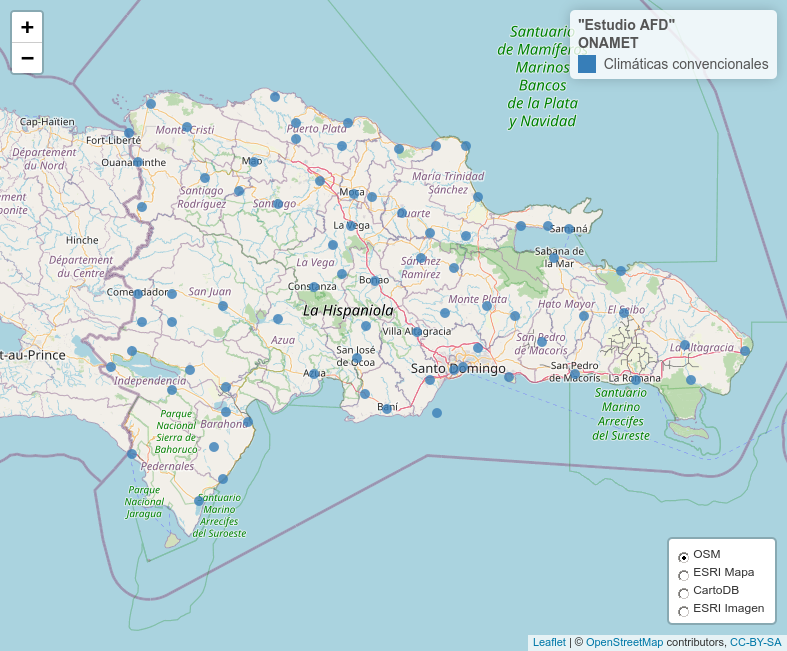

Consolidación de listas de estaciones
================
José Ramón Martínez Batlle

## Paquetes

``` r
library(sf)
library(leaflet)
library(mapview)
library(readODS)
library(readxl)
library(parzer)
library(tidyverse)
library(kableExtra)
library(pdftools)
library(datapasta)
source('R/funciones.R')
leaflet_map_view <- . %>% setView(lat = 18.7, lng = -70.3, zoom = 8)
```

## INDRHI

``` r
indrhi_telemetricas <- read_ods('fuentes/indrhi/Red_Telem_Estacion_Coord-Sept2015.ods')
indrhi_telemetricas$longitudOK <- indrhi_telemetricas$LONGITUDE
indrhi_telemetricas$latitudOK <- indrhi_telemetricas$LATITUDE
indrhi_telemetricas$idOK <- indrhi_telemetricas$`STATION SITE`
set.seed(100);indrhi_telemetricas[sample(seq_len(nrow(indrhi_telemetricas)), 10), ] %>%
  kable(booktabs=T) %>%
  kable_styling(latex_options = c("HOLD_position", "scale_down"))
```

<table class="table" style="margin-left: auto; margin-right: auto;">
<thead>
<tr>
<th style="text-align:left;">
</th>
<th style="text-align:left;">
STATION NAME
</th>
<th style="text-align:left;">
PROJECT
</th>
<th style="text-align:left;">
STATION SITE
</th>
<th style="text-align:left;">
STATION TYPE
</th>
<th style="text-align:right;">
LATITUDE
</th>
<th style="text-align:right;">
LONGITUDE
</th>
<th style="text-align:left;">
ADDRESS
</th>
<th style="text-align:left;">
VERIFICAR/TRANS
</th>
<th style="text-align:right;">
longitudOK
</th>
<th style="text-align:right;">
latitudOK
</th>
<th style="text-align:left;">
idOK
</th>
</tr>
</thead>
<tbody>
<tr>
<td style="text-align:left;">
74
</td>
<td style="text-align:left;">
HIDRO2
</td>
<td style="text-align:left;">
MONTE GRANDE
</td>
<td style="text-align:left;">
SABANA ALTA
</td>
<td style="text-align:left;">
Hidrométrica
</td>
<td style="text-align:right;">
18.72538
</td>
<td style="text-align:right;">
-71.10808
</td>
<td style="text-align:left;">
908692F8
</td>
<td style="text-align:left;">
NA
</td>
<td style="text-align:right;">
-71.10808
</td>
<td style="text-align:right;">
18.72538
</td>
<td style="text-align:left;">
SABANA ALTA
</td>
</tr>
<tr>
<td style="text-align:left;">
78
</td>
<td style="text-align:left;">
NA
</td>
<td style="text-align:left;">
INDRHI
</td>
<td style="text-align:left;">
YAQUE DEL NORTE BOMA
</td>
<td style="text-align:left;">
Hidrométrica
</td>
<td style="text-align:right;">
19.17857
</td>
<td style="text-align:right;">
-70.67452
</td>
<td style="text-align:left;">
9083864E
</td>
<td style="text-align:left;">
NA
</td>
<td style="text-align:right;">
-70.67452
</td>
<td style="text-align:right;">
19.17857
</td>
<td style="text-align:left;">
YAQUE DEL NORTE BOMA
</td>
</tr>
<tr>
<td style="text-align:left;">
23
</td>
<td style="text-align:left;">
NA
</td>
<td style="text-align:left;">
INDRHI
</td>
<td style="text-align:left;">
JIMA ABAJO burbuj
</td>
<td style="text-align:left;">
Hidrométrica
</td>
<td style="text-align:right;">
19.12813
</td>
<td style="text-align:right;">
-70.38149
</td>
<td style="text-align:left;">
9085350E
</td>
<td style="text-align:left;">
NA
</td>
<td style="text-align:right;">
-70.38149
</td>
<td style="text-align:right;">
19.12813
</td>
<td style="text-align:left;">
JIMA ABAJO burbuj
</td>
</tr>
<tr>
<td style="text-align:left;">
70
</td>
<td style="text-align:left;">
NA
</td>
<td style="text-align:left;">
INDRHI
</td>
<td style="text-align:left;">
PUENTE SAN RAFAEL(MAO)
</td>
<td style="text-align:left;">
Hidrométrica
</td>
<td style="text-align:right;">
19.58691
</td>
<td style="text-align:right;">
-71.06009
</td>
<td style="text-align:left;">
90858680
</td>
<td style="text-align:left;">
NA
</td>
<td style="text-align:right;">
-71.06009
</td>
<td style="text-align:right;">
19.58691
</td>
<td style="text-align:left;">
PUENTE SAN RAFAEL(MAO)
</td>
</tr>
<tr>
<td style="text-align:left;">
4
</td>
<td style="text-align:left;">
NA
</td>
<td style="text-align:left;">
INDRHI
</td>
<td style="text-align:left;">
BAO AGUA CALIENTE
</td>
<td style="text-align:left;">
Hidrométrica
</td>
<td style="text-align:right;">
19.24246
</td>
<td style="text-align:right;">
-70.89926
</td>
<td style="text-align:left;">
9085E366
</td>
<td style="text-align:left;">
NA
</td>
<td style="text-align:right;">
-70.89926
</td>
<td style="text-align:right;">
19.24246
</td>
<td style="text-align:left;">
BAO AGUA CALIENTE
</td>
</tr>
<tr>
<td style="text-align:left;">
55
</td>
<td style="text-align:left;">
NA
</td>
<td style="text-align:left;">
INDRHI
</td>
<td style="text-align:left;">
PRESA DE BLANCO
</td>
<td style="text-align:left;">
Presa+Climática
</td>
<td style="text-align:right;">
18.88467
</td>
<td style="text-align:right;">
-70.56257
</td>
<td style="text-align:left;">
9080A7AC
</td>
<td style="text-align:left;">
NA
</td>
<td style="text-align:right;">
-70.56257
</td>
<td style="text-align:right;">
18.88467
</td>
<td style="text-align:left;">
PRESA DE BLANCO
</td>
</tr>
<tr>
<td style="text-align:left;">
80
</td>
<td style="text-align:left;">
NA
</td>
<td style="text-align:left;">
INDRHI
</td>
<td style="text-align:left;">
YUNA LA VERDE
</td>
<td style="text-align:left;">
Hidrométrica
</td>
<td style="text-align:right;">
18.95745
</td>
<td style="text-align:right;">
-70.38368
</td>
<td style="text-align:left;">
9083F0DE
</td>
<td style="text-align:left;">
NA
</td>
<td style="text-align:right;">
-70.38368
</td>
<td style="text-align:right;">
18.95745
</td>
<td style="text-align:left;">
YUNA LA VERDE
</td>
</tr>
<tr>
<td style="text-align:left;">
7
</td>
<td style="text-align:left;">
NA
</td>
<td style="text-align:left;">
INDRHI
</td>
<td style="text-align:left;">
CENOVI
</td>
<td style="text-align:left;">
Climática
</td>
<td style="text-align:right;">
19.31833
</td>
<td style="text-align:right;">
-70.22777
</td>
<td style="text-align:left;">
9084F2EA
</td>
<td style="text-align:left;">
NA
</td>
<td style="text-align:right;">
-70.22777
</td>
<td style="text-align:right;">
19.31833
</td>
<td style="text-align:left;">
CENOVI
</td>
</tr>
<tr>
<td style="text-align:left;">
81
</td>
<td style="text-align:left;">
NA
</td>
<td style="text-align:left;">
INDRHI
</td>
<td style="text-align:left;">
YUNA PLATANAL
</td>
<td style="text-align:left;">
Hidrométrica
</td>
<td style="text-align:right;">
19.11913
</td>
<td style="text-align:right;">
-70.11311
</td>
<td style="text-align:left;">
9084026E
</td>
<td style="text-align:left;">
NA
</td>
<td style="text-align:right;">
-70.11311
</td>
<td style="text-align:right;">
19.11913
</td>
<td style="text-align:left;">
YUNA PLATANAL
</td>
</tr>
<tr>
<td style="text-align:left;">
76
</td>
<td style="text-align:left;">
NA
</td>
<td style="text-align:left;">
INDRHI
</td>
<td style="text-align:left;">
VALLE DE BAO
</td>
<td style="text-align:left;">
Pluviométrica
</td>
<td style="text-align:right;">
18.88026
</td>
<td style="text-align:right;">
-71.20339
</td>
<td style="text-align:left;">
9083005A
</td>
<td style="text-align:left;">
NA
</td>
<td style="text-align:right;">
-71.20339
</td>
<td style="text-align:right;">
18.88026
</td>
<td style="text-align:left;">
VALLE DE BAO
</td>
</tr>
</tbody>
</table>

``` r
indrhi_historico <- read_excel(
  path = 'fuentes/indrhi/Listado Red Medicion INDRHI_Historico_24-10-2022_revision_jr.xlsx'
  )
indrhi_historico$longitudOK <- 0 - parse_lon(indrhi_historico$LONGITUD)
indrhi_historico$longitudOK[sample(seq_len(length(indrhi_historico$longitudOK)), 10)]
```

    ##  [1]       NaN       NaN       NaN       NaN       NaN       NaN       NaN
    ##  [8] -70.91111       NaN -70.24028

``` r
indrhi_historico$latitudOK <- parse_lon(indrhi_historico$LATITUD)
indrhi_historico$latitudOK[sample(seq_len(length(indrhi_historico$latitudOK)), 10)]
```

    ##  [1]      NaN 18.29639      NaN      NaN 18.53500      NaN      NaN      NaN
    ##  [9]      NaN 18.69806

``` r
indrhi_historico$idOK <- indrhi_historico$ESTACION
indrhi_historico[sample(seq_len(nrow(indrhi_historico)), 10), ] %>%
  kable(booktabs=T) %>%
  kable_styling(latex_options = c("HOLD_position", "scale_down"))
```

<table class="table" style="margin-left: auto; margin-right: auto;">
<thead>
<tr>
<th style="text-align:right;">
ORDEN
</th>
<th style="text-align:left;">
CODIGO
</th>
<th style="text-align:right;">
X (UTM)
</th>
<th style="text-align:right;">
Y (UTM)
</th>
<th style="text-align:right;">
ELEVACION
</th>
<th style="text-align:left;">
ESTACION
</th>
<th style="text-align:left;">
NOMBRE_CUE
</th>
<th style="text-align:left;">
UBICACION
</th>
<th style="text-align:left;">
TIPO
</th>
<th style="text-align:left;">
LATITUD
</th>
<th style="text-align:left;">
LONGITUD
</th>
<th style="text-align:right;">
PRECIPITAC
</th>
<th style="text-align:right;">
DESDE
</th>
<th style="text-align:right;">
HASTA
</th>
<th style="text-align:right;">
DESDE \<\> 0
</th>
<th style="text-align:right;">
HASTA \<\> 0
</th>
<th style="text-align:right;">
¿Tiene ambas fechas?
</th>
<th style="text-align:right;">
longitudOK
</th>
<th style="text-align:right;">
latitudOK
</th>
<th style="text-align:left;">
idOK
</th>
</tr>
</thead>
<tbody>
<tr>
<td style="text-align:right;">
301
</td>
<td style="text-align:left;">
493104
</td>
<td style="text-align:right;">
260189
</td>
<td style="text-align:right;">
2103452
</td>
<td style="text-align:right;">
680
</td>
<td style="text-align:left;">
EL RODEO
</td>
<td style="text-align:left;">
Yaque del Sur/Arroyo Limon
</td>
<td style="text-align:left;">
El Rodeo
</td>
<td style="text-align:left;">
QD INDR
</td>
<td style="text-align:left;">
NA
</td>
<td style="text-align:left;">
NA
</td>
<td style="text-align:right;">
NA
</td>
<td style="text-align:right;">
NA
</td>
<td style="text-align:right;">
NA
</td>
<td style="text-align:right;">
NA
</td>
<td style="text-align:right;">
NA
</td>
<td style="text-align:right;">
NA
</td>
<td style="text-align:right;">
NaN
</td>
<td style="text-align:right;">
NaN
</td>
<td style="text-align:left;">
EL RODEO
</td>
</tr>
<tr>
<td style="text-align:right;">
670
</td>
<td style="text-align:left;">
1858
</td>
<td style="text-align:right;">
407952
</td>
<td style="text-align:right;">
2137993
</td>
<td style="text-align:right;">
25
</td>
<td style="text-align:left;">
TELANZA (Bajo Yuna)
</td>
<td style="text-align:left;">
Rio Yuna
</td>
<td style="text-align:left;">
Bajo Yuna
</td>
<td style="text-align:left;">
LD INDH
</td>
<td style="text-align:left;">
NA
</td>
<td style="text-align:left;">
NA
</td>
<td style="text-align:right;">
0
</td>
<td style="text-align:right;">
0
</td>
<td style="text-align:right;">
0
</td>
<td style="text-align:right;">
NA
</td>
<td style="text-align:right;">
NA
</td>
<td style="text-align:right;">
NA
</td>
<td style="text-align:right;">
NaN
</td>
<td style="text-align:right;">
NaN
</td>
<td style="text-align:left;">
TELANZA (Bajo Yuna)
</td>
</tr>
<tr>
<td style="text-align:right;">
158
</td>
<td style="text-align:left;">
333002
</td>
<td style="text-align:right;">
395718
</td>
<td style="text-align:right;">
2050580
</td>
<td style="text-align:right;">
12
</td>
<td style="text-align:left;">
Isabela
</td>
<td style="text-align:left;">
Rio Ozama/Isabela
</td>
<td style="text-align:left;">
Isabela
</td>
<td style="text-align:left;">
QD INDR
</td>
<td style="text-align:left;">
NA
</td>
<td style="text-align:left;">
NA
</td>
<td style="text-align:right;">
NA
</td>
<td style="text-align:right;">
NA
</td>
<td style="text-align:right;">
NA
</td>
<td style="text-align:right;">
NA
</td>
<td style="text-align:right;">
NA
</td>
<td style="text-align:right;">
NA
</td>
<td style="text-align:right;">
NaN
</td>
<td style="text-align:right;">
NaN
</td>
<td style="text-align:left;">
Isabela
</td>
</tr>
<tr>
<td style="text-align:right;">
733
</td>
<td style="text-align:left;">
5321
</td>
<td style="text-align:right;">
199012
</td>
<td style="text-align:right;">
2046061
</td>
<td style="text-align:right;">
31
</td>
<td style="text-align:left;">
JIMANI
</td>
<td style="text-align:left;">
Lago Enriquillo
</td>
<td style="text-align:left;">
Jimani
</td>
<td style="text-align:left;">
LD METN
</td>
<td style="text-align:left;">
NA
</td>
<td style="text-align:left;">
NA
</td>
<td style="text-align:right;">
0
</td>
<td style="text-align:right;">
0
</td>
<td style="text-align:right;">
0
</td>
<td style="text-align:right;">
NA
</td>
<td style="text-align:right;">
NA
</td>
<td style="text-align:right;">
NA
</td>
<td style="text-align:right;">
NaN
</td>
<td style="text-align:right;">
NaN
</td>
<td style="text-align:left;">
JIMANI
</td>
</tr>
<tr>
<td style="text-align:right;">
87
</td>
<td style="text-align:left;">
4922
</td>
<td style="text-align:right;">
263969
</td>
<td style="text-align:right;">
2117614
</td>
<td style="text-align:right;">
1620
</td>
<td style="text-align:left;">
Los Pinales
</td>
<td style="text-align:left;">
Rio Yaque del Sur
</td>
<td style="text-align:left;">
Los Pinales
</td>
<td style="text-align:left;">
LH
</td>
<td style="text-align:left;">
NA
</td>
<td style="text-align:left;">
NA
</td>
<td style="text-align:right;">
NA
</td>
<td style="text-align:right;">
NA
</td>
<td style="text-align:right;">
NA
</td>
<td style="text-align:right;">
NA
</td>
<td style="text-align:right;">
NA
</td>
<td style="text-align:right;">
NA
</td>
<td style="text-align:right;">
NaN
</td>
<td style="text-align:right;">
NaN
</td>
<td style="text-align:left;">
Los Pinales
</td>
</tr>
<tr>
<td style="text-align:right;">
607
</td>
<td style="text-align:left;">
6386
</td>
<td style="text-align:right;">
534750
</td>
<td style="text-align:right;">
2039250
</td>
<td style="text-align:right;">
50
</td>
<td style="text-align:left;">
EL NARANJAL
</td>
<td style="text-align:left;">
Rio San Rafael del Yuma
</td>
<td style="text-align:left;">
Higuey
</td>
<td style="text-align:left;">
CL AQUA
</td>
<td style="text-align:left;">
NA
</td>
<td style="text-align:left;">
NA
</td>
<td style="text-align:right;">
0
</td>
<td style="text-align:right;">
0
</td>
<td style="text-align:right;">
0
</td>
<td style="text-align:right;">
NA
</td>
<td style="text-align:right;">
NA
</td>
<td style="text-align:right;">
NA
</td>
<td style="text-align:right;">
NaN
</td>
<td style="text-align:right;">
NaN
</td>
<td style="text-align:left;">
EL NARANJAL
</td>
</tr>
<tr>
<td style="text-align:right;">
223
</td>
<td style="text-align:left;">
180003
</td>
<td style="text-align:right;">
404780
</td>
<td style="text-align:right;">
2119849
</td>
<td style="text-align:right;">
10
</td>
<td style="text-align:left;">
Villa Riva
</td>
<td style="text-align:left;">
Yuna/Yuna
</td>
<td style="text-align:left;">
Villa Riva
</td>
<td style="text-align:left;">
QD INDR
</td>
<td style="text-align:left;">
NA
</td>
<td style="text-align:left;">
NA
</td>
<td style="text-align:right;">
NA
</td>
<td style="text-align:right;">
NA
</td>
<td style="text-align:right;">
NA
</td>
<td style="text-align:right;">
NA
</td>
<td style="text-align:right;">
NA
</td>
<td style="text-align:right;">
NA
</td>
<td style="text-align:right;">
NaN
</td>
<td style="text-align:right;">
NaN
</td>
<td style="text-align:left;">
Villa Riva
</td>
</tr>
<tr>
<td style="text-align:right;">
732
</td>
<td style="text-align:left;">
5404
</td>
<td style="text-align:right;">
234597
</td>
<td style="text-align:right;">
2071375
</td>
<td style="text-align:right;">
720
</td>
<td style="text-align:left;">
EL CERCADO
</td>
<td style="text-align:left;">
Rio Artibonito
</td>
<td style="text-align:left;">
El Cercado
</td>
<td style="text-align:left;">
LD METN
</td>
<td style="text-align:left;">
NA
</td>
<td style="text-align:left;">
NA
</td>
<td style="text-align:right;">
0
</td>
<td style="text-align:right;">
0
</td>
<td style="text-align:right;">
0
</td>
<td style="text-align:right;">
NA
</td>
<td style="text-align:right;">
NA
</td>
<td style="text-align:right;">
NA
</td>
<td style="text-align:right;">
NaN
</td>
<td style="text-align:right;">
NaN
</td>
<td style="text-align:left;">
EL CERCADO
</td>
</tr>
<tr>
<td style="text-align:right;">
251
</td>
<td style="text-align:left;">
42102
</td>
<td style="text-align:right;">
306389
</td>
<td style="text-align:right;">
2129235
</td>
<td style="text-align:right;">
441
</td>
<td style="text-align:left;">
El Higuero
</td>
<td style="text-align:left;">
Yaque del Norte/Jagua
</td>
<td style="text-align:left;">
El Higuero
</td>
<td style="text-align:left;">
QD INDR
</td>
<td style="text-align:left;">
NA
</td>
<td style="text-align:left;">
NA
</td>
<td style="text-align:right;">
NA
</td>
<td style="text-align:right;">
NA
</td>
<td style="text-align:right;">
NA
</td>
<td style="text-align:right;">
NA
</td>
<td style="text-align:right;">
NA
</td>
<td style="text-align:right;">
NA
</td>
<td style="text-align:right;">
NaN
</td>
<td style="text-align:right;">
NaN
</td>
<td style="text-align:left;">
El Higuero
</td>
</tr>
<tr>
<td style="text-align:right;">
543
</td>
<td style="text-align:left;">
1838
</td>
<td style="text-align:right;">
358369
</td>
<td style="text-align:right;">
2133983
</td>
<td style="text-align:right;">
81
</td>
<td style="text-align:left;">
CENOVI SANTA ANA
</td>
<td style="text-align:left;">
Rio Yuna
</td>
<td style="text-align:left;">
Cenovi Santa An
</td>
<td style="text-align:left;">
LD INDH
</td>
<td style="text-align:left;">
NA
</td>
<td style="text-align:left;">
NA
</td>
<td style="text-align:right;">
NA
</td>
<td style="text-align:right;">
NA
</td>
<td style="text-align:right;">
NA
</td>
<td style="text-align:right;">
NA
</td>
<td style="text-align:right;">
NA
</td>
<td style="text-align:right;">
NA
</td>
<td style="text-align:right;">
NaN
</td>
<td style="text-align:right;">
NaN
</td>
<td style="text-align:left;">
CENOVI SANTA ANA
</td>
</tr>
</tbody>
</table>

## Fundación REDDOM

``` r
reddom <- read_excel(path = 'fuentes/reddom/Localizacion Estaciones Meterologicas CLIMARED_LT.xlsx',
                     skip = 2, col_names = T)
colnames(reddom) <- gsub('(^[0-9]$)', 'Temperatura-Humedad Suelo \\1', colnames(reddom))
(reddom$longitudOK <- reddom$Longitud)
```

    ##  [1] -71.34635 -71.56480 -71.21466 -71.61470 -71.19435 -70.60576 -70.74848
    ##  [8] -71.38353 -70.92510 -71.50160 -70.79701 -70.98673 -71.09064 -71.64626
    ## [15] -70.96859 -71.65865 -71.21455 -71.31737 -71.19988 -71.11765 -70.93845
    ## [22] -70.64679        NA -70.74990 -70.63360 -70.51910 -71.54292 -70.62268
    ## [29] -70.70682 -69.97047 -70.84041 -70.25831 -70.94145        NA

``` r
(reddom$latitudOK <- reddom$Latitud)
```

    ##  [1] 19.50247 19.50264 19.75922 19.78727 19.66831 19.12550 19.44292 19.60421
    ##  [9] 19.28876 18.71723 19.07087 19.53784 19.55873 19.84958 19.54510 19.70878
    ## [17] 19.66124 19.67714 19.63595 19.86363 19.73703 19.70652       NA 19.09705
    ## [25] 19.00903 19.23312 18.87926 19.54729 19.47227 19.00639 19.52976 19.04199
    ## [33] 18.73675       NA

``` r
reddom$idOK <- reddom$NOMBRE
reddom[sample(seq_len(nrow(reddom)), 10), ] %>% 
  kable(booktabs=T) %>%
  kable_styling(latex_options = c("HOLD_position", "scale_down"))
```

<table class="table" style="margin-left: auto; margin-right: auto;">
<thead>
<tr>
<th style="text-align:right;">
NUMERO
</th>
<th style="text-align:left;">
NOMBRE
</th>
<th style="text-align:left;">
LUGAR
</th>
<th style="text-align:right;">
Latitud
</th>
<th style="text-align:right;">
Longitud
</th>
<th style="text-align:left;">
Altura
</th>
<th style="text-align:left;">
Institucion vinculada
</th>
<th style="text-align:left;">
Temperatura-Humedad Suelo 1
</th>
<th style="text-align:left;">
Temperatura-Humedad Suelo 2
</th>
<th style="text-align:left;">
Temperatura-Humedad Suelo 3
</th>
<th style="text-align:left;">
Temperatura-Humedad Suelo 4
</th>
<th style="text-align:left;">
OTROS SENSORES
</th>
<th style="text-align:right;">
longitudOK
</th>
<th style="text-align:right;">
latitudOK
</th>
<th style="text-align:left;">
idOK
</th>
</tr>
</thead>
<tbody>
<tr>
<td style="text-align:right;">
24
</td>
<td style="text-align:left;">
Jumunuco_REDDOM
</td>
<td style="text-align:left;">
Jumunuco, Jarabacoa
</td>
<td style="text-align:right;">
19.09705
</td>
<td style="text-align:right;">
-70.74990
</td>
<td style="text-align:left;">
1004 mts
</td>
<td style="text-align:left;">
Cluster de Café de Jarabacoa
</td>
<td style="text-align:left;">
60 CM
</td>
<td style="text-align:left;">
40 CM
</td>
<td style="text-align:left;">
20 CM
</td>
<td style="text-align:left;">
Superficie
</td>
<td style="text-align:left;">
1 Sensor de hoja humedad
</td>
<td style="text-align:right;">
-70.74990
</td>
<td style="text-align:right;">
19.09705
</td>
<td style="text-align:left;">
Jumunuco_REDDOM
</td>
</tr>
<tr>
<td style="text-align:right;">
7
</td>
<td style="text-align:left;">
Unisa_Reddom
</td>
<td style="text-align:left;">
La Herradura, Santiago
</td>
<td style="text-align:right;">
19.44292
</td>
<td style="text-align:right;">
-70.74848
</td>
<td style="text-align:left;">
181 mts
</td>
<td style="text-align:left;">
Universidad ISA
</td>
<td style="text-align:left;">
60 CM
</td>
<td style="text-align:left;">
40 CM
</td>
<td style="text-align:left;">
20 CM
</td>
<td style="text-align:left;">
Superficie
</td>
<td style="text-align:left;">
1 Sensor de hoja humedad
</td>
<td style="text-align:right;">
-70.74848
</td>
<td style="text-align:right;">
19.44292
</td>
<td style="text-align:left;">
Unisa_Reddom
</td>
</tr>
<tr>
<td style="text-align:right;">
31
</td>
<td style="text-align:left;">
Cimpa_Reddom
</td>
<td style="text-align:left;">
Villa Gonzalez, Santiago
</td>
<td style="text-align:right;">
19.52976
</td>
<td style="text-align:right;">
-70.84041
</td>
<td style="text-align:left;">
101 MTS
</td>
<td style="text-align:left;">
CIMPA
</td>
<td style="text-align:left;">
60 CM
</td>
<td style="text-align:left;">
40 CM
</td>
<td style="text-align:left;">
20 CM
</td>
<td style="text-align:left;">
Superficie
</td>
<td style="text-align:left;">
1 Sensor de hoja humedad
</td>
<td style="text-align:right;">
-70.84041
</td>
<td style="text-align:right;">
19.52976
</td>
<td style="text-align:left;">
Cimpa_Reddom
</td>
</tr>
<tr>
<td style="text-align:right;">
1
</td>
<td style="text-align:left;">
Los_Tocones_Reddom
</td>
<td style="text-align:left;">
Los Tocones, Santiago Rodriguez
</td>
<td style="text-align:right;">
19.50247
</td>
<td style="text-align:right;">
-71.34635
</td>
<td style="text-align:left;">
122 mts
</td>
<td style="text-align:left;">
FEDEGANO
</td>
<td style="text-align:left;">
40 CM
</td>
<td style="text-align:left;">
20 CM
</td>
<td style="text-align:left;">
40 CM
</td>
<td style="text-align:left;">
20 CM
</td>
<td style="text-align:left;">
1 Sensor de hoja humedad
</td>
<td style="text-align:right;">
-71.34635
</td>
<td style="text-align:right;">
19.50247
</td>
<td style="text-align:left;">
Los_Tocones_Reddom
</td>
</tr>
<tr>
<td style="text-align:right;">
9
</td>
<td style="text-align:left;">
Los_Montones_Reddom
</td>
<td style="text-align:left;">
Los Montones, San Jose de Las Matas
</td>
<td style="text-align:right;">
19.28876
</td>
<td style="text-align:right;">
-70.92510
</td>
<td style="text-align:left;">
711 mts
</td>
<td style="text-align:left;">
Plan Sierra
</td>
<td style="text-align:left;">
60 CM
</td>
<td style="text-align:left;">
40 CM
</td>
<td style="text-align:left;">
20 CM
</td>
<td style="text-align:left;">
Superficie
</td>
<td style="text-align:left;">
1 Sensor de hoja humedad
</td>
<td style="text-align:right;">
-70.92510
</td>
<td style="text-align:right;">
19.28876
</td>
<td style="text-align:left;">
Los_Montones_Reddom
</td>
</tr>
<tr>
<td style="text-align:right;">
6
</td>
<td style="text-align:left;">
Esnamarena_Reddom
</td>
<td style="text-align:left;">
Jarabacoa, La Vega
</td>
<td style="text-align:right;">
19.12550
</td>
<td style="text-align:right;">
-70.60576
</td>
<td style="text-align:left;">
586 mts
</td>
<td style="text-align:left;">
Instituto Ambiental de Jarabacoa
</td>
<td style="text-align:left;">
60 CM
</td>
<td style="text-align:left;">
40 CM
</td>
<td style="text-align:left;">
20 CM
</td>
<td style="text-align:left;">
Superficie
</td>
<td style="text-align:left;">
1 Sensor de hoja humedad
</td>
<td style="text-align:right;">
-70.60576
</td>
<td style="text-align:right;">
19.12550
</td>
<td style="text-align:left;">
Esnamarena_Reddom
</td>
</tr>
<tr>
<td style="text-align:right;">
20
</td>
<td style="text-align:left;">
Novillero_Clay_REDDOM
</td>
<td style="text-align:left;">
Luperon, Puerto Plata
</td>
<td style="text-align:right;">
19.86363
</td>
<td style="text-align:right;">
-71.11765
</td>
<td style="text-align:left;">
NA
</td>
<td style="text-align:left;">
FEDEGANORTE
</td>
<td style="text-align:left;">
60 CM
</td>
<td style="text-align:left;">
40 CM
</td>
<td style="text-align:left;">
20 CM
</td>
<td style="text-align:left;">
Superficie
</td>
<td style="text-align:left;">
1 Sensor de hoja humedad
</td>
<td style="text-align:right;">
-71.11765
</td>
<td style="text-align:right;">
19.86363
</td>
<td style="text-align:left;">
Novillero_Clay_REDDOM
</td>
</tr>
<tr>
<td style="text-align:right;">
14
</td>
<td style="text-align:left;">
Montecristi_Oficina_Banelino
</td>
<td style="text-align:left;">
Montecristi
</td>
<td style="text-align:right;">
19.84958
</td>
<td style="text-align:right;">
-71.64626
</td>
<td style="text-align:left;">
18 mts
</td>
<td style="text-align:left;">
Banelino
</td>
<td style="text-align:left;">
no
</td>
<td style="text-align:left;">
NA
</td>
<td style="text-align:left;">
NA
</td>
<td style="text-align:left;">
NA
</td>
<td style="text-align:left;">
1 Sensor de hoja humedad
</td>
<td style="text-align:right;">
-71.64626
</td>
<td style="text-align:right;">
19.84958
</td>
<td style="text-align:left;">
Montecristi_Oficina_Banelino
</td>
</tr>
<tr>
<td style="text-align:right;">
11
</td>
<td style="text-align:left;">
Plan_Yaque_Manabao_Reddom
</td>
<td style="text-align:left;">
Manabao, Jarabacoa
</td>
<td style="text-align:right;">
19.07087
</td>
<td style="text-align:right;">
-70.79701
</td>
<td style="text-align:left;">
909 mts
</td>
<td style="text-align:left;">
Plan Yaque
</td>
<td style="text-align:left;">
60 CM
</td>
<td style="text-align:left;">
40 CM
</td>
<td style="text-align:left;">
20 CM
</td>
<td style="text-align:left;">
Superficie
</td>
<td style="text-align:left;">
1 Sensor de hoja humedad
</td>
<td style="text-align:right;">
-70.79701
</td>
<td style="text-align:right;">
19.07087
</td>
<td style="text-align:left;">
Plan_Yaque_Manabao_Reddom
</td>
</tr>
<tr>
<td style="text-align:right;">
13
</td>
<td style="text-align:left;">
Banelino_Mao
</td>
<td style="text-align:left;">
Mao, Valverde
</td>
<td style="text-align:right;">
19.55873
</td>
<td style="text-align:right;">
-71.09064
</td>
<td style="text-align:left;">
107 mts
</td>
<td style="text-align:left;">
Banelino
</td>
<td style="text-align:left;">
no
</td>
<td style="text-align:left;">
NA
</td>
<td style="text-align:left;">
NA
</td>
<td style="text-align:left;">
NA
</td>
<td style="text-align:left;">
1 Sensor de hoja humedad
</td>
<td style="text-align:right;">
-71.09064
</td>
<td style="text-align:right;">
19.55873
</td>
<td style="text-align:left;">
Banelino_Mao
</td>
</tr>
</tbody>
</table>

## INTEC

``` r
intec <- read_excel(path = 'fuentes/intec/Lista estaciones meteorológicas OCCR.xlsx',
                    skip = 7, col_names = T)
colnames(intec) <- c(colnames(intec)[c(1, 2)], c('longitud', 'latitud'), colnames(intec)[c(5, 6)])
(intec$longitudOK <- parse_lon(intec$longitud))
```

    ## [1] -69.95306 -69.28655 -69.55257 -70.69772 -69.95045

``` r
(intec$latitudOK <- parse_lat(gsub('\\. ', '\\.', intec$latitud)))
```

    ## [1] 18.49500 18.47433 19.03248 19.49751 18.45637

``` r
intec$Marca <- intec$Marca[1]
intec$`Parámetros que miden` <- intec$`Parámetros que miden`[1]
intec$idOK <- intec$Ubicación
intec %>% 
  kable(booktabs=T) %>%
  kable_styling(latex_options = c("HOLD_position", "scale_down"))
```

<table class="table" style="margin-left: auto; margin-right: auto;">
<thead>
<tr>
<th style="text-align:right;">
Estación
</th>
<th style="text-align:left;">
Ubicación
</th>
<th style="text-align:left;">
longitud
</th>
<th style="text-align:left;">
latitud
</th>
<th style="text-align:left;">
Marca
</th>
<th style="text-align:left;">
Parámetros que miden
</th>
<th style="text-align:right;">
longitudOK
</th>
<th style="text-align:right;">
latitudOK
</th>
<th style="text-align:left;">
idOK
</th>
</tr>
</thead>
<tbody>
<tr>
<td style="text-align:right;">
1
</td>
<td style="text-align:left;">
Jardín Botánico de Santo Domingo
</td>
<td style="text-align:left;">
W-69 57.18333333
</td>
<td style="text-align:left;">
N18 29.7
</td>
<td style="text-align:left;">
Davis Vantage Pro2
</td>
<td style="text-align:left;">
Presión barométrica, precipitación, velocidad y dirección del viento,
radiación solar, humedad y temperatura del ambiente. 
</td>
<td style="text-align:right;">
-69.95306
</td>
<td style="text-align:right;">
18.49500
</td>
<td style="text-align:left;">
Jardín Botánico de Santo Domingo
</td>
</tr>
<tr>
<td style="text-align:right;">
2
</td>
<td style="text-align:left;">
San Pedro de Macorís
</td>
<td style="text-align:left;">
W-69 17.193
</td>
<td style="text-align:left;">
N18 28.4595
</td>
<td style="text-align:left;">
Davis Vantage Pro2
</td>
<td style="text-align:left;">
Presión barométrica, precipitación, velocidad y dirección del viento,
radiación solar, humedad y temperatura del ambiente. 
</td>
<td style="text-align:right;">
-69.28655
</td>
<td style="text-align:right;">
18.47433
</td>
<td style="text-align:left;">
San Pedro de Macorís
</td>
</tr>
<tr>
<td style="text-align:right;">
3
</td>
<td style="text-align:left;">
Las Terrenas
</td>
<td style="text-align:left;">
W-69 33.153852
</td>
<td style="text-align:left;">
N19 1. 948976
</td>
<td style="text-align:left;">
Davis Vantage Pro2
</td>
<td style="text-align:left;">
Presión barométrica, precipitación, velocidad y dirección del viento,
radiación solar, humedad y temperatura del ambiente. 
</td>
<td style="text-align:right;">
-69.55257
</td>
<td style="text-align:right;">
19.03248
</td>
<td style="text-align:left;">
Las Terrenas
</td>
</tr>
<tr>
<td style="text-align:right;">
4
</td>
<td style="text-align:left;">
Jardín Botánico de Santiago
</td>
<td style="text-align:left;">
W-70 41.86314
</td>
<td style="text-align:left;">
N19 29.85042
</td>
<td style="text-align:left;">
Davis Vantage Pro2
</td>
<td style="text-align:left;">
Presión barométrica, precipitación, velocidad y dirección del viento,
radiación solar, humedad y temperatura del ambiente. 
</td>
<td style="text-align:right;">
-70.69772
</td>
<td style="text-align:right;">
19.49751
</td>
<td style="text-align:left;">
Jardín Botánico de Santiago
</td>
</tr>
<tr>
<td style="text-align:right;">
5
</td>
<td style="text-align:left;">
Colegio Quisqueya, Santo Domingo
</td>
<td style="text-align:left;">
W -69.950447
</td>
<td style="text-align:left;">
N 18.456372
</td>
<td style="text-align:left;">
Davis Vantage Pro2
</td>
<td style="text-align:left;">
Presión barométrica, precipitación, velocidad y dirección del viento,
radiación solar, humedad y temperatura del ambiente. 
</td>
<td style="text-align:right;">
-69.95045
</td>
<td style="text-align:right;">
18.45637
</td>
<td style="text-align:left;">
Colegio Quisqueya, Santo Domingo
</td>
</tr>
</tbody>
</table>

## Guakia

``` r
guakia <- read_ods('fuentes/guakia/estaciones_guakia.ods')
(guakia$longitudOK <- guakia$LONGITUDE)
```

    ## [1] -69.9935

``` r
(guakia$latitudOK <- guakia$LATITUDE)
```

    ## [1] 19.2905

``` r
guakia$idOK <- guakia$IDENTIFICADOR
guakia %>%
  kable(booktabs=T) %>%
  kable_styling(latex_options = c("HOLD_position", "scale_down"))
```

<table class="table" style="margin-left: auto; margin-right: auto;">
<thead>
<tr>
<th style="text-align:left;">
IDENTIFICADOR
</th>
<th style="text-align:left;">
TIPO DE ESTACION
</th>
<th style="text-align:left;">
MARCA COMERCIAL
</th>
<th style="text-align:right;">
LONGITUDE
</th>
<th style="text-align:right;">
LATITUDE
</th>
<th style="text-align:left;">
FECHA DE INICIO DE OPERACIONES
</th>
<th style="text-align:left;">
FECHA DE FINALIZACIÓN DE OPERACIONES
</th>
<th style="text-align:left;">
ESTADO ACTUAL
</th>
<th style="text-align:right;">
longitudOK
</th>
<th style="text-align:right;">
latitudOK
</th>
<th style="text-align:left;">
idOK
</th>
</tr>
</thead>
<tbody>
<tr>
<td style="text-align:left;">
Vuelta Larga
</td>
<td style="text-align:left;">
climática
</td>
<td style="text-align:left;">
Pluviómetro manual (de hasta 6’’) y termómetro TESTO 176 T2
</td>
<td style="text-align:right;">
-69.9935
</td>
<td style="text-align:right;">
19.2905
</td>
<td style="text-align:left;">
01/05/15
</td>
<td style="text-align:left;">
NA
</td>
<td style="text-align:left;">
activa
</td>
<td style="text-align:right;">
-69.9935
</td>
<td style="text-align:right;">
19.2905
</td>
<td style="text-align:left;">
Vuelta Larga
</td>
</tr>
</tbody>
</table>

## Consolidado

``` r
lista_estaciones <- list(
  indrhi_telemetricas = indrhi_telemetricas,
  indrhi_historico = indrhi_historico,
  intec = intec,
  reddom = reddom,
  guakia = guakia)
consolidado_estaciones <- bind_rows(lista_estaciones, .id = 'fuente')[, c('fuente', 'idOK', 'longitudOK', 'latitudOK')]
consolidado_estaciones[sample(seq_len(nrow(consolidado_estaciones)), 30), ] %>% 
  kable(booktabs=T) %>%
  kable_styling(latex_options = c("HOLD_position", "scale_down"))
```

<table class="table" style="margin-left: auto; margin-right: auto;">
<thead>
<tr>
<th style="text-align:left;">
</th>
<th style="text-align:left;">
fuente
</th>
<th style="text-align:left;">
idOK
</th>
<th style="text-align:right;">
longitudOK
</th>
<th style="text-align:right;">
latitudOK
</th>
</tr>
</thead>
<tbody>
<tr>
<td style="text-align:left;">
846
</td>
<td style="text-align:left;">
reddom
</td>
<td style="text-align:left;">
Chacuey_Reddom
</td>
<td style="text-align:right;">
-71.56480
</td>
<td style="text-align:right;">
19.50264
</td>
</tr>
<tr>
<td style="text-align:left;">
600
</td>
<td style="text-align:left;">
indrhi_historico
</td>
<td style="text-align:left;">
El Torito
</td>
<td style="text-align:right;">
NaN
</td>
<td style="text-align:right;">
NaN
</td>
</tr>
<tr>
<td style="text-align:left;">
387
</td>
<td style="text-align:left;">
indrhi_historico
</td>
<td style="text-align:left;">
Hondo Valle
</td>
<td style="text-align:right;">
NaN
</td>
<td style="text-align:right;">
NaN
</td>
</tr>
<tr>
<td style="text-align:left;">
420
</td>
<td style="text-align:left;">
indrhi_historico
</td>
<td style="text-align:left;">
EL RECODO
</td>
<td style="text-align:right;">
NaN
</td>
<td style="text-align:right;">
NaN
</td>
</tr>
<tr>
<td style="text-align:left;">
371
</td>
<td style="text-align:left;">
indrhi_historico
</td>
<td style="text-align:left;">
El Rosario
</td>
<td style="text-align:right;">
NaN
</td>
<td style="text-align:right;">
NaN
</td>
</tr>
<tr>
<td style="text-align:left;">
430
</td>
<td style="text-align:left;">
indrhi_historico
</td>
<td style="text-align:left;">
PRESA MANA LA PRESA
</td>
<td style="text-align:right;">
NaN
</td>
<td style="text-align:right;">
NaN
</td>
</tr>
<tr>
<td style="text-align:left;">
254
</td>
<td style="text-align:left;">
indrhi_historico
</td>
<td style="text-align:left;">
La Cruz
</td>
<td style="text-align:right;">
NaN
</td>
<td style="text-align:right;">
NaN
</td>
</tr>
<tr>
<td style="text-align:left;">
47
</td>
<td style="text-align:left;">
indrhi_telemetricas
</td>
<td style="text-align:left;">
MATA GRANDE
</td>
<td style="text-align:right;">
-70.00061
</td>
<td style="text-align:right;">
19.18329
</td>
</tr>
<tr>
<td style="text-align:left;">
439
</td>
<td style="text-align:left;">
indrhi_historico
</td>
<td style="text-align:left;">
LOS BOLOS
</td>
<td style="text-align:right;">
-71.65139
</td>
<td style="text-align:right;">
18.63139
</td>
</tr>
<tr>
<td style="text-align:left;">
708
</td>
<td style="text-align:left;">
indrhi_historico
</td>
<td style="text-align:left;">
EL PINAR
</td>
<td style="text-align:right;">
NaN
</td>
<td style="text-align:right;">
NaN
</td>
</tr>
<tr>
<td style="text-align:left;">
12
</td>
<td style="text-align:left;">
indrhi_telemetricas
</td>
<td style="text-align:left;">
EL CACHEO
</td>
<td style="text-align:right;">
-71.11614
</td>
<td style="text-align:right;">
18.81878
</td>
</tr>
<tr>
<td style="text-align:left;">
121
</td>
<td style="text-align:left;">
indrhi_historico
</td>
<td style="text-align:left;">
MANABAO
</td>
<td style="text-align:right;">
-70.79444
</td>
<td style="text-align:right;">
19.06389
</td>
</tr>
<tr>
<td style="text-align:left;">
16
</td>
<td style="text-align:left;">
indrhi_telemetricas
</td>
<td style="text-align:left;">
EL POPOTE
</td>
<td style="text-align:right;">
-71.12742
</td>
<td style="text-align:right;">
18.81294
</td>
</tr>
<tr>
<td style="text-align:left;">
406
</td>
<td style="text-align:left;">
indrhi_historico
</td>
<td style="text-align:left;">
JUNTA DE LOS RIOS
</td>
<td style="text-align:right;">
NaN
</td>
<td style="text-align:right;">
NaN
</td>
</tr>
<tr>
<td style="text-align:left;">
643
</td>
<td style="text-align:left;">
indrhi_historico
</td>
<td style="text-align:left;">
CACIQUE
</td>
<td style="text-align:right;">
-69.86389
</td>
<td style="text-align:right;">
18.81389
</td>
</tr>
<tr>
<td style="text-align:left;">
133
</td>
<td style="text-align:left;">
indrhi_historico
</td>
<td style="text-align:left;">
LOS MAGUEYES
</td>
<td style="text-align:right;">
NaN
</td>
<td style="text-align:right;">
NaN
</td>
</tr>
<tr>
<td style="text-align:left;">
556
</td>
<td style="text-align:left;">
indrhi_historico
</td>
<td style="text-align:left;">
EL PALMAR
</td>
<td style="text-align:right;">
NaN
</td>
<td style="text-align:right;">
NaN
</td>
</tr>
<tr>
<td style="text-align:left;">
853
</td>
<td style="text-align:left;">
reddom
</td>
<td style="text-align:left;">
Los_Montones_Reddom
</td>
<td style="text-align:right;">
-70.92510
</td>
<td style="text-align:right;">
19.28876
</td>
</tr>
<tr>
<td style="text-align:left;">
156
</td>
<td style="text-align:left;">
indrhi_historico
</td>
<td style="text-align:left;">
Los Mechesitos
</td>
<td style="text-align:right;">
NaN
</td>
<td style="text-align:right;">
NaN
</td>
</tr>
<tr>
<td style="text-align:left;">
757
</td>
<td style="text-align:left;">
indrhi_historico
</td>
<td style="text-align:left;">
DAJABON
</td>
<td style="text-align:right;">
NaN
</td>
<td style="text-align:right;">
NaN
</td>
</tr>
<tr>
<td style="text-align:left;">
281
</td>
<td style="text-align:left;">
indrhi_historico
</td>
<td style="text-align:left;">
MARTINEZ
</td>
<td style="text-align:right;">
NaN
</td>
<td style="text-align:right;">
NaN
</td>
</tr>
<tr>
<td style="text-align:left;">
554
</td>
<td style="text-align:left;">
indrhi_historico
</td>
<td style="text-align:left;">
BARAHONA
</td>
<td style="text-align:right;">
NaN
</td>
<td style="text-align:right;">
NaN
</td>
</tr>
<tr>
<td style="text-align:left;">
655
</td>
<td style="text-align:left;">
indrhi_historico
</td>
<td style="text-align:left;">
Pedernales
</td>
<td style="text-align:right;">
NaN
</td>
<td style="text-align:right;">
NaN
</td>
</tr>
<tr>
<td style="text-align:left;">
185
</td>
<td style="text-align:left;">
indrhi_historico
</td>
<td style="text-align:left;">
Cajuilito
</td>
<td style="text-align:right;">
NaN
</td>
<td style="text-align:right;">
NaN
</td>
</tr>
<tr>
<td style="text-align:left;">
298
</td>
<td style="text-align:left;">
indrhi_historico
</td>
<td style="text-align:left;">
PALMA HERRA
</td>
<td style="text-align:right;">
NaN
</td>
<td style="text-align:right;">
NaN
</td>
</tr>
<tr>
<td style="text-align:left;">
844
</td>
<td style="text-align:left;">
intec
</td>
<td style="text-align:left;">
Colegio Quisqueya, Santo Domingo
</td>
<td style="text-align:right;">
-69.95045
</td>
<td style="text-align:right;">
18.45637
</td>
</tr>
<tr>
<td style="text-align:left;">
421
</td>
<td style="text-align:left;">
indrhi_historico
</td>
<td style="text-align:left;">
LOS JENGIBRES
</td>
<td style="text-align:right;">
-70.04723
</td>
<td style="text-align:right;">
19.43889
</td>
</tr>
<tr>
<td style="text-align:left;">
666
</td>
<td style="text-align:left;">
indrhi_historico
</td>
<td style="text-align:left;">
Anamuya
</td>
<td style="text-align:right;">
NaN
</td>
<td style="text-align:right;">
NaN
</td>
</tr>
<tr>
<td style="text-align:left;">
490
</td>
<td style="text-align:left;">
indrhi_historico
</td>
<td style="text-align:left;">
EL CERRO
</td>
<td style="text-align:right;">
-69.77222
</td>
<td style="text-align:right;">
18.78333
</td>
</tr>
<tr>
<td style="text-align:left;">
792
</td>
<td style="text-align:left;">
indrhi_historico
</td>
<td style="text-align:left;">
SAN CRISTOBAL
</td>
<td style="text-align:right;">
NaN
</td>
<td style="text-align:right;">
NaN
</td>
</tr>
</tbody>
</table>

``` r
consolidado_estaciones_sf <- st_as_sf(
  consolidado_estaciones[!with(consolidado_estaciones, is.na(longitudOK) | is.na(latitudOK)), ] %>% 
     group_by(fuente) %>% mutate(fuente = paste0(fuente, ' (', n(), ')')),
  coords = c('longitudOK', 'latitudOK'))
nrow(consolidado_estaciones_sf)
```

    ## [1] 237

``` r
table(gsub(' \\(.*$', '', consolidado_estaciones_sf$fuente)) %>%
  kable(booktabs=T, col.names = c('Fuente', 'Número de estaciones')) %>%
  kable_styling(latex_options = c("HOLD_position"))
```

<table class="table" style="margin-left: auto; margin-right: auto;">
<thead>
<tr>
<th style="text-align:left;">
Fuente
</th>
<th style="text-align:right;">
Número de estaciones
</th>
</tr>
</thead>
<tbody>
<tr>
<td style="text-align:left;">
guakia
</td>
<td style="text-align:right;">
1
</td>
</tr>
<tr>
<td style="text-align:left;">
indrhi_historico
</td>
<td style="text-align:right;">
121
</td>
</tr>
<tr>
<td style="text-align:left;">
indrhi_telemetricas
</td>
<td style="text-align:right;">
78
</td>
</tr>
<tr>
<td style="text-align:left;">
intec
</td>
<td style="text-align:right;">
5
</td>
</tr>
<tr>
<td style="text-align:left;">
reddom
</td>
<td style="text-align:right;">
32
</td>
</tr>
</tbody>
</table>

## Mapa datos 2022

Versión interactiva del mapa,
[aquí](https://geofis.github.io/datos-meteoclimaticos-escenarios-cc/consolidacion-lista-estaciones.html#mapa-datos-2022)

<!-- -->

## Consolidación estaciones INDRHI, ONAMET, REDDOM

### Telemétricas INDRHI

<!-- #### sf -->

#### Mapa de estaciones telemétricas INDRHI estudio AFD

Versión interactiva del mapa,
[aquí](https://geofis.github.io/datos-meteoclimaticos-escenarios-cc/consolidacion-lista-estaciones.html#mapa-de-estaciones-telemétricas-indrhi-estudio-afd)

<!-- -->

### Meterológicas ONAMET

<!-- #### sf -->

#### Mapa de estaciones climáticas convencionales ONAMET estudio AFD

Versión interactiva del mapa,
[aquí](https://geofis.github.io/datos-meteoclimaticos-escenarios-cc/consolidacion-lista-estaciones.html#mapa-de-estaciones-climáticas-convencionales-onamet-estudio-afd)

<!-- -->

### Automáticas ONAMET

<!-- #### sf -->

#### Mapa de estaciones automáticas ONAMET estudio AFD

Versión interactiva del mapa,
[aquí](https://geofis.github.io/datos-meteoclimaticos-escenarios-cc/consolidacion-lista-estaciones.html#mapa-de-estaciones-automáticas-onamet-estudio-afd)

<!-- -->

### Climatológicas REDDOM

<!-- #### sf -->

#### Mapa de estaciones climatológicas REDDOM estudio AFD

Versión interactiva del mapa,
[aquí](https://geofis.github.io/datos-meteoclimaticos-escenarios-cc/consolidacion-lista-estaciones.html#mapa-de-estaciones-climatológicas-reddom-estudio-afd)

<!-- -->
