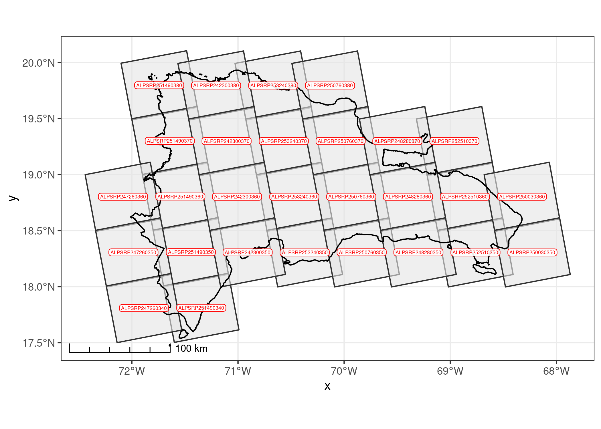

Selección de sitios para el establecimiento de una red de estaciones
hidrométricas usando decisión multicriterio y análisis hidrológico con
modelo digital de elevaciones. Suplemento metodológico
================
José Martínez<br>Michela Izzo

Versión HTML (más legible e interactiva),
[aquí](https://geofis.github.io/datos-meteoclimaticos-escenarios-cc/seleccion-sitios-red-de-estaciones-hidrometricas-suplemento-metodologico.html)

## Procedimiento

A pesar de la importancia de los datos hidrométricos para diseñar e
implementar políticas efectivas de gestión de recursos hídricos,
actualmente, la red de estaciones hidrométricas en funcionamiento en
República Dominicana es limitada y enfrenta diversos desafíos (Burn
1997; INDRHI 2019; A. K. Mishra y Coulibaly 2010; Ashok K. Mishra y
Coulibaly 2009). La distribución de estas estaciones es poco uniforme y,
las que se encuentran en funcionamiento, están amenazadas por problemas
de mantenimiento y reposición, debido a los bajos presupuestos asignados
para este propósito y a la falta de personal estable (INDRHI 2019).

En el año 2019, solo 30 de un total de 170 estaciones hidrométricas
inventariadas se encontraban en funcionamiento (INDRHI 2019). Se
desconoce el estado actual de la red, pero a la fecha de elaboración de
este informe, el personal técnico del INDRHI indicó que algunas
estaciones podrían haber salido del sistema por problemas de
nombramiento de personal y mantenimiento. Por lo tanto, es esencial
expandir esta red para mejorar la representatividad y la precisión de
los datos hidrométricos, lo que constituye una prioridad crítica.

La selección de sitios adecuados para la instalación de estaciones
hidrométricas es crucial para la obtención de datos precisos y
representativos (Ashok K. Mishra y Coulibaly 2009). Se deben considerar
varios criterios relevantes, como la heterogeneidad climática y
topográfica de la región, ya que estas variables influyen en la
distribución de las precipitaciones y, por extensión, en la escorrentía
dentro de la cuenca (World Meteorological Organization (WMO) y The
International Association of Hydrological Sciences 1976). Además, la
accesibilidad del sitio es fundamental para garantizar que el
mantenimiento y la operación de las estaciones se pueda llevar a cabo de
manera eficiente (Rojas Briceño et al. 2021).

Los criterios arriba mencionados fueron usados por este mismo equipo de
investigación para proponer una red de estaciones meteoclimáticas, por
lo consideramos oportuno aprovecharlos igualmente para diseñar la red de
estaciones hidrométricas. En particular, las estaciones hidrométricas
deben colocarse sobre corrientes fluviales donde midan los caudales de
agua, por lo que es necesario contar con información geográfica precisa
y densa sobre la red hidrográfica dominicana. Varios criterios
adicionales deben cumplir los sitios de medición (Rantz 1982a, 1982b):

1.  El tramo de corriente o curso fluvial (río, arroyo, cañada) elegido
    debe ser recto durante unos 100 metros corriente arriba y abajo del
    sitio de medición.
2.  En todos los niveles, el flujo total está en una única corriente,
    sin flujo subterráneo que evite el sitio de interés.
3.  El lecho del curso fluvial y sus márgenes, no sufren erosión ni
    sedimentación y están libres de plantas acuáticas (sección estable).
4.  Las orillas de la corriente fluvial son permanentes, sin matorrales
    y lo suficientemente altas como para contener inundaciones.
5.  Preferiblemente, el curso tiene controles naturales invariables
    (sección estable): son preferidos los lugares con afloramientos de
    sustrato y con rápidos estables para condiciones de flujo bajo, así
    como los estrechamientos del canal o una cascada o caída que no esté
    sumergida en momentos de flujo alto. Cuando estas condiciones no se
    pueden conseguir en el sitio elegido, entonces es necesaria la
    realización de una obra, como por ejemplo un vertedero. Sin embargo,
    no en todos los ríos es posible realizar esta obra, sobre todo si se
    trata de ríos muy anchos, por lo que se recurre a métodos alternos
    de medición de velocidades y estimación de área de la sección (área
    elemental).
6.  En niveles extremadamente bajos, existe escorrentía o pozas aunque
    sólo sea aguas arriba, lo cual permite la continuidad de medición y
    evita altas velocidades en momentos de restablecimiento del caudal.
7.  El sitio candidato está lo suficientemente alejado de confluencias o
    de los efectos de las mareas para evitar impactos indeseados en la
    medición.
8.  Hay un tramo disponible para medir el caudal en todos los niveles
    cerca del sitio de medición.
9.  El sitio es accesible para instalar, operar y mantener el lugar de
    medición, siendo su elección un compromiso entre estos criterios.

Para obtener algunos de estos criterios, es necesario compilar datos
hidrológicos, geológicos y topográficos a nivel nacional. En principio,
y reduciendo el análisis de selección de sitios a fuentes geoespaciales
disponibles o derivables, se deben identificar tramos de cursos
fluviales que cumplan con las siguientes características (Rantz 1982a,
1982b):

1.  Alineación recta.
2.  Rocas consolidadas expuestas (en contraposición a los sedimentos
    aluviales).
3.  Las márgenes sujetas a desbordamiento.
4.  Márgenes pronunciadas para garantizar el confinamiento del flujo.
5.  Canales divididos.
6.  Posible impacto de fenómenos/estructuras aguas arriba que induzcan
    variabilidad. Estos efectos pueden ser causados por afluentes,
    confluencias o embalses.
7.  Viabilidad de instalar medidores de flujo.

Los criterios anteriores pueden derivarse a partir de una precisa y
densa red hidrográfica del país, además de disponiendo de datos
complementarios que puedan manejarse de forma integrada por medio de un
sistema de información geográfica. Sin embargo, las fuentes de
información geográfica sobre la hidrografía dominicana disponibles al
público, no cuentan con la resolución espacial requerida como para
generar todos los criterios relacionados arriba.

Existen al menos dos fuentes de información geográfica sobre la red
hidrográfica dominicana. La primera es la red digitalizada a partir del
mapa topográfico nacional escala 1:50,000 (“MTN-50k”) (Instituto
Cartográfico Militar (ICM) 1989). La red del MTN-50K, aunque es bastante
exhaustiva, es realmente una red parcial, y no aporta características
morfométricas de las corrientes fluviales (e.g. jerarquía), además de
que no es lo suficientemente precisa como para utilizarla, por sí sola,
en análisis morfométricos. No obstante, dicha red puede servir de insumo
para algoritmos semiautomáticos de extracción de drenajes (e.g. tallado
de red).

La segunda fuente sobre la hidrografía dominicana es un conjunto de
documentos técnicos y multitemáticos, tanto de ámbito nacional (INDRHI
2012, 1996; INDRHI y AQUATER 2000; INDRHI y EPTISA 2000; OEA y INDRHI
1994; Secretaría de Estado de Medio Ambiente y Recursos Naturales 2004;
Rodríguez y Febrillet 2006), como de cuencas seleccionadas (CIDIAT y
INDRHI 1992; Halcrow-COR Ing. S.A. 2002; SERCITEC y INDRHI 2002),
realizados por personal del Instituto Nacional de Recursos Hidráulicos
(INDRHI). Sin embargo, cada uno fue generado por métodos distintos y no
permiten la consolidación de una hidrografía consistente de ámbito
nacional. Cabe destacar que se están dando pasos en esa dirección
actualmente, tras el inicio de los trabajos de actualización del Plan
Hidrológico Nacional, pero se trata de una iniciativa en curso al
momento de realizarse esta investigación.

El presente estudio tiene, como primer objetivo generar una red de ríos,
arroyos y cañadas (en la terminología geomorfológica, *talweg*, o línea
que une puntos de elevaciones mínimas en vaguadas) densa que combine las
fuentes abiertas más precisas disponibles a la fecha, con miras a
seleccionar sitios idóneos para la instalación de estaciones
hidrométricas. En concreto, y para este cometido, optamos por generar la
red a partir del modelo digital de elevaciones de mayor resolución
espacial disponible al público en la actualidad, usando métodos
semiautomáticos implementados en software de código abierto, y
apoyándonos en fuentes pre-existentes, como el mapa topográfico nacional
y el mapa geológico, entre otros.

Como segundo objetivo nos planteamos seleccionar sitios idóneos para la
instalación de estaciones hidrométricas, exclusivamente para corrientes
fluviales, excluyendo mediciones de pozos, lagos, canales de riego,
embalses y otros cuerpos de agua distintos a ríos, arroyos y cañadas.
Para esta labor, y como parte del diseño de la investigación,
aprovechamos las unidades hexagonales ya elegidas previamente en el
estudio complementario a este, donde se propuso aumentar la densidad de
la red estaciones meteoclimáticas (ver informe titulado “[Selección de
sitios para el establecimiento de una red de estaciones meteoclimáticas
en República Dominicana usando decisión multicriterio y análisis de
vecindad](https://geofis.github.io/datos-meteoclimaticos-escenarios-cc/seleccion-sitios-red-de-estaciones.html)”).
Adicionalmente, uno de nuestros objetivos específicos es crear, por
medios semiautomáticos, una red hidrográfica densa y robusta a partir de
fuentes abiertas y precisas.

> Notas sobre la unidad elemental *talweg* y la precisión de la red. Un
> *talweg* es una línea imaginaria sobre el terreno que une los puntos
> de más bajos de un valle (Foucault y Raoult 1985). Por lo tanto, no es
> el equivalente a un curso fluvial permanente, pues la circulación de
> agua dependerá de otros factores además de los meramente topgráficos
> (clima, umbral de acumulación elegido, sustrato, entre otros). En
> nuestro mapa, un *talweg* refleja el espacio por donde,
> potencialmente, el sobrante de agua circularía en forma de escorrentía
> superficial en condiciones de suelo saturado. Sin embargo, el trazado
> final que describa la escorrentía, estará condicionado por múltiples
> factores (temporales, de cobertura, de suelo) siendo en gran medida
> dependiente de la precisión del DEM y del relieve en cuestión.
> Particularmente, sobre la precisión de la red, consideramos que es
> alta en sistemas montañososos no kársticos, y media en sistemas
> kársticos. En particular, refiriéndonos a los sistemas kársticos, la
> incertidumbre fue ligeramente mayor en nuestro mapa porque no se
> dispone de un inventario exhaustivo y preciso de depresiones
> (e.g. dolinas), que son, en última instancia, las que condicionan la
> topología y jerarquización de la red en estos relieves. Para llenar
> este vacío, a partir del modelo de elevaciones elegido, creamos
> nuestro propio inventario de depresiones, pero lo usamos con cautela
> para definir la localización de sumideros reales por donde el flujo se
> infiltra al karst. Finalmente, es importante señalar que, en áreas
> urbanas y llanas, así como en campos con canales de riego, nuestra red
> puede tener una baja precisión. No obstante, esto no afecta el alcance
> de nuestro estudio, ya que nuestros objetivos se centran en otras
> áreas.

Los resultados de este estudio ofrecen la oportunidad de mejorar la red
de estaciones hidrométricas, y tienen el potencial de informar medidas
de conservación, planificación y gestión de recursos hídricos a nivel
nacional, en un momento en el que la humanidad y, en particular, la
sociedad dominicana, se preparan para afrontar los efectos del cambio
climático y la consecuente escasez de agua pronosticada.

## Datos, paquetes y funciones

Los siguientes bloques de código cargan los paquetes, funciones y datos
necesarios para preparar el índice de escenas y representarlos en mapa.

``` r
source('R/funciones.R')
library(raster)
library(sf)
library(kableExtra)
library(tidyverse)
library(gdalUtils)
estilo_kable <- function(df, titulo = '', cubre_anchura = T) {
  df %>% kable(format = 'html', escape = F, booktabs = T, digits = 2, caption = titulo) %>%
  kable_styling(bootstrap_options = c("hover", "condensed"), full_width = cubre_anchura)
}
```

## Datos de elevación

Elegimos el Modelo Digital de Elevación del Satélite de Observación
Avanzada de la Tierra (ALOS-DEM, por sus siglas en inglés), pues es
actualmente la fuente abierta de mayor resolución espacial (12.5 m)
actualmente disponible al público (ASF DAAC 2015). A pesar de su alta
resolución espacial, investigadores encontraron que no necesariamente es
el de mayor precisión en cuanto a los estadísticos básicos de elevación
(e.g. RMSE comparado con estaciones GNSS) (Aziz y Rashwan 2022). No
obstante, la evaluación realizada por este equipo de investigadores no
realizó preprocesamiento de los datos descargado. Sin embargo, para la
extracción de redes de drenaje, a mejor resolución, mejores resultados
en cuanto a densidad de la red y caracterización morfométrica.
Realizamos la descarga desde el Centro de Archivo Activo Distribuido
(DAAC) del [Alaska Satellite Facility (ASF)](https://asf.alaska.edu/).
Usando este modelo de elevaciones como fuente, extrajimos de manera
automática las redes hidrográficas de todo el país.

## Descarga de escenas

Identificamos las escenas necesarias para cubrir el país usando una
búsqueda geográfica mediante polígono delimitador. Dado que la misión
del ALOS-DEM ofrece escenas de distinta fecha para una misma área,
descargamos escenas redundantes que posteriormente excluimos del
análisis. La descarga la realizamos por lotes, usando un *script* de
Python provisto por el propio ASF.

``` python
python download-all-2023-04-20_00-30-00.py
```

## Creación de índice de DEM

Utilizando el índice de huellas de escenas, escribimos un pequeño
programa para seleccionar la escena más reciente en las áreas donde
contábamos con escenas redundantes. Con esto construimos un índice de
DEM seleccionados.

``` r
ind_orig <- invisible(
  st_read('alos-palsar-dem-rd/asf-datapool-results-2023-04-19_08-31-26.geojson', quiet = T)) %>% 
   rownames_to_column('fila') %>% mutate(fila = as.integer(fila))
distancias <- ind_orig %>% st_centroid() %>% st_distance() %>% units::drop_units()
distancias[upper.tri(distancias, diag = T)] <- NA
indices <- which(distancias < 1000, arr.ind = TRUE)
duplicados <- as.data.frame(indices) %>% 
  mutate(dup_id = 1:nrow(indices)) %>% 
  pivot_longer(-dup_id, names_to = 'tipo', values_to = 'fila') %>% 
  select(-tipo)
seleccionados <- duplicados %>%
  inner_join(ind_orig %>% select(fila, startTime) %>% st_drop_geometry) %>% 
  group_by(dup_id) %>% filter(startTime == max(startTime)) %>% pull(fila)
ind_orig_sel <- ind_orig %>% filter(!fila %in% duplicados$fila | fila %in% seleccionados) %>% 
  filter(centerLon < -72.1821)
```

En total, para cubrir el territorio de República Dominicano, necesitamos
28 de escenas únicas ALOS-PALSAR.

``` r
ind_orig_sel %>% select(sceneName, startTime) %>% st_drop_geometry() %>%
  kable(format = 'html', escape = F, booktabs = T,
        caption = 'Escenas ALOS-PALSAR usadas para generar un DEM de 12.5 m de resolución espacial de República Dominicana') %>%
  kable_styling(bootstrap_options = c("hover", "condensed"), full_width = T)
```

<table class="table table-hover table-condensed" style="margin-left: auto; margin-right: auto;">
<caption>
TABLA 1: Escenas ALOS-PALSAR usadas para generar un DEM de 12.5 m de
resolución espacial de República Dominicana
</caption>
<thead>
<tr>
<th style="text-align:left;">
sceneName
</th>
<th style="text-align:left;">
startTime
</th>
</tr>
</thead>
<tbody>
<tr>
<td style="text-align:left;">
ALPSRP253240380
</td>
<td style="text-align:left;">
2010-10-25 23:18:16
</td>
</tr>
<tr>
<td style="text-align:left;">
ALPSRP253240370
</td>
<td style="text-align:left;">
2010-10-25 23:18:08
</td>
</tr>
<tr>
<td style="text-align:left;">
ALPSRP253240360
</td>
<td style="text-align:left;">
2010-10-25 23:17:59
</td>
</tr>
<tr>
<td style="text-align:left;">
ALPSRP253240350
</td>
<td style="text-align:left;">
2010-10-25 23:17:51
</td>
</tr>
<tr>
<td style="text-align:left;">
ALPSRP252510370
</td>
<td style="text-align:left;">
2010-10-20 23:11:46
</td>
</tr>
<tr>
<td style="text-align:left;">
ALPSRP252510360
</td>
<td style="text-align:left;">
2010-10-20 23:11:38
</td>
</tr>
<tr>
<td style="text-align:left;">
ALPSRP252510350
</td>
<td style="text-align:left;">
2010-10-20 23:11:30
</td>
</tr>
<tr>
<td style="text-align:left;">
ALPSRP251490380
</td>
<td style="text-align:left;">
2010-10-13 23:22:45
</td>
</tr>
<tr>
<td style="text-align:left;">
ALPSRP251490370
</td>
<td style="text-align:left;">
2010-10-13 23:22:36
</td>
</tr>
<tr>
<td style="text-align:left;">
ALPSRP251490360
</td>
<td style="text-align:left;">
2010-10-13 23:22:28
</td>
</tr>
<tr>
<td style="text-align:left;">
ALPSRP251490350
</td>
<td style="text-align:left;">
2010-10-13 23:22:20
</td>
</tr>
<tr>
<td style="text-align:left;">
ALPSRP251490340
</td>
<td style="text-align:left;">
2010-10-13 23:22:12
</td>
</tr>
<tr>
<td style="text-align:left;">
ALPSRP250760380
</td>
<td style="text-align:left;">
2010-10-08 23:16:23
</td>
</tr>
<tr>
<td style="text-align:left;">
ALPSRP250760370
</td>
<td style="text-align:left;">
2010-10-08 23:16:15
</td>
</tr>
<tr>
<td style="text-align:left;">
ALPSRP250760360
</td>
<td style="text-align:left;">
2010-10-08 23:16:06
</td>
</tr>
<tr>
<td style="text-align:left;">
ALPSRP250760350
</td>
<td style="text-align:left;">
2010-10-08 23:15:58
</td>
</tr>
<tr>
<td style="text-align:left;">
ALPSRP250030360
</td>
<td style="text-align:left;">
2010-10-03 23:09:44
</td>
</tr>
<tr>
<td style="text-align:left;">
ALPSRP250030350
</td>
<td style="text-align:left;">
2010-10-03 23:09:36
</td>
</tr>
<tr>
<td style="text-align:left;">
ALPSRP248280370
</td>
<td style="text-align:left;">
2010-09-21 23:14:21
</td>
</tr>
<tr>
<td style="text-align:left;">
ALPSRP248280360
</td>
<td style="text-align:left;">
2010-09-21 23:14:13
</td>
</tr>
<tr>
<td style="text-align:left;">
ALPSRP248280350
</td>
<td style="text-align:left;">
2010-09-21 23:14:05
</td>
</tr>
<tr>
<td style="text-align:left;">
ALPSRP247260360
</td>
<td style="text-align:left;">
2010-09-14 23:25:03
</td>
</tr>
<tr>
<td style="text-align:left;">
ALPSRP247260350
</td>
<td style="text-align:left;">
2010-09-14 23:24:55
</td>
</tr>
<tr>
<td style="text-align:left;">
ALPSRP247260340
</td>
<td style="text-align:left;">
2010-09-14 23:24:47
</td>
</tr>
<tr>
<td style="text-align:left;">
ALPSRP242300380
</td>
<td style="text-align:left;">
2010-08-11 23:21:28
</td>
</tr>
<tr>
<td style="text-align:left;">
ALPSRP242300370
</td>
<td style="text-align:left;">
2010-08-11 23:21:19
</td>
</tr>
<tr>
<td style="text-align:left;">
ALPSRP242300360
</td>
<td style="text-align:left;">
2010-08-11 23:21:11
</td>
</tr>
<tr>
<td style="text-align:left;">
ALPSRP242300350
</td>
<td style="text-align:left;">
2010-08-11 23:21:03
</td>
</tr>
</tbody>
</table>

Representamos el índice de escena con `ggplot2`, superponiendo las
huellas (polígono de área con datos) sobre el límite costero e
internacional de República Dominicana.

``` r
ind_orig_sel_m <- ind_orig_sel %>%
  ggplot +
  geom_sf(alpha = 0.6, fill = 'grey90', color = 'grey20', size = 0.5) +
  geom_sf(data = pais, fill = 'transparent', color = 'black') +
  geom_sf_label(aes(label = sceneName), color = 'red', size = 1.5, label.padding = unit(0.1, "lines"), alpha = 0.9) +
  labs(title = 'Mapa índice de escenas usadas en la formación del DEM 12.5 ALOS-PALSAR de RD') +
  theme_bw() + 
  theme(plot.title = element_text(size = 11)) +
  ggspatial::annotation_scale(style = 'ticks', )
ind_orig_sel_m
```



## Extracción DEM seleccionados desde comprimidos

Usando el índice de las escenas seleccionadas, extrajimos los
correspondientes DEM en formato GTiff desde los archivos comprimidos
(`.zip`).

``` r
zip_path <- 'alos-palsar-dem-rd/'
sapply(ind_orig_sel$fileName, 
       function(x)
         unzip(
           zipfile = paste0(zip_path, x),
           exdir = paste0(zip_path, 'dem'), junkpaths = T,
           files = paste0(gsub('.zip', '', x), '/', gsub('zip', 'dem.tif', x)))
       )
```

## Verificación de CRS, transformar a zona 19N

Todos los DEM fueron servidos bajo el sistema de coordenadas universal
transversal de Mercator (UTM), pero algunos fueron fijados en el huso
18N, por lo que los transformamos al huso 19N para generar un producto
continuo usando la herramienta `gdalwarp` de la biblioteca GDAL
(GDAL/OGR contributors 2022).

``` r
dems_orig_path <- list.files(path = 'alos-palsar-dem-rd/dem', pattern = '*dem.tif', full.names = T)
crs_18n <- names(which(sapply(dems_orig_path, function(x){
  crs_x <- gdal_crs(x)
  is_z18 <- grepl('zone 18N', crs_x[['wkt']])
})))
sapply(crs_18n, function(x) file.rename(from = x, to = gsub('.tif', '_z18n.tif', x)))
crs_18n_ren <- list.files(path = 'alos-palsar-dem-rd/dem', pattern = 'z18n.tif', full.names = T)
sapply(crs_18n_ren, function(x){
  gdalwarp(
  srcfile = x,
  dstfile = gsub('_z18n.tif', '.tif', x), 
  t_srs = 'EPSG:32619', overwrite = T)})
```

## Construcción de ráster virtual

A efectos de eficientizar la manipulación del DEM, creamos un ráster
virtual (VRT) usando la herramienta `gdalbuildvrt` de la biblioteca
GDAL.

``` r
gdalbuildvrt(gdalfile = dems_orig_path,
             output.vrt = paste0(paste0(zip_path, 'dem'), '/dem_seamless.vrt'),
             resolution = 'highest', r = 'average')
```

## Creación de base de datos de GRASS GIS

Creamos una base de datos y localización de GRASS GIS usando como fuente
de extensión y resolución el ráster virtual creado en el paso anterior
(GRASS Development Team 2022). Decidimos usar GRASS GIS a partir de este
punto para algunas tareas en las que este paquete es bastante eficiente
(e.g. rellenado de nulos). Sin embargo, en pasos posteriores, alternamos
el flujo de procesamiento con otras herramientas, como WhiteboxTools
(John B. Lindsay 2018). En todo caso, nuestro criterio fue siempre
aprovechar al máximo los recursos de hardware y software disponibles
para obtener los productos requeridos en el menor tiempo posible.

``` bash
# Usando Bash, desde la ruta ./alos-palsar-dem-rd/dem
grass --text -c dem_seamless.vrt ./grassdata
# Para abrir luego de cerrada: grass grassdata/PERMANENT/
```

## Máscara: crear, importar, aplicar

Creamos una máscara de país en QGIS (QGIS Development Team 2021),
superponiendo el límite oficial obtenido desde la página de la [Oficina
Nacional de Estadística (ONE)](https://www.one.gob.do/), y combinándolo
con otras fuentes disponibles en línea, como [GADM](https://gadm.org/),
[Humanitarian Data Exchange
(OCHA)](https://data.humdata.org/dataset/cod-ab-dom) y
[OpenStreetMap](https://www.openstreetmap.org) (Oficina Nacional de
Estadística (ONE) 2018; GADM 2022; OCHA 2022; OpenStreetMap contributors
2017). De la máscara, eliminamos las superficies de máximas de lagos y
lagunas no artificiales, pues nos interesa procesar las cuencas
endorreicas que drenan hacia ellos. No obstante, los embalses no los
incluimos ne dicha superficie, dado que necesitamos construir la
jerarquía de red ignorando su presencia, por lo tanto, asumiendo como
continuos todos los cursos fluviales. Sobre esta máscara, creamos un
área de influencia, para recortar el DEM con un cierto “acolchado” que
nos permitiera análizar sin dificultades las áreas costeras y de
frontera.

La creación de esta máscara fue el único paso que realizamos de forma
semimanual, pues el resto del flujo de procesamiento lo realizamos con
algoritmo automáticos.

Importamos la máscara generada a la base de datos de GRASS y la
aplicamos. GRASS opera de forma eficiente, aplicando los algoritmos sólo
dentro del área definida como máscara. Las áreas fuera de ésta son
excluidas, eficientizando los recursos y evitando malgastar tiempo de
CPU en áreas que ajenas al proyecto.

``` bash
# Importar máscara
v.import input=mascara-1km.gpkg output=mascara_1km

# Fijar máscara
r.mask vector=mascara_1km

# Ver ambiente
g.gisenv
## GISDBASE=/media/jose/datos/alos-palsar-dem-rd/dem
## LOCATION_NAME=grassdata
## MAPSET=PERMANENT
## GUI=text
## PID=1632142
```

## Creación de mapa ráster a partir de VRT

Importamos el ráster virtual a la base de datos de GRASS GIS. Con este
paso generamos un mapa ráster dentro de la base de datos GRASS GIS, el
cual es una realización con celdas manipulables y a la que le podemos
aplicar algoritmos ráster de nuestra preferencia.

``` bash
# Importar DEM a región de GRASS
time r.import --overwrite input=dem_seamless.vrt output=dem
## real 

# Ver en lista (q para salir)
g.list type=raster
```

## Rellenado de píxeles nulos (sin datos)

Para esta tarea, utilizamos el eficiente complemento de GRASS
`r.fill.nulls`. Lo configuramos para rellenar píxeles nulos usando
interpolación *spline* bilineal con regularización Tykhonov (*spline* es
un método de descomposición de curvas en porciones descritas por
polinomios).

``` bash
# Rellenar vacíos
time r.fillnulls --overwrite --verbose \
  input=dem method="bilinear" \
  tension=40 smooth=0.1 edge=3 npmin=600 segmax=300 lambda=0.01 \
  output=dem_relleno
# Enviar mensaje al finalizar (ejecutar conjuntamente con anterior)
echo "Job finished" | mail -s "Job finished" zoneminderjr@gmail.com
## real 10m11.925s
```

## Exportado de GeoTIFF

Exportamos el DEM rellenado desde GRASS GIS a un GeoTIFF, en disco y
fuera de la base de datos de GRASS, para aplicarle un algoritmo de
suavizado.

``` bash
# Exportar a GTiff con compresión LZW
time r.out.gdal --overwrite --verbose createopt="COMPRESS=LZW,BIGTIFF=YES" \
  input=dem_relleno \
  format=GTiff type=Float64 output=dem_relleno.tif
# Enviar mensaje al finalizar (ejecutar conjuntamente con anterior)
echo "Job finished" | mail -s "Job finished" zoneminderjr@gmail.com
## real 0m58.924s
```

## Suavizado preservando morfologías

Usamos la herramienta *FeaturePreservingSmoothing* de WhiteboxTools para
reducir la rugosidad generada por ruido en el modelo digital de
elevaciones (John B. Lindsay, Francioni, y Cockburn 2019; John B.
Lindsay 2018).

``` bash
# Comenzó a 23.20 de 22 de abril
time ~/WhiteboxTools_linux_amd64/WBT/whitebox_tools \
  --wd='/media/jose/datos/alos-palsar-dem-rd/dem/' \
  --filter=25 --norm_diff=45 --num_iter=5 \
  --run=FeaturePreservingSmoothing --input='dem_relleno.tif' \
  --output='dem_relleno_suavizado.tif' -v
# Enviar mensaje al finalizar (ejecutar conjuntamente con anterior)
echo "Job finished" | mail -s "Job finished" zoneminderjr@gmail.com
## real 9min46.103s
```

## Importar DEM suavizado a la base de datos de GRASS GIS

Importamos el DEM suavizado para aplicarle nuevos procesamientos.

``` bash
time r.import input=dem_relleno_suavizado.tif output=dem_suavizado
echo "Job finished" | mail -s "Job finished" zoneminderjr@gmail.com
## real 0m21.593s
```

## Obtener alturas pseudo-ortométricas

Usamos el ráster de altura de geoide de La Española a 1 minuto de
resolución (EGM2008) para obtener alturas pseudo-ortométricas, por medio
de una suma algebraica simple. Sin embargo, previamente fue necesario
aumentar la resolución del ráster de altural del geoide antes de
realizar la suma. Para esto, usamos `r.resamp.rst` (evaluamos una
alternativa 2 con el addon `r.resamp.interp`, pero resultó ):
<https://grass.osgeo.org/grass82/manuals/r.resamp.interp.html>

``` bash
# Importar DEM a región de GRASS
r.import --overwrite input=egm2008-1_espanola.tif output=egm2008_1min

# Ver en lista (q para salir)
g.list type=raster

# Ver atributos de la región
g.region -p

# Alternativa 1. Usando r.resamp.rst. Más eficiente y precisa
# Fijar la región al geoide importado
g.region raster=egm2008_1min -ap
# Realizar la interpolación
r.resamp.rst --overwrite input=egm2008_1min ew_res=50 ns_res=50 elevation=egm2008_hires
echo "Job finished" | mail -s "Job finished" zoneminderjr@gmail.com
## real 
# Fijar región a nuevo geoide
g.region raster=egm2008_hires -ap

# Alternativa 2. Usando r.resamp.interp. También eficiente, pero eliminar áreas de borde
# g.region res=50 -ap
# r.resamp.interp --overwrite input=egm2008_1min \
#  output=egm2008_hires method=bilinear

# Exportar para explorar visualmente
# r.out.gdal --overwrite --verbose createopt="COMPRESS=LZW" \
#  input=egm2008_hires \
#  format=GTiff type=Float64 output=egm2008_hires.tif

# Volver a resolución de DEM rellenado y suavizado
g.region raster=dem_suavizado -ap

# Aplicar álgebra de mapas
r.mapcalc --overwrite "dem_pseudo_ortometrico = dem_suavizado - egm2008_hires"
```

## Tallar la red sobre el DEM

El tallado o grabado de red (*stream burning*) consiste en reforzar,
sobre el DEM, la red hidrográfica conocida, con el objetivo de inducir
el flujo a través de lechos reales por parte de algoritmos automáticos
de acumulación de flujo y extracción de redes. Este procedimiento es
particularmente útil (e imprescindible) en áreas llanas, pues produce
redes hidrográficas más reales y, en suma, mejora la topología de la
red. Para esta tarea, probamos dos herramientas de tallado de DEM, y
tallamos, con cada uno de ellos, dos redes distintas, por lo que
generamos cuatro DEM tallados.

Los herramientas que probamos fueron FillBurn de WhiteboxTools (John B.
Lindsay 2018) y r.carve de GRASS GIS (GRASS Development Team 2022).
FillBurns de WBT, basado en (Saunders 2000; John B. Lindsay 2016)
realiza dos modificaciones a la vez sobre el DEM; por una parte, graba
la red, usando una profundidad por defecto y, por otro, rellena
depresiones. Por su parte, r.carve de GRASS GIS talla la red usando
valores de profundidad y anchura de lechos por defecto definidos por el
usuario. Por defecto, la anchura de lecho es equivalente a la resolución
del DEM. La profundidad puede definirse por el usuario, y es establecida
en unidades relativas dentro del contexto de cada celda a grabar como
lecho. Esta herramienta no altera ni elimina las depresiones, por lo que
conserva las propiedades topográficas originales.

Cada uno de estos algoritmos los aplicamos tallando el DEM con dos redes
de drenaje distintas, una densa y otra sólo de cursos largos. Para
generar la red densa, nos apoyamos en el mapa topográfico nacional a
escala 1:50,000 (MTN50K) (Instituto Cartográfico Militar (ICM) 1989). En
particular, la red densa consistió en una recopilación exhaustiva de los
*talweg* dibujados en el mapa topográfico (lechos en valles drenados,
líneas de mínima elevación, “vaguadas”), excluyendo canales de riego y
otras obras de ingeniería de reconducción de flujo. Para garantizar la
continuidad de la red, recuperamos el trazado de la red previo al
llenado de embalses, usando mapas topográficos de la época pre-embalse.

Para generar la red de cursos largos, utilizamos tanto el MTN50K
(Instituto Cartográfico Militar (ICM) 1989), así como imágenes
satelitales de distintos proveedores (Google; Airbus, CNES; Airbus,
Landsat; Copernicus; Maxar Technologies; U.S. Geological Survey 2023).
Esta red consistió en una selección de los ríos más largos y embalsados
de República Dominicana. Para generarla, extrajimos de cada uno su
trazado en los tramos más bajos y de menor pendiente, para así ayudar a
encauzar el flujo en estas áreas y mejorar las propiedades topológicas
de la red. Al igual que en la red densa, ignoramos la presencia de los
embalses para garantizar la continuidad topológica de la red.

La herramienta FillBurn de WhiteboxTools mostró mejor rendimiento en
cuanto a tiempo de cómputo, tanto con la red densa como con la de lechos
largos. No obstante, **el DEM resultante fue muy diferente al original,
especialmente en las áreas con depresiones**. Lo consideramos útil para
extraer la red de drenaje y su jerarquía, pero no para obtener
estadísticos de cuencas y redes de drenaje, en cuyo caso utilizamos el
DEM pseudo-ortométrico.

La herramienta r.carve, fue menos eficiente que FillBurn de WBT. En el
caso de la red densa, al intentar tallarla sobre el DEM, dedicamos un
tiempo de cómputo de más de siete horas, pero nos vimos obligados a
interrumpirlo sin concluir. Al tallar la red de lechos largo, obtuvimos
un buen resultado, con un DEM más preciso y aprovechable en términos de
topografía original.

### Alternativa 1. Tallado con GRASS GIS

``` bash
# Limpiar red manualmente en QGIS
# Aplicar v.clean, en QGIS

# Tallar
# Alternativa 1: tardó mucho tiempo y ni tan siquiera terminó
# Importar red a GRASS
v.import --overwrite input=red_mtn50k_cleaned_largos.gpkg output=red_mtn50k_cleaned_largos
time r.carve --overwrite --verbose raster=dem_pseudo_ortometrico \
  vector=red_mtn50k_cleaned_largos output=dem_tallado depth=0.5
echo "Job finished" | mail -s "Job finished" zoneminderjr@gmail.com
## real 320m40.373s # NO ALCANZÓ A TERMINAR USANDO RED DOMINICANA DEL MTN50K DENSA (red_mtn50k_cleaned)
## real 72m42.253s # COMPLETADO: USANDO RED DE CURSOS LARGOS SOLAMENTE (red_mtn50k_cleaned_largos)
```

### Alternativa 2. Tallado con WhiteboxTools

``` bash
# Alternativa 2: rápida, pero produce un tallado muy profundo y rellena depresiones
# Exportar dem_pseudo_ortometrico a GTiff con compresión LZW
# time r.out.gdal --overwrite --verbose createopt="COMPRESS=LZW,BIGTIFF=YES" \
#   input=dem_pseudo_ortometrico \
#   format=GTiff type=Float64 output=dem_pseudo_ortometrico.tif
# echo "Job finished" | mail -s "Job finished" zoneminderjr@gmail.com
## real 1m0.248s
```

Convertir red a shapefile para usar en tallado con FillBurn de
WhiteboxTools

``` r
# Exportar red_mtn50k_cleaned.gpkg a shapefile
ogr2ogr(src_datasource_name = '/media/jose/datos/alos-palsar-dem-rd/dem/red_mtn50k_cleaned.gpkg',
        dst_datasource_name = '/media/jose/datos/alos-palsar-dem-rd/dem/red_mtn50k_cleaned.shp',
        verbose=TRUE)
```

``` bash
# Tallar con WBT
# time ~/WhiteboxTools_linux_amd64/WBT/whitebox_tools \
#   --wd='/media/jose/datos/alos-palsar-dem-rd/dem/' \
#   --run=FillBurn --dem='dem_pseudo_ortometrico.tif' \
#   --streams=red_mtn50k_cleaned.shp --output='dem_tallado.tif' -v
# echo "Job finished" | mail -s "Job finished" zoneminderjr@gmail.com
## real 9m21.980s
# Importar a GRASS GIS
# time r.import --overwrite input=dem_tallado.tif output=dem_tallado
# echo "Job finished" | mail -s "Job finished" zoneminderjr@gmail.com
## real 0m38.519s
```

## Crear depresiones para quemarlas sobre el DEM tallado

Usamos la capa de calizas con depresiones de República Dominicana
(limestones_with_depressions.gpkg), para intersectarla con una capa de
depresiones generada a partir de geomórfonos, la cual a su vez fue
generada a partir del DEM pseudo-ortomético. Usamos este DEM, porque
produce una relación más exhaustiva de depresiones. Con este paso
generamos una capa de depresiones con sentido.

``` bash
# Crear geomórfonos
# WBT
# time ~/WhiteboxTools_linux_amd64/WBT/whitebox_tools \
#   -r=Geomorphons -v --wd='/media/jose/datos/alos-palsar-dem-rd/dem/' \
#   --dem=dem_tallado.tif -o=geomorfonos.tif --search=25 \
#   --threshold=0 --tdist=0.0 --forms
# echo "Job finished" | mail -s "Job finished" zoneminderjr@gmail.com
## real 6m52.298s
# GRASS GIS
# time r.geomorphon --overwrite --verbose elevation=dem_tallado forms=geomorfonos search=25
time r.geomorphon --overwrite --verbose elevation=dem_pseudo_ortometrico forms=geomorfonos search=25
echo "Job finished" | mail -s "Job finished" zoneminderjr@gmail.com
## real 33m16.508s!!!!!!!!!!!!!!!!!

# Extraer depresiones desde geomorfonos
r.mapcalc --overwrite expression="'depresiones_geomorfonos' = if(geomorfonos == 10, 1, null())"

# Importar depresiones manualmente digitalizadas a base de datos de GRASS GIS
v.import input=depresiones_digitalizadas.gpkg output=depresiones_digitalizadas

# Convertir depresiones digitalizadas manualmente a ráster
v.to.rast --overwrite input=depresiones_digitalizadas type=area use=val output=depresiones_digitalizadas

# Importa la capa de calizas con depresiones en RD (de Mapa Geológico 250K)
v.import --overwrite input=calizas_con_depresiones.gpkg output=calizas_con_depresiones

# Convertir la capa de calizas con depresiones a ráster
v.to.rast --overwrite input=calizas_con_depresiones type=area \
  use=val output=calizas_con_depresiones

# Adjuntar depresiones digitalizadas manualmente con caliz
r.mapcalc --overwrite \
  expression="'depresiones_geomorfonos_calizas' = 'depresiones_geomorfonos' * 'calizas_con_depresiones'"

# Unir todas las depresiones en un único mapa
r.patch --overwrite input=depresiones_geomorfonos_calizas,depresiones_digitalizadas \
  output=depresiones_todas
```

## Análisis morfométrico, jerarquía de red. El dilema: r.watershed o r.stream.extract

El complemento r.watershed es uno de los más completos de GRASS GIS. Con
este complemento se pueden obtener las capas de acumulación de flujo,
talwegs, redes de drenaje y cuencas, entre otras. Estos productos son
usados tanto en el análisis de cuenca, como en el análisis de red de
drenaje (e.g. análisis hortoniano). No obstante, otro complemento de
GRASS GIS también extrae red de drenaje. La elección de uno u otro
dependerá de nuestro objetivo. Si nos interesa analizar cuencas
hidrográficas, entonces, el complemento a usar será r.watershed. Si nos
interesa analizar redes de drenaje y jerarquía hidrográfica, entonces
tenemos dos opciones: r.watershed o r.stream\*.

La familia r.stream\* incluye un generador de red (r.stream.extract) y
un calculador de jerarquía de red (r.stream.order). El complemento
r.stream.order es bastante potente, porque nos ayuda a caracterizar la
red hidrográfica de manera muy completa. Para correr r.stream.order,
necesitamos el mapa de la red propiamente (“stream_rast”), y el de
dirección de drenaje (direction).

Tanto r.stream.extract como r.waterhsed son capaces de generar estos
productos, pero con ligeras diferencias. **La clave consiste en no
combinar un producto de r.watershed con uno de r.stream.extract**. Por
ejemplo, para calcular órdenes de red con r.stream.order, no se
recomienda combinar el mapa de la red producido por r.watershed con el
de dirección de drenaje de r.stream.extract. Ambos deben ser producidos
por un mismo algoritmo.

Por lo tanto, en este punto tenemos dos opciones: - Opción 1: generar
tanto stream_rast y direction con r.watershed, - Opción 2: generar tanto
stream_rast y direction con r.stream.extract.

Dado que nuestro interés principal es la jerarquía de red, saltaremos
directamente a ejecutar el complemento r.stream.extract, para generar
productos que usaremos posteriormente en r.stream.order. Esto nos
ahorrará el paso de ejecutar r.watershed. Sólo para fines de
demostrativos, conservaremos el código necesario para ejecutar
r.watershed.

``` bash
# time r.watershed --overwrite --verbose \
#   elevation=dem_tallado depression=depresiones_todas accumulation=rwshed_acum \
#   stream=rwshed_talwegs drainage=rwshed_dir_drenaje basin=rwshed_cuencas \
#   half_basin=rwshed_hemicuencas threshold=160 memory=32000
# echo "Job finished" | mail -s "Job finished" zoneminderjr@gmail.com
## real 10m56.662s
```

Ahora bien, si nos interesa que r.stream.order calcule la jerarquía por
el método Horton, entonces necesitaremos el mapa de acumulación, el cual
sólo puedo producirlo r.watershed.

``` bash
time r.watershed --overwrite --verbose elevation=dem_tallado \
 depression=depresiones_todas accumulation=rwshed_acum \
 threshold=160 memory=32000
echo "Job finished" | mail -s "Job finished" zoneminderjr@gmail.com
## real
```

## Extraer red de drenaje

``` bash
time r.stream.extract --overwrite elevation=dem_tallado accumulation=rwshed_acum \
  depression=depresiones_todas threshold=160 \
  stream_vector=rstream_talwegs stream_raster=rstream_talwegs \
    direction=rstream_direccion memory=32000
echo "Job finished" | mail -s "Job finished" zoneminderjr@gmail.com
## real 11m46.930s


r.stream.order --overwrite stream_rast=rstream_talwegs direction=rstream_direccion \
    elevation=dem_tallado accumulation=rwshed_acum stream_vect=order_todos \
    topo=topologia_orden memory=32000
echo "Job finished" | mail -s "Job finished" zoneminderjr@gmail.com
## real 
```

## Frecuencia de inundado

Usar como referencia:
<https://www.sciencedirect.com/science/article/pii/S1569843222001984>

GitHub:
<https://github.com/ChenZhiheng-NJU/SurfaceWaterMonitoringProject>

## Criterios finales elegidos

- Frecuencia de inundado
- Orden de red
- Superficie drenada
- Litología
- Tiempo de concentración (alejamiento medio)
- Coeficiente de torrencialidad
- Razón de elongación / compacidad / circularidad
- Concavidad transversal
- TPI, TRI, TWI
- Pendiente media
- Índice de concavidad
- $V_f$: relación de anchura de fondo de valle respecto de altura de
  valle
- Integral hipsométrica
- SPI, ¿balance hídrico?.

<div id="refs" class="references csl-bib-body hanging-indent">

<div id="ref-jaxameti2007alos" class="csl-entry">

ASF DAAC. 2015. «ALOS PALSAR_Radiometric_Terrain_Corrected_high_res.
Includes material de JAXA/METI 2010». Available online. Accessed through
ASF DAAC <https://asf.alaska.edu/>. DOI:
<https://doi.org/10.5067/Z97HFCNKR6VA> (accessed on abril, 2023).

</div>

<div id="ref-aziz2022" class="csl-entry">

Aziz, Khaled Mahmoud Abdel, y Karim Samir Rashwan. 2022. «Comparison of
Different Resolutions of Six Free Online DEMs with GPS Elevation Data on
a New 6th of October City, Egypt». *Arabian Journal of Geosciences* 15
(20): 1585. <https://doi.org/10.1007/s12517-022-10845-5>.

</div>

<div id="ref-burn1997" class="csl-entry">

Burn, Donald H. 1997. «Hydrological Information for Sustainable
Development». *Hydrological Sciences Journal* 42 (4): 481-92.
<https://doi.org/10.1080/02626669709492048>.

</div>

<div id="ref-cidiatindrhi1992control" class="csl-entry">

CIDIAT, y INDRHI. 1992. *Control de Inundaciones en la cuenca del Río
Yaque del Sur*. Instituto Nacional de Recursos Hidráulicos (INDRHI).

</div>

<div id="ref-foucault1985diccionario" class="csl-entry">

Foucault, A., y J. F. Raoult. 1985. *Diccionario de Geología*. MASSON.
<https://books.google.com.do/books?id=x5FDPQAACAAJ>.

</div>

<div id="ref-gadm" class="csl-entry">

GADM. 2022. «GADM». Available online: <https://gadm.org/index.html>
(accessed on abril, 2023).

</div>

<div id="ref-gdal2022gdal" class="csl-entry">

GDAL/OGR contributors. 2022. *GDAL/OGR Geospatial Data Abstraction
software Library*. Open Source Geospatial Foundation.
<https://doi.org/10.5281/zenodo.5884351>.

</div>

<div id="ref-googlemaps" class="csl-entry">

Google; Airbus, CNES; Airbus, Landsat; Copernicus; Maxar Technologies;
U.S. Geological Survey. 2023. «Google Maps».
<https://www.google.com/maps/>.

</div>

<div id="ref-GRASS_GIS_software" class="csl-entry">

GRASS Development Team. 2022. *Geographic Resources Analysis Support
System (GRASS) Software, Version 8.0.2*. USA: Open Source Geospatial
Foundation. <https://grass.osgeo.org>.

</div>

<div id="ref-halcrow1992estudio" class="csl-entry">

Halcrow-COR Ing. S.A. 2002. *Estudio de Vulnerabilidad de las Grandes
Presas*. Instituto Nacional de Recursos Hidráulicos (INDRHI).

</div>

<div id="ref-indrhi1996estadisticas" class="csl-entry">

INDRHI. 1996. *Estadísticas del Agua en la República Dominicana*.
Instituto Nacional de Recursos Hidráulicos (INDRHI).

</div>

<div id="ref-indrhi2012plan" class="csl-entry">

———. 2012. *Plan Hidrológico Nacional, República Dominicana*. Instituto
Nacional de Recursos Hidráulicos (INDRHI).

</div>

<div id="ref-indrhi2019inventario" class="csl-entry">

———. 2019. «Inventario de Estaciones Hidrometeorológicas. Informe
Final». Santo Domingo: Instituto Nacional de Recursos Hidráulicos.

</div>

<div id="ref-indrhiaquater2000estudio" class="csl-entry">

INDRHI, y AQUATER. 2000. *Estudio Hidrogeológico Nacional de la
República Dominicana, Fase I. Memoria de Proyecto, 7 volúmenes*.
Instituto Nacional de Recursos Hidráulicos (INDRHI).

</div>

<div id="ref-indrhieptisa2004estudio" class="csl-entry">

INDRHI, y EPTISA. 2000. *Estudio Hidrogeológico Nacional de la República
Dominicana, Fase II*. Instituto Nacional de Recursos Hidráulicos
(INDRHI).

</div>

<div id="ref-icm1989serie" class="csl-entry">

Instituto Cartográfico Militar (ICM). 1989. «Serie E733 de mapas
topográficos escala 1:50,000». Santo Domingo: Instituto Cartográfico
Militar.

</div>

<div id="ref-lindsay2018whiteboxtools" class="csl-entry">

Lindsay, John B. 2018. «WhiteboxTools user manual». Available online:
<https://www.whiteboxgeo.com/manual/wbt_book/intro.html> (accessed on
abril, 2023).

</div>

<div id="ref-lindsay2016" class="csl-entry">

Lindsay, John B. 2016. «The Practice of DEM Stream Burning Revisited:
The Practice of DEM Stream Burning Revisited». *Earth Surface Processes
and Landforms* 41 (5): 658-68. <https://doi.org/10.1002/esp.3888>.

</div>

<div id="ref-lindsay2019" class="csl-entry">

Lindsay, John B., Anthony Francioni, y Jaclyn M. H. Cockburn. 2019.
«LiDAR DEM Smoothing and the Preservation of Drainage Features». *Remote
Sensing* 11 (16): 1926. <https://doi.org/10.3390/rs11161926>.

</div>

<div id="ref-mishra2010" class="csl-entry">

Mishra, A. K., y P. Coulibaly. 2010. «Hydrometric Network Evaluation for
Canadian Watersheds». *Journal of Hydrology* 380 (3-4): 420-37.
<https://doi.org/10.1016/j.jhydrol.2009.11.015>.

</div>

<div id="ref-mishra2009" class="csl-entry">

Mishra, Ashok K., y Paulin Coulibaly. 2009. «Developments in Hydrometric
Network Design: A Review». *Reviews of Geophysics* 47 (2): RG2001.
<https://doi.org/10.1029/2007RG000243>.

</div>

<div id="ref-ocha2023hdx" class="csl-entry">

OCHA. 2022. «Humanitarian Data Exchange (OCHA)». Available online:
<https://data.humdata.org/dataset/cod-ab-dom> (accessed on abril, 2023).

</div>

<div id="ref-oeaindrhi1994estudio" class="csl-entry">

OEA, y INDRHI. 1994. *Plan Nacional de Ordenamiento de los Recursos
Hídricos (PNORHI)*. Instituto Nacional de Recursos Hidráulicos (INDRHI).

</div>

<div id="ref-one2023division" class="csl-entry">

Oficina Nacional de Estadística (ONE). 2018. «División territorial de
República Dominicana». Available online:
<https://www.one.gob.do/media/s5gdl00n/divisi%C3%B3n-territorial-2020-t.pdf>
(accessed on abril, 2023).

</div>

<div id="ref-OpenStreetMap" class="csl-entry">

OpenStreetMap contributors. 2017. «Planet dump retrieved from
https://planet.osm.org ». Available online:
<https://www.openstreetmap.org> (accessed on abril, 2023).

</div>

<div id="ref-QGIS_software" class="csl-entry">

QGIS Development Team. 2021. *QGIS Geographic Information System,
Version 3.26.2*. QGIS Association. <https://www.qgis.org>.

</div>

<div id="ref-rantz1982measurementv1" class="csl-entry">

Rantz, Saul Edward. 1982a. *Measurement and computation of streamflow.
Volume 1. Measurement of Stage and Discharge*. Vol. 2175. US Department
of the Interior, Geological Survey.

</div>

<div id="ref-rantz1982measurementv2" class="csl-entry">

———. 1982b. *Measurement and computation of streamflow. Volume 2.
Computation of Discharge*. Vol. 2175. US Department of the Interior,
Geological Survey.

</div>

<div id="ref-rodriguez2006potencial" class="csl-entry">

Rodríguez, H., y J. F. Febrillet. 2006. «Potencial idrogeológico de la
República Dominicana». *Boletín Geológico y Minero* 117.

</div>

<div id="ref-rojasbriceno2021" class="csl-entry">

Rojas Briceño, Nilton B., Rolando Salas López, Jhonsy O. Silva López,
Manuel Oliva-Cruz, Darwin Gómez Fernández, Renzo E. Terrones Murga,
Daniel Iliquín Trigoso, Miguel Barrena Gurbillón, y Elgar Barboza. 2021.
«Site Selection for a Network of Weather Stations Using AHP and Near
Analysis in a GIS Environment in Amazonas, NW Peru». *Climate* 9 (12):
169. <https://doi.org/10.3390/cli9120169>.

</div>

<div id="ref-saunders2000" class="csl-entry">

Saunders, William. 2000. «Preparation of DEMs for use in environmental
modeling analysis». *Hydrologic and Hydraulic Modeling Support.
Redlands, CA: ESRI*, 2951.

</div>

<div id="ref-semarn2004atlas" class="csl-entry">

Secretaría de Estado de Medio Ambiente y Recursos Naturales. 2004.
*Atlas de los Recursos Naturales de la República Dominicana*. Secretaría
de Estado de Medio Ambiente y Recursos Naturales.

</div>

<div id="ref-sercitecindrhi2002control" class="csl-entry">

SERCITEC, y INDRHI. 2002. *Control de Inundaciones de la cuenca del Río
Yaque del Norte*. Instituto Nacional de Recursos Hidráulicos (INDRHI).

</div>

<div id="ref-design1976hydrological" class="csl-entry">

World Meteorological Organization (WMO), y The International Association
of Hydrological Sciences. 1976. *Hydrological network design and
information transfer*. Secretariat of the World Meteorological
Organization.

</div>

</div>
