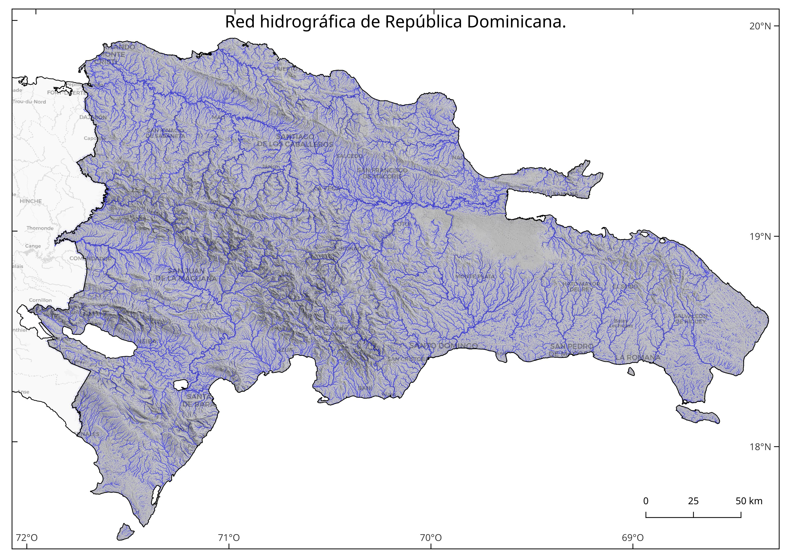
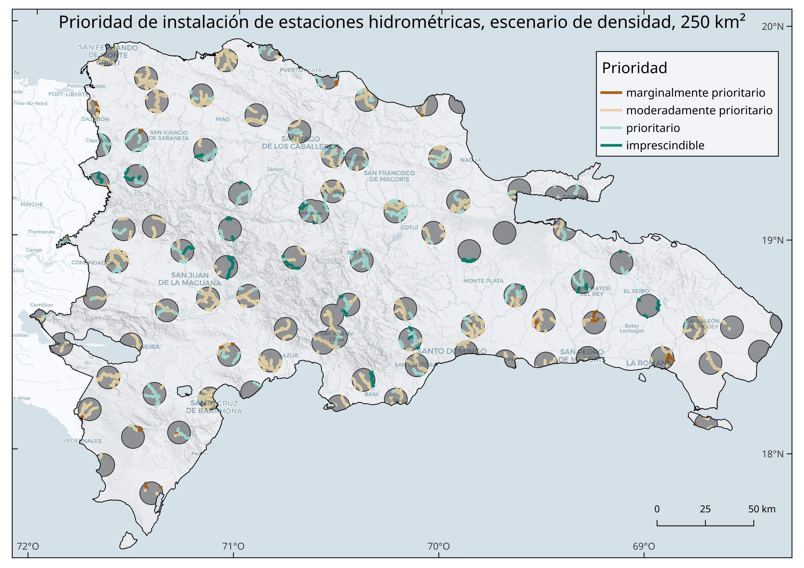

Selección de sitios para el establecimiento de una red de estaciones
hidrométricas usando decisión multicriterio y análisis hidrológico con
modelo digital de elevaciones. Suplemento metodológico
================
José Martínez<br>Michela Izzo

Versión HTML (más legible e interactiva),
[aquí](https://geofis.github.io/datos-meteoclimaticos-escenarios-cc/seleccion-sitios-red-de-estaciones-hidrometricas-suplemento-metodologico.html)

# Introducción

A pesar de la importancia de los datos hidrométricos para diseñar e
implementar políticas efectivas de gestión de recursos hídricos,
actualmente, la red de estaciones hidrométricas en funcionamiento en
República Dominicana es limitada y enfrenta diversos desafíos (Burn
1997; INDRHI 2019; A. K. Mishra y Coulibaly 2010; Ashok K. Mishra y
Coulibaly 2009). La distribución de estas estaciones es poco uniforme y,
las que se encuentran en funcionamiento, están amenazadas por problemas
de mantenimiento y reposición, debido a los bajos presupuestos asignados
para este propósito y a la falta de personal estable (INDRHI 2019).

En el año 2019, solo 30 de un total de 170 estaciones hidrométricas
inventariadas se encontraban en funcionamiento (INDRHI 2019). Se
desconoce el estado actual de la red, pero a la fecha de elaboración de
este informe, el personal técnico del INDRHI indicó que algunas
estaciones podrían haber salido del sistema por problemas de
nombramiento de personal y mantenimiento. Por lo tanto, es esencial
expandir esta red para mejorar la representatividad y la precisión de
los datos hidrométricos, lo que constituye una prioridad crítica.

La selección de sitios adecuados para la instalación de estaciones
hidrométricas es crucial para la obtención de datos precisos y
representativos (Ashok K. Mishra y Coulibaly 2009). Se deben considerar
varios criterios relevantes, como la heterogeneidad climática y
topográfica de la región, ya que estas variables influyen en la
distribución de las precipitaciones y, por extensión, en la escorrentía
dentro de la cuenca (World Meteorological Organization (WMO) y The
International Association of Hydrological Sciences 1976). Además, la
accesibilidad del sitio es fundamental para garantizar que el
mantenimiento y la operación de las estaciones se pueda llevar a cabo de
manera eficiente (Rojas Briceño et al. 2021).

Los criterios arriba mencionados fueron usados por este mismo equipo de
investigación para proponer una red de estaciones meteoclimáticas, por
lo consideramos oportuno aprovecharlos igualmente para diseñar la red de
estaciones hidrométricas. En particular, las estaciones hidrométricas
deben colocarse sobre corrientes fluviales donde midan los caudales de
agua, por lo que es necesario contar con información geográfica precisa
y densa sobre la red hidrográfica dominicana. Varios criterios
adicionales deben cumplir los sitios de medición (Rantz 1982a, 1982b):

1.  El tramo de corriente o curso fluvial (río, arroyo, cañada) elegido
    debe ser recto durante unos 100 metros corriente arriba y abajo del
    sitio de medición.
2.  En todos los niveles, el flujo total está en una única corriente,
    sin flujo subterráneo que evite el sitio de interés.
3.  El lecho del curso fluvial y sus márgenes, no sufren erosión ni
    sedimentación y están libres de plantas acuáticas (sección estable).
4.  Las orillas de la corriente fluvial son permanentes, sin matorrales
    y lo suficientemente altas como para contener inundaciones.
5.  Preferiblemente, el curso tiene controles naturales invariables
    (sección estable): son preferidos los lugares con afloramientos de
    sustrato y con rápidos estables para condiciones de flujo bajo, así
    como los estrechamientos del canal o una cascada o caída que no esté
    sumergida en momentos de flujo alto. Cuando estas condiciones no se
    pueden conseguir en el sitio elegido, entonces es necesaria la
    realización de una obra, como por ejemplo un vertedero. Sin embargo,
    no en todos los ríos es posible realizar esta obra, sobre todo si se
    trata de ríos muy anchos, por lo que se recurre a métodos alternos
    de medición de velocidades y estimación de área de la sección (área
    elemental).
6.  En niveles extremadamente bajos, existe escorrentía o pozas aunque
    sólo sea aguas arriba, lo cual permite la continuidad de medición y
    evita altas velocidades en momentos de restablecimiento del caudal.
7.  El sitio candidato está lo suficientemente alejado de confluencias o
    de los efectos de las mareas para evitar impactos indeseados en la
    medición.
8.  Hay un tramo disponible para medir el caudal en todos los niveles
    cerca del sitio de medición.
9.  El sitio es accesible para instalar, operar y mantener el lugar de
    medición, siendo su elección un compromiso entre estos criterios.

Para obtener algunos de estos criterios, es necesario compilar datos
hidrológicos, geológicos y topográficos a nivel nacional. En principio,
y reduciendo el análisis de selección de sitios a fuentes geoespaciales
disponibles o derivables, se deben identificar tramos de cursos
fluviales que cumplan con las siguientes características (Rantz 1982a,
1982b):

1.  Alineación recta.
2.  Rocas consolidadas expuestas (en contraposición a los sedimentos
    aluviales).
3.  Las márgenes sujetas a desbordamiento.
4.  Márgenes pronunciadas para garantizar el confinamiento del flujo.
5.  Canales divididos.
6.  Posible impacto de fenómenos/estructuras aguas arriba que induzcan
    variabilidad. Estos efectos pueden ser causados por afluentes,
    confluencias o embalses.
7.  Viabilidad de instalar medidores de flujo.

Los criterios anteriores pueden derivarse a partir de una precisa y
densa red hidrográfica del país, además de disponiendo de datos
complementarios que puedan manejarse de forma integrada por medio de un
sistema de información geográfica. Sin embargo, las fuentes de
información geográfica sobre la hidrografía dominicana disponibles al
público, no cuentan con la resolución espacial requerida como para
generar todos los criterios relacionados arriba.

Existen al menos dos fuentes de información geográfica sobre la red
hidrográfica dominicana. La primera es la red digitalizada a partir del
mapa topográfico nacional escala 1:50,000 (“MTN-50k”) (Instituto
Cartográfico Militar (ICM) 1989). La red del MTN-50K, aunque es bastante
exhaustiva, es realmente una red parcial e inconsistente (e.g. uso de
criterios subjetivos para definir cursos fluviales), y no aporta
características morfométricas de las corrientes (e.g. jerarquía), además
de que no es lo suficientemente precisa como para utilizarla, por sí
sola, en análisis hidrológicos. No obstante, dicha red puede servir de
insumo para crear el DEM con fines hidrológicos, como por ejemplo, la
aplicación o tallado de la red.

La segunda fuente sobre la hidrografía dominicana es un conjunto de
documentos técnicos y multitemáticos, tanto de ámbito nacional (INDRHI
2012, 1996; INDRHI y AQUATER 2000; INDRHI y EPTISA 2000; OEA y INDRHI
1994; Secretaría de Estado de Medio Ambiente y Recursos Naturales 2004;
Rodríguez y Febrillet 2006), como de cuencas seleccionadas (CIDIAT y
INDRHI 1992; Halcrow-COR Ing. S.A. 2002; SERCITEC y INDRHI 2002),
realizados mayormente por personal del Instituto Nacional de Recursos
Hidráulicos (INDRHI). Sin embargo, cada estudio fue elaborado con
métodos distintos, por lo que no es viable la consolidación de una
hidrografía consistente de ámbito nacional a partir de estos. Cabe
destacar que se están dando pasos en esa dirección actualmente, tras
haberse iniciado la actualización del Plan Hidrológico Nacional.

El presente estudio tiene, como primer objetivo generar una red densa de
ríos, arroyos y cañadas (en la terminología geomorfológica, *talweg*, o
línea que une puntos de elevaciones mínimas en vaguadas), elaborada a
partir de las fuentes geoespaciales abiertas más precisas de las que se
tenga conocimiento, con miras a seleccionar sitios idóneos para la
instalación de estaciones hidrométricas. Para este cometido, optamos por
generar la red a partir del modelo digital de elevaciones de mayor
resolución espacial disponible al público en la actualidad, usando
métodos semiautomáticos implementados en software de código abierto, y
apoyándonos en fuentes pre-existentes, como el mapa topográfico nacional
y el mapa geológico, entre otros.

Como segundo objetivo nos planteamos seleccionar sitios idóneos para la
instalación de estaciones hidrométricas, considerando únicamente la
escorrentía superficial en *talwegs*, excluyendo mediciones de pozos,
lagos, canales de riego, embalses y otros cuerpos de agua distintos a
ríos, arroyos y cañadas. Para esta labor, y como parte del diseño de la
investigación, aprovechamos las unidades hexagonales ya elegidas
previamente en el estudio complementario a este, donde se propuso
aumentar la densidad de la red estaciones meteoclimáticas (ver informe
titulado “[Selección de sitios para el establecimiento de una red de
estaciones meteoclimáticas en República Dominicana usando decisión
multicriterio y análisis de
vecindad](https://geofis.github.io/datos-meteoclimaticos-escenarios-cc/seleccion-sitios-red-de-estaciones.html)”).

> Notas sobre la unidad elemental *talweg* y la precisión de la red. Un
> *talweg* es una línea imaginaria sobre el terreno que une los puntos
> de más bajos de un valle (Foucault y Raoult 1985). Por lo tanto, no es
> el equivalente a un curso fluvial permanente, pues la circulación de
> agua dependerá de otros factores además de los meramente topgráficos
> (clima, umbral de acumulación elegido, sustrato, entre otros). En
> nuestro mapa, un *talweg* refleja el espacio por donde,
> potencialmente, el sobrante de agua circularía en forma de escorrentía
> superficial en condiciones de suelo saturado. Sin embargo, el trazado
> final que describa la escorrentía, estará condicionado por múltiples
> factores (temporales, de cobertura, de suelo) siendo en gran medida
> dependiente de la precisión del DEM y del relieve en cuestión.
> Particularmente, sobre la precisión de la red, consideramos que es
> alta en sistemas montañososos no kársticos, y media en sistemas
> kársticos. En particular, refiriéndonos a los sistemas kársticos, la
> incertidumbre fue ligeramente mayor en nuestro mapa porque no se
> dispone de un inventario exhaustivo y preciso de depresiones
> (e.g. dolinas), que son, en última instancia, las que condicionan la
> topología y jerarquización de la red en estos relieves. Para llenar
> este vacío, a partir del modelo de elevaciones elegido, creamos
> nuestro propio inventario de depresiones, pero lo usamos con cautela
> para definir la localización de sumideros reales por donde el flujo se
> infiltra al karst. Finalmente, es importante señalar que, en áreas
> urbanas y llanas, así como en campos con canales de riego, nuestra red
> puede tener una baja precisión. No obstante, esto no afecta el alcance
> de nuestro estudio, ya que nuestros objetivos se centran en otras
> áreas.

> Notas sobre cuencas transfronterizas. Las cuencas transfronterizas
> fueron caracterizadas sólo con la información de la porción de
> territorio dominicano, por lo cual el orden de red obtenido para las
> redes correspondientes, no necesariamente refleja el orden de real.
> Estas cuencas incluyen las de los ríos Artibonito, Pedernales y
> Masacre, así como varias cuencas pequeñas distribuidas a ambos lados
> de la línea fronteriza. Sin embargo, una rápida inspección visual
> sugiere que la referida omisión, no afecta el objetivo de nuestro
> estudio.

Los resultados de este estudio ofrecen la oportunidad de mejorar la red
de estaciones hidrométricas, y tienen el potencial de informar medidas
de conservación, planificación y gestión de recursos hídricos a nivel
nacional, en un momento en el que la humanidad y, en particular, la
sociedad dominicana, se preparan para afrontar los efectos del cambio
climático y la consecuente escasez de agua pronosticada.

# Materiales, métodos y resultados

## Paquetes y funciones

Los siguientes bloques de código cargan los paquetes de uso común a lo
largo de este cuaderno, así como funciones creadas por nosotros para
eficientizar las tareas de limpieza y representación de datos y mapas
(e.g. huellas de las escenas del DEM ALOS PALSAR). Igualmente,
aprovechamos esta sección para declarar la ruta del directorio de
trabajo, la cual reaprovechamos en distintas partes del código.

``` r
source('R/funciones.R')
library(raster)
library(sf)
library(kableExtra)
library(tidyverse)
library(gdalUtils)
estilo_kable <- function(df, titulo = '', cubre_anchura = T) {
  df %>% kable(format = 'html', escape = F, booktabs = T, digits = 2, caption = titulo) %>%
  kable_styling(bootstrap_options = c("hover", "condensed"), full_width = cubre_anchura)
}
dem_proc_dir <- 'alos-palsar-dem-rd/dem/'
```

## DEM: obtención y preparación, procesamiento

### Selección de los datos de elevación

Elegimos el Modelo Digital de Elevación del Satélite de Observación
Avanzada de la Tierra (ALOS-DEM, por sus siglas en inglés), pues es
actualmente la fuente de mayor resolución espacial (12.5 m) y disponible
al público (ASF DAAC 2015). A pesar de su alta resolución espacial,
investigadores encontraron que no necesariamente es el DEM de mayor
precisión en cuanto a los estadísticos básicos de elevación (e.g. RMSE
comparado con estaciones GNSS) (Aziz y Rashwan 2022). No obstante, la
evaluación realizada por el referido equipo de investigadores, no
realizó preprocesamiento ni limpieza de los datos descargados. De todas
formas, aunque es probable que existan errores en el DEM, para fines de
extracción de redes de drenaje es la mejor opción disponible, pues a
mejor resolución, mejores resultados en cuanto a densidad de la red y
caracterización morfométrica.

Para procesarlo, debimos descargar más de 28 escenas desde el Centro de
Archivo Activo Distribuido (DAAC) del [Alaska Satellite Facility
(ASF)](https://asf.alaska.edu/) y unirla en un mosaico creado como
ráster virtual. Señalamos que, al momento de realizarse esta
investigación, la tendencia global en el análisis de datos geoespaciales
apunta a prácticas centrada en la nube (e.g. Google Earth Engine,
Microsoft Planetary Computer) Aunque hemos realizado investigaciones
usando dichas plataformas, muchos de los algoritmos necesarios para
realizar análisis hidrológico, no están aún disponibles en los referidos
servicios. Por esta razón, nos vimos en la necesidad de usar nuestros
propios computadores. En concreto, usamos una PC equipada con procesador
Intel(R) Core(TM) i7-7700K CPU @ 4.20GHz, 64 GB de memoria RAM y unidad
de estado sólido. Aunque logramos paralelizar algunos procesos, la
mayoría de los algoritmos no aprovechan al máximo los múltiples núcleos
de los procesadores y, consecuentemente, la capacidad de memoria también
se subutiliza.

### Descarga de escenas

Identificamos las escenas necesarias para cubrir íntegramente la
República Dominicana, usando una búsqueda geográfica mediante polígono
delimitador en Alaska Satellite Facility. Dado que la misión del
ALOS-DEM ofrece escenas de distinta fecha para una misma área,
descargamos escenas redundantes que posteriormente excluimos del
análisis. La descarga la realizamos por lotes, usando un *script* de
Python provisto por el propio ASF.

``` python
python download-all-2023-04-20_00-30-00.py
```

### Creación de índice de DEM

Utilizando el índice de huellas de escenas, escribimos un pequeño
programa para seleccionar las más reciente en las áreas donde había
redundancia. Con esto construimos un índice de DEM para fines de
representación, y para guiarnos durante la construcción del ráster
virtual.

``` r
ind_orig <- invisible(
  st_read('alos-palsar-dem-rd/asf-datapool-results-2023-04-19_08-31-26.geojson', quiet = T)) %>% 
   rownames_to_column('fila') %>% mutate(fila = as.integer(fila))
distancias <- ind_orig %>% st_centroid() %>% st_distance() %>% units::drop_units()
distancias[upper.tri(distancias, diag = T)] <- NA
indices <- which(distancias < 1000, arr.ind = TRUE)
duplicados <- as.data.frame(indices) %>% 
  mutate(dup_id = 1:nrow(indices)) %>% 
  pivot_longer(-dup_id, names_to = 'tipo', values_to = 'fila') %>% 
  select(-tipo)
seleccionados <- duplicados %>%
  inner_join(ind_orig %>% select(fila, startTime) %>% st_drop_geometry) %>% 
  group_by(dup_id) %>% filter(startTime == max(startTime)) %>% pull(fila)
ind_orig_sel <- ind_orig %>% filter(!fila %in% duplicados$fila | fila %in% seleccionados) %>% 
  filter(centerLon < -72.1821)
```

``` r
ind_orig_sel %>% select(sceneName, startTime) %>% st_drop_geometry() %>%
  kable(format = 'html', escape = F, booktabs = T,
        caption = 'Escenas ALOS-PALSAR usadas para generar un DEM de 12.5 m de resolución espacial de República Dominicana') %>%
  kable_styling(bootstrap_options = c("hover", "condensed"), full_width = T)
```

<table class="table table-hover table-condensed" style="margin-left: auto; margin-right: auto;">
<caption>
TABLA 1: Escenas ALOS-PALSAR usadas para generar un DEM de 12.5 m de
resolución espacial de República Dominicana
</caption>
<thead>
<tr>
<th style="text-align:left;">
sceneName
</th>
<th style="text-align:left;">
startTime
</th>
</tr>
</thead>
<tbody>
<tr>
<td style="text-align:left;">
ALPSRP253240380
</td>
<td style="text-align:left;">
2010-10-25 23:18:16
</td>
</tr>
<tr>
<td style="text-align:left;">
ALPSRP253240370
</td>
<td style="text-align:left;">
2010-10-25 23:18:08
</td>
</tr>
<tr>
<td style="text-align:left;">
ALPSRP253240360
</td>
<td style="text-align:left;">
2010-10-25 23:17:59
</td>
</tr>
<tr>
<td style="text-align:left;">
ALPSRP253240350
</td>
<td style="text-align:left;">
2010-10-25 23:17:51
</td>
</tr>
<tr>
<td style="text-align:left;">
ALPSRP252510370
</td>
<td style="text-align:left;">
2010-10-20 23:11:46
</td>
</tr>
<tr>
<td style="text-align:left;">
ALPSRP252510360
</td>
<td style="text-align:left;">
2010-10-20 23:11:38
</td>
</tr>
<tr>
<td style="text-align:left;">
ALPSRP252510350
</td>
<td style="text-align:left;">
2010-10-20 23:11:30
</td>
</tr>
<tr>
<td style="text-align:left;">
ALPSRP251490380
</td>
<td style="text-align:left;">
2010-10-13 23:22:45
</td>
</tr>
<tr>
<td style="text-align:left;">
ALPSRP251490370
</td>
<td style="text-align:left;">
2010-10-13 23:22:36
</td>
</tr>
<tr>
<td style="text-align:left;">
ALPSRP251490360
</td>
<td style="text-align:left;">
2010-10-13 23:22:28
</td>
</tr>
<tr>
<td style="text-align:left;">
ALPSRP251490350
</td>
<td style="text-align:left;">
2010-10-13 23:22:20
</td>
</tr>
<tr>
<td style="text-align:left;">
ALPSRP251490340
</td>
<td style="text-align:left;">
2010-10-13 23:22:12
</td>
</tr>
<tr>
<td style="text-align:left;">
ALPSRP250760380
</td>
<td style="text-align:left;">
2010-10-08 23:16:23
</td>
</tr>
<tr>
<td style="text-align:left;">
ALPSRP250760370
</td>
<td style="text-align:left;">
2010-10-08 23:16:15
</td>
</tr>
<tr>
<td style="text-align:left;">
ALPSRP250760360
</td>
<td style="text-align:left;">
2010-10-08 23:16:06
</td>
</tr>
<tr>
<td style="text-align:left;">
ALPSRP250760350
</td>
<td style="text-align:left;">
2010-10-08 23:15:58
</td>
</tr>
<tr>
<td style="text-align:left;">
ALPSRP250030360
</td>
<td style="text-align:left;">
2010-10-03 23:09:44
</td>
</tr>
<tr>
<td style="text-align:left;">
ALPSRP250030350
</td>
<td style="text-align:left;">
2010-10-03 23:09:36
</td>
</tr>
<tr>
<td style="text-align:left;">
ALPSRP248280370
</td>
<td style="text-align:left;">
2010-09-21 23:14:21
</td>
</tr>
<tr>
<td style="text-align:left;">
ALPSRP248280360
</td>
<td style="text-align:left;">
2010-09-21 23:14:13
</td>
</tr>
<tr>
<td style="text-align:left;">
ALPSRP248280350
</td>
<td style="text-align:left;">
2010-09-21 23:14:05
</td>
</tr>
<tr>
<td style="text-align:left;">
ALPSRP247260360
</td>
<td style="text-align:left;">
2010-09-14 23:25:03
</td>
</tr>
<tr>
<td style="text-align:left;">
ALPSRP247260350
</td>
<td style="text-align:left;">
2010-09-14 23:24:55
</td>
</tr>
<tr>
<td style="text-align:left;">
ALPSRP247260340
</td>
<td style="text-align:left;">
2010-09-14 23:24:47
</td>
</tr>
<tr>
<td style="text-align:left;">
ALPSRP242300380
</td>
<td style="text-align:left;">
2010-08-11 23:21:28
</td>
</tr>
<tr>
<td style="text-align:left;">
ALPSRP242300370
</td>
<td style="text-align:left;">
2010-08-11 23:21:19
</td>
</tr>
<tr>
<td style="text-align:left;">
ALPSRP242300360
</td>
<td style="text-align:left;">
2010-08-11 23:21:11
</td>
</tr>
<tr>
<td style="text-align:left;">
ALPSRP242300350
</td>
<td style="text-align:left;">
2010-08-11 23:21:03
</td>
</tr>
</tbody>
</table>

En total, para cubrir el territorio de República Dominicana, necesitamos
28 de escenas únicas ALOS-PALSAR. Representamos el índice de escena con
`ggplot2`, superponiendo las huellas (polígono de área con datos) sobre
el límite costero e internacional de República Dominicana. Señalamos en
este punto un detalle relevante para el análisis hidrológico. Las
escenas correspondientes a la porción haitiana del río Artibonito, no
las procesamos en este estudio, a efectos de agilizar la producción de
resultados. No obstante, dicha tarea queda pendiente para futuras
investigaciones.


### Extracción de las escenas seleccionadas

Usando el índice de las escenas seleccionadas, extrajimos los
correspondientes DEM en formato GTiff desde los archivos comprimidos
(`.zip`). Alaska Satellite Facility los sirve como comprimidos para
reducir el ancho de banda en la descarga. Esta medida es muy conveniente
para mantener el rendimiento en sus servidores, además de que la
descomprensión de estos archivos no toma realmente mucho tiempo.

``` r
zip_path <- 'alos-palsar-dem-rd/'
sapply(ind_orig_sel$fileName, 
       function(x)
         unzip(
           zipfile = paste0(zip_path, x),
           exdir = paste0(zip_path, 'dem'), junkpaths = T,
           files = paste0(gsub('.zip', '', x), '/', gsub('zip', 'dem.tif', x)))
       )
```

### Verificación de CRS, transformar a zona 19N

Todos los DEM fueron servidos bajo el sistema de coordenadas universal
transversal de Mercator (UTM), pero algunos fueron se encontraban
fijados en el huso 18N, por lo que primero los identificamos y,
posteriormente, los transformamos al huso 19N para generar un producto
continuo usando la herramienta `gdalwarp` de la biblioteca GDAL
(GDAL/OGR contributors 2022).

``` r
dems_orig_path <- list.files(path = 'alos-palsar-dem-rd/dem', pattern = '*dem.tif', full.names = T)
crs_18n <- names(which(sapply(dems_orig_path, function(x){
  crs_x <- gdal_crs(x)
  is_z18 <- grepl('zone 18N', crs_x[['wkt']])
})))
sapply(crs_18n, function(x) file.rename(from = x, to = gsub('.tif', '_z18n.tif', x)))
crs_18n_ren <- list.files(path = 'alos-palsar-dem-rd/dem', pattern = 'z18n.tif', full.names = T)
sapply(crs_18n_ren, function(x){
  gdalwarp(
  srcfile = x,
  dstfile = gsub('_z18n.tif', '.tif', x), 
  t_srs = 'EPSG:32619', overwrite = T)})
```

### Construcción de ráster virtual

A efectos de eficientizar la manipulación del DEM, creamos un ráster
virtual (VRT) usando la herramienta `gdalbuildvrt` de la biblioteca
GDAL. Este formato es conveniente, pues se trata de un XML que combina
todas las fuentes sobre la marcha (*on the fly*) para fines de
visualización. También es posible, luego de generar el ráster virtual,
crear una imagen real en los formatos tradicionales. De hecho, la
importación a GRASS GIS crea un ráster real para importarlo a su base de
datos.

``` r
gdalbuildvrt(gdalfile = dems_orig_path,
             output.vrt = paste0(paste0(zip_path, 'dem'), '/dem_seamless.vrt'),
             resolution = 'highest', r = 'average')
```

### Creación de base de datos de GRASS GIS

Creamos una base de datos y localización de GRASS GIS usando como fuente
de extensión y resolución el ráster virtual (GRASS Development Team
2022). Decidimos usar GRASS GIS a partir de este punto para
prácticamente todas las tareas de análisis geoespacial e hidrológico,
pues se trata de un software bastante eficiente en muchos de sus
complementos y algoritmos de serie (e.g. rellenado de nulos). Sin
embargo, en pasos posteriores, alternamos el flujo de procesamiento con
otras herramientas, como WhiteboxTools (John B. Lindsay 2018). En todo
caso, nuestro criterio fue siempre aprovechar al máximo los recursos de
hardware y software disponibles para obtener los productos requeridos en
el menor tiempo posible.

``` bash
# Usando Bash, desde la ruta ./alos-palsar-dem-rd/dem
grass --text -c dem_seamless.vrt ./grassdata
# Para abrir luego de cerrada: grass grassdata/PERMANENT/
```

### Máscara: crear, importar, aplicar

Creamos una máscara de país en QGIS (QGIS Development Team 2021),
superponiendo el límite oficial obtenido desde la página de la [Oficina
Nacional de Estadística (ONE)](https://www.one.gob.do/), y combinándolo
con otras fuentes disponibles en línea, como [GADM](https://gadm.org/),
[Humanitarian Data Exchange
(OCHA)](https://data.humdata.org/dataset/cod-ab-dom) y
[OpenStreetMap](https://www.openstreetmap.org) (Oficina Nacional de
Estadística (ONE) 2018; GADM 2022; OCHA 2022; OpenStreetMap contributors
2017). De la máscara, eliminamos las superficies de máximas de lagos y
lagunas no artificiales, pues nos interesa procesar las cuencas
endorreicas que drenan hacia ellos. No obstante, los embalses no los
incluimos en dicha superficie, dado que necesitamos construir la
jerarquía de red ignorando su presencia, es decir, asumiendo como
continuos todos los cursos fluviales. Sobre esta máscara, creamos un
área de influencia, para recortar el DEM con un cierto “acolchado” que
nos permitiera análizar sin dificultades las áreas costeras y de
frontera.

La creación de esta máscara fue el único paso que realizamos de forma
semimanual, pues el resto del flujo de procesamiento lo realizamos con
algoritmo automáticos.

Importamos la máscara generada a la base de datos de GRASS y la
aplicamos. GRASS opera de forma eficiente, aplicando los algoritmos sólo
dentro del área definida como máscara. Las áreas fuera de ésta son
excluidas, eficientizando los recursos y evitando malgastar tiempo de
CPU en áreas que ajenas al proyecto.

``` bash
# Importar máscara
v.import input=mascara-1km.gpkg output=mascara_1km

# Fijar máscara
r.mask -r
r.mask vector=mascara_1km

# Ver ambiente
g.gisenv
## GISDBASE=/media/jose/datos/alos-palsar-dem-rd/dem
## LOCATION_NAME=grassdata
## MAPSET=PERMANENT
## GUI=text
## PID=1632142
```

### Creación de mapa ráster a partir de VRT

Importamos el ráster virtual a la base de datos de GRASS GIS. Con este
paso generamos un mapa ráster dentro de la base de datos GRASS GIS, el
cual es una realización con celdas manipulables y a la que le podemos
aplicar algoritmos ráster de nuestra preferencia.

``` bash
# Importar DEM a región de GRASS
time r.import --overwrite input=dem_seamless.vrt output=dem
## real 

# Ver en lista (q para salir)
g.list type=raster
```


### Rellenado de píxeles nulos (sin datos)

Para esta tarea, utilizamos el eficiente complemento de GRASS
`r.fill.nulls`. Lo configuramos para rellenar píxeles nulos usando
interpolación *spline* bilineal con regularización Tykhonov (*spline* es
un método de descomposición de curvas en porciones descritas por
polinomios).

``` bash
# Rellenar vacíos
time r.fillnulls --overwrite --verbose \
  input=dem method="bilinear" \
  tension=40 smooth=0.1 edge=3 npmin=600 segmax=300 lambda=0.01 \
  output=dem_relleno
# Enviar mensaje al finalizar (ejecutar conjuntamente con anterior)
echo "Job finished" | mail -s "Job finished" zoneminderjr@gmail.com
## real 10m11.925s
```


### Suavizado preservando morfologías

Para el suavizado, usamos la herramienta *FeaturePreservingSmoothing* de
WhiteboxTools, la cual reduce reducir la rugosidad generada por ruido en
el modelo digital de elevaciones (John B. Lindsay, Francioni, y Cockburn
2019; John B. Lindsay 2018). Para aplicar esta herramienta, primero
exportamos el DEM desde la base de datos de GRASS GIS a archivo GeoTIFF,
y posteriormente aplicamos el suavizado.

``` bash
# Exportar a GTiff con compresión LZW
time r.out.gdal --overwrite --verbose createopt="COMPRESS=LZW,BIGTIFF=YES" \
  input=dem_relleno \
  format=GTiff type=Float64 output=dem_relleno.tif
# Enviar mensaje al finalizar (ejecutar conjuntamente con anterior)
echo "Job finished" | mail -s "Job finished" zoneminderjr@gmail.com
## real 0m58.924s

# Comenzó a 23.20 de 22 de abril
time ~/WhiteboxTools_linux_amd64/WBT/whitebox_tools \
  --wd='/media/jose/datos/alos-palsar-dem-rd/dem/' \
  --filter=25 --norm_diff=45 --num_iter=5 \
  --run=FeaturePreservingSmoothing --input='dem_relleno.tif' \
  --output='dem_relleno_suavizado.tif' -v
# Enviar mensaje al finalizar (ejecutar conjuntamente con anterior)
echo "Job finished" | mail -s "Job finished" zoneminderjr@gmail.com
## real 9min46.103s
```


### Importar DEM suavizado a la base de datos de GRASS GIS

Importamos el DEM suavizado para aplicarle nuevos procesamientos
hidrológicos.

``` bash
time r.import input=dem_relleno_suavizado.tif output=dem_suavizado
echo "Job finished" | mail -s "Job finished" zoneminderjr@gmail.com
## real 0m21.593s
```

### Obtención de alturas pseudo-ortométricas

Usamos el ráster de altura de geoide de La Española a 1 minuto de
resolución (EGM2008) para obtener alturas pseudo-ortométricas, por medio
de una suma algebraica simple. Sin embargo, previamente fue necesario
aumentar la resolución del ráster de altura del geoide antes de realizar
la suma. Para esto, usamos `r.resamp.rst` (evaluamos una alternativa 2
con el completo `r.resamp.interp` y, aunque realizó el trabajo
eficientemente, eliminó muchas áreas limítrofes, por lo que preferimos
no utilizarlo).

``` bash
# Importar DEM a región de GRASS
r.import --overwrite input=egm2008-1_espanola.tif output=egm2008_1min

# Ver en lista (q para salir)
g.list type=raster

# Ver atributos de la región
g.region -p

# Alternativa 1. Usando r.resamp.rst. Más eficiente y precisa
# Fijar la región al geoide importado
g.region raster=egm2008_1min -ap
# Realizar la interpolación
r.resamp.rst --overwrite input=egm2008_1min ew_res=50 ns_res=50 elevation=egm2008_hires
echo "Job finished" | mail -s "Job finished" zoneminderjr@gmail.com
## real 
# Fijar región a nuevo geoide
g.region raster=egm2008_hires -ap

# Alternativa 2. Usando r.resamp.interp. También eficiente, pero eliminar áreas de borde
# g.region res=50 -ap
# r.resamp.interp --overwrite input=egm2008_1min \
#  output=egm2008_hires method=bilinear

# Exportar para explorar visualmente
# r.out.gdal --overwrite --verbose createopt="COMPRESS=LZW" \
#  input=egm2008_hires \
#  format=GTiff type=Float64 output=egm2008_hires.tif

# Volver a resolución de DEM rellenado y suavizado
g.region raster=dem_suavizado -ap

# Aplicar álgebra de mapas
r.mapcalc --overwrite "dem_pseudo_ortometrico = dem_suavizado - egm2008_hires"

#Estadísticos univariados
r.univar dem_pseudo_ortometrico
# n: 306462417
# minimum: -51.4456
# maximum: 3102.34
# range: 3153.79
# mean: 403.703
# mean of absolute values: 403.858
# standard deviation: 487.27
# variance: 237432
# variation coefficient: 120.7 %
# sum: 123719658638.311
```

El resumen estadístico proporcionado por GRASS GIS, usando una máscara
ajustada a los límites costeros e internacional del país, informa que la
elevación mínima es -51.5 m, mientras que la máxima es 3102.34 m, para
un rango de casi 3154 m. El valor mínimo probablemente no está bien
recogido, debido a que la máscara empleada podría estar eliminando
elevaciones muy bajas en el área de la Hoya de Enriquillo. La elevación
media, tanto considerando los negativos como los positivos, es de
aproximadamente 404 m, con desviación estándar de 487 m y coeficiente de
variación de 121%.


### Tallar (aplicar) la red sobre el DEM

El tallado, grabado o aplicación de red (*stream burning*) consiste en
reforzar, sobre el DEM, la red hidrográfica conocida para garantizar que
los algoritmos automáticos de análisis hidrológico conduzcan el flujo a
través de lechos existentes. Este procedimiento es particularmente útil
(e imprescindible) en áreas llanas, pues produce redes hidrográficas más
reales y, en suma, mejora la topología de la red. No obstante, el
procesamiento modifica sensiblemente el DEM, especialmente en los
lugares donde ocurre el grabado.

Probamos tres alternativas de tallado de DEM usando las herramientas
`FillBurn` de WhiteboxTools (John B. Lindsay 2018), `r.carve` de GRASS
GIS y álgebra de mapas, también de GRASS GIS (GRASS Development Team
2022). Asimismo, con cada algoritmo probamos intentando grabar en el DEM
dos redes de drenaje distintas, una densa y otra compuesta sólo los
cursos largos.

Para generar la red densa, nos apoyamos en el mapa topográfico nacional
a escala 1:50,000 (MTN-50K) (Instituto Cartográfico Militar (ICM) 1989),
el cual se encuentra digitalizado, pero procede de una fuente anónima
(esperamos que este estudio nos ayude a establecer la autoría para
incluirla oportunamente, aunque en los análisis hidrológicos no pudimos
sacarle ningún provecho). En particular, la red densa es una
recopilación exhaustiva de los *talweg* dibujados en el mapa topográfico
(lechos en valles drenados, líneas de mínima elevación, “vaguadas”),
excluyendo canales de riego y otras obras de ingeniería de reconducción
de flujo. Para garantizar la continuidad del flujo, modificamos esta red
recuperando el trazado original de varios ríos embalsados, usando mapas
topográficos de la época pre-embalse. Importamos la red densa a la base
de datos de GRASS GIS. Le aplicamos el complemento `v.clean` de GRASS
GIS para generar una versión topológicamente aceptable, aunque muchos
errores no pudieron corregirse. Finalmente, obtuvimos estadísticos
básicos de conteo de segmentos y longitud para fines de comparación con
la red generada por nosotros.

``` bash
# Importar red hidrográfica digitalizada desde el MTN-50K
v.import --overwrite input=red_mtn50k_cleaned.gpkg output=red_mtn50k_cleaned
# Ver mapa importado en lista (q para salir)
g.list type=vector
# Calcular y pasar a archivo, la longitud de cursos y número de segmentos (ejecutar en casos de actualización)
v.to.db -p option=length map=red_mtn50k_cleaned > stats_length_red_mtn50k_cleaned.txt
```

``` r
stats_red_mtn50k <- read_delim(paste0(dem_proc_dir, 'stats_length_red_mtn50k_cleaned.txt'),
                               progress = F, show_col_types = F)
n_seg_red_mtn50k <- stats_red_mtn50k %>% filter(!cat==-1) %>% nrow
length_mtn50k <- stats_red_mtn50k %>% filter(!cat==-1) %>% pull(length) %>% sum/1000
```

A partir del archivo de texto generado GRASS GIS, obtuvimos los
estadísticos básicos: se trata de una red compuesta por **29750
segmentos** que suman un total de **45698.8 kilómetros** de longitud. Es
importante señalar que la segmentación de las polilíneas no
necesariamente guarda relación con la hidrografía, y probablemente
responda a errores de digitalización. Verificamos muchos casos en los
que un tramo continuo, verificado en el mapa fuente, figuraba segmentado
en pequeños trozos en el vectorial, incluso encontramos lugares donde la
continuidad se interrumpía. Otros problemas topológicos encontrados
fueron los siguientes: confluencias que no siempre se resolvían con
nodos de intersección, líneas duplicadas, cursos fluviales aparecían
enredados, entre otros.


Por otra parte, tal como indicamos arriba, alternativamente probamos con
una red de cursos largos para tallar al DEM, la cual generamos
digitalizando sobre imágenes satelitales (Google; Airbus, CNES; Airbus,
Landsat; Copernicus; Maxar Technologies; U.S. Geological Survey 2023) y,
ocasionalmente, sobre el MTN-50K (Instituto Cartográfico Militar (ICM)
1989). Asimismo, nos auxiliamos en gran medida de OpenStreetMap
contributors (2017), como fuente disponible directamente en formato
vectorial. Esta red consistió en una selección de los ríos más largos y
represados de República Dominicana, e incluyó tramos de ríos que
atraviesan áreas problemáticas para la conducción del flujo, como
grandes llanuras y karst. Al igual que con la red densa, para garantizar
la continuidad topológica, ignoramos los embalses y grabamos trazados
históricos sobre el DEM. Importamos esta red a la base de datos de GRASS
GIS y obtuvimos estadísticos básicos.

``` bash
# Importar red a GRASS
v.import --overwrite input=red_mtn50k_cleaned_largos.gpkg output=red_mtn50k_cleaned_largos
# Ver mapa importado en lista (q para salir)
g.list type=vector
# Calcular y pasar a archivo, la longitud de cursos y número de segmentos (ejecutar en casos de actualización)
v.to.db -p option=length map=red_mtn50k_cleaned_largos > stats_length_red_mtn50k_cleaned_largos.txt
```

``` r
stats_red_mtn50k_largos <- read_delim(paste0(dem_proc_dir, 'stats_length_red_mtn50k_cleaned_largos.txt'),
                               progress = F, show_col_types = F)
n_seg_red_mtn50k_largos <- stats_red_mtn50k_largos %>% filter(!cat==-1) %>% nrow
length_mtn50k_largos <- stats_red_mtn50k_largos %>% filter(!cat==-1) %>% pull(length) %>% sum/1000
```

A partir del archivo de texto generado, obtuvimos los estadísticos
básicos: se trata de una red compuesta por **29750 segmentos** que suman
un total de **45698.8 kilómetros** de longitud. Cabe señalar que esta
red no tiene valor hidrográfico, pues la creamos únicamente para forzar
el flujo a seguir el trazado real, especialmente en zonas llanas.
Desaconsejamos su uso para otros fines que no sean los de complementar
un análisis hidrológico completo.


Con ambas redes ya generadas, el siguiente consistió en probar las
herramientas disponibles, `r.carve` de GRASS GIS, álgebra de mapas
(``` r.mapcalc``de GRASS GIS) y ```FillBurn\` de WBT. Los resultados
obtenidos en cada caso los describimos detalladamente en las secciones a
continuación.

#### Alternativa 1. Tallado con GRASS GIS, complemento `r.carve` (descartada)

La herramienta r.carve de GRASS GIS fue diseñada para grabar el DEM sin
modificarlo sensiblemente, permitiendo configurar la profundidad y la
anchura del grabado. Por defecto, la anchura de lecho es equivalente a
la resolución del DEM. La profundidad puede definirse por el usuario,
para lo cual nosotros establecimos 100 metros. Al intentar tallar la red
densa sobre el DEM con este método, dedicamos un tiempo de cómputo de
más de siete horas (sin paralelización), por lo que nos vimos obligados
a interrumpirlo sin concluir. No obstante, **la red de cursos largos sí
pudimos tallarla sobre el DEM con esta herramienta, generando un
resultado óptimo**, aunque el proceso ocupó más de 1 hora de tiempo de
cómputo. Esta alternativa es recomendada en si resultase imprescindible
conservar las propiedades topográficas en el DEM, pero debe tenerse en
cuenta que su rendimiento es muy bajo. En los casos donde se use un DEM
pequeño, se recomienda usar esta alternativa. Sin embargo, en esta
investigación, con un DEM de más 300 millones de celdas, preferimos
evaluar otras alternativas.

``` bash
# Limpiar red manualmente en QGIS
# Aplicar v.clean, en QGIS

# Tallar la red densa
# time r.carve --overwrite --verbose raster=dem_pseudo_ortometrico \
#  vector=red_mtn50k_cleaned output=dem_tallado depth=100
# echo "r.carve finalizado" | mail -s "r.carve finalizado" zoneminderjr@gmail.com
## real 320m40.373s # NO ALCANZÓ A TERMINAR USANDO RED DOMINICANA DEL MTN50K DENSA (red_mtn50k_cleaned)
# Tallar red de cursos largos
# time r.carve --overwrite --verbose raster=dem_pseudo_ortometrico \
#  vector=red_mtn50k_cleaned_largos output=dem_tallado depth=100
# echo "r.carve finalizado" | mail -s "r.carve finalizado" zoneminderjr@gmail.com
## real 97m3.970s # COMPLETADO: USANDO RED DE CURSOS LARGOS SOLAMENTE (red_mtn50k_cleaned_largos)
```

#### Alternativa 2. Tallado con GRASS GIS, usando álgebra de mapas `r.mapcalc` (elegida)

Tallado eficiente usando álgebra de mapas. Normalizamos el DEM,
generamos una capa booleana ráster con la red de cursos largos, la
restamos al DEM normalizado y luego multiplicamos el ráster resultante
de la resta nuevamente por el rango del DEM (máximo - mínimo) para
restablecer los valores originales fuera de las áreas talladas. El
resultado es un DEM tallado, en el que los píxeles tallados (por donde
circula la red) tenían una profundidad (valor negativo) equivalente al
rango.

``` r
# Implementar esta alternativa con mapcalc de GRASS GIS y evaluar rendimiento
# https://www.youtube.com/watch?v=jHT_StPb_oM

# Limpiar red manualmente en QGIS
# Aplicar v.clean, en QGIS

# Tallar
# Rasterizar red (los píxeles de la red valdrán 1, el resto, nulo)
v.to.rast --overwrite input=red_mtn50k_cleaned_largos type=line use=val output=red_mtn50k_cleaned_largos
# Convertir nulos a cero
r.null map=red_mtn50k_cleaned_largos null=0
# Determinar estadísticas univariantes del DEM
r.univar map=dem_pseudo_ortometrico
# minimum: -51.4456
# maximum: 3102.34

# Aplicar normalización y resta
r.mapcalc --overwrite << EOF
eval(stddem = (dem_pseudo_ortometrico - -51.4456) / (3102.34 - -51.4456), \
     stddemburn = stddem - red_mtn50k_cleaned_largos)
dem_tallado = (stddemburn * (3102.34 - -51.4456)) - 51.4456
# dem_tallado = stddemburn * dem_pseudo_ortometrico # Alternativa
EOF
echo "Tallado finalizado" | mail -s "Mensaje sobre tallado" zoneminderjr@gmail.com
```


#### Alternativa 3. Tallado con WhiteboxTools (descartada)

Como alternativa de procesamiento 3 usamos la herramienta `FillBurn`,
basada en Saunders (2000) e implementada por John B. Lindsay (2016) en
de WBT. Esta realiza dos modificaciones a la vez sobre el DEM; por una
parte, graba la red, usando una profundidad por defecto y, por otro,
rellena las depresiones. La herramienta mostró mejor rendimiento que la
de GRASS GIS en cuanto a tiempo de cómputo, tanto con la red densa, que
sí pudo grabarla sobre el DEM, como con la de cursos largos.

En particular, sobre el grabado de la red densa, notamos que los
trazados no se alineaban bien con el DEM por problemas de alineación y
ajuste de datums entre el mapa topográfico nacional y el DEM (NAD27 y
WGS84). Como consecuencia, la red se grababa en topografías claramente
muy accidentadas o a contrapendiente, generando así una red con
duplicados y falsos positivos. No obstante, intentamos generar una red
con dicho DEM, pero el resultado no fue satisfactorio en términos
hidrológicos, por lo que optamos por probar con la red de cursos largos
para generar el DEM tallado. En este caso, **el DEM resultante fue muy
diferente al original, especialmente en las áreas con depresiones**. Por
esta razón, decidimos usar el DEM tallado con la red de cursos largos
generado por GRASS GIS.

``` bash
# Alternativa 2: rápida, pero produce un tallado muy profundo y rellena depresiones
# Exportar dem_pseudo_ortometrico a GTiff con compresión LZW
# time r.out.gdal --overwrite --verbose createopt="COMPRESS=LZW,BIGTIFF=YES" \
#   input=dem_pseudo_ortometrico \
#   format=GTiff type=Float64 output=dem_pseudo_ortometrico.tif
# echo "Job finished" | mail -s "Job finished" zoneminderjr@gmail.com
## real 1m0.248s

# Exportar red_mtn50k_cleaned.gpkg a shapefile
# ogr2ogr(src_datasource_name = '/media/jose/datos/alos-palsar-dem-rd/dem/red_mtn50k_cleaned.gpkg',
#         dst_datasource_name = '/media/jose/datos/alos-palsar-dem-rd/dem/red_mtn50k_cleaned.shp',
#         verbose=TRUE)

# Tallar con WBT
# time ~/WhiteboxTools_linux_amd64/WBT/whitebox_tools \
#   --wd='/media/jose/datos/alos-palsar-dem-rd/dem/' \
#   --run=FillBurn --dem='dem_pseudo_ortometrico.tif' \
#   --streams=red_mtn50k_cleaned.shp --output='dem_tallado.tif' -v
# echo "Job finished" | mail -s "Job finished" zoneminderjr@gmail.com
## real 9m21.980s
# Importar a GRASS GIS
# time r.import --overwrite input=dem_tallado.tif output=dem_tallado
# echo "Job finished" | mail -s "Job finished" zoneminderjr@gmail.com
## real 0m38.519s
```

### Depresiones

Para producir límites de cuencas y redes de drenaje con sentido, los
algoritmos de análisis hidrológico requieren que se identifiquen las
depresiones capaces de capturar la escorrentía superficial (e.g. ponor,
pérdidas). Usando la capa de litologías de República Dominicana (Mollat
et al. 2004), identificamos y separamos las calizas que presentaban
suficiente grado de karstificación, de acuerdo con nuestra experiencia
de campo. Posteriormente, generamos una capa de depresiones con el
complemento `r.geomorphon` usando el DEM como insumo (Jarosław Jasiewicz
y Stepinski 2013). Adicionalmente, digitalizamos algunas depresiones
cuya localización conocíamos por experiencia de terreno. Finalmente,
intersectamos las tres fuentes para producir una capa comprensiva de las
depresiones que capturan el flujo superficial.


No obstante, nuestro resultado debe tomarse con cautela en el relieve
kárstico. Como bien es sabido, no todas las calizas representadas en la
geología dominicana están lo suficientemente karstificadas como para
desarrollar depresiones. Por esta razón, usamos la capa de calizas a
discreción, y sólo conservamos aquellos afloramientos de calizas donde
no se evidenciaba escorrentía superficial, y donde encontramos evidencia
de depresiones en la topografía detallada y en imágenes satelitales. No
obstante, gran parte de este trabajo se realizó manualmente, por lo que
la exhaustividad no está del todo garantizada. Además, es virtualmente
imposible identificar todas las depresiones que funcionan como pérdidas
en imágenes satelitales o en mapas topográficos. Finalmente, un elemento
adicional complica aún más las cosas en los relieves kársticos: muchas
pérdidas no ocurren a través de una depresión topográficamente visible,
pues gran parte de la infiltración se produce a través de fracturas en
la roca, pasando al endokarst y a la zona vadosa de manera “silenciosa”,
sin que veamos desde el aire la típica morfología deprimida
(e.g. dolina).

``` bash
# Crear geomórfonos
# WBT
# time ~/WhiteboxTools_linux_amd64/WBT/whitebox_tools \
#   -r=Geomorphons -v --wd='/media/jose/datos/alos-palsar-dem-rd/dem/' \
#   --dem=dem_tallado.tif -o=geomorfonos.tif --search=25 \
#   --threshold=0 --tdist=0.0 --forms
# echo "Job finished" | mail -s "Job finished" zoneminderjr@gmail.com
## real 6m52.298s #MUY EFICIENTE
# GRASS GIS
# time r.geomorphon --overwrite --verbose elevation=dem_tallado forms=geomorfonos search=25
time r.geomorphon --overwrite --verbose elevation=dem_pseudo_ortometrico forms=geomorfonos search=25
echo "r.geomorphon finalizado" | mail -s "Mensaje sobre r.geomorphon" zoneminderjr@gmail.com
## real 33m16.508s #MUY LENTO

# Extraer depresiones desde geomorfonos
r.mapcalc --overwrite expression="'depresiones_geomorfonos' = if(geomorfonos == 10, 1, null())"

# Importar depresiones manualmente digitalizadas a base de datos de GRASS GIS
v.import --overwrite input=depresiones_digitalizadas.gpkg output=depresiones_digitalizadas

# Convertir depresiones digitalizadas manualmente a ráster
v.to.rast --overwrite input=depresiones_digitalizadas type=area use=val output=depresiones_digitalizadas

# Importa la capa de calizas con depresiones en RD (de Mapa Geológico 250K)
v.import --overwrite input=calizas_con_depresiones.gpkg output=calizas_con_depresiones

# Convertir la capa de calizas con depresiones a ráster
v.to.rast --overwrite input=calizas_con_depresiones type=area \
  use=val output=calizas_con_depresiones

# Adjuntar depresiones digitalizadas manualmente con caliz
r.mapcalc --overwrite \
  expression="'depresiones_geomorfonos_calizas' = 'depresiones_geomorfonos' * 'calizas_con_depresiones'"

# Unir todas las depresiones en un único mapa
r.patch --overwrite input=depresiones_geomorfonos_calizas,depresiones_digitalizadas \
  output=depresiones_todas
```


## Extracción de red de drenaje y cuencas hidrográficas: análisis hidrológicos y morfométricos, jerarquía de red

### El dilema: `r.watershed` o `r.stream*`

El complemento `r.watershed` es uno de los más completos de GRASS GIS
para realizar análisis hidrológico a nivel de cuenca e incluso para
redes. Con este complemento se pueden obtener los mapas de acumulación
de flujo, talwegs, redes de drenaje y cuencas, entre otros. Estos
productos son usados tanto en el análisis de cuenca, como en el análisis
de red de drenaje (e.g. análisis hortoniano). Sin embargo, otro
complemento de GRASS GIS se especializa en la extracción y
caracterización de redes de drenaje. La elección de uno u otro dependerá
de nuestro objetivo. Si nos interesa analizar cuencas hidrográficas,
entonces, el complemento a usar será r.watershed. Si nos interesa
analizar redes de drenaje y jerarquía hidrográfica, entonces tenemos dos
opciones: `r.watershed` y `r.stream*`, ya sea combinados o de forma
excluyente.

La familia `r.stream*` incluye un generador de red (`r.stream.extract`),
un calculador de jerarquía de red (`r.stream.order`) y un generador de
cuencas hidrográficas consecuente con la red de drenaje
(`r.stream.basins`) (JarosŁaw Jasiewicz y Metz 2011). El complemento
`r.stream.order` es bastante potente, porque nos permite caracterizar la
red hidrográfica de manera muy completa usando la topología para
determinar la jerarquía ordenada. Para correr `r.stream.order`,
necesitamos el mapa de la red propiamente (`stream_rast`), y el de
dirección de drenaje (`direction`). Por otra parte, `r.stream.basins`
utliza como entrada los mapas producidos por `r.stream.order` para
delimitar cuencas de acuerdo con la ordenación jerárquica elegida.

Tanto `r.stream.extract` como `r.waterhsed` son capaces de generar
productos que sirven de insumo a otros complementos, pero con ligeras
diferencias. En un uso combinado de estos complementos, para garantizar
la consistencia del resultado, **la clave está en no combinar un
producto de r.watershed con uno de `r.stream.extract`**. Por ejemplo,
para calcular órdenes de red con `r.stream.order`, no se recomienda
combinar el mapa de la red producido por `r.watershed` con el de
dirección de drenaje de `r.stream.extract`. Ambas entradas deben ser
producidas por un mismo algoritmo.

Por lo tanto, en este punto tenemos dos opciones:

- Opción 1: generar tanto `stream_rast` y `direction` con `r.watershed`.

- Opción 2: generar tanto `stream_rast` y `direction` con
  `r.stream.extract`.

Dado que nuestro interés principal es la jerarquía de red, pues la
utilizamos como criterio de selección de sitios idóneos para estaciones
hidrométricas, podríamos saltar directamente a ejecutar el complemento
`r.stream.extract`, y generar productos que usaremos posteriormente en
`r.stream.order`. Esto nos ahorraría el paso de ejecutar `r.watershed`.
Ahora bien, dado que nos interesa que `r.stream.order` calcule la
jerarquía por el método Horton, entonces necesitaremos el mapa de
acumulación, el cual sólo puede producirlo `r.watershed`. Comencemos
precisamente con ello, generando el mapa de acumulación.

Dado que a partir de este bloque de código, inician los análisis
hidrológicos, antes de ejecutar `r.watershed`, aplicamos una máscara
ajustada a la línea de costa y los límites fronterizos del país. Esta
máscara más ajustada asegura que las redes extraídas no se extiendan
hacia en el mar. Por otra parte, para evitar interrupciones abruptas y
no realistas del flujo, creamos una zona de influencia en el límite
fronterizo para permitir la salida y entrada de flujo a través de éste.

``` bash
# Importar máscara
v.import --overwrite input=mascara-1km-solo-en-frontera.gpkg output=mascara_1km_solo_en_frontera
# Fijar máscara (EJECUTAR SÓLO SI ES ESTRICTAMENTE NECESARIO, PUES TARDA MUCHO)
r.mask -r
r.mask vector=mascara_1km_solo_en_frontera
```

Iniciamos los análisis hidrológicos con la nueva máscara.

``` bash
time r.watershed --overwrite --verbose elevation=dem_tallado \
 depression=depresiones_todas accumulation=rwshed_acum \
 threshold=180 stream=rwshed_talwegs \
 # drainage=rwshed_direccion_drenaje basin=rwshed_cuencas half_basin=rwshed_hemicuenca \
 # tci=rwshed_tci spi=rwshed_spi \
 # length_slope=rwshed_longitud_vertiente slope_steepness=rwshed_empinamiento \
 # retention=rwshed_retencion_flujo max_slope_length=rwshed_max_longitud_vertiente \
 memory=32000
echo "r.watershed finalizado" | mail -s "Mensaje sobre r.watershed" zoneminderjr@gmail.com
## real 9m47.041s
```


### Extracción de red de drenaje y cuencas hidrográficas según orden jerárquico

Con el DEM y la capa de acumulación generada por `r.watershed`,
extrajimos la red hidrográfica, para lo cual, previamente elegimos, por
medio de inspección visual, un umbral óptimo de acumulación. La elección
del umbral óptimo puede variar en función de las características
específicas de cada cuenca, como la pendiente y tamaño de la misma, la
litología, el clima, entre otros atributos. En consecuencia, la práctica
habitual recomienda realizar varias corridas de análisis con diferentes
valores umbral para obtener la mejor configuración de la red
hidrográfica para el área de interés. Los criterios que fijamos para
elegir un umbral óptimo de acumulación fueron los siguientes:

1.  Umbrales consistentes con estudios similares.

2.  Densidad de red suficiente como para producir una red
    representativa.

3.  Evitar la generalización de la red al punto que invisibilice lugares
    idóneos.

4.  Evitar una red extremadamente densa con lugares que no reúnen las
    mínimas características hidrológicas (e.g. cursos con caudal
    permamennte o semipermanente).

Dado que nuestro DEM cuenta con una resolución espacial de 12.5 m,
exploramos diferentes umbrales para determinar la extensión de las
cuencas hidrográficas y la densidad de la red hidrográfica que nos
resultara idónea. Seleccionamos los valores 180, 540 y 900 celdas como
umbrales de acumulación en el complemento `r.stream.extract`, los cuales
equivalen, respectivamente, a 3, 8 y 14 hectáreas en términos de
superficie, respectivamente. Estos umbrales se inscriben en el rango de
valores usados en estudios consultados (Marchesini et al. 2021), donde
evalúan por métodos de “áreas susceptibles a inundación” (Freedman y
Diaconis 1981), el rango de umbrales a elegir.

``` bash
# Extraer redes de drenaje para tres umbrales de acumulación distintos
# En bucle
for i in `echo {180..900..360}`; \
  do echo -e "\nTRABAJANDO EL UMBRAL DE ACUMULACIÓN $i ...\n"; \
  time r.stream.extract --overwrite elevation=dem_tallado accumulation=rwshed_acum \
    depression=depresiones_todas threshold=$i \
    stream_vector=rstream_talwegs_umbral_$i stream_raster=rstream_talwegs_umbral_$i \
    direction=rstream_direccion_umbral_$i memory=32000; \
  echo -e "r.stream.extract umbral $i finalizado" | mail -s "Mensaje sobre r.stream.extract" zoneminderjr@gmail.com; \
done
## real 11m28.455s
## real 11m26.908s
## real 11m30.074s
# Único umbral, para testing
# time r.stream.extract --overwrite elevation=dem_tallado accumulation=rwshed_acum \
#   depression=depresiones_todas threshold=64 \
#   stream_vector=rstream_talwegs_umbral_64 stream_raster=rstream_talwegs_umbral_64 \
#     direction=rstream_direccion_umbral_64 memory=32000
# echo "Job finished" | mail -s "Job finished" zoneminderjr@gmail.com
## real 11m46.930s

# Calcular estadisticos, y pasar a archivo
for i in `echo {180..900..360}`; \
  do v.to.db -p option=length map=rstream_talwegs_umbral_$i > stats_length_rstream_talwegs_umbral_$i.txt;
done
```

``` r
stats_rstream_talwegs <- sapply(as.character(c(180, 540, 900)), function(x) 
  read_delim(paste0(dem_proc_dir, 'stats_length_rstream_talwegs_umbral_', x, '.txt'),
             progress = F, show_col_types = F), simplify = F)
n_rstream_talwegs <- stats_rstream_talwegs %>% 
  map(~ .x %>% filter(!cat==-1) %>% nrow) %>% unlist
length_rstream_talwegs <- stats_rstream_talwegs %>%
  map(~ .x %>% filter(!cat==-1) %>% pull(length) %>% sum/1000) %>% unlist
```

A partir del archivo de texto generado, obtuvimos los estadísticos
básicos: se trata de una red compuesta por **419646, 192453 y 130244
segmentos**, respectivamente para cada umbral de 180, 540 y 900 celdas,
los cuales suman totales de **138444, 98213 y 82081 kilómetros** de
longitud, respectivamente.

Tras realizar una inspección visual de los resultados producidos por el
complemento `r.stream.extract`, elegimos los resultados correspondientes
al umbral de 540 celdas (8 ha), por adaptarse mejor a los fines de
nuestro estudio. Las redes producidas con este umbral resultaron ser
bastante limpias y diversas en el territorio dominicano, mostrando una
hidrografía representativa sin ocultar patrones de variabilidad,
necesarios en la toma de decisiones sobre selección de sitios para
instalar estaciones hidrométricas. Además, como se muestra a
continuación, la red generada con este umbral, alcanzó un orden máximo 8
según los métodos de Strahler y Horton, lo cual nos permitió usar, de
manera preferente,pero no exclusiva, los órdenes de red 5 y 6 como
candidatos idóneos para el establecimeinto de estaciones hidrométricas,
por su mayor probabilidad de ser ríos permanentes o semipermanentes, sin
llegar a tener valles de fondo muy ancho.


#### Generar órdenes de red

``` bash
# Extraer orden de red
# En bucle
for i in `echo {180..900..360}`; \
  do echo -e "\nTRABAJANDO EL UMBRAL DE ACUMULACIÓN $i ...\n"; \
  time r.stream.order --overwrite stream_rast=rstream_talwegs_umbral_$i \
    direction=rstream_direccion_umbral_$i \
    elevation=dem_tallado accumulation=rwshed_acum \
    stream_vect=rstream_orden_de_red_umbral_$i \
    strahler=rstream_orden_strahler_de_red_umbral_$i \
    horton=rstream_orden_horton_de_red_umbral_$i \
    topo=topologia_orden_umbral_$i memory=32000; \
  echo -e "r.stream.order umbral de acumulación $i finalizado" | mail -s "Mensaje sobre r.stream.order" zoneminderjr@gmail.com; \
done
## real 1m34.983s
## real 1m18.662s
## real 1m14.986s
# Único
# time r.stream.order --overwrite stream_rast=rstream_talwegs direction=rstream_direccion \
#     elevation=dem_tallado accumulation=rwshed_acum stream_vect=order_todos \
#     topo=topologia_orden memory=32000
# echo "Job finished" | mail -s "Job finished" zoneminderjr@gmail.com
## real 
```




#### Delimitar cuencas y subcuencas según la jerarquía de red

Usamos el complemento `r.stream.basins` dentro de un bucle `for` para
delimitar las cuencas y subcuencas según su orden de red máximo. Al
utilizar el criterio orden de red, las unidades delimitadas por este
procedimiento incluyen tanto cuencas y subcuencas, por lo que, la
mayoría contiene redes de drenaje tributarias de otro río (ríos que
desembocan en otros ríos).

``` bash
# Delimitar cuencas según jerarquía
# En bucle
for i in `echo {180..900..360}`; \
  do for j in `echo {1..8..1}`; \
    do echo -e "\nTRABAJANDO EL UMBRAL DE ACUMULACIÓN $i, orden $j...\n"; \
    time r.stream.basins -c --overwrite direction=rstream_direccion_umbral_$i \
      stream_rast=rstream_orden_strahler_de_red_umbral_$i cats=$j \
      basins=rstream_cuencas_strahler_umbral_${i}_orden_$j memory=32000; \
  done; \
  echo -e "r.stream.basins umbral de acumulación $i finalizado" | mail -s "Mensaje sobre r.stream.basins" zoneminderjr@gmail.com; \
done
## real ~ 0m40s repetido tantas veces como órdenes para cada umbral de acumulación
```

#### Delimitar cuencas con drenaje final

En esta sección aplicamos el mismo complemento, pero esta vez para
delimitar las cuencas con drenaje final. Es decir, delimitamos las
cuencas completas, cuya red desemboca en el mar (exorreicas), o en
lagos, lagunas y pérdidas del karst (endorreicas), y excluimos las
subcuencas (red que desemboca en otro río) . Es decir, se trata de
cuencas propiamente en la acepción más formal del término, que significa
que no existe (ni se conoce) prolongación del drenaje superficial fuera
de ellas.

``` bash
# Delimitar cuencas terminales
# En bucle
for i in `echo {180..900..360}`; \
  do for j in `echo {1..8..1}`; \
    do echo -e "\nTRABAJANDO EL UMBRAL DE ACUMULACIÓN $i, orden $j...\n"; \
    time r.stream.basins -lc --overwrite direction=rstream_direccion_umbral_$i \
      stream_rast=rstream_orden_strahler_de_red_umbral_$i cats=$j \
      basins=rstream_cuencas_strahler_terminal_umbral_${i}_orden_$j memory=32000; \
  done; \
  echo -e "r.stream.basins umbral de acumulación $i finalizado" | mail -s "Mensaje sobre r.stream.basins" zoneminderjr@gmail.com; \
done
## real ~ 0m40s repetido tantas veces como órdenes para cada umbral de acumulación
```

#### Convertir cuencas a vectorial. Sólo las de umbral 540

En esta sección, convertimos las cuencas creadas en el paso anterior, a
archivos vectoriales para su mejor manejo y representación. Asimismo,
representamos el mapa de las estaciones hidrométricas existentes sobre
las cuencas categorizadas en función del orden de red máximo encontrado
en ellas.

A primera vista, notamos que la cobertura de la red de estaciones es
relativamente baja y que, a priori, existe un déficit importante de
estaciones hidrométricas en la mayoría de las cuencas de orden 5 y
superiores, con una marcada concentración en cuencas con presas.
Reconocemos que el establecimiento de estaciones hidrométricas asociadas
a las presas es una labor de rutina y necesaria, pero el desbalance
entre cuencas instrumentadas y no instrumentadas es significativo, lo
cual, en última instancia, contribuye al sesgo en el dato hidrométrico.
El mapa muestra las estaciones según estado “Bueno” y “Regular”, de
acuerdo con lo reportado en el informe del INDRHI de 2019 (INDRHI 2019),
así como las dos estaciones manejadas por el Servicio Geológico Nacional
(SGN)

``` bash
for i in `echo {1..8..1}`; \
  do r.to.vect --overwrite input=rstream_cuencas_strahler_terminal_umbral_540_orden_$i \
  output=rstream_cuencas_strahler_terminal_umbral_540_orden_$i type=area; \
  v.db.addcolumn rstream_cuencas_strahler_terminal_umbral_540_orden_$i columns="strahler int"; \
  v.db.update rstream_cuencas_strahler_terminal_umbral_540_orden_$i \
  col=strahler value=$i where="strahler IS NULL"; \
done
v.patch -e --overwrite \
  input=`g.list type=v pattern='rstream_cuencas_strahler_terminal_umbral_540_orden_*' separator=comma` \
  output=rstream_cuencas_strahler_terminal_umbral_540_todos

# Calcular estadisticos, y pasar a archivo
## Preparación de fuentes (corrección de topología > actualización de área > eliminar registros)
v.clean --overwrite layer=1 input=rstream_cuencas_strahler_terminal_umbral_540_todos \
  output=rstream_cuencas_strahler_terminal_umbral_540_todos_cleaned tool=rmarea threshold=200
v.to.db --overwrite option=area type=centroid columns=area \
  map=rstream_cuencas_strahler_terminal_umbral_540_todos_cleaned
v.db.droprow rstream_cuencas_strahler_terminal_umbral_540_todos_cleaned output=rstream_cuencas_strahler_terminal_umbral_540_todos_cleaned_2 where="area IS NULL"
g.rename --overwrite \
  vector=rstream_cuencas_strahler_terminal_umbral_540_todos_cleaned_2,\
  rstream_cuencas_strahler_terminal_umbral_540_todos_cleaned

## Ahora sí, la tabla
v.db.select --overwrite rstream_cuencas_strahler_terminal_umbral_540_todos_cleaned where='cat!=-1' > \
  stats_area_rstream_cuencas_strahler_terminal_umbral_540_todos.txt
```

``` r
stats_rstream_cuencas_540 <- read_delim(
  paste0(dem_proc_dir, 'stats_area_rstream_cuencas_strahler_terminal_umbral_540_todos.txt'),
  progress = F, show_col_types = F)
rstream_cuencas_540_por_orden <- stats_rstream_cuencas_540 %>% 
  rename(`Orden de red (Strahler)` = strahler) %>% 
  group_by(`Orden de red (Strahler)`)  %>%
  summarise(`Número de cuencas` = n(),
            `Área promedio` = mean(area),
            `Área total` = sum(area)) 
rstream_cuencas_540_por_orden %>%
  ggplot + aes(x = `Orden de red (Strahler)`, y = `Número de cuencas`) + geom_line() +
  scale_y_continuous(trans='log2') + theme_bw()
```


``` r
rstream_cuencas_540_por_orden %>%
  kable(format = 'html', escape = F, booktabs = T,
        caption = 'Relación entre orden de red de Strahler y número de cuencas de República Dominicana') %>%
  kable_styling(bootstrap_options = c("hover", "condensed"), full_width = T)
```

<table class="table table-hover table-condensed" style="margin-left: auto; margin-right: auto;">
<caption>
TABLA 2: Relación entre orden de red de Strahler y número de cuencas de
República Dominicana
</caption>
<thead>
<tr>
<th style="text-align:right;">
Orden de red (Strahler)
</th>
<th style="text-align:right;">
Número de cuencas
</th>
<th style="text-align:right;">
Área promedio
</th>
<th style="text-align:right;">
Área total
</th>
</tr>
</thead>
<tbody>
<tr>
<td style="text-align:right;">
1
</td>
<td style="text-align:right;">
4070
</td>
<td style="text-align:right;">
263837.3
</td>
<td style="text-align:right;">
1073817672
</td>
</tr>
<tr>
<td style="text-align:right;">
2
</td>
<td style="text-align:right;">
2029
</td>
<td style="text-align:right;">
956249.8
</td>
<td style="text-align:right;">
1940230776
</td>
</tr>
<tr>
<td style="text-align:right;">
3
</td>
<td style="text-align:right;">
606
</td>
<td style="text-align:right;">
3911578.6
</td>
<td style="text-align:right;">
2370416619
</td>
</tr>
<tr>
<td style="text-align:right;">
4
</td>
<td style="text-align:right;">
165
</td>
<td style="text-align:right;">
21414857.6
</td>
<td style="text-align:right;">
3533451511
</td>
</tr>
<tr>
<td style="text-align:right;">
5
</td>
<td style="text-align:right;">
46
</td>
<td style="text-align:right;">
111125189\.5
</td>
<td style="text-align:right;">
5111758717
</td>
</tr>
<tr>
<td style="text-align:right;">
6
</td>
<td style="text-align:right;">
19
</td>
<td style="text-align:right;">
517463997\.1
</td>
<td style="text-align:right;">
9831815945
</td>
</tr>
<tr>
<td style="text-align:right;">
7
</td>
<td style="text-align:right;">
2
</td>
<td style="text-align:right;">
3979801647.7
</td>
<td style="text-align:right;">
7959603295
</td>
</tr>
<tr>
<td style="text-align:right;">
8
</td>
<td style="text-align:right;">
4
</td>
<td style="text-align:right;">
3708474023.0
</td>
<td style="text-align:right;">
14833896092
</td>
</tr>
</tbody>
</table>

Los estadísticos básicos de cuenca sugieren, en primer lugar, que la
familia de complementos `r.stream*` está produciendo resultados
consistentes, pues se observa claramente el típico decrecimiento
exponencial del número de cuencas en relación con el orden de red. En
segundo lugar, destaca un hecho particular que hemos observado en otra
cuencas del país: el número de cuencas de orden 7 es menor número de
cuencas muy reducido (incluyendo la cuenca del Yaque del Norte) con
relación al posterior.


## Propuesta de sitios idóneos para estaciones hidrométricas

Las redes de drenaje y las cuencas hidrográficas generadas en los pasos
anteriores, fueron la base de información primordial y objetivo
principal de esta investigación. A partir de la red generada, definimos
el área de interés u objetivo, que son los cauces. El segundo objetivo
de nuestra investigación fue seleccionar sitios prioritarios para
establecer estaciones hidrométricas. Explicamos en esta sección cómo
desarrollamos ese segundo objetivo.

### El codiseño: sinergia con la propuesta de red de estaciones meteoclimáticas

Con la red disponible, y generando algunas variables adicionales, nos
encontrábamos en capacidad de aplicar algoritmos de reclasificación de
variables y álgebra de mapas para producir una lista de sitios que
cumplierann con criterios preestablecidos. Sin embargo, esta
aproximación podría considerarse un tanto ingenua y hasta ineficiente,
pues ignoraría los resultados que obtuvimos en el estudio complementario
a éste titulado “[Selección de sitios para el establecimiento de una red
de estaciones meteoclimáticas en República Dominicana usando decisión
multicriterio y análisis de
vecindad](https://geofis.github.io/datos-meteoclimaticos-escenarios-cc/seleccion-sitios-red-de-estaciones.html)”.
Por esta razón, optamos por un esquema de codiseño flexible, de tal
suerte que la propuesta de estaciones hidrométricas aprovechase la red
de estaciones meteoclimáticas. Resumimos a continuación las múltiples
ventajas de esta decisión.

En primer lugar, la estrategia de codiseño redujo significativamente el
tiempo de cómputo de variables territoriales. En segundo lugar, al
proponer la colocación de ambos tipos de estaciones a un mismo contexto,
estamos impulsando la co-observación del dato climático e hidrométrico.
En tercer lugar, las áreas priorizadas, cumplen con una serie de
criterios que son comunes a la selección de sitios idóneos para
estaciones hidrométricas, como son la estacionalidad pluviomética y la
distancia a accesos. En cuarto lugar, al reaprovechar la localización de
estaciones meteoclimáticas, sacamos partido a los escenarios de densidad
de estaciones (e.g. una estación para X km<sup>2</sup>) y nos apegamos a
los estándares propuestos por la OMM. Los escenarios de densidad son una
oportuna herramienta de planificación, pues bien usados, evitan la
redundancia en la red, ofrecen varias alternativas de presupuesto de
inversión, y facilitan el despliegue de medios de forma escalonada.

A pesar de las múltiples ventajas señaladas, existen algunas desventajas
que consideramos oportuno mencionar. En primer lugar, una corriente
fluvial no necesariamente tiene su mejor lugar de medición en torno a un
sitio preestablecido. Por esta razón, consideramos que, en la fase de
implementación, la sensatez y la flexibilidad deben primar. No olvidemos
que las bases de datos geoespaciales y los algoritmos sólo nos dan una
idea preliminar; para tomar la decisión final se necesitará, sobre todo,
de conocimiento de terreno y un sólido compromiso presupuestario. Otra
desventaja del codiseño es el riesgo de subestimar los costos de
operación y mantenimiento de las estaciones hidrométricas, pues estas
son más complejas y sufren más incidencias que las meteoclimáticas.

### Áreas de prospección: definición, materialización

Para materializar el codiseño de las redes, nos apoyamos en lo que
denominamos como **áreas de prospección para el establecimiento de
estaciones hidrométricas** o AP. Definimos el AP como un polígono
imaginario que rodea a una estación meteoclimática existente o
propuesta—sin exceder su área de representación—, creado con el objetivo
de evaluar, de manera flexible, la idoneidad de instalar una estación
hidrométrica. La identificación del sitio idóneo se realiza aplicando
criterios de idoneidad, los cuales a su vez se obtienen reclasificando
información territorial y aplicando álgebra de mapas.

Para materializar las AP sólo necesitamos la red de estaciones
meteoclimáticas existentes y propuestas, y definir un área de influencia
(e.g. *buffer*) en torno a ella. En el estudio complementario ya
referido, propusimos tres escenarios de densidades distintos: un
escenario donde cada estación tenía un área de representación de 100
km<sup>2</sup> (219 estaciones, entre existentes y propuestas), otro de
150 km<sup>2</sup> (138 estaciones) y otro de 250 km<sup>2</sup> (85
estaciones).

En el referido estudio, las áreas de representación de las estaciones
meteoclimáticas las materializamos por medio de los criterios de
densidad. Por ejemplo, en el escenario de densidad “100 km<sup>2</sup>
por estación”, el área de representación de una estación era
precisamente dicho valor, 100 km<sup>2</sup>. Pero en el estudio que nos
ocupa, lo que necesitamos son áreas de prospección para situar
estaciones hidrométricas, con la condición de que queden inscritas
íntegamente dentro de las áreas de representación de la red
meteoclimática.

Resolvemos esta condición de manera más eficiente si generalizamos el
problema. Una estación meteoclimática $M_i$ cubre un área de
representación $b_i$, con radio $p_i=\sqrt{b_i/\pi}$. Queremos localizar
un sitio idóneo para establecer, en su entorno, una estación
hidrométrica, $H_i$, explorando el AP, la cual denotamos como $c_i$ con
radio $q_i$. Para garantizar que $c_i$ quede inscrita dentro de $b_i$,
siendo a su vez lo más grande posible, tenemos que observar dos
restricciones: 1) Localización: los centroides de los polígonos de ambas
áreas, coinciden; 2) Tamaño: $c_i$ debe ser menor que $b_i$, es decir
$c_i<b_i$.

Una solución programática para este problema consiste en crear $c_i$ por
medio de *buffer* circulares en torno a $M_i$, donde los radios guardan
una desigualdad tal que $q_i<p_i$, para lo cual haremos que $p_i$ se
multiplique por una fracción propia y obtener así el valor de $q_i$.
Luego de evaluar las opciones $q_i=p_i/2$ y $q_i=2p_i/3$, preferimos
esta última para generar $c_i$, porque nos ofreció una zona de búsqueda
mayor, sin que la circunferencia resultante se acercara a la del área de
representación de $M_i$. Por lo tanto, la distancia que usamos para
generar las áreas buffer es
$q_i=\frac{2}{3}p_i=\frac{2}{3}\sqrt{b_i/\pi}$, que para los casos
específicos de las densidades 100, 150 y 250, equivalen a 3.76, 4.61 y
5.95 kilómetros, respectivamente.

Para generarlas, importamos a la base de datos de GRASS GIS la capa de
puntos que contiene la propuesta de sitios de estaciones meteoclimáticas
de cada escenario de densidad (100, 150 y 250 km<sup>2</sup>),
considerando sólo la red donde se eliminó redundancia por proximidad con
estaciones meteoclimáticas de INDRHI y ONAMET existentes que se
encontraban en estado “bueno”. Posteriormente, importamos propiamente la
red de estaciones meteoclimáticas de INDRHI y ONAMET existentes,
conservando sólo aquellas en estado bueno. Finalmente, combinamos, en un
único vectorial, las estaciones y los sitios propuestos. Usando el mapa
combinado y las distancias ya calculadas, generamos las áreas *buffer*
que representan las AP (ver figura siguiente).

``` bash
# Propuestas de estaciones
vareaskm2=(100 150 250)
for areakm2 in "${vareaskm2[@]}"; do v.import --overwrite \
  input=escenario_${areakm2}_km2_por_estacion_exclusion_redundancia_activas_buenas.gpkg \
  output=escenario_${areakm2}_km2;
done
# Estaciones climáticas del INDRHI
v.import --overwrite input=con_indicacion_estatus_climaticas_indrhi.gpkg \
  output=tmp; \
  v.extract --overwrite input=tmp where='Estado=="Bueno"' output=estaciones_indrhi
  g.remove -f type=vector name=tmp
# Estaciones climáticas de ONAMET
v.import --overwrite input=con_indicacion_estatus_onamet.gpkg \
  output=tmp; \
  v.extract --overwrite input=tmp where='estado=="activa"' output=estaciones_onamet
  g.remove -f type=vector name=tmp
#Combinar estaciones y sitios propuestos en un único vectorial
for areakm2 in "${vareaskm2[@]}"; do v.patch --overwrite \
  input=escenario_${areakm2}_km2,estaciones_indrhi,estaciones_onamet \
  output=puntos_para_areas_prospeccion_${areakm2}_km2;
done
# Crear buffer de tamaño variable, con categorías únicas ("cat" secuencial)
for areakm2 in "${vareaskm2[@]}"; do v.buffer --overwrite \
  input=puntos_para_areas_prospeccion_${areakm2}_km2 distance=`echo "scale=2;(2*sqrt($areakm2/3.14159))*1000/3" | bc` \
  output=areas_prospeccion_${areakm2}_km2;
  v.category --overwrite input=areas_prospeccion_${areakm2}_km2 output=tmp option=del cat=-1;
  v.category --overwrite input=tmp  output=areas_prospeccion_${areakm2}_km2 option=add step=1;
  v.db.addtable areas_prospeccion_${areakm2}_km2 columns="cat int";
done
```


Los pasos siguientes consistieron en generar, dentro de las AP, los
diferentes criterios que aplicamos a la selección de sitios para el
establecimiento de estaciones hidrométricas. Para ello, ejecutamos
varios complementos de GRASS GIS fijando como máscara las AP. Este paso
fue crucial, pues conseguimos mejorar el tiempo de cómputo en la
generación de las variables de entrada para seleccionar sitios
prioritarios.

## Generación de criterios

Elegimos los siguientes criterios de priorización de sitios para el
establecimiento de estaciones hidrométricas, los cuales calculamos
exclusivamente dentro de las áreas prospección:

- Orden de red: 4 para órdenes 4 a 8; excluidos órdenes ≤ 3.
- Criterios de Rantz (Rantz 1982a, 1982b)seleccionados:
  - Fondo de valle: 4 para fondos de valle pequeños; 1 para fondos de
    valle grandes.
  - Sinuosidad del tramo (#1 de lista de Rantz): 4 para rectilíneo
    (sinuosidad baja); 1 para curvo (sinuosidad alta)
  - Tipo de sustrato rocoso, rocas consistentes (#5): 4 para magmáticas
    nada o poco alteradas; 3 para metamórficas (no mármoles); 2 para
    sedimentarias (no calizas); 1 para calizas.
  - Distancia máxima a confluencias y efectos mareales (#7): 4 para
    distante; 1 para próximo
  - Accesible (#9): 4 para próximo; 1 para distante. Ya valorado para
    las estaciones meteoclimáticas.
- Instrumentación en la subcuenca específica: se aplica al finalizar,
  realizando un análisis de vecindad por subcuenca, para determinar si
  el sitio propuesto se encuentra próximo a otro existente.

### Fondos de valle

Usando el complemento `r.valley.bottom` (Gallant y Dowling 2003),
obtuvimos el “índice múltiresolución de planitud de fondos de valle”
(MrVBF), con el cual estimamos la superficie ocupada por este importante
elemento morfológico del sistema fluvial. Este criterio nos sirvió para
discriminar entre talwegs con fondo de valle anchos, (menos
prioritarios, por su mayor inversión requerida), y talwegs con fondos de
valle estrechos (prioritarios).

> Nota sobre la eficiencia del complemento `r.valley.bottom`. En un
> primer intento, en el que ejecutamos el algoritmo para todo el país,
> intentamos obtener tanto MrVBF y MrRTF (los fondos de valle y las
> crestas) sin éxito. En ese primer intento, la ejecución tardó más de 4
> horas, y el ráster resultante sólo contenía valores sin datos, lo cual
> atribuimos a la inclusión del MrRTF. Posteriormente lo logramos
> excluyendo MrRTF.

``` bash
# Fijar máscara
r.mask -r
mascara_1km_solo_en_frontera

# Ejecutar r.valley.bottom. Tardó un tiempo considerable
time r.valley.bottom --verbose --overwrite elevation=dem_pseudo_ortometrico \
  mrvbf=rvb_fondo_de_valle_pais
# real 91m20.473s

# Probamos también cambiando el parámetro min_cells, lo cual reducía el número de pasos.
# Conseguimos tiempos de ejecución menores (todo el país, tiempo de cómputo: ~1 hora),
# pero entendemos que la precisión de la corrida anterior fue más precisa
# Algunas pruebas:
# Estas alternativa, usando el total de celdas en min_cells,
# fue rápida (menos pasos), pero no superó a la anterior en precisión
time r.valley.bottom --verbose --overwrite elevation=dem_pseudo_ortometrico \
  mrvbf=rvb_fondo_de_valle_pais \
  min_cells=911808546
# real 61m18.997s

# Probamos generar MrVBF sólo dentro 
# de las AP, aplicando una máscara con bucle for. El tiempo de 
# cómputo no se redujo, al contrario, aumentó a más de 3 horas.
vareaskm2=(100 150 250)
for areakm2 in "${vareaskm2[@]}"; do \
  r.mask -r; \
  r.mask vector=areas_prospeccion_${areakm2}_km2; \
  time r.valley.bottom --verbose --overwrite elevation=dem_pseudo_ortometrico \
  mrvbf=rvb_fondo_de_valle_${areakm2}_km2 \
  min_cells=911808546; \
  echo -e "Fondo de valle finalizado" | mail -s "Mensaje sobre r.valley.bottom"; \
  echo -e "Fondo de valle para $i km2 finalizado" | mail -s "Mensaje sobre r.valley.bottom" zoneminderjr@gmail.com; \
done
# real 66m33.824s
# real 66m25.192s
# real 66m37.745s
```

Con la imagen de fondos de valle, obtuvimos una imagen de anchura de
cauce. El procedimiento abreviado consistió en determinar, localmente
para cada tramo de corriente, el valor del índice MrVBF, convertirlo a
puntuacionez z, obtener el área de fondo de valle y dividirla por la
longitud del tramo.

Primero, extrajimos los cursos de orden 4 o superior:

``` bash
# Extraer orden 4. En GRASS
v.extract input=rstream_orden_de_red_umbral_540 \
  output=rstream_orden_de_red_umbral_540_orden_4_y_superior where="strahler >= 4"
```

``` python
# Crear área buffer sólo con los cursos fluviales de orden 4 (o 3) en adelante.
# Nos interesan los cursos intersectados con las áreas de prospección. Igualmente,
# nos interesan de orden 4+, porque son los únicos que priorizamos, y de esta manera
# eficientizamos el tiempo de cómputo. Usar preferentemente GDAL/OGR para esta tarea.
# En nuestro caso, lo hicimos en la GUI de QGIS o a través de la API Python de QGIS
# En QGIS
# 1. Cargamos las áreas de prospección y las unimos en un único archivo
processing.run("native:mergevectorlayers", {'LAYERS':['grassdata/PERMANENT/areas_prospeccion_100_km2/1_polygon','grassdata/PERMANENT/areas_prospeccion_150_km2/1_polygon','grassdata/PERMANENT/areas_prospeccion_250_km2/1_polygon'],'CRS':None,'OUTPUT':'areas_prospeccion_todas.gpkg'})

# 2. Seleccionamos los cursos que tocan áreas de prospección ("Selección por localización")
# Creado archivo "rstream_orden_de_red_umbral_540_orden_4_y_superior_tocan_ap.gpkg"

# 3. Creamos áreas buffer:
processing.run("native:buffer", {'INPUT':'rstream_orden_de_red_umbral_540_orden_4_y_superior_tocan_ap.gpkg','DISTANCE':100,'SEGMENTS':5,'END_CAP_STYLE':1,'JOIN_STYLE':2,'MITER_LIMIT':2,'DISSOLVE':False,'OUTPUT':'buffers.gpkg'})
```

Pasamos a GRASS GIS, donde ejecutamos el script central.

``` bash
# 4. Llevar las áreas de prospección, cursos que tocan áreas de prospección y buffer a GRASS
# Necesitaremos sobre todo los buffers, pero las otras las importamos también
# para conservarlas en un único lugar
v.in.ogr --overwrite input=areas_prospeccion_todas.gpkg output=areas_prospeccion_todas
v.in.ogr --overwrite input=buffers.gpkg output=buffers
v.in.ogr --overwrite input=rstream_orden_de_red_umbral_540_orden_4_y_superior_tocan_ap.gpkg \
  output=rstream_orden_de_red_umbral_540_orden_4_y_superior_tocan_ap

# 5. Crear una lista de IDs únicos del campo "cat"
ids=$(v.db.select -c map=buffers column=cat)

# 6. Quitar máscara
r.mask -r

# 7. Recorrer los IDs únicos de la lista
for id in $ids; do

  # 8. Extraer el polígono correspondiente al ID y usarlo como máscara
  v.extract --overwrite -d input=buffers cats=$id output=poligono
  g.region vector=poligono
  r.mask vector=poligono

  # 9. Calcular los valores Z del raster
  r.mapcalc --overwrite \
    "z = (rvb_fondo_de_valle_pais - `r.univar map=rvb_fondo_de_valle_pais | \
          grep 'mean:' | awk -F ': ' '{print $2}'`) / \
         (`r.univar map=rvb_fondo_de_valle_pais | grep 'standard' | awk -F ': ' '{print $2}'`)"

  # 10. Calcular el área de los valores Z mayores o iguales a 1
  r.mapcalc --overwrite "mayor1 = if(z > 1, 1, null())"
  area=$(r.report -n map=mayor1 units=meters | grep '1|.*\.|' | awk -F'|' '{print $4}' | sed 's/,//g')

  # 11. Agregar una nueva columna al vectorial y actualizar el valor del área calculada
  v.db.addcolumn map=buffers columns="area_z double precision"
  v.db.update map=buffers column=area_z value=$area where="cat = $id"

  # 12. Limpiar la máscara de región
  r.mask -r
done

# Importar vectorial a GRASS (trabajado en QGIS), rasterizar anchuras
v.in.ogr input=rstream_orden_de_red_umbral_540_orden_4_y_superior_tocan_ap_con_anchura_cauce.gpkg \
  output=rstream_orden_de_red_umbral_540_orden_4_y_superior_tocan_ap_con_anchura_cauce
v.to.rast type=line input=rstream_orden_de_red_umbral_540_orden_4_y_superior_tocan_ap_con_anchura_cauce \
  output=rstream_orden_de_red_umbral_540_orden_4_y_superior_tocan_ap_con_anchura_cauce \
  use=attr attribute_column=de_buffers_con_areas_anchura_cauce
# Reclasificar
r.mapcalc "rstream_orden_de_red_umbral_540_orden_4_y_superior_tocan_ap_con_anchura_cauce_rcl = if(rstream_orden_de_red_umbral_540_orden_4_y_superior_tocan_ap_con_anchura_cauce < 20, 4, if(rstream_orden_de_red_umbral_540_orden_4_y_superior_tocan_ap_con_anchura_cauce >= 20 && rstream_orden_de_red_umbral_540_orden_4_y_superior_tocan_ap_con_anchura_cauce < 35, 3, if(rstream_orden_de_red_umbral_540_orden_4_y_superior_tocan_ap_con_anchura_cauce >= 35 && rstream_orden_de_red_umbral_540_orden_4_y_superior_tocan_ap_con_anchura_cauce < 50, 2, if(rstream_orden_de_red_umbral_540_orden_4_y_superior_tocan_ap_con_anchura_cauce >= 50, 1, null()))))"
```

Nuestro cálculo de anchura de cauce probablemente sobrestima en algunos
puntos del territorio y en otros subestima. Un chequeo cruzado rápido y
no sistemático sugiere que el RMSE ronda los 5 m, pero necesitamos más
comprobaciones, sobre todo de campo, para tener obtener una cifra más
precisa. Para comprender mejor el problema, es necesario describir cómo
funciona el script (basado en bucle `for` y funciones de GRASS GIS) que
creamos para la estimación de anchura de cauce.

El script genera áreas *buffer* de 100 m en torno a las corrientes. Para
cada área *buffer*, el *script* extrae los valores del ráster de fondo
de valle de dicha área buffer específica, los convierte a puntuaciones
$z$ por medio de la fómrmula $(x_i-\mu)/\sigma$y, posteriormente,
reclasifica $z\ge1$ a valor 1 (el resto se conserva como nulo). Nosotros
comprobamos que $z\ge1$, en un contexto local (no usando la media ni la
desviación estándar globales), suele ser un umbral muy preciso para
separar los píxeles de fondos de valle del resto, y no el umbral global
de 0.5 sugerido por Gallant y Dowling (2003). Acto seguido, el script
obtiene el área ocupada por las puntuaciones $z\ge1$. Finalmente, dicha
área es transcrita al vectorial de cursos fluviales. Para obtener la
anchura promedio, dividimos el área de fondo de valle (o sea, el área
donde $z\ge1$) entre la longitud del tramo. Es en este punto es donde
entendemos que se podría introducir algún error, aunque no estamos
seguros del todo de si nuestra aproximación actual es más precisa. Al
usarse el tramo completo, sin considerar la presencia o no de áreas con
$z\ge1$, la división se realiza con un valor de longitud que representa
tramos donde probablemente el fondo de valle no pudo ser bien
“observado” por el sensor del satélite.

¿Cómo resolverlo? Si usásemos vectoriales, podríamos interceptar el área
con puntuaciones $z\ge1$ con la línea del *talweg*; de esta manera,
estaríamos dividiendo el área donde el DEM y el algoritmo
`r.valley.bottom` indicaron con precisión que el fondo de valle existe,
entre una longitud acotada precisamente a dicha área. Sería cuestión de
realizar pruebas, y no sabemos si el rendimiento se comprometa
sensiblemente. No obstante, entendemos que el resultado, aún con esta
mejora pendiente, es bastante satisfactorio y podemos usarlo con
confianza para definir el criterio “anchura de cauce”.

Un detalle que merece mención es el hecho de que los valores de anchura
obtenidos son correlativos de la fecha del DEM, año 2010. Es altamente
probable que muchos sectores hayan cambiado en cuanto a su fondo de
valle, pero esto sólo parece haber afectado a las áreas con embalses.

### Litología

Recodificamos las litologías según escala de prioridad. Recodificamos
las rocas karstificadas, así como las poco consistentes, a
“marginalmente prioritario”, mientras que las menos porosas y con mayor
probabilidad de acoger cauces con escorrentía permanente, las
recodificamos como “imprescindible”.


``` bash
#v.in.ogr --overwrite input=litologia-recodificado.gpkg output=litologia_recodificado
v.in.ogr --overwrite input=litologia-recodificado-v2.gpkg output=litologia_recodificado
v.to.rast --overwrite type=area input=litologia_recodificado output=litologia_recodificado use=attr attribute_column=codigo_idoneidad_estacion_hidrometrica
```

### Sinusoidad

``` bash
# De vectorial a ráster
v.to.rast type=line input=rstream_orden_de_red_umbral_540_orden_4_y_superior_tocan_ap \
  output=rstream_orden_de_red_umbral_540_orden_4_y_superior_tocan_ap_sinusoidad \
  use=attr attribute_column=sinosoid
# Reclasificado
r.mapcalc --overwrite "rstream_orden_de_red_umbral_540_orden_4_y_superior_tocan_ap_sinusoidad_rcl = if(rstream_orden_de_red_umbral_540_orden_4_y_superior_tocan_ap_sinusoidad >= 0.44 && rstream_orden_de_red_umbral_540_orden_4_y_superior_tocan_ap_sinusoidad < 0.88, 4, if(rstream_orden_de_red_umbral_540_orden_4_y_superior_tocan_ap_sinusoidad >= 0.88 && rstream_orden_de_red_umbral_540_orden_4_y_superior_tocan_ap_sinusoidad < 1.20, 3, if(rstream_orden_de_red_umbral_540_orden_4_y_superior_tocan_ap_sinusoidad >= 1.20 && rstream_orden_de_red_umbral_540_orden_4_y_superior_tocan_ap_sinusoidad < 1.60, 2, if(rstream_orden_de_red_umbral_540_orden_4_y_superior_tocan_ap_sinusoidad >= 1.60 && rstream_orden_de_red_umbral_540_orden_4_y_superior_tocan_ap_sinusoidad <= 4.20, 1, null()))))"
```

### Distancia máxima a confluencias

``` bash
v.to.rast type=point input=rstream_orden_de_red_umbral_540_orden_4_y_superior \
  output=rstream_orden_de_red_umbral_540_orden_4_y_superior_confluencias use=val value=1
r.grow.distance input=rstream_orden_de_red_umbral_540_orden_4_y_superior_confluencias \
  distance=rstream_orden_de_red_umbral_540_orden_4_y_superior_confluencias_distancias
v.rast.stats map=rstream_orden_de_red_umbral_540_orden_4_y_superior type=line \
  raster=rstream_orden_de_red_umbral_540_orden_4_y_superior_confluencias_distancias \
  column_prefix=distancia_conf method=maximum
v.to.rast type=line input=rstream_orden_de_red_umbral_540_orden_4_y_superior \
  output=rstream_orden_de_red_umbral_540_orden_4_y_superior_distancia_max_a_confluencia \
  use=attr attribute_column=distancia_conf_maximum
r.mapcalc "rstream_orden_de_red_umbral_540_orden_4_y_superior_distancia_max_a_confluencia_rcl = if(rstream_orden_de_red_umbral_540_orden_4_y_superior_distancia_max_a_confluencia < 100, 1, if(rstream_orden_de_red_umbral_540_orden_4_y_superior_distancia_max_a_confluencia >= 100 && rstream_orden_de_red_umbral_540_orden_4_y_superior_distancia_max_a_confluencia < 200, 2, if(rstream_orden_de_red_umbral_540_orden_4_y_superior_distancia_max_a_confluencia >= 200 && rstream_orden_de_red_umbral_540_orden_4_y_superior_distancia_max_a_confluencia < 400, 3, if(rstream_orden_de_red_umbral_540_orden_4_y_superior_distancia_max_a_confluencia >= 400, 4, null()))))"
```

### Álgebra de mapas

``` bash
# Aplicar
r.mapcalc --overwrite \
  "prioridad = (0.55 * litologia_recodificado + \
                0.15 * rstream_orden_de_red_umbral_540_orden_4_y_superior_tocan_ap_sinusoidad_rcl +  \
                0.15 * rstream_orden_de_red_umbral_540_orden_4_y_superior_distancia_max_a_confluencia_rcl + \
                0.15 * rstream_orden_de_red_umbral_540_orden_4_y_superior_tocan_ap_con_anchura_cauce_rcl)"
# Reescalar
#r.mapcalc --overwrite "prioridad_reescalada = int(round(((prioridad - 1.25) / (3.75 - 1.25)) * (4 - 1) + 1))"
r.mapcalc --overwrite "prioridad_reescalada = int(round(((prioridad - 0.6) / (3.85 - 0.6)) * (4 - 1) + 1))"
# Pasar a vectorial
r.to.vect --overwrite input=prioridad_reescalada \
  output=prioridad_reescalada type=line
```



### Sobre la categorización en escalas de prioridad aplicadas a las estaciones hidrométricas

La categorización usada en este estudio responde a una escala de
prioridades que, si bien es útil para los tomadores de decisiones, a los
planificadores del territorio y a quienes manejamos información
territorial nos resulta bastante compleja. Estamos convencidos de que el
puente entre lo que lo que conocemos sobre el terreno y lo que se define
como prioritario, no lo vamos a construir con un estudio; no hay tinta
suficiente, ni un data center lo suficientemente grande, como para poder
explicar cómo se decide la inversión en los sitios.

Lo que sí podemos hacer en este contexto es explicar qué entendemos por
“imprescindible” y qué entendemos por “marginalmente prioritario”, a la
vista de los resultados obtenidos y de la complejidad que conlleva
elegir sitios idóneos para establecer estaciones hidrométricas en todo
un país.

En general, el tipo de roca, la sinuosidad de un tramo o la anchura de
un valle, son criterios que podrían desfavorecer a un hipotético lugar
de valle fluviale muy ancho, con cauce de trazado sinuoso discurriendo
sobre margas poco consistentes, calizas intercaladas muy karstificadas y
aluvial. Si en ese lugar hipotético hubiese escorrentía (y casos
tenemos), pues también merece ser instrumentado.

El tema aquí es de costos, y las prioridades también se ven afectadas
por este. Desde la planificación, lo que más nos interesa determinar es
si se necesitará una obra grande costosa o una obra pequeña.
Desafortunadamente, esto no lo puede resolver el mapa geológico, porque
en pleno basalto, podría ser necesaria una gran obra, tan grande como en
un afloramiento de margas. Esto así porque la intervención se podrá
acometer o no tan pronto se realice un estudio de prefactibilidad.

Nuestra misión es proponer sitios a escala nacional. Para ello, usamos
la fuente más detallada disponible a la fecha. Pero aun así, para no
arriesgarnos, decidimos que los lugares etiquetados como “altamente
prioritarios” son aquellos que tienen cauce estrecho (según nuestras
estimaciones a priori), que se encuentran en litología “bondadosa”
(e.g. basalto), y que tienen un largo tramo de cauce rectilíneo alejado
de desembocaduras y confluencias. En estos lugares, se realizaría la
inversión más pequeña, porque requerirán obras más pequeñas (aunque el
costo final dependerá también de su accesibilidad). Definir estos
ámbitos como prioritarios, facilita también el despliegue de iniciativas
de inversión de manera escalonada.

Por otra parte, en los lugares que fueron catalogados con la etiqueta
“prioritario”, y quizá en algún caso los catalogados como “moderadamente
prioritarios”, proponemos una intervención gradual y a largo plazo, dado
que requieren mayor inversión. No obstante, los sitios catalogado como
“moderadamente prioritarios” podrían er lugares poco convenientes, por
lo que dicha categoría debe tomarse con cautela.

Al margen de lo anterior, y tal como sugieren varias publicaciones sobre
el diseño de redes de medición hidrométrica, lo deseable es definir
objetivos concretos en cuanto al agua, y añadirlos como una capa de
criterios más sobre los meramente físico. Continuemos con los análisis.

### Analicemos los resultados en R

Primero exportamos a archivos los mapas generados en GRASS GIS sobre
áreas prospección según escenarios de densidad y la priorización
reescalada. Luego importamos estas fuentes a R. Es posible leer los
mapas de GRASS GIS directamente desde R con el paquete `rgrass`, pero
con el objetivo de mantenerlo lo más simple posible, exportamos primero
desde GRASS GIS a GeoPackage y luego importamos a R. Esto facilita
además la generación de archivos de uso generalizado. Como se puede
comprobar, el mapa de prioridades rescaladas se representa en nuestra
habitual escala 1 a 4, marginalmente prioritario, moderadamente
prioritario, prioritario y imprescindible.

``` bash
vareaskm2=(100 150 250)
for areakm2 in "${vareaskm2[@]}"; do \
  v.out.ogr input=areas_prospeccion_${areakm2}_km2 output=areas_prospeccion_${areakm2}_km2.gpkg;
done
v.out.ogr input=prioridad_reescalada output=prioridad_reescalada.gpkg
```

``` r
escenario <- as.character(c(100,150,250))
ap <- sapply(escenario, function(x)
  obj_sf <- st_read(paste0(dem_proc_dir, 'areas_prospeccion_', x, '_km2.gpkg'), quiet=T),
  simplify = F)
prioridad <- st_read(paste0(dem_proc_dir, 'prioridad_reescalada.gpkg'), quiet=T)
```

Exploramos cuántos sitios por tipo de prioridad fueron encontrados para
cada escenario de densidad.

``` r
intersecciones <- sapply(ap, st_intersection, prioridad, simplify = F)
centroides_tramos <- intersecciones %>%
  map(~ .x %>%
        mutate(prioridad = factor(value, levels = 1:4, labels = fuente)) %>% 
        rename(`Área de prospección` = cat, `ID de tramo ("cat")` = cat.1) %>% 
        st_centroid %>%
        group_by(`Área de prospección`, `ID de tramo ("cat")`, value, prioridad) %>% 
        summarize(geometry = st_union(geom)))
resultados_df <- centroides_tramos %>% map(~ .x %>%
                          group_by(`Área de prospección`, prioridad) %>%
                          st_drop_geometry %>%
                          count %>% 
                          pivot_wider(names_from = prioridad, values_from = n, values_fill = 0) %>% 
                          mutate(`Total prioritario + imprescindible` = prioritario + imprescindible,
                                 `Total moderadamente prioritario + prioritario + imprescindible` = `moderadamente prioritario` + prioritario + imprescindible)
                   )
resultados_por_area <- map(escenario,
                           ~ ap[[.x]] %>%
                             rename(`Área de prospección` = cat) %>%
                             inner_join(resultados_df[[.x]])) %>% setNames(escenario)
```

``` r
map(escenario, function(x) resultados_por_area[[x]] %>%
      st_drop_geometry() %>% 
      kable(format = 'html', escape = F, booktabs = T,
      caption = paste0('Número de tramos identificados por cada área de prospección ',
                       'según nivel de prioridad. Escenario de densidad: ', x, ' kilómetros cuadrados')) %>%
      kable_styling(bootstrap_options = c("hover", "condensed"), full_width = T))
```

\[\[1\]\]
<table class="table table-hover table-condensed" style="margin-left: auto; margin-right: auto;">
<caption>
TABLA 3: Número de tramos identificados por cada área de prospección
según nivel de prioridad. Escenario de densidad: 100 kilómetros
cuadrados
</caption>
<thead>
<tr>
<th style="text-align:right;">
Área de prospección
</th>
<th style="text-align:right;">
moderadamente prioritario
</th>
<th style="text-align:right;">
marginalmente prioritario
</th>
<th style="text-align:right;">
prioritario
</th>
<th style="text-align:right;">
imprescindible
</th>
<th style="text-align:right;">
Total prioritario + imprescindible
</th>
<th style="text-align:right;">
Total moderadamente prioritario + prioritario + imprescindible
</th>
</tr>
</thead>
<tbody>
<tr>
<td style="text-align:right;">
1
</td>
<td style="text-align:right;">
1
</td>
<td style="text-align:right;">
0
</td>
<td style="text-align:right;">
0
</td>
<td style="text-align:right;">
0
</td>
<td style="text-align:right;">
0
</td>
<td style="text-align:right;">
1
</td>
</tr>
<tr>
<td style="text-align:right;">
3
</td>
<td style="text-align:right;">
1
</td>
<td style="text-align:right;">
0
</td>
<td style="text-align:right;">
0
</td>
<td style="text-align:right;">
0
</td>
<td style="text-align:right;">
0
</td>
<td style="text-align:right;">
1
</td>
</tr>
<tr>
<td style="text-align:right;">
4
</td>
<td style="text-align:right;">
4
</td>
<td style="text-align:right;">
0
</td>
<td style="text-align:right;">
0
</td>
<td style="text-align:right;">
0
</td>
<td style="text-align:right;">
0
</td>
<td style="text-align:right;">
4
</td>
</tr>
<tr>
<td style="text-align:right;">
5
</td>
<td style="text-align:right;">
7
</td>
<td style="text-align:right;">
0
</td>
<td style="text-align:right;">
0
</td>
<td style="text-align:right;">
0
</td>
<td style="text-align:right;">
0
</td>
<td style="text-align:right;">
7
</td>
</tr>
<tr>
<td style="text-align:right;">
6
</td>
<td style="text-align:right;">
6
</td>
<td style="text-align:right;">
1
</td>
<td style="text-align:right;">
1
</td>
<td style="text-align:right;">
0
</td>
<td style="text-align:right;">
1
</td>
<td style="text-align:right;">
7
</td>
</tr>
<tr>
<td style="text-align:right;">
8
</td>
<td style="text-align:right;">
4
</td>
<td style="text-align:right;">
1
</td>
<td style="text-align:right;">
1
</td>
<td style="text-align:right;">
0
</td>
<td style="text-align:right;">
1
</td>
<td style="text-align:right;">
5
</td>
</tr>
<tr>
<td style="text-align:right;">
9
</td>
<td style="text-align:right;">
0
</td>
<td style="text-align:right;">
0
</td>
<td style="text-align:right;">
11
</td>
<td style="text-align:right;">
0
</td>
<td style="text-align:right;">
11
</td>
<td style="text-align:right;">
11
</td>
</tr>
<tr>
<td style="text-align:right;">
10
</td>
<td style="text-align:right;">
6
</td>
<td style="text-align:right;">
0
</td>
<td style="text-align:right;">
5
</td>
<td style="text-align:right;">
1
</td>
<td style="text-align:right;">
6
</td>
<td style="text-align:right;">
12
</td>
</tr>
<tr>
<td style="text-align:right;">
11
</td>
<td style="text-align:right;">
1
</td>
<td style="text-align:right;">
0
</td>
<td style="text-align:right;">
0
</td>
<td style="text-align:right;">
0
</td>
<td style="text-align:right;">
0
</td>
<td style="text-align:right;">
1
</td>
</tr>
<tr>
<td style="text-align:right;">
12
</td>
<td style="text-align:right;">
1
</td>
<td style="text-align:right;">
0
</td>
<td style="text-align:right;">
0
</td>
<td style="text-align:right;">
0
</td>
<td style="text-align:right;">
0
</td>
<td style="text-align:right;">
1
</td>
</tr>
<tr>
<td style="text-align:right;">
13
</td>
<td style="text-align:right;">
1
</td>
<td style="text-align:right;">
0
</td>
<td style="text-align:right;">
0
</td>
<td style="text-align:right;">
2
</td>
<td style="text-align:right;">
2
</td>
<td style="text-align:right;">
3
</td>
</tr>
<tr>
<td style="text-align:right;">
14
</td>
<td style="text-align:right;">
7
</td>
<td style="text-align:right;">
0
</td>
<td style="text-align:right;">
0
</td>
<td style="text-align:right;">
0
</td>
<td style="text-align:right;">
0
</td>
<td style="text-align:right;">
7
</td>
</tr>
<tr>
<td style="text-align:right;">
16
</td>
<td style="text-align:right;">
0
</td>
<td style="text-align:right;">
2
</td>
<td style="text-align:right;">
0
</td>
<td style="text-align:right;">
0
</td>
<td style="text-align:right;">
0
</td>
<td style="text-align:right;">
0
</td>
</tr>
<tr>
<td style="text-align:right;">
17
</td>
<td style="text-align:right;">
1
</td>
<td style="text-align:right;">
0
</td>
<td style="text-align:right;">
0
</td>
<td style="text-align:right;">
0
</td>
<td style="text-align:right;">
0
</td>
<td style="text-align:right;">
1
</td>
</tr>
<tr>
<td style="text-align:right;">
18
</td>
<td style="text-align:right;">
4
</td>
<td style="text-align:right;">
0
</td>
<td style="text-align:right;">
0
</td>
<td style="text-align:right;">
0
</td>
<td style="text-align:right;">
0
</td>
<td style="text-align:right;">
4
</td>
</tr>
<tr>
<td style="text-align:right;">
19
</td>
<td style="text-align:right;">
0
</td>
<td style="text-align:right;">
0
</td>
<td style="text-align:right;">
1
</td>
<td style="text-align:right;">
0
</td>
<td style="text-align:right;">
1
</td>
<td style="text-align:right;">
1
</td>
</tr>
<tr>
<td style="text-align:right;">
20
</td>
<td style="text-align:right;">
29
</td>
<td style="text-align:right;">
0
</td>
<td style="text-align:right;">
0
</td>
<td style="text-align:right;">
0
</td>
<td style="text-align:right;">
0
</td>
<td style="text-align:right;">
29
</td>
</tr>
<tr>
<td style="text-align:right;">
21
</td>
<td style="text-align:right;">
1
</td>
<td style="text-align:right;">
0
</td>
<td style="text-align:right;">
0
</td>
<td style="text-align:right;">
0
</td>
<td style="text-align:right;">
0
</td>
<td style="text-align:right;">
1
</td>
</tr>
<tr>
<td style="text-align:right;">
22
</td>
<td style="text-align:right;">
2
</td>
<td style="text-align:right;">
0
</td>
<td style="text-align:right;">
17
</td>
<td style="text-align:right;">
0
</td>
<td style="text-align:right;">
17
</td>
<td style="text-align:right;">
19
</td>
</tr>
<tr>
<td style="text-align:right;">
23
</td>
<td style="text-align:right;">
8
</td>
<td style="text-align:right;">
0
</td>
<td style="text-align:right;">
1
</td>
<td style="text-align:right;">
0
</td>
<td style="text-align:right;">
1
</td>
<td style="text-align:right;">
9
</td>
</tr>
<tr>
<td style="text-align:right;">
24
</td>
<td style="text-align:right;">
2
</td>
<td style="text-align:right;">
0
</td>
<td style="text-align:right;">
0
</td>
<td style="text-align:right;">
0
</td>
<td style="text-align:right;">
0
</td>
<td style="text-align:right;">
2
</td>
</tr>
<tr>
<td style="text-align:right;">
25
</td>
<td style="text-align:right;">
2
</td>
<td style="text-align:right;">
0
</td>
<td style="text-align:right;">
0
</td>
<td style="text-align:right;">
0
</td>
<td style="text-align:right;">
0
</td>
<td style="text-align:right;">
2
</td>
</tr>
<tr>
<td style="text-align:right;">
27
</td>
<td style="text-align:right;">
16
</td>
<td style="text-align:right;">
0
</td>
<td style="text-align:right;">
9
</td>
<td style="text-align:right;">
0
</td>
<td style="text-align:right;">
9
</td>
<td style="text-align:right;">
25
</td>
</tr>
<tr>
<td style="text-align:right;">
29
</td>
<td style="text-align:right;">
6
</td>
<td style="text-align:right;">
0
</td>
<td style="text-align:right;">
0
</td>
<td style="text-align:right;">
0
</td>
<td style="text-align:right;">
0
</td>
<td style="text-align:right;">
6
</td>
</tr>
<tr>
<td style="text-align:right;">
31
</td>
<td style="text-align:right;">
2
</td>
<td style="text-align:right;">
0
</td>
<td style="text-align:right;">
0
</td>
<td style="text-align:right;">
0
</td>
<td style="text-align:right;">
0
</td>
<td style="text-align:right;">
2
</td>
</tr>
<tr>
<td style="text-align:right;">
32
</td>
<td style="text-align:right;">
10
</td>
<td style="text-align:right;">
0
</td>
<td style="text-align:right;">
1
</td>
<td style="text-align:right;">
0
</td>
<td style="text-align:right;">
1
</td>
<td style="text-align:right;">
11
</td>
</tr>
<tr>
<td style="text-align:right;">
33
</td>
<td style="text-align:right;">
5
</td>
<td style="text-align:right;">
2
</td>
<td style="text-align:right;">
0
</td>
<td style="text-align:right;">
0
</td>
<td style="text-align:right;">
0
</td>
<td style="text-align:right;">
5
</td>
</tr>
<tr>
<td style="text-align:right;">
34
</td>
<td style="text-align:right;">
3
</td>
<td style="text-align:right;">
0
</td>
<td style="text-align:right;">
6
</td>
<td style="text-align:right;">
0
</td>
<td style="text-align:right;">
6
</td>
<td style="text-align:right;">
9
</td>
</tr>
<tr>
<td style="text-align:right;">
35
</td>
<td style="text-align:right;">
1
</td>
<td style="text-align:right;">
0
</td>
<td style="text-align:right;">
2
</td>
<td style="text-align:right;">
2
</td>
<td style="text-align:right;">
4
</td>
<td style="text-align:right;">
5
</td>
</tr>
<tr>
<td style="text-align:right;">
36
</td>
<td style="text-align:right;">
0
</td>
<td style="text-align:right;">
1
</td>
<td style="text-align:right;">
3
</td>
<td style="text-align:right;">
0
</td>
<td style="text-align:right;">
3
</td>
<td style="text-align:right;">
3
</td>
</tr>
<tr>
<td style="text-align:right;">
37
</td>
<td style="text-align:right;">
8
</td>
<td style="text-align:right;">
0
</td>
<td style="text-align:right;">
0
</td>
<td style="text-align:right;">
0
</td>
<td style="text-align:right;">
0
</td>
<td style="text-align:right;">
8
</td>
</tr>
<tr>
<td style="text-align:right;">
39
</td>
<td style="text-align:right;">
0
</td>
<td style="text-align:right;">
1
</td>
<td style="text-align:right;">
0
</td>
<td style="text-align:right;">
0
</td>
<td style="text-align:right;">
0
</td>
<td style="text-align:right;">
0
</td>
</tr>
<tr>
<td style="text-align:right;">
40
</td>
<td style="text-align:right;">
2
</td>
<td style="text-align:right;">
0
</td>
<td style="text-align:right;">
2
</td>
<td style="text-align:right;">
1
</td>
<td style="text-align:right;">
3
</td>
<td style="text-align:right;">
5
</td>
</tr>
<tr>
<td style="text-align:right;">
41
</td>
<td style="text-align:right;">
0
</td>
<td style="text-align:right;">
0
</td>
<td style="text-align:right;">
5
</td>
<td style="text-align:right;">
1
</td>
<td style="text-align:right;">
6
</td>
<td style="text-align:right;">
6
</td>
</tr>
<tr>
<td style="text-align:right;">
43
</td>
<td style="text-align:right;">
3
</td>
<td style="text-align:right;">
0
</td>
<td style="text-align:right;">
5
</td>
<td style="text-align:right;">
0
</td>
<td style="text-align:right;">
5
</td>
<td style="text-align:right;">
8
</td>
</tr>
<tr>
<td style="text-align:right;">
44
</td>
<td style="text-align:right;">
2
</td>
<td style="text-align:right;">
1
</td>
<td style="text-align:right;">
0
</td>
<td style="text-align:right;">
0
</td>
<td style="text-align:right;">
0
</td>
<td style="text-align:right;">
2
</td>
</tr>
<tr>
<td style="text-align:right;">
45
</td>
<td style="text-align:right;">
7
</td>
<td style="text-align:right;">
0
</td>
<td style="text-align:right;">
0
</td>
<td style="text-align:right;">
0
</td>
<td style="text-align:right;">
0
</td>
<td style="text-align:right;">
7
</td>
</tr>
<tr>
<td style="text-align:right;">
47
</td>
<td style="text-align:right;">
0
</td>
<td style="text-align:right;">
0
</td>
<td style="text-align:right;">
2
</td>
<td style="text-align:right;">
2
</td>
<td style="text-align:right;">
4
</td>
<td style="text-align:right;">
4
</td>
</tr>
<tr>
<td style="text-align:right;">
49
</td>
<td style="text-align:right;">
1
</td>
<td style="text-align:right;">
0
</td>
<td style="text-align:right;">
1
</td>
<td style="text-align:right;">
0
</td>
<td style="text-align:right;">
1
</td>
<td style="text-align:right;">
2
</td>
</tr>
<tr>
<td style="text-align:right;">
51
</td>
<td style="text-align:right;">
16
</td>
<td style="text-align:right;">
0
</td>
<td style="text-align:right;">
0
</td>
<td style="text-align:right;">
0
</td>
<td style="text-align:right;">
0
</td>
<td style="text-align:right;">
16
</td>
</tr>
<tr>
<td style="text-align:right;">
52
</td>
<td style="text-align:right;">
8
</td>
<td style="text-align:right;">
0
</td>
<td style="text-align:right;">
13
</td>
<td style="text-align:right;">
0
</td>
<td style="text-align:right;">
13
</td>
<td style="text-align:right;">
21
</td>
</tr>
<tr>
<td style="text-align:right;">
53
</td>
<td style="text-align:right;">
6
</td>
<td style="text-align:right;">
0
</td>
<td style="text-align:right;">
3
</td>
<td style="text-align:right;">
0
</td>
<td style="text-align:right;">
3
</td>
<td style="text-align:right;">
9
</td>
</tr>
<tr>
<td style="text-align:right;">
54
</td>
<td style="text-align:right;">
1
</td>
<td style="text-align:right;">
0
</td>
<td style="text-align:right;">
0
</td>
<td style="text-align:right;">
0
</td>
<td style="text-align:right;">
0
</td>
<td style="text-align:right;">
1
</td>
</tr>
<tr>
<td style="text-align:right;">
55
</td>
<td style="text-align:right;">
23
</td>
<td style="text-align:right;">
1
</td>
<td style="text-align:right;">
8
</td>
<td style="text-align:right;">
0
</td>
<td style="text-align:right;">
8
</td>
<td style="text-align:right;">
31
</td>
</tr>
<tr>
<td style="text-align:right;">
56
</td>
<td style="text-align:right;">
14
</td>
<td style="text-align:right;">
0
</td>
<td style="text-align:right;">
0
</td>
<td style="text-align:right;">
0
</td>
<td style="text-align:right;">
0
</td>
<td style="text-align:right;">
14
</td>
</tr>
<tr>
<td style="text-align:right;">
58
</td>
<td style="text-align:right;">
0
</td>
<td style="text-align:right;">
0
</td>
<td style="text-align:right;">
0
</td>
<td style="text-align:right;">
1
</td>
<td style="text-align:right;">
1
</td>
<td style="text-align:right;">
1
</td>
</tr>
<tr>
<td style="text-align:right;">
59
</td>
<td style="text-align:right;">
5
</td>
<td style="text-align:right;">
0
</td>
<td style="text-align:right;">
0
</td>
<td style="text-align:right;">
0
</td>
<td style="text-align:right;">
0
</td>
<td style="text-align:right;">
5
</td>
</tr>
<tr>
<td style="text-align:right;">
60
</td>
<td style="text-align:right;">
0
</td>
<td style="text-align:right;">
0
</td>
<td style="text-align:right;">
11
</td>
<td style="text-align:right;">
0
</td>
<td style="text-align:right;">
11
</td>
<td style="text-align:right;">
11
</td>
</tr>
<tr>
<td style="text-align:right;">
61
</td>
<td style="text-align:right;">
1
</td>
<td style="text-align:right;">
0
</td>
<td style="text-align:right;">
0
</td>
<td style="text-align:right;">
0
</td>
<td style="text-align:right;">
0
</td>
<td style="text-align:right;">
1
</td>
</tr>
<tr>
<td style="text-align:right;">
62
</td>
<td style="text-align:right;">
2
</td>
<td style="text-align:right;">
0
</td>
<td style="text-align:right;">
8
</td>
<td style="text-align:right;">
0
</td>
<td style="text-align:right;">
8
</td>
<td style="text-align:right;">
10
</td>
</tr>
<tr>
<td style="text-align:right;">
64
</td>
<td style="text-align:right;">
12
</td>
<td style="text-align:right;">
0
</td>
<td style="text-align:right;">
10
</td>
<td style="text-align:right;">
0
</td>
<td style="text-align:right;">
10
</td>
<td style="text-align:right;">
22
</td>
</tr>
<tr>
<td style="text-align:right;">
65
</td>
<td style="text-align:right;">
2
</td>
<td style="text-align:right;">
3
</td>
<td style="text-align:right;">
0
</td>
<td style="text-align:right;">
0
</td>
<td style="text-align:right;">
0
</td>
<td style="text-align:right;">
2
</td>
</tr>
<tr>
<td style="text-align:right;">
66
</td>
<td style="text-align:right;">
8
</td>
<td style="text-align:right;">
0
</td>
<td style="text-align:right;">
3
</td>
<td style="text-align:right;">
0
</td>
<td style="text-align:right;">
3
</td>
<td style="text-align:right;">
11
</td>
</tr>
<tr>
<td style="text-align:right;">
67
</td>
<td style="text-align:right;">
0
</td>
<td style="text-align:right;">
0
</td>
<td style="text-align:right;">
1
</td>
<td style="text-align:right;">
0
</td>
<td style="text-align:right;">
1
</td>
<td style="text-align:right;">
1
</td>
</tr>
<tr>
<td style="text-align:right;">
68
</td>
<td style="text-align:right;">
2
</td>
<td style="text-align:right;">
0
</td>
<td style="text-align:right;">
0
</td>
<td style="text-align:right;">
0
</td>
<td style="text-align:right;">
0
</td>
<td style="text-align:right;">
2
</td>
</tr>
<tr>
<td style="text-align:right;">
69
</td>
<td style="text-align:right;">
3
</td>
<td style="text-align:right;">
0
</td>
<td style="text-align:right;">
0
</td>
<td style="text-align:right;">
0
</td>
<td style="text-align:right;">
0
</td>
<td style="text-align:right;">
3
</td>
</tr>
<tr>
<td style="text-align:right;">
70
</td>
<td style="text-align:right;">
4
</td>
<td style="text-align:right;">
2
</td>
<td style="text-align:right;">
0
</td>
<td style="text-align:right;">
0
</td>
<td style="text-align:right;">
0
</td>
<td style="text-align:right;">
4
</td>
</tr>
<tr>
<td style="text-align:right;">
71
</td>
<td style="text-align:right;">
0
</td>
<td style="text-align:right;">
0
</td>
<td style="text-align:right;">
3
</td>
<td style="text-align:right;">
0
</td>
<td style="text-align:right;">
3
</td>
<td style="text-align:right;">
3
</td>
</tr>
<tr>
<td style="text-align:right;">
72
</td>
<td style="text-align:right;">
32
</td>
<td style="text-align:right;">
0
</td>
<td style="text-align:right;">
0
</td>
<td style="text-align:right;">
0
</td>
<td style="text-align:right;">
0
</td>
<td style="text-align:right;">
32
</td>
</tr>
<tr>
<td style="text-align:right;">
73
</td>
<td style="text-align:right;">
2
</td>
<td style="text-align:right;">
1
</td>
<td style="text-align:right;">
0
</td>
<td style="text-align:right;">
0
</td>
<td style="text-align:right;">
0
</td>
<td style="text-align:right;">
2
</td>
</tr>
<tr>
<td style="text-align:right;">
74
</td>
<td style="text-align:right;">
2
</td>
<td style="text-align:right;">
0
</td>
<td style="text-align:right;">
0
</td>
<td style="text-align:right;">
0
</td>
<td style="text-align:right;">
0
</td>
<td style="text-align:right;">
2
</td>
</tr>
<tr>
<td style="text-align:right;">
75
</td>
<td style="text-align:right;">
0
</td>
<td style="text-align:right;">
0
</td>
<td style="text-align:right;">
1
</td>
<td style="text-align:right;">
0
</td>
<td style="text-align:right;">
1
</td>
<td style="text-align:right;">
1
</td>
</tr>
<tr>
<td style="text-align:right;">
76
</td>
<td style="text-align:right;">
0
</td>
<td style="text-align:right;">
0
</td>
<td style="text-align:right;">
3
</td>
<td style="text-align:right;">
2
</td>
<td style="text-align:right;">
5
</td>
<td style="text-align:right;">
5
</td>
</tr>
<tr>
<td style="text-align:right;">
78
</td>
<td style="text-align:right;">
8
</td>
<td style="text-align:right;">
0
</td>
<td style="text-align:right;">
0
</td>
<td style="text-align:right;">
0
</td>
<td style="text-align:right;">
0
</td>
<td style="text-align:right;">
8
</td>
</tr>
<tr>
<td style="text-align:right;">
79
</td>
<td style="text-align:right;">
0
</td>
<td style="text-align:right;">
0
</td>
<td style="text-align:right;">
2
</td>
<td style="text-align:right;">
13
</td>
<td style="text-align:right;">
15
</td>
<td style="text-align:right;">
15
</td>
</tr>
<tr>
<td style="text-align:right;">
80
</td>
<td style="text-align:right;">
0
</td>
<td style="text-align:right;">
0
</td>
<td style="text-align:right;">
2
</td>
<td style="text-align:right;">
1
</td>
<td style="text-align:right;">
3
</td>
<td style="text-align:right;">
3
</td>
</tr>
<tr>
<td style="text-align:right;">
81
</td>
<td style="text-align:right;">
2
</td>
<td style="text-align:right;">
0
</td>
<td style="text-align:right;">
2
</td>
<td style="text-align:right;">
0
</td>
<td style="text-align:right;">
2
</td>
<td style="text-align:right;">
4
</td>
</tr>
<tr>
<td style="text-align:right;">
82
</td>
<td style="text-align:right;">
5
</td>
<td style="text-align:right;">
0
</td>
<td style="text-align:right;">
5
</td>
<td style="text-align:right;">
0
</td>
<td style="text-align:right;">
5
</td>
<td style="text-align:right;">
10
</td>
</tr>
<tr>
<td style="text-align:right;">
83
</td>
<td style="text-align:right;">
0
</td>
<td style="text-align:right;">
2
</td>
<td style="text-align:right;">
0
</td>
<td style="text-align:right;">
0
</td>
<td style="text-align:right;">
0
</td>
<td style="text-align:right;">
0
</td>
</tr>
<tr>
<td style="text-align:right;">
84
</td>
<td style="text-align:right;">
0
</td>
<td style="text-align:right;">
0
</td>
<td style="text-align:right;">
1
</td>
<td style="text-align:right;">
4
</td>
<td style="text-align:right;">
5
</td>
<td style="text-align:right;">
5
</td>
</tr>
<tr>
<td style="text-align:right;">
85
</td>
<td style="text-align:right;">
3
</td>
<td style="text-align:right;">
0
</td>
<td style="text-align:right;">
0
</td>
<td style="text-align:right;">
0
</td>
<td style="text-align:right;">
0
</td>
<td style="text-align:right;">
3
</td>
</tr>
<tr>
<td style="text-align:right;">
86
</td>
<td style="text-align:right;">
5
</td>
<td style="text-align:right;">
0
</td>
<td style="text-align:right;">
0
</td>
<td style="text-align:right;">
0
</td>
<td style="text-align:right;">
0
</td>
<td style="text-align:right;">
5
</td>
</tr>
<tr>
<td style="text-align:right;">
87
</td>
<td style="text-align:right;">
7
</td>
<td style="text-align:right;">
0
</td>
<td style="text-align:right;">
1
</td>
<td style="text-align:right;">
0
</td>
<td style="text-align:right;">
1
</td>
<td style="text-align:right;">
8
</td>
</tr>
<tr>
<td style="text-align:right;">
88
</td>
<td style="text-align:right;">
8
</td>
<td style="text-align:right;">
0
</td>
<td style="text-align:right;">
15
</td>
<td style="text-align:right;">
0
</td>
<td style="text-align:right;">
15
</td>
<td style="text-align:right;">
23
</td>
</tr>
<tr>
<td style="text-align:right;">
89
</td>
<td style="text-align:right;">
1
</td>
<td style="text-align:right;">
0
</td>
<td style="text-align:right;">
0
</td>
<td style="text-align:right;">
0
</td>
<td style="text-align:right;">
0
</td>
<td style="text-align:right;">
1
</td>
</tr>
<tr>
<td style="text-align:right;">
90
</td>
<td style="text-align:right;">
8
</td>
<td style="text-align:right;">
6
</td>
<td style="text-align:right;">
3
</td>
<td style="text-align:right;">
0
</td>
<td style="text-align:right;">
3
</td>
<td style="text-align:right;">
11
</td>
</tr>
<tr>
<td style="text-align:right;">
91
</td>
<td style="text-align:right;">
2
</td>
<td style="text-align:right;">
0
</td>
<td style="text-align:right;">
0
</td>
<td style="text-align:right;">
0
</td>
<td style="text-align:right;">
0
</td>
<td style="text-align:right;">
2
</td>
</tr>
<tr>
<td style="text-align:right;">
92
</td>
<td style="text-align:right;">
3
</td>
<td style="text-align:right;">
0
</td>
<td style="text-align:right;">
22
</td>
<td style="text-align:right;">
0
</td>
<td style="text-align:right;">
22
</td>
<td style="text-align:right;">
25
</td>
</tr>
<tr>
<td style="text-align:right;">
93
</td>
<td style="text-align:right;">
1
</td>
<td style="text-align:right;">
0
</td>
<td style="text-align:right;">
2
</td>
<td style="text-align:right;">
0
</td>
<td style="text-align:right;">
2
</td>
<td style="text-align:right;">
3
</td>
</tr>
<tr>
<td style="text-align:right;">
94
</td>
<td style="text-align:right;">
13
</td>
<td style="text-align:right;">
0
</td>
<td style="text-align:right;">
0
</td>
<td style="text-align:right;">
0
</td>
<td style="text-align:right;">
0
</td>
<td style="text-align:right;">
13
</td>
</tr>
<tr>
<td style="text-align:right;">
95
</td>
<td style="text-align:right;">
1
</td>
<td style="text-align:right;">
2
</td>
<td style="text-align:right;">
2
</td>
<td style="text-align:right;">
0
</td>
<td style="text-align:right;">
2
</td>
<td style="text-align:right;">
3
</td>
</tr>
<tr>
<td style="text-align:right;">
96
</td>
<td style="text-align:right;">
2
</td>
<td style="text-align:right;">
1
</td>
<td style="text-align:right;">
1
</td>
<td style="text-align:right;">
0
</td>
<td style="text-align:right;">
1
</td>
<td style="text-align:right;">
3
</td>
</tr>
<tr>
<td style="text-align:right;">
99
</td>
<td style="text-align:right;">
2
</td>
<td style="text-align:right;">
0
</td>
<td style="text-align:right;">
1
</td>
<td style="text-align:right;">
0
</td>
<td style="text-align:right;">
1
</td>
<td style="text-align:right;">
3
</td>
</tr>
<tr>
<td style="text-align:right;">
101
</td>
<td style="text-align:right;">
2
</td>
<td style="text-align:right;">
0
</td>
<td style="text-align:right;">
0
</td>
<td style="text-align:right;">
0
</td>
<td style="text-align:right;">
0
</td>
<td style="text-align:right;">
2
</td>
</tr>
<tr>
<td style="text-align:right;">
102
</td>
<td style="text-align:right;">
0
</td>
<td style="text-align:right;">
0
</td>
<td style="text-align:right;">
5
</td>
<td style="text-align:right;">
8
</td>
<td style="text-align:right;">
13
</td>
<td style="text-align:right;">
13
</td>
</tr>
<tr>
<td style="text-align:right;">
103
</td>
<td style="text-align:right;">
1
</td>
<td style="text-align:right;">
0
</td>
<td style="text-align:right;">
0
</td>
<td style="text-align:right;">
0
</td>
<td style="text-align:right;">
0
</td>
<td style="text-align:right;">
1
</td>
</tr>
<tr>
<td style="text-align:right;">
104
</td>
<td style="text-align:right;">
2
</td>
<td style="text-align:right;">
0
</td>
<td style="text-align:right;">
10
</td>
<td style="text-align:right;">
0
</td>
<td style="text-align:right;">
10
</td>
<td style="text-align:right;">
12
</td>
</tr>
<tr>
<td style="text-align:right;">
106
</td>
<td style="text-align:right;">
1
</td>
<td style="text-align:right;">
0
</td>
<td style="text-align:right;">
2
</td>
<td style="text-align:right;">
1
</td>
<td style="text-align:right;">
3
</td>
<td style="text-align:right;">
4
</td>
</tr>
<tr>
<td style="text-align:right;">
107
</td>
<td style="text-align:right;">
0
</td>
<td style="text-align:right;">
0
</td>
<td style="text-align:right;">
4
</td>
<td style="text-align:right;">
0
</td>
<td style="text-align:right;">
4
</td>
<td style="text-align:right;">
4
</td>
</tr>
<tr>
<td style="text-align:right;">
108
</td>
<td style="text-align:right;">
16
</td>
<td style="text-align:right;">
0
</td>
<td style="text-align:right;">
0
</td>
<td style="text-align:right;">
0
</td>
<td style="text-align:right;">
0
</td>
<td style="text-align:right;">
16
</td>
</tr>
<tr>
<td style="text-align:right;">
109
</td>
<td style="text-align:right;">
5
</td>
<td style="text-align:right;">
0
</td>
<td style="text-align:right;">
0
</td>
<td style="text-align:right;">
0
</td>
<td style="text-align:right;">
0
</td>
<td style="text-align:right;">
5
</td>
</tr>
<tr>
<td style="text-align:right;">
110
</td>
<td style="text-align:right;">
10
</td>
<td style="text-align:right;">
0
</td>
<td style="text-align:right;">
0
</td>
<td style="text-align:right;">
0
</td>
<td style="text-align:right;">
0
</td>
<td style="text-align:right;">
10
</td>
</tr>
<tr>
<td style="text-align:right;">
111
</td>
<td style="text-align:right;">
1
</td>
<td style="text-align:right;">
2
</td>
<td style="text-align:right;">
0
</td>
<td style="text-align:right;">
0
</td>
<td style="text-align:right;">
0
</td>
<td style="text-align:right;">
1
</td>
</tr>
<tr>
<td style="text-align:right;">
112
</td>
<td style="text-align:right;">
1
</td>
<td style="text-align:right;">
1
</td>
<td style="text-align:right;">
0
</td>
<td style="text-align:right;">
0
</td>
<td style="text-align:right;">
0
</td>
<td style="text-align:right;">
1
</td>
</tr>
<tr>
<td style="text-align:right;">
113
</td>
<td style="text-align:right;">
2
</td>
<td style="text-align:right;">
0
</td>
<td style="text-align:right;">
0
</td>
<td style="text-align:right;">
0
</td>
<td style="text-align:right;">
0
</td>
<td style="text-align:right;">
2
</td>
</tr>
<tr>
<td style="text-align:right;">
115
</td>
<td style="text-align:right;">
0
</td>
<td style="text-align:right;">
0
</td>
<td style="text-align:right;">
4
</td>
<td style="text-align:right;">
0
</td>
<td style="text-align:right;">
4
</td>
<td style="text-align:right;">
4
</td>
</tr>
<tr>
<td style="text-align:right;">
116
</td>
<td style="text-align:right;">
2
</td>
<td style="text-align:right;">
0
</td>
<td style="text-align:right;">
5
</td>
<td style="text-align:right;">
5
</td>
<td style="text-align:right;">
10
</td>
<td style="text-align:right;">
12
</td>
</tr>
<tr>
<td style="text-align:right;">
117
</td>
<td style="text-align:right;">
5
</td>
<td style="text-align:right;">
1
</td>
<td style="text-align:right;">
3
</td>
<td style="text-align:right;">
0
</td>
<td style="text-align:right;">
3
</td>
<td style="text-align:right;">
8
</td>
</tr>
<tr>
<td style="text-align:right;">
118
</td>
<td style="text-align:right;">
10
</td>
<td style="text-align:right;">
0
</td>
<td style="text-align:right;">
1
</td>
<td style="text-align:right;">
0
</td>
<td style="text-align:right;">
1
</td>
<td style="text-align:right;">
11
</td>
</tr>
<tr>
<td style="text-align:right;">
119
</td>
<td style="text-align:right;">
0
</td>
<td style="text-align:right;">
0
</td>
<td style="text-align:right;">
1
</td>
<td style="text-align:right;">
0
</td>
<td style="text-align:right;">
1
</td>
<td style="text-align:right;">
1
</td>
</tr>
<tr>
<td style="text-align:right;">
120
</td>
<td style="text-align:right;">
4
</td>
<td style="text-align:right;">
0
</td>
<td style="text-align:right;">
0
</td>
<td style="text-align:right;">
0
</td>
<td style="text-align:right;">
0
</td>
<td style="text-align:right;">
4
</td>
</tr>
<tr>
<td style="text-align:right;">
121
</td>
<td style="text-align:right;">
0
</td>
<td style="text-align:right;">
0
</td>
<td style="text-align:right;">
8
</td>
<td style="text-align:right;">
2
</td>
<td style="text-align:right;">
10
</td>
<td style="text-align:right;">
10
</td>
</tr>
<tr>
<td style="text-align:right;">
122
</td>
<td style="text-align:right;">
11
</td>
<td style="text-align:right;">
0
</td>
<td style="text-align:right;">
0
</td>
<td style="text-align:right;">
0
</td>
<td style="text-align:right;">
0
</td>
<td style="text-align:right;">
11
</td>
</tr>
<tr>
<td style="text-align:right;">
123
</td>
<td style="text-align:right;">
6
</td>
<td style="text-align:right;">
0
</td>
<td style="text-align:right;">
0
</td>
<td style="text-align:right;">
0
</td>
<td style="text-align:right;">
0
</td>
<td style="text-align:right;">
6
</td>
</tr>
<tr>
<td style="text-align:right;">
126
</td>
<td style="text-align:right;">
12
</td>
<td style="text-align:right;">
2
</td>
<td style="text-align:right;">
0
</td>
<td style="text-align:right;">
0
</td>
<td style="text-align:right;">
0
</td>
<td style="text-align:right;">
12
</td>
</tr>
<tr>
<td style="text-align:right;">
127
</td>
<td style="text-align:right;">
5
</td>
<td style="text-align:right;">
1
</td>
<td style="text-align:right;">
0
</td>
<td style="text-align:right;">
0
</td>
<td style="text-align:right;">
0
</td>
<td style="text-align:right;">
5
</td>
</tr>
<tr>
<td style="text-align:right;">
128
</td>
<td style="text-align:right;">
1
</td>
<td style="text-align:right;">
0
</td>
<td style="text-align:right;">
1
</td>
<td style="text-align:right;">
0
</td>
<td style="text-align:right;">
1
</td>
<td style="text-align:right;">
2
</td>
</tr>
<tr>
<td style="text-align:right;">
129
</td>
<td style="text-align:right;">
0
</td>
<td style="text-align:right;">
0
</td>
<td style="text-align:right;">
2
</td>
<td style="text-align:right;">
0
</td>
<td style="text-align:right;">
2
</td>
<td style="text-align:right;">
2
</td>
</tr>
<tr>
<td style="text-align:right;">
130
</td>
<td style="text-align:right;">
1
</td>
<td style="text-align:right;">
0
</td>
<td style="text-align:right;">
6
</td>
<td style="text-align:right;">
1
</td>
<td style="text-align:right;">
7
</td>
<td style="text-align:right;">
8
</td>
</tr>
<tr>
<td style="text-align:right;">
131
</td>
<td style="text-align:right;">
2
</td>
<td style="text-align:right;">
1
</td>
<td style="text-align:right;">
0
</td>
<td style="text-align:right;">
0
</td>
<td style="text-align:right;">
0
</td>
<td style="text-align:right;">
2
</td>
</tr>
<tr>
<td style="text-align:right;">
132
</td>
<td style="text-align:right;">
6
</td>
<td style="text-align:right;">
0
</td>
<td style="text-align:right;">
1
</td>
<td style="text-align:right;">
0
</td>
<td style="text-align:right;">
1
</td>
<td style="text-align:right;">
7
</td>
</tr>
<tr>
<td style="text-align:right;">
133
</td>
<td style="text-align:right;">
0
</td>
<td style="text-align:right;">
0
</td>
<td style="text-align:right;">
9
</td>
<td style="text-align:right;">
0
</td>
<td style="text-align:right;">
9
</td>
<td style="text-align:right;">
9
</td>
</tr>
<tr>
<td style="text-align:right;">
134
</td>
<td style="text-align:right;">
4
</td>
<td style="text-align:right;">
2
</td>
<td style="text-align:right;">
0
</td>
<td style="text-align:right;">
0
</td>
<td style="text-align:right;">
0
</td>
<td style="text-align:right;">
4
</td>
</tr>
<tr>
<td style="text-align:right;">
135
</td>
<td style="text-align:right;">
8
</td>
<td style="text-align:right;">
0
</td>
<td style="text-align:right;">
4
</td>
<td style="text-align:right;">
0
</td>
<td style="text-align:right;">
4
</td>
<td style="text-align:right;">
12
</td>
</tr>
<tr>
<td style="text-align:right;">
136
</td>
<td style="text-align:right;">
0
</td>
<td style="text-align:right;">
0
</td>
<td style="text-align:right;">
1
</td>
<td style="text-align:right;">
0
</td>
<td style="text-align:right;">
1
</td>
<td style="text-align:right;">
1
</td>
</tr>
<tr>
<td style="text-align:right;">
137
</td>
<td style="text-align:right;">
4
</td>
<td style="text-align:right;">
0
</td>
<td style="text-align:right;">
0
</td>
<td style="text-align:right;">
0
</td>
<td style="text-align:right;">
0
</td>
<td style="text-align:right;">
4
</td>
</tr>
<tr>
<td style="text-align:right;">
139
</td>
<td style="text-align:right;">
0
</td>
<td style="text-align:right;">
0
</td>
<td style="text-align:right;">
0
</td>
<td style="text-align:right;">
1
</td>
<td style="text-align:right;">
1
</td>
<td style="text-align:right;">
1
</td>
</tr>
<tr>
<td style="text-align:right;">
140
</td>
<td style="text-align:right;">
5
</td>
<td style="text-align:right;">
1
</td>
<td style="text-align:right;">
0
</td>
<td style="text-align:right;">
0
</td>
<td style="text-align:right;">
0
</td>
<td style="text-align:right;">
5
</td>
</tr>
<tr>
<td style="text-align:right;">
141
</td>
<td style="text-align:right;">
0
</td>
<td style="text-align:right;">
0
</td>
<td style="text-align:right;">
2
</td>
<td style="text-align:right;">
7
</td>
<td style="text-align:right;">
9
</td>
<td style="text-align:right;">
9
</td>
</tr>
<tr>
<td style="text-align:right;">
142
</td>
<td style="text-align:right;">
1
</td>
<td style="text-align:right;">
0
</td>
<td style="text-align:right;">
0
</td>
<td style="text-align:right;">
0
</td>
<td style="text-align:right;">
0
</td>
<td style="text-align:right;">
1
</td>
</tr>
<tr>
<td style="text-align:right;">
143
</td>
<td style="text-align:right;">
0
</td>
<td style="text-align:right;">
1
</td>
<td style="text-align:right;">
0
</td>
<td style="text-align:right;">
0
</td>
<td style="text-align:right;">
0
</td>
<td style="text-align:right;">
0
</td>
</tr>
<tr>
<td style="text-align:right;">
144
</td>
<td style="text-align:right;">
1
</td>
<td style="text-align:right;">
0
</td>
<td style="text-align:right;">
0
</td>
<td style="text-align:right;">
0
</td>
<td style="text-align:right;">
0
</td>
<td style="text-align:right;">
1
</td>
</tr>
<tr>
<td style="text-align:right;">
145
</td>
<td style="text-align:right;">
0
</td>
<td style="text-align:right;">
0
</td>
<td style="text-align:right;">
1
</td>
<td style="text-align:right;">
6
</td>
<td style="text-align:right;">
7
</td>
<td style="text-align:right;">
7
</td>
</tr>
<tr>
<td style="text-align:right;">
146
</td>
<td style="text-align:right;">
0
</td>
<td style="text-align:right;">
0
</td>
<td style="text-align:right;">
1
</td>
<td style="text-align:right;">
2
</td>
<td style="text-align:right;">
3
</td>
<td style="text-align:right;">
3
</td>
</tr>
<tr>
<td style="text-align:right;">
147
</td>
<td style="text-align:right;">
3
</td>
<td style="text-align:right;">
1
</td>
<td style="text-align:right;">
0
</td>
<td style="text-align:right;">
0
</td>
<td style="text-align:right;">
0
</td>
<td style="text-align:right;">
3
</td>
</tr>
<tr>
<td style="text-align:right;">
148
</td>
<td style="text-align:right;">
1
</td>
<td style="text-align:right;">
0
</td>
<td style="text-align:right;">
4
</td>
<td style="text-align:right;">
0
</td>
<td style="text-align:right;">
4
</td>
<td style="text-align:right;">
5
</td>
</tr>
<tr>
<td style="text-align:right;">
149
</td>
<td style="text-align:right;">
2
</td>
<td style="text-align:right;">
0
</td>
<td style="text-align:right;">
0
</td>
<td style="text-align:right;">
0
</td>
<td style="text-align:right;">
0
</td>
<td style="text-align:right;">
2
</td>
</tr>
<tr>
<td style="text-align:right;">
150
</td>
<td style="text-align:right;">
2
</td>
<td style="text-align:right;">
0
</td>
<td style="text-align:right;">
0
</td>
<td style="text-align:right;">
0
</td>
<td style="text-align:right;">
0
</td>
<td style="text-align:right;">
2
</td>
</tr>
<tr>
<td style="text-align:right;">
151
</td>
<td style="text-align:right;">
1
</td>
<td style="text-align:right;">
0
</td>
<td style="text-align:right;">
0
</td>
<td style="text-align:right;">
0
</td>
<td style="text-align:right;">
0
</td>
<td style="text-align:right;">
1
</td>
</tr>
<tr>
<td style="text-align:right;">
152
</td>
<td style="text-align:right;">
1
</td>
<td style="text-align:right;">
0
</td>
<td style="text-align:right;">
0
</td>
<td style="text-align:right;">
0
</td>
<td style="text-align:right;">
0
</td>
<td style="text-align:right;">
1
</td>
</tr>
<tr>
<td style="text-align:right;">
153
</td>
<td style="text-align:right;">
1
</td>
<td style="text-align:right;">
0
</td>
<td style="text-align:right;">
2
</td>
<td style="text-align:right;">
0
</td>
<td style="text-align:right;">
2
</td>
<td style="text-align:right;">
3
</td>
</tr>
<tr>
<td style="text-align:right;">
154
</td>
<td style="text-align:right;">
0
</td>
<td style="text-align:right;">
0
</td>
<td style="text-align:right;">
3
</td>
<td style="text-align:right;">
10
</td>
<td style="text-align:right;">
13
</td>
<td style="text-align:right;">
13
</td>
</tr>
<tr>
<td style="text-align:right;">
156
</td>
<td style="text-align:right;">
0
</td>
<td style="text-align:right;">
0
</td>
<td style="text-align:right;">
1
</td>
<td style="text-align:right;">
0
</td>
<td style="text-align:right;">
1
</td>
<td style="text-align:right;">
1
</td>
</tr>
<tr>
<td style="text-align:right;">
157
</td>
<td style="text-align:right;">
0
</td>
<td style="text-align:right;">
0
</td>
<td style="text-align:right;">
5
</td>
<td style="text-align:right;">
9
</td>
<td style="text-align:right;">
14
</td>
<td style="text-align:right;">
14
</td>
</tr>
<tr>
<td style="text-align:right;">
158
</td>
<td style="text-align:right;">
6
</td>
<td style="text-align:right;">
0
</td>
<td style="text-align:right;">
0
</td>
<td style="text-align:right;">
0
</td>
<td style="text-align:right;">
0
</td>
<td style="text-align:right;">
6
</td>
</tr>
<tr>
<td style="text-align:right;">
159
</td>
<td style="text-align:right;">
3
</td>
<td style="text-align:right;">
0
</td>
<td style="text-align:right;">
4
</td>
<td style="text-align:right;">
0
</td>
<td style="text-align:right;">
4
</td>
<td style="text-align:right;">
7
</td>
</tr>
<tr>
<td style="text-align:right;">
160
</td>
<td style="text-align:right;">
3
</td>
<td style="text-align:right;">
0
</td>
<td style="text-align:right;">
0
</td>
<td style="text-align:right;">
0
</td>
<td style="text-align:right;">
0
</td>
<td style="text-align:right;">
3
</td>
</tr>
<tr>
<td style="text-align:right;">
161
</td>
<td style="text-align:right;">
2
</td>
<td style="text-align:right;">
0
</td>
<td style="text-align:right;">
0
</td>
<td style="text-align:right;">
0
</td>
<td style="text-align:right;">
0
</td>
<td style="text-align:right;">
2
</td>
</tr>
<tr>
<td style="text-align:right;">
162
</td>
<td style="text-align:right;">
0
</td>
<td style="text-align:right;">
0
</td>
<td style="text-align:right;">
1
</td>
<td style="text-align:right;">
0
</td>
<td style="text-align:right;">
1
</td>
<td style="text-align:right;">
1
</td>
</tr>
<tr>
<td style="text-align:right;">
163
</td>
<td style="text-align:right;">
0
</td>
<td style="text-align:right;">
0
</td>
<td style="text-align:right;">
1
</td>
<td style="text-align:right;">
5
</td>
<td style="text-align:right;">
6
</td>
<td style="text-align:right;">
6
</td>
</tr>
<tr>
<td style="text-align:right;">
164
</td>
<td style="text-align:right;">
5
</td>
<td style="text-align:right;">
0
</td>
<td style="text-align:right;">
2
</td>
<td style="text-align:right;">
0
</td>
<td style="text-align:right;">
2
</td>
<td style="text-align:right;">
7
</td>
</tr>
<tr>
<td style="text-align:right;">
165
</td>
<td style="text-align:right;">
7
</td>
<td style="text-align:right;">
0
</td>
<td style="text-align:right;">
0
</td>
<td style="text-align:right;">
0
</td>
<td style="text-align:right;">
0
</td>
<td style="text-align:right;">
7
</td>
</tr>
<tr>
<td style="text-align:right;">
166
</td>
<td style="text-align:right;">
0
</td>
<td style="text-align:right;">
0
</td>
<td style="text-align:right;">
14
</td>
<td style="text-align:right;">
0
</td>
<td style="text-align:right;">
14
</td>
<td style="text-align:right;">
14
</td>
</tr>
<tr>
<td style="text-align:right;">
167
</td>
<td style="text-align:right;">
2
</td>
<td style="text-align:right;">
1
</td>
<td style="text-align:right;">
0
</td>
<td style="text-align:right;">
0
</td>
<td style="text-align:right;">
0
</td>
<td style="text-align:right;">
2
</td>
</tr>
<tr>
<td style="text-align:right;">
168
</td>
<td style="text-align:right;">
14
</td>
<td style="text-align:right;">
1
</td>
<td style="text-align:right;">
0
</td>
<td style="text-align:right;">
0
</td>
<td style="text-align:right;">
0
</td>
<td style="text-align:right;">
14
</td>
</tr>
<tr>
<td style="text-align:right;">
169
</td>
<td style="text-align:right;">
5
</td>
<td style="text-align:right;">
0
</td>
<td style="text-align:right;">
0
</td>
<td style="text-align:right;">
0
</td>
<td style="text-align:right;">
0
</td>
<td style="text-align:right;">
5
</td>
</tr>
<tr>
<td style="text-align:right;">
170
</td>
<td style="text-align:right;">
1
</td>
<td style="text-align:right;">
2
</td>
<td style="text-align:right;">
0
</td>
<td style="text-align:right;">
0
</td>
<td style="text-align:right;">
0
</td>
<td style="text-align:right;">
1
</td>
</tr>
<tr>
<td style="text-align:right;">
171
</td>
<td style="text-align:right;">
6
</td>
<td style="text-align:right;">
0
</td>
<td style="text-align:right;">
0
</td>
<td style="text-align:right;">
0
</td>
<td style="text-align:right;">
0
</td>
<td style="text-align:right;">
6
</td>
</tr>
<tr>
<td style="text-align:right;">
172
</td>
<td style="text-align:right;">
7
</td>
<td style="text-align:right;">
0
</td>
<td style="text-align:right;">
0
</td>
<td style="text-align:right;">
0
</td>
<td style="text-align:right;">
0
</td>
<td style="text-align:right;">
7
</td>
</tr>
<tr>
<td style="text-align:right;">
173
</td>
<td style="text-align:right;">
0
</td>
<td style="text-align:right;">
0
</td>
<td style="text-align:right;">
1
</td>
<td style="text-align:right;">
6
</td>
<td style="text-align:right;">
7
</td>
<td style="text-align:right;">
7
</td>
</tr>
<tr>
<td style="text-align:right;">
174
</td>
<td style="text-align:right;">
0
</td>
<td style="text-align:right;">
0
</td>
<td style="text-align:right;">
3
</td>
<td style="text-align:right;">
0
</td>
<td style="text-align:right;">
3
</td>
<td style="text-align:right;">
3
</td>
</tr>
<tr>
<td style="text-align:right;">
175
</td>
<td style="text-align:right;">
7
</td>
<td style="text-align:right;">
0
</td>
<td style="text-align:right;">
0
</td>
<td style="text-align:right;">
0
</td>
<td style="text-align:right;">
0
</td>
<td style="text-align:right;">
7
</td>
</tr>
<tr>
<td style="text-align:right;">
176
</td>
<td style="text-align:right;">
1
</td>
<td style="text-align:right;">
0
</td>
<td style="text-align:right;">
16
</td>
<td style="text-align:right;">
0
</td>
<td style="text-align:right;">
16
</td>
<td style="text-align:right;">
17
</td>
</tr>
<tr>
<td style="text-align:right;">
177
</td>
<td style="text-align:right;">
1
</td>
<td style="text-align:right;">
0
</td>
<td style="text-align:right;">
5
</td>
<td style="text-align:right;">
1
</td>
<td style="text-align:right;">
6
</td>
<td style="text-align:right;">
7
</td>
</tr>
<tr>
<td style="text-align:right;">
178
</td>
<td style="text-align:right;">
11
</td>
<td style="text-align:right;">
0
</td>
<td style="text-align:right;">
0
</td>
<td style="text-align:right;">
0
</td>
<td style="text-align:right;">
0
</td>
<td style="text-align:right;">
11
</td>
</tr>
<tr>
<td style="text-align:right;">
179
</td>
<td style="text-align:right;">
3
</td>
<td style="text-align:right;">
0
</td>
<td style="text-align:right;">
0
</td>
<td style="text-align:right;">
0
</td>
<td style="text-align:right;">
0
</td>
<td style="text-align:right;">
3
</td>
</tr>
<tr>
<td style="text-align:right;">
180
</td>
<td style="text-align:right;">
0
</td>
<td style="text-align:right;">
0
</td>
<td style="text-align:right;">
4
</td>
<td style="text-align:right;">
3
</td>
<td style="text-align:right;">
7
</td>
<td style="text-align:right;">
7
</td>
</tr>
<tr>
<td style="text-align:right;">
181
</td>
<td style="text-align:right;">
4
</td>
<td style="text-align:right;">
0
</td>
<td style="text-align:right;">
5
</td>
<td style="text-align:right;">
0
</td>
<td style="text-align:right;">
5
</td>
<td style="text-align:right;">
9
</td>
</tr>
<tr>
<td style="text-align:right;">
182
</td>
<td style="text-align:right;">
4
</td>
<td style="text-align:right;">
0
</td>
<td style="text-align:right;">
22
</td>
<td style="text-align:right;">
0
</td>
<td style="text-align:right;">
22
</td>
<td style="text-align:right;">
26
</td>
</tr>
<tr>
<td style="text-align:right;">
183
</td>
<td style="text-align:right;">
4
</td>
<td style="text-align:right;">
0
</td>
<td style="text-align:right;">
42
</td>
<td style="text-align:right;">
0
</td>
<td style="text-align:right;">
42
</td>
<td style="text-align:right;">
46
</td>
</tr>
<tr>
<td style="text-align:right;">
184
</td>
<td style="text-align:right;">
2
</td>
<td style="text-align:right;">
0
</td>
<td style="text-align:right;">
1
</td>
<td style="text-align:right;">
0
</td>
<td style="text-align:right;">
1
</td>
<td style="text-align:right;">
3
</td>
</tr>
<tr>
<td style="text-align:right;">
185
</td>
<td style="text-align:right;">
0
</td>
<td style="text-align:right;">
0
</td>
<td style="text-align:right;">
1
</td>
<td style="text-align:right;">
0
</td>
<td style="text-align:right;">
1
</td>
<td style="text-align:right;">
1
</td>
</tr>
<tr>
<td style="text-align:right;">
186
</td>
<td style="text-align:right;">
9
</td>
<td style="text-align:right;">
0
</td>
<td style="text-align:right;">
0
</td>
<td style="text-align:right;">
0
</td>
<td style="text-align:right;">
0
</td>
<td style="text-align:right;">
9
</td>
</tr>
<tr>
<td style="text-align:right;">
187
</td>
<td style="text-align:right;">
17
</td>
<td style="text-align:right;">
1
</td>
<td style="text-align:right;">
4
</td>
<td style="text-align:right;">
0
</td>
<td style="text-align:right;">
4
</td>
<td style="text-align:right;">
21
</td>
</tr>
<tr>
<td style="text-align:right;">
190
</td>
<td style="text-align:right;">
1
</td>
<td style="text-align:right;">
0
</td>
<td style="text-align:right;">
2
</td>
<td style="text-align:right;">
0
</td>
<td style="text-align:right;">
2
</td>
<td style="text-align:right;">
3
</td>
</tr>
<tr>
<td style="text-align:right;">
191
</td>
<td style="text-align:right;">
2
</td>
<td style="text-align:right;">
0
</td>
<td style="text-align:right;">
0
</td>
<td style="text-align:right;">
0
</td>
<td style="text-align:right;">
0
</td>
<td style="text-align:right;">
2
</td>
</tr>
<tr>
<td style="text-align:right;">
192
</td>
<td style="text-align:right;">
3
</td>
<td style="text-align:right;">
3
</td>
<td style="text-align:right;">
0
</td>
<td style="text-align:right;">
0
</td>
<td style="text-align:right;">
0
</td>
<td style="text-align:right;">
3
</td>
</tr>
<tr>
<td style="text-align:right;">
193
</td>
<td style="text-align:right;">
3
</td>
<td style="text-align:right;">
0
</td>
<td style="text-align:right;">
3
</td>
<td style="text-align:right;">
0
</td>
<td style="text-align:right;">
3
</td>
<td style="text-align:right;">
6
</td>
</tr>
<tr>
<td style="text-align:right;">
194
</td>
<td style="text-align:right;">
17
</td>
<td style="text-align:right;">
1
</td>
<td style="text-align:right;">
8
</td>
<td style="text-align:right;">
0
</td>
<td style="text-align:right;">
8
</td>
<td style="text-align:right;">
25
</td>
</tr>
<tr>
<td style="text-align:right;">
195
</td>
<td style="text-align:right;">
1
</td>
<td style="text-align:right;">
0
</td>
<td style="text-align:right;">
0
</td>
<td style="text-align:right;">
0
</td>
<td style="text-align:right;">
0
</td>
<td style="text-align:right;">
1
</td>
</tr>
<tr>
<td style="text-align:right;">
196
</td>
<td style="text-align:right;">
8
</td>
<td style="text-align:right;">
5
</td>
<td style="text-align:right;">
0
</td>
<td style="text-align:right;">
0
</td>
<td style="text-align:right;">
0
</td>
<td style="text-align:right;">
8
</td>
</tr>
<tr>
<td style="text-align:right;">
197
</td>
<td style="text-align:right;">
6
</td>
<td style="text-align:right;">
0
</td>
<td style="text-align:right;">
1
</td>
<td style="text-align:right;">
0
</td>
<td style="text-align:right;">
1
</td>
<td style="text-align:right;">
7
</td>
</tr>
<tr>
<td style="text-align:right;">
198
</td>
<td style="text-align:right;">
18
</td>
<td style="text-align:right;">
0
</td>
<td style="text-align:right;">
7
</td>
<td style="text-align:right;">
0
</td>
<td style="text-align:right;">
7
</td>
<td style="text-align:right;">
25
</td>
</tr>
<tr>
<td style="text-align:right;">
199
</td>
<td style="text-align:right;">
1
</td>
<td style="text-align:right;">
0
</td>
<td style="text-align:right;">
1
</td>
<td style="text-align:right;">
1
</td>
<td style="text-align:right;">
2
</td>
<td style="text-align:right;">
3
</td>
</tr>
<tr>
<td style="text-align:right;">
200
</td>
<td style="text-align:right;">
2
</td>
<td style="text-align:right;">
0
</td>
<td style="text-align:right;">
0
</td>
<td style="text-align:right;">
0
</td>
<td style="text-align:right;">
0
</td>
<td style="text-align:right;">
2
</td>
</tr>
<tr>
<td style="text-align:right;">
201
</td>
<td style="text-align:right;">
3
</td>
<td style="text-align:right;">
1
</td>
<td style="text-align:right;">
0
</td>
<td style="text-align:right;">
0
</td>
<td style="text-align:right;">
0
</td>
<td style="text-align:right;">
3
</td>
</tr>
<tr>
<td style="text-align:right;">
202
</td>
<td style="text-align:right;">
11
</td>
<td style="text-align:right;">
0
</td>
<td style="text-align:right;">
1
</td>
<td style="text-align:right;">
0
</td>
<td style="text-align:right;">
1
</td>
<td style="text-align:right;">
12
</td>
</tr>
<tr>
<td style="text-align:right;">
203
</td>
<td style="text-align:right;">
1
</td>
<td style="text-align:right;">
0
</td>
<td style="text-align:right;">
0
</td>
<td style="text-align:right;">
0
</td>
<td style="text-align:right;">
0
</td>
<td style="text-align:right;">
1
</td>
</tr>
<tr>
<td style="text-align:right;">
204
</td>
<td style="text-align:right;">
3
</td>
<td style="text-align:right;">
2
</td>
<td style="text-align:right;">
6
</td>
<td style="text-align:right;">
0
</td>
<td style="text-align:right;">
6
</td>
<td style="text-align:right;">
9
</td>
</tr>
<tr>
<td style="text-align:right;">
205
</td>
<td style="text-align:right;">
2
</td>
<td style="text-align:right;">
0
</td>
<td style="text-align:right;">
11
</td>
<td style="text-align:right;">
0
</td>
<td style="text-align:right;">
11
</td>
<td style="text-align:right;">
13
</td>
</tr>
<tr>
<td style="text-align:right;">
206
</td>
<td style="text-align:right;">
8
</td>
<td style="text-align:right;">
0
</td>
<td style="text-align:right;">
0
</td>
<td style="text-align:right;">
0
</td>
<td style="text-align:right;">
0
</td>
<td style="text-align:right;">
8
</td>
</tr>
<tr>
<td style="text-align:right;">
207
</td>
<td style="text-align:right;">
4
</td>
<td style="text-align:right;">
0
</td>
<td style="text-align:right;">
8
</td>
<td style="text-align:right;">
0
</td>
<td style="text-align:right;">
8
</td>
<td style="text-align:right;">
12
</td>
</tr>
<tr>
<td style="text-align:right;">
208
</td>
<td style="text-align:right;">
0
</td>
<td style="text-align:right;">
0
</td>
<td style="text-align:right;">
1
</td>
<td style="text-align:right;">
0
</td>
<td style="text-align:right;">
1
</td>
<td style="text-align:right;">
1
</td>
</tr>
<tr>
<td style="text-align:right;">
209
</td>
<td style="text-align:right;">
0
</td>
<td style="text-align:right;">
0
</td>
<td style="text-align:right;">
1
</td>
<td style="text-align:right;">
0
</td>
<td style="text-align:right;">
1
</td>
<td style="text-align:right;">
1
</td>
</tr>
<tr>
<td style="text-align:right;">
210
</td>
<td style="text-align:right;">
3
</td>
<td style="text-align:right;">
0
</td>
<td style="text-align:right;">
0
</td>
<td style="text-align:right;">
0
</td>
<td style="text-align:right;">
0
</td>
<td style="text-align:right;">
3
</td>
</tr>
<tr>
<td style="text-align:right;">
211
</td>
<td style="text-align:right;">
3
</td>
<td style="text-align:right;">
0
</td>
<td style="text-align:right;">
0
</td>
<td style="text-align:right;">
0
</td>
<td style="text-align:right;">
0
</td>
<td style="text-align:right;">
3
</td>
</tr>
<tr>
<td style="text-align:right;">
212
</td>
<td style="text-align:right;">
1
</td>
<td style="text-align:right;">
0
</td>
<td style="text-align:right;">
11
</td>
<td style="text-align:right;">
0
</td>
<td style="text-align:right;">
11
</td>
<td style="text-align:right;">
12
</td>
</tr>
<tr>
<td style="text-align:right;">
213
</td>
<td style="text-align:right;">
1
</td>
<td style="text-align:right;">
0
</td>
<td style="text-align:right;">
0
</td>
<td style="text-align:right;">
0
</td>
<td style="text-align:right;">
0
</td>
<td style="text-align:right;">
1
</td>
</tr>
<tr>
<td style="text-align:right;">
214
</td>
<td style="text-align:right;">
5
</td>
<td style="text-align:right;">
0
</td>
<td style="text-align:right;">
5
</td>
<td style="text-align:right;">
0
</td>
<td style="text-align:right;">
5
</td>
<td style="text-align:right;">
10
</td>
</tr>
<tr>
<td style="text-align:right;">
215
</td>
<td style="text-align:right;">
21
</td>
<td style="text-align:right;">
0
</td>
<td style="text-align:right;">
0
</td>
<td style="text-align:right;">
0
</td>
<td style="text-align:right;">
0
</td>
<td style="text-align:right;">
21
</td>
</tr>
<tr>
<td style="text-align:right;">
216
</td>
<td style="text-align:right;">
7
</td>
<td style="text-align:right;">
0
</td>
<td style="text-align:right;">
1
</td>
<td style="text-align:right;">
0
</td>
<td style="text-align:right;">
1
</td>
<td style="text-align:right;">
8
</td>
</tr>
<tr>
<td style="text-align:right;">
217
</td>
<td style="text-align:right;">
3
</td>
<td style="text-align:right;">
0
</td>
<td style="text-align:right;">
6
</td>
<td style="text-align:right;">
0
</td>
<td style="text-align:right;">
6
</td>
<td style="text-align:right;">
9
</td>
</tr>
<tr>
<td style="text-align:right;">
218
</td>
<td style="text-align:right;">
6
</td>
<td style="text-align:right;">
0
</td>
<td style="text-align:right;">
7
</td>
<td style="text-align:right;">
1
</td>
<td style="text-align:right;">
8
</td>
<td style="text-align:right;">
14
</td>
</tr>
<tr>
<td style="text-align:right;">
219
</td>
<td style="text-align:right;">
1
</td>
<td style="text-align:right;">
0
</td>
<td style="text-align:right;">
0
</td>
<td style="text-align:right;">
0
</td>
<td style="text-align:right;">
0
</td>
<td style="text-align:right;">
1
</td>
</tr>
</tbody>
</table>
\[\[2\]\]
<table class="table table-hover table-condensed" style="margin-left: auto; margin-right: auto;">
<caption>
TABLA 3: Número de tramos identificados por cada área de prospección
según nivel de prioridad. Escenario de densidad: 150 kilómetros
cuadrados
</caption>
<thead>
<tr>
<th style="text-align:right;">
Área de prospección
</th>
<th style="text-align:right;">
moderadamente prioritario
</th>
<th style="text-align:right;">
prioritario
</th>
<th style="text-align:right;">
imprescindible
</th>
<th style="text-align:right;">
marginalmente prioritario
</th>
<th style="text-align:right;">
Total prioritario + imprescindible
</th>
<th style="text-align:right;">
Total moderadamente prioritario + prioritario + imprescindible
</th>
</tr>
</thead>
<tbody>
<tr>
<td style="text-align:right;">
1
</td>
<td style="text-align:right;">
1
</td>
<td style="text-align:right;">
2
</td>
<td style="text-align:right;">
0
</td>
<td style="text-align:right;">
0
</td>
<td style="text-align:right;">
2
</td>
<td style="text-align:right;">
3
</td>
</tr>
<tr>
<td style="text-align:right;">
3
</td>
<td style="text-align:right;">
5
</td>
<td style="text-align:right;">
0
</td>
<td style="text-align:right;">
0
</td>
<td style="text-align:right;">
0
</td>
<td style="text-align:right;">
0
</td>
<td style="text-align:right;">
5
</td>
</tr>
<tr>
<td style="text-align:right;">
4
</td>
<td style="text-align:right;">
0
</td>
<td style="text-align:right;">
0
</td>
<td style="text-align:right;">
1
</td>
<td style="text-align:right;">
0
</td>
<td style="text-align:right;">
1
</td>
<td style="text-align:right;">
1
</td>
</tr>
<tr>
<td style="text-align:right;">
5
</td>
<td style="text-align:right;">
8
</td>
<td style="text-align:right;">
1
</td>
<td style="text-align:right;">
0
</td>
<td style="text-align:right;">
1
</td>
<td style="text-align:right;">
1
</td>
<td style="text-align:right;">
9
</td>
</tr>
<tr>
<td style="text-align:right;">
6
</td>
<td style="text-align:right;">
0
</td>
<td style="text-align:right;">
11
</td>
<td style="text-align:right;">
0
</td>
<td style="text-align:right;">
0
</td>
<td style="text-align:right;">
11
</td>
<td style="text-align:right;">
11
</td>
</tr>
<tr>
<td style="text-align:right;">
7
</td>
<td style="text-align:right;">
6
</td>
<td style="text-align:right;">
6
</td>
<td style="text-align:right;">
2
</td>
<td style="text-align:right;">
0
</td>
<td style="text-align:right;">
8
</td>
<td style="text-align:right;">
14
</td>
</tr>
<tr>
<td style="text-align:right;">
8
</td>
<td style="text-align:right;">
2
</td>
<td style="text-align:right;">
2
</td>
<td style="text-align:right;">
0
</td>
<td style="text-align:right;">
0
</td>
<td style="text-align:right;">
2
</td>
<td style="text-align:right;">
4
</td>
</tr>
<tr>
<td style="text-align:right;">
9
</td>
<td style="text-align:right;">
8
</td>
<td style="text-align:right;">
0
</td>
<td style="text-align:right;">
0
</td>
<td style="text-align:right;">
0
</td>
<td style="text-align:right;">
0
</td>
<td style="text-align:right;">
8
</td>
</tr>
<tr>
<td style="text-align:right;">
10
</td>
<td style="text-align:right;">
1
</td>
<td style="text-align:right;">
0
</td>
<td style="text-align:right;">
0
</td>
<td style="text-align:right;">
0
</td>
<td style="text-align:right;">
0
</td>
<td style="text-align:right;">
1
</td>
</tr>
<tr>
<td style="text-align:right;">
11
</td>
<td style="text-align:right;">
4
</td>
<td style="text-align:right;">
0
</td>
<td style="text-align:right;">
0
</td>
<td style="text-align:right;">
0
</td>
<td style="text-align:right;">
0
</td>
<td style="text-align:right;">
4
</td>
</tr>
<tr>
<td style="text-align:right;">
12
</td>
<td style="text-align:right;">
0
</td>
<td style="text-align:right;">
1
</td>
<td style="text-align:right;">
0
</td>
<td style="text-align:right;">
0
</td>
<td style="text-align:right;">
1
</td>
<td style="text-align:right;">
1
</td>
</tr>
<tr>
<td style="text-align:right;">
13
</td>
<td style="text-align:right;">
36
</td>
<td style="text-align:right;">
0
</td>
<td style="text-align:right;">
0
</td>
<td style="text-align:right;">
0
</td>
<td style="text-align:right;">
0
</td>
<td style="text-align:right;">
36
</td>
</tr>
<tr>
<td style="text-align:right;">
14
</td>
<td style="text-align:right;">
2
</td>
<td style="text-align:right;">
0
</td>
<td style="text-align:right;">
0
</td>
<td style="text-align:right;">
1
</td>
<td style="text-align:right;">
0
</td>
<td style="text-align:right;">
2
</td>
</tr>
<tr>
<td style="text-align:right;">
15
</td>
<td style="text-align:right;">
2
</td>
<td style="text-align:right;">
19
</td>
<td style="text-align:right;">
0
</td>
<td style="text-align:right;">
0
</td>
<td style="text-align:right;">
19
</td>
<td style="text-align:right;">
21
</td>
</tr>
<tr>
<td style="text-align:right;">
16
</td>
<td style="text-align:right;">
11
</td>
<td style="text-align:right;">
3
</td>
<td style="text-align:right;">
0
</td>
<td style="text-align:right;">
0
</td>
<td style="text-align:right;">
3
</td>
<td style="text-align:right;">
14
</td>
</tr>
<tr>
<td style="text-align:right;">
17
</td>
<td style="text-align:right;">
2
</td>
<td style="text-align:right;">
0
</td>
<td style="text-align:right;">
0
</td>
<td style="text-align:right;">
0
</td>
<td style="text-align:right;">
0
</td>
<td style="text-align:right;">
2
</td>
</tr>
<tr>
<td style="text-align:right;">
18
</td>
<td style="text-align:right;">
2
</td>
<td style="text-align:right;">
0
</td>
<td style="text-align:right;">
0
</td>
<td style="text-align:right;">
0
</td>
<td style="text-align:right;">
0
</td>
<td style="text-align:right;">
2
</td>
</tr>
<tr>
<td style="text-align:right;">
19
</td>
<td style="text-align:right;">
0
</td>
<td style="text-align:right;">
2
</td>
<td style="text-align:right;">
4
</td>
<td style="text-align:right;">
0
</td>
<td style="text-align:right;">
6
</td>
<td style="text-align:right;">
6
</td>
</tr>
<tr>
<td style="text-align:right;">
20
</td>
<td style="text-align:right;">
22
</td>
<td style="text-align:right;">
11
</td>
<td style="text-align:right;">
0
</td>
<td style="text-align:right;">
0
</td>
<td style="text-align:right;">
11
</td>
<td style="text-align:right;">
33
</td>
</tr>
<tr>
<td style="text-align:right;">
22
</td>
<td style="text-align:right;">
13
</td>
<td style="text-align:right;">
1
</td>
<td style="text-align:right;">
0
</td>
<td style="text-align:right;">
0
</td>
<td style="text-align:right;">
1
</td>
<td style="text-align:right;">
14
</td>
</tr>
<tr>
<td style="text-align:right;">
23
</td>
<td style="text-align:right;">
7
</td>
<td style="text-align:right;">
1
</td>
<td style="text-align:right;">
0
</td>
<td style="text-align:right;">
0
</td>
<td style="text-align:right;">
1
</td>
<td style="text-align:right;">
8
</td>
</tr>
<tr>
<td style="text-align:right;">
24
</td>
<td style="text-align:right;">
3
</td>
<td style="text-align:right;">
0
</td>
<td style="text-align:right;">
0
</td>
<td style="text-align:right;">
0
</td>
<td style="text-align:right;">
0
</td>
<td style="text-align:right;">
3
</td>
</tr>
<tr>
<td style="text-align:right;">
25
</td>
<td style="text-align:right;">
10
</td>
<td style="text-align:right;">
1
</td>
<td style="text-align:right;">
0
</td>
<td style="text-align:right;">
0
</td>
<td style="text-align:right;">
1
</td>
<td style="text-align:right;">
11
</td>
</tr>
<tr>
<td style="text-align:right;">
26
</td>
<td style="text-align:right;">
5
</td>
<td style="text-align:right;">
0
</td>
<td style="text-align:right;">
0
</td>
<td style="text-align:right;">
2
</td>
<td style="text-align:right;">
0
</td>
<td style="text-align:right;">
5
</td>
</tr>
<tr>
<td style="text-align:right;">
27
</td>
<td style="text-align:right;">
0
</td>
<td style="text-align:right;">
5
</td>
<td style="text-align:right;">
0
</td>
<td style="text-align:right;">
1
</td>
<td style="text-align:right;">
5
</td>
<td style="text-align:right;">
5
</td>
</tr>
<tr>
<td style="text-align:right;">
28
</td>
<td style="text-align:right;">
16
</td>
<td style="text-align:right;">
1
</td>
<td style="text-align:right;">
0
</td>
<td style="text-align:right;">
0
</td>
<td style="text-align:right;">
1
</td>
<td style="text-align:right;">
17
</td>
</tr>
<tr>
<td style="text-align:right;">
29
</td>
<td style="text-align:right;">
1
</td>
<td style="text-align:right;">
3
</td>
<td style="text-align:right;">
0
</td>
<td style="text-align:right;">
0
</td>
<td style="text-align:right;">
3
</td>
<td style="text-align:right;">
4
</td>
</tr>
<tr>
<td style="text-align:right;">
30
</td>
<td style="text-align:right;">
2
</td>
<td style="text-align:right;">
2
</td>
<td style="text-align:right;">
1
</td>
<td style="text-align:right;">
0
</td>
<td style="text-align:right;">
3
</td>
<td style="text-align:right;">
5
</td>
</tr>
<tr>
<td style="text-align:right;">
31
</td>
<td style="text-align:right;">
0
</td>
<td style="text-align:right;">
5
</td>
<td style="text-align:right;">
1
</td>
<td style="text-align:right;">
0
</td>
<td style="text-align:right;">
6
</td>
<td style="text-align:right;">
6
</td>
</tr>
<tr>
<td style="text-align:right;">
33
</td>
<td style="text-align:right;">
6
</td>
<td style="text-align:right;">
6
</td>
<td style="text-align:right;">
0
</td>
<td style="text-align:right;">
0
</td>
<td style="text-align:right;">
6
</td>
<td style="text-align:right;">
12
</td>
</tr>
<tr>
<td style="text-align:right;">
34
</td>
<td style="text-align:right;">
2
</td>
<td style="text-align:right;">
0
</td>
<td style="text-align:right;">
0
</td>
<td style="text-align:right;">
1
</td>
<td style="text-align:right;">
0
</td>
<td style="text-align:right;">
2
</td>
</tr>
<tr>
<td style="text-align:right;">
35
</td>
<td style="text-align:right;">
0
</td>
<td style="text-align:right;">
2
</td>
<td style="text-align:right;">
2
</td>
<td style="text-align:right;">
0
</td>
<td style="text-align:right;">
4
</td>
<td style="text-align:right;">
4
</td>
</tr>
<tr>
<td style="text-align:right;">
36
</td>
<td style="text-align:right;">
1
</td>
<td style="text-align:right;">
0
</td>
<td style="text-align:right;">
0
</td>
<td style="text-align:right;">
0
</td>
<td style="text-align:right;">
0
</td>
<td style="text-align:right;">
1
</td>
</tr>
<tr>
<td style="text-align:right;">
38
</td>
<td style="text-align:right;">
22
</td>
<td style="text-align:right;">
0
</td>
<td style="text-align:right;">
0
</td>
<td style="text-align:right;">
0
</td>
<td style="text-align:right;">
0
</td>
<td style="text-align:right;">
22
</td>
</tr>
<tr>
<td style="text-align:right;">
39
</td>
<td style="text-align:right;">
8
</td>
<td style="text-align:right;">
4
</td>
<td style="text-align:right;">
0
</td>
<td style="text-align:right;">
1
</td>
<td style="text-align:right;">
4
</td>
<td style="text-align:right;">
12
</td>
</tr>
<tr>
<td style="text-align:right;">
40
</td>
<td style="text-align:right;">
2
</td>
<td style="text-align:right;">
0
</td>
<td style="text-align:right;">
0
</td>
<td style="text-align:right;">
0
</td>
<td style="text-align:right;">
0
</td>
<td style="text-align:right;">
2
</td>
</tr>
<tr>
<td style="text-align:right;">
41
</td>
<td style="text-align:right;">
26
</td>
<td style="text-align:right;">
10
</td>
<td style="text-align:right;">
0
</td>
<td style="text-align:right;">
1
</td>
<td style="text-align:right;">
10
</td>
<td style="text-align:right;">
36
</td>
</tr>
<tr>
<td style="text-align:right;">
42
</td>
<td style="text-align:right;">
21
</td>
<td style="text-align:right;">
0
</td>
<td style="text-align:right;">
0
</td>
<td style="text-align:right;">
0
</td>
<td style="text-align:right;">
0
</td>
<td style="text-align:right;">
21
</td>
</tr>
<tr>
<td style="text-align:right;">
44
</td>
<td style="text-align:right;">
1
</td>
<td style="text-align:right;">
0
</td>
<td style="text-align:right;">
3
</td>
<td style="text-align:right;">
0
</td>
<td style="text-align:right;">
3
</td>
<td style="text-align:right;">
4
</td>
</tr>
<tr>
<td style="text-align:right;">
45
</td>
<td style="text-align:right;">
6
</td>
<td style="text-align:right;">
0
</td>
<td style="text-align:right;">
1
</td>
<td style="text-align:right;">
0
</td>
<td style="text-align:right;">
1
</td>
<td style="text-align:right;">
7
</td>
</tr>
<tr>
<td style="text-align:right;">
46
</td>
<td style="text-align:right;">
0
</td>
<td style="text-align:right;">
13
</td>
<td style="text-align:right;">
0
</td>
<td style="text-align:right;">
0
</td>
<td style="text-align:right;">
13
</td>
<td style="text-align:right;">
13
</td>
</tr>
<tr>
<td style="text-align:right;">
47
</td>
<td style="text-align:right;">
2
</td>
<td style="text-align:right;">
0
</td>
<td style="text-align:right;">
0
</td>
<td style="text-align:right;">
0
</td>
<td style="text-align:right;">
0
</td>
<td style="text-align:right;">
2
</td>
</tr>
<tr>
<td style="text-align:right;">
48
</td>
<td style="text-align:right;">
2
</td>
<td style="text-align:right;">
12
</td>
<td style="text-align:right;">
0
</td>
<td style="text-align:right;">
0
</td>
<td style="text-align:right;">
12
</td>
<td style="text-align:right;">
14
</td>
</tr>
<tr>
<td style="text-align:right;">
49
</td>
<td style="text-align:right;">
3
</td>
<td style="text-align:right;">
0
</td>
<td style="text-align:right;">
0
</td>
<td style="text-align:right;">
0
</td>
<td style="text-align:right;">
0
</td>
<td style="text-align:right;">
3
</td>
</tr>
<tr>
<td style="text-align:right;">
50
</td>
<td style="text-align:right;">
13
</td>
<td style="text-align:right;">
13
</td>
<td style="text-align:right;">
0
</td>
<td style="text-align:right;">
0
</td>
<td style="text-align:right;">
13
</td>
<td style="text-align:right;">
26
</td>
</tr>
<tr>
<td style="text-align:right;">
51
</td>
<td style="text-align:right;">
2
</td>
<td style="text-align:right;">
0
</td>
<td style="text-align:right;">
0
</td>
<td style="text-align:right;">
3
</td>
<td style="text-align:right;">
0
</td>
<td style="text-align:right;">
2
</td>
</tr>
<tr>
<td style="text-align:right;">
52
</td>
<td style="text-align:right;">
14
</td>
<td style="text-align:right;">
3
</td>
<td style="text-align:right;">
0
</td>
<td style="text-align:right;">
0
</td>
<td style="text-align:right;">
3
</td>
<td style="text-align:right;">
17
</td>
</tr>
<tr>
<td style="text-align:right;">
53
</td>
<td style="text-align:right;">
0
</td>
<td style="text-align:right;">
1
</td>
<td style="text-align:right;">
0
</td>
<td style="text-align:right;">
0
</td>
<td style="text-align:right;">
1
</td>
<td style="text-align:right;">
1
</td>
</tr>
<tr>
<td style="text-align:right;">
54
</td>
<td style="text-align:right;">
3
</td>
<td style="text-align:right;">
0
</td>
<td style="text-align:right;">
0
</td>
<td style="text-align:right;">
0
</td>
<td style="text-align:right;">
0
</td>
<td style="text-align:right;">
3
</td>
</tr>
<tr>
<td style="text-align:right;">
55
</td>
<td style="text-align:right;">
4
</td>
<td style="text-align:right;">
0
</td>
<td style="text-align:right;">
0
</td>
<td style="text-align:right;">
2
</td>
<td style="text-align:right;">
0
</td>
<td style="text-align:right;">
4
</td>
</tr>
<tr>
<td style="text-align:right;">
56
</td>
<td style="text-align:right;">
46
</td>
<td style="text-align:right;">
0
</td>
<td style="text-align:right;">
0
</td>
<td style="text-align:right;">
0
</td>
<td style="text-align:right;">
0
</td>
<td style="text-align:right;">
46
</td>
</tr>
<tr>
<td style="text-align:right;">
57
</td>
<td style="text-align:right;">
0
</td>
<td style="text-align:right;">
6
</td>
<td style="text-align:right;">
0
</td>
<td style="text-align:right;">
0
</td>
<td style="text-align:right;">
6
</td>
<td style="text-align:right;">
6
</td>
</tr>
<tr>
<td style="text-align:right;">
58
</td>
<td style="text-align:right;">
0
</td>
<td style="text-align:right;">
3
</td>
<td style="text-align:right;">
2
</td>
<td style="text-align:right;">
0
</td>
<td style="text-align:right;">
5
</td>
<td style="text-align:right;">
5
</td>
</tr>
<tr>
<td style="text-align:right;">
59
</td>
<td style="text-align:right;">
1
</td>
<td style="text-align:right;">
0
</td>
<td style="text-align:right;">
0
</td>
<td style="text-align:right;">
0
</td>
<td style="text-align:right;">
0
</td>
<td style="text-align:right;">
1
</td>
</tr>
<tr>
<td style="text-align:right;">
60
</td>
<td style="text-align:right;">
8
</td>
<td style="text-align:right;">
0
</td>
<td style="text-align:right;">
0
</td>
<td style="text-align:right;">
0
</td>
<td style="text-align:right;">
0
</td>
<td style="text-align:right;">
8
</td>
</tr>
<tr>
<td style="text-align:right;">
61
</td>
<td style="text-align:right;">
0
</td>
<td style="text-align:right;">
3
</td>
<td style="text-align:right;">
13
</td>
<td style="text-align:right;">
0
</td>
<td style="text-align:right;">
16
</td>
<td style="text-align:right;">
16
</td>
</tr>
<tr>
<td style="text-align:right;">
62
</td>
<td style="text-align:right;">
0
</td>
<td style="text-align:right;">
3
</td>
<td style="text-align:right;">
1
</td>
<td style="text-align:right;">
0
</td>
<td style="text-align:right;">
4
</td>
<td style="text-align:right;">
4
</td>
</tr>
<tr>
<td style="text-align:right;">
63
</td>
<td style="text-align:right;">
0
</td>
<td style="text-align:right;">
1
</td>
<td style="text-align:right;">
4
</td>
<td style="text-align:right;">
0
</td>
<td style="text-align:right;">
5
</td>
<td style="text-align:right;">
5
</td>
</tr>
<tr>
<td style="text-align:right;">
64
</td>
<td style="text-align:right;">
9
</td>
<td style="text-align:right;">
0
</td>
<td style="text-align:right;">
0
</td>
<td style="text-align:right;">
1
</td>
<td style="text-align:right;">
0
</td>
<td style="text-align:right;">
9
</td>
</tr>
<tr>
<td style="text-align:right;">
65
</td>
<td style="text-align:right;">
9
</td>
<td style="text-align:right;">
15
</td>
<td style="text-align:right;">
0
</td>
<td style="text-align:right;">
0
</td>
<td style="text-align:right;">
15
</td>
<td style="text-align:right;">
24
</td>
</tr>
<tr>
<td style="text-align:right;">
66
</td>
<td style="text-align:right;">
5
</td>
<td style="text-align:right;">
0
</td>
<td style="text-align:right;">
0
</td>
<td style="text-align:right;">
0
</td>
<td style="text-align:right;">
0
</td>
<td style="text-align:right;">
5
</td>
</tr>
<tr>
<td style="text-align:right;">
67
</td>
<td style="text-align:right;">
12
</td>
<td style="text-align:right;">
3
</td>
<td style="text-align:right;">
0
</td>
<td style="text-align:right;">
7
</td>
<td style="text-align:right;">
3
</td>
<td style="text-align:right;">
15
</td>
</tr>
<tr>
<td style="text-align:right;">
68
</td>
<td style="text-align:right;">
2
</td>
<td style="text-align:right;">
0
</td>
<td style="text-align:right;">
0
</td>
<td style="text-align:right;">
2
</td>
<td style="text-align:right;">
0
</td>
<td style="text-align:right;">
2
</td>
</tr>
<tr>
<td style="text-align:right;">
69
</td>
<td style="text-align:right;">
9
</td>
<td style="text-align:right;">
36
</td>
<td style="text-align:right;">
0
</td>
<td style="text-align:right;">
0
</td>
<td style="text-align:right;">
36
</td>
<td style="text-align:right;">
45
</td>
</tr>
<tr>
<td style="text-align:right;">
70
</td>
<td style="text-align:right;">
1
</td>
<td style="text-align:right;">
4
</td>
<td style="text-align:right;">
0
</td>
<td style="text-align:right;">
0
</td>
<td style="text-align:right;">
4
</td>
<td style="text-align:right;">
5
</td>
</tr>
<tr>
<td style="text-align:right;">
71
</td>
<td style="text-align:right;">
16
</td>
<td style="text-align:right;">
0
</td>
<td style="text-align:right;">
0
</td>
<td style="text-align:right;">
0
</td>
<td style="text-align:right;">
0
</td>
<td style="text-align:right;">
16
</td>
</tr>
<tr>
<td style="text-align:right;">
72
</td>
<td style="text-align:right;">
1
</td>
<td style="text-align:right;">
6
</td>
<td style="text-align:right;">
0
</td>
<td style="text-align:right;">
2
</td>
<td style="text-align:right;">
6
</td>
<td style="text-align:right;">
7
</td>
</tr>
<tr>
<td style="text-align:right;">
73
</td>
<td style="text-align:right;">
2
</td>
<td style="text-align:right;">
1
</td>
<td style="text-align:right;">
0
</td>
<td style="text-align:right;">
1
</td>
<td style="text-align:right;">
1
</td>
<td style="text-align:right;">
3
</td>
</tr>
<tr>
<td style="text-align:right;">
75
</td>
<td style="text-align:right;">
1
</td>
<td style="text-align:right;">
0
</td>
<td style="text-align:right;">
0
</td>
<td style="text-align:right;">
0
</td>
<td style="text-align:right;">
0
</td>
<td style="text-align:right;">
1
</td>
</tr>
<tr>
<td style="text-align:right;">
76
</td>
<td style="text-align:right;">
2
</td>
<td style="text-align:right;">
1
</td>
<td style="text-align:right;">
0
</td>
<td style="text-align:right;">
0
</td>
<td style="text-align:right;">
1
</td>
<td style="text-align:right;">
3
</td>
</tr>
<tr>
<td style="text-align:right;">
78
</td>
<td style="text-align:right;">
3
</td>
<td style="text-align:right;">
0
</td>
<td style="text-align:right;">
0
</td>
<td style="text-align:right;">
0
</td>
<td style="text-align:right;">
0
</td>
<td style="text-align:right;">
3
</td>
</tr>
<tr>
<td style="text-align:right;">
79
</td>
<td style="text-align:right;">
0
</td>
<td style="text-align:right;">
5
</td>
<td style="text-align:right;">
8
</td>
<td style="text-align:right;">
0
</td>
<td style="text-align:right;">
13
</td>
<td style="text-align:right;">
13
</td>
</tr>
<tr>
<td style="text-align:right;">
80
</td>
<td style="text-align:right;">
2
</td>
<td style="text-align:right;">
10
</td>
<td style="text-align:right;">
0
</td>
<td style="text-align:right;">
0
</td>
<td style="text-align:right;">
10
</td>
<td style="text-align:right;">
12
</td>
</tr>
<tr>
<td style="text-align:right;">
81
</td>
<td style="text-align:right;">
1
</td>
<td style="text-align:right;">
0
</td>
<td style="text-align:right;">
0
</td>
<td style="text-align:right;">
0
</td>
<td style="text-align:right;">
0
</td>
<td style="text-align:right;">
1
</td>
</tr>
<tr>
<td style="text-align:right;">
82
</td>
<td style="text-align:right;">
1
</td>
<td style="text-align:right;">
2
</td>
<td style="text-align:right;">
1
</td>
<td style="text-align:right;">
0
</td>
<td style="text-align:right;">
3
</td>
<td style="text-align:right;">
4
</td>
</tr>
<tr>
<td style="text-align:right;">
83
</td>
<td style="text-align:right;">
0
</td>
<td style="text-align:right;">
8
</td>
<td style="text-align:right;">
0
</td>
<td style="text-align:right;">
0
</td>
<td style="text-align:right;">
8
</td>
<td style="text-align:right;">
8
</td>
</tr>
<tr>
<td style="text-align:right;">
84
</td>
<td style="text-align:right;">
20
</td>
<td style="text-align:right;">
0
</td>
<td style="text-align:right;">
0
</td>
<td style="text-align:right;">
0
</td>
<td style="text-align:right;">
0
</td>
<td style="text-align:right;">
20
</td>
</tr>
<tr>
<td style="text-align:right;">
85
</td>
<td style="text-align:right;">
6
</td>
<td style="text-align:right;">
0
</td>
<td style="text-align:right;">
0
</td>
<td style="text-align:right;">
0
</td>
<td style="text-align:right;">
0
</td>
<td style="text-align:right;">
6
</td>
</tr>
<tr>
<td style="text-align:right;">
86
</td>
<td style="text-align:right;">
13
</td>
<td style="text-align:right;">
0
</td>
<td style="text-align:right;">
0
</td>
<td style="text-align:right;">
0
</td>
<td style="text-align:right;">
0
</td>
<td style="text-align:right;">
13
</td>
</tr>
<tr>
<td style="text-align:right;">
87
</td>
<td style="text-align:right;">
2
</td>
<td style="text-align:right;">
0
</td>
<td style="text-align:right;">
0
</td>
<td style="text-align:right;">
2
</td>
<td style="text-align:right;">
0
</td>
<td style="text-align:right;">
2
</td>
</tr>
<tr>
<td style="text-align:right;">
88
</td>
<td style="text-align:right;">
4
</td>
<td style="text-align:right;">
0
</td>
<td style="text-align:right;">
0
</td>
<td style="text-align:right;">
1
</td>
<td style="text-align:right;">
0
</td>
<td style="text-align:right;">
4
</td>
</tr>
<tr>
<td style="text-align:right;">
89
</td>
<td style="text-align:right;">
4
</td>
<td style="text-align:right;">
3
</td>
<td style="text-align:right;">
0
</td>
<td style="text-align:right;">
0
</td>
<td style="text-align:right;">
3
</td>
<td style="text-align:right;">
7
</td>
</tr>
<tr>
<td style="text-align:right;">
90
</td>
<td style="text-align:right;">
7
</td>
<td style="text-align:right;">
0
</td>
<td style="text-align:right;">
0
</td>
<td style="text-align:right;">
0
</td>
<td style="text-align:right;">
0
</td>
<td style="text-align:right;">
7
</td>
</tr>
<tr>
<td style="text-align:right;">
91
</td>
<td style="text-align:right;">
14
</td>
<td style="text-align:right;">
9
</td>
<td style="text-align:right;">
0
</td>
<td style="text-align:right;">
0
</td>
<td style="text-align:right;">
9
</td>
<td style="text-align:right;">
23
</td>
</tr>
<tr>
<td style="text-align:right;">
92
</td>
<td style="text-align:right;">
0
</td>
<td style="text-align:right;">
1
</td>
<td style="text-align:right;">
6
</td>
<td style="text-align:right;">
0
</td>
<td style="text-align:right;">
7
</td>
<td style="text-align:right;">
7
</td>
</tr>
<tr>
<td style="text-align:right;">
93
</td>
<td style="text-align:right;">
1
</td>
<td style="text-align:right;">
4
</td>
<td style="text-align:right;">
0
</td>
<td style="text-align:right;">
0
</td>
<td style="text-align:right;">
4
</td>
<td style="text-align:right;">
5
</td>
</tr>
<tr>
<td style="text-align:right;">
94
</td>
<td style="text-align:right;">
11
</td>
<td style="text-align:right;">
0
</td>
<td style="text-align:right;">
0
</td>
<td style="text-align:right;">
0
</td>
<td style="text-align:right;">
0
</td>
<td style="text-align:right;">
11
</td>
</tr>
<tr>
<td style="text-align:right;">
95
</td>
<td style="text-align:right;">
2
</td>
<td style="text-align:right;">
21
</td>
<td style="text-align:right;">
0
</td>
<td style="text-align:right;">
0
</td>
<td style="text-align:right;">
21
</td>
<td style="text-align:right;">
23
</td>
</tr>
<tr>
<td style="text-align:right;">
96
</td>
<td style="text-align:right;">
1
</td>
<td style="text-align:right;">
6
</td>
<td style="text-align:right;">
1
</td>
<td style="text-align:right;">
0
</td>
<td style="text-align:right;">
7
</td>
<td style="text-align:right;">
8
</td>
</tr>
<tr>
<td style="text-align:right;">
97
</td>
<td style="text-align:right;">
11
</td>
<td style="text-align:right;">
0
</td>
<td style="text-align:right;">
0
</td>
<td style="text-align:right;">
0
</td>
<td style="text-align:right;">
0
</td>
<td style="text-align:right;">
11
</td>
</tr>
<tr>
<td style="text-align:right;">
98
</td>
<td style="text-align:right;">
9
</td>
<td style="text-align:right;">
0
</td>
<td style="text-align:right;">
0
</td>
<td style="text-align:right;">
0
</td>
<td style="text-align:right;">
0
</td>
<td style="text-align:right;">
9
</td>
</tr>
<tr>
<td style="text-align:right;">
99
</td>
<td style="text-align:right;">
0
</td>
<td style="text-align:right;">
4
</td>
<td style="text-align:right;">
3
</td>
<td style="text-align:right;">
0
</td>
<td style="text-align:right;">
7
</td>
<td style="text-align:right;">
7
</td>
</tr>
<tr>
<td style="text-align:right;">
100
</td>
<td style="text-align:right;">
5
</td>
<td style="text-align:right;">
6
</td>
<td style="text-align:right;">
0
</td>
<td style="text-align:right;">
0
</td>
<td style="text-align:right;">
6
</td>
<td style="text-align:right;">
11
</td>
</tr>
<tr>
<td style="text-align:right;">
101
</td>
<td style="text-align:right;">
5
</td>
<td style="text-align:right;">
25
</td>
<td style="text-align:right;">
0
</td>
<td style="text-align:right;">
0
</td>
<td style="text-align:right;">
25
</td>
<td style="text-align:right;">
30
</td>
</tr>
<tr>
<td style="text-align:right;">
102
</td>
<td style="text-align:right;">
4
</td>
<td style="text-align:right;">
44
</td>
<td style="text-align:right;">
0
</td>
<td style="text-align:right;">
0
</td>
<td style="text-align:right;">
44
</td>
<td style="text-align:right;">
48
</td>
</tr>
<tr>
<td style="text-align:right;">
103
</td>
<td style="text-align:right;">
2
</td>
<td style="text-align:right;">
1
</td>
<td style="text-align:right;">
0
</td>
<td style="text-align:right;">
0
</td>
<td style="text-align:right;">
1
</td>
<td style="text-align:right;">
3
</td>
</tr>
<tr>
<td style="text-align:right;">
104
</td>
<td style="text-align:right;">
1
</td>
<td style="text-align:right;">
7
</td>
<td style="text-align:right;">
0
</td>
<td style="text-align:right;">
0
</td>
<td style="text-align:right;">
7
</td>
<td style="text-align:right;">
8
</td>
</tr>
<tr>
<td style="text-align:right;">
105
</td>
<td style="text-align:right;">
12
</td>
<td style="text-align:right;">
0
</td>
<td style="text-align:right;">
0
</td>
<td style="text-align:right;">
0
</td>
<td style="text-align:right;">
0
</td>
<td style="text-align:right;">
12
</td>
</tr>
<tr>
<td style="text-align:right;">
106
</td>
<td style="text-align:right;">
17
</td>
<td style="text-align:right;">
14
</td>
<td style="text-align:right;">
0
</td>
<td style="text-align:right;">
1
</td>
<td style="text-align:right;">
14
</td>
<td style="text-align:right;">
31
</td>
</tr>
<tr>
<td style="text-align:right;">
109
</td>
<td style="text-align:right;">
1
</td>
<td style="text-align:right;">
2
</td>
<td style="text-align:right;">
0
</td>
<td style="text-align:right;">
0
</td>
<td style="text-align:right;">
2
</td>
<td style="text-align:right;">
3
</td>
</tr>
<tr>
<td style="text-align:right;">
110
</td>
<td style="text-align:right;">
2
</td>
<td style="text-align:right;">
0
</td>
<td style="text-align:right;">
0
</td>
<td style="text-align:right;">
0
</td>
<td style="text-align:right;">
0
</td>
<td style="text-align:right;">
2
</td>
</tr>
<tr>
<td style="text-align:right;">
111
</td>
<td style="text-align:right;">
5
</td>
<td style="text-align:right;">
0
</td>
<td style="text-align:right;">
0
</td>
<td style="text-align:right;">
5
</td>
<td style="text-align:right;">
0
</td>
<td style="text-align:right;">
5
</td>
</tr>
<tr>
<td style="text-align:right;">
112
</td>
<td style="text-align:right;">
9
</td>
<td style="text-align:right;">
7
</td>
<td style="text-align:right;">
0
</td>
<td style="text-align:right;">
0
</td>
<td style="text-align:right;">
7
</td>
<td style="text-align:right;">
16
</td>
</tr>
<tr>
<td style="text-align:right;">
113
</td>
<td style="text-align:right;">
23
</td>
<td style="text-align:right;">
8
</td>
<td style="text-align:right;">
0
</td>
<td style="text-align:right;">
1
</td>
<td style="text-align:right;">
8
</td>
<td style="text-align:right;">
31
</td>
</tr>
<tr>
<td style="text-align:right;">
114
</td>
<td style="text-align:right;">
1
</td>
<td style="text-align:right;">
0
</td>
<td style="text-align:right;">
0
</td>
<td style="text-align:right;">
1
</td>
<td style="text-align:right;">
0
</td>
<td style="text-align:right;">
1
</td>
</tr>
<tr>
<td style="text-align:right;">
115
</td>
<td style="text-align:right;">
15
</td>
<td style="text-align:right;">
0
</td>
<td style="text-align:right;">
0
</td>
<td style="text-align:right;">
7
</td>
<td style="text-align:right;">
0
</td>
<td style="text-align:right;">
15
</td>
</tr>
<tr>
<td style="text-align:right;">
116
</td>
<td style="text-align:right;">
6
</td>
<td style="text-align:right;">
1
</td>
<td style="text-align:right;">
0
</td>
<td style="text-align:right;">
0
</td>
<td style="text-align:right;">
1
</td>
<td style="text-align:right;">
7
</td>
</tr>
<tr>
<td style="text-align:right;">
117
</td>
<td style="text-align:right;">
22
</td>
<td style="text-align:right;">
9
</td>
<td style="text-align:right;">
0
</td>
<td style="text-align:right;">
0
</td>
<td style="text-align:right;">
9
</td>
<td style="text-align:right;">
31
</td>
</tr>
<tr>
<td style="text-align:right;">
118
</td>
<td style="text-align:right;">
1
</td>
<td style="text-align:right;">
6
</td>
<td style="text-align:right;">
1
</td>
<td style="text-align:right;">
0
</td>
<td style="text-align:right;">
7
</td>
<td style="text-align:right;">
8
</td>
</tr>
<tr>
<td style="text-align:right;">
119
</td>
<td style="text-align:right;">
2
</td>
<td style="text-align:right;">
0
</td>
<td style="text-align:right;">
0
</td>
<td style="text-align:right;">
0
</td>
<td style="text-align:right;">
0
</td>
<td style="text-align:right;">
2
</td>
</tr>
<tr>
<td style="text-align:right;">
120
</td>
<td style="text-align:right;">
3
</td>
<td style="text-align:right;">
0
</td>
<td style="text-align:right;">
0
</td>
<td style="text-align:right;">
1
</td>
<td style="text-align:right;">
0
</td>
<td style="text-align:right;">
3
</td>
</tr>
<tr>
<td style="text-align:right;">
121
</td>
<td style="text-align:right;">
13
</td>
<td style="text-align:right;">
2
</td>
<td style="text-align:right;">
0
</td>
<td style="text-align:right;">
0
</td>
<td style="text-align:right;">
2
</td>
<td style="text-align:right;">
15
</td>
</tr>
<tr>
<td style="text-align:right;">
122
</td>
<td style="text-align:right;">
2
</td>
<td style="text-align:right;">
0
</td>
<td style="text-align:right;">
0
</td>
<td style="text-align:right;">
0
</td>
<td style="text-align:right;">
0
</td>
<td style="text-align:right;">
2
</td>
</tr>
<tr>
<td style="text-align:right;">
123
</td>
<td style="text-align:right;">
3
</td>
<td style="text-align:right;">
6
</td>
<td style="text-align:right;">
0
</td>
<td style="text-align:right;">
2
</td>
<td style="text-align:right;">
6
</td>
<td style="text-align:right;">
9
</td>
</tr>
<tr>
<td style="text-align:right;">
124
</td>
<td style="text-align:right;">
3
</td>
<td style="text-align:right;">
12
</td>
<td style="text-align:right;">
4
</td>
<td style="text-align:right;">
0
</td>
<td style="text-align:right;">
16
</td>
<td style="text-align:right;">
19
</td>
</tr>
<tr>
<td style="text-align:right;">
125
</td>
<td style="text-align:right;">
8
</td>
<td style="text-align:right;">
0
</td>
<td style="text-align:right;">
0
</td>
<td style="text-align:right;">
0
</td>
<td style="text-align:right;">
0
</td>
<td style="text-align:right;">
8
</td>
</tr>
<tr>
<td style="text-align:right;">
126
</td>
<td style="text-align:right;">
5
</td>
<td style="text-align:right;">
8
</td>
<td style="text-align:right;">
0
</td>
<td style="text-align:right;">
0
</td>
<td style="text-align:right;">
8
</td>
<td style="text-align:right;">
13
</td>
</tr>
<tr>
<td style="text-align:right;">
127
</td>
<td style="text-align:right;">
3
</td>
<td style="text-align:right;">
5
</td>
<td style="text-align:right;">
0
</td>
<td style="text-align:right;">
0
</td>
<td style="text-align:right;">
5
</td>
<td style="text-align:right;">
8
</td>
</tr>
<tr>
<td style="text-align:right;">
128
</td>
<td style="text-align:right;">
0
</td>
<td style="text-align:right;">
1
</td>
<td style="text-align:right;">
0
</td>
<td style="text-align:right;">
0
</td>
<td style="text-align:right;">
1
</td>
<td style="text-align:right;">
1
</td>
</tr>
<tr>
<td style="text-align:right;">
129
</td>
<td style="text-align:right;">
3
</td>
<td style="text-align:right;">
0
</td>
<td style="text-align:right;">
0
</td>
<td style="text-align:right;">
0
</td>
<td style="text-align:right;">
0
</td>
<td style="text-align:right;">
3
</td>
</tr>
<tr>
<td style="text-align:right;">
130
</td>
<td style="text-align:right;">
4
</td>
<td style="text-align:right;">
9
</td>
<td style="text-align:right;">
0
</td>
<td style="text-align:right;">
0
</td>
<td style="text-align:right;">
9
</td>
<td style="text-align:right;">
13
</td>
</tr>
<tr>
<td style="text-align:right;">
131
</td>
<td style="text-align:right;">
6
</td>
<td style="text-align:right;">
14
</td>
<td style="text-align:right;">
0
</td>
<td style="text-align:right;">
0
</td>
<td style="text-align:right;">
14
</td>
<td style="text-align:right;">
20
</td>
</tr>
<tr>
<td style="text-align:right;">
132
</td>
<td style="text-align:right;">
1
</td>
<td style="text-align:right;">
0
</td>
<td style="text-align:right;">
0
</td>
<td style="text-align:right;">
0
</td>
<td style="text-align:right;">
0
</td>
<td style="text-align:right;">
1
</td>
</tr>
<tr>
<td style="text-align:right;">
133
</td>
<td style="text-align:right;">
5
</td>
<td style="text-align:right;">
5
</td>
<td style="text-align:right;">
0
</td>
<td style="text-align:right;">
0
</td>
<td style="text-align:right;">
5
</td>
<td style="text-align:right;">
10
</td>
</tr>
<tr>
<td style="text-align:right;">
134
</td>
<td style="text-align:right;">
24
</td>
<td style="text-align:right;">
0
</td>
<td style="text-align:right;">
0
</td>
<td style="text-align:right;">
0
</td>
<td style="text-align:right;">
0
</td>
<td style="text-align:right;">
24
</td>
</tr>
<tr>
<td style="text-align:right;">
135
</td>
<td style="text-align:right;">
7
</td>
<td style="text-align:right;">
1
</td>
<td style="text-align:right;">
0
</td>
<td style="text-align:right;">
0
</td>
<td style="text-align:right;">
1
</td>
<td style="text-align:right;">
8
</td>
</tr>
<tr>
<td style="text-align:right;">
136
</td>
<td style="text-align:right;">
3
</td>
<td style="text-align:right;">
6
</td>
<td style="text-align:right;">
0
</td>
<td style="text-align:right;">
0
</td>
<td style="text-align:right;">
6
</td>
<td style="text-align:right;">
9
</td>
</tr>
<tr>
<td style="text-align:right;">
137
</td>
<td style="text-align:right;">
6
</td>
<td style="text-align:right;">
7
</td>
<td style="text-align:right;">
3
</td>
<td style="text-align:right;">
0
</td>
<td style="text-align:right;">
10
</td>
<td style="text-align:right;">
16
</td>
</tr>
<tr>
<td style="text-align:right;">
138
</td>
<td style="text-align:right;">
2
</td>
<td style="text-align:right;">
0
</td>
<td style="text-align:right;">
1
</td>
<td style="text-align:right;">
0
</td>
<td style="text-align:right;">
1
</td>
<td style="text-align:right;">
3
</td>
</tr>
</tbody>
</table>
\[\[3\]\]
<table class="table table-hover table-condensed" style="margin-left: auto; margin-right: auto;">
<caption>
TABLA 3: Número de tramos identificados por cada área de prospección
según nivel de prioridad. Escenario de densidad: 250 kilómetros
cuadrados
</caption>
<thead>
<tr>
<th style="text-align:right;">
Área de prospección
</th>
<th style="text-align:right;">
moderadamente prioritario
</th>
<th style="text-align:right;">
prioritario
</th>
<th style="text-align:right;">
imprescindible
</th>
<th style="text-align:right;">
marginalmente prioritario
</th>
<th style="text-align:right;">
Total prioritario + imprescindible
</th>
<th style="text-align:right;">
Total moderadamente prioritario + prioritario + imprescindible
</th>
</tr>
</thead>
<tbody>
<tr>
<td style="text-align:right;">
1
</td>
<td style="text-align:right;">
1
</td>
<td style="text-align:right;">
2
</td>
<td style="text-align:right;">
0
</td>
<td style="text-align:right;">
0
</td>
<td style="text-align:right;">
2
</td>
<td style="text-align:right;">
3
</td>
</tr>
<tr>
<td style="text-align:right;">
3
</td>
<td style="text-align:right;">
7
</td>
<td style="text-align:right;">
0
</td>
<td style="text-align:right;">
0
</td>
<td style="text-align:right;">
0
</td>
<td style="text-align:right;">
0
</td>
<td style="text-align:right;">
7
</td>
</tr>
<tr>
<td style="text-align:right;">
4
</td>
<td style="text-align:right;">
0
</td>
<td style="text-align:right;">
1
</td>
<td style="text-align:right;">
8
</td>
<td style="text-align:right;">
0
</td>
<td style="text-align:right;">
9
</td>
<td style="text-align:right;">
9
</td>
</tr>
<tr>
<td style="text-align:right;">
5
</td>
<td style="text-align:right;">
1
</td>
<td style="text-align:right;">
11
</td>
<td style="text-align:right;">
0
</td>
<td style="text-align:right;">
0
</td>
<td style="text-align:right;">
11
</td>
<td style="text-align:right;">
12
</td>
</tr>
<tr>
<td style="text-align:right;">
6
</td>
<td style="text-align:right;">
10
</td>
<td style="text-align:right;">
14
</td>
<td style="text-align:right;">
5
</td>
<td style="text-align:right;">
0
</td>
<td style="text-align:right;">
19
</td>
<td style="text-align:right;">
29
</td>
</tr>
<tr>
<td style="text-align:right;">
7
</td>
<td style="text-align:right;">
12
</td>
<td style="text-align:right;">
4
</td>
<td style="text-align:right;">
0
</td>
<td style="text-align:right;">
0
</td>
<td style="text-align:right;">
4
</td>
<td style="text-align:right;">
16
</td>
</tr>
<tr>
<td style="text-align:right;">
8
</td>
<td style="text-align:right;">
9
</td>
<td style="text-align:right;">
0
</td>
<td style="text-align:right;">
0
</td>
<td style="text-align:right;">
3
</td>
<td style="text-align:right;">
0
</td>
<td style="text-align:right;">
9
</td>
</tr>
<tr>
<td style="text-align:right;">
9
</td>
<td style="text-align:right;">
4
</td>
<td style="text-align:right;">
0
</td>
<td style="text-align:right;">
0
</td>
<td style="text-align:right;">
1
</td>
<td style="text-align:right;">
0
</td>
<td style="text-align:right;">
4
</td>
</tr>
<tr>
<td style="text-align:right;">
10
</td>
<td style="text-align:right;">
0
</td>
<td style="text-align:right;">
5
</td>
<td style="text-align:right;">
1
</td>
<td style="text-align:right;">
0
</td>
<td style="text-align:right;">
6
</td>
<td style="text-align:right;">
6
</td>
</tr>
<tr>
<td style="text-align:right;">
11
</td>
<td style="text-align:right;">
45
</td>
<td style="text-align:right;">
0
</td>
<td style="text-align:right;">
0
</td>
<td style="text-align:right;">
0
</td>
<td style="text-align:right;">
0
</td>
<td style="text-align:right;">
45
</td>
</tr>
<tr>
<td style="text-align:right;">
12
</td>
<td style="text-align:right;">
14
</td>
<td style="text-align:right;">
0
</td>
<td style="text-align:right;">
0
</td>
<td style="text-align:right;">
2
</td>
<td style="text-align:right;">
0
</td>
<td style="text-align:right;">
14
</td>
</tr>
<tr>
<td style="text-align:right;">
13
</td>
<td style="text-align:right;">
4
</td>
<td style="text-align:right;">
21
</td>
<td style="text-align:right;">
0
</td>
<td style="text-align:right;">
0
</td>
<td style="text-align:right;">
21
</td>
<td style="text-align:right;">
25
</td>
</tr>
<tr>
<td style="text-align:right;">
14
</td>
<td style="text-align:right;">
14
</td>
<td style="text-align:right;">
4
</td>
<td style="text-align:right;">
0
</td>
<td style="text-align:right;">
0
</td>
<td style="text-align:right;">
4
</td>
<td style="text-align:right;">
18
</td>
</tr>
<tr>
<td style="text-align:right;">
15
</td>
<td style="text-align:right;">
3
</td>
<td style="text-align:right;">
0
</td>
<td style="text-align:right;">
0
</td>
<td style="text-align:right;">
0
</td>
<td style="text-align:right;">
0
</td>
<td style="text-align:right;">
3
</td>
</tr>
<tr>
<td style="text-align:right;">
17
</td>
<td style="text-align:right;">
16
</td>
<td style="text-align:right;">
1
</td>
<td style="text-align:right;">
0
</td>
<td style="text-align:right;">
0
</td>
<td style="text-align:right;">
1
</td>
<td style="text-align:right;">
17
</td>
</tr>
<tr>
<td style="text-align:right;">
18
</td>
<td style="text-align:right;">
3
</td>
<td style="text-align:right;">
0
</td>
<td style="text-align:right;">
0
</td>
<td style="text-align:right;">
0
</td>
<td style="text-align:right;">
0
</td>
<td style="text-align:right;">
3
</td>
</tr>
<tr>
<td style="text-align:right;">
19
</td>
<td style="text-align:right;">
15
</td>
<td style="text-align:right;">
3
</td>
<td style="text-align:right;">
0
</td>
<td style="text-align:right;">
0
</td>
<td style="text-align:right;">
3
</td>
<td style="text-align:right;">
18
</td>
</tr>
<tr>
<td style="text-align:right;">
20
</td>
<td style="text-align:right;">
9
</td>
<td style="text-align:right;">
0
</td>
<td style="text-align:right;">
0
</td>
<td style="text-align:right;">
3
</td>
<td style="text-align:right;">
0
</td>
<td style="text-align:right;">
9
</td>
</tr>
<tr>
<td style="text-align:right;">
21
</td>
<td style="text-align:right;">
0
</td>
<td style="text-align:right;">
8
</td>
<td style="text-align:right;">
0
</td>
<td style="text-align:right;">
1
</td>
<td style="text-align:right;">
8
</td>
<td style="text-align:right;">
8
</td>
</tr>
<tr>
<td style="text-align:right;">
22
</td>
<td style="text-align:right;">
22
</td>
<td style="text-align:right;">
2
</td>
<td style="text-align:right;">
0
</td>
<td style="text-align:right;">
0
</td>
<td style="text-align:right;">
2
</td>
<td style="text-align:right;">
24
</td>
</tr>
<tr>
<td style="text-align:right;">
23
</td>
<td style="text-align:right;">
1
</td>
<td style="text-align:right;">
3
</td>
<td style="text-align:right;">
0
</td>
<td style="text-align:right;">
0
</td>
<td style="text-align:right;">
3
</td>
<td style="text-align:right;">
4
</td>
</tr>
<tr>
<td style="text-align:right;">
24
</td>
<td style="text-align:right;">
2
</td>
<td style="text-align:right;">
6
</td>
<td style="text-align:right;">
1
</td>
<td style="text-align:right;">
0
</td>
<td style="text-align:right;">
7
</td>
<td style="text-align:right;">
9
</td>
</tr>
<tr>
<td style="text-align:right;">
25
</td>
<td style="text-align:right;">
0
</td>
<td style="text-align:right;">
0
</td>
<td style="text-align:right;">
3
</td>
<td style="text-align:right;">
0
</td>
<td style="text-align:right;">
3
</td>
<td style="text-align:right;">
3
</td>
</tr>
<tr>
<td style="text-align:right;">
26
</td>
<td style="text-align:right;">
8
</td>
<td style="text-align:right;">
6
</td>
<td style="text-align:right;">
0
</td>
<td style="text-align:right;">
0
</td>
<td style="text-align:right;">
6
</td>
<td style="text-align:right;">
14
</td>
</tr>
<tr>
<td style="text-align:right;">
27
</td>
<td style="text-align:right;">
0
</td>
<td style="text-align:right;">
7
</td>
<td style="text-align:right;">
3
</td>
<td style="text-align:right;">
0
</td>
<td style="text-align:right;">
10
</td>
<td style="text-align:right;">
10
</td>
</tr>
<tr>
<td style="text-align:right;">
28
</td>
<td style="text-align:right;">
2
</td>
<td style="text-align:right;">
0
</td>
<td style="text-align:right;">
0
</td>
<td style="text-align:right;">
1
</td>
<td style="text-align:right;">
0
</td>
<td style="text-align:right;">
2
</td>
</tr>
<tr>
<td style="text-align:right;">
29
</td>
<td style="text-align:right;">
0
</td>
<td style="text-align:right;">
0
</td>
<td style="text-align:right;">
1
</td>
<td style="text-align:right;">
0
</td>
<td style="text-align:right;">
1
</td>
<td style="text-align:right;">
1
</td>
</tr>
<tr>
<td style="text-align:right;">
30
</td>
<td style="text-align:right;">
9
</td>
<td style="text-align:right;">
4
</td>
<td style="text-align:right;">
0
</td>
<td style="text-align:right;">
4
</td>
<td style="text-align:right;">
4
</td>
<td style="text-align:right;">
13
</td>
</tr>
<tr>
<td style="text-align:right;">
31
</td>
<td style="text-align:right;">
8
</td>
<td style="text-align:right;">
0
</td>
<td style="text-align:right;">
0
</td>
<td style="text-align:right;">
0
</td>
<td style="text-align:right;">
0
</td>
<td style="text-align:right;">
8
</td>
</tr>
<tr>
<td style="text-align:right;">
32
</td>
<td style="text-align:right;">
21
</td>
<td style="text-align:right;">
0
</td>
<td style="text-align:right;">
0
</td>
<td style="text-align:right;">
0
</td>
<td style="text-align:right;">
0
</td>
<td style="text-align:right;">
21
</td>
</tr>
<tr>
<td style="text-align:right;">
33
</td>
<td style="text-align:right;">
0
</td>
<td style="text-align:right;">
1
</td>
<td style="text-align:right;">
0
</td>
<td style="text-align:right;">
0
</td>
<td style="text-align:right;">
1
</td>
<td style="text-align:right;">
1
</td>
</tr>
<tr>
<td style="text-align:right;">
34
</td>
<td style="text-align:right;">
2
</td>
<td style="text-align:right;">
0
</td>
<td style="text-align:right;">
3
</td>
<td style="text-align:right;">
0
</td>
<td style="text-align:right;">
3
</td>
<td style="text-align:right;">
5
</td>
</tr>
<tr>
<td style="text-align:right;">
35
</td>
<td style="text-align:right;">
7
</td>
<td style="text-align:right;">
0
</td>
<td style="text-align:right;">
1
</td>
<td style="text-align:right;">
0
</td>
<td style="text-align:right;">
1
</td>
<td style="text-align:right;">
8
</td>
</tr>
<tr>
<td style="text-align:right;">
36
</td>
<td style="text-align:right;">
0
</td>
<td style="text-align:right;">
15
</td>
<td style="text-align:right;">
0
</td>
<td style="text-align:right;">
0
</td>
<td style="text-align:right;">
15
</td>
<td style="text-align:right;">
15
</td>
</tr>
<tr>
<td style="text-align:right;">
37
</td>
<td style="text-align:right;">
2
</td>
<td style="text-align:right;">
0
</td>
<td style="text-align:right;">
0
</td>
<td style="text-align:right;">
0
</td>
<td style="text-align:right;">
0
</td>
<td style="text-align:right;">
2
</td>
</tr>
<tr>
<td style="text-align:right;">
38
</td>
<td style="text-align:right;">
14
</td>
<td style="text-align:right;">
25
</td>
<td style="text-align:right;">
0
</td>
<td style="text-align:right;">
0
</td>
<td style="text-align:right;">
25
</td>
<td style="text-align:right;">
39
</td>
</tr>
<tr>
<td style="text-align:right;">
39
</td>
<td style="text-align:right;">
35
</td>
<td style="text-align:right;">
6
</td>
<td style="text-align:right;">
0
</td>
<td style="text-align:right;">
0
</td>
<td style="text-align:right;">
6
</td>
<td style="text-align:right;">
41
</td>
</tr>
<tr>
<td style="text-align:right;">
40
</td>
<td style="text-align:right;">
7
</td>
<td style="text-align:right;">
0
</td>
<td style="text-align:right;">
0
</td>
<td style="text-align:right;">
0
</td>
<td style="text-align:right;">
0
</td>
<td style="text-align:right;">
7
</td>
</tr>
<tr>
<td style="text-align:right;">
41
</td>
<td style="text-align:right;">
22
</td>
<td style="text-align:right;">
9
</td>
<td style="text-align:right;">
0
</td>
<td style="text-align:right;">
0
</td>
<td style="text-align:right;">
9
</td>
<td style="text-align:right;">
31
</td>
</tr>
<tr>
<td style="text-align:right;">
42
</td>
<td style="text-align:right;">
0
</td>
<td style="text-align:right;">
2
</td>
<td style="text-align:right;">
7
</td>
<td style="text-align:right;">
0
</td>
<td style="text-align:right;">
9
</td>
<td style="text-align:right;">
9
</td>
</tr>
<tr>
<td style="text-align:right;">
43
</td>
<td style="text-align:right;">
4
</td>
<td style="text-align:right;">
8
</td>
<td style="text-align:right;">
0
</td>
<td style="text-align:right;">
0
</td>
<td style="text-align:right;">
8
</td>
<td style="text-align:right;">
12
</td>
</tr>
<tr>
<td style="text-align:right;">
44
</td>
<td style="text-align:right;">
22
</td>
<td style="text-align:right;">
0
</td>
<td style="text-align:right;">
0
</td>
<td style="text-align:right;">
0
</td>
<td style="text-align:right;">
0
</td>
<td style="text-align:right;">
22
</td>
</tr>
<tr>
<td style="text-align:right;">
45
</td>
<td style="text-align:right;">
4
</td>
<td style="text-align:right;">
22
</td>
<td style="text-align:right;">
0
</td>
<td style="text-align:right;">
1
</td>
<td style="text-align:right;">
22
</td>
<td style="text-align:right;">
26
</td>
</tr>
<tr>
<td style="text-align:right;">
46
</td>
<td style="text-align:right;">
2
</td>
<td style="text-align:right;">
9
</td>
<td style="text-align:right;">
3
</td>
<td style="text-align:right;">
0
</td>
<td style="text-align:right;">
12
</td>
<td style="text-align:right;">
14
</td>
</tr>
<tr>
<td style="text-align:right;">
47
</td>
<td style="text-align:right;">
17
</td>
<td style="text-align:right;">
0
</td>
<td style="text-align:right;">
0
</td>
<td style="text-align:right;">
0
</td>
<td style="text-align:right;">
0
</td>
<td style="text-align:right;">
17
</td>
</tr>
<tr>
<td style="text-align:right;">
48
</td>
<td style="text-align:right;">
0
</td>
<td style="text-align:right;">
5
</td>
<td style="text-align:right;">
4
</td>
<td style="text-align:right;">
0
</td>
<td style="text-align:right;">
9
</td>
<td style="text-align:right;">
9
</td>
</tr>
<tr>
<td style="text-align:right;">
49
</td>
<td style="text-align:right;">
9
</td>
<td style="text-align:right;">
6
</td>
<td style="text-align:right;">
0
</td>
<td style="text-align:right;">
0
</td>
<td style="text-align:right;">
6
</td>
<td style="text-align:right;">
15
</td>
</tr>
<tr>
<td style="text-align:right;">
50
</td>
<td style="text-align:right;">
21
</td>
<td style="text-align:right;">
43
</td>
<td style="text-align:right;">
0
</td>
<td style="text-align:right;">
0
</td>
<td style="text-align:right;">
43
</td>
<td style="text-align:right;">
64
</td>
</tr>
<tr>
<td style="text-align:right;">
51
</td>
<td style="text-align:right;">
7
</td>
<td style="text-align:right;">
56
</td>
<td style="text-align:right;">
0
</td>
<td style="text-align:right;">
0
</td>
<td style="text-align:right;">
56
</td>
<td style="text-align:right;">
63
</td>
</tr>
<tr>
<td style="text-align:right;">
52
</td>
<td style="text-align:right;">
4
</td>
<td style="text-align:right;">
10
</td>
<td style="text-align:right;">
0
</td>
<td style="text-align:right;">
4
</td>
<td style="text-align:right;">
10
</td>
<td style="text-align:right;">
14
</td>
</tr>
<tr>
<td style="text-align:right;">
53
</td>
<td style="text-align:right;">
20
</td>
<td style="text-align:right;">
4
</td>
<td style="text-align:right;">
0
</td>
<td style="text-align:right;">
0
</td>
<td style="text-align:right;">
4
</td>
<td style="text-align:right;">
24
</td>
</tr>
<tr>
<td style="text-align:right;">
54
</td>
<td style="text-align:right;">
24
</td>
<td style="text-align:right;">
19
</td>
<td style="text-align:right;">
1
</td>
<td style="text-align:right;">
1
</td>
<td style="text-align:right;">
20
</td>
<td style="text-align:right;">
44
</td>
</tr>
<tr>
<td style="text-align:right;">
57
</td>
<td style="text-align:right;">
1
</td>
<td style="text-align:right;">
2
</td>
<td style="text-align:right;">
0
</td>
<td style="text-align:right;">
1
</td>
<td style="text-align:right;">
2
</td>
<td style="text-align:right;">
3
</td>
</tr>
<tr>
<td style="text-align:right;">
58
</td>
<td style="text-align:right;">
2
</td>
<td style="text-align:right;">
0
</td>
<td style="text-align:right;">
0
</td>
<td style="text-align:right;">
0
</td>
<td style="text-align:right;">
0
</td>
<td style="text-align:right;">
2
</td>
</tr>
<tr>
<td style="text-align:right;">
59
</td>
<td style="text-align:right;">
6
</td>
<td style="text-align:right;">
0
</td>
<td style="text-align:right;">
0
</td>
<td style="text-align:right;">
5
</td>
<td style="text-align:right;">
0
</td>
<td style="text-align:right;">
6
</td>
</tr>
<tr>
<td style="text-align:right;">
60
</td>
<td style="text-align:right;">
12
</td>
<td style="text-align:right;">
9
</td>
<td style="text-align:right;">
0
</td>
<td style="text-align:right;">
0
</td>
<td style="text-align:right;">
9
</td>
<td style="text-align:right;">
21
</td>
</tr>
<tr>
<td style="text-align:right;">
61
</td>
<td style="text-align:right;">
40
</td>
<td style="text-align:right;">
15
</td>
<td style="text-align:right;">
0
</td>
<td style="text-align:right;">
1
</td>
<td style="text-align:right;">
15
</td>
<td style="text-align:right;">
55
</td>
</tr>
<tr>
<td style="text-align:right;">
62
</td>
<td style="text-align:right;">
5
</td>
<td style="text-align:right;">
0
</td>
<td style="text-align:right;">
0
</td>
<td style="text-align:right;">
2
</td>
<td style="text-align:right;">
0
</td>
<td style="text-align:right;">
5
</td>
</tr>
<tr>
<td style="text-align:right;">
63
</td>
<td style="text-align:right;">
22
</td>
<td style="text-align:right;">
0
</td>
<td style="text-align:right;">
0
</td>
<td style="text-align:right;">
7
</td>
<td style="text-align:right;">
0
</td>
<td style="text-align:right;">
22
</td>
</tr>
<tr>
<td style="text-align:right;">
64
</td>
<td style="text-align:right;">
7
</td>
<td style="text-align:right;">
1
</td>
<td style="text-align:right;">
0
</td>
<td style="text-align:right;">
0
</td>
<td style="text-align:right;">
1
</td>
<td style="text-align:right;">
8
</td>
</tr>
<tr>
<td style="text-align:right;">
65
</td>
<td style="text-align:right;">
26
</td>
<td style="text-align:right;">
21
</td>
<td style="text-align:right;">
0
</td>
<td style="text-align:right;">
0
</td>
<td style="text-align:right;">
21
</td>
<td style="text-align:right;">
47
</td>
</tr>
<tr>
<td style="text-align:right;">
66
</td>
<td style="text-align:right;">
1
</td>
<td style="text-align:right;">
7
</td>
<td style="text-align:right;">
1
</td>
<td style="text-align:right;">
0
</td>
<td style="text-align:right;">
8
</td>
<td style="text-align:right;">
9
</td>
</tr>
<tr>
<td style="text-align:right;">
67
</td>
<td style="text-align:right;">
12
</td>
<td style="text-align:right;">
0
</td>
<td style="text-align:right;">
0
</td>
<td style="text-align:right;">
0
</td>
<td style="text-align:right;">
0
</td>
<td style="text-align:right;">
12
</td>
</tr>
<tr>
<td style="text-align:right;">
68
</td>
<td style="text-align:right;">
3
</td>
<td style="text-align:right;">
0
</td>
<td style="text-align:right;">
0
</td>
<td style="text-align:right;">
2
</td>
<td style="text-align:right;">
0
</td>
<td style="text-align:right;">
3
</td>
</tr>
<tr>
<td style="text-align:right;">
69
</td>
<td style="text-align:right;">
14
</td>
<td style="text-align:right;">
3
</td>
<td style="text-align:right;">
0
</td>
<td style="text-align:right;">
0
</td>
<td style="text-align:right;">
3
</td>
<td style="text-align:right;">
17
</td>
</tr>
<tr>
<td style="text-align:right;">
70
</td>
<td style="text-align:right;">
2
</td>
<td style="text-align:right;">
0
</td>
<td style="text-align:right;">
0
</td>
<td style="text-align:right;">
0
</td>
<td style="text-align:right;">
0
</td>
<td style="text-align:right;">
2
</td>
</tr>
<tr>
<td style="text-align:right;">
71
</td>
<td style="text-align:right;">
3
</td>
<td style="text-align:right;">
6
</td>
<td style="text-align:right;">
0
</td>
<td style="text-align:right;">
2
</td>
<td style="text-align:right;">
6
</td>
<td style="text-align:right;">
9
</td>
</tr>
<tr>
<td style="text-align:right;">
72
</td>
<td style="text-align:right;">
13
</td>
<td style="text-align:right;">
0
</td>
<td style="text-align:right;">
0
</td>
<td style="text-align:right;">
1
</td>
<td style="text-align:right;">
0
</td>
<td style="text-align:right;">
13
</td>
</tr>
<tr>
<td style="text-align:right;">
73
</td>
<td style="text-align:right;">
5
</td>
<td style="text-align:right;">
10
</td>
<td style="text-align:right;">
0
</td>
<td style="text-align:right;">
0
</td>
<td style="text-align:right;">
10
</td>
<td style="text-align:right;">
15
</td>
</tr>
<tr>
<td style="text-align:right;">
74
</td>
<td style="text-align:right;">
3
</td>
<td style="text-align:right;">
12
</td>
<td style="text-align:right;">
0
</td>
<td style="text-align:right;">
0
</td>
<td style="text-align:right;">
12
</td>
<td style="text-align:right;">
15
</td>
</tr>
<tr>
<td style="text-align:right;">
75
</td>
<td style="text-align:right;">
3
</td>
<td style="text-align:right;">
0
</td>
<td style="text-align:right;">
0
</td>
<td style="text-align:right;">
0
</td>
<td style="text-align:right;">
0
</td>
<td style="text-align:right;">
3
</td>
</tr>
<tr>
<td style="text-align:right;">
76
</td>
<td style="text-align:right;">
5
</td>
<td style="text-align:right;">
14
</td>
<td style="text-align:right;">
0
</td>
<td style="text-align:right;">
0
</td>
<td style="text-align:right;">
14
</td>
<td style="text-align:right;">
19
</td>
</tr>
<tr>
<td style="text-align:right;">
77
</td>
<td style="text-align:right;">
6
</td>
<td style="text-align:right;">
14
</td>
<td style="text-align:right;">
0
</td>
<td style="text-align:right;">
0
</td>
<td style="text-align:right;">
14
</td>
<td style="text-align:right;">
20
</td>
</tr>
<tr>
<td style="text-align:right;">
78
</td>
<td style="text-align:right;">
5
</td>
<td style="text-align:right;">
0
</td>
<td style="text-align:right;">
0
</td>
<td style="text-align:right;">
0
</td>
<td style="text-align:right;">
0
</td>
<td style="text-align:right;">
5
</td>
</tr>
<tr>
<td style="text-align:right;">
79
</td>
<td style="text-align:right;">
9
</td>
<td style="text-align:right;">
6
</td>
<td style="text-align:right;">
0
</td>
<td style="text-align:right;">
0
</td>
<td style="text-align:right;">
6
</td>
<td style="text-align:right;">
15
</td>
</tr>
<tr>
<td style="text-align:right;">
80
</td>
<td style="text-align:right;">
30
</td>
<td style="text-align:right;">
0
</td>
<td style="text-align:right;">
0
</td>
<td style="text-align:right;">
0
</td>
<td style="text-align:right;">
0
</td>
<td style="text-align:right;">
30
</td>
</tr>
<tr>
<td style="text-align:right;">
81
</td>
<td style="text-align:right;">
7
</td>
<td style="text-align:right;">
1
</td>
<td style="text-align:right;">
0
</td>
<td style="text-align:right;">
0
</td>
<td style="text-align:right;">
1
</td>
<td style="text-align:right;">
8
</td>
</tr>
<tr>
<td style="text-align:right;">
85
</td>
<td style="text-align:right;">
25
</td>
<td style="text-align:right;">
19
</td>
<td style="text-align:right;">
6
</td>
<td style="text-align:right;">
0
</td>
<td style="text-align:right;">
25
</td>
<td style="text-align:right;">
50
</td>
</tr>
<tr>
<td style="text-align:right;">
82
</td>
<td style="text-align:right;">
6
</td>
<td style="text-align:right;">
16
</td>
<td style="text-align:right;">
8
</td>
<td style="text-align:right;">
0
</td>
<td style="text-align:right;">
24
</td>
<td style="text-align:right;">
30
</td>
</tr>
<tr>
<td style="text-align:right;">
83
</td>
<td style="text-align:right;">
2
</td>
<td style="text-align:right;">
1
</td>
<td style="text-align:right;">
2
</td>
<td style="text-align:right;">
0
</td>
<td style="text-align:right;">
3
</td>
<td style="text-align:right;">
5
</td>
</tr>
<tr>
<td style="text-align:right;">
84
</td>
<td style="text-align:right;">
2
</td>
<td style="text-align:right;">
3
</td>
<td style="text-align:right;">
0
</td>
<td style="text-align:right;">
0
</td>
<td style="text-align:right;">
3
</td>
<td style="text-align:right;">
5
</td>
</tr>
</tbody>
</table>

``` r
# mapas <- sapply(
#   seq_along(centroides), function(x){
#     p <- ggplot(data = centroides[[x]]) + aes(color = value) +
#       geom_sf(data = pais, fill = 'transparent', color = 'grey50') +
#       geom_sf(alpha = 0.8, size = 1.5)
#     return(p)}, simplify = F)
# sapply(mapas, print)
```

Resúmenes. Número de áreas de prospección en las que se propone
instrumentar.

``` r
map(escenario, function(x) resultados_por_area[[x]] %>%
      st_drop_geometry() %>% 
      select(matches('imprescindible|Total')) %>% 
      mutate_all( ~ ifelse(.>0, 1, 0)) %>%
      mutate_all( ~sum(., na.rm = T)) %>% 
      distinct %>% 
      kable(format = 'html', escape = F, booktabs = T,
      caption = paste0('Número de áreas de prospección en las que se propone instrumentar.',
                       'Escenario de densidad: ', x, ' kilómetros cuadrados')) %>%
      kable_styling(bootstrap_options = c("hover", "condensed"), full_width = T))
```

\[\[1\]\]
<table class="table table-hover table-condensed" style="margin-left: auto; margin-right: auto;">
<caption>
TABLA 4: Número de áreas de prospección en las que se propone
instrumentar.Escenario de densidad: 100 kilómetros cuadrados
</caption>
<thead>
<tr>
<th style="text-align:right;">
imprescindible
</th>
<th style="text-align:right;">
Total prioritario + imprescindible
</th>
<th style="text-align:right;">
Total moderadamente prioritario + prioritario + imprescindible
</th>
</tr>
</thead>
<tbody>
<tr>
<td style="text-align:right;">
28
</td>
<td style="text-align:right;">
102
</td>
<td style="text-align:right;">
190
</td>
</tr>
</tbody>
</table>
\[\[2\]\]
<table class="table table-hover table-condensed" style="margin-left: auto; margin-right: auto;">
<caption>
TABLA 4: Número de áreas de prospección en las que se propone
instrumentar.Escenario de densidad: 150 kilómetros cuadrados
</caption>
<thead>
<tr>
<th style="text-align:right;">
imprescindible
</th>
<th style="text-align:right;">
Total prioritario + imprescindible
</th>
<th style="text-align:right;">
Total moderadamente prioritario + prioritario + imprescindible
</th>
</tr>
</thead>
<tbody>
<tr>
<td style="text-align:right;">
21
</td>
<td style="text-align:right;">
78
</td>
<td style="text-align:right;">
129
</td>
</tr>
</tbody>
</table>
\[\[3\]\]
<table class="table table-hover table-condensed" style="margin-left: auto; margin-right: auto;">
<caption>
TABLA 4: Número de áreas de prospección en las que se propone
instrumentar.Escenario de densidad: 250 kilómetros cuadrados
</caption>
<thead>
<tr>
<th style="text-align:right;">
imprescindible
</th>
<th style="text-align:right;">
Total prioritario + imprescindible
</th>
<th style="text-align:right;">
Total moderadamente prioritario + prioritario + imprescindible
</th>
</tr>
</thead>
<tbody>
<tr>
<td style="text-align:right;">
17
</td>
<td style="text-align:right;">
55
</td>
<td style="text-align:right;">
81
</td>
</tr>
</tbody>
</table>

``` r
obj <- paste0('esc_', escenario, '_', redundancia, '_mapa')
assign(obj,
       bind_rows(esc %>% st_geometry %>% st_as_sf() %>%
                   mutate(id='sitios propuestos'),
                 estaciones %>% st_geometry %>% st_as_sf() %>%
                   mutate(id='estaciones existentes')) %>%
         ggplot +
         geom_sf(data = pais, fill = 'transparent', color = 'grey50') +
         geom_sf(alpha = 0.8, aes(fill = id, shape = id), size = 1.5) +
         scale_fill_manual(values = c('grey70', 'black')) +
         scale_shape_manual(values = c(25, 21)) +
         # geom_sf(data = all_criteria_scores_excluded,
         #         aes(fill = `Categoría agregada`), lwd = 0, alpha = 0.4) +
         # scale_fill_manual(values = paleta) +
         labs(title = paste0(trimws(names(escenarios)[indice]),'\n',
                             'Eliminación de redundancia respecto de estaciones ',
                             gsub('_', '+', redundancia))) +
         theme_bw() + 
         ggspatial::annotation_scale(style = 'ticks') +
         theme(legend.title = element_blank())) 
get(obj) #Mapa
```

### Nota sobre criterios no usados en esta primera evaluación, reservados para futuros intentos

Transcribimos en esta sección una lista de criterios inicialmente
considerados, pero que finalmente decidimos no incluir en esta primera
evaluación, a efectos de mantener el procedimiento lo más simple
posible, y debido a que el tiempo de cómputo que requerían excedía el
inicialmente previsto.

- Frecuencia de inundado. Se puede estimar por teledetección óptica y
  radar, pero consideramos que no aportaría nuevos elementos más de allá
  de la propia inspección visual que realizamos en imágenes de alta
  resolución. Para más detalles, consultar el trabajo de Chen y Zhao
  (2022), y ver [repositorio
  asociado](https://github.com/ChenZhiheng-NJU/SurfaceWaterMonitoringProject).
- SPI, ¿balance hídrico? Esta variable se podría generar para el país,
  pero es probable que no aporte muchos más elementos para elegir sitios
  prioritarios. De todas formas, se podría evaluar su cómputo.
- Variables que pueden generarse con el complemento `r.basin` y otros de
  GRASS GIS y [software que hemos
  desarrollados](https://github.com/geofis/rgrass) en otras
  investigaciones (Martinez Batlle 2019; Martínez-Batlle 2019). Esta
  variables son relativamente fáciles de generar, pero abultarían mucho
  la selección de criterios. No obstante, para las cuencas drenadas por
  las estaciones hidrométricas actuales y propuestas, podría ser de gran
  interés como forma de caracterizar el territorio instrumentado y
  potencialmente a instrumentar:
  - Tiempo de concentración (alejamiento medio).
  - Coeficiente de torrencialidad.
  - Razón de elongación / compacidad / circularidad.
  - Concavidad transversal.
  - TPI, TRI, TWI.
  - Pendiente media.
  - Índice de concavidad.
  - Integral hipsométrica.

# TODO

- Ejecutar `r.basin`
- Topología de red
- Variación espacial de las variables morfométricas: $R_b$, densidad de
  drenaje
- Incluir las cuencas internacionales de forma íntegra, especialmente,
  el Artibonito.
- Estimar la anchura de cauce con vectoriales.

# Referencias

<div id="refs" class="references csl-bib-body hanging-indent">

<div id="ref-jaxameti2007alos" class="csl-entry">

ASF DAAC. 2015. «ALOS PALSAR_Radiometric_Terrain_Corrected_high_res.
Includes material de JAXA/METI 2010». Available online. Accessed through
ASF DAAC <https://asf.alaska.edu/>. DOI:
<https://doi.org/10.5067/Z97HFCNKR6VA> (accessed on abril, 2023).

</div>

<div id="ref-aziz2022" class="csl-entry">

Aziz, Khaled Mahmoud Abdel, y Karim Samir Rashwan. 2022. «Comparison of
Different Resolutions of Six Free Online DEMs with GPS Elevation Data on
a New 6th of October City, Egypt». *Arabian Journal of Geosciences* 15
(20): 1585. <https://doi.org/10.1007/s12517-022-10845-5>.

</div>

<div id="ref-burn1997" class="csl-entry">

Burn, Donald H. 1997. «Hydrological Information for Sustainable
Development». *Hydrological Sciences Journal* 42 (4): 481-92.
<https://doi.org/10.1080/02626669709492048>.

</div>

<div id="ref-chen2022" class="csl-entry">

Chen, Zhiheng, y Shuhe Zhao. 2022. «Automatic Monitoring of Surface
Water Dynamics Using Sentinel-1 and Sentinel-2 Data with Google Earth
Engine». *International Journal of Applied Earth Observation and
Geoinformation* 113 (septiembre): 103010.
<https://doi.org/10.1016/j.jag.2022.103010>.

</div>

<div id="ref-cidiatindrhi1992control" class="csl-entry">

CIDIAT, y INDRHI. 1992. *Control de Inundaciones en la cuenca del Río
Yaque del Sur*. Instituto Nacional de Recursos Hidráulicos (INDRHI).

</div>

<div id="ref-foucault1985diccionario" class="csl-entry">

Foucault, A., y J. F. Raoult. 1985. *Diccionario de Geología*. MASSON.
<https://books.google.com.do/books?id=x5FDPQAACAAJ>.

</div>

<div id="ref-freedman1981" class="csl-entry">

Freedman, David, y Persi Diaconis. 1981. «On the Histogram as a Density
Estimator:L 2 Theory». *Zeitschrift Für Wahrscheinlichkeitstheorie Und
Verwandte Gebiete* 57 (4): 453-76. <https://doi.org/10.1007/BF01025868>.

</div>

<div id="ref-gadm" class="csl-entry">

GADM. 2022. «GADM». Available online: <https://gadm.org/index.html>
(accessed on abril, 2023).

</div>

<div id="ref-gallant2003" class="csl-entry">

Gallant, John C., y Trevor I. Dowling. 2003. «A Multiresolution Index of
Valley Bottom Flatness for Mapping Depositional Areas: MULTIRESOLUTION
VALLEY BOTTOM FLATNESS». *Water Resources Research* 39 (12).
<https://doi.org/10.1029/2002WR001426>.

</div>

<div id="ref-gdal2022gdal" class="csl-entry">

GDAL/OGR contributors. 2022. *GDAL/OGR Geospatial Data Abstraction
software Library*. Open Source Geospatial Foundation.
<https://doi.org/10.5281/zenodo.5884351>.

</div>

<div id="ref-googlemaps" class="csl-entry">

Google; Airbus, CNES; Airbus, Landsat; Copernicus; Maxar Technologies;
U.S. Geological Survey. 2023. «Google Maps».
<https://www.google.com/maps/>.

</div>

<div id="ref-GRASS_GIS_software" class="csl-entry">

GRASS Development Team. 2022. *Geographic Resources Analysis Support
System (GRASS) Software, Version 8.0.2*. USA: Open Source Geospatial
Foundation. <https://grass.osgeo.org>.

</div>

<div id="ref-halcrow1992estudio" class="csl-entry">

Halcrow-COR Ing. S.A. 2002. *Estudio de Vulnerabilidad de las Grandes
Presas*. Instituto Nacional de Recursos Hidráulicos (INDRHI).

</div>

<div id="ref-indrhi1996estadisticas" class="csl-entry">

INDRHI. 1996. *Estadísticas del Agua en la República Dominicana*.
Instituto Nacional de Recursos Hidráulicos (INDRHI).

</div>

<div id="ref-indrhi2012plan" class="csl-entry">

———. 2012. *Plan Hidrológico Nacional, República Dominicana*. Instituto
Nacional de Recursos Hidráulicos (INDRHI).

</div>

<div id="ref-indrhi2019inventario" class="csl-entry">

———. 2019. «Inventario de Estaciones Hidrometeorológicas. Informe
Final». Santo Domingo: Instituto Nacional de Recursos Hidráulicos.

</div>

<div id="ref-indrhiaquater2000estudio" class="csl-entry">

INDRHI, y AQUATER. 2000. *Estudio Hidrogeológico Nacional de la
República Dominicana, Fase I. Memoria de Proyecto, 7 volúmenes*.
Instituto Nacional de Recursos Hidráulicos (INDRHI).

</div>

<div id="ref-indrhieptisa2004estudio" class="csl-entry">

INDRHI, y EPTISA. 2000. *Estudio Hidrogeológico Nacional de la República
Dominicana, Fase II*. Instituto Nacional de Recursos Hidráulicos
(INDRHI).

</div>

<div id="ref-icm1989serie" class="csl-entry">

Instituto Cartográfico Militar (ICM). 1989. «Serie E733 de mapas
topográficos escala 1:50,000». Santo Domingo: Instituto Cartográfico
Militar.

</div>

<div id="ref-jasiewicz2011a" class="csl-entry">

Jasiewicz, JarosŁaw, y Markus Metz. 2011. «A New GRASS GIS Toolkit for
Hortonian Analysis of Drainage Networks». *Computers & Geosciences* 37
(8): 1162-73. <https://doi.org/10.1016/j.cageo.2011.03.003>.

</div>

<div id="ref-jasiewicz2013" class="csl-entry">

Jasiewicz, Jarosław, y Tomasz F. Stepinski. 2013. «Geomorphons a Pattern
Recognition Approach to Classification and Mapping of Landforms».
*Geomorphology* 182 (enero): 147-56.
<https://doi.org/10.1016/j.geomorph.2012.11.005>.

</div>

<div id="ref-lindsay2018whiteboxtools" class="csl-entry">

Lindsay, John B. 2018. «WhiteboxTools user manual». Available online:
<https://www.whiteboxgeo.com/manual/wbt_book/intro.html> (accessed on
abril, 2023).

</div>

<div id="ref-lindsay2016" class="csl-entry">

Lindsay, John B. 2016. «The Practice of DEM Stream Burning Revisited:
The Practice of DEM Stream Burning Revisited». *Earth Surface Processes
and Landforms* 41 (5): 658-68. <https://doi.org/10.1002/esp.3888>.

</div>

<div id="ref-lindsay2019" class="csl-entry">

Lindsay, John B., Anthony Francioni, y Jaclyn M. H. Cockburn. 2019.
«LiDAR DEM Smoothing and the Preservation of Drainage Features». *Remote
Sensing* 11 (16): 1926. <https://doi.org/10.3390/rs11161926>.

</div>

<div id="ref-marchesini2021" class="csl-entry">

Marchesini, Ivan, Paola Salvati, Mauro Rossi, Marco Donnini, Simone
Sterlacchini, y Fausto Guzzetti. 2021. «Data-Driven Flood Hazard
Zonation of Italy». *Journal of Environmental Management* 294
(septiembre): 112986. <https://doi.org/10.1016/j.jenvman.2021.112986>.

</div>

<div id="ref-martinezbatlle2019" class="csl-entry">

Martinez Batlle, Jose. 2019. «Drainage rearrangement as a driver of
geomorphological evolution during the Upper Pleistocene in a small
tropical basin». <https://doi.org/10.31223/OSF.IO/PFZVQ>.

</div>

<div id="ref-batlle2019" class="csl-entry">

Martínez-Batlle, José-Ramón. 2019. «Drainage Rearrangement as a Driver
of Geomorphological Evolution During the Upper Pleistocene in a Small
Tropical Basin». *Journal of Geography and Geology* 11 (2): 1.
<https://doi.org/10.5539/jgg.v11n2p1>.

</div>

<div id="ref-mishra2010" class="csl-entry">

Mishra, A. K., y P. Coulibaly. 2010. «Hydrometric Network Evaluation for
Canadian Watersheds». *Journal of Hydrology* 380 (3-4): 420-37.
<https://doi.org/10.1016/j.jhydrol.2009.11.015>.

</div>

<div id="ref-mishra2009" class="csl-entry">

Mishra, Ashok K., y Paulin Coulibaly. 2009. «Developments in Hydrometric
Network Design: A Review». *Reviews of Geophysics* 47 (2): RG2001.
<https://doi.org/10.1029/2007RG000243>.

</div>

<div id="ref-mollat2004mapa" class="csl-entry">

Mollat, Hartmut, Bernhard M Wagner, Pavel Cepek, y Wolfgang Weiss. 2004.
*Mapa Geológico de la República Dominicana 1 : 250.000. Texto
Explicativo*. Stuttgart: E. Schweizerbart’sche Verlagsbuchhandiung.

</div>

<div id="ref-ocha2023hdx" class="csl-entry">

OCHA. 2022. «Humanitarian Data Exchange (OCHA)». Available online:
<https://data.humdata.org/dataset/cod-ab-dom> (accessed on abril, 2023).

</div>

<div id="ref-oeaindrhi1994estudio" class="csl-entry">

OEA, y INDRHI. 1994. *Plan Nacional de Ordenamiento de los Recursos
Hídricos (PNORHI)*. Instituto Nacional de Recursos Hidráulicos (INDRHI).

</div>

<div id="ref-one2023division" class="csl-entry">

Oficina Nacional de Estadística (ONE). 2018. «División territorial de
República Dominicana». Available online:
<https://www.one.gob.do/media/s5gdl00n/divisi%C3%B3n-territorial-2020-t.pdf>
(accessed on abril, 2023).

</div>

<div id="ref-OpenStreetMap" class="csl-entry">

OpenStreetMap contributors. 2017. «Planet dump retrieved from
https://planet.osm.org ». Available online:
<https://www.openstreetmap.org> (accessed on abril, 2023).

</div>

<div id="ref-QGIS_software" class="csl-entry">

QGIS Development Team. 2021. *QGIS Geographic Information System,
Version 3.26.2*. QGIS Association. <https://www.qgis.org>.

</div>

<div id="ref-rantz1982measurementv1" class="csl-entry">

Rantz, Saul Edward. 1982a. *Measurement and computation of streamflow.
Volume 1. Measurement of Stage and Discharge*. Vol. 2175. US Department
of the Interior, Geological Survey.

</div>

<div id="ref-rantz1982measurementv2" class="csl-entry">

———. 1982b. *Measurement and computation of streamflow. Volume 2.
Computation of Discharge*. Vol. 2175. US Department of the Interior,
Geological Survey.

</div>

<div id="ref-rodriguez2006potencial" class="csl-entry">

Rodríguez, H., y J. F. Febrillet. 2006. «Potencial idrogeológico de la
República Dominicana». *Boletín Geológico y Minero* 117.

</div>

<div id="ref-rojasbriceno2021" class="csl-entry">

Rojas Briceño, Nilton B., Rolando Salas López, Jhonsy O. Silva López,
Manuel Oliva-Cruz, Darwin Gómez Fernández, Renzo E. Terrones Murga,
Daniel Iliquín Trigoso, Miguel Barrena Gurbillón, y Elgar Barboza. 2021.
«Site Selection for a Network of Weather Stations Using AHP and Near
Analysis in a GIS Environment in Amazonas, NW Peru». *Climate* 9 (12):
169. <https://doi.org/10.3390/cli9120169>.

</div>

<div id="ref-saunders2000" class="csl-entry">

Saunders, William. 2000. «Preparation of DEMs for use in environmental
modeling analysis». *Hydrologic and Hydraulic Modeling Support.
Redlands, CA: ESRI*, 2951.

</div>

<div id="ref-semarn2004atlas" class="csl-entry">

Secretaría de Estado de Medio Ambiente y Recursos Naturales. 2004.
*Atlas de los Recursos Naturales de la República Dominicana*. Secretaría
de Estado de Medio Ambiente y Recursos Naturales.

</div>

<div id="ref-sercitecindrhi2002control" class="csl-entry">

SERCITEC, y INDRHI. 2002. *Control de Inundaciones de la cuenca del Río
Yaque del Norte*. Instituto Nacional de Recursos Hidráulicos (INDRHI).

</div>

<div id="ref-design1976hydrological" class="csl-entry">

World Meteorological Organization (WMO), y The International Association
of Hydrological Sciences. 1976. *Hydrological network design and
information transfer*. Secretariat of the World Meteorological
Organization.

</div>

</div>
