Selección de sitios para el establecimiento de una red de estaciones
meteoclimáticas en República Dominicana, usando AHP y análisis de
autocorrelación espacial
================
José Martínez<br>Michela Izzo

Versión HTML (más legible e interactiva),
[aquí](https://geofis.github.io/datos-meteoclimaticos-escenarios-cc/seleccion-sitios-red-de-estaciones.html)

## Introducción

El método de selección de alternativas multicriterio AHP (*Analytic
Hierarchy Process*) se fundamenta en la teoría de la toma de decisiones
multicriterio (MCA) y la teoría de la jerarquía analítica. Fue
desarrollado por Thomas Saaty en la década de 1970 (Thomas L. Saaty
1977), con varias revisiones posteriores (Thomas L. Saaty 2001; Thomas
L. Saaty and Tran 2007), y se utiliza para tomar decisiones cuando se
deben considerar múltiples criterios y alternativas. Tradicionalmente,
el método AHP se ha utilizado en investigaciones del ámbito de las
ingenierías, ciencias sociales, económicas y empresariales, e igualmente
en la toma de decisiones donde intervienen datos geoespaciales (Thomas
L. Saaty 2013; Darko et al. 2019; Podvezko 2009; Subramanian and
Ramanathan 2012; Breaz, Bologa, and Racz 2017). Recientemente, fue usado
de forma eficiente en la selección de sitios idóneos para la instalación
de estaciones meteoclimáticas en Perú (Rojas Briceño et al. 2021).

El método AHP consiste en descomponer un problema complejo en una
estructura jerárquica de criterios y subcriterios, para luego comparar
distintas alternativas en función de cada uno de dichos criterios. El
proceso se realiza en varias etapas, que incluyen, identificar los
objetivos y criterios relevantes para el problema, crear una estructura
jerárquica de los criterios y subcriterios, comparar los criterios y
subcriterios mediante una matriz de comparación en parejas (paso clave),
calcular los valores de prioridad de cada criterio (paso clave),
comparar las alternativas, calcular los valores de prioridad de cada
alternativa en función de cada criterio y, finalmente, calcular los
valores totales de prioridad de cada alternativa.

El método AHP es ampliamente utilizado en la toma de decisiones y en la
planificación estratégica, ya que permite elegir entre varias opciones
considerando valoraciones de criterios, y porque tiene en cuenta la
importancia relativa de los criterios elegidos. Esta importancia
relativa se asigna, normalmente, por medio de consultas hechas a
personas con experiencia en el área de conocimiento donde se enmarque el
problema en cuestión.

En este estudio, aplicamos AHP para seleccionar sitios idóneos donde
instalar estaciones meteoclimáticas en República Dominicana,
garantizando la eficiencia de la red, maximizando recursos y evitando
redundancia información. Para ello, nos apoyamos tanto en fuentes de
información geoespacial sistemáticamente producidas, como en consultas a
personas con experiencia en temas climáticos y meteorológicos.

## Materiales y método

El método AHP se utiliza para seleccionar la mejor opción entre
diferentes alternativas, utilizando criterios de selección ponderados
por personas con conocimiento del problema (Thomas L. Saaty 2013). Las
repuestas originales normalmente deben organizarse y recodificarse y,
posteriormente, se debe evaluar su consistencia. A continuación, se
seleccionan las respuestas consistentes, o se ajustan las
inconsistentes, y se establece la ponderación de criterios. Finalmente,
la ponderación definida, se aplica a las fuentes de información
disponible para obtener una lista de alternativas, de entre las cuales,
se selecciona la más idónea de acuerdo con los criterios definidos.

Tanto el diseño de los formularios, como el procesamiento de respuestas
y la ponderación de criterios, los realizamos empleando lenguajes de
programación. Para diseñar los formularios, empleamos paquetes y
funciones de Python, mientras que para los análisis nos auxiliamos del
paquete `ahpsurvey` y otros del entorno de programación estadística R,
diseñado para tales fines (Cho 2019; R Core Team 2021; Wickham et al.
2019). Describimos estos pasos detalladamente en la sección [Información
suplementaria](#infosupl).

## Resultados

### Importancia de los criterios

Las tablas <a href="#tab:prefind">1</a> y <a href="#tab:prefagg">2</a>
muestran las preferencias individuales y agregadas, respectivamente, de
las personas entrevistadas cuyas respuestas fueron consistentes.

``` r
kable_prefind <- flujo_completo_ahp$indpref %>% 
  mutate(`Persona consultada` = cr_indicador[cr_indicador[,1]==1, 'Persona consultada']) %>% 
  relocate(`Persona consultada`) %>% 
  estilo_kable(titulo = 'Preferencias individuales',
               cubre_anchura = F) %>% 
  kable_styling(position = 'left') %>% 
  column_spec(column = 1:2, width = "10em")
kable_prefind
```

<table class="table table-hover table-condensed table" style="width: auto !important; margin-left: auto; margin-right: auto; ">
<caption>
Table 1: Preferencias individuales
</caption>
<thead>
<tr>
<th style="text-align:right;">
Persona consultada
</th>
<th style="text-align:right;">
acce
</th>
<th style="text-align:right;">
temp
</th>
<th style="text-align:right;">
pluv
</th>
<th style="text-align:right;">
habi
</th>
<th style="text-align:right;">
agua
</th>
<th style="text-align:right;">
pend
</th>
<th style="text-align:right;">
inso
</th>
<th style="text-align:right;">
elev
</th>
<th style="text-align:right;">
CR
</th>
<th style="text-align:left;">
top1
</th>
<th style="text-align:left;">
top2
</th>
<th style="text-align:left;">
top3
</th>
</tr>
</thead>
<tbody>
<tr>
<td style="text-align:right;width: 10em; ">
1
</td>
<td style="text-align:right;width: 10em; ">
0.04
</td>
<td style="text-align:right;">
0.22
</td>
<td style="text-align:right;">
0.32
</td>
<td style="text-align:right;">
0.16
</td>
<td style="text-align:right;">
0.02
</td>
<td style="text-align:right;">
0.02
</td>
<td style="text-align:right;">
0.08
</td>
<td style="text-align:right;">
0.14
</td>
<td style="text-align:right;">
0.09
</td>
<td style="text-align:left;">
acce_pend
</td>
<td style="text-align:left;">
pluv_elev
</td>
<td style="text-align:left;">
pend_inso
</td>
</tr>
<tr>
<td style="text-align:right;width: 10em; ">
2
</td>
<td style="text-align:right;width: 10em; ">
0.09
</td>
<td style="text-align:right;">
0.23
</td>
<td style="text-align:right;">
0.25
</td>
<td style="text-align:right;">
0.07
</td>
<td style="text-align:right;">
0.07
</td>
<td style="text-align:right;">
0.03
</td>
<td style="text-align:right;">
0.11
</td>
<td style="text-align:right;">
0.16
</td>
<td style="text-align:right;">
0.07
</td>
<td style="text-align:left;">
habi_agua
</td>
<td style="text-align:left;">
habi_inso
</td>
<td style="text-align:left;">
pluv_agua
</td>
</tr>
<tr>
<td style="text-align:right;width: 10em; ">
4
</td>
<td style="text-align:right;width: 10em; ">
0.06
</td>
<td style="text-align:right;">
0.05
</td>
<td style="text-align:right;">
0.28
</td>
<td style="text-align:right;">
0.05
</td>
<td style="text-align:right;">
0.06
</td>
<td style="text-align:right;">
0.06
</td>
<td style="text-align:right;">
0.31
</td>
<td style="text-align:right;">
0.14
</td>
<td style="text-align:right;">
0.07
</td>
<td style="text-align:left;">
temp_inso
</td>
<td style="text-align:left;">
habi_inso
</td>
<td style="text-align:left;">
temp_pend
</td>
</tr>
<tr>
<td style="text-align:right;width: 10em; ">
9
</td>
<td style="text-align:right;width: 10em; ">
0.10
</td>
<td style="text-align:right;">
0.19
</td>
<td style="text-align:right;">
0.25
</td>
<td style="text-align:right;">
0.07
</td>
<td style="text-align:right;">
0.09
</td>
<td style="text-align:right;">
0.04
</td>
<td style="text-align:right;">
0.22
</td>
<td style="text-align:right;">
0.04
</td>
<td style="text-align:right;">
0.06
</td>
<td style="text-align:left;">
habi_agua
</td>
<td style="text-align:left;">
agua_elev
</td>
<td style="text-align:left;">
acce_elev
</td>
</tr>
</tbody>
</table>

``` r
kable_prefagg <- flujo_completo_ahp$aggpref %>%
  as.data.frame() %>% 
  rownames_to_column('Variable') %>% 
  mutate(Variable = factor(Variable, labels = variables[sort(names(variables))])) %>% 
  estilo_kable(titulo = 'Preferencias agregadas',
               cubre_anchura = F) %>% 
  kable_styling(position = 'left') %>% 
  column_spec(column = 1:2, width = "10em")
kable_prefagg
```

<table class="table table-hover table-condensed table" style="width: auto !important; margin-left: auto; margin-right: auto; ">
<caption>
Table 2: Preferencias agregadas
</caption>
<thead>
<tr>
<th style="text-align:left;">
Variable
</th>
<th style="text-align:right;">
AggPref
</th>
<th style="text-align:right;">
SD.AggPref
</th>
</tr>
</thead>
<tbody>
<tr>
<td style="text-align:left;width: 10em; ">
distancia a accesos
</td>
<td style="text-align:right;width: 10em; ">
0.07
</td>
<td style="text-align:right;">
0.03
</td>
</tr>
<tr>
<td style="text-align:left;width: 10em; ">
estacionalidad térmica
</td>
<td style="text-align:right;width: 10em; ">
0.17
</td>
<td style="text-align:right;">
0.08
</td>
</tr>
<tr>
<td style="text-align:left;width: 10em; ">
estacionalidad pluviométrica
</td>
<td style="text-align:right;width: 10em; ">
0.27
</td>
<td style="text-align:right;">
0.04
</td>
</tr>
<tr>
<td style="text-align:left;width: 10em; ">
heterogeneidad de hábitat
</td>
<td style="text-align:right;width: 10em; ">
0.09
</td>
<td style="text-align:right;">
0.05
</td>
</tr>
<tr>
<td style="text-align:left;width: 10em; ">
distancia a cuerpos de agua
</td>
<td style="text-align:right;width: 10em; ">
0.06
</td>
<td style="text-align:right;">
0.03
</td>
</tr>
<tr>
<td style="text-align:left;width: 10em; ">
pendiente
</td>
<td style="text-align:right;width: 10em; ">
0.04
</td>
<td style="text-align:right;">
0.02
</td>
</tr>
<tr>
<td style="text-align:left;width: 10em; ">
horas de insolación
</td>
<td style="text-align:right;width: 10em; ">
0.18
</td>
<td style="text-align:right;">
0.11
</td>
</tr>
<tr>
<td style="text-align:left;width: 10em; ">
elevación
</td>
<td style="text-align:right;width: 10em; ">
0.12
</td>
<td style="text-align:right;">
0.05
</td>
</tr>
</tbody>
</table>

### Mapas de los subcriterios

``` r
source('R/funciones.R')
library(sf)
library(kableExtra)
res_h3 <- 7 #Escribir un valor entre 4 y 7, ambos extremos inclusive
ruta_ez_gh <- 'https://raw.githubusercontent.com/geofis/zonal-statistics/'
# ez_ver <- 'da5b4ed7c6b126fce15f8980b7a0b389937f7f35/'
ez_ver <- 'd7f79365168e688f0d78f521e53fbf2da19244ef/'
ind_esp_url <- paste0(ruta_ez_gh, ez_ver, 'out/all_sources_all_variables_res_', res_h3, '.gpkg')
ind_esp_url
```

    ## [1] "https://raw.githubusercontent.com/geofis/zonal-statistics/d7f79365168e688f0d78f521e53fbf2da19244ef/out/all_sources_all_variables_res_7.gpkg"

``` r
if(!any(grepl('^ind_esp$', ls()))){
  ind_esp <- st_read(ind_esp_url, optional = T, quiet = T)
  st_geometry(ind_esp) <- "geometry"
  ind_esp <- st_transform(ind_esp, 32619)
}
if(!any(grepl('^pais_url$', ls()))){
  pais_url <- paste0(ruta_ez_gh, ez_ver, 'inst/extdata/dr.gpkg')
  pais <- invisible(st_read(pais_url, optional = T, layer = 'pais', quiet = T))
  st_geometry(pais) <- "geometry"
  pais <- st_transform(pais, 32619)
}
if(!any(grepl('^ind_esp_inters$', ls()))){
  ind_esp_inters <- st_intersection(pais, ind_esp)
  colnames(ind_esp_inters) <- colnames(ind_esp)
  ind_esp_inters$area_sq_m <- units::drop_units(st_area(ind_esp_inters))
  ind_esp_inters$area_sq_km <- units::drop_units(st_area(ind_esp_inters))/1000000
}
if(!any(grepl('^ind_esp_inters$', ls())) && interactive()){
  print(ind_esp_inters)
}
```

Distancia a accesos.

``` r
objeto <- 'osm_rcl'
assign(
  objeto,
  generar_resumen_grafico_estadistico_criterios(
    variable = 'OSM-DIST mean',
    umbrales = c(50, 200, 500, 5000),
    nombre = 'Distancia a accesos OSM',
    ord_cat = 'nin_rev')
)
```

    ##     Min.  1st Qu.   Median     Mean  3rd Qu.     Max.     NA's 
    ##    12.76   289.04   534.24  1243.20  1412.68 32795.66        2

``` r
get(objeto)[c('violin', 'mapa_con_pais')]
```

    ## $violin

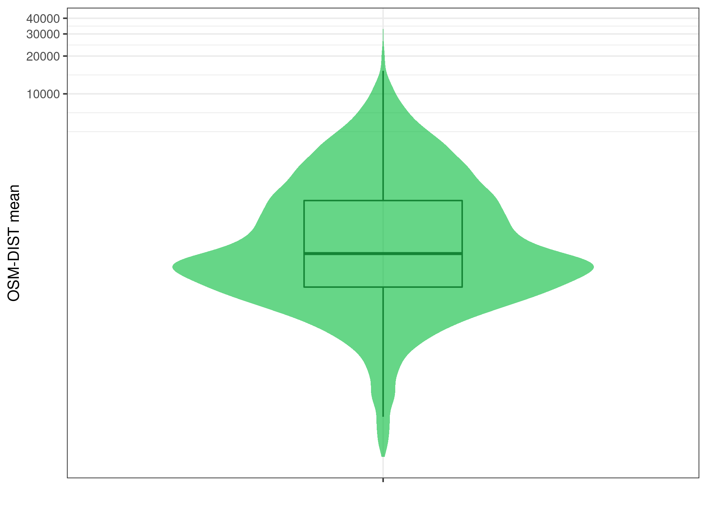

    ## 
    ## $mapa_con_pais


``` r
get(objeto)[['intervalos_y_etiquetas_kable']]
```

<table class="table table-hover table-condensed" style="margin-left: auto; margin-right: auto;">
<caption>
Table 3: Intervalos de Distancia a accesos OSM
</caption>
<thead>
<tr>
<th style="text-align:left;">
OSM-DIST mean intervalos
</th>
<th style="text-align:left;">
OSM-DIST mean etiquetas
</th>
<th style="text-align:right;">
enteros_ordenados
</th>
</tr>
</thead>
<tbody>
<tr>
<td style="text-align:left;">
\[12.8,50\]
</td>
<td style="text-align:left;">
no idóneo
</td>
<td style="text-align:right;">
1
</td>
</tr>
<tr>
<td style="text-align:left;">
(50,200\]
</td>
<td style="text-align:left;">
altamente idóneo
</td>
<td style="text-align:right;">
4
</td>
</tr>
<tr>
<td style="text-align:left;">
(200,500\]
</td>
<td style="text-align:left;">
moderadamente idóneo
</td>
<td style="text-align:right;">
3
</td>
</tr>
<tr>
<td style="text-align:left;">
(500,5e+03\]
</td>
<td style="text-align:left;">
marginalmente idóneo
</td>
<td style="text-align:right;">
2
</td>
</tr>
<tr>
<td style="text-align:left;">
(5e+03,3.28e+04\]
</td>
<td style="text-align:left;">
no idóneo
</td>
<td style="text-align:right;">
1
</td>
</tr>
</tbody>
</table>

``` r
# clipr::write_clip(get(objeto)$intervalos_y_etiquetas)
```

Estacionalidad térmica.

``` r
objeto <- 'tseasonizzo_rcl'
assign(
  objeto,
  generar_resumen_grafico_estadistico_criterios(
    variable = 'TSEASON-IZZO mean',
    umbrales = c(0.8, 1.2, 1.6),
    nombre = 'Estacionalidad térmica',
    ord_cat = 'ni')
)
```

    ##    Min. 1st Qu.  Median    Mean 3rd Qu.    Max.    NA's 
    ##   0.573   1.195   1.301   1.326   1.477   1.866     105

``` r
get(objeto)[c('violin', 'mapa_con_pais')]
```

    ## $violin

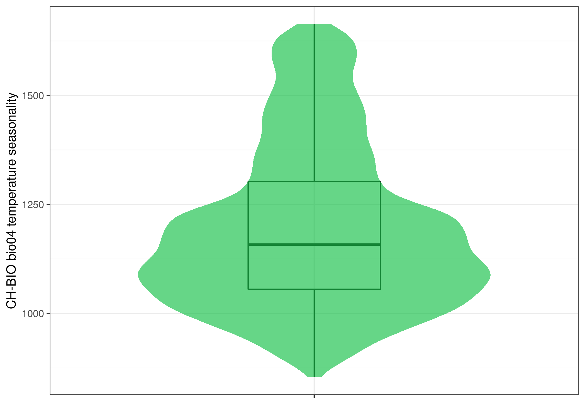

    ## 
    ## $mapa_con_pais

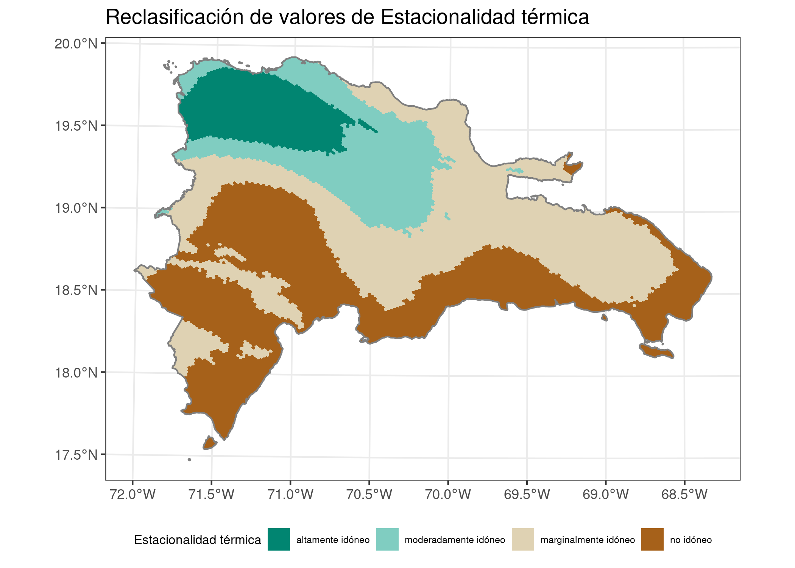

``` r
get(objeto)[['intervalos_y_etiquetas_kable']]
```

<table class="table table-hover table-condensed" style="margin-left: auto; margin-right: auto;">
<caption>
Table 4: Intervalos de Estacionalidad térmica
</caption>
<thead>
<tr>
<th style="text-align:left;">
TSEASON-IZZO mean intervalos
</th>
<th style="text-align:left;">
TSEASON-IZZO mean etiquetas
</th>
<th style="text-align:right;">
enteros_ordenados
</th>
</tr>
</thead>
<tbody>
<tr>
<td style="text-align:left;">
\[0.573,0.8\]
</td>
<td style="text-align:left;">
no idóneo
</td>
<td style="text-align:right;">
1
</td>
</tr>
<tr>
<td style="text-align:left;">
(0.8,1.2\]
</td>
<td style="text-align:left;">
marginalmente idóneo
</td>
<td style="text-align:right;">
2
</td>
</tr>
<tr>
<td style="text-align:left;">
(1.2,1.6\]
</td>
<td style="text-align:left;">
moderadamente idóneo
</td>
<td style="text-align:right;">
3
</td>
</tr>
<tr>
<td style="text-align:left;">
(1.6,1.87\]
</td>
<td style="text-align:left;">
altamente idóneo
</td>
<td style="text-align:right;">
4
</td>
</tr>
</tbody>
</table>

``` r
# clipr::write_clip(get(objeto)$intervalos_y_etiquetas)
```

Estacionalidad pluviométrica.

``` r
objeto <- 'pseasonizzo_rcl'
assign(
  objeto,
  generar_resumen_grafico_estadistico_criterios(
    variable = 'PSEASON-IZZO mean',
    umbrales = c(30, 40, 50),
    nombre = 'Estacionalidad pluviométrica',
    ord_cat = 'ni')
)
```

    ##    Min. 1st Qu.  Median    Mean 3rd Qu.    Max.    NA's 
    ##   19.51   31.14   43.51   42.76   52.55   89.60     105

``` r
get(objeto)[c('violin', 'mapa_con_pais')]
```

    ## $violin

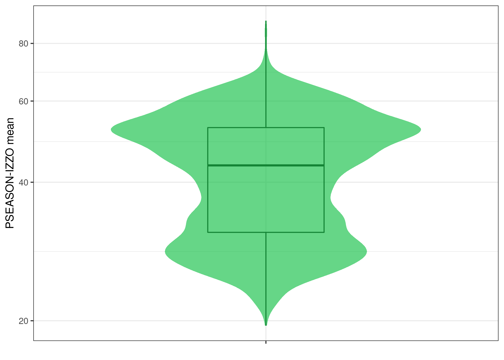

    ## 
    ## $mapa_con_pais

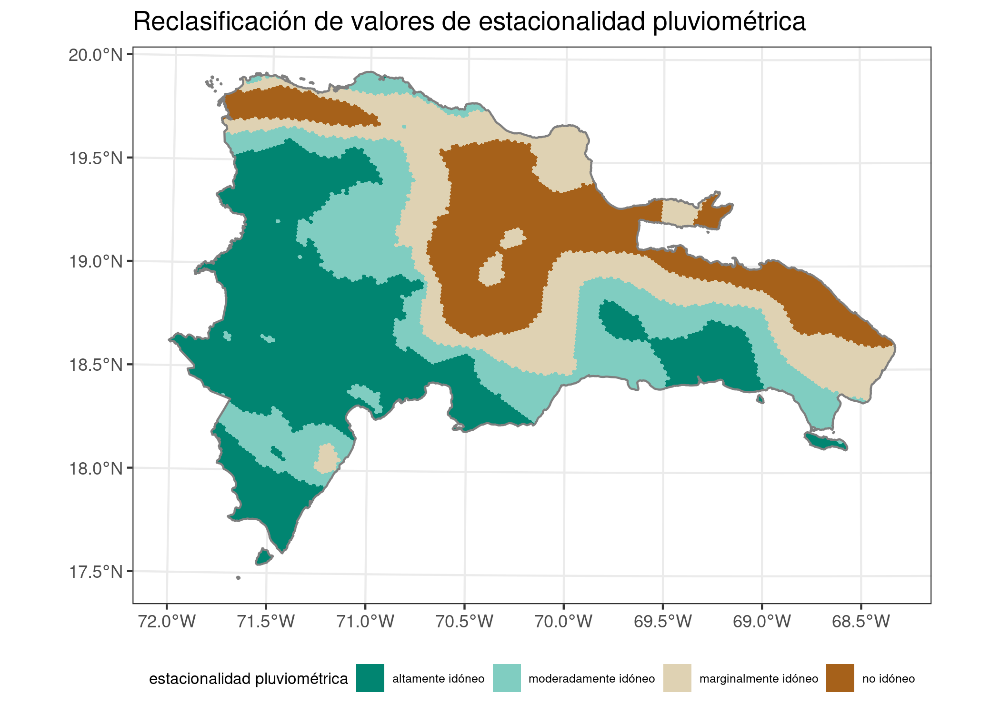

``` r
get(objeto)[['intervalos_y_etiquetas_kable']]
```

<table class="table table-hover table-condensed" style="margin-left: auto; margin-right: auto;">
<caption>
Table 5: Intervalos de Estacionalidad pluviométrica
</caption>
<thead>
<tr>
<th style="text-align:left;">
PSEASON-IZZO mean intervalos
</th>
<th style="text-align:left;">
PSEASON-IZZO mean etiquetas
</th>
<th style="text-align:right;">
enteros_ordenados
</th>
</tr>
</thead>
<tbody>
<tr>
<td style="text-align:left;">
\[19.5,30\]
</td>
<td style="text-align:left;">
no idóneo
</td>
<td style="text-align:right;">
1
</td>
</tr>
<tr>
<td style="text-align:left;">
(30,40\]
</td>
<td style="text-align:left;">
marginalmente idóneo
</td>
<td style="text-align:right;">
2
</td>
</tr>
<tr>
<td style="text-align:left;">
(40,50\]
</td>
<td style="text-align:left;">
moderadamente idóneo
</td>
<td style="text-align:right;">
3
</td>
</tr>
<tr>
<td style="text-align:left;">
(50,89.6\]
</td>
<td style="text-align:left;">
altamente idóneo
</td>
<td style="text-align:right;">
4
</td>
</tr>
</tbody>
</table>

``` r
# clipr::write_clip(get(objeto)$intervalos_y_etiquetas)

# Para comparar con CHELSA
# objeto <- 'chbio15_rcl'
# assign(
#   objeto,
#   generar_resumen_grafico_estadistico_criterios(
#     variable = 'CH-BIO bio15 precipitation seasonality',
#     umbrales = c(300, 400, 500),
#     nombre = 'Estacionalidad pluviométrica',
#     ord_cat = 'ni')
# )
# get(objeto)[c('violin', 'mapa_con_pais', 'intervalos_y_etiquetas_kable')]
# # clipr::write_clip(get(objeto)$intervalos_y_etiquetas)
```

Heterogeneidad de hábitat.

``` r
objeto <- 'hethab_rcl'
assign(
  objeto,
  generar_resumen_grafico_estadistico_criterios(
    variable = 'GHH coefficient_of_variation_1km',
    umbrales = c(250, 500, 1500),
    nombre = 'Heterogeneidad de hábitat',
    ord_cat = 'in')
)
```

    ##    Min. 1st Qu.  Median    Mean 3rd Qu.    Max. 
    ##     0.0   317.6   399.6   481.4   529.5  3563.4

``` r
get(objeto)[c('violin', 'mapa_con_pais')]
```

    ## $violin

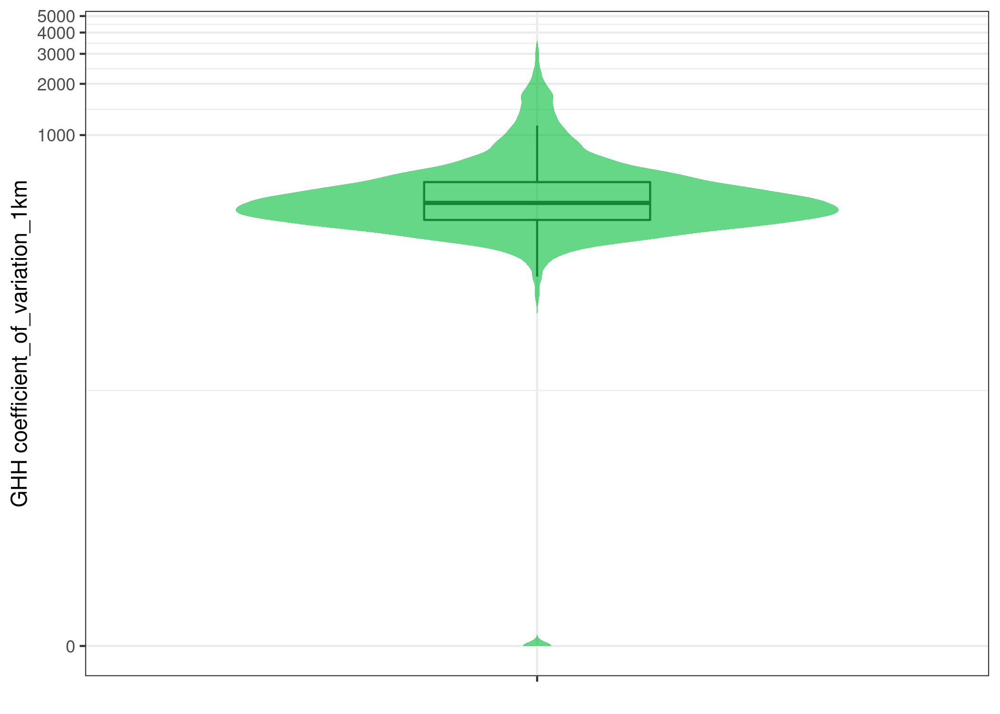

    ## 
    ## $mapa_con_pais

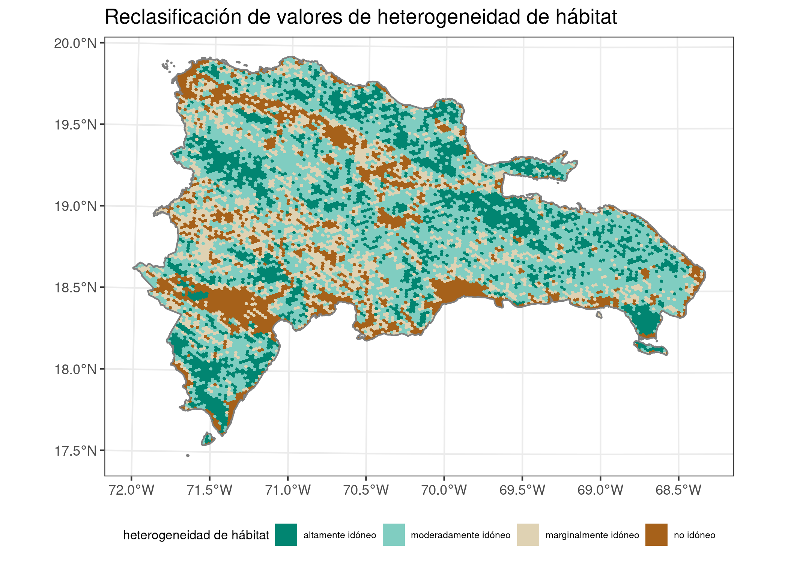

``` r
get(objeto)[['intervalos_y_etiquetas_kable']]
```

<table class="table table-hover table-condensed" style="margin-left: auto; margin-right: auto;">
<caption>
Table 6: Intervalos de Heterogeneidad de hábitat
</caption>
<thead>
<tr>
<th style="text-align:left;">
GHH coefficient_of_variation_1km intervalos
</th>
<th style="text-align:left;">
GHH coefficient_of_variation_1km etiquetas
</th>
<th style="text-align:right;">
enteros_ordenados
</th>
</tr>
</thead>
<tbody>
<tr>
<td style="text-align:left;">
\[0,250\]
</td>
<td style="text-align:left;">
altamente idóneo
</td>
<td style="text-align:right;">
4
</td>
</tr>
<tr>
<td style="text-align:left;">
(250,500\]
</td>
<td style="text-align:left;">
moderadamente idóneo
</td>
<td style="text-align:right;">
3
</td>
</tr>
<tr>
<td style="text-align:left;">
(500,1.5e+03\]
</td>
<td style="text-align:left;">
marginalmente idóneo
</td>
<td style="text-align:right;">
2
</td>
</tr>
<tr>
<td style="text-align:left;">
(1.5e+03,3.56e+03\]
</td>
<td style="text-align:left;">
no idóneo
</td>
<td style="text-align:right;">
1
</td>
</tr>
</tbody>
</table>

``` r
# clipr::write_clip(get(objeto)$intervalos_y_etiquetas)
```

Distancia a cuerpos de agua y humedales.

``` r
objeto <- 'wbwdist_rcl'
assign(
  objeto,
  generar_resumen_grafico_estadistico_criterios(
    variable = 'WBW-DIST mean',
    umbrales = c(1000, 2000, 3000),
    nombre = 'Distancia a cuerpos de agua y humedales',
    ord_cat = 'ni')
)
```

    ##    Min. 1st Qu.  Median    Mean 3rd Qu.    Max. 
    ##       0    2698    6069    7134   10545   26424

``` r
get(objeto)[c('violin', 'mapa_con_pais')]
```

    ## $violin

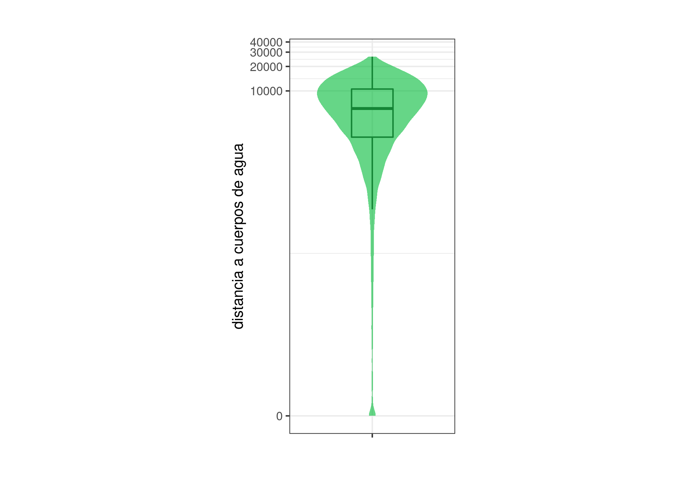

    ## 
    ## $mapa_con_pais

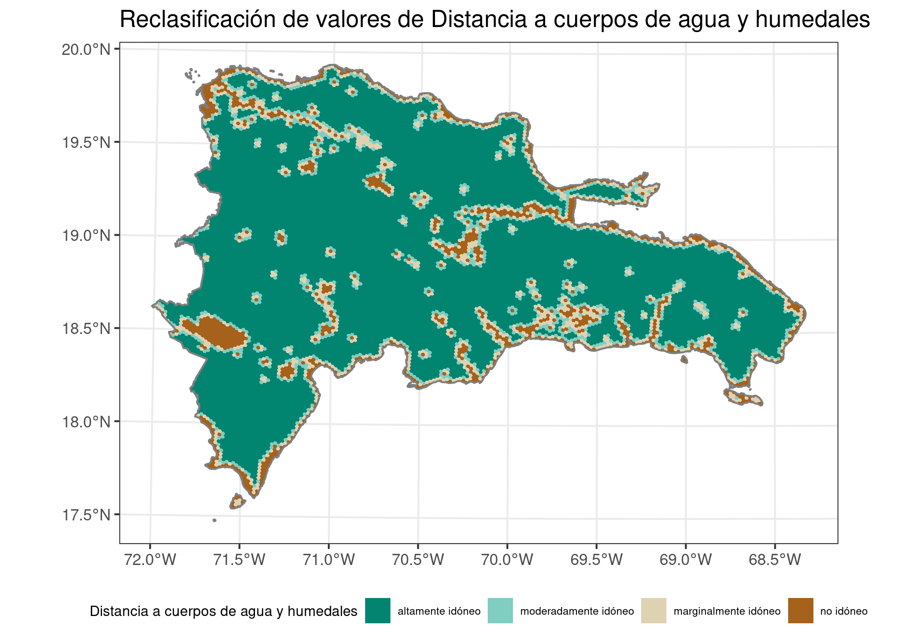

``` r
get(objeto)[['intervalos_y_etiquetas_kable']]
```

<table class="table table-hover table-condensed" style="margin-left: auto; margin-right: auto;">
<caption>
Table 7: Intervalos de Distancia a cuerpos de agua y humedales
</caption>
<thead>
<tr>
<th style="text-align:left;">
WBW-DIST mean intervalos
</th>
<th style="text-align:left;">
WBW-DIST mean etiquetas
</th>
<th style="text-align:right;">
enteros_ordenados
</th>
</tr>
</thead>
<tbody>
<tr>
<td style="text-align:left;">
\[0,1e+03\]
</td>
<td style="text-align:left;">
no idóneo
</td>
<td style="text-align:right;">
1
</td>
</tr>
<tr>
<td style="text-align:left;">
(1e+03,2e+03\]
</td>
<td style="text-align:left;">
marginalmente idóneo
</td>
<td style="text-align:right;">
2
</td>
</tr>
<tr>
<td style="text-align:left;">
(2e+03,3e+03\]
</td>
<td style="text-align:left;">
moderadamente idóneo
</td>
<td style="text-align:right;">
3
</td>
</tr>
<tr>
<td style="text-align:left;">
(3e+03,2.64e+04\]
</td>
<td style="text-align:left;">
altamente idóneo
</td>
<td style="text-align:right;">
4
</td>
</tr>
</tbody>
</table>

``` r
# clipr::write_clip(get(objeto)$intervalos_y_etiquetas)
```

Pendiente.

``` r
objeto <- 'slope_rcl'
assign(
  objeto,
  generar_resumen_grafico_estadistico_criterios(
    variable = 'G90 Slope',
    umbrales = c(3, 9, 15),
    nombre = 'Pendiente promedio',
    ord_cat = 'in')
)
```

    ##    Min. 1st Qu.  Median    Mean 3rd Qu.    Max. 
    ##   0.000   1.370   4.489   6.773  10.840  32.705

``` r
get(objeto)[c('violin', 'mapa_con_pais')]
```

    ## $violin

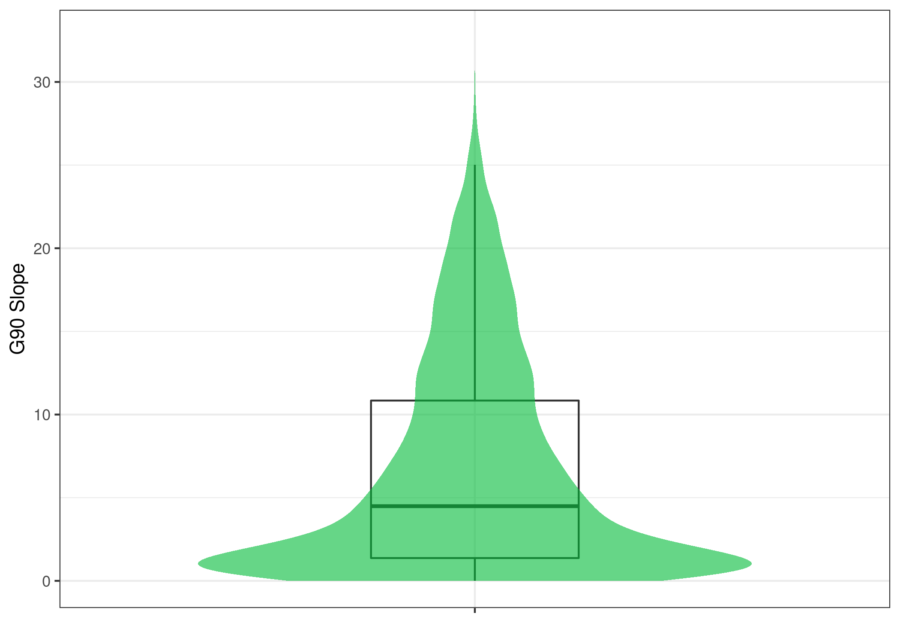

    ## 
    ## $mapa_con_pais


``` r
get(objeto)[['intervalos_y_etiquetas_kable']]
```

<table class="table table-hover table-condensed" style="margin-left: auto; margin-right: auto;">
<caption>
Table 8: Intervalos de Pendiente promedio
</caption>
<thead>
<tr>
<th style="text-align:left;">
G90 Slope intervalos
</th>
<th style="text-align:left;">
G90 Slope etiquetas
</th>
<th style="text-align:right;">
enteros_ordenados
</th>
</tr>
</thead>
<tbody>
<tr>
<td style="text-align:left;">
\[0,3\]
</td>
<td style="text-align:left;">
altamente idóneo
</td>
<td style="text-align:right;">
4
</td>
</tr>
<tr>
<td style="text-align:left;">
(3,9\]
</td>
<td style="text-align:left;">
moderadamente idóneo
</td>
<td style="text-align:right;">
3
</td>
</tr>
<tr>
<td style="text-align:left;">
(9,15\]
</td>
<td style="text-align:left;">
marginalmente idóneo
</td>
<td style="text-align:right;">
2
</td>
</tr>
<tr>
<td style="text-align:left;">
(15,32.7\]
</td>
<td style="text-align:left;">
no idóneo
</td>
<td style="text-align:right;">
1
</td>
</tr>
</tbody>
</table>

``` r
# clipr::write_clip(get(objeto)$intervalos_y_etiquetas)
```

Horas de insolación.

``` r
objeto <- 'insol_rcl'
assign(
  objeto,
  generar_resumen_grafico_estadistico_criterios(
    variable = 'YINSOLTIME mean',
    umbrales = c(3900, 4100, 4300),
    nombre = 'Horas de insolación',
    ord_cat = 'ni')
)
```

    ##    Min. 1st Qu.  Median    Mean 3rd Qu.    Max.    NA's 
    ##    3176    4092    4296    4232    4421    4483     104

``` r
get(objeto)[c('violin', 'mapa_con_pais')]
```

    ## $violin

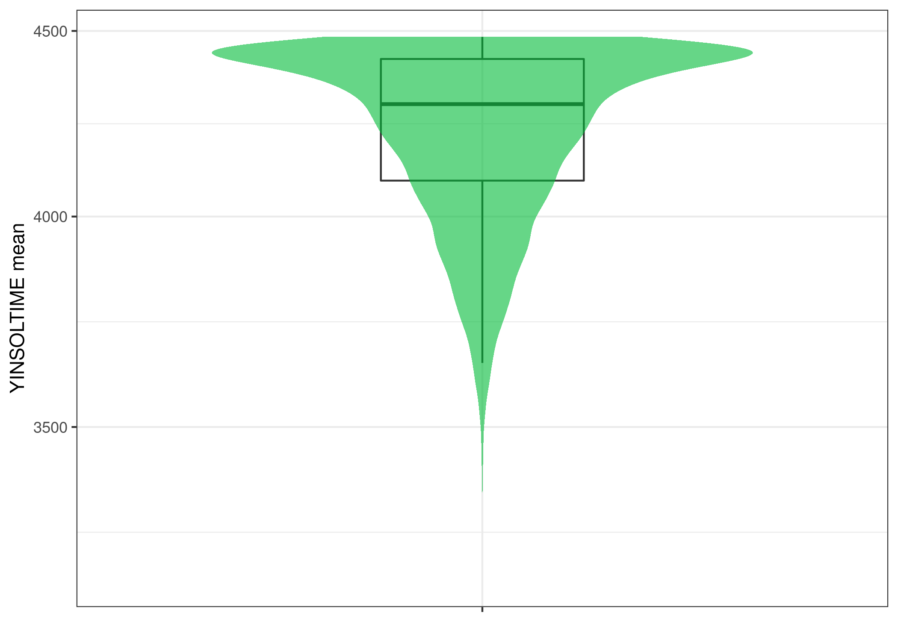

    ## 
    ## $mapa_con_pais

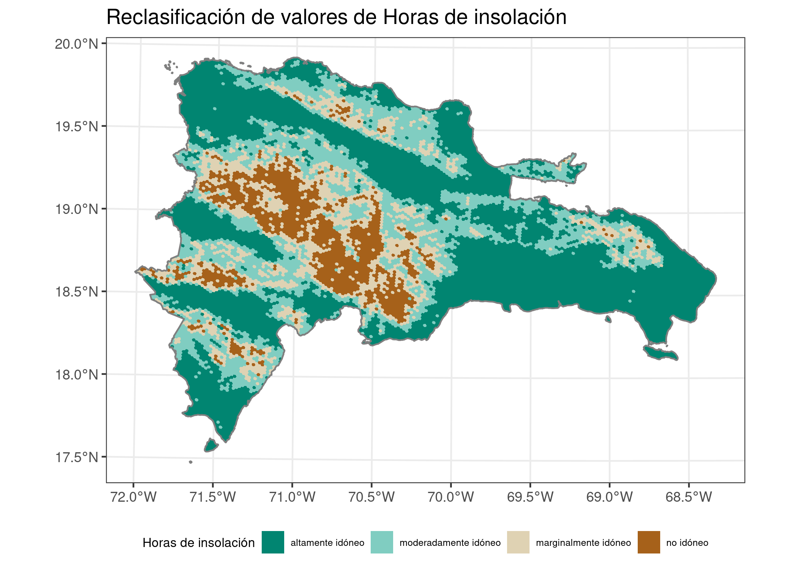

``` r
get(objeto)[['intervalos_y_etiquetas_kable']]
```

<table class="table table-hover table-condensed" style="margin-left: auto; margin-right: auto;">
<caption>
Table 9: Intervalos de Horas de insolación
</caption>
<thead>
<tr>
<th style="text-align:left;">
YINSOLTIME mean intervalos
</th>
<th style="text-align:left;">
YINSOLTIME mean etiquetas
</th>
<th style="text-align:right;">
enteros_ordenados
</th>
</tr>
</thead>
<tbody>
<tr>
<td style="text-align:left;">
\[3.18e+03,3.9e+03\]
</td>
<td style="text-align:left;">
no idóneo
</td>
<td style="text-align:right;">
1
</td>
</tr>
<tr>
<td style="text-align:left;">
(3.9e+03,4.1e+03\]
</td>
<td style="text-align:left;">
marginalmente idóneo
</td>
<td style="text-align:right;">
2
</td>
</tr>
<tr>
<td style="text-align:left;">
(4.1e+03,4.3e+03\]
</td>
<td style="text-align:left;">
moderadamente idóneo
</td>
<td style="text-align:right;">
3
</td>
</tr>
<tr>
<td style="text-align:left;">
(4.3e+03,4.48e+03\]
</td>
<td style="text-align:left;">
altamente idóneo
</td>
<td style="text-align:right;">
4
</td>
</tr>
</tbody>
</table>

``` r
# clipr::write_clip(get(objeto)$intervalos_y_etiquetas)
```

Elevación.

``` r
objeto <- 'ele_rcl'
assign(
  objeto,
  generar_resumen_grafico_estadistico_criterios(
    variable = 'CGIAR-ELE mean',
    umbrales = c(200, 400, 800),
    nombre = 'Elevación',
    ord_cat = 'ni')
)
```

    ##    Min. 1st Qu.  Median    Mean 3rd Qu.    Max.    NA's 
    ##  -42.00   57.76  186.78  386.79  542.70 2791.69      35

``` r
get(objeto)[c('violin', 'mapa_con_pais')]
```

    ## $violin

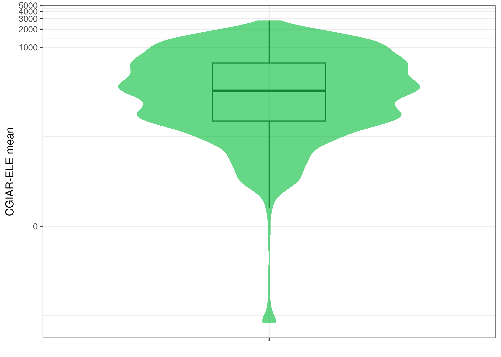

    ## 
    ## $mapa_con_pais

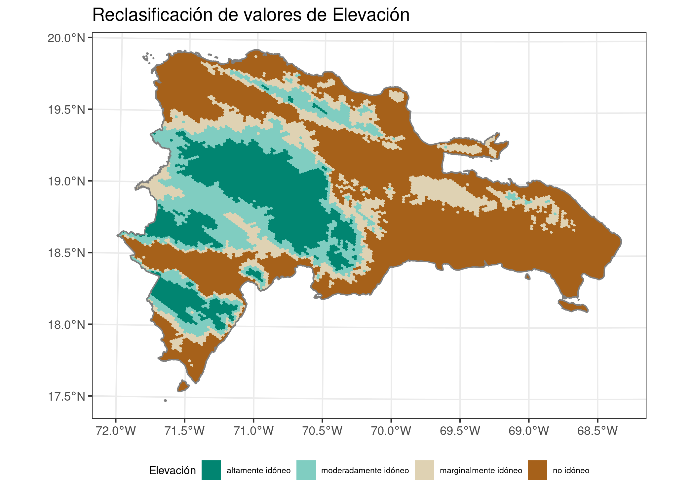

``` r
get(objeto)[['intervalos_y_etiquetas_kable']]
```

<table class="table table-hover table-condensed" style="margin-left: auto; margin-right: auto;">
<caption>
Table 10: Intervalos de Elevación
</caption>
<thead>
<tr>
<th style="text-align:left;">
CGIAR-ELE mean intervalos
</th>
<th style="text-align:left;">
CGIAR-ELE mean etiquetas
</th>
<th style="text-align:right;">
enteros_ordenados
</th>
</tr>
</thead>
<tbody>
<tr>
<td style="text-align:left;">
(200,400\]
</td>
<td style="text-align:left;">
marginalmente idóneo
</td>
<td style="text-align:right;">
2
</td>
</tr>
<tr>
<td style="text-align:left;">
(400,800\]
</td>
<td style="text-align:left;">
moderadamente idóneo
</td>
<td style="text-align:right;">
3
</td>
</tr>
<tr>
<td style="text-align:left;">
(800,2.79e+03\]
</td>
<td style="text-align:left;">
altamente idóneo
</td>
<td style="text-align:right;">
4
</td>
</tr>
<tr>
<td style="text-align:left;">
\[-42,200\]
</td>
<td style="text-align:left;">
no idóneo
</td>
<td style="text-align:right;">
1
</td>
</tr>
</tbody>
</table>

``` r
# clipr::write_clip(get(objeto)$intervalos_y_etiquetas)
```

## Información suplementaria

Versión HTML (más legible e interactiva),
[aquí](https://geofis.github.io/datos-meteoclimaticos-escenarios-cc/ponderacion-variables-ahp.html)

## Suplemento metodológico para la selección de sitios para el establecimiento de una red de estaciones meteoclimáticas usando AHP y análisis de autocorrelación espacial

``` r
library(kableExtra)
library(tidyverse)
library(ahpsurvey)
estilo_kable <- function(df, titulo = '', cubre_anchura = T) {
  df %>% kable(format = 'html', escape = F, booktabs = T, digits = 2, caption = titulo) %>%
  kable_styling(bootstrap_options = c("hover", "condensed"), full_width = cubre_anchura)
}
```

### Escalas de valoración y matriz de comparación por parejas

``` r
variables <- c(
    acce = "distancia a accesos",
    temp = "estacionalidad térmica",
    pluv = "estacionalidad pluviométrica",
    habi = "heterogeneidad de hábitat",
    agua = "distancia a cuerpos de agua",
    pend = "pendiente",
    inso = "horas de insolación",
    elev = "elevación"
)
col_ord <- as.vector(sapply(as.data.frame(combn(names(variables), 2)), paste0, collapse = '_'))
```

El método AHP consiste en descomponer un problema complejo en una
estructura jerárquica de criterios y subcriterios, que consisten en
variables o atributos del terreno en nuestro caso, y luego comparar las
alternativas en función de cada uno de estos criterios. Los variables se
comparan en parejas (o pares, comparación pareada), en la que se asigna
un valor numérico a la importancia relativa de cada criterio en relación
con los demás. La evaluación pareada se realiza para cada par único de
variables; así, el número de comparaciones posibles es
$\frac{N(N-1)}{2}$

En nuestro caso, dado que comparamos 8 atributos (variables) en parejas,
realizamos un total de $(8\times7)/2=28$ comparaciones. Los atributos
seleccionados fueron *distancia a accesos, estacionalidad térmica,
estacionalidad pluviométrica, heterogeneidad de hábitat, distancia a
cuerpos de agua, pendiente, horas de insolación, elevación*. Para evitar
errores de redundancia y garantizar un diseño sistemático y eficiente,
empleamos Formularios de Google al cual titulamos como [“Formulario de
comparación pareada de criterios de identificación de sitios idóneos
para una red de observación
climática”](https://docs.google.com/forms/d/e/1FAIpQLScOx1bxW47LLEPQ_A6lHmSnpOQkUyHEoLJsRIKBNlbfQby5Dw/viewform?usp=sf_link).
Programamos en Python las posibles comparaciones por pares y,
seguidamente, a través de la API del Google Workspace, enviamos el
diseño para su puesta en línea. Un total de nueve personas del área de
climatología, análisis de datos y geografía física, rellenaron el
formulario.

Para procesar los resultados de las consultas y generar una tabla de
preferencias global con la cual construimos los pesos, en primer lugar
generamos una tabla (no confundir con la matriz de comparación por
parejas) donde cada columna es una comparación de dos atributos, por
ejemplo A y B. Dado que la escala de valoración por parejas del método
AHP, en sentido estricto, se apoya en ecuaciones lineales, en el fondo
se utiliza una escala ordinal basada en un gradiente, que en el método
original, usa números enteros 1 al 9. Esto significa que, al asignar
“1”, estamos indicando que los criterios comparados, por ejemplo, A y B,
tienen la misma importancia. Del 2 al 9, el criterio B tiene mayor
importancia, de manera creciente, que el A. Por otra parte, el grado de
importancia de A sobre B se denota por medio de recíprocos
`{1/2 , 1/3, ..., 1/8, 1/9}` y usando un gradiente inverso, es decir, la
fracción más pequeña (`1/9`) indica mayor importancia relativa para el
criterio A. Para denotar las valoraciones complementarias, el paquete
`ahpsurvey` permite usar opuestos `{-2, -3, ..., -8, -9}`, que luego son
recodificados a recíprocos en la matriz de comparación por parejas;
preferiremos esta opción, es decir, usar opuestos, porque nos facilitó
la recodificación con expresiones regulares.

Luego de recoger las valoraciones realizadas por medio de consultas en
una tabla, el siguiente paso consistió en obtener la matriz de
comparación por parejas, que tiene la siguiente forma:

$$ \mathbf{S_k} =\begin{pmatrix}
                      a_{1,1} & a_{1,2} & \cdots & a_{1,N} \\
                      a_{2,1} & a_{2,2} & \cdots & a_{2,N} \\
                      \vdots  & \vdots  & a_{i,j} & \vdots  \\
                      a_{N,1} & a_{N,2} & \cdots & a_{N,N}
                      \end{pmatrix} $$

donde $a_{i,j}$ representa la comparación del atributo $i$ y $j$. Tal
como se ha comentado, si $i$ es más importante que $j$ en 6 unidades,
$a_{i,j} = 6$ y $a_{j,i} = \frac{1}{6}$, es decir, el recíproco. Los
datos de las comparaciones deben organizarse en esta forma matricial
para realizar los análisis subsiguientes.

### Recodificación de valores y de nombres de columnas

En el estudio, utilizamos una escala modificada basada en sólo 7
posibles puntuaciones, recodificamos las puntuaciones de formulario de
la siguiente manera: el valor 0 a 1 (usamos 0 en los formularios para
facilitar la comprensión de la escala a los encuestados); los valores
33%, 66% y 100%, los distribuimos en el rango 2 a 9 de la siguiente
manera:

``` r
valor_formulario <- c('(100)', '(66)', '(33)', '0', '33', '66', '100')
recod_repartida <- FALSE
if(recod_repartida) {
    recodificado_ahp <- round(c(0-(2+3*((9-2)/3)), 0-(2+2*((9-2)/3)), 0-(2+((9-2)/3)),
                              1,
                              2+((9-2)/3), 2+2*((9-2)/3), 2+3*((9-2)/3)
                              ),
                            2)

} else {
  recodificado_ahp <- c(-9, -6, -3,
                        1,
                        3, 6, 9)
}
data.frame(
  `Valor en formulario` = valor_formulario,
  `Recodificado a escala AHP original` = recodificado_ahp,
  check.names = F) %>% 
  kable(format = 'html', escape = F, booktabs = T,
        caption = 'Tabla de recodificación de puntaciones de formulario a escala AHP original') %>%
  kable_styling(bootstrap_options = c("hover", "condensed"), full_width = T)
```

<table class="table table-hover table-condensed" style="margin-left: auto; margin-right: auto;">
<caption>
Table 11: Tabla de recodificación de puntaciones de formulario a escala
AHP original
</caption>
<thead>
<tr>
<th style="text-align:left;">
Valor en formulario
</th>
<th style="text-align:right;">
Recodificado a escala AHP original
</th>
</tr>
</thead>
<tbody>
<tr>
<td style="text-align:left;">

100) </td>
     <td style="text-align:right;">
     -9
     </td>
     </tr>
     <tr>
     <td style="text-align:left;">

     66) </td>
         <td style="text-align:right;">
         -6
         </td>
         </tr>
         <tr>
         <td style="text-align:left;">

         33) </td>
             <td style="text-align:right;">
             -3
             </td>
             </tr>
             <tr>
             <td style="text-align:left;">
             0
             </td>
             <td style="text-align:right;">
             1
             </td>
             </tr>
             <tr>
             <td style="text-align:left;">
             33
             </td>
             <td style="text-align:right;">
             3
             </td>
             </tr>
             <tr>
             <td style="text-align:left;">
             66
             </td>
             <td style="text-align:right;">
             6
             </td>
             </tr>
             <tr>
             <td style="text-align:left;">
             100
             </td>
             <td style="text-align:right;">
             9
             </td>
             </tr>
             </tbody>
             </table>

Por otro lado, creamos un “diccionario” (vector nombrado `variables`) de
equivalencias entre los nombres largos de columnas de la tabla de
resultados (que provienen escritas en el lenguaje natural de los
formularios) y nombres cortos de cuatro caracteres. Este diccionario lo
utilizamos para recodificar los nombres de las columnas de la tabla de
respuestas a nombres cortos, con lo cual mejoramos la legibilidad de las
representaciones gráficas y las impresiones de tablas y matrices de
resultados.

``` r
as.data.frame(variables) %>% 
  rownames_to_column() %>% 
  setNames(nm = c('Código', 'Nombre completo')) %>% 
  kable(format = 'html', escape = F, booktabs = T,
        caption = 'Tabla de equivalencias de nombres de las variables evaluadas') %>%
  kable_styling(bootstrap_options = c("hover", "condensed"), full_width = T)
```

<table class="table table-hover table-condensed" style="margin-left: auto; margin-right: auto;">
<caption>
Table 12: Tabla de equivalencias de nombres de las variables evaluadas
</caption>
<thead>
<tr>
<th style="text-align:left;">
Código
</th>
<th style="text-align:left;">
Nombre completo
</th>
</tr>
</thead>
<tbody>
<tr>
<td style="text-align:left;">
acce
</td>
<td style="text-align:left;">
distancia a accesos
</td>
</tr>
<tr>
<td style="text-align:left;">
temp
</td>
<td style="text-align:left;">
estacionalidad térmica
</td>
</tr>
<tr>
<td style="text-align:left;">
pluv
</td>
<td style="text-align:left;">
estacionalidad pluviométrica
</td>
</tr>
<tr>
<td style="text-align:left;">
habi
</td>
<td style="text-align:left;">
heterogeneidad de hábitat
</td>
</tr>
<tr>
<td style="text-align:left;">
agua
</td>
<td style="text-align:left;">
distancia a cuerpos de agua
</td>
</tr>
<tr>
<td style="text-align:left;">
pend
</td>
<td style="text-align:left;">
pendiente
</td>
</tr>
<tr>
<td style="text-align:left;">
inso
</td>
<td style="text-align:left;">
horas de insolación
</td>
</tr>
<tr>
<td style="text-align:left;">
elev
</td>
<td style="text-align:left;">
elevación
</td>
</tr>
</tbody>
</table>

Con la tabla de equivalencias de puntuaciones y el diccionario de
nombres, recodificamos programáticas las respuestas obtenidas en los
formularios a la escala original del método AHP, así como los nombres de
columnas de la tabla de respuestas de comparación de atributos. En
primer lugar, mostramos cómo realizamos la recodificación de
puntuaciones.

La tabla de resultados de las puntuaciones en bruto (anonimizada),
obtenida a partir del rellenado en Google Forms por parte de 9
consultados, se muestra a continuación.

``` r
tabla_original <- read_csv('fuentes/respuestas-ahp/respuestas.csv')
tabla_en_bruto <- tabla_original[, -grep('Marca|Opcionalmente', colnames(tabla_original))]
tabla_en_bruto %>% 
    kable(format = 'html', escape = F, booktabs = T,
        caption = 'Tabla de resultados en bruto (anonimizada) obtenida a partir del rellenado del "Formulario de comparación pareada de criterios de identificación de sitios idóneos para una red de observación climática"') %>%
  kable_styling(bootstrap_options = c("hover", "condensed"), full_width = T)
```

<table class="table table-hover table-condensed" style="margin-left: auto; margin-right: auto;">
<caption>
Table 13: Tabla de resultados en bruto (anonimizada) obtenida a partir
del rellenado del “Formulario de comparación pareada de criterios de
identificación de sitios idóneos para una red de observación climática”
</caption>
<thead>
<tr>
<th style="text-align:left;">
Valora la importancia relativa de las variables horas de insolación y
elevación
</th>
<th style="text-align:left;">
Valora la importancia relativa de las variables pendiente y elevación
</th>
<th style="text-align:left;">
Valora la importancia relativa de las variables pendiente y horas de
insolación
</th>
<th style="text-align:left;">
Valora la importancia relativa de las variables distancia a cuerpos de
agua y elevación
</th>
<th style="text-align:left;">
Valora la importancia relativa de las variables distancia a cuerpos de
agua y horas de insolación
</th>
<th style="text-align:left;">
Valora la importancia relativa de las variables distancia a cuerpos de
agua y pendiente
</th>
<th style="text-align:left;">
Valora la importancia relativa de las variables heterogeneidad de
hábitat y elevación
</th>
<th style="text-align:left;">
Valora la importancia relativa de las variables heterogeneidad de
hábitat y horas de insolación
</th>
<th style="text-align:left;">
Valora la importancia relativa de las variables heterogeneidad de
hábitat y pendiente
</th>
<th style="text-align:left;">
Valora la importancia relativa de las variables heterogeneidad de
hábitat y distancia a cuerpos de agua
</th>
<th style="text-align:left;">
Valora la importancia relativa de las variables estacionalidad
pluviométrica y elevación
</th>
<th style="text-align:left;">
Valora la importancia relativa de las variables estacionalidad
pluviométrica y horas de insolación
</th>
<th style="text-align:left;">
Valora la importancia relativa de las variables estacionalidad
pluviométrica y pendiente
</th>
<th style="text-align:left;">
Valora la importancia relativa de las variables estacionalidad
pluviométrica y distancia a cuerpos de agua
</th>
<th style="text-align:left;">
Valora la importancia relativa de las variables estacionalidad
pluviométrica y heterogeneidad de hábitat
</th>
<th style="text-align:left;">
Valora la importancia relativa de las variables estacionalidad térmica y
elevación
</th>
<th style="text-align:left;">
Valora la importancia relativa de las variables estacionalidad térmica y
horas de insolación
</th>
<th style="text-align:left;">
Valora la importancia relativa de las variables estacionalidad térmica y
pendiente
</th>
<th style="text-align:left;">
Valora la importancia relativa de las variables estacionalidad térmica y
distancia a cuerpos de agua
</th>
<th style="text-align:left;">
Valora la importancia relativa de las variables estacionalidad térmica y
heterogeneidad de hábitat
</th>
<th style="text-align:left;">
Valora la importancia relativa de las variables estacionalidad térmica y
estacionalidad pluviométrica
</th>
<th style="text-align:left;">
Valora la importancia relativa de las variables distancia a accesos y
elevación
</th>
<th style="text-align:left;">
Valora la importancia relativa de las variables distancia a accesos y
horas de insolación
</th>
<th style="text-align:left;">
Valora la importancia relativa de las variables distancia a accesos y
pendiente
</th>
<th style="text-align:left;">
Valora la importancia relativa de las variables distancia a accesos y
distancia a cuerpos de agua
</th>
<th style="text-align:left;">
Valora la importancia relativa de las variables distancia a accesos y
heterogeneidad de hábitat
</th>
<th style="text-align:left;">
Valora la importancia relativa de las variables distancia a accesos y
estacionalidad pluviométrica
</th>
<th style="text-align:left;">
Valora la importancia relativa de las variables distancia a accesos y
estacionalidad térmica
</th>
</tr>
</thead>
<tbody>
<tr>
<td style="text-align:left;">
33: Importancia moderada para elevación
</td>
<td style="text-align:left;">
100: Importancia máxima para elevación
</td>
<td style="text-align:left;">
100: Importancia máxima para horas de insolación
</td>
<td style="text-align:left;">
66: Importancia fuerte para elevación
</td>
<td style="text-align:left;">
66: Importancia fuerte para horas de insolación
</td>
<td style="text-align:left;">
0: Igual importancia para distancia a cuerpos de agua y pendiente
</td>
<td style="text-align:left;">
0: Igual importancia para heterogeneidad de hábitat y elevación
</td>
<td style="text-align:left;">
(33): Importancia moderada para heterogeneidad de hábitat
</td>
<td style="text-align:left;">
(66): Importancia fuerte para heterogeneidad de hábitat
</td>
<td style="text-align:left;">
(66): Importancia fuerte para heterogeneidad de hábitat
</td>
<td style="text-align:left;">
(66): Importancia fuerte para estacionalidad pluviométrica
</td>
<td style="text-align:left;">
(66): Importancia fuerte para estacionalidad pluviométrica
</td>
<td style="text-align:left;">
(100): Importancia máxima para estacionalidad pluviométrica
</td>
<td style="text-align:left;">
(100): Importancia máxima para estacionalidad pluviométrica
</td>
<td style="text-align:left;">
(33): Importancia moderada para estacionalidad pluviométrica
</td>
<td style="text-align:left;">
0: Igual importancia para estacionalidad térmica y elevación
</td>
<td style="text-align:left;">
(66): Importancia fuerte para estacionalidad térmica
</td>
<td style="text-align:left;">
(100): Importancia máxima para estacionalidad térmica
</td>
<td style="text-align:left;">
(100): Importancia máxima para estacionalidad térmica
</td>
<td style="text-align:left;">
0: Igual importancia para estacionalidad térmica y heterogeneidad de
hábitat
</td>
<td style="text-align:left;">
0: Igual importancia para estacionalidad térmica y estacionalidad
pluviométrica
</td>
<td style="text-align:left;">
33: Importancia moderada para elevación
</td>
<td style="text-align:left;">
33: Importancia moderada para horas de insolación
</td>
<td style="text-align:left;">
(66): Importancia fuerte para distancia a accesos
</td>
<td style="text-align:left;">
0: Igual importancia para distancia a accesos y distancia a cuerpos de
agua
</td>
<td style="text-align:left;">
100: Importancia máxima para heterogeneidad de hábitat
</td>
<td style="text-align:left;">
100: Importancia máxima para estacionalidad pluviométrica
</td>
<td style="text-align:left;">
100: Importancia máxima para estacionalidad térmica
</td>
</tr>
<tr>
<td style="text-align:left;">
33: Importancia moderada para elevación
</td>
<td style="text-align:left;">
33: Importancia moderada para elevación
</td>
<td style="text-align:left;">
66: Importancia fuerte para horas de insolación
</td>
<td style="text-align:left;">
33: Importancia moderada para elevación
</td>
<td style="text-align:left;">
33: Importancia moderada para horas de insolación
</td>
<td style="text-align:left;">
(33): Importancia moderada para distancia a cuerpos de agua
</td>
<td style="text-align:left;">
0: Igual importancia para heterogeneidad de hábitat y elevación
</td>
<td style="text-align:left;">
33: Importancia moderada para horas de insolación
</td>
<td style="text-align:left;">
(33): Importancia moderada para heterogeneidad de hábitat
</td>
<td style="text-align:left;">
0: Igual importancia para heterogeneidad de hábitat y distancia a
cuerpos de agua
</td>
<td style="text-align:left;">
0: Igual importancia para estacionalidad pluviométrica y elevación
</td>
<td style="text-align:left;">
(66): Importancia fuerte para estacionalidad pluviométrica
</td>
<td style="text-align:left;">
(66): Importancia fuerte para estacionalidad pluviométrica
</td>
<td style="text-align:left;">
(33): Importancia moderada para estacionalidad pluviométrica
</td>
<td style="text-align:left;">
(66): Importancia fuerte para estacionalidad pluviométrica
</td>
<td style="text-align:left;">
0: Igual importancia para estacionalidad térmica y elevación
</td>
<td style="text-align:left;">
(33): Importancia moderada para estacionalidad térmica
</td>
<td style="text-align:left;">
(66): Importancia fuerte para estacionalidad térmica
</td>
<td style="text-align:left;">
(33): Importancia moderada para estacionalidad térmica
</td>
<td style="text-align:left;">
(66): Importancia fuerte para estacionalidad térmica
</td>
<td style="text-align:left;">
0: Igual importancia para estacionalidad térmica y estacionalidad
pluviométrica
</td>
<td style="text-align:left;">
0: Igual importancia para distancia a accesos y elevación
</td>
<td style="text-align:left;">
0: Igual importancia para distancia a accesos y horas de insolación
</td>
<td style="text-align:left;">
(33): Importancia moderada para distancia a accesos
</td>
<td style="text-align:left;">
0: Igual importancia para distancia a accesos y distancia a cuerpos de
agua
</td>
<td style="text-align:left;">
0: Igual importancia para distancia a accesos y heterogeneidad de
hábitat
</td>
<td style="text-align:left;">
33: Importancia moderada para estacionalidad pluviométrica
</td>
<td style="text-align:left;">
33: Importancia moderada para estacionalidad térmica
</td>
</tr>
<tr>
<td style="text-align:left;">
(100): Importancia máxima para horas de insolación
</td>
<td style="text-align:left;">
(100): Importancia máxima para pendiente
</td>
<td style="text-align:left;">
(100): Importancia máxima para pendiente
</td>
<td style="text-align:left;">
(33): Importancia moderada para distancia a cuerpos de agua
</td>
<td style="text-align:left;">
(66): Importancia fuerte para distancia a cuerpos de agua
</td>
<td style="text-align:left;">
(66): Importancia fuerte para distancia a cuerpos de agua
</td>
<td style="text-align:left;">
(66): Importancia fuerte para heterogeneidad de hábitat
</td>
<td style="text-align:left;">
(100): Importancia máxima para heterogeneidad de hábitat
</td>
<td style="text-align:left;">
(100): Importancia máxima para heterogeneidad de hábitat
</td>
<td style="text-align:left;">
(100): Importancia máxima para heterogeneidad de hábitat
</td>
<td style="text-align:left;">
(100): Importancia máxima para estacionalidad pluviométrica
</td>
<td style="text-align:left;">
(100): Importancia máxima para estacionalidad pluviométrica
</td>
<td style="text-align:left;">
(66): Importancia fuerte para estacionalidad pluviométrica
</td>
<td style="text-align:left;">
(100): Importancia máxima para estacionalidad pluviométrica
</td>
<td style="text-align:left;">
(100): Importancia máxima para estacionalidad pluviométrica
</td>
<td style="text-align:left;">
(100): Importancia máxima para estacionalidad térmica
</td>
<td style="text-align:left;">
(100): Importancia máxima para estacionalidad térmica
</td>
<td style="text-align:left;">
(100): Importancia máxima para estacionalidad térmica
</td>
<td style="text-align:left;">
(100): Importancia máxima para estacionalidad térmica
</td>
<td style="text-align:left;">
(100): Importancia máxima para estacionalidad térmica
</td>
<td style="text-align:left;">
(100): Importancia máxima para estacionalidad térmica
</td>
<td style="text-align:left;">
(100): Importancia máxima para distancia a accesos
</td>
<td style="text-align:left;">
(100): Importancia máxima para distancia a accesos
</td>
<td style="text-align:left;">
(100): Importancia máxima para distancia a accesos
</td>
<td style="text-align:left;">
(100): Importancia máxima para distancia a accesos
</td>
<td style="text-align:left;">
(100): Importancia máxima para distancia a accesos
</td>
<td style="text-align:left;">
(100): Importancia máxima para distancia a accesos
</td>
<td style="text-align:left;">
(100): Importancia máxima para distancia a accesos
</td>
</tr>
<tr>
<td style="text-align:left;">
(66): Importancia fuerte para horas de insolación
</td>
<td style="text-align:left;">
0: Igual importancia para pendiente y elevación
</td>
<td style="text-align:left;">
33: Importancia moderada para horas de insolación
</td>
<td style="text-align:left;">
0: Igual importancia para distancia a cuerpos de agua y elevación
</td>
<td style="text-align:left;">
66: Importancia fuerte para horas de insolación
</td>
<td style="text-align:left;">
0: Igual importancia para distancia a cuerpos de agua y pendiente
</td>
<td style="text-align:left;">
66: Importancia fuerte para elevación
</td>
<td style="text-align:left;">
66: Importancia fuerte para horas de insolación
</td>
<td style="text-align:left;">
0: Igual importancia para heterogeneidad de hábitat y pendiente
</td>
<td style="text-align:left;">
0: Igual importancia para heterogeneidad de hábitat y distancia a
cuerpos de agua
</td>
<td style="text-align:left;">
0: Igual importancia para estacionalidad pluviométrica y elevación
</td>
<td style="text-align:left;">
0: Igual importancia para estacionalidad pluviométrica y horas de
insolación
</td>
<td style="text-align:left;">
(66): Importancia fuerte para estacionalidad pluviométrica
</td>
<td style="text-align:left;">
(66): Importancia fuerte para estacionalidad pluviométrica
</td>
<td style="text-align:left;">
(66): Importancia fuerte para estacionalidad pluviométrica
</td>
<td style="text-align:left;">
66: Importancia fuerte para elevación
</td>
<td style="text-align:left;">
66: Importancia fuerte para horas de insolación
</td>
<td style="text-align:left;">
0: Igual importancia para estacionalidad térmica y pendiente
</td>
<td style="text-align:left;">
0: Igual importancia para estacionalidad térmica y distancia a cuerpos
de agua
</td>
<td style="text-align:left;">
0: Igual importancia para estacionalidad térmica y heterogeneidad de
hábitat
</td>
<td style="text-align:left;">
66: Importancia fuerte para estacionalidad pluviométrica
</td>
<td style="text-align:left;">
0: Igual importancia para distancia a accesos y elevación
</td>
<td style="text-align:left;">
66: Importancia fuerte para horas de insolación
</td>
<td style="text-align:left;">
0: Igual importancia para distancia a accesos y pendiente
</td>
<td style="text-align:left;">
0: Igual importancia para distancia a accesos y distancia a cuerpos de
agua
</td>
<td style="text-align:left;">
0: Igual importancia para distancia a accesos y heterogeneidad de
hábitat
</td>
<td style="text-align:left;">
66: Importancia fuerte para estacionalidad pluviométrica
</td>
<td style="text-align:left;">
0: Igual importancia para distancia a accesos y estacionalidad térmica
</td>
</tr>
<tr>
<td style="text-align:left;">
33: Importancia moderada para elevación
</td>
<td style="text-align:left;">
(33): Importancia moderada para pendiente
</td>
<td style="text-align:left;">
(66): Importancia fuerte para pendiente
</td>
<td style="text-align:left;">
0: Igual importancia para distancia a cuerpos de agua y elevación
</td>
<td style="text-align:left;">
(66): Importancia fuerte para distancia a cuerpos de agua
</td>
<td style="text-align:left;">
0: Igual importancia para distancia a cuerpos de agua y pendiente
</td>
<td style="text-align:left;">
66: Importancia fuerte para elevación
</td>
<td style="text-align:left;">
(33): Importancia moderada para heterogeneidad de hábitat
</td>
<td style="text-align:left;">
0: Igual importancia para heterogeneidad de hábitat y pendiente
</td>
<td style="text-align:left;">
0: Igual importancia para heterogeneidad de hábitat y distancia a
cuerpos de agua
</td>
<td style="text-align:left;">
(33): Importancia moderada para estacionalidad pluviométrica
</td>
<td style="text-align:left;">
(66): Importancia fuerte para estacionalidad pluviométrica
</td>
<td style="text-align:left;">
(66): Importancia fuerte para estacionalidad pluviométrica
</td>
<td style="text-align:left;">
(33): Importancia moderada para estacionalidad pluviométrica
</td>
<td style="text-align:left;">
0: Igual importancia para estacionalidad pluviométrica y heterogeneidad
de hábitat
</td>
<td style="text-align:left;">
66: Importancia fuerte para elevación
</td>
<td style="text-align:left;">
(66): Importancia fuerte para estacionalidad térmica
</td>
<td style="text-align:left;">
(33): Importancia moderada para estacionalidad térmica
</td>
<td style="text-align:left;">
33: Importancia moderada para distancia a cuerpos de agua
</td>
<td style="text-align:left;">
0: Igual importancia para estacionalidad térmica y heterogeneidad de
hábitat
</td>
<td style="text-align:left;">
33: Importancia moderada para estacionalidad pluviométrica
</td>
<td style="text-align:left;">
0: Igual importancia para distancia a accesos y elevación
</td>
<td style="text-align:left;">
(33): Importancia moderada para distancia a accesos
</td>
<td style="text-align:left;">
(33): Importancia moderada para distancia a accesos
</td>
<td style="text-align:left;">
33: Importancia moderada para distancia a cuerpos de agua
</td>
<td style="text-align:left;">
33: Importancia moderada para heterogeneidad de hábitat
</td>
<td style="text-align:left;">
33: Importancia moderada para estacionalidad pluviométrica
</td>
<td style="text-align:left;">
33: Importancia moderada para estacionalidad térmica
</td>
</tr>
<tr>
<td style="text-align:left;">
33: Importancia moderada para elevación
</td>
<td style="text-align:left;">
(66): Importancia fuerte para pendiente
</td>
<td style="text-align:left;">
(66): Importancia fuerte para pendiente
</td>
<td style="text-align:left;">
(66): Importancia fuerte para distancia a cuerpos de agua
</td>
<td style="text-align:left;">
(66): Importancia fuerte para distancia a cuerpos de agua
</td>
<td style="text-align:left;">
0: Igual importancia para distancia a cuerpos de agua y pendiente
</td>
<td style="text-align:left;">
66: Importancia fuerte para elevación
</td>
<td style="text-align:left;">
33: Importancia moderada para horas de insolación
</td>
<td style="text-align:left;">
66: Importancia fuerte para pendiente
</td>
<td style="text-align:left;">
66: Importancia fuerte para distancia a cuerpos de agua
</td>
<td style="text-align:left;">
(66): Importancia fuerte para estacionalidad pluviométrica
</td>
<td style="text-align:left;">
(66): Importancia fuerte para estacionalidad pluviométrica
</td>
<td style="text-align:left;">
(33): Importancia moderada para estacionalidad pluviométrica
</td>
<td style="text-align:left;">
(33): Importancia moderada para estacionalidad pluviométrica
</td>
<td style="text-align:left;">
(66): Importancia fuerte para estacionalidad pluviométrica
</td>
<td style="text-align:left;">
(66): Importancia fuerte para estacionalidad térmica
</td>
<td style="text-align:left;">
(66): Importancia fuerte para estacionalidad térmica
</td>
<td style="text-align:left;">
(66): Importancia fuerte para estacionalidad térmica
</td>
<td style="text-align:left;">
(66): Importancia fuerte para estacionalidad térmica
</td>
<td style="text-align:left;">
(66): Importancia fuerte para estacionalidad térmica
</td>
<td style="text-align:left;">
0: Igual importancia para estacionalidad térmica y estacionalidad
pluviométrica
</td>
<td style="text-align:left;">
(66): Importancia fuerte para distancia a accesos
</td>
<td style="text-align:left;">
(66): Importancia fuerte para distancia a accesos
</td>
<td style="text-align:left;">
(66): Importancia fuerte para distancia a accesos
</td>
<td style="text-align:left;">
(66): Importancia fuerte para distancia a accesos
</td>
<td style="text-align:left;">
(33): Importancia moderada para distancia a accesos
</td>
<td style="text-align:left;">
0: Igual importancia para distancia a accesos y estacionalidad
pluviométrica
</td>
<td style="text-align:left;">
0: Igual importancia para distancia a accesos y estacionalidad térmica
</td>
</tr>
<tr>
<td style="text-align:left;">
66: Importancia fuerte para elevación
</td>
<td style="text-align:left;">
66: Importancia fuerte para elevación
</td>
<td style="text-align:left;">
(33): Importancia moderada para pendiente
</td>
<td style="text-align:left;">
100: Importancia máxima para elevación
</td>
<td style="text-align:left;">
(33): Importancia moderada para distancia a cuerpos de agua
</td>
<td style="text-align:left;">
66: Importancia fuerte para pendiente
</td>
<td style="text-align:left;">
(33): Importancia moderada para heterogeneidad de hábitat
</td>
<td style="text-align:left;">
(100): Importancia máxima para heterogeneidad de hábitat
</td>
<td style="text-align:left;">
(66): Importancia fuerte para heterogeneidad de hábitat
</td>
<td style="text-align:left;">
(100): Importancia máxima para heterogeneidad de hábitat
</td>
<td style="text-align:left;">
(66): Importancia fuerte para estacionalidad pluviométrica
</td>
<td style="text-align:left;">
(100): Importancia máxima para estacionalidad pluviométrica
</td>
<td style="text-align:left;">
(66): Importancia fuerte para estacionalidad pluviométrica
</td>
<td style="text-align:left;">
(66): Importancia fuerte para estacionalidad pluviométrica
</td>
<td style="text-align:left;">
66: Importancia fuerte para heterogeneidad de hábitat
</td>
<td style="text-align:left;">
66: Importancia fuerte para elevación
</td>
<td style="text-align:left;">
0: Igual importancia para estacionalidad térmica y horas de insolación
</td>
<td style="text-align:left;">
66: Importancia fuerte para pendiente
</td>
<td style="text-align:left;">
(33): Importancia moderada para estacionalidad térmica
</td>
<td style="text-align:left;">
100: Importancia máxima para heterogeneidad de hábitat
</td>
<td style="text-align:left;">
66: Importancia fuerte para estacionalidad pluviométrica
</td>
<td style="text-align:left;">
(66): Importancia fuerte para distancia a accesos
</td>
<td style="text-align:left;">
(100): Importancia máxima para distancia a accesos
</td>
<td style="text-align:left;">
(66): Importancia fuerte para distancia a accesos
</td>
<td style="text-align:left;">
(100): Importancia máxima para distancia a accesos
</td>
<td style="text-align:left;">
(33): Importancia moderada para distancia a accesos
</td>
<td style="text-align:left;">
(33): Importancia moderada para distancia a accesos
</td>
<td style="text-align:left;">
(100): Importancia máxima para distancia a accesos
</td>
</tr>
<tr>
<td style="text-align:left;">
0: Igual importancia para horas de insolación y elevación
</td>
<td style="text-align:left;">
0: Igual importancia para pendiente y elevación
</td>
<td style="text-align:left;">
(66): Importancia fuerte para pendiente
</td>
<td style="text-align:left;">
33: Importancia moderada para elevación
</td>
<td style="text-align:left;">
0: Igual importancia para distancia a cuerpos de agua y horas de
insolación
</td>
<td style="text-align:left;">
66: Importancia fuerte para pendiente
</td>
<td style="text-align:left;">
0: Igual importancia para heterogeneidad de hábitat y elevación
</td>
<td style="text-align:left;">
33: Importancia moderada para horas de insolación
</td>
<td style="text-align:left;">
(66): Importancia fuerte para heterogeneidad de hábitat
</td>
<td style="text-align:left;">
66: Importancia fuerte para distancia a cuerpos de agua
</td>
<td style="text-align:left;">
0: Igual importancia para estacionalidad pluviométrica y elevación
</td>
<td style="text-align:left;">
(33): Importancia moderada para estacionalidad pluviométrica
</td>
<td style="text-align:left;">
100: Importancia máxima para pendiente
</td>
<td style="text-align:left;">
33: Importancia moderada para distancia a cuerpos de agua
</td>
<td style="text-align:left;">
(66): Importancia fuerte para estacionalidad pluviométrica
</td>
<td style="text-align:left;">
33: Importancia moderada para elevación
</td>
<td style="text-align:left;">
0: Igual importancia para estacionalidad térmica y horas de insolación
</td>
<td style="text-align:left;">
(33): Importancia moderada para estacionalidad térmica
</td>
<td style="text-align:left;">
33: Importancia moderada para distancia a cuerpos de agua
</td>
<td style="text-align:left;">
(33): Importancia moderada para estacionalidad térmica
</td>
<td style="text-align:left;">
33: Importancia moderada para estacionalidad pluviométrica
</td>
<td style="text-align:left;">
0: Igual importancia para distancia a accesos y elevación
</td>
<td style="text-align:left;">
0: Igual importancia para distancia a accesos y horas de insolación
</td>
<td style="text-align:left;">
66: Importancia fuerte para pendiente
</td>
<td style="text-align:left;">
(33): Importancia moderada para distancia a accesos
</td>
<td style="text-align:left;">
33: Importancia moderada para heterogeneidad de hábitat
</td>
<td style="text-align:left;">
33: Importancia moderada para estacionalidad pluviométrica
</td>
<td style="text-align:left;">
0: Igual importancia para distancia a accesos y estacionalidad térmica
</td>
</tr>
<tr>
<td style="text-align:left;">
(66): Importancia fuerte para horas de insolación
</td>
<td style="text-align:left;">
0: Igual importancia para pendiente y elevación
</td>
<td style="text-align:left;">
66: Importancia fuerte para horas de insolación
</td>
<td style="text-align:left;">
(33): Importancia moderada para distancia a cuerpos de agua
</td>
<td style="text-align:left;">
33: Importancia moderada para horas de insolación
</td>
<td style="text-align:left;">
(33): Importancia moderada para distancia a cuerpos de agua
</td>
<td style="text-align:left;">
0: Igual importancia para heterogeneidad de hábitat y elevación
</td>
<td style="text-align:left;">
33: Importancia moderada para horas de insolación
</td>
<td style="text-align:left;">
(33): Importancia moderada para heterogeneidad de hábitat
</td>
<td style="text-align:left;">
33: Importancia moderada para distancia a cuerpos de agua
</td>
<td style="text-align:left;">
(66): Importancia fuerte para estacionalidad pluviométrica
</td>
<td style="text-align:left;">
0: Igual importancia para estacionalidad pluviométrica y horas de
insolación
</td>
<td style="text-align:left;">
(66): Importancia fuerte para estacionalidad pluviométrica
</td>
<td style="text-align:left;">
(66): Importancia fuerte para estacionalidad pluviométrica
</td>
<td style="text-align:left;">
(33): Importancia moderada para estacionalidad pluviométrica
</td>
<td style="text-align:left;">
(33): Importancia moderada para estacionalidad térmica
</td>
<td style="text-align:left;">
0: Igual importancia para estacionalidad térmica y horas de insolación
</td>
<td style="text-align:left;">
(33): Importancia moderada para estacionalidad térmica
</td>
<td style="text-align:left;">
(33): Importancia moderada para estacionalidad térmica
</td>
<td style="text-align:left;">
(33): Importancia moderada para estacionalidad térmica
</td>
<td style="text-align:left;">
0: Igual importancia para estacionalidad térmica y estacionalidad
pluviométrica
</td>
<td style="text-align:left;">
(33): Importancia moderada para distancia a accesos
</td>
<td style="text-align:left;">
33: Importancia moderada para horas de insolación
</td>
<td style="text-align:left;">
(33): Importancia moderada para distancia a accesos
</td>
<td style="text-align:left;">
(33): Importancia moderada para distancia a accesos
</td>
<td style="text-align:left;">
0: Igual importancia para distancia a accesos y heterogeneidad de
hábitat
</td>
<td style="text-align:left;">
33: Importancia moderada para estacionalidad pluviométrica
</td>
<td style="text-align:left;">
33: Importancia moderada para estacionalidad térmica
</td>
</tr>
</tbody>
</table>

Utilizamos una forma muy eficiente de recodificar, que consistió en
aplicar expresiones regulares a las respuestas originales para extraer
el valor de interés (e.g. “33”), y luego empleamos la función `match`
para asociar dicha puntuación con su correspondiente valor en la escala
AHP original.

``` r
tabla_recodificada <- sapply(
  tabla_en_bruto[, grep('^Valora.*', colnames(tabla_en_bruto))],
  function(x){
   sustituido <- gsub('(^[0-9]*|\\([0-9]*\\)):.*', '\\1', x)
   # paste(sustituido, '=', reescalado[match(sustituido, valor_formulario)]) #For testing
   recodificado_ahp[match(sustituido, valor_formulario)]
  })
tabla_recodificada %>% 
    kable(format = 'html', escape = F, booktabs = T,
        caption = 'Tabla de puntaciones recodificadas') %>%
  kable_styling(bootstrap_options = c("hover", "condensed"), full_width = T)
```

<table class="table table-hover table-condensed" style="margin-left: auto; margin-right: auto;">
<caption>
Table 14: Tabla de puntaciones recodificadas
</caption>
<thead>
<tr>
<th style="text-align:right;">
Valora la importancia relativa de las variables horas de insolación y
elevación
</th>
<th style="text-align:right;">
Valora la importancia relativa de las variables pendiente y elevación
</th>
<th style="text-align:right;">
Valora la importancia relativa de las variables pendiente y horas de
insolación
</th>
<th style="text-align:right;">
Valora la importancia relativa de las variables distancia a cuerpos de
agua y elevación
</th>
<th style="text-align:right;">
Valora la importancia relativa de las variables distancia a cuerpos de
agua y horas de insolación
</th>
<th style="text-align:right;">
Valora la importancia relativa de las variables distancia a cuerpos de
agua y pendiente
</th>
<th style="text-align:right;">
Valora la importancia relativa de las variables heterogeneidad de
hábitat y elevación
</th>
<th style="text-align:right;">
Valora la importancia relativa de las variables heterogeneidad de
hábitat y horas de insolación
</th>
<th style="text-align:right;">
Valora la importancia relativa de las variables heterogeneidad de
hábitat y pendiente
</th>
<th style="text-align:right;">
Valora la importancia relativa de las variables heterogeneidad de
hábitat y distancia a cuerpos de agua
</th>
<th style="text-align:right;">
Valora la importancia relativa de las variables estacionalidad
pluviométrica y elevación
</th>
<th style="text-align:right;">
Valora la importancia relativa de las variables estacionalidad
pluviométrica y horas de insolación
</th>
<th style="text-align:right;">
Valora la importancia relativa de las variables estacionalidad
pluviométrica y pendiente
</th>
<th style="text-align:right;">
Valora la importancia relativa de las variables estacionalidad
pluviométrica y distancia a cuerpos de agua
</th>
<th style="text-align:right;">
Valora la importancia relativa de las variables estacionalidad
pluviométrica y heterogeneidad de hábitat
</th>
<th style="text-align:right;">
Valora la importancia relativa de las variables estacionalidad térmica y
elevación
</th>
<th style="text-align:right;">
Valora la importancia relativa de las variables estacionalidad térmica y
horas de insolación
</th>
<th style="text-align:right;">
Valora la importancia relativa de las variables estacionalidad térmica y
pendiente
</th>
<th style="text-align:right;">
Valora la importancia relativa de las variables estacionalidad térmica y
distancia a cuerpos de agua
</th>
<th style="text-align:right;">
Valora la importancia relativa de las variables estacionalidad térmica y
heterogeneidad de hábitat
</th>
<th style="text-align:right;">
Valora la importancia relativa de las variables estacionalidad térmica y
estacionalidad pluviométrica
</th>
<th style="text-align:right;">
Valora la importancia relativa de las variables distancia a accesos y
elevación
</th>
<th style="text-align:right;">
Valora la importancia relativa de las variables distancia a accesos y
horas de insolación
</th>
<th style="text-align:right;">
Valora la importancia relativa de las variables distancia a accesos y
pendiente
</th>
<th style="text-align:right;">
Valora la importancia relativa de las variables distancia a accesos y
distancia a cuerpos de agua
</th>
<th style="text-align:right;">
Valora la importancia relativa de las variables distancia a accesos y
heterogeneidad de hábitat
</th>
<th style="text-align:right;">
Valora la importancia relativa de las variables distancia a accesos y
estacionalidad pluviométrica
</th>
<th style="text-align:right;">
Valora la importancia relativa de las variables distancia a accesos y
estacionalidad térmica
</th>
</tr>
</thead>
<tbody>
<tr>
<td style="text-align:right;">
3
</td>
<td style="text-align:right;">
9
</td>
<td style="text-align:right;">
9
</td>
<td style="text-align:right;">
6
</td>
<td style="text-align:right;">
6
</td>
<td style="text-align:right;">
1
</td>
<td style="text-align:right;">
1
</td>
<td style="text-align:right;">
-3
</td>
<td style="text-align:right;">
-6
</td>
<td style="text-align:right;">
-6
</td>
<td style="text-align:right;">
-6
</td>
<td style="text-align:right;">
-6
</td>
<td style="text-align:right;">
-9
</td>
<td style="text-align:right;">
-9
</td>
<td style="text-align:right;">
-3
</td>
<td style="text-align:right;">
1
</td>
<td style="text-align:right;">
-6
</td>
<td style="text-align:right;">
-9
</td>
<td style="text-align:right;">
-9
</td>
<td style="text-align:right;">
1
</td>
<td style="text-align:right;">
1
</td>
<td style="text-align:right;">
3
</td>
<td style="text-align:right;">
3
</td>
<td style="text-align:right;">
-6
</td>
<td style="text-align:right;">
1
</td>
<td style="text-align:right;">
9
</td>
<td style="text-align:right;">
9
</td>
<td style="text-align:right;">
9
</td>
</tr>
<tr>
<td style="text-align:right;">
3
</td>
<td style="text-align:right;">
3
</td>
<td style="text-align:right;">
6
</td>
<td style="text-align:right;">
3
</td>
<td style="text-align:right;">
3
</td>
<td style="text-align:right;">
-3
</td>
<td style="text-align:right;">
1
</td>
<td style="text-align:right;">
3
</td>
<td style="text-align:right;">
-3
</td>
<td style="text-align:right;">
1
</td>
<td style="text-align:right;">
1
</td>
<td style="text-align:right;">
-6
</td>
<td style="text-align:right;">
-6
</td>
<td style="text-align:right;">
-3
</td>
<td style="text-align:right;">
-6
</td>
<td style="text-align:right;">
1
</td>
<td style="text-align:right;">
-3
</td>
<td style="text-align:right;">
-6
</td>
<td style="text-align:right;">
-3
</td>
<td style="text-align:right;">
-6
</td>
<td style="text-align:right;">
1
</td>
<td style="text-align:right;">
1
</td>
<td style="text-align:right;">
1
</td>
<td style="text-align:right;">
-3
</td>
<td style="text-align:right;">
1
</td>
<td style="text-align:right;">
1
</td>
<td style="text-align:right;">
3
</td>
<td style="text-align:right;">
3
</td>
</tr>
<tr>
<td style="text-align:right;">
-9
</td>
<td style="text-align:right;">
-9
</td>
<td style="text-align:right;">
-9
</td>
<td style="text-align:right;">
-3
</td>
<td style="text-align:right;">
-6
</td>
<td style="text-align:right;">
-6
</td>
<td style="text-align:right;">
-6
</td>
<td style="text-align:right;">
-9
</td>
<td style="text-align:right;">
-9
</td>
<td style="text-align:right;">
-9
</td>
<td style="text-align:right;">
-9
</td>
<td style="text-align:right;">
-9
</td>
<td style="text-align:right;">
-6
</td>
<td style="text-align:right;">
-9
</td>
<td style="text-align:right;">
-9
</td>
<td style="text-align:right;">
-9
</td>
<td style="text-align:right;">
-9
</td>
<td style="text-align:right;">
-9
</td>
<td style="text-align:right;">
-9
</td>
<td style="text-align:right;">
-9
</td>
<td style="text-align:right;">
-9
</td>
<td style="text-align:right;">
-9
</td>
<td style="text-align:right;">
-9
</td>
<td style="text-align:right;">
-9
</td>
<td style="text-align:right;">
-9
</td>
<td style="text-align:right;">
-9
</td>
<td style="text-align:right;">
-9
</td>
<td style="text-align:right;">
-9
</td>
</tr>
<tr>
<td style="text-align:right;">
-6
</td>
<td style="text-align:right;">
1
</td>
<td style="text-align:right;">
3
</td>
<td style="text-align:right;">
1
</td>
<td style="text-align:right;">
6
</td>
<td style="text-align:right;">
1
</td>
<td style="text-align:right;">
6
</td>
<td style="text-align:right;">
6
</td>
<td style="text-align:right;">
1
</td>
<td style="text-align:right;">
1
</td>
<td style="text-align:right;">
1
</td>
<td style="text-align:right;">
1
</td>
<td style="text-align:right;">
-6
</td>
<td style="text-align:right;">
-6
</td>
<td style="text-align:right;">
-6
</td>
<td style="text-align:right;">
6
</td>
<td style="text-align:right;">
6
</td>
<td style="text-align:right;">
1
</td>
<td style="text-align:right;">
1
</td>
<td style="text-align:right;">
1
</td>
<td style="text-align:right;">
6
</td>
<td style="text-align:right;">
1
</td>
<td style="text-align:right;">
6
</td>
<td style="text-align:right;">
1
</td>
<td style="text-align:right;">
1
</td>
<td style="text-align:right;">
1
</td>
<td style="text-align:right;">
6
</td>
<td style="text-align:right;">
1
</td>
</tr>
<tr>
<td style="text-align:right;">
3
</td>
<td style="text-align:right;">
-3
</td>
<td style="text-align:right;">
-6
</td>
<td style="text-align:right;">
1
</td>
<td style="text-align:right;">
-6
</td>
<td style="text-align:right;">
1
</td>
<td style="text-align:right;">
6
</td>
<td style="text-align:right;">
-3
</td>
<td style="text-align:right;">
1
</td>
<td style="text-align:right;">
1
</td>
<td style="text-align:right;">
-3
</td>
<td style="text-align:right;">
-6
</td>
<td style="text-align:right;">
-6
</td>
<td style="text-align:right;">
-3
</td>
<td style="text-align:right;">
1
</td>
<td style="text-align:right;">
6
</td>
<td style="text-align:right;">
-6
</td>
<td style="text-align:right;">
-3
</td>
<td style="text-align:right;">
3
</td>
<td style="text-align:right;">
1
</td>
<td style="text-align:right;">
3
</td>
<td style="text-align:right;">
1
</td>
<td style="text-align:right;">
-3
</td>
<td style="text-align:right;">
-3
</td>
<td style="text-align:right;">
3
</td>
<td style="text-align:right;">
3
</td>
<td style="text-align:right;">
3
</td>
<td style="text-align:right;">
3
</td>
</tr>
<tr>
<td style="text-align:right;">
3
</td>
<td style="text-align:right;">
-6
</td>
<td style="text-align:right;">
-6
</td>
<td style="text-align:right;">
-6
</td>
<td style="text-align:right;">
-6
</td>
<td style="text-align:right;">
1
</td>
<td style="text-align:right;">
6
</td>
<td style="text-align:right;">
3
</td>
<td style="text-align:right;">
6
</td>
<td style="text-align:right;">
6
</td>
<td style="text-align:right;">
-6
</td>
<td style="text-align:right;">
-6
</td>
<td style="text-align:right;">
-3
</td>
<td style="text-align:right;">
-3
</td>
<td style="text-align:right;">
-6
</td>
<td style="text-align:right;">
-6
</td>
<td style="text-align:right;">
-6
</td>
<td style="text-align:right;">
-6
</td>
<td style="text-align:right;">
-6
</td>
<td style="text-align:right;">
-6
</td>
<td style="text-align:right;">
1
</td>
<td style="text-align:right;">
-6
</td>
<td style="text-align:right;">
-6
</td>
<td style="text-align:right;">
-6
</td>
<td style="text-align:right;">
-6
</td>
<td style="text-align:right;">
-3
</td>
<td style="text-align:right;">
1
</td>
<td style="text-align:right;">
1
</td>
</tr>
<tr>
<td style="text-align:right;">
6
</td>
<td style="text-align:right;">
6
</td>
<td style="text-align:right;">
-3
</td>
<td style="text-align:right;">
9
</td>
<td style="text-align:right;">
-3
</td>
<td style="text-align:right;">
6
</td>
<td style="text-align:right;">
-3
</td>
<td style="text-align:right;">
-9
</td>
<td style="text-align:right;">
-6
</td>
<td style="text-align:right;">
-9
</td>
<td style="text-align:right;">
-6
</td>
<td style="text-align:right;">
-9
</td>
<td style="text-align:right;">
-6
</td>
<td style="text-align:right;">
-6
</td>
<td style="text-align:right;">
6
</td>
<td style="text-align:right;">
6
</td>
<td style="text-align:right;">
1
</td>
<td style="text-align:right;">
6
</td>
<td style="text-align:right;">
-3
</td>
<td style="text-align:right;">
9
</td>
<td style="text-align:right;">
6
</td>
<td style="text-align:right;">
-6
</td>
<td style="text-align:right;">
-9
</td>
<td style="text-align:right;">
-6
</td>
<td style="text-align:right;">
-9
</td>
<td style="text-align:right;">
-3
</td>
<td style="text-align:right;">
-3
</td>
<td style="text-align:right;">
-9
</td>
</tr>
<tr>
<td style="text-align:right;">
1
</td>
<td style="text-align:right;">
1
</td>
<td style="text-align:right;">
-6
</td>
<td style="text-align:right;">
3
</td>
<td style="text-align:right;">
1
</td>
<td style="text-align:right;">
6
</td>
<td style="text-align:right;">
1
</td>
<td style="text-align:right;">
3
</td>
<td style="text-align:right;">
-6
</td>
<td style="text-align:right;">
6
</td>
<td style="text-align:right;">
1
</td>
<td style="text-align:right;">
-3
</td>
<td style="text-align:right;">
9
</td>
<td style="text-align:right;">
3
</td>
<td style="text-align:right;">
-6
</td>
<td style="text-align:right;">
3
</td>
<td style="text-align:right;">
1
</td>
<td style="text-align:right;">
-3
</td>
<td style="text-align:right;">
3
</td>
<td style="text-align:right;">
-3
</td>
<td style="text-align:right;">
3
</td>
<td style="text-align:right;">
1
</td>
<td style="text-align:right;">
1
</td>
<td style="text-align:right;">
6
</td>
<td style="text-align:right;">
-3
</td>
<td style="text-align:right;">
3
</td>
<td style="text-align:right;">
3
</td>
<td style="text-align:right;">
1
</td>
</tr>
<tr>
<td style="text-align:right;">
-6
</td>
<td style="text-align:right;">
1
</td>
<td style="text-align:right;">
6
</td>
<td style="text-align:right;">
-3
</td>
<td style="text-align:right;">
3
</td>
<td style="text-align:right;">
-3
</td>
<td style="text-align:right;">
1
</td>
<td style="text-align:right;">
3
</td>
<td style="text-align:right;">
-3
</td>
<td style="text-align:right;">
3
</td>
<td style="text-align:right;">
-6
</td>
<td style="text-align:right;">
1
</td>
<td style="text-align:right;">
-6
</td>
<td style="text-align:right;">
-6
</td>
<td style="text-align:right;">
-3
</td>
<td style="text-align:right;">
-3
</td>
<td style="text-align:right;">
1
</td>
<td style="text-align:right;">
-3
</td>
<td style="text-align:right;">
-3
</td>
<td style="text-align:right;">
-3
</td>
<td style="text-align:right;">
1
</td>
<td style="text-align:right;">
-3
</td>
<td style="text-align:right;">
3
</td>
<td style="text-align:right;">
-3
</td>
<td style="text-align:right;">
-3
</td>
<td style="text-align:right;">
1
</td>
<td style="text-align:right;">
3
</td>
<td style="text-align:right;">
3
</td>
</tr>
</tbody>
</table>

En segundo lugar, aplicamos la recodificación de nombres de columnas de
la tabla de respuestas, que originalmente eran transcripciones de las
preguntas del formulario de Google. Este paso nos ayudó a representar
nombres más cortos en la tabla que posteriormente usamos como insumo
(ver tabla <a href="#tab:suptablaresultadosparamatrizpareada">15</a>)
para crear la matriz de comparación por parejas del método AHP.

``` r
tabla_col_renom <- tabla_recodificada
cambiar_nombre_por_variable <- function(primera=T) {
  names(
    variables[match(
      gsub('(^.*variables )(.*?)( y )(.*$)',
           ifelse(primera, '\\2', '\\4'),
           colnames(tabla_col_renom)),
      variables)])
}
colnames(tabla_col_renom) <- paste0(
  cambiar_nombre_por_variable(),
  '_',
  cambiar_nombre_por_variable(primera = F)
)
tabla_col_renom %>% 
  kable(format = 'html', escape = F, booktabs = T,
        caption = 'Tabla de columnas renombradas (adaptada para la generación de  la matriz de comparación en parejas)') %>%
  kable_styling(bootstrap_options = c("hover", "condensed"), full_width = T)
```

<table class="table table-hover table-condensed" style="margin-left: auto; margin-right: auto;">
<caption>
Table 15: Tabla de columnas renombradas (adaptada para la generación de
la matriz de comparación en parejas)
</caption>
<thead>
<tr>
<th style="text-align:right;">
inso_elev
</th>
<th style="text-align:right;">
pend_elev
</th>
<th style="text-align:right;">
pend_inso
</th>
<th style="text-align:right;">
agua_elev
</th>
<th style="text-align:right;">
agua_inso
</th>
<th style="text-align:right;">
agua_pend
</th>
<th style="text-align:right;">
habi_elev
</th>
<th style="text-align:right;">
habi_inso
</th>
<th style="text-align:right;">
habi_pend
</th>
<th style="text-align:right;">
habi_agua
</th>
<th style="text-align:right;">
pluv_elev
</th>
<th style="text-align:right;">
pluv_inso
</th>
<th style="text-align:right;">
pluv_pend
</th>
<th style="text-align:right;">
pluv_agua
</th>
<th style="text-align:right;">
pluv_habi
</th>
<th style="text-align:right;">
temp_elev
</th>
<th style="text-align:right;">
temp_inso
</th>
<th style="text-align:right;">
temp_pend
</th>
<th style="text-align:right;">
temp_agua
</th>
<th style="text-align:right;">
temp_habi
</th>
<th style="text-align:right;">
temp_pluv
</th>
<th style="text-align:right;">
acce_elev
</th>
<th style="text-align:right;">
acce_inso
</th>
<th style="text-align:right;">
acce_pend
</th>
<th style="text-align:right;">
acce_agua
</th>
<th style="text-align:right;">
acce_habi
</th>
<th style="text-align:right;">
acce_pluv
</th>
<th style="text-align:right;">
acce_temp
</th>
</tr>
</thead>
<tbody>
<tr>
<td style="text-align:right;">
3
</td>
<td style="text-align:right;">
9
</td>
<td style="text-align:right;">
9
</td>
<td style="text-align:right;">
6
</td>
<td style="text-align:right;">
6
</td>
<td style="text-align:right;">
1
</td>
<td style="text-align:right;">
1
</td>
<td style="text-align:right;">
-3
</td>
<td style="text-align:right;">
-6
</td>
<td style="text-align:right;">
-6
</td>
<td style="text-align:right;">
-6
</td>
<td style="text-align:right;">
-6
</td>
<td style="text-align:right;">
-9
</td>
<td style="text-align:right;">
-9
</td>
<td style="text-align:right;">
-3
</td>
<td style="text-align:right;">
1
</td>
<td style="text-align:right;">
-6
</td>
<td style="text-align:right;">
-9
</td>
<td style="text-align:right;">
-9
</td>
<td style="text-align:right;">
1
</td>
<td style="text-align:right;">
1
</td>
<td style="text-align:right;">
3
</td>
<td style="text-align:right;">
3
</td>
<td style="text-align:right;">
-6
</td>
<td style="text-align:right;">
1
</td>
<td style="text-align:right;">
9
</td>
<td style="text-align:right;">
9
</td>
<td style="text-align:right;">
9
</td>
</tr>
<tr>
<td style="text-align:right;">
3
</td>
<td style="text-align:right;">
3
</td>
<td style="text-align:right;">
6
</td>
<td style="text-align:right;">
3
</td>
<td style="text-align:right;">
3
</td>
<td style="text-align:right;">
-3
</td>
<td style="text-align:right;">
1
</td>
<td style="text-align:right;">
3
</td>
<td style="text-align:right;">
-3
</td>
<td style="text-align:right;">
1
</td>
<td style="text-align:right;">
1
</td>
<td style="text-align:right;">
-6
</td>
<td style="text-align:right;">
-6
</td>
<td style="text-align:right;">
-3
</td>
<td style="text-align:right;">
-6
</td>
<td style="text-align:right;">
1
</td>
<td style="text-align:right;">
-3
</td>
<td style="text-align:right;">
-6
</td>
<td style="text-align:right;">
-3
</td>
<td style="text-align:right;">
-6
</td>
<td style="text-align:right;">
1
</td>
<td style="text-align:right;">
1
</td>
<td style="text-align:right;">
1
</td>
<td style="text-align:right;">
-3
</td>
<td style="text-align:right;">
1
</td>
<td style="text-align:right;">
1
</td>
<td style="text-align:right;">
3
</td>
<td style="text-align:right;">
3
</td>
</tr>
<tr>
<td style="text-align:right;">
-9
</td>
<td style="text-align:right;">
-9
</td>
<td style="text-align:right;">
-9
</td>
<td style="text-align:right;">
-3
</td>
<td style="text-align:right;">
-6
</td>
<td style="text-align:right;">
-6
</td>
<td style="text-align:right;">
-6
</td>
<td style="text-align:right;">
-9
</td>
<td style="text-align:right;">
-9
</td>
<td style="text-align:right;">
-9
</td>
<td style="text-align:right;">
-9
</td>
<td style="text-align:right;">
-9
</td>
<td style="text-align:right;">
-6
</td>
<td style="text-align:right;">
-9
</td>
<td style="text-align:right;">
-9
</td>
<td style="text-align:right;">
-9
</td>
<td style="text-align:right;">
-9
</td>
<td style="text-align:right;">
-9
</td>
<td style="text-align:right;">
-9
</td>
<td style="text-align:right;">
-9
</td>
<td style="text-align:right;">
-9
</td>
<td style="text-align:right;">
-9
</td>
<td style="text-align:right;">
-9
</td>
<td style="text-align:right;">
-9
</td>
<td style="text-align:right;">
-9
</td>
<td style="text-align:right;">
-9
</td>
<td style="text-align:right;">
-9
</td>
<td style="text-align:right;">
-9
</td>
</tr>
<tr>
<td style="text-align:right;">
-6
</td>
<td style="text-align:right;">
1
</td>
<td style="text-align:right;">
3
</td>
<td style="text-align:right;">
1
</td>
<td style="text-align:right;">
6
</td>
<td style="text-align:right;">
1
</td>
<td style="text-align:right;">
6
</td>
<td style="text-align:right;">
6
</td>
<td style="text-align:right;">
1
</td>
<td style="text-align:right;">
1
</td>
<td style="text-align:right;">
1
</td>
<td style="text-align:right;">
1
</td>
<td style="text-align:right;">
-6
</td>
<td style="text-align:right;">
-6
</td>
<td style="text-align:right;">
-6
</td>
<td style="text-align:right;">
6
</td>
<td style="text-align:right;">
6
</td>
<td style="text-align:right;">
1
</td>
<td style="text-align:right;">
1
</td>
<td style="text-align:right;">
1
</td>
<td style="text-align:right;">
6
</td>
<td style="text-align:right;">
1
</td>
<td style="text-align:right;">
6
</td>
<td style="text-align:right;">
1
</td>
<td style="text-align:right;">
1
</td>
<td style="text-align:right;">
1
</td>
<td style="text-align:right;">
6
</td>
<td style="text-align:right;">
1
</td>
</tr>
<tr>
<td style="text-align:right;">
3
</td>
<td style="text-align:right;">
-3
</td>
<td style="text-align:right;">
-6
</td>
<td style="text-align:right;">
1
</td>
<td style="text-align:right;">
-6
</td>
<td style="text-align:right;">
1
</td>
<td style="text-align:right;">
6
</td>
<td style="text-align:right;">
-3
</td>
<td style="text-align:right;">
1
</td>
<td style="text-align:right;">
1
</td>
<td style="text-align:right;">
-3
</td>
<td style="text-align:right;">
-6
</td>
<td style="text-align:right;">
-6
</td>
<td style="text-align:right;">
-3
</td>
<td style="text-align:right;">
1
</td>
<td style="text-align:right;">
6
</td>
<td style="text-align:right;">
-6
</td>
<td style="text-align:right;">
-3
</td>
<td style="text-align:right;">
3
</td>
<td style="text-align:right;">
1
</td>
<td style="text-align:right;">
3
</td>
<td style="text-align:right;">
1
</td>
<td style="text-align:right;">
-3
</td>
<td style="text-align:right;">
-3
</td>
<td style="text-align:right;">
3
</td>
<td style="text-align:right;">
3
</td>
<td style="text-align:right;">
3
</td>
<td style="text-align:right;">
3
</td>
</tr>
<tr>
<td style="text-align:right;">
3
</td>
<td style="text-align:right;">
-6
</td>
<td style="text-align:right;">
-6
</td>
<td style="text-align:right;">
-6
</td>
<td style="text-align:right;">
-6
</td>
<td style="text-align:right;">
1
</td>
<td style="text-align:right;">
6
</td>
<td style="text-align:right;">
3
</td>
<td style="text-align:right;">
6
</td>
<td style="text-align:right;">
6
</td>
<td style="text-align:right;">
-6
</td>
<td style="text-align:right;">
-6
</td>
<td style="text-align:right;">
-3
</td>
<td style="text-align:right;">
-3
</td>
<td style="text-align:right;">
-6
</td>
<td style="text-align:right;">
-6
</td>
<td style="text-align:right;">
-6
</td>
<td style="text-align:right;">
-6
</td>
<td style="text-align:right;">
-6
</td>
<td style="text-align:right;">
-6
</td>
<td style="text-align:right;">
1
</td>
<td style="text-align:right;">
-6
</td>
<td style="text-align:right;">
-6
</td>
<td style="text-align:right;">
-6
</td>
<td style="text-align:right;">
-6
</td>
<td style="text-align:right;">
-3
</td>
<td style="text-align:right;">
1
</td>
<td style="text-align:right;">
1
</td>
</tr>
<tr>
<td style="text-align:right;">
6
</td>
<td style="text-align:right;">
6
</td>
<td style="text-align:right;">
-3
</td>
<td style="text-align:right;">
9
</td>
<td style="text-align:right;">
-3
</td>
<td style="text-align:right;">
6
</td>
<td style="text-align:right;">
-3
</td>
<td style="text-align:right;">
-9
</td>
<td style="text-align:right;">
-6
</td>
<td style="text-align:right;">
-9
</td>
<td style="text-align:right;">
-6
</td>
<td style="text-align:right;">
-9
</td>
<td style="text-align:right;">
-6
</td>
<td style="text-align:right;">
-6
</td>
<td style="text-align:right;">
6
</td>
<td style="text-align:right;">
6
</td>
<td style="text-align:right;">
1
</td>
<td style="text-align:right;">
6
</td>
<td style="text-align:right;">
-3
</td>
<td style="text-align:right;">
9
</td>
<td style="text-align:right;">
6
</td>
<td style="text-align:right;">
-6
</td>
<td style="text-align:right;">
-9
</td>
<td style="text-align:right;">
-6
</td>
<td style="text-align:right;">
-9
</td>
<td style="text-align:right;">
-3
</td>
<td style="text-align:right;">
-3
</td>
<td style="text-align:right;">
-9
</td>
</tr>
<tr>
<td style="text-align:right;">
1
</td>
<td style="text-align:right;">
1
</td>
<td style="text-align:right;">
-6
</td>
<td style="text-align:right;">
3
</td>
<td style="text-align:right;">
1
</td>
<td style="text-align:right;">
6
</td>
<td style="text-align:right;">
1
</td>
<td style="text-align:right;">
3
</td>
<td style="text-align:right;">
-6
</td>
<td style="text-align:right;">
6
</td>
<td style="text-align:right;">
1
</td>
<td style="text-align:right;">
-3
</td>
<td style="text-align:right;">
9
</td>
<td style="text-align:right;">
3
</td>
<td style="text-align:right;">
-6
</td>
<td style="text-align:right;">
3
</td>
<td style="text-align:right;">
1
</td>
<td style="text-align:right;">
-3
</td>
<td style="text-align:right;">
3
</td>
<td style="text-align:right;">
-3
</td>
<td style="text-align:right;">
3
</td>
<td style="text-align:right;">
1
</td>
<td style="text-align:right;">
1
</td>
<td style="text-align:right;">
6
</td>
<td style="text-align:right;">
-3
</td>
<td style="text-align:right;">
3
</td>
<td style="text-align:right;">
3
</td>
<td style="text-align:right;">
1
</td>
</tr>
<tr>
<td style="text-align:right;">
-6
</td>
<td style="text-align:right;">
1
</td>
<td style="text-align:right;">
6
</td>
<td style="text-align:right;">
-3
</td>
<td style="text-align:right;">
3
</td>
<td style="text-align:right;">
-3
</td>
<td style="text-align:right;">
1
</td>
<td style="text-align:right;">
3
</td>
<td style="text-align:right;">
-3
</td>
<td style="text-align:right;">
3
</td>
<td style="text-align:right;">
-6
</td>
<td style="text-align:right;">
1
</td>
<td style="text-align:right;">
-6
</td>
<td style="text-align:right;">
-6
</td>
<td style="text-align:right;">
-3
</td>
<td style="text-align:right;">
-3
</td>
<td style="text-align:right;">
1
</td>
<td style="text-align:right;">
-3
</td>
<td style="text-align:right;">
-3
</td>
<td style="text-align:right;">
-3
</td>
<td style="text-align:right;">
1
</td>
<td style="text-align:right;">
-3
</td>
<td style="text-align:right;">
3
</td>
<td style="text-align:right;">
-3
</td>
<td style="text-align:right;">
-3
</td>
<td style="text-align:right;">
1
</td>
<td style="text-align:right;">
3
</td>
<td style="text-align:right;">
3
</td>
</tr>
</tbody>
</table>

El conjunto de datos de la tabla
<a href="#tab:suptablaresultadosparamatrizpareada">15</a> recoge las
respuestas dadas por las 9 personas consultada, cada una compuesta por
28 comparaciones en parejas de criterios (8 criterios). Analicemos
algunos ejemplos para ilustrar el flujo seguido en la recodificación y
los cambios de nombres de columnas de la tabla de resultados.

La primera fila contiene las valoraciones realizadas por la persona
consultada número 1. En la primera pregunta, “*Valora la importancia
relativa de las variables horas de insolación y elevación*”, el
consultado respondió “*33: Importancia moderada para elevación*” (ver
tabla <a href="#tab:suptablaresultadosenbruto">13</a>). Dicha valoración
fue recodificada a puntuaciones AHP con el valor 3 (ver tabla
<a href="#tab:suptablaresultadosrecodificados">14</a>); nótese que el
valor recodificado es positivo, dado que el criterio que recibió la
mayor importancia fue el que ocupaba la segunda posición en la pregunta.

Finalmente, tras realizar el renombrado, la columna en cuestión paso de
nombrarse “*Valora la importancia relativa de las variables horas de
insolación y elevación*” a `inso_elev` (ver tabla
<a href="#tab:suptablaresultadosparamatrizpareada">15</a>). Esta cambio
nos permitirá manejar atributos cortos en la matriz de comparación por
parejas.

Ilustremos el uso del signo con otro ejemplo. Observemos la respuesta de
la persona 1 a la octava pregunta (“*Valora la importancia relativa de
las variables heterogeneidad de hábitat y horas de insolación*”).
Notaremos que su respuesta fue “*(33): Importancia moderada para
heterogeneidad de hábitat*”, dando mayor importancia al criterio que
ocupa la primera posición. Esta valoración se recodificó a -3 (negativo)
en la escala AHP, y la columna fue renombrada a `habi_inso`. La
recodificación valores y de nombres de columnas es un paso crítico del
AHP, porque es común la comisión de errores que terminan “colándose”
hacia insumos del análisis. Es además el paso previo a la construcción
de una matriz de comparación en parejas consistente, que es el insumo
principal del AHP.

### Generación de la matriz de comparación en parejas

Este paso resultó relativamente fácil, puesto que en pasos posteriores
se elaboraron los insumos que necesita la función `ahp.mat` del paquete
`ahpsurvey`. Es importante remarcar una particularidad sobre el orden
las columnas. El parámetro `atts` de la función `ahp.mat` debe contener
un vector con los nombres de los atributos comparados, en nuestro caso,
las 8 variables ya mencionadas. El orden de este vector es muy
importante, pues la función `ahp.mat` espera que las columnas de la
tabla fuente se encuentren en el siguiente orden: `atributo1_atributo2`,
`atributo1_atributo3`, …, `atributo1_atributo8`, `atributo2_atributo3`,
`atributo2_atributo4`, …, `atributo2_atributo8`, …,
`atributo7_atributo8`. Este objeto ya fue creado arriba mediante la
función `combn`, y fue nombrado como `col_ord`. Por lo tanto,
reordenaremos las columnas de la tabla de respuestas recodificadas
usando dicho vector.

``` r
matriz_ahp <- tabla_col_renom[, col_ord] %>%
  ahp.mat(atts = names(variables), negconvert = TRUE)
map(matriz_ahp,
  ~ kable(x = .x, format = 'html', escape = F, booktabs = T, digits = 2) %>%
  kable_styling(bootstrap_options = c("hover", "condensed"), full_width = T)
)
```

\[\[1\]\]
<table class="table table-hover table-condensed" style="margin-left: auto; margin-right: auto;">
<thead>
<tr>
<th style="text-align:left;">
</th>
<th style="text-align:right;">
acce
</th>
<th style="text-align:right;">
temp
</th>
<th style="text-align:right;">
pluv
</th>
<th style="text-align:right;">
habi
</th>
<th style="text-align:right;">
agua
</th>
<th style="text-align:right;">
pend
</th>
<th style="text-align:right;">
inso
</th>
<th style="text-align:right;">
elev
</th>
</tr>
</thead>
<tbody>
<tr>
<td style="text-align:left;">
acce
</td>
<td style="text-align:right;">
1.00
</td>
<td style="text-align:right;">
0.11
</td>
<td style="text-align:right;">
0.11
</td>
<td style="text-align:right;">
0.11
</td>
<td style="text-align:right;">
1
</td>
<td style="text-align:right;">
6
</td>
<td style="text-align:right;">
0.33
</td>
<td style="text-align:right;">
0.33
</td>
</tr>
<tr>
<td style="text-align:left;">
temp
</td>
<td style="text-align:right;">
9.00
</td>
<td style="text-align:right;">
1.00
</td>
<td style="text-align:right;">
1.00
</td>
<td style="text-align:right;">
1.00
</td>
<td style="text-align:right;">
9
</td>
<td style="text-align:right;">
9
</td>
<td style="text-align:right;">
6.00
</td>
<td style="text-align:right;">
1.00
</td>
</tr>
<tr>
<td style="text-align:left;">
pluv
</td>
<td style="text-align:right;">
9.00
</td>
<td style="text-align:right;">
1.00
</td>
<td style="text-align:right;">
1.00
</td>
<td style="text-align:right;">
3.00
</td>
<td style="text-align:right;">
9
</td>
<td style="text-align:right;">
9
</td>
<td style="text-align:right;">
6.00
</td>
<td style="text-align:right;">
6.00
</td>
</tr>
<tr>
<td style="text-align:left;">
habi
</td>
<td style="text-align:right;">
9.00
</td>
<td style="text-align:right;">
1.00
</td>
<td style="text-align:right;">
0.33
</td>
<td style="text-align:right;">
1.00
</td>
<td style="text-align:right;">
6
</td>
<td style="text-align:right;">
6
</td>
<td style="text-align:right;">
3.00
</td>
<td style="text-align:right;">
1.00
</td>
</tr>
<tr>
<td style="text-align:left;">
agua
</td>
<td style="text-align:right;">
1.00
</td>
<td style="text-align:right;">
0.11
</td>
<td style="text-align:right;">
0.11
</td>
<td style="text-align:right;">
0.17
</td>
<td style="text-align:right;">
1
</td>
<td style="text-align:right;">
1
</td>
<td style="text-align:right;">
0.17
</td>
<td style="text-align:right;">
0.17
</td>
</tr>
<tr>
<td style="text-align:left;">
pend
</td>
<td style="text-align:right;">
0.17
</td>
<td style="text-align:right;">
0.11
</td>
<td style="text-align:right;">
0.11
</td>
<td style="text-align:right;">
0.17
</td>
<td style="text-align:right;">
1
</td>
<td style="text-align:right;">
1
</td>
<td style="text-align:right;">
0.11
</td>
<td style="text-align:right;">
0.11
</td>
</tr>
<tr>
<td style="text-align:left;">
inso
</td>
<td style="text-align:right;">
3.00
</td>
<td style="text-align:right;">
0.17
</td>
<td style="text-align:right;">
0.17
</td>
<td style="text-align:right;">
0.33
</td>
<td style="text-align:right;">
6
</td>
<td style="text-align:right;">
9
</td>
<td style="text-align:right;">
1.00
</td>
<td style="text-align:right;">
0.33
</td>
</tr>
<tr>
<td style="text-align:left;">
elev
</td>
<td style="text-align:right;">
3.00
</td>
<td style="text-align:right;">
1.00
</td>
<td style="text-align:right;">
0.17
</td>
<td style="text-align:right;">
1.00
</td>
<td style="text-align:right;">
6
</td>
<td style="text-align:right;">
9
</td>
<td style="text-align:right;">
3.00
</td>
<td style="text-align:right;">
1.00
</td>
</tr>
</tbody>
</table>
\[\[2\]\]
<table class="table table-hover table-condensed" style="margin-left: auto; margin-right: auto;">
<thead>
<tr>
<th style="text-align:left;">
</th>
<th style="text-align:right;">
acce
</th>
<th style="text-align:right;">
temp
</th>
<th style="text-align:right;">
pluv
</th>
<th style="text-align:right;">
habi
</th>
<th style="text-align:right;">
agua
</th>
<th style="text-align:right;">
pend
</th>
<th style="text-align:right;">
inso
</th>
<th style="text-align:right;">
elev
</th>
</tr>
</thead>
<tbody>
<tr>
<td style="text-align:left;">
acce
</td>
<td style="text-align:right;">
1.00
</td>
<td style="text-align:right;">
0.33
</td>
<td style="text-align:right;">
0.33
</td>
<td style="text-align:right;">
1.00
</td>
<td style="text-align:right;">
1.00
</td>
<td style="text-align:right;">
3
</td>
<td style="text-align:right;">
1.00
</td>
<td style="text-align:right;">
1.00
</td>
</tr>
<tr>
<td style="text-align:left;">
temp
</td>
<td style="text-align:right;">
3.00
</td>
<td style="text-align:right;">
1.00
</td>
<td style="text-align:right;">
1.00
</td>
<td style="text-align:right;">
6.00
</td>
<td style="text-align:right;">
3.00
</td>
<td style="text-align:right;">
6
</td>
<td style="text-align:right;">
3.00
</td>
<td style="text-align:right;">
1.00
</td>
</tr>
<tr>
<td style="text-align:left;">
pluv
</td>
<td style="text-align:right;">
3.00
</td>
<td style="text-align:right;">
1.00
</td>
<td style="text-align:right;">
1.00
</td>
<td style="text-align:right;">
6.00
</td>
<td style="text-align:right;">
3.00
</td>
<td style="text-align:right;">
6
</td>
<td style="text-align:right;">
6.00
</td>
<td style="text-align:right;">
1.00
</td>
</tr>
<tr>
<td style="text-align:left;">
habi
</td>
<td style="text-align:right;">
1.00
</td>
<td style="text-align:right;">
0.17
</td>
<td style="text-align:right;">
0.17
</td>
<td style="text-align:right;">
1.00
</td>
<td style="text-align:right;">
1.00
</td>
<td style="text-align:right;">
3
</td>
<td style="text-align:right;">
0.33
</td>
<td style="text-align:right;">
1.00
</td>
</tr>
<tr>
<td style="text-align:left;">
agua
</td>
<td style="text-align:right;">
1.00
</td>
<td style="text-align:right;">
0.33
</td>
<td style="text-align:right;">
0.33
</td>
<td style="text-align:right;">
1.00
</td>
<td style="text-align:right;">
1.00
</td>
<td style="text-align:right;">
3
</td>
<td style="text-align:right;">
0.33
</td>
<td style="text-align:right;">
0.33
</td>
</tr>
<tr>
<td style="text-align:left;">
pend
</td>
<td style="text-align:right;">
0.33
</td>
<td style="text-align:right;">
0.17
</td>
<td style="text-align:right;">
0.17
</td>
<td style="text-align:right;">
0.33
</td>
<td style="text-align:right;">
0.33
</td>
<td style="text-align:right;">
1
</td>
<td style="text-align:right;">
0.17
</td>
<td style="text-align:right;">
0.33
</td>
</tr>
<tr>
<td style="text-align:left;">
inso
</td>
<td style="text-align:right;">
1.00
</td>
<td style="text-align:right;">
0.33
</td>
<td style="text-align:right;">
0.17
</td>
<td style="text-align:right;">
3.00
</td>
<td style="text-align:right;">
3.00
</td>
<td style="text-align:right;">
6
</td>
<td style="text-align:right;">
1.00
</td>
<td style="text-align:right;">
0.33
</td>
</tr>
<tr>
<td style="text-align:left;">
elev
</td>
<td style="text-align:right;">
1.00
</td>
<td style="text-align:right;">
1.00
</td>
<td style="text-align:right;">
1.00
</td>
<td style="text-align:right;">
1.00
</td>
<td style="text-align:right;">
3.00
</td>
<td style="text-align:right;">
3
</td>
<td style="text-align:right;">
3.00
</td>
<td style="text-align:right;">
1.00
</td>
</tr>
</tbody>
</table>
\[\[3\]\]
<table class="table table-hover table-condensed" style="margin-left: auto; margin-right: auto;">
<thead>
<tr>
<th style="text-align:left;">
</th>
<th style="text-align:right;">
acce
</th>
<th style="text-align:right;">
temp
</th>
<th style="text-align:right;">
pluv
</th>
<th style="text-align:right;">
habi
</th>
<th style="text-align:right;">
agua
</th>
<th style="text-align:right;">
pend
</th>
<th style="text-align:right;">
inso
</th>
<th style="text-align:right;">
elev
</th>
</tr>
</thead>
<tbody>
<tr>
<td style="text-align:left;">
acce
</td>
<td style="text-align:right;">
1.00
</td>
<td style="text-align:right;">
9.00
</td>
<td style="text-align:right;">
9.00
</td>
<td style="text-align:right;">
9.00
</td>
<td style="text-align:right;">
9.00
</td>
<td style="text-align:right;">
9.00
</td>
<td style="text-align:right;">
9.00
</td>
<td style="text-align:right;">
9
</td>
</tr>
<tr>
<td style="text-align:left;">
temp
</td>
<td style="text-align:right;">
0.11
</td>
<td style="text-align:right;">
1.00
</td>
<td style="text-align:right;">
9.00
</td>
<td style="text-align:right;">
9.00
</td>
<td style="text-align:right;">
9.00
</td>
<td style="text-align:right;">
9.00
</td>
<td style="text-align:right;">
9.00
</td>
<td style="text-align:right;">
9
</td>
</tr>
<tr>
<td style="text-align:left;">
pluv
</td>
<td style="text-align:right;">
0.11
</td>
<td style="text-align:right;">
0.11
</td>
<td style="text-align:right;">
1.00
</td>
<td style="text-align:right;">
9.00
</td>
<td style="text-align:right;">
9.00
</td>
<td style="text-align:right;">
6.00
</td>
<td style="text-align:right;">
9.00
</td>
<td style="text-align:right;">
9
</td>
</tr>
<tr>
<td style="text-align:left;">
habi
</td>
<td style="text-align:right;">
0.11
</td>
<td style="text-align:right;">
0.11
</td>
<td style="text-align:right;">
0.11
</td>
<td style="text-align:right;">
1.00
</td>
<td style="text-align:right;">
9.00
</td>
<td style="text-align:right;">
9.00
</td>
<td style="text-align:right;">
9.00
</td>
<td style="text-align:right;">
6
</td>
</tr>
<tr>
<td style="text-align:left;">
agua
</td>
<td style="text-align:right;">
0.11
</td>
<td style="text-align:right;">
0.11
</td>
<td style="text-align:right;">
0.11
</td>
<td style="text-align:right;">
0.11
</td>
<td style="text-align:right;">
1.00
</td>
<td style="text-align:right;">
6.00
</td>
<td style="text-align:right;">
6.00
</td>
<td style="text-align:right;">
3
</td>
</tr>
<tr>
<td style="text-align:left;">
pend
</td>
<td style="text-align:right;">
0.11
</td>
<td style="text-align:right;">
0.11
</td>
<td style="text-align:right;">
0.17
</td>
<td style="text-align:right;">
0.11
</td>
<td style="text-align:right;">
0.17
</td>
<td style="text-align:right;">
1.00
</td>
<td style="text-align:right;">
9.00
</td>
<td style="text-align:right;">
9
</td>
</tr>
<tr>
<td style="text-align:left;">
inso
</td>
<td style="text-align:right;">
0.11
</td>
<td style="text-align:right;">
0.11
</td>
<td style="text-align:right;">
0.11
</td>
<td style="text-align:right;">
0.11
</td>
<td style="text-align:right;">
0.17
</td>
<td style="text-align:right;">
0.11
</td>
<td style="text-align:right;">
1.00
</td>
<td style="text-align:right;">
9
</td>
</tr>
<tr>
<td style="text-align:left;">
elev
</td>
<td style="text-align:right;">
0.11
</td>
<td style="text-align:right;">
0.11
</td>
<td style="text-align:right;">
0.11
</td>
<td style="text-align:right;">
0.17
</td>
<td style="text-align:right;">
0.33
</td>
<td style="text-align:right;">
0.11
</td>
<td style="text-align:right;">
0.11
</td>
<td style="text-align:right;">
1
</td>
</tr>
</tbody>
</table>
\[\[4\]\]
<table class="table table-hover table-condensed" style="margin-left: auto; margin-right: auto;">
<thead>
<tr>
<th style="text-align:left;">
</th>
<th style="text-align:right;">
acce
</th>
<th style="text-align:right;">
temp
</th>
<th style="text-align:right;">
pluv
</th>
<th style="text-align:right;">
habi
</th>
<th style="text-align:right;">
agua
</th>
<th style="text-align:right;">
pend
</th>
<th style="text-align:right;">
inso
</th>
<th style="text-align:right;">
elev
</th>
</tr>
</thead>
<tbody>
<tr>
<td style="text-align:left;">
acce
</td>
<td style="text-align:right;">
1
</td>
<td style="text-align:right;">
1
</td>
<td style="text-align:right;">
0.17
</td>
<td style="text-align:right;">
1
</td>
<td style="text-align:right;">
1
</td>
<td style="text-align:right;">
1
</td>
<td style="text-align:right;">
0.17
</td>
<td style="text-align:right;">
1.00
</td>
</tr>
<tr>
<td style="text-align:left;">
temp
</td>
<td style="text-align:right;">
1
</td>
<td style="text-align:right;">
1
</td>
<td style="text-align:right;">
0.17
</td>
<td style="text-align:right;">
1
</td>
<td style="text-align:right;">
1
</td>
<td style="text-align:right;">
1
</td>
<td style="text-align:right;">
0.17
</td>
<td style="text-align:right;">
0.17
</td>
</tr>
<tr>
<td style="text-align:left;">
pluv
</td>
<td style="text-align:right;">
6
</td>
<td style="text-align:right;">
6
</td>
<td style="text-align:right;">
1.00
</td>
<td style="text-align:right;">
6
</td>
<td style="text-align:right;">
6
</td>
<td style="text-align:right;">
6
</td>
<td style="text-align:right;">
1.00
</td>
<td style="text-align:right;">
1.00
</td>
</tr>
<tr>
<td style="text-align:left;">
habi
</td>
<td style="text-align:right;">
1
</td>
<td style="text-align:right;">
1
</td>
<td style="text-align:right;">
0.17
</td>
<td style="text-align:right;">
1
</td>
<td style="text-align:right;">
1
</td>
<td style="text-align:right;">
1
</td>
<td style="text-align:right;">
0.17
</td>
<td style="text-align:right;">
0.17
</td>
</tr>
<tr>
<td style="text-align:left;">
agua
</td>
<td style="text-align:right;">
1
</td>
<td style="text-align:right;">
1
</td>
<td style="text-align:right;">
0.17
</td>
<td style="text-align:right;">
1
</td>
<td style="text-align:right;">
1
</td>
<td style="text-align:right;">
1
</td>
<td style="text-align:right;">
0.17
</td>
<td style="text-align:right;">
1.00
</td>
</tr>
<tr>
<td style="text-align:left;">
pend
</td>
<td style="text-align:right;">
1
</td>
<td style="text-align:right;">
1
</td>
<td style="text-align:right;">
0.17
</td>
<td style="text-align:right;">
1
</td>
<td style="text-align:right;">
1
</td>
<td style="text-align:right;">
1
</td>
<td style="text-align:right;">
0.33
</td>
<td style="text-align:right;">
1.00
</td>
</tr>
<tr>
<td style="text-align:left;">
inso
</td>
<td style="text-align:right;">
6
</td>
<td style="text-align:right;">
6
</td>
<td style="text-align:right;">
1.00
</td>
<td style="text-align:right;">
6
</td>
<td style="text-align:right;">
6
</td>
<td style="text-align:right;">
3
</td>
<td style="text-align:right;">
1.00
</td>
<td style="text-align:right;">
6.00
</td>
</tr>
<tr>
<td style="text-align:left;">
elev
</td>
<td style="text-align:right;">
1
</td>
<td style="text-align:right;">
6
</td>
<td style="text-align:right;">
1.00
</td>
<td style="text-align:right;">
6
</td>
<td style="text-align:right;">
1
</td>
<td style="text-align:right;">
1
</td>
<td style="text-align:right;">
0.17
</td>
<td style="text-align:right;">
1.00
</td>
</tr>
</tbody>
</table>
\[\[5\]\]
<table class="table table-hover table-condensed" style="margin-left: auto; margin-right: auto;">
<thead>
<tr>
<th style="text-align:left;">
</th>
<th style="text-align:right;">
acce
</th>
<th style="text-align:right;">
temp
</th>
<th style="text-align:right;">
pluv
</th>
<th style="text-align:right;">
habi
</th>
<th style="text-align:right;">
agua
</th>
<th style="text-align:right;">
pend
</th>
<th style="text-align:right;">
inso
</th>
<th style="text-align:right;">
elev
</th>
</tr>
</thead>
<tbody>
<tr>
<td style="text-align:left;">
acce
</td>
<td style="text-align:right;">
1.00
</td>
<td style="text-align:right;">
0.33
</td>
<td style="text-align:right;">
0.33
</td>
<td style="text-align:right;">
0.33
</td>
<td style="text-align:right;">
0.33
</td>
<td style="text-align:right;">
3.00
</td>
<td style="text-align:right;">
3
</td>
<td style="text-align:right;">
1.00
</td>
</tr>
<tr>
<td style="text-align:left;">
temp
</td>
<td style="text-align:right;">
3.00
</td>
<td style="text-align:right;">
1.00
</td>
<td style="text-align:right;">
0.33
</td>
<td style="text-align:right;">
1.00
</td>
<td style="text-align:right;">
0.33
</td>
<td style="text-align:right;">
3.00
</td>
<td style="text-align:right;">
6
</td>
<td style="text-align:right;">
0.17
</td>
</tr>
<tr>
<td style="text-align:left;">
pluv
</td>
<td style="text-align:right;">
3.00
</td>
<td style="text-align:right;">
3.00
</td>
<td style="text-align:right;">
1.00
</td>
<td style="text-align:right;">
1.00
</td>
<td style="text-align:right;">
3.00
</td>
<td style="text-align:right;">
6.00
</td>
<td style="text-align:right;">
6
</td>
<td style="text-align:right;">
3.00
</td>
</tr>
<tr>
<td style="text-align:left;">
habi
</td>
<td style="text-align:right;">
3.00
</td>
<td style="text-align:right;">
1.00
</td>
<td style="text-align:right;">
1.00
</td>
<td style="text-align:right;">
1.00
</td>
<td style="text-align:right;">
1.00
</td>
<td style="text-align:right;">
1.00
</td>
<td style="text-align:right;">
3
</td>
<td style="text-align:right;">
0.17
</td>
</tr>
<tr>
<td style="text-align:left;">
agua
</td>
<td style="text-align:right;">
3.00
</td>
<td style="text-align:right;">
3.00
</td>
<td style="text-align:right;">
0.33
</td>
<td style="text-align:right;">
1.00
</td>
<td style="text-align:right;">
1.00
</td>
<td style="text-align:right;">
1.00
</td>
<td style="text-align:right;">
6
</td>
<td style="text-align:right;">
1.00
</td>
</tr>
<tr>
<td style="text-align:left;">
pend
</td>
<td style="text-align:right;">
0.33
</td>
<td style="text-align:right;">
0.33
</td>
<td style="text-align:right;">
0.17
</td>
<td style="text-align:right;">
1.00
</td>
<td style="text-align:right;">
1.00
</td>
<td style="text-align:right;">
1.00
</td>
<td style="text-align:right;">
6
</td>
<td style="text-align:right;">
3.00
</td>
</tr>
<tr>
<td style="text-align:left;">
inso
</td>
<td style="text-align:right;">
0.33
</td>
<td style="text-align:right;">
0.17
</td>
<td style="text-align:right;">
0.17
</td>
<td style="text-align:right;">
0.33
</td>
<td style="text-align:right;">
0.17
</td>
<td style="text-align:right;">
0.17
</td>
<td style="text-align:right;">
1
</td>
<td style="text-align:right;">
0.33
</td>
</tr>
<tr>
<td style="text-align:left;">
elev
</td>
<td style="text-align:right;">
1.00
</td>
<td style="text-align:right;">
6.00
</td>
<td style="text-align:right;">
0.33
</td>
<td style="text-align:right;">
6.00
</td>
<td style="text-align:right;">
1.00
</td>
<td style="text-align:right;">
0.33
</td>
<td style="text-align:right;">
3
</td>
<td style="text-align:right;">
1.00
</td>
</tr>
</tbody>
</table>
\[\[6\]\]
<table class="table table-hover table-condensed" style="margin-left: auto; margin-right: auto;">
<thead>
<tr>
<th style="text-align:left;">
</th>
<th style="text-align:right;">
acce
</th>
<th style="text-align:right;">
temp
</th>
<th style="text-align:right;">
pluv
</th>
<th style="text-align:right;">
habi
</th>
<th style="text-align:right;">
agua
</th>
<th style="text-align:right;">
pend
</th>
<th style="text-align:right;">
inso
</th>
<th style="text-align:right;">
elev
</th>
</tr>
</thead>
<tbody>
<tr>
<td style="text-align:left;">
acce
</td>
<td style="text-align:right;">
1.00
</td>
<td style="text-align:right;">
1.00
</td>
<td style="text-align:right;">
1.00
</td>
<td style="text-align:right;">
3
</td>
<td style="text-align:right;">
6.00
</td>
<td style="text-align:right;">
6.00
</td>
<td style="text-align:right;">
6.00
</td>
<td style="text-align:right;">
6.00
</td>
</tr>
<tr>
<td style="text-align:left;">
temp
</td>
<td style="text-align:right;">
1.00
</td>
<td style="text-align:right;">
1.00
</td>
<td style="text-align:right;">
1.00
</td>
<td style="text-align:right;">
6
</td>
<td style="text-align:right;">
6.00
</td>
<td style="text-align:right;">
6.00
</td>
<td style="text-align:right;">
6.00
</td>
<td style="text-align:right;">
6.00
</td>
</tr>
<tr>
<td style="text-align:left;">
pluv
</td>
<td style="text-align:right;">
1.00
</td>
<td style="text-align:right;">
1.00
</td>
<td style="text-align:right;">
1.00
</td>
<td style="text-align:right;">
6
</td>
<td style="text-align:right;">
3.00
</td>
<td style="text-align:right;">
3.00
</td>
<td style="text-align:right;">
6.00
</td>
<td style="text-align:right;">
6.00
</td>
</tr>
<tr>
<td style="text-align:left;">
habi
</td>
<td style="text-align:right;">
0.33
</td>
<td style="text-align:right;">
0.17
</td>
<td style="text-align:right;">
0.17
</td>
<td style="text-align:right;">
1
</td>
<td style="text-align:right;">
0.17
</td>
<td style="text-align:right;">
0.17
</td>
<td style="text-align:right;">
0.33
</td>
<td style="text-align:right;">
0.17
</td>
</tr>
<tr>
<td style="text-align:left;">
agua
</td>
<td style="text-align:right;">
0.17
</td>
<td style="text-align:right;">
0.17
</td>
<td style="text-align:right;">
0.33
</td>
<td style="text-align:right;">
6
</td>
<td style="text-align:right;">
1.00
</td>
<td style="text-align:right;">
1.00
</td>
<td style="text-align:right;">
6.00
</td>
<td style="text-align:right;">
6.00
</td>
</tr>
<tr>
<td style="text-align:left;">
pend
</td>
<td style="text-align:right;">
0.17
</td>
<td style="text-align:right;">
0.17
</td>
<td style="text-align:right;">
0.33
</td>
<td style="text-align:right;">
6
</td>
<td style="text-align:right;">
1.00
</td>
<td style="text-align:right;">
1.00
</td>
<td style="text-align:right;">
6.00
</td>
<td style="text-align:right;">
6.00
</td>
</tr>
<tr>
<td style="text-align:left;">
inso
</td>
<td style="text-align:right;">
0.17
</td>
<td style="text-align:right;">
0.17
</td>
<td style="text-align:right;">
0.17
</td>
<td style="text-align:right;">
3
</td>
<td style="text-align:right;">
0.17
</td>
<td style="text-align:right;">
0.17
</td>
<td style="text-align:right;">
1.00
</td>
<td style="text-align:right;">
0.33
</td>
</tr>
<tr>
<td style="text-align:left;">
elev
</td>
<td style="text-align:right;">
0.17
</td>
<td style="text-align:right;">
0.17
</td>
<td style="text-align:right;">
0.17
</td>
<td style="text-align:right;">
6
</td>
<td style="text-align:right;">
0.17
</td>
<td style="text-align:right;">
0.17
</td>
<td style="text-align:right;">
3.00
</td>
<td style="text-align:right;">
1.00
</td>
</tr>
</tbody>
</table>
\[\[7\]\]
<table class="table table-hover table-condensed" style="margin-left: auto; margin-right: auto;">
<thead>
<tr>
<th style="text-align:left;">
</th>
<th style="text-align:right;">
acce
</th>
<th style="text-align:right;">
temp
</th>
<th style="text-align:right;">
pluv
</th>
<th style="text-align:right;">
habi
</th>
<th style="text-align:right;">
agua
</th>
<th style="text-align:right;">
pend
</th>
<th style="text-align:right;">
inso
</th>
<th style="text-align:right;">
elev
</th>
</tr>
</thead>
<tbody>
<tr>
<td style="text-align:left;">
acce
</td>
<td style="text-align:right;">
1.00
</td>
<td style="text-align:right;">
9.00
</td>
<td style="text-align:right;">
3.00
</td>
<td style="text-align:right;">
3.00
</td>
<td style="text-align:right;">
9.00
</td>
<td style="text-align:right;">
6.00
</td>
<td style="text-align:right;">
9
</td>
<td style="text-align:right;">
6.00
</td>
</tr>
<tr>
<td style="text-align:left;">
temp
</td>
<td style="text-align:right;">
0.11
</td>
<td style="text-align:right;">
1.00
</td>
<td style="text-align:right;">
0.17
</td>
<td style="text-align:right;">
0.11
</td>
<td style="text-align:right;">
3.00
</td>
<td style="text-align:right;">
0.17
</td>
<td style="text-align:right;">
1
</td>
<td style="text-align:right;">
0.17
</td>
</tr>
<tr>
<td style="text-align:left;">
pluv
</td>
<td style="text-align:right;">
0.33
</td>
<td style="text-align:right;">
6.00
</td>
<td style="text-align:right;">
1.00
</td>
<td style="text-align:right;">
0.17
</td>
<td style="text-align:right;">
6.00
</td>
<td style="text-align:right;">
6.00
</td>
<td style="text-align:right;">
9
</td>
<td style="text-align:right;">
6.00
</td>
</tr>
<tr>
<td style="text-align:left;">
habi
</td>
<td style="text-align:right;">
0.33
</td>
<td style="text-align:right;">
9.00
</td>
<td style="text-align:right;">
6.00
</td>
<td style="text-align:right;">
1.00
</td>
<td style="text-align:right;">
9.00
</td>
<td style="text-align:right;">
6.00
</td>
<td style="text-align:right;">
9
</td>
<td style="text-align:right;">
3.00
</td>
</tr>
<tr>
<td style="text-align:left;">
agua
</td>
<td style="text-align:right;">
0.11
</td>
<td style="text-align:right;">
0.33
</td>
<td style="text-align:right;">
0.17
</td>
<td style="text-align:right;">
0.11
</td>
<td style="text-align:right;">
1.00
</td>
<td style="text-align:right;">
0.17
</td>
<td style="text-align:right;">
3
</td>
<td style="text-align:right;">
0.11
</td>
</tr>
<tr>
<td style="text-align:left;">
pend
</td>
<td style="text-align:right;">
0.17
</td>
<td style="text-align:right;">
6.00
</td>
<td style="text-align:right;">
0.17
</td>
<td style="text-align:right;">
0.17
</td>
<td style="text-align:right;">
6.00
</td>
<td style="text-align:right;">
1.00
</td>
<td style="text-align:right;">
3
</td>
<td style="text-align:right;">
0.17
</td>
</tr>
<tr>
<td style="text-align:left;">
inso
</td>
<td style="text-align:right;">
0.11
</td>
<td style="text-align:right;">
1.00
</td>
<td style="text-align:right;">
0.11
</td>
<td style="text-align:right;">
0.11
</td>
<td style="text-align:right;">
0.33
</td>
<td style="text-align:right;">
0.33
</td>
<td style="text-align:right;">
1
</td>
<td style="text-align:right;">
0.17
</td>
</tr>
<tr>
<td style="text-align:left;">
elev
</td>
<td style="text-align:right;">
0.17
</td>
<td style="text-align:right;">
6.00
</td>
<td style="text-align:right;">
0.17
</td>
<td style="text-align:right;">
0.33
</td>
<td style="text-align:right;">
9.00
</td>
<td style="text-align:right;">
6.00
</td>
<td style="text-align:right;">
6
</td>
<td style="text-align:right;">
1.00
</td>
</tr>
</tbody>
</table>
\[\[8\]\]
<table class="table table-hover table-condensed" style="margin-left: auto; margin-right: auto;">
<thead>
<tr>
<th style="text-align:left;">
</th>
<th style="text-align:right;">
acce
</th>
<th style="text-align:right;">
temp
</th>
<th style="text-align:right;">
pluv
</th>
<th style="text-align:right;">
habi
</th>
<th style="text-align:right;">
agua
</th>
<th style="text-align:right;">
pend
</th>
<th style="text-align:right;">
inso
</th>
<th style="text-align:right;">
elev
</th>
</tr>
</thead>
<tbody>
<tr>
<td style="text-align:left;">
acce
</td>
<td style="text-align:right;">
1.00
</td>
<td style="text-align:right;">
1.00
</td>
<td style="text-align:right;">
0.33
</td>
<td style="text-align:right;">
0.33
</td>
<td style="text-align:right;">
3.00
</td>
<td style="text-align:right;">
0.17
</td>
<td style="text-align:right;">
1.00
</td>
<td style="text-align:right;">
1.00
</td>
</tr>
<tr>
<td style="text-align:left;">
temp
</td>
<td style="text-align:right;">
1.00
</td>
<td style="text-align:right;">
1.00
</td>
<td style="text-align:right;">
0.33
</td>
<td style="text-align:right;">
3.00
</td>
<td style="text-align:right;">
0.33
</td>
<td style="text-align:right;">
3.00
</td>
<td style="text-align:right;">
1.00
</td>
<td style="text-align:right;">
0.33
</td>
</tr>
<tr>
<td style="text-align:left;">
pluv
</td>
<td style="text-align:right;">
3.00
</td>
<td style="text-align:right;">
3.00
</td>
<td style="text-align:right;">
1.00
</td>
<td style="text-align:right;">
6.00
</td>
<td style="text-align:right;">
0.33
</td>
<td style="text-align:right;">
0.11
</td>
<td style="text-align:right;">
3.00
</td>
<td style="text-align:right;">
1.00
</td>
</tr>
<tr>
<td style="text-align:left;">
habi
</td>
<td style="text-align:right;">
3.00
</td>
<td style="text-align:right;">
0.33
</td>
<td style="text-align:right;">
0.17
</td>
<td style="text-align:right;">
1.00
</td>
<td style="text-align:right;">
0.17
</td>
<td style="text-align:right;">
6.00
</td>
<td style="text-align:right;">
0.33
</td>
<td style="text-align:right;">
1.00
</td>
</tr>
<tr>
<td style="text-align:left;">
agua
</td>
<td style="text-align:right;">
0.33
</td>
<td style="text-align:right;">
3.00
</td>
<td style="text-align:right;">
3.00
</td>
<td style="text-align:right;">
6.00
</td>
<td style="text-align:right;">
1.00
</td>
<td style="text-align:right;">
0.17
</td>
<td style="text-align:right;">
1.00
</td>
<td style="text-align:right;">
0.33
</td>
</tr>
<tr>
<td style="text-align:left;">
pend
</td>
<td style="text-align:right;">
6.00
</td>
<td style="text-align:right;">
0.33
</td>
<td style="text-align:right;">
9.00
</td>
<td style="text-align:right;">
0.17
</td>
<td style="text-align:right;">
6.00
</td>
<td style="text-align:right;">
1.00
</td>
<td style="text-align:right;">
6.00
</td>
<td style="text-align:right;">
1.00
</td>
</tr>
<tr>
<td style="text-align:left;">
inso
</td>
<td style="text-align:right;">
1.00
</td>
<td style="text-align:right;">
1.00
</td>
<td style="text-align:right;">
0.33
</td>
<td style="text-align:right;">
3.00
</td>
<td style="text-align:right;">
1.00
</td>
<td style="text-align:right;">
0.17
</td>
<td style="text-align:right;">
1.00
</td>
<td style="text-align:right;">
1.00
</td>
</tr>
<tr>
<td style="text-align:left;">
elev
</td>
<td style="text-align:right;">
1.00
</td>
<td style="text-align:right;">
3.00
</td>
<td style="text-align:right;">
1.00
</td>
<td style="text-align:right;">
1.00
</td>
<td style="text-align:right;">
3.00
</td>
<td style="text-align:right;">
1.00
</td>
<td style="text-align:right;">
1.00
</td>
<td style="text-align:right;">
1.00
</td>
</tr>
</tbody>
</table>
\[\[9\]\]
<table class="table table-hover table-condensed" style="margin-left: auto; margin-right: auto;">
<thead>
<tr>
<th style="text-align:left;">
</th>
<th style="text-align:right;">
acce
</th>
<th style="text-align:right;">
temp
</th>
<th style="text-align:right;">
pluv
</th>
<th style="text-align:right;">
habi
</th>
<th style="text-align:right;">
agua
</th>
<th style="text-align:right;">
pend
</th>
<th style="text-align:right;">
inso
</th>
<th style="text-align:right;">
elev
</th>
</tr>
</thead>
<tbody>
<tr>
<td style="text-align:left;">
acce
</td>
<td style="text-align:right;">
1.00
</td>
<td style="text-align:right;">
0.33
</td>
<td style="text-align:right;">
0.33
</td>
<td style="text-align:right;">
1.00
</td>
<td style="text-align:right;">
3.00
</td>
<td style="text-align:right;">
3
</td>
<td style="text-align:right;">
0.33
</td>
<td style="text-align:right;">
3
</td>
</tr>
<tr>
<td style="text-align:left;">
temp
</td>
<td style="text-align:right;">
3.00
</td>
<td style="text-align:right;">
1.00
</td>
<td style="text-align:right;">
1.00
</td>
<td style="text-align:right;">
3.00
</td>
<td style="text-align:right;">
3.00
</td>
<td style="text-align:right;">
3
</td>
<td style="text-align:right;">
1.00
</td>
<td style="text-align:right;">
3
</td>
</tr>
<tr>
<td style="text-align:left;">
pluv
</td>
<td style="text-align:right;">
3.00
</td>
<td style="text-align:right;">
1.00
</td>
<td style="text-align:right;">
1.00
</td>
<td style="text-align:right;">
3.00
</td>
<td style="text-align:right;">
6.00
</td>
<td style="text-align:right;">
6
</td>
<td style="text-align:right;">
1.00
</td>
<td style="text-align:right;">
6
</td>
</tr>
<tr>
<td style="text-align:left;">
habi
</td>
<td style="text-align:right;">
1.00
</td>
<td style="text-align:right;">
0.33
</td>
<td style="text-align:right;">
0.33
</td>
<td style="text-align:right;">
1.00
</td>
<td style="text-align:right;">
0.33
</td>
<td style="text-align:right;">
3
</td>
<td style="text-align:right;">
0.33
</td>
<td style="text-align:right;">
1
</td>
</tr>
<tr>
<td style="text-align:left;">
agua
</td>
<td style="text-align:right;">
0.33
</td>
<td style="text-align:right;">
0.33
</td>
<td style="text-align:right;">
0.17
</td>
<td style="text-align:right;">
3.00
</td>
<td style="text-align:right;">
1.00
</td>
<td style="text-align:right;">
3
</td>
<td style="text-align:right;">
0.33
</td>
<td style="text-align:right;">
3
</td>
</tr>
<tr>
<td style="text-align:left;">
pend
</td>
<td style="text-align:right;">
0.33
</td>
<td style="text-align:right;">
0.33
</td>
<td style="text-align:right;">
0.17
</td>
<td style="text-align:right;">
0.33
</td>
<td style="text-align:right;">
0.33
</td>
<td style="text-align:right;">
1
</td>
<td style="text-align:right;">
0.17
</td>
<td style="text-align:right;">
1
</td>
</tr>
<tr>
<td style="text-align:left;">
inso
</td>
<td style="text-align:right;">
3.00
</td>
<td style="text-align:right;">
1.00
</td>
<td style="text-align:right;">
1.00
</td>
<td style="text-align:right;">
3.00
</td>
<td style="text-align:right;">
3.00
</td>
<td style="text-align:right;">
6
</td>
<td style="text-align:right;">
1.00
</td>
<td style="text-align:right;">
6
</td>
</tr>
<tr>
<td style="text-align:left;">
elev
</td>
<td style="text-align:right;">
0.33
</td>
<td style="text-align:right;">
0.33
</td>
<td style="text-align:right;">
0.17
</td>
<td style="text-align:right;">
1.00
</td>
<td style="text-align:right;">
0.33
</td>
<td style="text-align:right;">
1
</td>
<td style="text-align:right;">
0.17
</td>
<td style="text-align:right;">
1
</td>
</tr>
</tbody>
</table>

Como primera evaluación de la calidad de la matriz de comparación en
parejas, calculamos las preferencias de ponderación individuales de los
consultados, para generar una tabla resumen con los pesos de preferencia
de cada consultado. Este cálculo se realiza normalizando las matrices
para que todas las columnas sumen 1, y luego se calculan los promedios
por filas como los pesos de preferencia de cada atributo. Los promedios
se pueden obtener de 4 formas posibles: media aritmética, media
geométrica, media cuadrática y vector propio (*eigen vector*).

Usando las diferencias de los promedios de preferencias individuales,
evaluamos las diferencias máximas entre métodos, como forma indirecta de
determinar si existe consistencia en las valoraciones dadas por cada
personas consultada; diferencias máximas mayores de 0.05 se consideran,
a priori, dignas de escrutinio posterior (ver figura
<a href="#fig:supdiferenciasmaximas"><strong>??</strong></a>).

``` r
eigentrue <- ahp.indpref(matriz_ahp, atts = names(variables), method = "eigen")
geom <- ahp.indpref(matriz_ahp, atts = names(variables), method = "arithmetic")
error <- data.frame(id = 1:length(matriz_ahp), maxdiff = apply(abs(eigentrue - geom), 1, max))
error %>%
  ggplot(aes(x = id, y = maxdiff)) +
  geom_point() +
  geom_hline(yintercept = 0.05, linetype = "dashed", color = "red") +
  geom_hline(yintercept = 0, color = "gray50") +
  scale_x_continuous(breaks = seq_len(nrow(tabla_col_renom)), "ID de persona consultada") +
  scale_y_continuous("Diferencia máxima") +
  theme_minimal()
```

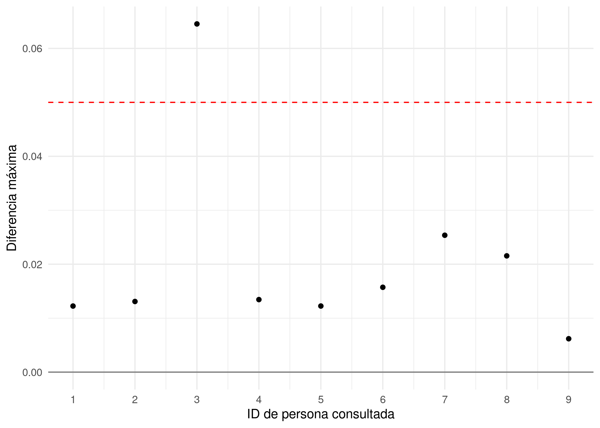

En este caso, la persona consultada número 3 parece haber aportado
respuestas inconsistentes, por lo que este primer resultado, a priori,
nos anima a revisar a fondo la consistencia de la matriz de comparación.
A tal efecto, existen métricas específicas y mucho más robustas que el
método de las diferencias mostrado arriba, para evaluar la consistencia
de la matriz de comparación, como es por ejemplo la ratio o razón de
consistencia $CR$, analizada en la próxima sección.

### Medición y representación de la consistencia de las respuestas

La métrica convencional para evaluar la consistencia de las respuestas
aportadas por las personas consultadas es la razón de consistencia, la
cual viene dada por la fórmula siguiente:

$$CR = \bigg(\frac{\lambda_{max}-n}{n-1}\bigg)\bigg(\frac{1}{RI}\bigg)$$

donde $CR$ es la razón de consistencia, $\lambda_{max}$ es el valor
propio más grande del vector de comparación por parejas, $n$ es el
número de atributos, en nuestro caso, $8$, y $RI$ es un índice aleatorio
que puede ser provisto por el usuario a partir de simulaciones, que con
el paquete `ahpsurvey` se puede generar mediante la función `ahp.ri`. El
conjunto de $RI$ a continuación se generó a partir de `ahp.ri` con
500000 simulaciones (ver tabla
<a href="#tab:suprisimuladospaqahpsurvey">16</a>), y están contenidas en
la viñeta principal de la documentación del paquete `ahpsurvey` (Cho
2019):

``` r
ri_sim <- t(data.frame(RI = c(0.0000000, 0.0000000, 0.5251686, 0.8836651, 1.1081014, 1.2492774, 1.3415514, 1.4048466, 1.4507197, 1.4857266, 1.5141022,1.5356638, 1.5545925, 1.5703498, 1.5839958)))
colnames(ri_sim) <- 1:15
ri_sim %>%
  kable(format = 'html', escape = F, booktabs = T, digits = 2,
        caption = 'Índices aleatorios generados por la función ahp.ri con 500000 simulaciones para 1 a 15 atributos') %>%
  kable_styling(bootstrap_options = c("hover", "condensed"), full_width = T)
```

<table class="table table-hover table-condensed" style="margin-left: auto; margin-right: auto;">
<caption>
Table 16: Índices aleatorios generados por la función ahp.ri con 500000
simulaciones para 1 a 15 atributos
</caption>
<thead>
<tr>
<th style="text-align:left;">
</th>
<th style="text-align:right;">
1
</th>
<th style="text-align:right;">
2
</th>
<th style="text-align:right;">
3
</th>
<th style="text-align:right;">
4
</th>
<th style="text-align:right;">
5
</th>
<th style="text-align:right;">
6
</th>
<th style="text-align:right;">
7
</th>
<th style="text-align:right;">
8
</th>
<th style="text-align:right;">
9
</th>
<th style="text-align:right;">
10
</th>
<th style="text-align:right;">
11
</th>
<th style="text-align:right;">
12
</th>
<th style="text-align:right;">
13
</th>
<th style="text-align:right;">
14
</th>
<th style="text-align:right;">
15
</th>
</tr>
</thead>
<tbody>
<tr>
<td style="text-align:left;">
RI
</td>
<td style="text-align:right;">
0
</td>
<td style="text-align:right;">
0
</td>
<td style="text-align:right;">
0.53
</td>
<td style="text-align:right;">
0.88
</td>
<td style="text-align:right;">
1.11
</td>
<td style="text-align:right;">
1.25
</td>
<td style="text-align:right;">
1.34
</td>
<td style="text-align:right;">
1.4
</td>
<td style="text-align:right;">
1.45
</td>
<td style="text-align:right;">
1.49
</td>
<td style="text-align:right;">
1.51
</td>
<td style="text-align:right;">
1.54
</td>
<td style="text-align:right;">
1.55
</td>
<td style="text-align:right;">
1.57
</td>
<td style="text-align:right;">
1.58
</td>
</tr>
</tbody>
</table>

Para fines de impresión, la tabla sólo muestra dos dígitos, pero en el
caso concreto de 8 atributos, el $RI$ a usar sería 1.4048466.
Adicionalmente, comprobamos este resultado por nuestra cuenta. Para ello
usamos la función `ahp.ri` y generamos un $RI$ con 10000 simulaciones
para 8 atributos (argumento `dim` de la referida función), fijando la
aleatorización en el número 99.

``` r
tiempo_10k <- system.time(probandoRI <- ahp.ri(nsims = 10000, dim = 8, seed = 99))
```

El tiempo de cómputo fue relativamente pequeño (\~ 2 segundos) y el
resultado para $RI$ es 1.399982, el cual se aproxima bastante al
generado por Cho (2019) (tabla
<a href="#tab:suprisimuladospaqahpsurvey">16</a>). Si generásemos un
$RI$ con 500000 simulaciones, nos tomaría al menos un minuto y medio en
una PC de altas prestaciones (o varios minutos en una PC común), y el
resultado sería bastante parecido al mostrado por Cho (2019), por lo que
nos parece conveniente usar este último ($RI=1.4048466$).

``` r
RI <- ri_sim[8]
```

Con este índice aleatorio, calculamos la razón de consistencia `CR` de
las respuestas aportadas por cada persona consultada, mediante la
función `ahp.cr` aplicada a la matriz de comparación en parejas. La
tabla <a href="#tab:suprazondeconsistencia">17</a> resume el cómputo de
esta métrica.

``` r
cr <- matriz_ahp %>% ahp.cr(atts = names(variables), ri = RI)
data.frame(`Persona consultada` = seq_along(cr), CR = cr, check.names = F) %>%
  estilo_kable(titulo = 'Razones de consistencia (consistency ratio) por persona consultada',
               cubre_anchura = F) %>% 
  kable_styling(position = 'left') %>% 
  column_spec(column = 1:2, width = "10em")
```

<table class="table table-hover table-condensed table" style="width: auto !important; margin-left: auto; margin-right: auto; ">
<caption>
Table 17: Razones de consistencia (consistency ratio) por persona
consultada
</caption>
<thead>
<tr>
<th style="text-align:right;">
Persona consultada
</th>
<th style="text-align:right;">
CR
</th>
</tr>
</thead>
<tbody>
<tr>
<td style="text-align:right;width: 10em; ">
1
</td>
<td style="text-align:right;width: 10em; ">
0.09
</td>
</tr>
<tr>
<td style="text-align:right;width: 10em; ">
2
</td>
<td style="text-align:right;width: 10em; ">
0.07
</td>
</tr>
<tr>
<td style="text-align:right;width: 10em; ">
3
</td>
<td style="text-align:right;width: 10em; ">
0.47
</td>
</tr>
<tr>
<td style="text-align:right;width: 10em; ">
4
</td>
<td style="text-align:right;width: 10em; ">
0.07
</td>
</tr>
<tr>
<td style="text-align:right;width: 10em; ">
5
</td>
<td style="text-align:right;width: 10em; ">
0.23
</td>
</tr>
<tr>
<td style="text-align:right;width: 10em; ">
6
</td>
<td style="text-align:right;width: 10em; ">
0.15
</td>
</tr>
<tr>
<td style="text-align:right;width: 10em; ">
7
</td>
<td style="text-align:right;width: 10em; ">
0.17
</td>
</tr>
<tr>
<td style="text-align:right;width: 10em; ">
8
</td>
<td style="text-align:right;width: 10em; ">
0.60
</td>
</tr>
<tr>
<td style="text-align:right;width: 10em; ">
9
</td>
<td style="text-align:right;width: 10em; ">
0.06
</td>
</tr>
</tbody>
</table>

``` r
umbral_saaty <- 0.1
umbral_alterno <- 0.15
umbral <- ifelse(recod_repartida, umbral_alterno, umbral_saaty)
```

Saaty demostró que cuando el $CR$ es superior a un umbral rígido de 0.1,
la elección se considera inconsistente (Thomas L. Saaty 1977). **En
nuestro caso, elegimos el umbral de 0.1 para** $CR$, por lo que
obtuvimos un total de 4 valoraciones consistentes (personas consultadas
números 1, 2, 4, 9) y 5 inconsistentes (personas números 3, 5, 6, 7, 8)
(comparar con tabla <a href="#tab:suprazondeconsistencia">17</a>).

``` r
table(ifelse(cr <= umbral, 'Consistente', 'Inconsistente')) %>% as.data.frame() %>% 
  setNames(nm = c('Tipo', 'Número de cuestionarios')) %>% 
  estilo_kable(titulo = 'Número de cuestionarios según consistencia',
               cubre_anchura = F) %>% 
  kable_styling(position = 'left') %>% 
  column_spec(column = 1:2, width = "10em")
```

<table class="table table-hover table-condensed table" style="width: auto !important; margin-left: auto; margin-right: auto; ">
<caption>
Table 18: Número de cuestionarios según consistencia
</caption>
<thead>
<tr>
<th style="text-align:left;">
Tipo
</th>
<th style="text-align:right;">
Número de cuestionarios
</th>
</tr>
</thead>
<tbody>
<tr>
<td style="text-align:left;width: 10em; ">
Consistente
</td>
<td style="text-align:right;width: 10em; ">
4
</td>
</tr>
<tr>
<td style="text-align:left;width: 10em; ">
Inconsistente
</td>
<td style="text-align:right;width: 10em; ">
5
</td>
</tr>
</tbody>
</table>

Calculamos también las preferencias o prioridades asignadas por cada
persona consultada, así como la ponderación correspondiente (peso, valor
propio dominante), mediante la función `ahp.indpref`, que proporciona
una relación detallada. La visualización de los diagramas de cajas,
gráficos de violín (que son gráficos de densidad en espejo acompañando
al diagrama de cajas) y los puntos (*jitter*), todos superpuestos,
resulta útil para visualizar la heterogeneidad de las ponderaciones de
cada persona consultada por atributo. Aunque esta este tipo de gráfico
es más conveniente para un número mayor de personas consultadas, la
visualización con nuestros datos es bastante expresiva.

``` r
cr_indicador <- cr %>% 
  data.frame() %>% 
  mutate(`Persona consultada` = seq_along(cr), `CR indicador` = as.factor(ifelse(cr <= umbral, 1, 0))) %>%
  select(`CR indicador`, `Persona consultada`)

matriz_ahp %>% 
  ahp.indpref(names(variables), method = "eigen") %>% 
  mutate(`Persona consultada` = seq_along(cr)) %>%
  left_join(cr_indicador, by = 'Persona consultada') %>%
  gather(-matches('Persona|CR'), key = "var", value = "pref") %>%
  ggplot(aes(x = var, y = pref)) + 
  geom_violin(alpha = 0.6, width = 0.8, color = "transparent", fill = "gray") +
  geom_jitter(alpha = 0.6, height = 0, width = 0.1, aes(color = `CR indicador`)) +
  geom_boxplot(alpha = 0, width = 0.3, color = "#808080") +
  scale_x_discrete("Atributo", labels = stringr::str_wrap(variables[sort(names(variables))], width = 10)) +
  scale_y_continuous("Peso (valor propio dominante)", 
                     labels = scales::percent, 
                     breaks = c(seq(0,0.7,0.1))) +
  guides(color=guide_legend(title=NULL)) +
  scale_color_discrete(breaks = c(0,1),
                       type = c("#F8766D", "#00BA38"),
                       labels = c(paste("CR >", umbral), 
                                  paste("CR <", umbral))) +
  labs(NULL, caption = paste("n =", nrow(tabla_col_renom), ",", "CR promedio =",
                           round(mean(cr),3))) +
  theme_minimal() +
  theme(legend.position = 'bottom', axis.text.x = element_text(size = 7))
```

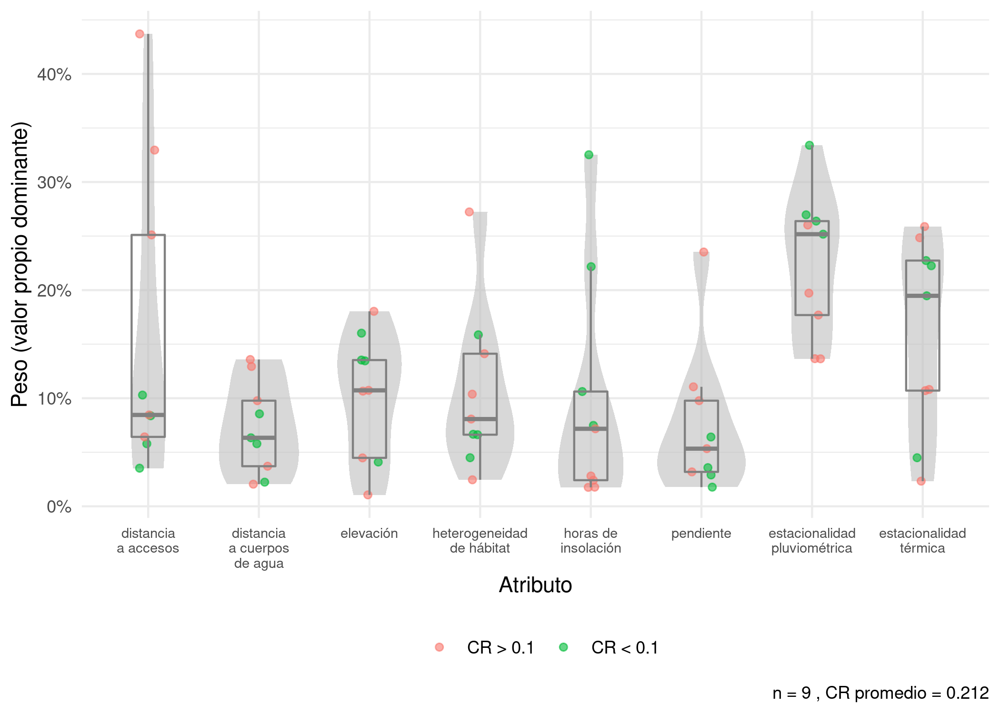

La figura
<a href="#fig:supatributopesocrboxplot"><strong>??</strong></a> resume
las preferencias asignadas por las personas consultadas, con indicación
de la consistencia de las mismas. Las dos estacionalidades, térmica y
pluviométrica, así como las horas de insolación debidas a terreno y la
elevación, reúnen la mayor parte de las preferencias de respuestas
consistentes (puntos verdes); nótese que se han incluido las
preferencias de respuestas inconsistentes también (puntos rojos). Por
otra parte, los atributos que reciben menor ponderación son distancias a
accesos y a cuerpos de agua, heterogeneidad de hábitat y pendiente.

Repitiendo el gráfico de preferencias individuales por atributo y ratio
de consistencia, pero usando sólo las respuestas consistentes, obtenemos
un claro patrón de preferencia por las dos estacionalidades, las horas
de insolación y la elevación.

``` r
matriz_ahp[cr_indicador[,1]==1] %>% 
  ahp.indpref(names(variables), method = "eigen") %>% 
  mutate(`Persona consultada` = cr_indicador[cr_indicador[,1]==1, 'Persona consultada']) %>%
  inner_join(cr_indicador[cr_indicador[,1]==1,], by = 'Persona consultada') %>%
  gather(-matches('Persona|CR'), key = "var", value = "pref") %>%
  ggplot(aes(x = var, y = pref)) + 
  geom_violin(alpha = 0.6, width = 0.8, color = "transparent", fill = "gray") +
  geom_jitter(alpha = 0.6, height = 0, width = 0.1, color = "#00BA38") +
  geom_boxplot(alpha = 0, width = 0.3, color = "#808080") +
  scale_x_discrete("Atributo", labels = stringr::str_wrap(variables[sort(names(variables))], width = 10)) +
  scale_y_continuous("Peso (valor propio dominante)", 
                     labels = scales::percent, 
                     breaks = c(seq(0,0.7,0.1))) +
  guides(color=guide_legend(title=NULL)) +
  labs(NULL, caption = paste("n =", nrow(cr_indicador[cr_indicador[,1]==1,]),
                             ",", "CR promedio =",
                           round(mean(cr[cr_indicador[,1]==1]),3))) +
  theme_minimal() +
  theme(legend.position = 'bottom', axis.text.x = element_text(size = 7))
```


### Flujo de procesamiento completo AHP sin diagnósticos intermedios

El flujo de procesamiento completo retorna la matriz de pesos de acuerdo
con el umbral de consistencia elegido, que en nuestro caso es 0.1. De
esta manera, generamos una matriz de pesos sólo con las respuestas
consistentes. Verificamos igualmente que la suma de los pesos sea igual
a 1.

``` r
flujo_completo_ahp <- ahp(df = tabla_col_renom[, col_ord], 
                          atts = names(variables), 
                          negconvert = TRUE, 
                          reciprocal = TRUE,
                          method = 'arithmetic', 
                          aggmethod = "arithmetic", 
                          qt = 0.2,
                          censorcr = umbral,
                          agg = TRUE)
```

    ## [1] "Number of observations censored = 5"

``` r
# sum(flujo_completo_ahp$aggpref[,1]) == 1
```

### Obtención, reducción y reclasificación de fuentes cartográficas

Utilizamos múltiples fuentes cartográficas ráster como variables de
territorio para modelizar la idoneidad de sitios candidatos para la
instalación de estaciones meteoclimáticas. Originalmente, disponíamos de
más de 100 fuentes ráster para realizar nuestros análisis, pero elegimos
sólo ocho de ellas por considerarlas relevantes siguiendo
recomendaciones de estudios previos (Rojas Briceño et al. 2021). Estas
ocho variables fueron ponderadas por el personal experto mediante el
proceso descrito anteriormente.

Las fuentes ráster son servidas bajo distintas resoluciones y sistemas
de referencia, por lo que fue necesario aplicar algoritmos de reducción
y consolidar resultados en una geometría común. Para ello, redujimos
todas las fuentes ráster al índice geoespacial de hexágonos H3 (*hex
bins*) (Martínez-Batlle 2022). Probamos distintas resoluciones de dicho
índice, y tras algunas pruebas, elegimos la resolución “7”. Con esta
resolución, cubrimos el territorio dominicano más un área de influencia
con aproximadamente 13,000 hexágonos de ca. 4$km^2$ cada uno. Dentro de
cada hexágono, por medio de estadística zonal, obtuvimos la media de
cada variable, la cual utilizamos como estadístico de referencia en la
reclasificación descrita a continuación.

Reclasificamos los valores promedio de las ocho variables seleccionadas,
aplicando criterios sugeridos por otros autores, así como adaptando
umbrales convencionales a la realidad insular (FAO, n.d.; Rojas Briceño
et al. 2021). Para facilitar esta tarea, y garantizar reproducibilidad y
consistencia, creamos funciones que realizaron la reclasificación de
forma semitautomática. Los umbrales elegidos para definir las
puntuaciones de criterios, están recogidos en la tabla (ver tabla
<a href="#tab:umbralesapuntuaciones">19</a>).

``` r
puntuaciones_umbrales <- readODS::read_ods('fuentes/umbrales-criterios-ahp/puntuaciones.ods', sheet = 1)
puntuaciones_umbrales %>% kable(format = 'html', escape = F, booktabs = T, digits = 2,
        caption = 'Puntuaciones de criterios para la selección de sitios de estaciones meteoclimáticas') %>%
  kable_styling(bootstrap_options = c("hover", "condensed"), full_width = T)
```

<table class="table table-hover table-condensed" style="margin-left: auto; margin-right: auto;">
<caption>
Table 19: Puntuaciones de criterios para la selección de sitios de
estaciones meteoclimáticas
</caption>
<thead>
<tr>
<th style="text-align:left;">
Etiquetas
</th>
<th style="text-align:left;">
altamente idóneo
</th>
<th style="text-align:left;">
moderadamente idóneo
</th>
<th style="text-align:left;">
marginalmente idóneo
</th>
<th style="text-align:left;">
no idóneo
</th>
</tr>
</thead>
<tbody>
<tr>
<td style="text-align:left;">
Escala ordinal
</td>
<td style="text-align:left;">
4
</td>
<td style="text-align:left;">
3
</td>
<td style="text-align:left;">
2
</td>
<td style="text-align:left;">
1
</td>
</tr>
<tr>
<td style="text-align:left;">
Distancia a accesos (m) \[OSM-DIST\]
</td>
<td style="text-align:left;">
(50,300\]
</td>
<td style="text-align:left;">
(300,500\]
</td>
<td style="text-align:left;">
(500,5e+03\]
</td>
<td style="text-align:left;">
\[12.8,50\] (5e+03,3.28e+04\]
</td>
</tr>
<tr>
<td style="text-align:left;">
Estacionalidad térmica (°C/100x0.1)
</td>
<td style="text-align:left;">
(1.5e+03,1.66e+03\]
</td>
<td style="text-align:left;">
(1.3e+03,1.5e+03\]
</td>
<td style="text-align:left;">
(1.1e+03,1.3e+03\]
</td>
<td style="text-align:left;">
\[854,1.1e+03\]
</td>
</tr>
<tr>
<td style="text-align:left;">
Estacionalidad pluviométrica (kg x m-2 x 0.1)
</td>
<td style="text-align:left;">
(500,622\]
</td>
<td style="text-align:left;">
(400,500\]
</td>
<td style="text-align:left;">
(300,400\]
</td>
<td style="text-align:left;">
\[222,300\]
</td>
</tr>
<tr>
<td style="text-align:left;">
Heterogeneidad de hábitat (coef. variación)
</td>
<td style="text-align:left;">
\[0,250\]
</td>
<td style="text-align:left;">
(250,500\]
</td>
<td style="text-align:left;">
(500,1.5e+03\]
</td>
<td style="text-align:left;">
(1.5e+03,3.56e+03\]
</td>
</tr>
<tr>
<td style="text-align:left;">
Distancia a cuerpos de agua (km)
</td>
<td style="text-align:left;">
(3e+03,2.64e+04\]
</td>
<td style="text-align:left;">
(2e+03,3e+03\]
</td>
<td style="text-align:left;">
(1e+03,2e+03\]
</td>
<td style="text-align:left;">
\[0,1e+03\]
</td>
</tr>
<tr>
<td style="text-align:left;">
Pendiente (°)
</td>
<td style="text-align:left;">
\[0,3\]
</td>
<td style="text-align:left;">
(3,9\]
</td>
<td style="text-align:left;">
(9,15\]
</td>
<td style="text-align:left;">
(15,32.7\]
</td>
</tr>
<tr>
<td style="text-align:left;">
Horas de insolación (horas/año)
</td>
<td style="text-align:left;">
(4.3e+03,4.48e+03\]
</td>
<td style="text-align:left;">
(4.1e+03,4.3e+03\]
</td>
<td style="text-align:left;">
(3.9e+03,4.1e+03\]
</td>
<td style="text-align:left;">
\[3.18e+03,3.9e+03\]
</td>
</tr>
<tr>
<td style="text-align:left;">
Elevación (metros snm)
</td>
<td style="text-align:left;">
(800,2.79e+03\]
</td>
<td style="text-align:left;">
(400,800\]
</td>
<td style="text-align:left;">
(200,400\]
</td>
<td style="text-align:left;">
\[-42,200\]
</td>
</tr>
</tbody>
</table>

### Modelización de la idoneidad según pesos

### Evaluación de autocorrelación y proximidad

TODO

## Referencias

<div id="refs" class="references csl-bib-body hanging-indent">

<div id="ref-breaz2017" class="csl-entry">

Breaz, Radu Eugen, Octavian Bologa, and Sever Gabriel Racz. 2017.
“Selecting Industrial Robots for Milling Applications Using AHP.”
*Procedia Computer Science* 122: 346–53.
<https://doi.org/10.1016/j.procs.2017.11.379>.

</div>

<div id="ref-cho2019ahpsurvey" class="csl-entry">

Cho, Frankie. 2019. *Ahpsurvey: Analytic Hierarchy Process for Survey
Data*. <https://CRAN.R-project.org/package=ahpsurvey>.

</div>

<div id="ref-darko2019" class="csl-entry">

Darko, Amos, Albert Ping Chuen Chan, Ernest Effah Ameyaw, Emmanuel
Kingsford Owusu, Erika Pärn, and David John Edwards. 2019. “Review of
Application of Analytic Hierarchy Process (AHP) in Construction.”
*International Journal of Construction Management* 19 (5): 436–52.
<https://doi.org/10.1080/15623599.2018.1452098>.

</div>

<div id="ref-fao32agriculture" class="csl-entry">

FAO, Food. n.d. “Agriculture Organization of the United Nations, 1976. A
Framework for Land Evaluation.” *Soils Bulletin* 32.

</div>

<div id="ref-jose_ramon_martinez_batlle_2022_7367180" class="csl-entry">

Martínez-Batlle, José Ramón. 2022. *<span
class="nocase">geofis/zonal-statistics: Let there be environmental
variables</span>* (version v0.0.0.9000). Zenodo.
<https://doi.org/10.5281/zenodo.7367256>.

</div>

<div id="ref-podvezko2009" class="csl-entry">

Podvezko, Valentinas. 2009. “Application of AHP Technique.” *Journal of
Business Economics and Management* 10 (2): 181–89.
<https://doi.org/10.3846/1611-1699.2009.10.181-189>.

</div>

<div id="ref-rcoreteam2021r" class="csl-entry">

R Core Team. 2021. *R: A Language and Environment for Statistical
Computing*. Vienna, Austria: R Foundation for Statistical Computing.
<https://www.R-project.org/>.

</div>

<div id="ref-rojasbriceno2021" class="csl-entry">

Rojas Briceño, Nilton B., Rolando Salas López, Jhonsy O. Silva López,
Manuel Oliva-Cruz, Darwin Gómez Fernández, Renzo E. Terrones Murga,
Daniel Iliquín Trigoso, Miguel Barrena Gurbillón, and Elgar Barboza.
2021. “Site Selection for a Network of Weather Stations Using AHP and
Near Analysis in a GIS Environment in Amazonas, NW Peru.” *Climate* 9
(12): 169. <https://doi.org/10.3390/cli9120169>.

</div>

<div id="ref-saaty1977" class="csl-entry">

Saaty, Thomas L. 1977. “A Scaling Method for Priorities in Hierarchical
Structures.” *Journal of Mathematical Psychology* 15 (3): 234–81.
<https://doi.org/10.1016/0022-2496(77)90033-5>.

</div>

<div id="ref-saaty2001" class="csl-entry">

Saaty, Thomas L. 2001. “Fundamentals of the Analytic Hierarchy Process.”
In, edited by Daniel L. Schmoldt, Jyrki Kangas, Guillermo A. Mendoza,
and Mauno Pesonen, 3:15–35. Dordrecht: Springer Netherlands.
<http://link.springer.com/10.1007/978-94-015-9799-9_2>.

</div>

<div id="ref-saaty2013" class="csl-entry">

———. 2013. “The Modern Science of Multicriteria Decision Making and Its
Practical Applications: The AHP/ANP Approach.” *Operations Research* 61
(5): 1101–18. <https://doi.org/10.1287/opre.2013.1197>.

</div>

<div id="ref-saaty2007" class="csl-entry">

Saaty, Thomas L., and Liem T. Tran. 2007. “On the Invalidity of
Fuzzifying Numerical Judgments in the Analytic Hierarchy Process.”
*Mathematical and Computer Modelling* 46 (7-8): 962–75.
<https://doi.org/10.1016/j.mcm.2007.03.022>.

</div>

<div id="ref-subramanian2012" class="csl-entry">

Subramanian, Nachiappan, and Ramakrishnan Ramanathan. 2012. “A Review of
Applications of Analytic Hierarchy Process in Operations Management.”
*International Journal of Production Economics* 138 (2): 215–41.
<https://doi.org/10.1016/j.ijpe.2012.03.036>.

</div>

<div id="ref-whicham2019welcome" class="csl-entry">

Wickham, Hadley, Mara Averick, Jennifer Bryan, Winston Chang, Lucy
D’Agostino McGowan, Romain François, Garrett Grolemund, et al. 2019.
“Welcome to the <span class="nocase">tidyverse</span>.” *Journal of Open
Source Software* 4 (43): 1686. <https://doi.org/10.21105/joss.01686>.

</div>

</div>
