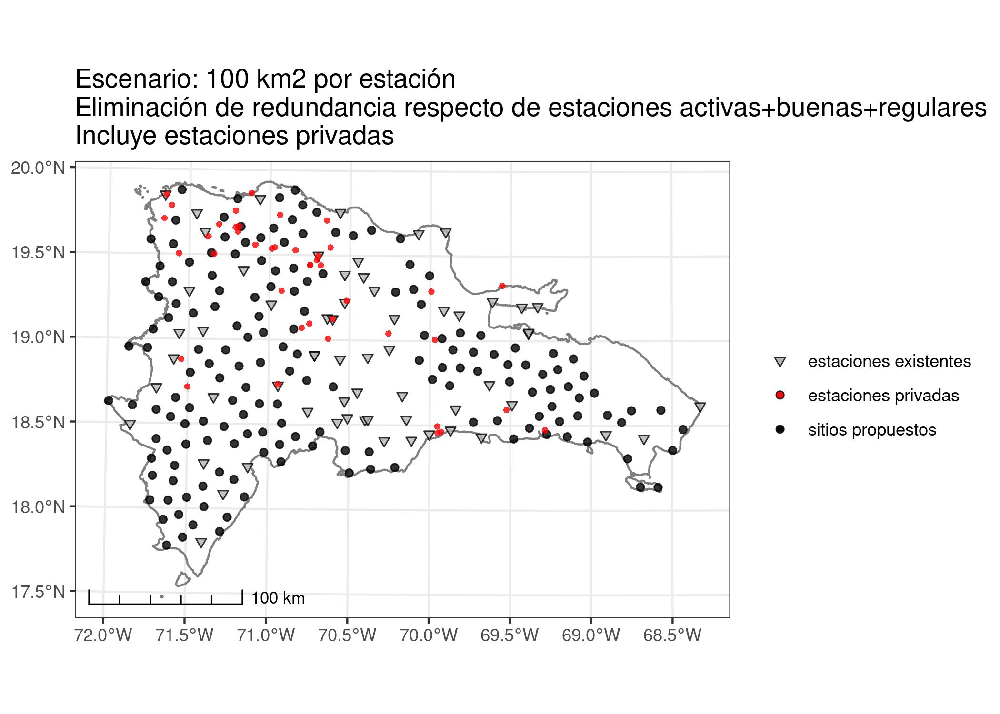
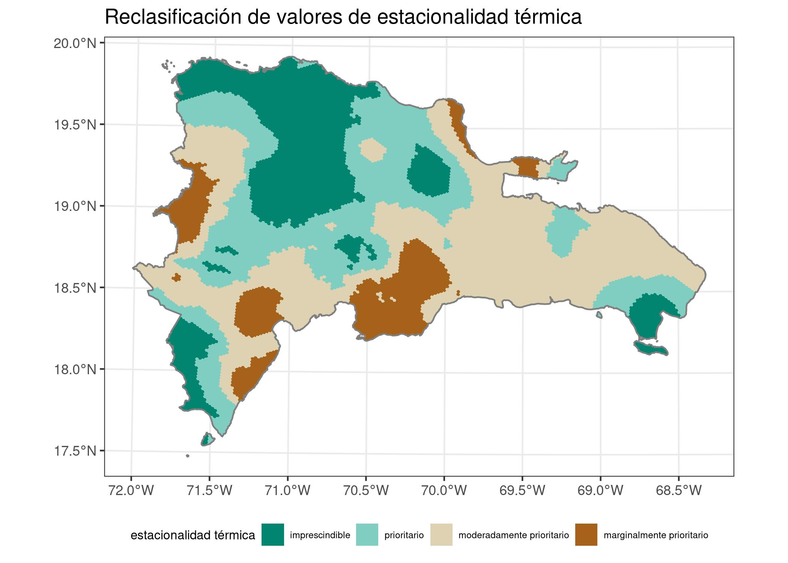
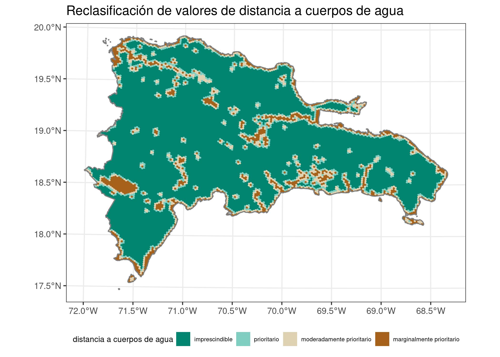
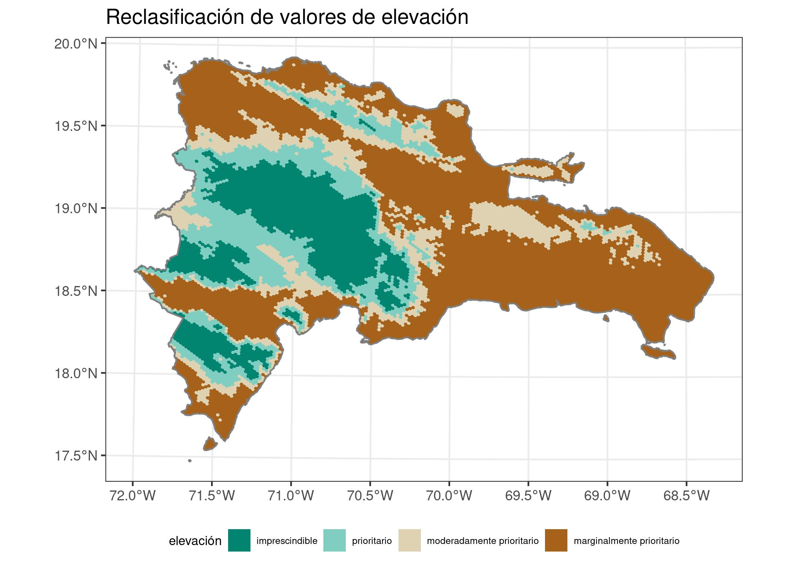
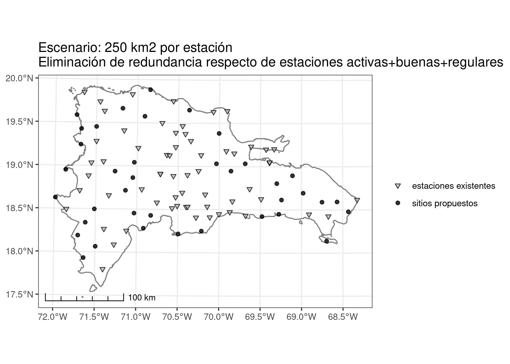
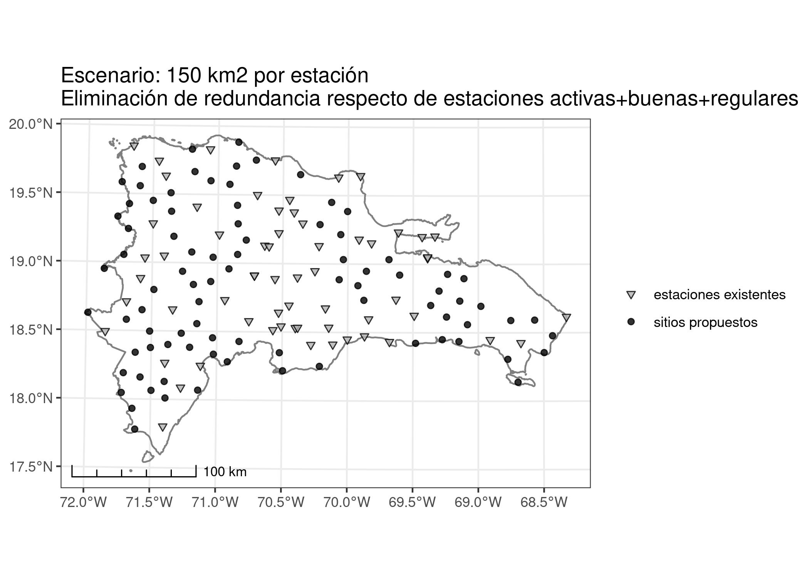

Selección de sitios para el establecimiento de una red de estaciones
meteoclimáticas en República Dominicana usando decisión multicriterio
================
José Martínez<br>Michela Izzo

Versión HTML (más legible e interactiva),
[aquí](https://geofis.github.io/datos-meteoclimaticos-escenarios-cc/seleccion-sitios-red-de-estaciones.html)

## Introducción

Las estaciones meteorológicas y climáticas (EMC) son imprescindibles
para la recopilación de datos precisos y actualizados sobre el clima y
el tiempo atmosférico en una determinada región. Las aplicaciones de los
datos recogidos por las EMC trascienden el ámbito de la meteorología y
la climatología, pues su uso es bastante extendido en áreas de la
ingeniería, la producción agraria, el urbanismo, la geografía, entre
otros campos (World Meteorological Organization (WMO) and The
International Association of Hydrological Sciences 1976; Marchi et al.
2019; Wilgen et al. 2016; Chung, Abdel-Aty, and Lee 2018). Los datos
proporcionados por estas estaciones ayudan a prever fenómenos
meteorológicos extremos, como tormentas tropicales, huracanes, tornados
y sequías, lo que permite a la población prepararse para responder
adecuadamente. Asimismo, con estos datos se realizan múltiples estudios
científicos sobre el clima y el cambio climático, lo que ayuda a
comprender mejor la dinámica de la atmósfera y sus efectos sobre el
planeta, contribuyendo en última instancia a informar y mejorar las
estrategias de planificación (World Meteorological Organization (WMO)
1996, 2017a, 2017b).

Una buena red de EMC es esencial para la toma de decisiones informadas
en una variedad de campos, y es fundamental para el bienestar y la
seguridad de las comunidades y del medio ambiente en general. En
general, planificar una red adecuada de EMC es fundamental para la
gestión del territorio. Estudios previos, incluyendo algunos realizados
en la República Dominicana, indican que faltan EMC en áreas importantes,
y que la distribución espacial de la red no es homogénea, lo cual
probablemente afecta la precisión del dato recogido (Theochari et al.
2021; Rojas Briceño et al. 2021; Frei 2003; Programa Mundial de
Alimentos (PMA) 2019).

Varios países han evaluado el diseño de su red de estaciones, algunos
incluso en múltiples ocasiones, y han propuesto mejoras que en muchos
casos han implementado satisfactoriamente (Frei 2003). En algunos casos,
disponen de protocolos para la selección de sitios, los cuales
comúnmente han armonizado con estándares generales de la OMM, o amplían
estos últimos para adaptarlos a las particularidades de su territorio y
a los usos previstos (Rojas Briceño et al. 2021; Theochari et al. 2021).

La República Dominicana es altamente vulnerable a los impactos del
cambio climático, por lo que una red de EMC insuficiente exacerba esta
vulnerabilidad (Le 2019; Lohmann 2016; Izzo et al. 2010; Roson 2013;
Lenderking, Robinson, and Carlson 2020; Mackay and Spencer 2017). Es
necesario mejorar y expandir la red de estaciones meteorológicas, para
lo cual se requiere inversión en tecnología e infraestructura, así como
alianzas entre agencias gubernamentales, entidades privadas e
instituciones de investigación (Programa Mundial de Alimentos (PMA)
2019). Sin embargo, para realizar inversiones que optimicen al máximo
los escasos recursos disponibles, se requiere diseñar, evaluar y
seleccionar alternativas de redes de EMC utilizando criterios
ponderados.

Varias investigaciones consultadas, concernientes al diseño de redes de
estaciones climáticas, meteorológicas e hidrometeorológicas, coinciden
en señalar que la metodología idónea para el diseño de redes de
estaciones puede realizarse mediante una análisis multicriterio (del
inglés *multi-criteria decision analysis*, MCDA), específicamente, la
técnica de toma de decisiones basadas en múltiples criterio (MCDM,
siglas de *multi-criteria decision-making*) (Thiriez and Zionts 1975;
Köksalan, Wallenius, and Zionts 2011; Taherdoost and Madanchian 2023).
La aplicación de esta familia de métodos en el ámbito de la
planificación física y/o territorial, se apoya en la colecta y análisis
de atributos de terreno integrados por grandes volúmenes de datos
geoespaciales y, al mismo tiempo, incluyendo criterios específicos del
público meta también espacializados en el territorio, empleando para
ello sistemas de información geográfica (SIG) (Rojas Briceño et al.
2021; Theochari et al. 2021; Tekleyohannes et al. 2021; Chakhar and
Mousseau 2008; Malczewski 2004; Eastman, Jiang, and Toledano 1998).
Varias investigaciones han mostrado el buen rendimiento que aportan
determinadas técnicas geoestadísticas tradicionales (Ali and Othman
2018; Valipour, Ghorbani, and Asadi 2019), así como algoritmos
contemporáneos de *deep learning* en combinación con técnicas
tradicionales (Safavi, Siuki, and Hashemi 2021), o incluso la entropía
(Bertini et al. 2021). No obstante, las técnicas que combinan datos
geoespaciales (e.g. de SIG y teledetección) con análisis multicriterio
(MCA), en donde se ponderan de manera relativa los criterios
geográficos, son herramientas fundamentales en la toma de decisiones,
pues realizan de forma eficiente el análisis de variables muy diversas
(Rojas Briceño et al. 2021).

El denominado “proceso analítico jerárquico”, mejor conocido como AHP
(*analytic hierarchy process*), es un método de selección de
alternativas multicriterio que se fundamenta en la teoría general de los
MCA, así como en la base de conocimientos de la jerarquía analítica. Es
bien conocido por su facilidad de uso, y porque ayuda a comprender mejor
los atributos analizados (Rojas Briceño et al. 2021). Fue desarrollado
por Thomas Saaty en la década de 1970 (Thomas L. Saaty 1977), con varias
revisiones posteriores (Thomas L. Saaty 2001; Thomas L. Saaty and Tran
2007), y se utiliza para tomar decisiones cuando se deben considerar
múltiples criterios y alternativas. Tradicionalmente, el método AHP se
ha utilizado en investigaciones del ámbito de las ingenierías, ciencias
sociales, económicas y empresariales, e igualmente en la toma de
decisiones donde intervienen datos geoespaciales (Thomas L. Saaty 2013;
Darko et al. 2019; Podvezko 2009; Subramanian and Ramanathan 2012;
Breaz, Bologa, and Racz 2017). Recientemente, fue usado de forma
eficiente en la selección de sitios idóneos para la instalación de
estaciones meteoclimáticas en Perú (Rojas Briceño et al. 2021).

El método AHP consiste en descomponer un problema complejo en una
estructura jerárquica de criterios y subcriterios, para luego comparar
distintas alternativas en función de cada uno de dichos criterios. El
proceso se realiza en varias etapas, que incluyen, identificar los
objetivos y criterios relevantes para el problema, crear una estructura
jerárquica de los criterios y subcriterios, comparar los criterios y
subcriterios mediante una matriz de comparación en parejas (paso clave),
calcular los valores de prioridad de cada criterio (paso clave),
comparar las alternativas, calcular los valores de prioridad de cada
alternativa en función de cada criterio y, finalmente, calcular los
valores totales de prioridad de cada alternativa.

El método AHP es ampliamente utilizado en la toma de decisiones y en la
planificación estratégica, ya que permite elegir entre varias opciones
considerando valoraciones de criterios, y porque tiene en cuenta la
importancia relativa de los criterios elegidos. Esta importancia
relativa se asigna, normalmente, por medio de consultas hechas a
personas con experiencia en el área de conocimiento donde se enmarque el
problema en cuestión.

En este estudio, aplicamos AHP para seleccionar sitios idóneos donde
instalar estaciones meteoclimáticas en República Dominicana,
garantizando la eficiencia de la red, maximizando recursos y evitando
redundancia información. Para ello, nos apoyamos tanto en fuentes de
información geoespacial sistemáticamente producidas, como en consultas a
personas con experiencia en temas climáticos y meteorológicos.

## Materiales y método

Aplicamos una secuencia de tres técnicas interdependientes para formular
distintas alternativas de redes de observación meteoclimática,
centrándonos en la selección multicriterio de sitios idóneos. En primer
lugar, aplicamos un **proceso analítico jerárquico (AHP)** para
seleccionar la mejor opción entre diferentes alternativas, utilizando
criterios de selección ponderados por personas consultadas con
conocimiento del problema (Thomas L. Saaty 2013). Los criterios
seleccionados fueron *distancia a accesos, estacionalidad térmica,
estacionalidad pluviométrica, heterogeneidad de hábitat, distancia a
cuerpos de agua, pendiente, horas de insolación, elevación*. Elegimos
estos ocho criterios por considerarlos relevantes según nuestro propio
conocimiento de la problemática, así como apoyándonos en estudios
previos y recomendaciones de la Organización Meteorológica Mundial
(Rojas Briceño et al. 2021; World Meteorological Organization (WMO) and
The International Association of Hydrological Sciences 1976).

Las consultas fueron solicitadas de forma explícita, quienes
respondieron a las preguntas mediante formularios electrónicos. Tras las
consultas, organizamos y recodificamos las respuestas obtenidas y,
posteriormente, evaluamos su consistencia. Posteriormente, seleccionamos
las respuestas consistentes para establecer la ponderación de criterios.
Finalmente, aplicamos la ponderación obtenida a las fuentes de
información geográfica disponibles, que en nuestro caso fueron ca.
[13,000 hexágonos conteniendo la correspondiente información
multicriterio, y repartidos sobre el territorio
dominicano](https://geofis.github.io/zonal-statistics/README.html)
(Martínez-Batlle 2022). De esta ponderación, asignamos una categoría
agregada a cada hexágono que podía ser una de las siguientes cuatro:
marginalmente idóneo, moderadamente idóneo, idóneo y altamente idóneo.

Tanto el diseño de los formularios, como el procesamiento de respuestas
y la ponderación de criterios, los realizamos empleando lenguajes de
programación. Para diseñar los formularios, empleamos paquetes y
funciones de Python, mientras que para los análisis nos auxiliamos del
paquete `ahpsurvey` y otros del entorno de programación estadística R,
diseñado para tales fines (Cho 2019; R Core Team 2021; Wickham et al.
2019). Describimos el procedimiento detalladamente en la sección
[Información suplementaria](#infosupl).

Posteriormente, usamos los resultados obtenidos del AHP como entrada de
un procesamiento posterior, en el que realizamos una simple **exclusión
por factores limitantes**. Específicamente, eliminamos los hexágonos
que, por su localización respecto de accesos y cuerpos de agua,
constituían áreas no idóneas para el establecimiento de EMC.

Finalmente, al resultado del procedimiento anterior, le aplicamos un
**análisis de vecindad entre estaciones (existentes y propuestas)**, con
el objetivo de garantizar homogeneidad espacial y evitar redundancia.
Primero lanzamos nubes puntos sobre distintas categorías de idoneidad
(e.g. “altamente idóneo”) usando funciones programadas en R, con lo cual
garantizamos el cumplimiento de criterios de densidad de estaciones
sugeridos por la Organización Meteorológica Mundial (World
Meteorological Organization (WMO) and The International Association of
Hydrological Sciences 1976; World Meteorological Organization (WMO)
2020). Finalmente, usando superficies continuas de distancia
(e.g. rásters), eliminamos estaciones propuestas que estuviesen muy
próximas a estaciones ya establecidas, evitando así proponer nuevas
localidades que, de no eliminarse, aportarían redundancia a la red. Los
detalles metodológicos pueden consultarse en la sección [Información
suplementaria](#infosupl)).

## Resultados

### Proceso analítico jerárquico (AHP) y reclasificación de fuentes cartográficas

De los ocho criterios elegidos a priori para valoración por expertos y
expertas, los cuatro que recibieron la mayor ponderación agregada, en
orden descendente, fueron estacionalidad pluviométrica, horas de
insolación, estacionalidad térmica y elevación. La importancia de cada
criterio, incluyendo su desviación estándar, puede consultarse la tabla
<a href="#tab:preferenciasagregadas">1</a>

``` r
prefagg %>% 
  estilo_kable(titulo = 'Preferencias agregadas',
               cubre_anchura = F) %>% 
  kable_styling(position = 'left') %>% 
  column_spec(column = 1:2, width = "10em")
```

<table class="table table-hover table-condensed table" style="width: auto !important; margin-left: auto; margin-right: auto; ">
<caption>
Table 1: Preferencias agregadas
</caption>
<thead>
<tr>
<th style="text-align:left;">
Variable
</th>
<th style="text-align:right;">
Preferencias agregadas
</th>
<th style="text-align:right;">
Desviación estándar
</th>
</tr>
</thead>
<tbody>
<tr>
<td style="text-align:left;width: 10em; ">
estacionalidad pluviométrica
</td>
<td style="text-align:right;width: 10em; ">
0.27
</td>
<td style="text-align:right;">
0.04
</td>
</tr>
<tr>
<td style="text-align:left;width: 10em; ">
horas de insolación
</td>
<td style="text-align:right;width: 10em; ">
0.18
</td>
<td style="text-align:right;">
0.11
</td>
</tr>
<tr>
<td style="text-align:left;width: 10em; ">
estacionalidad térmica
</td>
<td style="text-align:right;width: 10em; ">
0.17
</td>
<td style="text-align:right;">
0.08
</td>
</tr>
<tr>
<td style="text-align:left;width: 10em; ">
elevación
</td>
<td style="text-align:right;width: 10em; ">
0.12
</td>
<td style="text-align:right;">
0.05
</td>
</tr>
<tr>
<td style="text-align:left;width: 10em; ">
heterogeneidad de hábitat
</td>
<td style="text-align:right;width: 10em; ">
0.09
</td>
<td style="text-align:right;">
0.05
</td>
</tr>
<tr>
<td style="text-align:left;width: 10em; ">
distancia a accesos
</td>
<td style="text-align:right;width: 10em; ">
0.07
</td>
<td style="text-align:right;">
0.03
</td>
</tr>
<tr>
<td style="text-align:left;width: 10em; ">
distancia a cuerpos de agua
</td>
<td style="text-align:right;width: 10em; ">
0.06
</td>
<td style="text-align:right;">
0.03
</td>
</tr>
<tr>
<td style="text-align:left;width: 10em; ">
pendiente
</td>
<td style="text-align:right;width: 10em; ">
0.04
</td>
<td style="text-align:right;">
0.02
</td>
</tr>
</tbody>
</table>

Las puntuaciones reclasificadas de cada criterio mostraron una amplia
variabilidad de la superficie ocupada por cada categoría (ver tabla
<a href="#tab:areasproporcionales">2</a>). De los criterios ponderados
con un alto peso dentro de la valoración AHP, las estacionalidades
pluviométrica y térmica presentaron proporciones relativamente
equilibradas del territorio según las cuatro clases de idoneidad. Por
otra parte, el criterio horas de insolación, mostró una importante
acumulación de áreas idóneas (incluye “idóneas” propiamente y “altamente
idóneas”) para el establecimiento de estaciones. Igualmente, el criterio
elevación resultó predominantemente idóneo y altamente idóneo. Esto se
debió a que los sistemas montañosos dominicanos presentan las menores
densidades de estaciones meteoclimáticas, por lo que se prefirió
impulsar la idoneidad de la topografía elevada para el establecimiento
de EMC.

``` r
areas_proporcionales %>%
  kable(format = 'html', escape = F, booktabs = T, digits = 2,
        caption = 'Áreas proporcionales por cada criterios para la selección de sitios de estaciones meteoclimáticas') %>%
      kable_styling(bootstrap_options = c("hover", "condensed"), full_width = T)
```

<table class="table table-hover table-condensed" style="margin-left: auto; margin-right: auto;">
<caption>
Table 2: Áreas proporcionales por cada criterios para la selección de
sitios de estaciones meteoclimáticas
</caption>
<thead>
<tr>
<th style="text-align:left;">
criterio
</th>
<th style="text-align:right;">
altamente idóneo
</th>
<th style="text-align:right;">
idóneo
</th>
<th style="text-align:right;">
moderadamente idóneo
</th>
<th style="text-align:right;">
marginalmente idóneo
</th>
<th style="text-align:right;">
Total
</th>
</tr>
</thead>
<tbody>
<tr>
<td style="text-align:left;">
distancia a accesos
</td>
<td style="text-align:right;">
11.54
</td>
<td style="text-align:right;">
33.77
</td>
<td style="text-align:right;">
48.85
</td>
<td style="text-align:right;">
5.84
</td>
<td style="text-align:right;">
100
</td>
</tr>
<tr>
<td style="text-align:left;">
estacionalidad térmica
</td>
<td style="text-align:right;">
22.17
</td>
<td style="text-align:right;">
28.11
</td>
<td style="text-align:right;">
38.39
</td>
<td style="text-align:right;">
11.33
</td>
<td style="text-align:right;">
100
</td>
</tr>
<tr>
<td style="text-align:left;">
estacionalidad pluviométrica
</td>
<td style="text-align:right;">
33.90
</td>
<td style="text-align:right;">
22.95
</td>
<td style="text-align:right;">
21.67
</td>
<td style="text-align:right;">
21.47
</td>
<td style="text-align:right;">
100
</td>
</tr>
<tr>
<td style="text-align:left;">
heterogeneidad de hábitat
</td>
<td style="text-align:right;">
19.88
</td>
<td style="text-align:right;">
43.74
</td>
<td style="text-align:right;">
20.16
</td>
<td style="text-align:right;">
16.22
</td>
<td style="text-align:right;">
100
</td>
</tr>
<tr>
<td style="text-align:left;">
distancia a cuerpos de agua
</td>
<td style="text-align:right;">
75.04
</td>
<td style="text-align:right;">
8.04
</td>
<td style="text-align:right;">
8.72
</td>
<td style="text-align:right;">
8.20
</td>
<td style="text-align:right;">
100
</td>
</tr>
<tr>
<td style="text-align:left;">
pendiente
</td>
<td style="text-align:right;">
39.60
</td>
<td style="text-align:right;">
28.86
</td>
<td style="text-align:right;">
16.92
</td>
<td style="text-align:right;">
14.63
</td>
<td style="text-align:right;">
100
</td>
</tr>
<tr>
<td style="text-align:left;">
horas de insolación
</td>
<td style="text-align:right;">
48.23
</td>
<td style="text-align:right;">
25.06
</td>
<td style="text-align:right;">
16.03
</td>
<td style="text-align:right;">
10.68
</td>
<td style="text-align:right;">
100
</td>
</tr>
<tr>
<td style="text-align:left;">
elevación
</td>
<td style="text-align:right;">
17.05
</td>
<td style="text-align:right;">
16.03
</td>
<td style="text-align:right;">
16.53
</td>
<td style="text-align:right;">
50.39
</td>
<td style="text-align:right;">
100
</td>
</tr>
</tbody>
</table>

En términos de distribución espacial, el patrón más común fue el de tipo
concentrado (ver figura
<a href="#fig:mapacriteriospuntuaciones"><strong>??</strong></a>). Todos
los criterios presentaron autocorrelación espacial positiva, lo que
significa que los hexágonos se aglomeran en cúmulos de valores grandes
(“grumos” de hexágonos idóneos, formando *hotspots*) y/o pequeños
(cúmulos de hexágonos marginalmente idóneos, formando *coldspots*).
Destaca, aunque era esperable, la particular la distribución espacial de
la distancia a cuerpos de agua, con un patrón muy homogéneo y monótono
de hexágonos de alta idoneidad.

``` r
all_criteria_mapa
```


Tras sumar los criterios ponderados, obtuvimos la distribución de las
categorías agregadas. En cuanto a superficie representada, predominaron
los intermedios, “moderadamente idóneo” e “idóneo” con un 70% de toda la
superficie estudiada, mientras que las categorías extremas
“marginalmente idóneo” y “altamente idóneo” se repartieron el restante
30% (ver tabla <a href="#tab:areasproporcionalesall">3</a>).

``` r
areas_proporcionales_all_criteria %>% 
    kable(format = 'html', escape = F, booktabs = T, digits = 2,
        caption = 'Áreas proporcionales de categorías agregadas para la selección de sitios de estaciones meteoclimáticas') %>%
      kable_styling(bootstrap_options = c("hover", "condensed"), full_width = T)
```

<table class="table table-hover table-condensed" style="margin-left: auto; margin-right: auto;">
<caption>
Table 3: Áreas proporcionales de categorías agregadas para la selección
de sitios de estaciones meteoclimáticas
</caption>
<thead>
<tr>
<th style="text-align:left;">
Categoría agregada
</th>
<th style="text-align:right;">
proporción
</th>
</tr>
</thead>
<tbody>
<tr>
<td style="text-align:left;">
marginalmente idóneo
</td>
<td style="text-align:right;">
13.79
</td>
</tr>
<tr>
<td style="text-align:left;">
moderadamente idóneo
</td>
<td style="text-align:right;">
30.81
</td>
</tr>
<tr>
<td style="text-align:left;">
idóneo
</td>
<td style="text-align:right;">
39.62
</td>
</tr>
<tr>
<td style="text-align:left;">
altamente idóneo
</td>
<td style="text-align:right;">
15.77
</td>
</tr>
</tbody>
</table>

Las categorías agregadas se mostraron bien repartidas espacialmente en
el territorio dominicano (ver figura
<a href="#fig:mapacriteriospuntuacionesall"><strong>??</strong></a>). En
particular, la representación espacial sugiere que el método AHP
priorizó aquellas áreas que, por sus atributos, nos interesaba impulsar
en primera instancia. Las áreas con gran estacionalidad, especialmente
las montañas y el borde oriental del país, que al mismo tiempo mostraron
buen rendimiento en cuanto a horas de insolación, resultaron ser las más
idóneas para el establecimiento de nuevas EMC. Por otra parte, los
sectores situados a menor elevación, que al mismo tiempo contaban con
pocas horas de insolación, fuertes pendientes y bajas estacionalidades
térmica y pluviométrica, fueron clasificados como marginalmente idóneos.

``` r
all_criteria_scores_mapa
```


### Exclusión por factores limitantes

Un total de 1508 hexágonos fueron imputados como marginalmente idóneos
por su proximidad a cuerpos de agua, o por encontrarse dentro de áreas
pobladas o muy distantes en términos de accesibilidad. La mayoría se
localizó en los lagos y lagunas interiores y costeras, en áreas próximas
a la costa, en ríos anchos y embalses, y en áreas montañosas
inaccesibles. El mapa de la figura
<a href="#fig:mapacriteriospuntuacionesallexcluded"><strong>??</strong></a>
muestra la nueva distribución de las categorías agregadas (compárese con
el mapa de la figura
<a href="#fig:mapacriteriospuntuacionesall"><strong>??</strong></a>).
Asimismo, la tabla <a href="#tab:areasproporcionalesallexcluded">4</a>)
muestra la nueva distribución de las áreas proporcionales.

``` r
all_criteria_scores_excluded_mapa
```


``` r
areas_proporcionales_all_criteria_excluded %>% 
    kable(format = 'html', escape = F, booktabs = T, digits = 2,
        caption = 'Áreas proporcionales de categorías agregadas para la selección de sitios de estaciones meteoclimáticas con exclusión por factores limitantes') %>%
      kable_styling(bootstrap_options = c("hover", "condensed"), full_width = T)
```

<table class="table table-hover table-condensed" style="margin-left: auto; margin-right: auto;">
<caption>
Table 4: Áreas proporcionales de categorías agregadas para la selección
de sitios de estaciones meteoclimáticas con exclusión por factores
limitantes
</caption>
<thead>
<tr>
<th style="text-align:left;">
Categoría agregada
</th>
<th style="text-align:right;">
proporción
</th>
</tr>
</thead>
<tbody>
<tr>
<td style="text-align:left;">
marginalmente idóneo
</td>
<td style="text-align:right;">
24.08
</td>
</tr>
<tr>
<td style="text-align:left;">
moderadamente idóneo
</td>
<td style="text-align:right;">
26.95
</td>
</tr>
<tr>
<td style="text-align:left;">
idóneo
</td>
<td style="text-align:right;">
34.39
</td>
</tr>
<tr>
<td style="text-align:left;">
altamente idóneo
</td>
<td style="text-align:right;">
14.59
</td>
</tr>
</tbody>
</table>

### Análisis de vecindad entre estaciones (existentes y propuestas)

Con la función de selección de sitios en vecindad, generamos nubes de
puntos para construir tres escenarios de densidad de estaciones de 100,
150 y 250 km<sup>2</sup> por estación, todos enmarcados en los
lineamientos sugeridos por la OMM (World Meteorological Organization
(WMO) and The International Association of Hydrological Sciences 1976;
World Meteorological Organization (WMO) 2020). En los tres casos
utilizamos, como área a cubrir, la compuesta por los hexágonos que
cumplieran con los criterios de “altamente idóneo” o “idóneo”.

A partir de los escenarios generados por la función de selección de
sitios en vecindad, obtuvimos escenarios ideales sin considerar las
estaciones existentes. Para evitar redundancia, eliminamos sitios
sugeridos de nuestra propuesta inicial que ya se encontraran
representados por estaciones de la red existente de INDRHI y/o ONAMET.
Consideramos dos redes existentes distintas: 1) Red compuesta por las
estaciones **activas de ONAMET** y las catalogadas como de **“buenas”
del INDRHI** (red de estaciones “activas+buenas”); 2) Red **similar a la
anterior**, pero incluyendo además las estaciones de **estado “Regular”
del INDRHI**, las cuales sólo requieren de una mínima inversión para
ponerlas en operación nuevamente (red de estaciones
“activas+buenas+regulares”). Por lo tanto, para cada uno de los tres
escenarios de densidad, se eliminó redundancia respecto de dos redes
existentes, lo cual produjo, a su vez, 6 escenarios posibles.

En el primer escenario, cada estación cubre 100 km<sup>2</sup>. Al
eliminar redundancia respecto de la red existente, obtuvimos dos
subescenarios diferenciados para esta densidad. En el primero—evita
redundancia respecto de estaciones activas de ONAMET y buenas de INDRHI—
se recomienda instalar 170 estaciones.

``` r
esc_100_activas_buenas_mapa
```


``` r
esc_100_activas_buenas_df_resumen %>% 
  kable(format = 'html', escape = F, booktabs = T, digits = 2,
        caption = 'Inversión sugerida para el escenario de densidad 100 kilómetros cuadrados por estación, evitando redundancia respecto de estaciones activas de ONAMET y buenas de INDRHI') %>%
  kable_styling(bootstrap_options = c("hover", "condensed"), full_width = T)
```

<table class="table table-hover table-condensed" style="margin-left: auto; margin-right: auto;">
<caption>
Table 5: Inversión sugerida para el escenario de densidad 100 kilómetros
cuadrados por estación, evitando redundancia respecto de estaciones
activas de ONAMET y buenas de INDRHI
</caption>
<thead>
<tr>
<th style="text-align:left;">
Categoría agregada
</th>
<th style="text-align:right;">
n
</th>
<th style="text-align:right;">
Monto (US\$)
</th>
</tr>
</thead>
<tbody>
<tr>
<td style="text-align:left;">
idóneo
</td>
<td style="text-align:right;">
127
</td>
<td style="text-align:right;">
889000
</td>
</tr>
<tr>
<td style="text-align:left;">
altamente idóneo
</td>
<td style="text-align:right;">
43
</td>
<td style="text-align:right;">
1505000
</td>
</tr>
<tr>
<td style="text-align:left;">
Total
</td>
<td style="text-align:right;">
170
</td>
<td style="text-align:right;">
2394000
</td>
</tr>
</tbody>
</table>

En el segundo subescenario, en el cual consideramos la existencia de las
estaciones de estado regular del INDRHI, se recomienda instalar 168.

``` r
esc_100_activas_buenas_regulares_mapa
```


``` r
esc_100_activas_buenas_regulares_df_resumen %>% 
  kable(format = 'html', escape = F, booktabs = T, digits = 2,
        caption = 'Inversión sugerida para el escenario de densidad 100 kilómetros cuadrados por estación, evitando redundancia respecto de estaciones activas de ONAMET, y buenas y regulares de INDRHI') %>%
  kable_styling(bootstrap_options = c("hover", "condensed"), full_width = T)
```

<table class="table table-hover table-condensed" style="margin-left: auto; margin-right: auto;">
<caption>
Table 6: Inversión sugerida para el escenario de densidad 100 kilómetros
cuadrados por estación, evitando redundancia respecto de estaciones
activas de ONAMET, y buenas y regulares de INDRHI
</caption>
<thead>
<tr>
<th style="text-align:left;">
Categoría agregada
</th>
<th style="text-align:right;">
n
</th>
<th style="text-align:right;">
Monto (US\$)
</th>
</tr>
</thead>
<tbody>
<tr>
<td style="text-align:left;">
idóneo
</td>
<td style="text-align:right;">
125
</td>
<td style="text-align:right;">
875000
</td>
</tr>
<tr>
<td style="text-align:left;">
altamente idóneo
</td>
<td style="text-align:right;">
43
</td>
<td style="text-align:right;">
1505000
</td>
</tr>
<tr>
<td style="text-align:left;">
Total
</td>
<td style="text-align:right;">
168
</td>
<td style="text-align:right;">
2380000
</td>
</tr>
</tbody>
</table>

Se recomienda notar que la tabla resumen diferencia los sitios idóneos y
los altamente idóneos. Esto permite a las entidades responsables,
decidir un esquema de intervención según presupuesto disponible,
prioridades y esquema de gobernanza. Así, las entidades dispondrán de la
información de inversión sugerida para cada tipo de área. En particular,
proponemos desplegar estaciones de altas prestaciones en primera
instancia, y especialmente en lugares altamente idóneos; una vez
establecidas éstas, colocar las restantes estaciones (e.g. de
prestaciones normales) en sitios de categoría idónea. En este sentido,
también proponemos que las entidades consideren adquirir opciones de
bajo costo, algunas de las cuales ya son accesibles desde República
Dominicana. Estas tienen la ventaja añadida de que pueden combinarse con
proyectos educativos en centros escolares.

A continuación mostramos los subescenarios correspondientes a la
densidad 150 km<sup>2</sup> por estación. Al igual que en el caso
anterior, evitaremos redundancia utilizando las redes existentes con y
sin las estaciones de estado regular de INDRHI.

Si sólo consideramos las estaciones en estado activas (ONAMET) y bueno
(INDRHI), recomendamos instalar 89 estaciones.

``` r
esc_150_activas_buenas_mapa
```


``` r
esc_150_activas_buenas_df_resumen %>% 
  kable(format = 'html', escape = F, booktabs = T, digits = 2,
        caption = 'Inversión sugerida para el escenario de densidad 150 kilómetros cuadrados por estación, evitando redundancia respecto de estaciones activas de ONAMET y buenas de INDRHI') %>%
  kable_styling(bootstrap_options = c("hover", "condensed"), full_width = T)
```

<table class="table table-hover table-condensed" style="margin-left: auto; margin-right: auto;">
<caption>
Table 7: Inversión sugerida para el escenario de densidad 150 kilómetros
cuadrados por estación, evitando redundancia respecto de estaciones
activas de ONAMET y buenas de INDRHI
</caption>
<thead>
<tr>
<th style="text-align:left;">
Categoría agregada
</th>
<th style="text-align:right;">
n
</th>
<th style="text-align:right;">
Monto (US\$)
</th>
</tr>
</thead>
<tbody>
<tr>
<td style="text-align:left;">
idóneo
</td>
<td style="text-align:right;">
66
</td>
<td style="text-align:right;">
462000
</td>
</tr>
<tr>
<td style="text-align:left;">
altamente idóneo
</td>
<td style="text-align:right;">
23
</td>
<td style="text-align:right;">
805000
</td>
</tr>
<tr>
<td style="text-align:left;">
Total
</td>
<td style="text-align:right;">
89
</td>
<td style="text-align:right;">
1267000
</td>
</tr>
</tbody>
</table>

Si consideramos las estaciones regulares de INDRHI, entonces sería
necesario adquirir e instalar 86 estaciones.

``` r
esc_150_activas_buenas_regulares_mapa
```



``` r
esc_150_activas_buenas_regulares_df_resumen %>% 
  kable(format = 'html', escape = F, booktabs = T, digits = 2,
        caption = 'Inversión sugerida para el escenario de densidad 150 kilómetros cuadrados por estación, evitando redundancia respecto de estaciones activas de ONAMET, y buenas y regulares de INDRHI') %>%
  kable_styling(bootstrap_options = c("hover", "condensed"), full_width = T)
```

<table class="table table-hover table-condensed" style="margin-left: auto; margin-right: auto;">
<caption>
Table 8: Inversión sugerida para el escenario de densidad 150 kilómetros
cuadrados por estación, evitando redundancia respecto de estaciones
activas de ONAMET, y buenas y regulares de INDRHI
</caption>
<thead>
<tr>
<th style="text-align:left;">
Categoría agregada
</th>
<th style="text-align:right;">
n
</th>
<th style="text-align:right;">
Monto (US\$)
</th>
</tr>
</thead>
<tbody>
<tr>
<td style="text-align:left;">
idóneo
</td>
<td style="text-align:right;">
63
</td>
<td style="text-align:right;">
441000
</td>
</tr>
<tr>
<td style="text-align:left;">
altamente idóneo
</td>
<td style="text-align:right;">
23
</td>
<td style="text-align:right;">
805000
</td>
</tr>
<tr>
<td style="text-align:left;">
Total
</td>
<td style="text-align:right;">
86
</td>
<td style="text-align:right;">
1246000
</td>
</tr>
</tbody>
</table>

Finalmente, resumimos a continuación los subescenarios donde cada
estación cubre 250 km<sup>2</sup>. Si consideramos la existencia de las
estaciones activas y buenas de INDHRI, recomendamos instalar 39
estaciones.

``` r
esc_250_activas_buenas_mapa
```


``` r
esc_250_activas_buenas_df_resumen %>% 
  kable(format = 'html', escape = F, booktabs = T, digits = 2,
        caption = 'Inversión sugerida para el escenario de densidad 250 kilómetros cuadrados por estación, evitando redundancia respecto de estaciones activas de ONAMET y buenas de INDRHI') %>%
  kable_styling(bootstrap_options = c("hover", "condensed"), full_width = T)
```

<table class="table table-hover table-condensed" style="margin-left: auto; margin-right: auto;">
<caption>
Table 9: Inversión sugerida para el escenario de densidad 250 kilómetros
cuadrados por estación, evitando redundancia respecto de estaciones
activas de ONAMET y buenas de INDRHI
</caption>
<thead>
<tr>
<th style="text-align:left;">
Categoría agregada
</th>
<th style="text-align:right;">
n
</th>
<th style="text-align:right;">
Monto (US\$)
</th>
</tr>
</thead>
<tbody>
<tr>
<td style="text-align:left;">
idóneo
</td>
<td style="text-align:right;">
30
</td>
<td style="text-align:right;">
210000
</td>
</tr>
<tr>
<td style="text-align:left;">
altamente idóneo
</td>
<td style="text-align:right;">
9
</td>
<td style="text-align:right;">
315000
</td>
</tr>
<tr>
<td style="text-align:left;">
Total
</td>
<td style="text-align:right;">
39
</td>
<td style="text-align:right;">
525000
</td>
</tr>
</tbody>
</table>

Si consideramos las estaciones regulares de INDRHI, entonces sería
necesario adquirir e instalar 38 estaciones.

``` r
esc_250_activas_buenas_regulares_mapa
```


``` r
esc_250_activas_buenas_regulares_df_resumen %>% 
  kable(format = 'html', escape = F, booktabs = T, digits = 2,
        caption = 'Inversión sugerida para el escenario de densidad 250 kilómetros cuadrados por estación, evitando redundancia respecto de estaciones activas de ONAMET, y buenas y regulares de INDRHI') %>%
  kable_styling(bootstrap_options = c("hover", "condensed"), full_width = T)
```

<table class="table table-hover table-condensed" style="margin-left: auto; margin-right: auto;">
<caption>
Table 10: Inversión sugerida para el escenario de densidad 250
kilómetros cuadrados por estación, evitando redundancia respecto de
estaciones activas de ONAMET, y buenas y regulares de INDRHI
</caption>
<thead>
<tr>
<th style="text-align:left;">
Categoría agregada
</th>
<th style="text-align:right;">
n
</th>
<th style="text-align:right;">
Monto (US\$)
</th>
</tr>
</thead>
<tbody>
<tr>
<td style="text-align:left;">
idóneo
</td>
<td style="text-align:right;">
29
</td>
<td style="text-align:right;">
203000
</td>
</tr>
<tr>
<td style="text-align:left;">
altamente idóneo
</td>
<td style="text-align:right;">
9
</td>
<td style="text-align:right;">
315000
</td>
</tr>
<tr>
<td style="text-align:left;">
Total
</td>
<td style="text-align:right;">
38
</td>
<td style="text-align:right;">
518000
</td>
</tr>
</tbody>
</table>

## Discusión

## Información suplementaria

Versión HTML (más legible e interactiva),
[aquí](https://geofis.github.io/datos-meteoclimaticos-escenarios-cc/seleccion-sitios-red-de-estaciones-suplemento-metodologico.html)

## Procedimiento

Aplicamos una secuencia de tres técnicas interdependientes para formular
distintas alternativas de redes de observación meteoclimático. En primer
lugar, aplicamos un **proceso analítico jerárquico (AHP)**.
Posteriormente, los resultados del AHP fueron usados como entrada de una
simple **exclusión por factores limitantes**, específicamente excluir
hexágonos por su localización respecto de accesos y cuerpos de agua.
Finalmente, al resultado del análisis anterior, le aplicamos un
**análisis de vecindad entre estaciones (existentes y propuestas)** con
el objetivo de garantizar que las alternativas fuesen homogéneas en
términos de distribución espacial.

## Aplicación del método AHP

### Paquetes y funciones

``` r
library(raster)
library(psych)
library(kableExtra)
library(tidyverse)
library(ahpsurvey)
library(janitor)
estilo_kable <- function(df, titulo = '', cubre_anchura = T) {
  df %>% kable(format = 'html', escape = F, booktabs = T, digits = 2, caption = titulo) %>%
  kable_styling(bootstrap_options = c("hover", "condensed"), full_width = cubre_anchura)
}
```

### Escalas de valoración y matriz de comparación por parejas

``` r
variables <- c(
    acce = "distancia a accesos",
    temp = "estacionalidad térmica",
    pluv = "estacionalidad pluviométrica",
    habi = "heterogeneidad de hábitat",
    agua = "distancia a cuerpos de agua",
    pend = "pendiente",
    inso = "horas de insolación",
    elev = "elevación"
)
col_ord <- as.vector(sapply(as.data.frame(combn(names(variables), 2)), paste0, collapse = '_'))
```

El método AHP consiste en descomponer un problema complejo en una
estructura jerárquica de criterios y subcriterios, que consisten en
variables o atributos del terreno en nuestro caso, y luego comparar las
alternativas en función de cada uno de estos criterios. Los criterios se
comparan en parejas (o pares, comparación pareada), asignando un valor
numérico a la importancia relativa de cada criterio en relación con los
demás. La evaluación pareada se realiza para cada par único de
variables; así, el número de comparaciones posibles es
$\frac{N(N-1)}{2}$

Originalmente, disponíamos de más de 100 variables espacializadas en el
territorio dominicano para realizar nuestros análisis (Martínez-Batlle
2022), pero elegimos sólo ocho de ellas para ser ponderadas como
criterios de selección por expertos, atendiendo al protocolo establecido
en el método AHP. Los criterios seleccionados fueron *distancia a
accesos, estacionalidad térmica, estacionalidad pluviométrica,
heterogeneidad de hábitat, distancia a cuerpos de agua, pendiente, horas
de insolación, elevación*. Elegimos estos ocho criterios por
considerarlos relevantes según nuestro propio conocimiento de la
problemática, y apoyándonos en estudios previos y recomendaciones de la
Organización Meteorológica Mundial (Rojas Briceño et al. 2021). Dado que
comparamos ocho criterios en parejas, cada experto y experta realizó un
total de $(8\times7)/2=28$ comparaciones.

Para evitar errores de redundancia y garantizar un diseño sistemático y
eficiente, empleamos Formularios de Google al cual titulamos como
[“Formulario de comparación pareada de criterios de identificación de
sitios idóneos para una red de observación
climática”](https://docs.google.com/forms/d/e/1FAIpQLScOx1bxW47LLEPQ_A6lHmSnpOQkUyHEoLJsRIKBNlbfQby5Dw/viewform?usp=sf_link).
Programamos en Python las posibles comparaciones por pares y,
seguidamente, a través de la API del Google Workspace, enviamos el
diseño para su puesta en línea. Un total de nueve personas del área de
climatología, análisis de datos y geografía física, rellenaron el
formulario.

Para procesar los resultados de las consultas y generar una tabla de
preferencias global con la cual construimos los pesos, en primer lugar
generamos una tabla (no confundir con la matriz de comparación por
parejas) donde cada columna es una comparación de dos atributos, por
ejemplo A y B. Dado que la escala de valoración por parejas del método
AHP, en sentido estricto, se apoya en ecuaciones lineales, en el fondo
se utiliza una escala ordinal basada en un gradiente, que en el método
original, usa números enteros 1 al 9. Esto significa que, al asignar
“1”, estamos indicando que los criterios comparados, por ejemplo, A y B,
tienen la misma importancia. Del 2 al 9, el criterio B tiene mayor
importancia, de manera creciente, que el A. Por otra parte, el grado de
importancia de A sobre B se denota por medio de recíprocos
`{1/2 , 1/3, ..., 1/8, 1/9}` y usando un gradiente inverso, es decir, la
fracción más pequeña (`1/9`) indica mayor importancia relativa para el
criterio A. Para denotar las valoraciones complementarias, el paquete
`ahpsurvey` permite usar opuestos `{-2, -3, ..., -8, -9}`, que luego son
recodificados a recíprocos en la matriz de comparación por parejas;
preferiremos esta opción, es decir, usar opuestos, porque nos facilitó
la recodificación con expresiones regulares.

Luego de recoger las valoraciones realizadas por medio de consultas en
una tabla, el siguiente paso consistió en obtener la matriz de
comparación por parejas, que tiene la siguiente forma:

$$ \mathbf{S_k} =\begin{pmatrix}
                      a_{1,1} & a_{1,2} & \cdots & a_{1,N} \\
                      a_{2,1} & a_{2,2} & \cdots & a_{2,N} \\
                      \vdots  & \vdots  & a_{i,j} & \vdots  \\
                      a_{N,1} & a_{N,2} & \cdots & a_{N,N}
                      \end{pmatrix} $$

donde $a_{i,j}$ representa la comparación del atributo $i$ y $j$. Tal
como se ha comentado, si $i$ es más importante que $j$ en 6 unidades,
$a_{i,j} = 6$ y $a_{j,i} = \frac{1}{6}$, es decir, el recíproco. Los
datos de las comparaciones deben organizarse en esta forma matricial
para realizar los análisis subsiguientes.

### Recodificación de valores y de nombres de columnas

En el estudio, utilizamos una escala modificada basada en sólo 7
posibles puntuaciones, recodificamos las puntuaciones de formulario de
la siguiente manera: el valor 0 a 1 (usamos 0 en los formularios para
facilitar la comprensión de la escala a los encuestados); los valores
33%, 66% y 100%, los distribuimos en el rango 2 a 9 de la siguiente
manera:

``` r
valor_formulario <- c('(100)', '(66)', '(33)', '0', '33', '66', '100')
recod_repartida <- FALSE
if(recod_repartida) {
    recodificado_ahp <- round(c(0-(2+3*((9-2)/3)), 0-(2+2*((9-2)/3)), 0-(2+((9-2)/3)),
                              1,
                              2+((9-2)/3), 2+2*((9-2)/3), 2+3*((9-2)/3)
                              ),
                            2)

} else {
  recodificado_ahp <- c(-9, -6, -3,
                        1,
                        3, 6, 9)
}
data.frame(
  `Valor en formulario` = valor_formulario,
  `Recodificado a escala AHP original` = recodificado_ahp,
  check.names = F) %>% 
  kable(format = 'html', escape = F, booktabs = T,
        caption = 'Tabla de recodificación de puntaciones de formulario a escala AHP original') %>%
  kable_styling(bootstrap_options = c("hover", "condensed"), full_width = T)
```

<table class="table table-hover table-condensed" style="margin-left: auto; margin-right: auto;">
<caption>
Table 11: Tabla de recodificación de puntaciones de formulario a escala
AHP original
</caption>
<thead>
<tr>
<th style="text-align:left;">
Valor en formulario
</th>
<th style="text-align:right;">
Recodificado a escala AHP original
</th>
</tr>
</thead>
<tbody>
<tr>
<td style="text-align:left;">

100) </td>
     <td style="text-align:right;">
     -9
     </td>
     </tr>
     <tr>
     <td style="text-align:left;">

     66) </td>
         <td style="text-align:right;">
         -6
         </td>
         </tr>
         <tr>
         <td style="text-align:left;">

         33) </td>
             <td style="text-align:right;">
             -3
             </td>
             </tr>
             <tr>
             <td style="text-align:left;">
             0
             </td>
             <td style="text-align:right;">
             1
             </td>
             </tr>
             <tr>
             <td style="text-align:left;">
             33
             </td>
             <td style="text-align:right;">
             3
             </td>
             </tr>
             <tr>
             <td style="text-align:left;">
             66
             </td>
             <td style="text-align:right;">
             6
             </td>
             </tr>
             <tr>
             <td style="text-align:left;">
             100
             </td>
             <td style="text-align:right;">
             9
             </td>
             </tr>
             </tbody>
             </table>

Por otro lado, creamos un “diccionario” (vector nombrado `variables`) de
equivalencias entre los nombres largos de columnas de la tabla de
resultados (que provienen escritas en el lenguaje natural de los
formularios) y nombres cortos de cuatro caracteres. Este diccionario lo
utilizamos para recodificar los nombres de las columnas de la tabla de
respuestas a nombres cortos, con lo cual mejoramos la legibilidad de las
representaciones gráficas y las impresiones de tablas y matrices de
resultados.

``` r
as.data.frame(variables) %>% 
  rownames_to_column() %>% 
  setNames(nm = c('Código', 'Nombre completo')) %>% 
  kable(format = 'html', escape = F, booktabs = T,
        caption = 'Tabla de equivalencias de nombres de las variables evaluadas') %>%
  kable_styling(bootstrap_options = c("hover", "condensed"), full_width = T)
```

<table class="table table-hover table-condensed" style="margin-left: auto; margin-right: auto;">
<caption>
Table 12: Tabla de equivalencias de nombres de las variables evaluadas
</caption>
<thead>
<tr>
<th style="text-align:left;">
Código
</th>
<th style="text-align:left;">
Nombre completo
</th>
</tr>
</thead>
<tbody>
<tr>
<td style="text-align:left;">
acce
</td>
<td style="text-align:left;">
distancia a accesos
</td>
</tr>
<tr>
<td style="text-align:left;">
temp
</td>
<td style="text-align:left;">
estacionalidad térmica
</td>
</tr>
<tr>
<td style="text-align:left;">
pluv
</td>
<td style="text-align:left;">
estacionalidad pluviométrica
</td>
</tr>
<tr>
<td style="text-align:left;">
habi
</td>
<td style="text-align:left;">
heterogeneidad de hábitat
</td>
</tr>
<tr>
<td style="text-align:left;">
agua
</td>
<td style="text-align:left;">
distancia a cuerpos de agua
</td>
</tr>
<tr>
<td style="text-align:left;">
pend
</td>
<td style="text-align:left;">
pendiente
</td>
</tr>
<tr>
<td style="text-align:left;">
inso
</td>
<td style="text-align:left;">
horas de insolación
</td>
</tr>
<tr>
<td style="text-align:left;">
elev
</td>
<td style="text-align:left;">
elevación
</td>
</tr>
</tbody>
</table>

Con la tabla de equivalencias de puntuaciones y el diccionario de
nombres, recodificamos programáticas las respuestas obtenidas en los
formularios a la escala original del método AHP, así como los nombres de
columnas de la tabla de respuestas de comparación de atributos. En
primer lugar, mostramos cómo realizamos la recodificación de
puntuaciones.

La tabla de resultados de las puntuaciones en bruto (anonimizada),
obtenida a partir del rellenado en Google Forms por parte de 9
consultados, se muestra a continuación.

``` r
tabla_original <- read_csv('fuentes/respuestas-ahp/respuestas.csv')
tabla_en_bruto <- tabla_original[, -grep('Marca|Opcionalmente', colnames(tabla_original))]
tabla_en_bruto %>% 
    kable(format = 'html', escape = F, booktabs = T,
        caption = 'Tabla de resultados en bruto (anonimizada) obtenida a partir del rellenado del "Formulario de comparación pareada de criterios de identificación de sitios idóneos para una red de observación climática"') %>%
  kable_styling(bootstrap_options = c("hover", "condensed"), full_width = T)
```

<table class="table table-hover table-condensed" style="margin-left: auto; margin-right: auto;">
<caption>
Table 13: Tabla de resultados en bruto (anonimizada) obtenida a partir
del rellenado del “Formulario de comparación pareada de criterios de
identificación de sitios idóneos para una red de observación climática”
</caption>
<thead>
<tr>
<th style="text-align:left;">
Valora la importancia relativa de las variables horas de insolación y
elevación
</th>
<th style="text-align:left;">
Valora la importancia relativa de las variables pendiente y elevación
</th>
<th style="text-align:left;">
Valora la importancia relativa de las variables pendiente y horas de
insolación
</th>
<th style="text-align:left;">
Valora la importancia relativa de las variables distancia a cuerpos de
agua y elevación
</th>
<th style="text-align:left;">
Valora la importancia relativa de las variables distancia a cuerpos de
agua y horas de insolación
</th>
<th style="text-align:left;">
Valora la importancia relativa de las variables distancia a cuerpos de
agua y pendiente
</th>
<th style="text-align:left;">
Valora la importancia relativa de las variables heterogeneidad de
hábitat y elevación
</th>
<th style="text-align:left;">
Valora la importancia relativa de las variables heterogeneidad de
hábitat y horas de insolación
</th>
<th style="text-align:left;">
Valora la importancia relativa de las variables heterogeneidad de
hábitat y pendiente
</th>
<th style="text-align:left;">
Valora la importancia relativa de las variables heterogeneidad de
hábitat y distancia a cuerpos de agua
</th>
<th style="text-align:left;">
Valora la importancia relativa de las variables estacionalidad
pluviométrica y elevación
</th>
<th style="text-align:left;">
Valora la importancia relativa de las variables estacionalidad
pluviométrica y horas de insolación
</th>
<th style="text-align:left;">
Valora la importancia relativa de las variables estacionalidad
pluviométrica y pendiente
</th>
<th style="text-align:left;">
Valora la importancia relativa de las variables estacionalidad
pluviométrica y distancia a cuerpos de agua
</th>
<th style="text-align:left;">
Valora la importancia relativa de las variables estacionalidad
pluviométrica y heterogeneidad de hábitat
</th>
<th style="text-align:left;">
Valora la importancia relativa de las variables estacionalidad térmica y
elevación
</th>
<th style="text-align:left;">
Valora la importancia relativa de las variables estacionalidad térmica y
horas de insolación
</th>
<th style="text-align:left;">
Valora la importancia relativa de las variables estacionalidad térmica y
pendiente
</th>
<th style="text-align:left;">
Valora la importancia relativa de las variables estacionalidad térmica y
distancia a cuerpos de agua
</th>
<th style="text-align:left;">
Valora la importancia relativa de las variables estacionalidad térmica y
heterogeneidad de hábitat
</th>
<th style="text-align:left;">
Valora la importancia relativa de las variables estacionalidad térmica y
estacionalidad pluviométrica
</th>
<th style="text-align:left;">
Valora la importancia relativa de las variables distancia a accesos y
elevación
</th>
<th style="text-align:left;">
Valora la importancia relativa de las variables distancia a accesos y
horas de insolación
</th>
<th style="text-align:left;">
Valora la importancia relativa de las variables distancia a accesos y
pendiente
</th>
<th style="text-align:left;">
Valora la importancia relativa de las variables distancia a accesos y
distancia a cuerpos de agua
</th>
<th style="text-align:left;">
Valora la importancia relativa de las variables distancia a accesos y
heterogeneidad de hábitat
</th>
<th style="text-align:left;">
Valora la importancia relativa de las variables distancia a accesos y
estacionalidad pluviométrica
</th>
<th style="text-align:left;">
Valora la importancia relativa de las variables distancia a accesos y
estacionalidad térmica
</th>
</tr>
</thead>
<tbody>
<tr>
<td style="text-align:left;">
33: Importancia moderada para elevación
</td>
<td style="text-align:left;">
100: Importancia máxima para elevación
</td>
<td style="text-align:left;">
100: Importancia máxima para horas de insolación
</td>
<td style="text-align:left;">
66: Importancia fuerte para elevación
</td>
<td style="text-align:left;">
66: Importancia fuerte para horas de insolación
</td>
<td style="text-align:left;">
0: Igual importancia para distancia a cuerpos de agua y pendiente
</td>
<td style="text-align:left;">
0: Igual importancia para heterogeneidad de hábitat y elevación
</td>
<td style="text-align:left;">
(33): Importancia moderada para heterogeneidad de hábitat
</td>
<td style="text-align:left;">
(66): Importancia fuerte para heterogeneidad de hábitat
</td>
<td style="text-align:left;">
(66): Importancia fuerte para heterogeneidad de hábitat
</td>
<td style="text-align:left;">
(66): Importancia fuerte para estacionalidad pluviométrica
</td>
<td style="text-align:left;">
(66): Importancia fuerte para estacionalidad pluviométrica
</td>
<td style="text-align:left;">
(100): Importancia máxima para estacionalidad pluviométrica
</td>
<td style="text-align:left;">
(100): Importancia máxima para estacionalidad pluviométrica
</td>
<td style="text-align:left;">
(33): Importancia moderada para estacionalidad pluviométrica
</td>
<td style="text-align:left;">
0: Igual importancia para estacionalidad térmica y elevación
</td>
<td style="text-align:left;">
(66): Importancia fuerte para estacionalidad térmica
</td>
<td style="text-align:left;">
(100): Importancia máxima para estacionalidad térmica
</td>
<td style="text-align:left;">
(100): Importancia máxima para estacionalidad térmica
</td>
<td style="text-align:left;">
0: Igual importancia para estacionalidad térmica y heterogeneidad de
hábitat
</td>
<td style="text-align:left;">
0: Igual importancia para estacionalidad térmica y estacionalidad
pluviométrica
</td>
<td style="text-align:left;">
33: Importancia moderada para elevación
</td>
<td style="text-align:left;">
33: Importancia moderada para horas de insolación
</td>
<td style="text-align:left;">
(66): Importancia fuerte para distancia a accesos
</td>
<td style="text-align:left;">
0: Igual importancia para distancia a accesos y distancia a cuerpos de
agua
</td>
<td style="text-align:left;">
100: Importancia máxima para heterogeneidad de hábitat
</td>
<td style="text-align:left;">
100: Importancia máxima para estacionalidad pluviométrica
</td>
<td style="text-align:left;">
100: Importancia máxima para estacionalidad térmica
</td>
</tr>
<tr>
<td style="text-align:left;">
33: Importancia moderada para elevación
</td>
<td style="text-align:left;">
33: Importancia moderada para elevación
</td>
<td style="text-align:left;">
66: Importancia fuerte para horas de insolación
</td>
<td style="text-align:left;">
33: Importancia moderada para elevación
</td>
<td style="text-align:left;">
33: Importancia moderada para horas de insolación
</td>
<td style="text-align:left;">
(33): Importancia moderada para distancia a cuerpos de agua
</td>
<td style="text-align:left;">
0: Igual importancia para heterogeneidad de hábitat y elevación
</td>
<td style="text-align:left;">
33: Importancia moderada para horas de insolación
</td>
<td style="text-align:left;">
(33): Importancia moderada para heterogeneidad de hábitat
</td>
<td style="text-align:left;">
0: Igual importancia para heterogeneidad de hábitat y distancia a
cuerpos de agua
</td>
<td style="text-align:left;">
0: Igual importancia para estacionalidad pluviométrica y elevación
</td>
<td style="text-align:left;">
(66): Importancia fuerte para estacionalidad pluviométrica
</td>
<td style="text-align:left;">
(66): Importancia fuerte para estacionalidad pluviométrica
</td>
<td style="text-align:left;">
(33): Importancia moderada para estacionalidad pluviométrica
</td>
<td style="text-align:left;">
(66): Importancia fuerte para estacionalidad pluviométrica
</td>
<td style="text-align:left;">
0: Igual importancia para estacionalidad térmica y elevación
</td>
<td style="text-align:left;">
(33): Importancia moderada para estacionalidad térmica
</td>
<td style="text-align:left;">
(66): Importancia fuerte para estacionalidad térmica
</td>
<td style="text-align:left;">
(33): Importancia moderada para estacionalidad térmica
</td>
<td style="text-align:left;">
(66): Importancia fuerte para estacionalidad térmica
</td>
<td style="text-align:left;">
0: Igual importancia para estacionalidad térmica y estacionalidad
pluviométrica
</td>
<td style="text-align:left;">
0: Igual importancia para distancia a accesos y elevación
</td>
<td style="text-align:left;">
0: Igual importancia para distancia a accesos y horas de insolación
</td>
<td style="text-align:left;">
(33): Importancia moderada para distancia a accesos
</td>
<td style="text-align:left;">
0: Igual importancia para distancia a accesos y distancia a cuerpos de
agua
</td>
<td style="text-align:left;">
0: Igual importancia para distancia a accesos y heterogeneidad de
hábitat
</td>
<td style="text-align:left;">
33: Importancia moderada para estacionalidad pluviométrica
</td>
<td style="text-align:left;">
33: Importancia moderada para estacionalidad térmica
</td>
</tr>
<tr>
<td style="text-align:left;">
(100): Importancia máxima para horas de insolación
</td>
<td style="text-align:left;">
(100): Importancia máxima para pendiente
</td>
<td style="text-align:left;">
(100): Importancia máxima para pendiente
</td>
<td style="text-align:left;">
(33): Importancia moderada para distancia a cuerpos de agua
</td>
<td style="text-align:left;">
(66): Importancia fuerte para distancia a cuerpos de agua
</td>
<td style="text-align:left;">
(66): Importancia fuerte para distancia a cuerpos de agua
</td>
<td style="text-align:left;">
(66): Importancia fuerte para heterogeneidad de hábitat
</td>
<td style="text-align:left;">
(100): Importancia máxima para heterogeneidad de hábitat
</td>
<td style="text-align:left;">
(100): Importancia máxima para heterogeneidad de hábitat
</td>
<td style="text-align:left;">
(100): Importancia máxima para heterogeneidad de hábitat
</td>
<td style="text-align:left;">
(100): Importancia máxima para estacionalidad pluviométrica
</td>
<td style="text-align:left;">
(100): Importancia máxima para estacionalidad pluviométrica
</td>
<td style="text-align:left;">
(66): Importancia fuerte para estacionalidad pluviométrica
</td>
<td style="text-align:left;">
(100): Importancia máxima para estacionalidad pluviométrica
</td>
<td style="text-align:left;">
(100): Importancia máxima para estacionalidad pluviométrica
</td>
<td style="text-align:left;">
(100): Importancia máxima para estacionalidad térmica
</td>
<td style="text-align:left;">
(100): Importancia máxima para estacionalidad térmica
</td>
<td style="text-align:left;">
(100): Importancia máxima para estacionalidad térmica
</td>
<td style="text-align:left;">
(100): Importancia máxima para estacionalidad térmica
</td>
<td style="text-align:left;">
(100): Importancia máxima para estacionalidad térmica
</td>
<td style="text-align:left;">
(100): Importancia máxima para estacionalidad térmica
</td>
<td style="text-align:left;">
(100): Importancia máxima para distancia a accesos
</td>
<td style="text-align:left;">
(100): Importancia máxima para distancia a accesos
</td>
<td style="text-align:left;">
(100): Importancia máxima para distancia a accesos
</td>
<td style="text-align:left;">
(100): Importancia máxima para distancia a accesos
</td>
<td style="text-align:left;">
(100): Importancia máxima para distancia a accesos
</td>
<td style="text-align:left;">
(100): Importancia máxima para distancia a accesos
</td>
<td style="text-align:left;">
(100): Importancia máxima para distancia a accesos
</td>
</tr>
<tr>
<td style="text-align:left;">
(66): Importancia fuerte para horas de insolación
</td>
<td style="text-align:left;">
0: Igual importancia para pendiente y elevación
</td>
<td style="text-align:left;">
33: Importancia moderada para horas de insolación
</td>
<td style="text-align:left;">
0: Igual importancia para distancia a cuerpos de agua y elevación
</td>
<td style="text-align:left;">
66: Importancia fuerte para horas de insolación
</td>
<td style="text-align:left;">
0: Igual importancia para distancia a cuerpos de agua y pendiente
</td>
<td style="text-align:left;">
66: Importancia fuerte para elevación
</td>
<td style="text-align:left;">
66: Importancia fuerte para horas de insolación
</td>
<td style="text-align:left;">
0: Igual importancia para heterogeneidad de hábitat y pendiente
</td>
<td style="text-align:left;">
0: Igual importancia para heterogeneidad de hábitat y distancia a
cuerpos de agua
</td>
<td style="text-align:left;">
0: Igual importancia para estacionalidad pluviométrica y elevación
</td>
<td style="text-align:left;">
0: Igual importancia para estacionalidad pluviométrica y horas de
insolación
</td>
<td style="text-align:left;">
(66): Importancia fuerte para estacionalidad pluviométrica
</td>
<td style="text-align:left;">
(66): Importancia fuerte para estacionalidad pluviométrica
</td>
<td style="text-align:left;">
(66): Importancia fuerte para estacionalidad pluviométrica
</td>
<td style="text-align:left;">
66: Importancia fuerte para elevación
</td>
<td style="text-align:left;">
66: Importancia fuerte para horas de insolación
</td>
<td style="text-align:left;">
0: Igual importancia para estacionalidad térmica y pendiente
</td>
<td style="text-align:left;">
0: Igual importancia para estacionalidad térmica y distancia a cuerpos
de agua
</td>
<td style="text-align:left;">
0: Igual importancia para estacionalidad térmica y heterogeneidad de
hábitat
</td>
<td style="text-align:left;">
66: Importancia fuerte para estacionalidad pluviométrica
</td>
<td style="text-align:left;">
0: Igual importancia para distancia a accesos y elevación
</td>
<td style="text-align:left;">
66: Importancia fuerte para horas de insolación
</td>
<td style="text-align:left;">
0: Igual importancia para distancia a accesos y pendiente
</td>
<td style="text-align:left;">
0: Igual importancia para distancia a accesos y distancia a cuerpos de
agua
</td>
<td style="text-align:left;">
0: Igual importancia para distancia a accesos y heterogeneidad de
hábitat
</td>
<td style="text-align:left;">
66: Importancia fuerte para estacionalidad pluviométrica
</td>
<td style="text-align:left;">
0: Igual importancia para distancia a accesos y estacionalidad térmica
</td>
</tr>
<tr>
<td style="text-align:left;">
33: Importancia moderada para elevación
</td>
<td style="text-align:left;">
(33): Importancia moderada para pendiente
</td>
<td style="text-align:left;">
(66): Importancia fuerte para pendiente
</td>
<td style="text-align:left;">
0: Igual importancia para distancia a cuerpos de agua y elevación
</td>
<td style="text-align:left;">
(66): Importancia fuerte para distancia a cuerpos de agua
</td>
<td style="text-align:left;">
0: Igual importancia para distancia a cuerpos de agua y pendiente
</td>
<td style="text-align:left;">
66: Importancia fuerte para elevación
</td>
<td style="text-align:left;">
(33): Importancia moderada para heterogeneidad de hábitat
</td>
<td style="text-align:left;">
0: Igual importancia para heterogeneidad de hábitat y pendiente
</td>
<td style="text-align:left;">
0: Igual importancia para heterogeneidad de hábitat y distancia a
cuerpos de agua
</td>
<td style="text-align:left;">
(33): Importancia moderada para estacionalidad pluviométrica
</td>
<td style="text-align:left;">
(66): Importancia fuerte para estacionalidad pluviométrica
</td>
<td style="text-align:left;">
(66): Importancia fuerte para estacionalidad pluviométrica
</td>
<td style="text-align:left;">
(33): Importancia moderada para estacionalidad pluviométrica
</td>
<td style="text-align:left;">
0: Igual importancia para estacionalidad pluviométrica y heterogeneidad
de hábitat
</td>
<td style="text-align:left;">
66: Importancia fuerte para elevación
</td>
<td style="text-align:left;">
(66): Importancia fuerte para estacionalidad térmica
</td>
<td style="text-align:left;">
(33): Importancia moderada para estacionalidad térmica
</td>
<td style="text-align:left;">
33: Importancia moderada para distancia a cuerpos de agua
</td>
<td style="text-align:left;">
0: Igual importancia para estacionalidad térmica y heterogeneidad de
hábitat
</td>
<td style="text-align:left;">
33: Importancia moderada para estacionalidad pluviométrica
</td>
<td style="text-align:left;">
0: Igual importancia para distancia a accesos y elevación
</td>
<td style="text-align:left;">
(33): Importancia moderada para distancia a accesos
</td>
<td style="text-align:left;">
(33): Importancia moderada para distancia a accesos
</td>
<td style="text-align:left;">
33: Importancia moderada para distancia a cuerpos de agua
</td>
<td style="text-align:left;">
33: Importancia moderada para heterogeneidad de hábitat
</td>
<td style="text-align:left;">
33: Importancia moderada para estacionalidad pluviométrica
</td>
<td style="text-align:left;">
33: Importancia moderada para estacionalidad térmica
</td>
</tr>
<tr>
<td style="text-align:left;">
33: Importancia moderada para elevación
</td>
<td style="text-align:left;">
(66): Importancia fuerte para pendiente
</td>
<td style="text-align:left;">
(66): Importancia fuerte para pendiente
</td>
<td style="text-align:left;">
(66): Importancia fuerte para distancia a cuerpos de agua
</td>
<td style="text-align:left;">
(66): Importancia fuerte para distancia a cuerpos de agua
</td>
<td style="text-align:left;">
0: Igual importancia para distancia a cuerpos de agua y pendiente
</td>
<td style="text-align:left;">
66: Importancia fuerte para elevación
</td>
<td style="text-align:left;">
33: Importancia moderada para horas de insolación
</td>
<td style="text-align:left;">
66: Importancia fuerte para pendiente
</td>
<td style="text-align:left;">
66: Importancia fuerte para distancia a cuerpos de agua
</td>
<td style="text-align:left;">
(66): Importancia fuerte para estacionalidad pluviométrica
</td>
<td style="text-align:left;">
(66): Importancia fuerte para estacionalidad pluviométrica
</td>
<td style="text-align:left;">
(33): Importancia moderada para estacionalidad pluviométrica
</td>
<td style="text-align:left;">
(33): Importancia moderada para estacionalidad pluviométrica
</td>
<td style="text-align:left;">
(66): Importancia fuerte para estacionalidad pluviométrica
</td>
<td style="text-align:left;">
(66): Importancia fuerte para estacionalidad térmica
</td>
<td style="text-align:left;">
(66): Importancia fuerte para estacionalidad térmica
</td>
<td style="text-align:left;">
(66): Importancia fuerte para estacionalidad térmica
</td>
<td style="text-align:left;">
(66): Importancia fuerte para estacionalidad térmica
</td>
<td style="text-align:left;">
(66): Importancia fuerte para estacionalidad térmica
</td>
<td style="text-align:left;">
0: Igual importancia para estacionalidad térmica y estacionalidad
pluviométrica
</td>
<td style="text-align:left;">
(66): Importancia fuerte para distancia a accesos
</td>
<td style="text-align:left;">
(66): Importancia fuerte para distancia a accesos
</td>
<td style="text-align:left;">
(66): Importancia fuerte para distancia a accesos
</td>
<td style="text-align:left;">
(66): Importancia fuerte para distancia a accesos
</td>
<td style="text-align:left;">
(33): Importancia moderada para distancia a accesos
</td>
<td style="text-align:left;">
0: Igual importancia para distancia a accesos y estacionalidad
pluviométrica
</td>
<td style="text-align:left;">
0: Igual importancia para distancia a accesos y estacionalidad térmica
</td>
</tr>
<tr>
<td style="text-align:left;">
66: Importancia fuerte para elevación
</td>
<td style="text-align:left;">
66: Importancia fuerte para elevación
</td>
<td style="text-align:left;">
(33): Importancia moderada para pendiente
</td>
<td style="text-align:left;">
100: Importancia máxima para elevación
</td>
<td style="text-align:left;">
(33): Importancia moderada para distancia a cuerpos de agua
</td>
<td style="text-align:left;">
66: Importancia fuerte para pendiente
</td>
<td style="text-align:left;">
(33): Importancia moderada para heterogeneidad de hábitat
</td>
<td style="text-align:left;">
(100): Importancia máxima para heterogeneidad de hábitat
</td>
<td style="text-align:left;">
(66): Importancia fuerte para heterogeneidad de hábitat
</td>
<td style="text-align:left;">
(100): Importancia máxima para heterogeneidad de hábitat
</td>
<td style="text-align:left;">
(66): Importancia fuerte para estacionalidad pluviométrica
</td>
<td style="text-align:left;">
(100): Importancia máxima para estacionalidad pluviométrica
</td>
<td style="text-align:left;">
(66): Importancia fuerte para estacionalidad pluviométrica
</td>
<td style="text-align:left;">
(66): Importancia fuerte para estacionalidad pluviométrica
</td>
<td style="text-align:left;">
66: Importancia fuerte para heterogeneidad de hábitat
</td>
<td style="text-align:left;">
66: Importancia fuerte para elevación
</td>
<td style="text-align:left;">
0: Igual importancia para estacionalidad térmica y horas de insolación
</td>
<td style="text-align:left;">
66: Importancia fuerte para pendiente
</td>
<td style="text-align:left;">
(33): Importancia moderada para estacionalidad térmica
</td>
<td style="text-align:left;">
100: Importancia máxima para heterogeneidad de hábitat
</td>
<td style="text-align:left;">
66: Importancia fuerte para estacionalidad pluviométrica
</td>
<td style="text-align:left;">
(66): Importancia fuerte para distancia a accesos
</td>
<td style="text-align:left;">
(100): Importancia máxima para distancia a accesos
</td>
<td style="text-align:left;">
(66): Importancia fuerte para distancia a accesos
</td>
<td style="text-align:left;">
(100): Importancia máxima para distancia a accesos
</td>
<td style="text-align:left;">
(33): Importancia moderada para distancia a accesos
</td>
<td style="text-align:left;">
(33): Importancia moderada para distancia a accesos
</td>
<td style="text-align:left;">
(100): Importancia máxima para distancia a accesos
</td>
</tr>
<tr>
<td style="text-align:left;">
0: Igual importancia para horas de insolación y elevación
</td>
<td style="text-align:left;">
0: Igual importancia para pendiente y elevación
</td>
<td style="text-align:left;">
(66): Importancia fuerte para pendiente
</td>
<td style="text-align:left;">
33: Importancia moderada para elevación
</td>
<td style="text-align:left;">
0: Igual importancia para distancia a cuerpos de agua y horas de
insolación
</td>
<td style="text-align:left;">
66: Importancia fuerte para pendiente
</td>
<td style="text-align:left;">
0: Igual importancia para heterogeneidad de hábitat y elevación
</td>
<td style="text-align:left;">
33: Importancia moderada para horas de insolación
</td>
<td style="text-align:left;">
(66): Importancia fuerte para heterogeneidad de hábitat
</td>
<td style="text-align:left;">
66: Importancia fuerte para distancia a cuerpos de agua
</td>
<td style="text-align:left;">
0: Igual importancia para estacionalidad pluviométrica y elevación
</td>
<td style="text-align:left;">
(33): Importancia moderada para estacionalidad pluviométrica
</td>
<td style="text-align:left;">
100: Importancia máxima para pendiente
</td>
<td style="text-align:left;">
33: Importancia moderada para distancia a cuerpos de agua
</td>
<td style="text-align:left;">
(66): Importancia fuerte para estacionalidad pluviométrica
</td>
<td style="text-align:left;">
33: Importancia moderada para elevación
</td>
<td style="text-align:left;">
0: Igual importancia para estacionalidad térmica y horas de insolación
</td>
<td style="text-align:left;">
(33): Importancia moderada para estacionalidad térmica
</td>
<td style="text-align:left;">
33: Importancia moderada para distancia a cuerpos de agua
</td>
<td style="text-align:left;">
(33): Importancia moderada para estacionalidad térmica
</td>
<td style="text-align:left;">
33: Importancia moderada para estacionalidad pluviométrica
</td>
<td style="text-align:left;">
0: Igual importancia para distancia a accesos y elevación
</td>
<td style="text-align:left;">
0: Igual importancia para distancia a accesos y horas de insolación
</td>
<td style="text-align:left;">
66: Importancia fuerte para pendiente
</td>
<td style="text-align:left;">
(33): Importancia moderada para distancia a accesos
</td>
<td style="text-align:left;">
33: Importancia moderada para heterogeneidad de hábitat
</td>
<td style="text-align:left;">
33: Importancia moderada para estacionalidad pluviométrica
</td>
<td style="text-align:left;">
0: Igual importancia para distancia a accesos y estacionalidad térmica
</td>
</tr>
<tr>
<td style="text-align:left;">
(66): Importancia fuerte para horas de insolación
</td>
<td style="text-align:left;">
0: Igual importancia para pendiente y elevación
</td>
<td style="text-align:left;">
66: Importancia fuerte para horas de insolación
</td>
<td style="text-align:left;">
(33): Importancia moderada para distancia a cuerpos de agua
</td>
<td style="text-align:left;">
33: Importancia moderada para horas de insolación
</td>
<td style="text-align:left;">
(33): Importancia moderada para distancia a cuerpos de agua
</td>
<td style="text-align:left;">
0: Igual importancia para heterogeneidad de hábitat y elevación
</td>
<td style="text-align:left;">
33: Importancia moderada para horas de insolación
</td>
<td style="text-align:left;">
(33): Importancia moderada para heterogeneidad de hábitat
</td>
<td style="text-align:left;">
33: Importancia moderada para distancia a cuerpos de agua
</td>
<td style="text-align:left;">
(66): Importancia fuerte para estacionalidad pluviométrica
</td>
<td style="text-align:left;">
0: Igual importancia para estacionalidad pluviométrica y horas de
insolación
</td>
<td style="text-align:left;">
(66): Importancia fuerte para estacionalidad pluviométrica
</td>
<td style="text-align:left;">
(66): Importancia fuerte para estacionalidad pluviométrica
</td>
<td style="text-align:left;">
(33): Importancia moderada para estacionalidad pluviométrica
</td>
<td style="text-align:left;">
(33): Importancia moderada para estacionalidad térmica
</td>
<td style="text-align:left;">
0: Igual importancia para estacionalidad térmica y horas de insolación
</td>
<td style="text-align:left;">
(33): Importancia moderada para estacionalidad térmica
</td>
<td style="text-align:left;">
(33): Importancia moderada para estacionalidad térmica
</td>
<td style="text-align:left;">
(33): Importancia moderada para estacionalidad térmica
</td>
<td style="text-align:left;">
0: Igual importancia para estacionalidad térmica y estacionalidad
pluviométrica
</td>
<td style="text-align:left;">
(33): Importancia moderada para distancia a accesos
</td>
<td style="text-align:left;">
33: Importancia moderada para horas de insolación
</td>
<td style="text-align:left;">
(33): Importancia moderada para distancia a accesos
</td>
<td style="text-align:left;">
(33): Importancia moderada para distancia a accesos
</td>
<td style="text-align:left;">
0: Igual importancia para distancia a accesos y heterogeneidad de
hábitat
</td>
<td style="text-align:left;">
33: Importancia moderada para estacionalidad pluviométrica
</td>
<td style="text-align:left;">
33: Importancia moderada para estacionalidad térmica
</td>
</tr>
</tbody>
</table>

Utilizamos una forma muy eficiente de recodificar, que consistió en
aplicar expresiones regulares a las respuestas originales para extraer
el valor de interés (e.g. “33”), y luego empleamos la función `match`
para asociar dicha puntuación con su correspondiente valor en la escala
AHP original.

``` r
tabla_recodificada <- sapply(
  tabla_en_bruto[, grep('^Valora.*', colnames(tabla_en_bruto))],
  function(x){
   sustituido <- gsub('(^[0-9]*|\\([0-9]*\\)):.*', '\\1', x)
   # paste(sustituido, '=', reescalado[match(sustituido, valor_formulario)]) #For testing
   recodificado_ahp[match(sustituido, valor_formulario)]
  })
tabla_recodificada %>% 
    kable(format = 'html', escape = F, booktabs = T,
        caption = 'Tabla de puntaciones recodificadas') %>%
  kable_styling(bootstrap_options = c("hover", "condensed"), full_width = T)
```

<table class="table table-hover table-condensed" style="margin-left: auto; margin-right: auto;">
<caption>
Table 14: Tabla de puntaciones recodificadas
</caption>
<thead>
<tr>
<th style="text-align:right;">
Valora la importancia relativa de las variables horas de insolación y
elevación
</th>
<th style="text-align:right;">
Valora la importancia relativa de las variables pendiente y elevación
</th>
<th style="text-align:right;">
Valora la importancia relativa de las variables pendiente y horas de
insolación
</th>
<th style="text-align:right;">
Valora la importancia relativa de las variables distancia a cuerpos de
agua y elevación
</th>
<th style="text-align:right;">
Valora la importancia relativa de las variables distancia a cuerpos de
agua y horas de insolación
</th>
<th style="text-align:right;">
Valora la importancia relativa de las variables distancia a cuerpos de
agua y pendiente
</th>
<th style="text-align:right;">
Valora la importancia relativa de las variables heterogeneidad de
hábitat y elevación
</th>
<th style="text-align:right;">
Valora la importancia relativa de las variables heterogeneidad de
hábitat y horas de insolación
</th>
<th style="text-align:right;">
Valora la importancia relativa de las variables heterogeneidad de
hábitat y pendiente
</th>
<th style="text-align:right;">
Valora la importancia relativa de las variables heterogeneidad de
hábitat y distancia a cuerpos de agua
</th>
<th style="text-align:right;">
Valora la importancia relativa de las variables estacionalidad
pluviométrica y elevación
</th>
<th style="text-align:right;">
Valora la importancia relativa de las variables estacionalidad
pluviométrica y horas de insolación
</th>
<th style="text-align:right;">
Valora la importancia relativa de las variables estacionalidad
pluviométrica y pendiente
</th>
<th style="text-align:right;">
Valora la importancia relativa de las variables estacionalidad
pluviométrica y distancia a cuerpos de agua
</th>
<th style="text-align:right;">
Valora la importancia relativa de las variables estacionalidad
pluviométrica y heterogeneidad de hábitat
</th>
<th style="text-align:right;">
Valora la importancia relativa de las variables estacionalidad térmica y
elevación
</th>
<th style="text-align:right;">
Valora la importancia relativa de las variables estacionalidad térmica y
horas de insolación
</th>
<th style="text-align:right;">
Valora la importancia relativa de las variables estacionalidad térmica y
pendiente
</th>
<th style="text-align:right;">
Valora la importancia relativa de las variables estacionalidad térmica y
distancia a cuerpos de agua
</th>
<th style="text-align:right;">
Valora la importancia relativa de las variables estacionalidad térmica y
heterogeneidad de hábitat
</th>
<th style="text-align:right;">
Valora la importancia relativa de las variables estacionalidad térmica y
estacionalidad pluviométrica
</th>
<th style="text-align:right;">
Valora la importancia relativa de las variables distancia a accesos y
elevación
</th>
<th style="text-align:right;">
Valora la importancia relativa de las variables distancia a accesos y
horas de insolación
</th>
<th style="text-align:right;">
Valora la importancia relativa de las variables distancia a accesos y
pendiente
</th>
<th style="text-align:right;">
Valora la importancia relativa de las variables distancia a accesos y
distancia a cuerpos de agua
</th>
<th style="text-align:right;">
Valora la importancia relativa de las variables distancia a accesos y
heterogeneidad de hábitat
</th>
<th style="text-align:right;">
Valora la importancia relativa de las variables distancia a accesos y
estacionalidad pluviométrica
</th>
<th style="text-align:right;">
Valora la importancia relativa de las variables distancia a accesos y
estacionalidad térmica
</th>
</tr>
</thead>
<tbody>
<tr>
<td style="text-align:right;">
3
</td>
<td style="text-align:right;">
9
</td>
<td style="text-align:right;">
9
</td>
<td style="text-align:right;">
6
</td>
<td style="text-align:right;">
6
</td>
<td style="text-align:right;">
1
</td>
<td style="text-align:right;">
1
</td>
<td style="text-align:right;">
-3
</td>
<td style="text-align:right;">
-6
</td>
<td style="text-align:right;">
-6
</td>
<td style="text-align:right;">
-6
</td>
<td style="text-align:right;">
-6
</td>
<td style="text-align:right;">
-9
</td>
<td style="text-align:right;">
-9
</td>
<td style="text-align:right;">
-3
</td>
<td style="text-align:right;">
1
</td>
<td style="text-align:right;">
-6
</td>
<td style="text-align:right;">
-9
</td>
<td style="text-align:right;">
-9
</td>
<td style="text-align:right;">
1
</td>
<td style="text-align:right;">
1
</td>
<td style="text-align:right;">
3
</td>
<td style="text-align:right;">
3
</td>
<td style="text-align:right;">
-6
</td>
<td style="text-align:right;">
1
</td>
<td style="text-align:right;">
9
</td>
<td style="text-align:right;">
9
</td>
<td style="text-align:right;">
9
</td>
</tr>
<tr>
<td style="text-align:right;">
3
</td>
<td style="text-align:right;">
3
</td>
<td style="text-align:right;">
6
</td>
<td style="text-align:right;">
3
</td>
<td style="text-align:right;">
3
</td>
<td style="text-align:right;">
-3
</td>
<td style="text-align:right;">
1
</td>
<td style="text-align:right;">
3
</td>
<td style="text-align:right;">
-3
</td>
<td style="text-align:right;">
1
</td>
<td style="text-align:right;">
1
</td>
<td style="text-align:right;">
-6
</td>
<td style="text-align:right;">
-6
</td>
<td style="text-align:right;">
-3
</td>
<td style="text-align:right;">
-6
</td>
<td style="text-align:right;">
1
</td>
<td style="text-align:right;">
-3
</td>
<td style="text-align:right;">
-6
</td>
<td style="text-align:right;">
-3
</td>
<td style="text-align:right;">
-6
</td>
<td style="text-align:right;">
1
</td>
<td style="text-align:right;">
1
</td>
<td style="text-align:right;">
1
</td>
<td style="text-align:right;">
-3
</td>
<td style="text-align:right;">
1
</td>
<td style="text-align:right;">
1
</td>
<td style="text-align:right;">
3
</td>
<td style="text-align:right;">
3
</td>
</tr>
<tr>
<td style="text-align:right;">
-9
</td>
<td style="text-align:right;">
-9
</td>
<td style="text-align:right;">
-9
</td>
<td style="text-align:right;">
-3
</td>
<td style="text-align:right;">
-6
</td>
<td style="text-align:right;">
-6
</td>
<td style="text-align:right;">
-6
</td>
<td style="text-align:right;">
-9
</td>
<td style="text-align:right;">
-9
</td>
<td style="text-align:right;">
-9
</td>
<td style="text-align:right;">
-9
</td>
<td style="text-align:right;">
-9
</td>
<td style="text-align:right;">
-6
</td>
<td style="text-align:right;">
-9
</td>
<td style="text-align:right;">
-9
</td>
<td style="text-align:right;">
-9
</td>
<td style="text-align:right;">
-9
</td>
<td style="text-align:right;">
-9
</td>
<td style="text-align:right;">
-9
</td>
<td style="text-align:right;">
-9
</td>
<td style="text-align:right;">
-9
</td>
<td style="text-align:right;">
-9
</td>
<td style="text-align:right;">
-9
</td>
<td style="text-align:right;">
-9
</td>
<td style="text-align:right;">
-9
</td>
<td style="text-align:right;">
-9
</td>
<td style="text-align:right;">
-9
</td>
<td style="text-align:right;">
-9
</td>
</tr>
<tr>
<td style="text-align:right;">
-6
</td>
<td style="text-align:right;">
1
</td>
<td style="text-align:right;">
3
</td>
<td style="text-align:right;">
1
</td>
<td style="text-align:right;">
6
</td>
<td style="text-align:right;">
1
</td>
<td style="text-align:right;">
6
</td>
<td style="text-align:right;">
6
</td>
<td style="text-align:right;">
1
</td>
<td style="text-align:right;">
1
</td>
<td style="text-align:right;">
1
</td>
<td style="text-align:right;">
1
</td>
<td style="text-align:right;">
-6
</td>
<td style="text-align:right;">
-6
</td>
<td style="text-align:right;">
-6
</td>
<td style="text-align:right;">
6
</td>
<td style="text-align:right;">
6
</td>
<td style="text-align:right;">
1
</td>
<td style="text-align:right;">
1
</td>
<td style="text-align:right;">
1
</td>
<td style="text-align:right;">
6
</td>
<td style="text-align:right;">
1
</td>
<td style="text-align:right;">
6
</td>
<td style="text-align:right;">
1
</td>
<td style="text-align:right;">
1
</td>
<td style="text-align:right;">
1
</td>
<td style="text-align:right;">
6
</td>
<td style="text-align:right;">
1
</td>
</tr>
<tr>
<td style="text-align:right;">
3
</td>
<td style="text-align:right;">
-3
</td>
<td style="text-align:right;">
-6
</td>
<td style="text-align:right;">
1
</td>
<td style="text-align:right;">
-6
</td>
<td style="text-align:right;">
1
</td>
<td style="text-align:right;">
6
</td>
<td style="text-align:right;">
-3
</td>
<td style="text-align:right;">
1
</td>
<td style="text-align:right;">
1
</td>
<td style="text-align:right;">
-3
</td>
<td style="text-align:right;">
-6
</td>
<td style="text-align:right;">
-6
</td>
<td style="text-align:right;">
-3
</td>
<td style="text-align:right;">
1
</td>
<td style="text-align:right;">
6
</td>
<td style="text-align:right;">
-6
</td>
<td style="text-align:right;">
-3
</td>
<td style="text-align:right;">
3
</td>
<td style="text-align:right;">
1
</td>
<td style="text-align:right;">
3
</td>
<td style="text-align:right;">
1
</td>
<td style="text-align:right;">
-3
</td>
<td style="text-align:right;">
-3
</td>
<td style="text-align:right;">
3
</td>
<td style="text-align:right;">
3
</td>
<td style="text-align:right;">
3
</td>
<td style="text-align:right;">
3
</td>
</tr>
<tr>
<td style="text-align:right;">
3
</td>
<td style="text-align:right;">
-6
</td>
<td style="text-align:right;">
-6
</td>
<td style="text-align:right;">
-6
</td>
<td style="text-align:right;">
-6
</td>
<td style="text-align:right;">
1
</td>
<td style="text-align:right;">
6
</td>
<td style="text-align:right;">
3
</td>
<td style="text-align:right;">
6
</td>
<td style="text-align:right;">
6
</td>
<td style="text-align:right;">
-6
</td>
<td style="text-align:right;">
-6
</td>
<td style="text-align:right;">
-3
</td>
<td style="text-align:right;">
-3
</td>
<td style="text-align:right;">
-6
</td>
<td style="text-align:right;">
-6
</td>
<td style="text-align:right;">
-6
</td>
<td style="text-align:right;">
-6
</td>
<td style="text-align:right;">
-6
</td>
<td style="text-align:right;">
-6
</td>
<td style="text-align:right;">
1
</td>
<td style="text-align:right;">
-6
</td>
<td style="text-align:right;">
-6
</td>
<td style="text-align:right;">
-6
</td>
<td style="text-align:right;">
-6
</td>
<td style="text-align:right;">
-3
</td>
<td style="text-align:right;">
1
</td>
<td style="text-align:right;">
1
</td>
</tr>
<tr>
<td style="text-align:right;">
6
</td>
<td style="text-align:right;">
6
</td>
<td style="text-align:right;">
-3
</td>
<td style="text-align:right;">
9
</td>
<td style="text-align:right;">
-3
</td>
<td style="text-align:right;">
6
</td>
<td style="text-align:right;">
-3
</td>
<td style="text-align:right;">
-9
</td>
<td style="text-align:right;">
-6
</td>
<td style="text-align:right;">
-9
</td>
<td style="text-align:right;">
-6
</td>
<td style="text-align:right;">
-9
</td>
<td style="text-align:right;">
-6
</td>
<td style="text-align:right;">
-6
</td>
<td style="text-align:right;">
6
</td>
<td style="text-align:right;">
6
</td>
<td style="text-align:right;">
1
</td>
<td style="text-align:right;">
6
</td>
<td style="text-align:right;">
-3
</td>
<td style="text-align:right;">
9
</td>
<td style="text-align:right;">
6
</td>
<td style="text-align:right;">
-6
</td>
<td style="text-align:right;">
-9
</td>
<td style="text-align:right;">
-6
</td>
<td style="text-align:right;">
-9
</td>
<td style="text-align:right;">
-3
</td>
<td style="text-align:right;">
-3
</td>
<td style="text-align:right;">
-9
</td>
</tr>
<tr>
<td style="text-align:right;">
1
</td>
<td style="text-align:right;">
1
</td>
<td style="text-align:right;">
-6
</td>
<td style="text-align:right;">
3
</td>
<td style="text-align:right;">
1
</td>
<td style="text-align:right;">
6
</td>
<td style="text-align:right;">
1
</td>
<td style="text-align:right;">
3
</td>
<td style="text-align:right;">
-6
</td>
<td style="text-align:right;">
6
</td>
<td style="text-align:right;">
1
</td>
<td style="text-align:right;">
-3
</td>
<td style="text-align:right;">
9
</td>
<td style="text-align:right;">
3
</td>
<td style="text-align:right;">
-6
</td>
<td style="text-align:right;">
3
</td>
<td style="text-align:right;">
1
</td>
<td style="text-align:right;">
-3
</td>
<td style="text-align:right;">
3
</td>
<td style="text-align:right;">
-3
</td>
<td style="text-align:right;">
3
</td>
<td style="text-align:right;">
1
</td>
<td style="text-align:right;">
1
</td>
<td style="text-align:right;">
6
</td>
<td style="text-align:right;">
-3
</td>
<td style="text-align:right;">
3
</td>
<td style="text-align:right;">
3
</td>
<td style="text-align:right;">
1
</td>
</tr>
<tr>
<td style="text-align:right;">
-6
</td>
<td style="text-align:right;">
1
</td>
<td style="text-align:right;">
6
</td>
<td style="text-align:right;">
-3
</td>
<td style="text-align:right;">
3
</td>
<td style="text-align:right;">
-3
</td>
<td style="text-align:right;">
1
</td>
<td style="text-align:right;">
3
</td>
<td style="text-align:right;">
-3
</td>
<td style="text-align:right;">
3
</td>
<td style="text-align:right;">
-6
</td>
<td style="text-align:right;">
1
</td>
<td style="text-align:right;">
-6
</td>
<td style="text-align:right;">
-6
</td>
<td style="text-align:right;">
-3
</td>
<td style="text-align:right;">
-3
</td>
<td style="text-align:right;">
1
</td>
<td style="text-align:right;">
-3
</td>
<td style="text-align:right;">
-3
</td>
<td style="text-align:right;">
-3
</td>
<td style="text-align:right;">
1
</td>
<td style="text-align:right;">
-3
</td>
<td style="text-align:right;">
3
</td>
<td style="text-align:right;">
-3
</td>
<td style="text-align:right;">
-3
</td>
<td style="text-align:right;">
1
</td>
<td style="text-align:right;">
3
</td>
<td style="text-align:right;">
3
</td>
</tr>
</tbody>
</table>

En segundo lugar, aplicamos la recodificación de nombres de columnas de
la tabla de respuestas, que originalmente eran transcripciones de las
preguntas del formulario de Google. Este paso nos ayudó a representar
nombres más cortos en la tabla que posteriormente usamos como insumo
(ver tabla <a href="#tab:suptablaresultadosparamatrizpareada">15</a>)
para crear la matriz de comparación por parejas del método AHP.

``` r
tabla_col_renom <- tabla_recodificada
cambiar_nombre_por_variable <- function(primera=T) {
  names(
    variables[match(
      gsub('(^.*variables )(.*?)( y )(.*$)',
           ifelse(primera, '\\2', '\\4'),
           colnames(tabla_col_renom)),
      variables)])
}
colnames(tabla_col_renom) <- paste0(
  cambiar_nombre_por_variable(),
  '_',
  cambiar_nombre_por_variable(primera = F)
)
tabla_col_renom %>% 
  kable(format = 'html', escape = F, booktabs = T,
        caption = 'Tabla de columnas renombradas (adaptada para la generación de  la matriz de comparación en parejas)') %>%
  kable_styling(bootstrap_options = c("hover", "condensed"), full_width = T)
```

<table class="table table-hover table-condensed" style="margin-left: auto; margin-right: auto;">
<caption>
Table 15: Tabla de columnas renombradas (adaptada para la generación de
la matriz de comparación en parejas)
</caption>
<thead>
<tr>
<th style="text-align:right;">
inso_elev
</th>
<th style="text-align:right;">
pend_elev
</th>
<th style="text-align:right;">
pend_inso
</th>
<th style="text-align:right;">
agua_elev
</th>
<th style="text-align:right;">
agua_inso
</th>
<th style="text-align:right;">
agua_pend
</th>
<th style="text-align:right;">
habi_elev
</th>
<th style="text-align:right;">
habi_inso
</th>
<th style="text-align:right;">
habi_pend
</th>
<th style="text-align:right;">
habi_agua
</th>
<th style="text-align:right;">
pluv_elev
</th>
<th style="text-align:right;">
pluv_inso
</th>
<th style="text-align:right;">
pluv_pend
</th>
<th style="text-align:right;">
pluv_agua
</th>
<th style="text-align:right;">
pluv_habi
</th>
<th style="text-align:right;">
temp_elev
</th>
<th style="text-align:right;">
temp_inso
</th>
<th style="text-align:right;">
temp_pend
</th>
<th style="text-align:right;">
temp_agua
</th>
<th style="text-align:right;">
temp_habi
</th>
<th style="text-align:right;">
temp_pluv
</th>
<th style="text-align:right;">
acce_elev
</th>
<th style="text-align:right;">
acce_inso
</th>
<th style="text-align:right;">
acce_pend
</th>
<th style="text-align:right;">
acce_agua
</th>
<th style="text-align:right;">
acce_habi
</th>
<th style="text-align:right;">
acce_pluv
</th>
<th style="text-align:right;">
acce_temp
</th>
</tr>
</thead>
<tbody>
<tr>
<td style="text-align:right;">
3
</td>
<td style="text-align:right;">
9
</td>
<td style="text-align:right;">
9
</td>
<td style="text-align:right;">
6
</td>
<td style="text-align:right;">
6
</td>
<td style="text-align:right;">
1
</td>
<td style="text-align:right;">
1
</td>
<td style="text-align:right;">
-3
</td>
<td style="text-align:right;">
-6
</td>
<td style="text-align:right;">
-6
</td>
<td style="text-align:right;">
-6
</td>
<td style="text-align:right;">
-6
</td>
<td style="text-align:right;">
-9
</td>
<td style="text-align:right;">
-9
</td>
<td style="text-align:right;">
-3
</td>
<td style="text-align:right;">
1
</td>
<td style="text-align:right;">
-6
</td>
<td style="text-align:right;">
-9
</td>
<td style="text-align:right;">
-9
</td>
<td style="text-align:right;">
1
</td>
<td style="text-align:right;">
1
</td>
<td style="text-align:right;">
3
</td>
<td style="text-align:right;">
3
</td>
<td style="text-align:right;">
-6
</td>
<td style="text-align:right;">
1
</td>
<td style="text-align:right;">
9
</td>
<td style="text-align:right;">
9
</td>
<td style="text-align:right;">
9
</td>
</tr>
<tr>
<td style="text-align:right;">
3
</td>
<td style="text-align:right;">
3
</td>
<td style="text-align:right;">
6
</td>
<td style="text-align:right;">
3
</td>
<td style="text-align:right;">
3
</td>
<td style="text-align:right;">
-3
</td>
<td style="text-align:right;">
1
</td>
<td style="text-align:right;">
3
</td>
<td style="text-align:right;">
-3
</td>
<td style="text-align:right;">
1
</td>
<td style="text-align:right;">
1
</td>
<td style="text-align:right;">
-6
</td>
<td style="text-align:right;">
-6
</td>
<td style="text-align:right;">
-3
</td>
<td style="text-align:right;">
-6
</td>
<td style="text-align:right;">
1
</td>
<td style="text-align:right;">
-3
</td>
<td style="text-align:right;">
-6
</td>
<td style="text-align:right;">
-3
</td>
<td style="text-align:right;">
-6
</td>
<td style="text-align:right;">
1
</td>
<td style="text-align:right;">
1
</td>
<td style="text-align:right;">
1
</td>
<td style="text-align:right;">
-3
</td>
<td style="text-align:right;">
1
</td>
<td style="text-align:right;">
1
</td>
<td style="text-align:right;">
3
</td>
<td style="text-align:right;">
3
</td>
</tr>
<tr>
<td style="text-align:right;">
-9
</td>
<td style="text-align:right;">
-9
</td>
<td style="text-align:right;">
-9
</td>
<td style="text-align:right;">
-3
</td>
<td style="text-align:right;">
-6
</td>
<td style="text-align:right;">
-6
</td>
<td style="text-align:right;">
-6
</td>
<td style="text-align:right;">
-9
</td>
<td style="text-align:right;">
-9
</td>
<td style="text-align:right;">
-9
</td>
<td style="text-align:right;">
-9
</td>
<td style="text-align:right;">
-9
</td>
<td style="text-align:right;">
-6
</td>
<td style="text-align:right;">
-9
</td>
<td style="text-align:right;">
-9
</td>
<td style="text-align:right;">
-9
</td>
<td style="text-align:right;">
-9
</td>
<td style="text-align:right;">
-9
</td>
<td style="text-align:right;">
-9
</td>
<td style="text-align:right;">
-9
</td>
<td style="text-align:right;">
-9
</td>
<td style="text-align:right;">
-9
</td>
<td style="text-align:right;">
-9
</td>
<td style="text-align:right;">
-9
</td>
<td style="text-align:right;">
-9
</td>
<td style="text-align:right;">
-9
</td>
<td style="text-align:right;">
-9
</td>
<td style="text-align:right;">
-9
</td>
</tr>
<tr>
<td style="text-align:right;">
-6
</td>
<td style="text-align:right;">
1
</td>
<td style="text-align:right;">
3
</td>
<td style="text-align:right;">
1
</td>
<td style="text-align:right;">
6
</td>
<td style="text-align:right;">
1
</td>
<td style="text-align:right;">
6
</td>
<td style="text-align:right;">
6
</td>
<td style="text-align:right;">
1
</td>
<td style="text-align:right;">
1
</td>
<td style="text-align:right;">
1
</td>
<td style="text-align:right;">
1
</td>
<td style="text-align:right;">
-6
</td>
<td style="text-align:right;">
-6
</td>
<td style="text-align:right;">
-6
</td>
<td style="text-align:right;">
6
</td>
<td style="text-align:right;">
6
</td>
<td style="text-align:right;">
1
</td>
<td style="text-align:right;">
1
</td>
<td style="text-align:right;">
1
</td>
<td style="text-align:right;">
6
</td>
<td style="text-align:right;">
1
</td>
<td style="text-align:right;">
6
</td>
<td style="text-align:right;">
1
</td>
<td style="text-align:right;">
1
</td>
<td style="text-align:right;">
1
</td>
<td style="text-align:right;">
6
</td>
<td style="text-align:right;">
1
</td>
</tr>
<tr>
<td style="text-align:right;">
3
</td>
<td style="text-align:right;">
-3
</td>
<td style="text-align:right;">
-6
</td>
<td style="text-align:right;">
1
</td>
<td style="text-align:right;">
-6
</td>
<td style="text-align:right;">
1
</td>
<td style="text-align:right;">
6
</td>
<td style="text-align:right;">
-3
</td>
<td style="text-align:right;">
1
</td>
<td style="text-align:right;">
1
</td>
<td style="text-align:right;">
-3
</td>
<td style="text-align:right;">
-6
</td>
<td style="text-align:right;">
-6
</td>
<td style="text-align:right;">
-3
</td>
<td style="text-align:right;">
1
</td>
<td style="text-align:right;">
6
</td>
<td style="text-align:right;">
-6
</td>
<td style="text-align:right;">
-3
</td>
<td style="text-align:right;">
3
</td>
<td style="text-align:right;">
1
</td>
<td style="text-align:right;">
3
</td>
<td style="text-align:right;">
1
</td>
<td style="text-align:right;">
-3
</td>
<td style="text-align:right;">
-3
</td>
<td style="text-align:right;">
3
</td>
<td style="text-align:right;">
3
</td>
<td style="text-align:right;">
3
</td>
<td style="text-align:right;">
3
</td>
</tr>
<tr>
<td style="text-align:right;">
3
</td>
<td style="text-align:right;">
-6
</td>
<td style="text-align:right;">
-6
</td>
<td style="text-align:right;">
-6
</td>
<td style="text-align:right;">
-6
</td>
<td style="text-align:right;">
1
</td>
<td style="text-align:right;">
6
</td>
<td style="text-align:right;">
3
</td>
<td style="text-align:right;">
6
</td>
<td style="text-align:right;">
6
</td>
<td style="text-align:right;">
-6
</td>
<td style="text-align:right;">
-6
</td>
<td style="text-align:right;">
-3
</td>
<td style="text-align:right;">
-3
</td>
<td style="text-align:right;">
-6
</td>
<td style="text-align:right;">
-6
</td>
<td style="text-align:right;">
-6
</td>
<td style="text-align:right;">
-6
</td>
<td style="text-align:right;">
-6
</td>
<td style="text-align:right;">
-6
</td>
<td style="text-align:right;">
1
</td>
<td style="text-align:right;">
-6
</td>
<td style="text-align:right;">
-6
</td>
<td style="text-align:right;">
-6
</td>
<td style="text-align:right;">
-6
</td>
<td style="text-align:right;">
-3
</td>
<td style="text-align:right;">
1
</td>
<td style="text-align:right;">
1
</td>
</tr>
<tr>
<td style="text-align:right;">
6
</td>
<td style="text-align:right;">
6
</td>
<td style="text-align:right;">
-3
</td>
<td style="text-align:right;">
9
</td>
<td style="text-align:right;">
-3
</td>
<td style="text-align:right;">
6
</td>
<td style="text-align:right;">
-3
</td>
<td style="text-align:right;">
-9
</td>
<td style="text-align:right;">
-6
</td>
<td style="text-align:right;">
-9
</td>
<td style="text-align:right;">
-6
</td>
<td style="text-align:right;">
-9
</td>
<td style="text-align:right;">
-6
</td>
<td style="text-align:right;">
-6
</td>
<td style="text-align:right;">
6
</td>
<td style="text-align:right;">
6
</td>
<td style="text-align:right;">
1
</td>
<td style="text-align:right;">
6
</td>
<td style="text-align:right;">
-3
</td>
<td style="text-align:right;">
9
</td>
<td style="text-align:right;">
6
</td>
<td style="text-align:right;">
-6
</td>
<td style="text-align:right;">
-9
</td>
<td style="text-align:right;">
-6
</td>
<td style="text-align:right;">
-9
</td>
<td style="text-align:right;">
-3
</td>
<td style="text-align:right;">
-3
</td>
<td style="text-align:right;">
-9
</td>
</tr>
<tr>
<td style="text-align:right;">
1
</td>
<td style="text-align:right;">
1
</td>
<td style="text-align:right;">
-6
</td>
<td style="text-align:right;">
3
</td>
<td style="text-align:right;">
1
</td>
<td style="text-align:right;">
6
</td>
<td style="text-align:right;">
1
</td>
<td style="text-align:right;">
3
</td>
<td style="text-align:right;">
-6
</td>
<td style="text-align:right;">
6
</td>
<td style="text-align:right;">
1
</td>
<td style="text-align:right;">
-3
</td>
<td style="text-align:right;">
9
</td>
<td style="text-align:right;">
3
</td>
<td style="text-align:right;">
-6
</td>
<td style="text-align:right;">
3
</td>
<td style="text-align:right;">
1
</td>
<td style="text-align:right;">
-3
</td>
<td style="text-align:right;">
3
</td>
<td style="text-align:right;">
-3
</td>
<td style="text-align:right;">
3
</td>
<td style="text-align:right;">
1
</td>
<td style="text-align:right;">
1
</td>
<td style="text-align:right;">
6
</td>
<td style="text-align:right;">
-3
</td>
<td style="text-align:right;">
3
</td>
<td style="text-align:right;">
3
</td>
<td style="text-align:right;">
1
</td>
</tr>
<tr>
<td style="text-align:right;">
-6
</td>
<td style="text-align:right;">
1
</td>
<td style="text-align:right;">
6
</td>
<td style="text-align:right;">
-3
</td>
<td style="text-align:right;">
3
</td>
<td style="text-align:right;">
-3
</td>
<td style="text-align:right;">
1
</td>
<td style="text-align:right;">
3
</td>
<td style="text-align:right;">
-3
</td>
<td style="text-align:right;">
3
</td>
<td style="text-align:right;">
-6
</td>
<td style="text-align:right;">
1
</td>
<td style="text-align:right;">
-6
</td>
<td style="text-align:right;">
-6
</td>
<td style="text-align:right;">
-3
</td>
<td style="text-align:right;">
-3
</td>
<td style="text-align:right;">
1
</td>
<td style="text-align:right;">
-3
</td>
<td style="text-align:right;">
-3
</td>
<td style="text-align:right;">
-3
</td>
<td style="text-align:right;">
1
</td>
<td style="text-align:right;">
-3
</td>
<td style="text-align:right;">
3
</td>
<td style="text-align:right;">
-3
</td>
<td style="text-align:right;">
-3
</td>
<td style="text-align:right;">
1
</td>
<td style="text-align:right;">
3
</td>
<td style="text-align:right;">
3
</td>
</tr>
</tbody>
</table>

El conjunto de datos de la tabla
<a href="#tab:suptablaresultadosparamatrizpareada">15</a> recoge las
respuestas dadas por las 9 personas consultada, cada una compuesta por
28 comparaciones en parejas de criterios (8 criterios). Analicemos
algunos ejemplos para ilustrar el flujo seguido en la recodificación y
los cambios de nombres de columnas de la tabla de resultados.

La primera fila contiene las valoraciones realizadas por la persona
consultada número 1. En la primera pregunta, “*Valora la importancia
relativa de las variables horas de insolación y elevación*”, el
consultado respondió “*33: Importancia moderada para elevación*” (ver
tabla <a href="#tab:suptablaresultadosenbruto">13</a>). Dicha valoración
fue recodificada a puntuaciones AHP con el valor 3 (ver tabla
<a href="#tab:suptablaresultadosrecodificados">14</a>); nótese que el
valor recodificado es positivo, dado que el criterio que recibió la
mayor importancia fue el que ocupaba la segunda posición en la pregunta.

Finalmente, tras realizar el renombrado, la columna en cuestión paso de
nombrarse “*Valora la importancia relativa de las variables horas de
insolación y elevación*” a `inso_elev` (ver tabla
<a href="#tab:suptablaresultadosparamatrizpareada">15</a>). Esta cambio
nos permitirá manejar atributos cortos en la matriz de comparación por
parejas.

Ilustremos el uso del signo con otro ejemplo. Observemos la respuesta de
la persona 1 a la octava pregunta (“*Valora la importancia relativa de
las variables heterogeneidad de hábitat y horas de insolación*”).
Notaremos que su respuesta fue “*(33): Importancia moderada para
heterogeneidad de hábitat*”, dando mayor importancia al criterio que
ocupa la primera posición. Esta valoración se recodificó a -3 (negativo)
en la escala AHP, y la columna fue renombrada a `habi_inso`. La
recodificación valores y de nombres de columnas es un paso crítico del
AHP, porque es común la comisión de errores que terminan “colándose”
hacia insumos del análisis. Es además el paso previo a la construcción
de una matriz de comparación en parejas consistente, que es el insumo
principal del AHP.

### Generación de la matriz de comparación en parejas

Este paso resultó relativamente fácil, puesto que en pasos posteriores
se elaboraron los insumos que necesita la función `ahp.mat` del paquete
`ahpsurvey`. Es importante remarcar una particularidad sobre el orden
las columnas. El parámetro `atts` de la función `ahp.mat` debe contener
un vector con los nombres de los atributos comparados, en nuestro caso,
las 8 variables ya mencionadas. El orden de este vector es muy
importante, pues la función `ahp.mat` espera que las columnas de la
tabla fuente se encuentren en el siguiente orden: `atributo1_atributo2`,
`atributo1_atributo3`, …, `atributo1_atributo8`, `atributo2_atributo3`,
`atributo2_atributo4`, …, `atributo2_atributo8`, …,
`atributo7_atributo8`. Este objeto ya fue creado arriba mediante la
función `combn`, y fue nombrado como `col_ord`. Por lo tanto,
reordenaremos las columnas de la tabla de respuestas recodificadas
usando dicho vector.

``` r
matriz_ahp <- tabla_col_renom[, col_ord] %>%
  ahp.mat(atts = names(variables), negconvert = TRUE)
map(matriz_ahp,
  ~ kable(x = .x, format = 'html', escape = F, booktabs = T, digits = 2) %>%
  kable_styling(bootstrap_options = c("hover", "condensed"), full_width = T)
)
```

\[\[1\]\]
<table class="table table-hover table-condensed" style="margin-left: auto; margin-right: auto;">
<thead>
<tr>
<th style="text-align:left;">
</th>
<th style="text-align:right;">
acce
</th>
<th style="text-align:right;">
temp
</th>
<th style="text-align:right;">
pluv
</th>
<th style="text-align:right;">
habi
</th>
<th style="text-align:right;">
agua
</th>
<th style="text-align:right;">
pend
</th>
<th style="text-align:right;">
inso
</th>
<th style="text-align:right;">
elev
</th>
</tr>
</thead>
<tbody>
<tr>
<td style="text-align:left;">
acce
</td>
<td style="text-align:right;">
1.00
</td>
<td style="text-align:right;">
0.11
</td>
<td style="text-align:right;">
0.11
</td>
<td style="text-align:right;">
0.11
</td>
<td style="text-align:right;">
1
</td>
<td style="text-align:right;">
6
</td>
<td style="text-align:right;">
0.33
</td>
<td style="text-align:right;">
0.33
</td>
</tr>
<tr>
<td style="text-align:left;">
temp
</td>
<td style="text-align:right;">
9.00
</td>
<td style="text-align:right;">
1.00
</td>
<td style="text-align:right;">
1.00
</td>
<td style="text-align:right;">
1.00
</td>
<td style="text-align:right;">
9
</td>
<td style="text-align:right;">
9
</td>
<td style="text-align:right;">
6.00
</td>
<td style="text-align:right;">
1.00
</td>
</tr>
<tr>
<td style="text-align:left;">
pluv
</td>
<td style="text-align:right;">
9.00
</td>
<td style="text-align:right;">
1.00
</td>
<td style="text-align:right;">
1.00
</td>
<td style="text-align:right;">
3.00
</td>
<td style="text-align:right;">
9
</td>
<td style="text-align:right;">
9
</td>
<td style="text-align:right;">
6.00
</td>
<td style="text-align:right;">
6.00
</td>
</tr>
<tr>
<td style="text-align:left;">
habi
</td>
<td style="text-align:right;">
9.00
</td>
<td style="text-align:right;">
1.00
</td>
<td style="text-align:right;">
0.33
</td>
<td style="text-align:right;">
1.00
</td>
<td style="text-align:right;">
6
</td>
<td style="text-align:right;">
6
</td>
<td style="text-align:right;">
3.00
</td>
<td style="text-align:right;">
1.00
</td>
</tr>
<tr>
<td style="text-align:left;">
agua
</td>
<td style="text-align:right;">
1.00
</td>
<td style="text-align:right;">
0.11
</td>
<td style="text-align:right;">
0.11
</td>
<td style="text-align:right;">
0.17
</td>
<td style="text-align:right;">
1
</td>
<td style="text-align:right;">
1
</td>
<td style="text-align:right;">
0.17
</td>
<td style="text-align:right;">
0.17
</td>
</tr>
<tr>
<td style="text-align:left;">
pend
</td>
<td style="text-align:right;">
0.17
</td>
<td style="text-align:right;">
0.11
</td>
<td style="text-align:right;">
0.11
</td>
<td style="text-align:right;">
0.17
</td>
<td style="text-align:right;">
1
</td>
<td style="text-align:right;">
1
</td>
<td style="text-align:right;">
0.11
</td>
<td style="text-align:right;">
0.11
</td>
</tr>
<tr>
<td style="text-align:left;">
inso
</td>
<td style="text-align:right;">
3.00
</td>
<td style="text-align:right;">
0.17
</td>
<td style="text-align:right;">
0.17
</td>
<td style="text-align:right;">
0.33
</td>
<td style="text-align:right;">
6
</td>
<td style="text-align:right;">
9
</td>
<td style="text-align:right;">
1.00
</td>
<td style="text-align:right;">
0.33
</td>
</tr>
<tr>
<td style="text-align:left;">
elev
</td>
<td style="text-align:right;">
3.00
</td>
<td style="text-align:right;">
1.00
</td>
<td style="text-align:right;">
0.17
</td>
<td style="text-align:right;">
1.00
</td>
<td style="text-align:right;">
6
</td>
<td style="text-align:right;">
9
</td>
<td style="text-align:right;">
3.00
</td>
<td style="text-align:right;">
1.00
</td>
</tr>
</tbody>
</table>
\[\[2\]\]
<table class="table table-hover table-condensed" style="margin-left: auto; margin-right: auto;">
<thead>
<tr>
<th style="text-align:left;">
</th>
<th style="text-align:right;">
acce
</th>
<th style="text-align:right;">
temp
</th>
<th style="text-align:right;">
pluv
</th>
<th style="text-align:right;">
habi
</th>
<th style="text-align:right;">
agua
</th>
<th style="text-align:right;">
pend
</th>
<th style="text-align:right;">
inso
</th>
<th style="text-align:right;">
elev
</th>
</tr>
</thead>
<tbody>
<tr>
<td style="text-align:left;">
acce
</td>
<td style="text-align:right;">
1.00
</td>
<td style="text-align:right;">
0.33
</td>
<td style="text-align:right;">
0.33
</td>
<td style="text-align:right;">
1.00
</td>
<td style="text-align:right;">
1.00
</td>
<td style="text-align:right;">
3
</td>
<td style="text-align:right;">
1.00
</td>
<td style="text-align:right;">
1.00
</td>
</tr>
<tr>
<td style="text-align:left;">
temp
</td>
<td style="text-align:right;">
3.00
</td>
<td style="text-align:right;">
1.00
</td>
<td style="text-align:right;">
1.00
</td>
<td style="text-align:right;">
6.00
</td>
<td style="text-align:right;">
3.00
</td>
<td style="text-align:right;">
6
</td>
<td style="text-align:right;">
3.00
</td>
<td style="text-align:right;">
1.00
</td>
</tr>
<tr>
<td style="text-align:left;">
pluv
</td>
<td style="text-align:right;">
3.00
</td>
<td style="text-align:right;">
1.00
</td>
<td style="text-align:right;">
1.00
</td>
<td style="text-align:right;">
6.00
</td>
<td style="text-align:right;">
3.00
</td>
<td style="text-align:right;">
6
</td>
<td style="text-align:right;">
6.00
</td>
<td style="text-align:right;">
1.00
</td>
</tr>
<tr>
<td style="text-align:left;">
habi
</td>
<td style="text-align:right;">
1.00
</td>
<td style="text-align:right;">
0.17
</td>
<td style="text-align:right;">
0.17
</td>
<td style="text-align:right;">
1.00
</td>
<td style="text-align:right;">
1.00
</td>
<td style="text-align:right;">
3
</td>
<td style="text-align:right;">
0.33
</td>
<td style="text-align:right;">
1.00
</td>
</tr>
<tr>
<td style="text-align:left;">
agua
</td>
<td style="text-align:right;">
1.00
</td>
<td style="text-align:right;">
0.33
</td>
<td style="text-align:right;">
0.33
</td>
<td style="text-align:right;">
1.00
</td>
<td style="text-align:right;">
1.00
</td>
<td style="text-align:right;">
3
</td>
<td style="text-align:right;">
0.33
</td>
<td style="text-align:right;">
0.33
</td>
</tr>
<tr>
<td style="text-align:left;">
pend
</td>
<td style="text-align:right;">
0.33
</td>
<td style="text-align:right;">
0.17
</td>
<td style="text-align:right;">
0.17
</td>
<td style="text-align:right;">
0.33
</td>
<td style="text-align:right;">
0.33
</td>
<td style="text-align:right;">
1
</td>
<td style="text-align:right;">
0.17
</td>
<td style="text-align:right;">
0.33
</td>
</tr>
<tr>
<td style="text-align:left;">
inso
</td>
<td style="text-align:right;">
1.00
</td>
<td style="text-align:right;">
0.33
</td>
<td style="text-align:right;">
0.17
</td>
<td style="text-align:right;">
3.00
</td>
<td style="text-align:right;">
3.00
</td>
<td style="text-align:right;">
6
</td>
<td style="text-align:right;">
1.00
</td>
<td style="text-align:right;">
0.33
</td>
</tr>
<tr>
<td style="text-align:left;">
elev
</td>
<td style="text-align:right;">
1.00
</td>
<td style="text-align:right;">
1.00
</td>
<td style="text-align:right;">
1.00
</td>
<td style="text-align:right;">
1.00
</td>
<td style="text-align:right;">
3.00
</td>
<td style="text-align:right;">
3
</td>
<td style="text-align:right;">
3.00
</td>
<td style="text-align:right;">
1.00
</td>
</tr>
</tbody>
</table>
\[\[3\]\]
<table class="table table-hover table-condensed" style="margin-left: auto; margin-right: auto;">
<thead>
<tr>
<th style="text-align:left;">
</th>
<th style="text-align:right;">
acce
</th>
<th style="text-align:right;">
temp
</th>
<th style="text-align:right;">
pluv
</th>
<th style="text-align:right;">
habi
</th>
<th style="text-align:right;">
agua
</th>
<th style="text-align:right;">
pend
</th>
<th style="text-align:right;">
inso
</th>
<th style="text-align:right;">
elev
</th>
</tr>
</thead>
<tbody>
<tr>
<td style="text-align:left;">
acce
</td>
<td style="text-align:right;">
1.00
</td>
<td style="text-align:right;">
9.00
</td>
<td style="text-align:right;">
9.00
</td>
<td style="text-align:right;">
9.00
</td>
<td style="text-align:right;">
9.00
</td>
<td style="text-align:right;">
9.00
</td>
<td style="text-align:right;">
9.00
</td>
<td style="text-align:right;">
9
</td>
</tr>
<tr>
<td style="text-align:left;">
temp
</td>
<td style="text-align:right;">
0.11
</td>
<td style="text-align:right;">
1.00
</td>
<td style="text-align:right;">
9.00
</td>
<td style="text-align:right;">
9.00
</td>
<td style="text-align:right;">
9.00
</td>
<td style="text-align:right;">
9.00
</td>
<td style="text-align:right;">
9.00
</td>
<td style="text-align:right;">
9
</td>
</tr>
<tr>
<td style="text-align:left;">
pluv
</td>
<td style="text-align:right;">
0.11
</td>
<td style="text-align:right;">
0.11
</td>
<td style="text-align:right;">
1.00
</td>
<td style="text-align:right;">
9.00
</td>
<td style="text-align:right;">
9.00
</td>
<td style="text-align:right;">
6.00
</td>
<td style="text-align:right;">
9.00
</td>
<td style="text-align:right;">
9
</td>
</tr>
<tr>
<td style="text-align:left;">
habi
</td>
<td style="text-align:right;">
0.11
</td>
<td style="text-align:right;">
0.11
</td>
<td style="text-align:right;">
0.11
</td>
<td style="text-align:right;">
1.00
</td>
<td style="text-align:right;">
9.00
</td>
<td style="text-align:right;">
9.00
</td>
<td style="text-align:right;">
9.00
</td>
<td style="text-align:right;">
6
</td>
</tr>
<tr>
<td style="text-align:left;">
agua
</td>
<td style="text-align:right;">
0.11
</td>
<td style="text-align:right;">
0.11
</td>
<td style="text-align:right;">
0.11
</td>
<td style="text-align:right;">
0.11
</td>
<td style="text-align:right;">
1.00
</td>
<td style="text-align:right;">
6.00
</td>
<td style="text-align:right;">
6.00
</td>
<td style="text-align:right;">
3
</td>
</tr>
<tr>
<td style="text-align:left;">
pend
</td>
<td style="text-align:right;">
0.11
</td>
<td style="text-align:right;">
0.11
</td>
<td style="text-align:right;">
0.17
</td>
<td style="text-align:right;">
0.11
</td>
<td style="text-align:right;">
0.17
</td>
<td style="text-align:right;">
1.00
</td>
<td style="text-align:right;">
9.00
</td>
<td style="text-align:right;">
9
</td>
</tr>
<tr>
<td style="text-align:left;">
inso
</td>
<td style="text-align:right;">
0.11
</td>
<td style="text-align:right;">
0.11
</td>
<td style="text-align:right;">
0.11
</td>
<td style="text-align:right;">
0.11
</td>
<td style="text-align:right;">
0.17
</td>
<td style="text-align:right;">
0.11
</td>
<td style="text-align:right;">
1.00
</td>
<td style="text-align:right;">
9
</td>
</tr>
<tr>
<td style="text-align:left;">
elev
</td>
<td style="text-align:right;">
0.11
</td>
<td style="text-align:right;">
0.11
</td>
<td style="text-align:right;">
0.11
</td>
<td style="text-align:right;">
0.17
</td>
<td style="text-align:right;">
0.33
</td>
<td style="text-align:right;">
0.11
</td>
<td style="text-align:right;">
0.11
</td>
<td style="text-align:right;">
1
</td>
</tr>
</tbody>
</table>
\[\[4\]\]
<table class="table table-hover table-condensed" style="margin-left: auto; margin-right: auto;">
<thead>
<tr>
<th style="text-align:left;">
</th>
<th style="text-align:right;">
acce
</th>
<th style="text-align:right;">
temp
</th>
<th style="text-align:right;">
pluv
</th>
<th style="text-align:right;">
habi
</th>
<th style="text-align:right;">
agua
</th>
<th style="text-align:right;">
pend
</th>
<th style="text-align:right;">
inso
</th>
<th style="text-align:right;">
elev
</th>
</tr>
</thead>
<tbody>
<tr>
<td style="text-align:left;">
acce
</td>
<td style="text-align:right;">
1
</td>
<td style="text-align:right;">
1
</td>
<td style="text-align:right;">
0.17
</td>
<td style="text-align:right;">
1
</td>
<td style="text-align:right;">
1
</td>
<td style="text-align:right;">
1
</td>
<td style="text-align:right;">
0.17
</td>
<td style="text-align:right;">
1.00
</td>
</tr>
<tr>
<td style="text-align:left;">
temp
</td>
<td style="text-align:right;">
1
</td>
<td style="text-align:right;">
1
</td>
<td style="text-align:right;">
0.17
</td>
<td style="text-align:right;">
1
</td>
<td style="text-align:right;">
1
</td>
<td style="text-align:right;">
1
</td>
<td style="text-align:right;">
0.17
</td>
<td style="text-align:right;">
0.17
</td>
</tr>
<tr>
<td style="text-align:left;">
pluv
</td>
<td style="text-align:right;">
6
</td>
<td style="text-align:right;">
6
</td>
<td style="text-align:right;">
1.00
</td>
<td style="text-align:right;">
6
</td>
<td style="text-align:right;">
6
</td>
<td style="text-align:right;">
6
</td>
<td style="text-align:right;">
1.00
</td>
<td style="text-align:right;">
1.00
</td>
</tr>
<tr>
<td style="text-align:left;">
habi
</td>
<td style="text-align:right;">
1
</td>
<td style="text-align:right;">
1
</td>
<td style="text-align:right;">
0.17
</td>
<td style="text-align:right;">
1
</td>
<td style="text-align:right;">
1
</td>
<td style="text-align:right;">
1
</td>
<td style="text-align:right;">
0.17
</td>
<td style="text-align:right;">
0.17
</td>
</tr>
<tr>
<td style="text-align:left;">
agua
</td>
<td style="text-align:right;">
1
</td>
<td style="text-align:right;">
1
</td>
<td style="text-align:right;">
0.17
</td>
<td style="text-align:right;">
1
</td>
<td style="text-align:right;">
1
</td>
<td style="text-align:right;">
1
</td>
<td style="text-align:right;">
0.17
</td>
<td style="text-align:right;">
1.00
</td>
</tr>
<tr>
<td style="text-align:left;">
pend
</td>
<td style="text-align:right;">
1
</td>
<td style="text-align:right;">
1
</td>
<td style="text-align:right;">
0.17
</td>
<td style="text-align:right;">
1
</td>
<td style="text-align:right;">
1
</td>
<td style="text-align:right;">
1
</td>
<td style="text-align:right;">
0.33
</td>
<td style="text-align:right;">
1.00
</td>
</tr>
<tr>
<td style="text-align:left;">
inso
</td>
<td style="text-align:right;">
6
</td>
<td style="text-align:right;">
6
</td>
<td style="text-align:right;">
1.00
</td>
<td style="text-align:right;">
6
</td>
<td style="text-align:right;">
6
</td>
<td style="text-align:right;">
3
</td>
<td style="text-align:right;">
1.00
</td>
<td style="text-align:right;">
6.00
</td>
</tr>
<tr>
<td style="text-align:left;">
elev
</td>
<td style="text-align:right;">
1
</td>
<td style="text-align:right;">
6
</td>
<td style="text-align:right;">
1.00
</td>
<td style="text-align:right;">
6
</td>
<td style="text-align:right;">
1
</td>
<td style="text-align:right;">
1
</td>
<td style="text-align:right;">
0.17
</td>
<td style="text-align:right;">
1.00
</td>
</tr>
</tbody>
</table>
\[\[5\]\]
<table class="table table-hover table-condensed" style="margin-left: auto; margin-right: auto;">
<thead>
<tr>
<th style="text-align:left;">
</th>
<th style="text-align:right;">
acce
</th>
<th style="text-align:right;">
temp
</th>
<th style="text-align:right;">
pluv
</th>
<th style="text-align:right;">
habi
</th>
<th style="text-align:right;">
agua
</th>
<th style="text-align:right;">
pend
</th>
<th style="text-align:right;">
inso
</th>
<th style="text-align:right;">
elev
</th>
</tr>
</thead>
<tbody>
<tr>
<td style="text-align:left;">
acce
</td>
<td style="text-align:right;">
1.00
</td>
<td style="text-align:right;">
0.33
</td>
<td style="text-align:right;">
0.33
</td>
<td style="text-align:right;">
0.33
</td>
<td style="text-align:right;">
0.33
</td>
<td style="text-align:right;">
3.00
</td>
<td style="text-align:right;">
3
</td>
<td style="text-align:right;">
1.00
</td>
</tr>
<tr>
<td style="text-align:left;">
temp
</td>
<td style="text-align:right;">
3.00
</td>
<td style="text-align:right;">
1.00
</td>
<td style="text-align:right;">
0.33
</td>
<td style="text-align:right;">
1.00
</td>
<td style="text-align:right;">
0.33
</td>
<td style="text-align:right;">
3.00
</td>
<td style="text-align:right;">
6
</td>
<td style="text-align:right;">
0.17
</td>
</tr>
<tr>
<td style="text-align:left;">
pluv
</td>
<td style="text-align:right;">
3.00
</td>
<td style="text-align:right;">
3.00
</td>
<td style="text-align:right;">
1.00
</td>
<td style="text-align:right;">
1.00
</td>
<td style="text-align:right;">
3.00
</td>
<td style="text-align:right;">
6.00
</td>
<td style="text-align:right;">
6
</td>
<td style="text-align:right;">
3.00
</td>
</tr>
<tr>
<td style="text-align:left;">
habi
</td>
<td style="text-align:right;">
3.00
</td>
<td style="text-align:right;">
1.00
</td>
<td style="text-align:right;">
1.00
</td>
<td style="text-align:right;">
1.00
</td>
<td style="text-align:right;">
1.00
</td>
<td style="text-align:right;">
1.00
</td>
<td style="text-align:right;">
3
</td>
<td style="text-align:right;">
0.17
</td>
</tr>
<tr>
<td style="text-align:left;">
agua
</td>
<td style="text-align:right;">
3.00
</td>
<td style="text-align:right;">
3.00
</td>
<td style="text-align:right;">
0.33
</td>
<td style="text-align:right;">
1.00
</td>
<td style="text-align:right;">
1.00
</td>
<td style="text-align:right;">
1.00
</td>
<td style="text-align:right;">
6
</td>
<td style="text-align:right;">
1.00
</td>
</tr>
<tr>
<td style="text-align:left;">
pend
</td>
<td style="text-align:right;">
0.33
</td>
<td style="text-align:right;">
0.33
</td>
<td style="text-align:right;">
0.17
</td>
<td style="text-align:right;">
1.00
</td>
<td style="text-align:right;">
1.00
</td>
<td style="text-align:right;">
1.00
</td>
<td style="text-align:right;">
6
</td>
<td style="text-align:right;">
3.00
</td>
</tr>
<tr>
<td style="text-align:left;">
inso
</td>
<td style="text-align:right;">
0.33
</td>
<td style="text-align:right;">
0.17
</td>
<td style="text-align:right;">
0.17
</td>
<td style="text-align:right;">
0.33
</td>
<td style="text-align:right;">
0.17
</td>
<td style="text-align:right;">
0.17
</td>
<td style="text-align:right;">
1
</td>
<td style="text-align:right;">
0.33
</td>
</tr>
<tr>
<td style="text-align:left;">
elev
</td>
<td style="text-align:right;">
1.00
</td>
<td style="text-align:right;">
6.00
</td>
<td style="text-align:right;">
0.33
</td>
<td style="text-align:right;">
6.00
</td>
<td style="text-align:right;">
1.00
</td>
<td style="text-align:right;">
0.33
</td>
<td style="text-align:right;">
3
</td>
<td style="text-align:right;">
1.00
</td>
</tr>
</tbody>
</table>
\[\[6\]\]
<table class="table table-hover table-condensed" style="margin-left: auto; margin-right: auto;">
<thead>
<tr>
<th style="text-align:left;">
</th>
<th style="text-align:right;">
acce
</th>
<th style="text-align:right;">
temp
</th>
<th style="text-align:right;">
pluv
</th>
<th style="text-align:right;">
habi
</th>
<th style="text-align:right;">
agua
</th>
<th style="text-align:right;">
pend
</th>
<th style="text-align:right;">
inso
</th>
<th style="text-align:right;">
elev
</th>
</tr>
</thead>
<tbody>
<tr>
<td style="text-align:left;">
acce
</td>
<td style="text-align:right;">
1.00
</td>
<td style="text-align:right;">
1.00
</td>
<td style="text-align:right;">
1.00
</td>
<td style="text-align:right;">
3
</td>
<td style="text-align:right;">
6.00
</td>
<td style="text-align:right;">
6.00
</td>
<td style="text-align:right;">
6.00
</td>
<td style="text-align:right;">
6.00
</td>
</tr>
<tr>
<td style="text-align:left;">
temp
</td>
<td style="text-align:right;">
1.00
</td>
<td style="text-align:right;">
1.00
</td>
<td style="text-align:right;">
1.00
</td>
<td style="text-align:right;">
6
</td>
<td style="text-align:right;">
6.00
</td>
<td style="text-align:right;">
6.00
</td>
<td style="text-align:right;">
6.00
</td>
<td style="text-align:right;">
6.00
</td>
</tr>
<tr>
<td style="text-align:left;">
pluv
</td>
<td style="text-align:right;">
1.00
</td>
<td style="text-align:right;">
1.00
</td>
<td style="text-align:right;">
1.00
</td>
<td style="text-align:right;">
6
</td>
<td style="text-align:right;">
3.00
</td>
<td style="text-align:right;">
3.00
</td>
<td style="text-align:right;">
6.00
</td>
<td style="text-align:right;">
6.00
</td>
</tr>
<tr>
<td style="text-align:left;">
habi
</td>
<td style="text-align:right;">
0.33
</td>
<td style="text-align:right;">
0.17
</td>
<td style="text-align:right;">
0.17
</td>
<td style="text-align:right;">
1
</td>
<td style="text-align:right;">
0.17
</td>
<td style="text-align:right;">
0.17
</td>
<td style="text-align:right;">
0.33
</td>
<td style="text-align:right;">
0.17
</td>
</tr>
<tr>
<td style="text-align:left;">
agua
</td>
<td style="text-align:right;">
0.17
</td>
<td style="text-align:right;">
0.17
</td>
<td style="text-align:right;">
0.33
</td>
<td style="text-align:right;">
6
</td>
<td style="text-align:right;">
1.00
</td>
<td style="text-align:right;">
1.00
</td>
<td style="text-align:right;">
6.00
</td>
<td style="text-align:right;">
6.00
</td>
</tr>
<tr>
<td style="text-align:left;">
pend
</td>
<td style="text-align:right;">
0.17
</td>
<td style="text-align:right;">
0.17
</td>
<td style="text-align:right;">
0.33
</td>
<td style="text-align:right;">
6
</td>
<td style="text-align:right;">
1.00
</td>
<td style="text-align:right;">
1.00
</td>
<td style="text-align:right;">
6.00
</td>
<td style="text-align:right;">
6.00
</td>
</tr>
<tr>
<td style="text-align:left;">
inso
</td>
<td style="text-align:right;">
0.17
</td>
<td style="text-align:right;">
0.17
</td>
<td style="text-align:right;">
0.17
</td>
<td style="text-align:right;">
3
</td>
<td style="text-align:right;">
0.17
</td>
<td style="text-align:right;">
0.17
</td>
<td style="text-align:right;">
1.00
</td>
<td style="text-align:right;">
0.33
</td>
</tr>
<tr>
<td style="text-align:left;">
elev
</td>
<td style="text-align:right;">
0.17
</td>
<td style="text-align:right;">
0.17
</td>
<td style="text-align:right;">
0.17
</td>
<td style="text-align:right;">
6
</td>
<td style="text-align:right;">
0.17
</td>
<td style="text-align:right;">
0.17
</td>
<td style="text-align:right;">
3.00
</td>
<td style="text-align:right;">
1.00
</td>
</tr>
</tbody>
</table>
\[\[7\]\]
<table class="table table-hover table-condensed" style="margin-left: auto; margin-right: auto;">
<thead>
<tr>
<th style="text-align:left;">
</th>
<th style="text-align:right;">
acce
</th>
<th style="text-align:right;">
temp
</th>
<th style="text-align:right;">
pluv
</th>
<th style="text-align:right;">
habi
</th>
<th style="text-align:right;">
agua
</th>
<th style="text-align:right;">
pend
</th>
<th style="text-align:right;">
inso
</th>
<th style="text-align:right;">
elev
</th>
</tr>
</thead>
<tbody>
<tr>
<td style="text-align:left;">
acce
</td>
<td style="text-align:right;">
1.00
</td>
<td style="text-align:right;">
9.00
</td>
<td style="text-align:right;">
3.00
</td>
<td style="text-align:right;">
3.00
</td>
<td style="text-align:right;">
9.00
</td>
<td style="text-align:right;">
6.00
</td>
<td style="text-align:right;">
9
</td>
<td style="text-align:right;">
6.00
</td>
</tr>
<tr>
<td style="text-align:left;">
temp
</td>
<td style="text-align:right;">
0.11
</td>
<td style="text-align:right;">
1.00
</td>
<td style="text-align:right;">
0.17
</td>
<td style="text-align:right;">
0.11
</td>
<td style="text-align:right;">
3.00
</td>
<td style="text-align:right;">
0.17
</td>
<td style="text-align:right;">
1
</td>
<td style="text-align:right;">
0.17
</td>
</tr>
<tr>
<td style="text-align:left;">
pluv
</td>
<td style="text-align:right;">
0.33
</td>
<td style="text-align:right;">
6.00
</td>
<td style="text-align:right;">
1.00
</td>
<td style="text-align:right;">
0.17
</td>
<td style="text-align:right;">
6.00
</td>
<td style="text-align:right;">
6.00
</td>
<td style="text-align:right;">
9
</td>
<td style="text-align:right;">
6.00
</td>
</tr>
<tr>
<td style="text-align:left;">
habi
</td>
<td style="text-align:right;">
0.33
</td>
<td style="text-align:right;">
9.00
</td>
<td style="text-align:right;">
6.00
</td>
<td style="text-align:right;">
1.00
</td>
<td style="text-align:right;">
9.00
</td>
<td style="text-align:right;">
6.00
</td>
<td style="text-align:right;">
9
</td>
<td style="text-align:right;">
3.00
</td>
</tr>
<tr>
<td style="text-align:left;">
agua
</td>
<td style="text-align:right;">
0.11
</td>
<td style="text-align:right;">
0.33
</td>
<td style="text-align:right;">
0.17
</td>
<td style="text-align:right;">
0.11
</td>
<td style="text-align:right;">
1.00
</td>
<td style="text-align:right;">
0.17
</td>
<td style="text-align:right;">
3
</td>
<td style="text-align:right;">
0.11
</td>
</tr>
<tr>
<td style="text-align:left;">
pend
</td>
<td style="text-align:right;">
0.17
</td>
<td style="text-align:right;">
6.00
</td>
<td style="text-align:right;">
0.17
</td>
<td style="text-align:right;">
0.17
</td>
<td style="text-align:right;">
6.00
</td>
<td style="text-align:right;">
1.00
</td>
<td style="text-align:right;">
3
</td>
<td style="text-align:right;">
0.17
</td>
</tr>
<tr>
<td style="text-align:left;">
inso
</td>
<td style="text-align:right;">
0.11
</td>
<td style="text-align:right;">
1.00
</td>
<td style="text-align:right;">
0.11
</td>
<td style="text-align:right;">
0.11
</td>
<td style="text-align:right;">
0.33
</td>
<td style="text-align:right;">
0.33
</td>
<td style="text-align:right;">
1
</td>
<td style="text-align:right;">
0.17
</td>
</tr>
<tr>
<td style="text-align:left;">
elev
</td>
<td style="text-align:right;">
0.17
</td>
<td style="text-align:right;">
6.00
</td>
<td style="text-align:right;">
0.17
</td>
<td style="text-align:right;">
0.33
</td>
<td style="text-align:right;">
9.00
</td>
<td style="text-align:right;">
6.00
</td>
<td style="text-align:right;">
6
</td>
<td style="text-align:right;">
1.00
</td>
</tr>
</tbody>
</table>
\[\[8\]\]
<table class="table table-hover table-condensed" style="margin-left: auto; margin-right: auto;">
<thead>
<tr>
<th style="text-align:left;">
</th>
<th style="text-align:right;">
acce
</th>
<th style="text-align:right;">
temp
</th>
<th style="text-align:right;">
pluv
</th>
<th style="text-align:right;">
habi
</th>
<th style="text-align:right;">
agua
</th>
<th style="text-align:right;">
pend
</th>
<th style="text-align:right;">
inso
</th>
<th style="text-align:right;">
elev
</th>
</tr>
</thead>
<tbody>
<tr>
<td style="text-align:left;">
acce
</td>
<td style="text-align:right;">
1.00
</td>
<td style="text-align:right;">
1.00
</td>
<td style="text-align:right;">
0.33
</td>
<td style="text-align:right;">
0.33
</td>
<td style="text-align:right;">
3.00
</td>
<td style="text-align:right;">
0.17
</td>
<td style="text-align:right;">
1.00
</td>
<td style="text-align:right;">
1.00
</td>
</tr>
<tr>
<td style="text-align:left;">
temp
</td>
<td style="text-align:right;">
1.00
</td>
<td style="text-align:right;">
1.00
</td>
<td style="text-align:right;">
0.33
</td>
<td style="text-align:right;">
3.00
</td>
<td style="text-align:right;">
0.33
</td>
<td style="text-align:right;">
3.00
</td>
<td style="text-align:right;">
1.00
</td>
<td style="text-align:right;">
0.33
</td>
</tr>
<tr>
<td style="text-align:left;">
pluv
</td>
<td style="text-align:right;">
3.00
</td>
<td style="text-align:right;">
3.00
</td>
<td style="text-align:right;">
1.00
</td>
<td style="text-align:right;">
6.00
</td>
<td style="text-align:right;">
0.33
</td>
<td style="text-align:right;">
0.11
</td>
<td style="text-align:right;">
3.00
</td>
<td style="text-align:right;">
1.00
</td>
</tr>
<tr>
<td style="text-align:left;">
habi
</td>
<td style="text-align:right;">
3.00
</td>
<td style="text-align:right;">
0.33
</td>
<td style="text-align:right;">
0.17
</td>
<td style="text-align:right;">
1.00
</td>
<td style="text-align:right;">
0.17
</td>
<td style="text-align:right;">
6.00
</td>
<td style="text-align:right;">
0.33
</td>
<td style="text-align:right;">
1.00
</td>
</tr>
<tr>
<td style="text-align:left;">
agua
</td>
<td style="text-align:right;">
0.33
</td>
<td style="text-align:right;">
3.00
</td>
<td style="text-align:right;">
3.00
</td>
<td style="text-align:right;">
6.00
</td>
<td style="text-align:right;">
1.00
</td>
<td style="text-align:right;">
0.17
</td>
<td style="text-align:right;">
1.00
</td>
<td style="text-align:right;">
0.33
</td>
</tr>
<tr>
<td style="text-align:left;">
pend
</td>
<td style="text-align:right;">
6.00
</td>
<td style="text-align:right;">
0.33
</td>
<td style="text-align:right;">
9.00
</td>
<td style="text-align:right;">
0.17
</td>
<td style="text-align:right;">
6.00
</td>
<td style="text-align:right;">
1.00
</td>
<td style="text-align:right;">
6.00
</td>
<td style="text-align:right;">
1.00
</td>
</tr>
<tr>
<td style="text-align:left;">
inso
</td>
<td style="text-align:right;">
1.00
</td>
<td style="text-align:right;">
1.00
</td>
<td style="text-align:right;">
0.33
</td>
<td style="text-align:right;">
3.00
</td>
<td style="text-align:right;">
1.00
</td>
<td style="text-align:right;">
0.17
</td>
<td style="text-align:right;">
1.00
</td>
<td style="text-align:right;">
1.00
</td>
</tr>
<tr>
<td style="text-align:left;">
elev
</td>
<td style="text-align:right;">
1.00
</td>
<td style="text-align:right;">
3.00
</td>
<td style="text-align:right;">
1.00
</td>
<td style="text-align:right;">
1.00
</td>
<td style="text-align:right;">
3.00
</td>
<td style="text-align:right;">
1.00
</td>
<td style="text-align:right;">
1.00
</td>
<td style="text-align:right;">
1.00
</td>
</tr>
</tbody>
</table>
\[\[9\]\]
<table class="table table-hover table-condensed" style="margin-left: auto; margin-right: auto;">
<thead>
<tr>
<th style="text-align:left;">
</th>
<th style="text-align:right;">
acce
</th>
<th style="text-align:right;">
temp
</th>
<th style="text-align:right;">
pluv
</th>
<th style="text-align:right;">
habi
</th>
<th style="text-align:right;">
agua
</th>
<th style="text-align:right;">
pend
</th>
<th style="text-align:right;">
inso
</th>
<th style="text-align:right;">
elev
</th>
</tr>
</thead>
<tbody>
<tr>
<td style="text-align:left;">
acce
</td>
<td style="text-align:right;">
1.00
</td>
<td style="text-align:right;">
0.33
</td>
<td style="text-align:right;">
0.33
</td>
<td style="text-align:right;">
1.00
</td>
<td style="text-align:right;">
3.00
</td>
<td style="text-align:right;">
3
</td>
<td style="text-align:right;">
0.33
</td>
<td style="text-align:right;">
3
</td>
</tr>
<tr>
<td style="text-align:left;">
temp
</td>
<td style="text-align:right;">
3.00
</td>
<td style="text-align:right;">
1.00
</td>
<td style="text-align:right;">
1.00
</td>
<td style="text-align:right;">
3.00
</td>
<td style="text-align:right;">
3.00
</td>
<td style="text-align:right;">
3
</td>
<td style="text-align:right;">
1.00
</td>
<td style="text-align:right;">
3
</td>
</tr>
<tr>
<td style="text-align:left;">
pluv
</td>
<td style="text-align:right;">
3.00
</td>
<td style="text-align:right;">
1.00
</td>
<td style="text-align:right;">
1.00
</td>
<td style="text-align:right;">
3.00
</td>
<td style="text-align:right;">
6.00
</td>
<td style="text-align:right;">
6
</td>
<td style="text-align:right;">
1.00
</td>
<td style="text-align:right;">
6
</td>
</tr>
<tr>
<td style="text-align:left;">
habi
</td>
<td style="text-align:right;">
1.00
</td>
<td style="text-align:right;">
0.33
</td>
<td style="text-align:right;">
0.33
</td>
<td style="text-align:right;">
1.00
</td>
<td style="text-align:right;">
0.33
</td>
<td style="text-align:right;">
3
</td>
<td style="text-align:right;">
0.33
</td>
<td style="text-align:right;">
1
</td>
</tr>
<tr>
<td style="text-align:left;">
agua
</td>
<td style="text-align:right;">
0.33
</td>
<td style="text-align:right;">
0.33
</td>
<td style="text-align:right;">
0.17
</td>
<td style="text-align:right;">
3.00
</td>
<td style="text-align:right;">
1.00
</td>
<td style="text-align:right;">
3
</td>
<td style="text-align:right;">
0.33
</td>
<td style="text-align:right;">
3
</td>
</tr>
<tr>
<td style="text-align:left;">
pend
</td>
<td style="text-align:right;">
0.33
</td>
<td style="text-align:right;">
0.33
</td>
<td style="text-align:right;">
0.17
</td>
<td style="text-align:right;">
0.33
</td>
<td style="text-align:right;">
0.33
</td>
<td style="text-align:right;">
1
</td>
<td style="text-align:right;">
0.17
</td>
<td style="text-align:right;">
1
</td>
</tr>
<tr>
<td style="text-align:left;">
inso
</td>
<td style="text-align:right;">
3.00
</td>
<td style="text-align:right;">
1.00
</td>
<td style="text-align:right;">
1.00
</td>
<td style="text-align:right;">
3.00
</td>
<td style="text-align:right;">
3.00
</td>
<td style="text-align:right;">
6
</td>
<td style="text-align:right;">
1.00
</td>
<td style="text-align:right;">
6
</td>
</tr>
<tr>
<td style="text-align:left;">
elev
</td>
<td style="text-align:right;">
0.33
</td>
<td style="text-align:right;">
0.33
</td>
<td style="text-align:right;">
0.17
</td>
<td style="text-align:right;">
1.00
</td>
<td style="text-align:right;">
0.33
</td>
<td style="text-align:right;">
1
</td>
<td style="text-align:right;">
0.17
</td>
<td style="text-align:right;">
1
</td>
</tr>
</tbody>
</table>

Como primera evaluación de la calidad de la matriz de comparación en
parejas, calculamos las preferencias de ponderación individuales de los
consultados, para generar una tabla resumen con los pesos de preferencia
de cada consultado. Este cálculo se realiza normalizando las matrices
para que todas las columnas sumen 1, y luego se calculan los promedios
por filas como los pesos de preferencia de cada atributo. Los promedios
se pueden obtener de 4 formas posibles: media aritmética, media
geométrica, media cuadrática y vector propio (*eigen vector*).

Usando las diferencias de los promedios de preferencias individuales,
evaluamos las diferencias máximas entre métodos, como forma indirecta de
determinar si existe consistencia en las valoraciones dadas por cada
personas consultada; diferencias máximas mayores de 0.05 se consideran,
a priori, dignas de escrutinio posterior (ver figura
<a href="#fig:supdiferenciasmaximas"><strong>??</strong></a>).

``` r
eigentrue <- ahp.indpref(matriz_ahp, atts = names(variables), method = "eigen")
geom <- ahp.indpref(matriz_ahp, atts = names(variables), method = "arithmetic")
error <- data.frame(id = 1:length(matriz_ahp), maxdiff = apply(abs(eigentrue - geom), 1, max))
error %>%
  ggplot(aes(x = id, y = maxdiff)) +
  geom_point() +
  geom_hline(yintercept = 0.05, linetype = "dashed", color = "red") +
  geom_hline(yintercept = 0, color = "gray50") +
  scale_x_continuous(breaks = seq_len(nrow(tabla_col_renom)), "ID de persona consultada") +
  scale_y_continuous("Diferencia máxima") +
  theme_minimal()
```


En este caso, la persona consultada número 3 parece haber aportado
respuestas inconsistentes, por lo que este primer resultado, a priori,
nos anima a revisar a fondo la consistencia de la matriz de comparación.
A tal efecto, existen métricas específicas y mucho más robustas que el
método de las diferencias mostrado arriba, para evaluar la consistencia
de la matriz de comparación, como es por ejemplo la ratio o razón de
consistencia $CR$, analizada en la próxima sección.

### Medición y representación de la consistencia de las respuestas

La métrica convencional para evaluar la consistencia de las respuestas
aportadas por las personas consultadas es la razón de consistencia, la
cual viene dada por la fórmula siguiente:

$$CR = \bigg(\frac{\lambda_{max}-n}{n-1}\bigg)\bigg(\frac{1}{RI}\bigg)$$

donde $CR$ es la razón de consistencia, $\lambda_{max}$ es el valor
propio más grande del vector de comparación por parejas, $n$ es el
número de atributos, en nuestro caso, $8$, y $RI$ es un índice aleatorio
que puede ser provisto por el usuario a partir de simulaciones, que con
el paquete `ahpsurvey` se puede generar mediante la función `ahp.ri`. El
conjunto de $RI$ a continuación se generó a partir de `ahp.ri` con
500000 simulaciones (ver tabla
<a href="#tab:suprisimuladospaqahpsurvey">16</a>), y están contenidas en
la viñeta principal de la documentación del paquete `ahpsurvey` (Cho
2019):

``` r
ri_sim <- t(data.frame(RI = c(0.0000000, 0.0000000, 0.5251686, 0.8836651, 1.1081014, 1.2492774, 1.3415514, 1.4048466, 1.4507197, 1.4857266, 1.5141022,1.5356638, 1.5545925, 1.5703498, 1.5839958)))
colnames(ri_sim) <- 1:15
ri_sim %>%
  kable(format = 'html', escape = F, booktabs = T, digits = 2,
        caption = 'Índices aleatorios generados por la función ahp.ri con 500000 simulaciones para 1 a 15 atributos') %>%
  kable_styling(bootstrap_options = c("hover", "condensed"), full_width = T)
```

<table class="table table-hover table-condensed" style="margin-left: auto; margin-right: auto;">
<caption>
Table 16: Índices aleatorios generados por la función ahp.ri con 500000
simulaciones para 1 a 15 atributos
</caption>
<thead>
<tr>
<th style="text-align:left;">
</th>
<th style="text-align:right;">
1
</th>
<th style="text-align:right;">
2
</th>
<th style="text-align:right;">
3
</th>
<th style="text-align:right;">
4
</th>
<th style="text-align:right;">
5
</th>
<th style="text-align:right;">
6
</th>
<th style="text-align:right;">
7
</th>
<th style="text-align:right;">
8
</th>
<th style="text-align:right;">
9
</th>
<th style="text-align:right;">
10
</th>
<th style="text-align:right;">
11
</th>
<th style="text-align:right;">
12
</th>
<th style="text-align:right;">
13
</th>
<th style="text-align:right;">
14
</th>
<th style="text-align:right;">
15
</th>
</tr>
</thead>
<tbody>
<tr>
<td style="text-align:left;">
RI
</td>
<td style="text-align:right;">
0
</td>
<td style="text-align:right;">
0
</td>
<td style="text-align:right;">
0.53
</td>
<td style="text-align:right;">
0.88
</td>
<td style="text-align:right;">
1.11
</td>
<td style="text-align:right;">
1.25
</td>
<td style="text-align:right;">
1.34
</td>
<td style="text-align:right;">
1.4
</td>
<td style="text-align:right;">
1.45
</td>
<td style="text-align:right;">
1.49
</td>
<td style="text-align:right;">
1.51
</td>
<td style="text-align:right;">
1.54
</td>
<td style="text-align:right;">
1.55
</td>
<td style="text-align:right;">
1.57
</td>
<td style="text-align:right;">
1.58
</td>
</tr>
</tbody>
</table>

Para fines de impresión, la tabla sólo muestra dos dígitos, pero en el
caso concreto de 8 atributos, el $RI$ a usar sería 1.4048466.
Adicionalmente, comprobamos este resultado por nuestra cuenta. Para ello
usamos la función `ahp.ri` y generamos un $RI$ con 10000 simulaciones
para 8 atributos (argumento `dim` de la referida función), fijando la
aleatorización en el número 99.

``` r
tiempo_10k <- system.time(probandoRI <- ahp.ri(nsims = 10000, dim = 8, seed = 99))
```

El tiempo de cómputo fue relativamente pequeño (\~ 2 segundos) y el
resultado para $RI$ es 1.399982, el cual se aproxima bastante al
generado por Cho (2019) (tabla
<a href="#tab:suprisimuladospaqahpsurvey">16</a>). Si generásemos un
$RI$ con 500000 simulaciones, nos tomaría al menos un minuto y medio en
una PC de altas prestaciones (o varios minutos en una PC común), y el
resultado sería bastante parecido al mostrado por Cho (2019), por lo que
nos parece conveniente usar este último ($RI=1.4048466$).

``` r
RI <- ri_sim[8]
```

Con este índice aleatorio, calculamos la razón de consistencia `CR` de
las respuestas aportadas por cada persona consultada, mediante la
función `ahp.cr` aplicada a la matriz de comparación en parejas. La
tabla <a href="#tab:suprazondeconsistencia">17</a> resume el cómputo de
esta métrica.

``` r
cr <- matriz_ahp %>% ahp.cr(atts = names(variables), ri = RI)
data.frame(`Persona consultada` = seq_along(cr), CR = cr, check.names = F) %>%
  estilo_kable(titulo = 'Razones de consistencia (consistency ratio) por persona consultada',
               cubre_anchura = F) %>% 
  kable_styling(position = 'left') %>% 
  column_spec(column = 1:2, width = "10em")
```

<table class="table table-hover table-condensed table" style="width: auto !important; margin-left: auto; margin-right: auto; ">
<caption>
Table 17: Razones de consistencia (consistency ratio) por persona
consultada
</caption>
<thead>
<tr>
<th style="text-align:right;">
Persona consultada
</th>
<th style="text-align:right;">
CR
</th>
</tr>
</thead>
<tbody>
<tr>
<td style="text-align:right;width: 10em; ">
1
</td>
<td style="text-align:right;width: 10em; ">
0.09
</td>
</tr>
<tr>
<td style="text-align:right;width: 10em; ">
2
</td>
<td style="text-align:right;width: 10em; ">
0.07
</td>
</tr>
<tr>
<td style="text-align:right;width: 10em; ">
3
</td>
<td style="text-align:right;width: 10em; ">
0.47
</td>
</tr>
<tr>
<td style="text-align:right;width: 10em; ">
4
</td>
<td style="text-align:right;width: 10em; ">
0.07
</td>
</tr>
<tr>
<td style="text-align:right;width: 10em; ">
5
</td>
<td style="text-align:right;width: 10em; ">
0.23
</td>
</tr>
<tr>
<td style="text-align:right;width: 10em; ">
6
</td>
<td style="text-align:right;width: 10em; ">
0.15
</td>
</tr>
<tr>
<td style="text-align:right;width: 10em; ">
7
</td>
<td style="text-align:right;width: 10em; ">
0.17
</td>
</tr>
<tr>
<td style="text-align:right;width: 10em; ">
8
</td>
<td style="text-align:right;width: 10em; ">
0.60
</td>
</tr>
<tr>
<td style="text-align:right;width: 10em; ">
9
</td>
<td style="text-align:right;width: 10em; ">
0.06
</td>
</tr>
</tbody>
</table>

``` r
umbral_saaty <- 0.1
umbral_alterno <- 0.15
umbral <- ifelse(recod_repartida, umbral_alterno, umbral_saaty)
```

Saaty demostró que cuando el $CR$ es superior a un umbral rígido de 0.1,
la elección se considera inconsistente (Thomas L. Saaty 1977). **En
nuestro caso, elegimos el umbral de 0.1 para** $CR$, por lo que
obtuvimos un total de 4 valoraciones consistentes (personas consultadas
números 1, 2, 4, 9) y 5 inconsistentes (personas números 3, 5, 6, 7, 8)
(comparar con tabla <a href="#tab:suprazondeconsistencia">17</a>).

``` r
table(ifelse(cr <= umbral, 'Consistente', 'Inconsistente')) %>% as.data.frame() %>% 
  setNames(nm = c('Tipo', 'Número de cuestionarios')) %>% 
  estilo_kable(titulo = 'Número de cuestionarios según consistencia',
               cubre_anchura = F) %>% 
  kable_styling(position = 'left') %>% 
  column_spec(column = 1:2, width = "10em")
```

<table class="table table-hover table-condensed table" style="width: auto !important; margin-left: auto; margin-right: auto; ">
<caption>
Table 18: Número de cuestionarios según consistencia
</caption>
<thead>
<tr>
<th style="text-align:left;">
Tipo
</th>
<th style="text-align:right;">
Número de cuestionarios
</th>
</tr>
</thead>
<tbody>
<tr>
<td style="text-align:left;width: 10em; ">
Consistente
</td>
<td style="text-align:right;width: 10em; ">
4
</td>
</tr>
<tr>
<td style="text-align:left;width: 10em; ">
Inconsistente
</td>
<td style="text-align:right;width: 10em; ">
5
</td>
</tr>
</tbody>
</table>

Calculamos también las preferencias o prioridades asignadas por cada
persona consultada, así como la ponderación correspondiente (peso, valor
propio dominante), mediante la función `ahp.indpref`, que proporciona
una relación detallada. La visualización de los diagramas de cajas,
gráficos de violín (que son gráficos de densidad en espejo acompañando
al diagrama de cajas) y los puntos (*jitter*), todos superpuestos,
resulta útil para visualizar la heterogeneidad de las ponderaciones de
cada persona consultada por atributo. Aunque esta este tipo de gráfico
es más conveniente para un número mayor de personas consultadas, la
visualización con nuestros datos es bastante expresiva.

``` r
cr_indicador <- cr %>% 
  data.frame() %>% 
  mutate(`Persona consultada` = seq_along(cr), `CR indicador` = as.factor(ifelse(cr <= umbral, 1, 0))) %>%
  select(`CR indicador`, `Persona consultada`)

matriz_ahp %>% 
  ahp.indpref(names(variables), method = "eigen") %>% 
  mutate(`Persona consultada` = seq_along(cr)) %>%
  left_join(cr_indicador, by = 'Persona consultada') %>%
  gather(-matches('Persona|CR'), key = "var", value = "pref") %>%
  ggplot(aes(x = var, y = pref)) + 
  geom_violin(alpha = 0.6, width = 0.8, color = "transparent", fill = "gray") +
  geom_jitter(alpha = 0.6, height = 0, width = 0.1, aes(color = `CR indicador`)) +
  geom_boxplot(alpha = 0, width = 0.3, color = "#808080") +
  scale_x_discrete("Atributo", labels = stringr::str_wrap(variables[sort(names(variables))], width = 10)) +
  scale_y_continuous("Peso (valor propio dominante)", 
                     labels = scales::percent, 
                     breaks = c(seq(0,0.7,0.1))) +
  guides(color=guide_legend(title=NULL)) +
  scale_color_discrete(breaks = c(0,1),
                       type = c("#F8766D", "#00BA38"),
                       labels = c(paste("CR >", umbral), 
                                  paste("CR <", umbral))) +
  labs(NULL, caption = paste("n =", nrow(tabla_col_renom), ",", "CR promedio =",
                           round(mean(cr),3))) +
  theme_minimal() +
  theme(legend.position = 'bottom', axis.text.x = element_text(size = 7))
```


La figura
<a href="#fig:supatributopesocrboxplot"><strong>??</strong></a> resume
las preferencias asignadas por las personas consultadas, con indicación
de la consistencia de las mismas. Las dos estacionalidades, térmica y
pluviométrica, así como las horas de insolación debidas a terreno y la
elevación, reúnen la mayor parte de las preferencias de respuestas
consistentes (puntos verdes); nótese que se han incluido las
preferencias de respuestas inconsistentes también (puntos rojos). Por
otra parte, los atributos que reciben menor ponderación son distancias a
accesos y a cuerpos de agua, heterogeneidad de hábitat y pendiente.

Repitiendo el gráfico de preferencias individuales por atributo y ratio
de consistencia, pero usando sólo las respuestas consistentes, obtenemos
un claro patrón de preferencia por las dos estacionalidades, las horas
de insolación y la elevación.

``` r
matriz_ahp[cr_indicador[,1]==1] %>% 
  ahp.indpref(names(variables), method = "eigen") %>% 
  mutate(`Persona consultada` = cr_indicador[cr_indicador[,1]==1, 'Persona consultada']) %>%
  inner_join(cr_indicador[cr_indicador[,1]==1,], by = 'Persona consultada') %>%
  gather(-matches('Persona|CR'), key = "var", value = "pref") %>%
  ggplot(aes(x = var, y = pref)) + 
  geom_violin(alpha = 0.6, width = 0.8, color = "transparent", fill = "gray") +
  geom_jitter(alpha = 0.6, height = 0, width = 0.1, color = "#00BA38") +
  geom_boxplot(alpha = 0, width = 0.3, color = "#808080") +
  scale_x_discrete("Atributo", labels = stringr::str_wrap(variables[sort(names(variables))], width = 10)) +
  scale_y_continuous("Peso (valor propio dominante)", 
                     labels = scales::percent, 
                     breaks = c(seq(0,0.7,0.1))) +
  guides(color=guide_legend(title=NULL)) +
  labs(NULL, caption = paste("n =", nrow(cr_indicador[cr_indicador[,1]==1,]),
                             ",", "CR promedio =",
                           round(mean(cr[cr_indicador[,1]==1]),3))) +
  theme_minimal() +
  theme(legend.position = 'bottom', axis.text.x = element_text(size = 7))
```


### Matriz de pesos

Para la aplicación de los criterios, primero obtuvimos la matriz de
preferencias individuales y agregadas, conteniendo los pesos otorgados a
cada criterio. Mediante el método de procesamiento abreviado mostrado a
continuación, obtuvimos la matriz de pesos de acuerdo con el umbral de
consistencia elegido, que en nuestro caso es 0.1. De esta manera,
generamos una matriz de pesos sólo con las respuestas consistentes.
Verificamos igualmente que la suma de los pesos sea igual a 1.

``` r
flujo_completo_ahp <- ahp(df = tabla_col_renom[, col_ord], 
                          atts = names(variables), 
                          negconvert = TRUE, 
                          reciprocal = TRUE,
                          method = 'arithmetic', 
                          aggmethod = "arithmetic", 
                          qt = 0.2,
                          censorcr = umbral,
                          agg = TRUE)
```

    ## [1] "Number of observations censored = 5"

``` r
# sum(flujo_completo_ahp$aggpref[,1]) == 1
```

Las tablas <a href="#tab:prefind">19</a> y <a href="#tab:prefagg">20</a>
muestran las preferencias individuales y agregadas, respectivamente, de
las personas entrevistadas cuyas respuestas fueron consistentes. Las
matriz agregada constituye el resultado principal del AHP, el cual
aplicaremos a los criterios reclasificados. En las secciones siguientes,
explicamos en detalle el procedimiento seguido para la reclasificación
de criterios y la aplicación de los pesos obtenidos por el método AHP.

``` r
kable_prefind <- flujo_completo_ahp$indpref %>% 
  mutate(`Persona consultada` = cr_indicador[cr_indicador[,1]==1, 'Persona consultada']) %>% 
  relocate(`Persona consultada`) %>% 
  estilo_kable(titulo = 'Preferencias individuales',
               cubre_anchura = F) %>% 
  kable_styling(position = 'left') %>% 
  column_spec(column = 1:2, width = "10em")
kable_prefind
```

<table class="table table-hover table-condensed table" style="width: auto !important; margin-left: auto; margin-right: auto; ">
<caption>
Table 19: Preferencias individuales
</caption>
<thead>
<tr>
<th style="text-align:right;">
Persona consultada
</th>
<th style="text-align:right;">
acce
</th>
<th style="text-align:right;">
temp
</th>
<th style="text-align:right;">
pluv
</th>
<th style="text-align:right;">
habi
</th>
<th style="text-align:right;">
agua
</th>
<th style="text-align:right;">
pend
</th>
<th style="text-align:right;">
inso
</th>
<th style="text-align:right;">
elev
</th>
<th style="text-align:right;">
CR
</th>
<th style="text-align:left;">
top1
</th>
<th style="text-align:left;">
top2
</th>
<th style="text-align:left;">
top3
</th>
</tr>
</thead>
<tbody>
<tr>
<td style="text-align:right;width: 10em; ">
1
</td>
<td style="text-align:right;width: 10em; ">
0.04
</td>
<td style="text-align:right;">
0.22
</td>
<td style="text-align:right;">
0.32
</td>
<td style="text-align:right;">
0.16
</td>
<td style="text-align:right;">
0.02
</td>
<td style="text-align:right;">
0.02
</td>
<td style="text-align:right;">
0.08
</td>
<td style="text-align:right;">
0.14
</td>
<td style="text-align:right;">
0.09
</td>
<td style="text-align:left;">
acce_pend
</td>
<td style="text-align:left;">
pluv_elev
</td>
<td style="text-align:left;">
pend_inso
</td>
</tr>
<tr>
<td style="text-align:right;width: 10em; ">
2
</td>
<td style="text-align:right;width: 10em; ">
0.09
</td>
<td style="text-align:right;">
0.23
</td>
<td style="text-align:right;">
0.25
</td>
<td style="text-align:right;">
0.07
</td>
<td style="text-align:right;">
0.07
</td>
<td style="text-align:right;">
0.03
</td>
<td style="text-align:right;">
0.11
</td>
<td style="text-align:right;">
0.16
</td>
<td style="text-align:right;">
0.07
</td>
<td style="text-align:left;">
habi_agua
</td>
<td style="text-align:left;">
habi_inso
</td>
<td style="text-align:left;">
pluv_agua
</td>
</tr>
<tr>
<td style="text-align:right;width: 10em; ">
4
</td>
<td style="text-align:right;width: 10em; ">
0.06
</td>
<td style="text-align:right;">
0.05
</td>
<td style="text-align:right;">
0.28
</td>
<td style="text-align:right;">
0.05
</td>
<td style="text-align:right;">
0.06
</td>
<td style="text-align:right;">
0.06
</td>
<td style="text-align:right;">
0.31
</td>
<td style="text-align:right;">
0.14
</td>
<td style="text-align:right;">
0.07
</td>
<td style="text-align:left;">
temp_inso
</td>
<td style="text-align:left;">
habi_inso
</td>
<td style="text-align:left;">
temp_pend
</td>
</tr>
<tr>
<td style="text-align:right;width: 10em; ">
9
</td>
<td style="text-align:right;width: 10em; ">
0.10
</td>
<td style="text-align:right;">
0.19
</td>
<td style="text-align:right;">
0.25
</td>
<td style="text-align:right;">
0.07
</td>
<td style="text-align:right;">
0.09
</td>
<td style="text-align:right;">
0.04
</td>
<td style="text-align:right;">
0.22
</td>
<td style="text-align:right;">
0.04
</td>
<td style="text-align:right;">
0.06
</td>
<td style="text-align:left;">
habi_agua
</td>
<td style="text-align:left;">
agua_elev
</td>
<td style="text-align:left;">
acce_elev
</td>
</tr>
</tbody>
</table>

``` r
prefagg <- flujo_completo_ahp$aggpref %>%
  as.data.frame() %>% 
  rename(`Preferencias agregadas` = AggPref, `Desviación estándar` = SD.AggPref) %>% 
  rownames_to_column('Variable') %>% 
  mutate(Variable = factor(Variable, labels = variables[sort(names(variables))])) %>% 
  arrange(desc(`Preferencias agregadas`))
kable_prefagg <- prefagg %>% 
  estilo_kable(titulo = 'Preferencias agregadas',
               cubre_anchura = F) %>% 
  kable_styling(position = 'left') %>% 
  column_spec(column = 1:2, width = "10em")
kable_prefagg
```

<table class="table table-hover table-condensed table" style="width: auto !important; margin-left: auto; margin-right: auto; ">
<caption>
Table 20: Preferencias agregadas
</caption>
<thead>
<tr>
<th style="text-align:left;">
Variable
</th>
<th style="text-align:right;">
Preferencias agregadas
</th>
<th style="text-align:right;">
Desviación estándar
</th>
</tr>
</thead>
<tbody>
<tr>
<td style="text-align:left;width: 10em; ">
estacionalidad pluviométrica
</td>
<td style="text-align:right;width: 10em; ">
0.27
</td>
<td style="text-align:right;">
0.04
</td>
</tr>
<tr>
<td style="text-align:left;width: 10em; ">
horas de insolación
</td>
<td style="text-align:right;width: 10em; ">
0.18
</td>
<td style="text-align:right;">
0.11
</td>
</tr>
<tr>
<td style="text-align:left;width: 10em; ">
estacionalidad térmica
</td>
<td style="text-align:right;width: 10em; ">
0.17
</td>
<td style="text-align:right;">
0.08
</td>
</tr>
<tr>
<td style="text-align:left;width: 10em; ">
elevación
</td>
<td style="text-align:right;width: 10em; ">
0.12
</td>
<td style="text-align:right;">
0.05
</td>
</tr>
<tr>
<td style="text-align:left;width: 10em; ">
heterogeneidad de hábitat
</td>
<td style="text-align:right;width: 10em; ">
0.09
</td>
<td style="text-align:right;">
0.05
</td>
</tr>
<tr>
<td style="text-align:left;width: 10em; ">
distancia a accesos
</td>
<td style="text-align:right;width: 10em; ">
0.07
</td>
<td style="text-align:right;">
0.03
</td>
</tr>
<tr>
<td style="text-align:left;width: 10em; ">
distancia a cuerpos de agua
</td>
<td style="text-align:right;width: 10em; ">
0.06
</td>
<td style="text-align:right;">
0.03
</td>
</tr>
<tr>
<td style="text-align:left;width: 10em; ">
pendiente
</td>
<td style="text-align:right;width: 10em; ">
0.04
</td>
<td style="text-align:right;">
0.02
</td>
</tr>
</tbody>
</table>

## Reclasificación de fuentes cartográficas: valores originales, intervalos, representación de la reclasificación

Utilizamos múltiples fuentes cartográficas como variables de territorio
para modelizar la idoneidad de sitios candidatos para la instalación de
estaciones meteoclimáticas. Las fuentes disponibles eran capas ráster
servidas bajo distintas resoluciones y sistemas de referencia, por lo
que fue necesario aplicar algoritmos de estadística zonal (reducción) y
consolidar resultados en una geometría vectorial común. Para ello,
redujimos todas las fuentes ráster al índice geoespacial de hexágonos H3
(*hex bins*) (Martínez-Batlle 2022). Probamos distintas resoluciones de
dicho índice, y tras algunas pruebas, elegimos la resolución “7”. Con
esta resolución, cubrimos el territorio dominicano (más un área de
influencia) con aproximadamente 13,000 hexágonos de ca. 4 km<sup>2</sup>
cada uno. Dentro de cada hexágono, por medio de estadística zonal,
obtuvimos la media de cada variable, la cual utilizamos como estadístico
de referencia en la reclasificación descrita a continuación.

Reclasificamos los valores promedio de las ocho variables seleccionadas,
aplicando criterios definidos por el equipo de investigación para cada
criterio, para lo cual utilizamos conocimiento experto y referencias
bibliográficas especializadas en redes de monitoreo meteoclimático, y
adaptando las escalas a la realidad insular (Food and Agriculture
Organization of the United Nations (FAO) 1976; Rojas Briceño et al.
2021). A cada criterio, y para cada hexágono, asignamos un entero en una
escala ordinal del 1 al 4 (de “marginalmente idóneo” a “altamente
idóneo”). Para facilitar esta tarea, y garantizar reproducibilidad y
consistencia, creamos funciones que realizaron la reclasificación de
forma semitautomática. Representamos a continuación, para cada criterio,
los valores originales mediante gráfico de violín, mostramos los
intervalos usados en la reclasificación, y la representamos
cartográficamente.

``` r
source('R/funciones.R')
library(sf)
library(spdep)
library(kableExtra)
res_h3 <- 7 #Escribir un valor entre 4 y 7, ambos extremos inclusive
ruta_ez_gh <- 'https://raw.githubusercontent.com/geofis/zonal-statistics/'
# ez_ver <- 'da5b4ed7c6b126fce15f8980b7a0b389937f7f35/'
ez_ver <- 'd7f79365168e688f0d78f521e53fbf2da19244ef/'
ind_esp_url <- paste0(ruta_ez_gh, ez_ver, 'out/all_sources_all_variables_res_', res_h3, '.gpkg')
ind_esp_url
```

    ## [1] "https://raw.githubusercontent.com/geofis/zonal-statistics/d7f79365168e688f0d78f521e53fbf2da19244ef/out/all_sources_all_variables_res_7.gpkg"

``` r
if(!any(grepl('^ind_esp$', ls()))){
  ind_esp <- st_read(ind_esp_url, optional = T, quiet = T)
  st_geometry(ind_esp) <- "geometry"
  ind_esp <- st_transform(ind_esp, 32619)
}
if(!any(grepl('^pais_url$', ls()))){
  pais_url <- paste0(ruta_ez_gh, ez_ver, 'inst/extdata/dr.gpkg')
  pais <- invisible(st_read(pais_url, optional = T, layer = 'pais', quiet = T))
  st_geometry(pais) <- "geometry"
  pais <- st_transform(pais, 32619)
}
if(!any(grepl('^ind_esp_inters$', ls()))){
  ind_esp_inters <- st_intersection(pais, ind_esp)
  colnames(ind_esp_inters) <- colnames(ind_esp)
  ind_esp_inters$area_sq_m <- units::drop_units(st_area(ind_esp_inters))
  ind_esp_inters$area_sq_km <- units::drop_units(st_area(ind_esp_inters))/1000000
}
if(!any(grepl('^ind_esp_inters$', ls())) && interactive()){
  print(ind_esp_inters)
}
```

Creación de objeto contenedor para la reclasificación de criterios.

``` r
# Objeto que acogerá nombres de objetos
objetos <- character()
```

### Criterio 1. Distancia a accesos.

``` r
objeto <- 'osm_rcl'
assign(
  objeto,
  generar_resumen_grafico_estadistico_criterios(
    variable = 'OSM-DIST mean',
    umbrales = c(50, 200, 500, 5000),
    nombre = variables[[1]],
    ord_cat = 'mim_rev')
)
```

    ##     Min.  1st Qu.   Median     Mean  3rd Qu.     Max.     NA's 
    ##    12.76   289.04   534.24  1243.20  1412.68 32795.66        2

``` r
get(objeto)[c('violin', 'mapa_con_pais')]
```

    ## $violin


    ## 
    ## $mapa_con_pais


``` r
get(objeto)[['area_proporcional_kable']]
```

<table class="table table-hover table-condensed" style="margin-left: auto; margin-right: auto;">
<caption>
Table 21: Áreas proporcionales de distancia a accesos
</caption>
<thead>
<tr>
<th style="text-align:left;">
distancia a accesos etiquetas
</th>
<th style="text-align:right;">
proporción
</th>
</tr>
</thead>
<tbody>
<tr>
<td style="text-align:left;">
marginalmente idóneo
</td>
<td style="text-align:right;">
5.84
</td>
</tr>
<tr>
<td style="text-align:left;">
altamente idóneo
</td>
<td style="text-align:right;">
11.54
</td>
</tr>
<tr>
<td style="text-align:left;">
idóneo
</td>
<td style="text-align:right;">
33.77
</td>
</tr>
<tr>
<td style="text-align:left;">
moderadamente idóneo
</td>
<td style="text-align:right;">
48.85
</td>
</tr>
</tbody>
</table>

``` r
get(objeto)[['intervalos_y_etiquetas_kable']]
```

<table class="table table-hover table-condensed" style="margin-left: auto; margin-right: auto;">
<caption>
Table 21: Intervalos de distancia a accesos
</caption>
<thead>
<tr>
<th style="text-align:left;">
distancia a accesos intervalos
</th>
<th style="text-align:left;">
distancia a accesos etiquetas
</th>
<th style="text-align:right;">
distancia a accesos puntuación
</th>
</tr>
</thead>
<tbody>
<tr>
<td style="text-align:left;">
\[12.8,50\]
</td>
<td style="text-align:left;">
marginalmente idóneo
</td>
<td style="text-align:right;">
1
</td>
</tr>
<tr>
<td style="text-align:left;">
(50,200\]
</td>
<td style="text-align:left;">
altamente idóneo
</td>
<td style="text-align:right;">
4
</td>
</tr>
<tr>
<td style="text-align:left;">
(200,500\]
</td>
<td style="text-align:left;">
idóneo
</td>
<td style="text-align:right;">
3
</td>
</tr>
<tr>
<td style="text-align:left;">
(500,5e+03\]
</td>
<td style="text-align:left;">
moderadamente idóneo
</td>
<td style="text-align:right;">
2
</td>
</tr>
<tr>
<td style="text-align:left;">
(5e+03,3.28e+04\]
</td>
<td style="text-align:left;">
marginalmente idóneo
</td>
<td style="text-align:right;">
1
</td>
</tr>
</tbody>
</table>

``` r
# clipr::write_clip(get(objeto)$intervalos_y_etiquetas)
if(!objeto %in% objetos) objetos <- c(objetos, objeto)
```

### Criterio 2. Estacionalidad térmica.

``` r
objeto <- 'tseasonizzo_rcl'
assign(
  objeto,
  generar_resumen_grafico_estadistico_criterios(
    variable = 'TSEASON-IZZO mean',
    umbrales = c(1.1, 1.3, 1.5),
    nombre = variables[[2]],
    ord_cat = 'mi')
)
```

    ##    Min. 1st Qu.  Median    Mean 3rd Qu.    Max.    NA's 
    ##   0.573   1.195   1.301   1.326   1.477   1.866     105

``` r
get(objeto)[c('violin', 'mapa_con_pais')]
```

    ## $violin


    ## 
    ## $mapa_con_pais



``` r
get(objeto)[['intervalos_y_etiquetas_kable']]
```

<table class="table table-hover table-condensed" style="margin-left: auto; margin-right: auto;">
<caption>
Table 22: Intervalos de estacionalidad térmica
</caption>
<thead>
<tr>
<th style="text-align:left;">
estacionalidad térmica intervalos
</th>
<th style="text-align:left;">
estacionalidad térmica etiquetas
</th>
<th style="text-align:right;">
estacionalidad térmica puntuación
</th>
</tr>
</thead>
<tbody>
<tr>
<td style="text-align:left;">
\[0.573,1.1\]
</td>
<td style="text-align:left;">
marginalmente idóneo
</td>
<td style="text-align:right;">
1
</td>
</tr>
<tr>
<td style="text-align:left;">
(1.1,1.3\]
</td>
<td style="text-align:left;">
moderadamente idóneo
</td>
<td style="text-align:right;">
2
</td>
</tr>
<tr>
<td style="text-align:left;">
(1.3,1.5\]
</td>
<td style="text-align:left;">
idóneo
</td>
<td style="text-align:right;">
3
</td>
</tr>
<tr>
<td style="text-align:left;">
(1.5,1.87\]
</td>
<td style="text-align:left;">
altamente idóneo
</td>
<td style="text-align:right;">
4
</td>
</tr>
</tbody>
</table>

``` r
get(objeto)[['area_proporcional_kable']]
```

<table class="table table-hover table-condensed" style="margin-left: auto; margin-right: auto;">
<caption>
Table 22: Áreas proporcionales de estacionalidad térmica
</caption>
<thead>
<tr>
<th style="text-align:left;">
estacionalidad térmica etiquetas
</th>
<th style="text-align:right;">
proporción
</th>
</tr>
</thead>
<tbody>
<tr>
<td style="text-align:left;">
marginalmente idóneo
</td>
<td style="text-align:right;">
11.33
</td>
</tr>
<tr>
<td style="text-align:left;">
moderadamente idóneo
</td>
<td style="text-align:right;">
38.39
</td>
</tr>
<tr>
<td style="text-align:left;">
idóneo
</td>
<td style="text-align:right;">
28.11
</td>
</tr>
<tr>
<td style="text-align:left;">
altamente idóneo
</td>
<td style="text-align:right;">
22.17
</td>
</tr>
</tbody>
</table>

``` r
# clipr::write_clip(get(objeto)$intervalos_y_etiquetas)
if(!objeto %in% objetos) objetos <- c(objetos, objeto)
```

### Criterio 3. Estacionalidad pluviométrica.

``` r
objeto <- 'pseasonizzo_rcl'
assign(
  objeto,
  generar_resumen_grafico_estadistico_criterios(
    variable = 'PSEASON-IZZO mean',
    umbrales = c(30, 40, 50),
    nombre = variables[[3]],
    ord_cat = 'mi')
)
```

    ##    Min. 1st Qu.  Median    Mean 3rd Qu.    Max.    NA's 
    ##   19.51   31.14   43.51   42.76   52.55   89.60     105

``` r
get(objeto)[c('violin', 'mapa_con_pais')]
```

    ## $violin


    ## 
    ## $mapa_con_pais


``` r
get(objeto)[['intervalos_y_etiquetas_kable']]
```

<table class="table table-hover table-condensed" style="margin-left: auto; margin-right: auto;">
<caption>
Table 23: Intervalos de estacionalidad pluviométrica
</caption>
<thead>
<tr>
<th style="text-align:left;">
estacionalidad pluviométrica intervalos
</th>
<th style="text-align:left;">
estacionalidad pluviométrica etiquetas
</th>
<th style="text-align:right;">
estacionalidad pluviométrica puntuación
</th>
</tr>
</thead>
<tbody>
<tr>
<td style="text-align:left;">
\[19.5,30\]
</td>
<td style="text-align:left;">
marginalmente idóneo
</td>
<td style="text-align:right;">
1
</td>
</tr>
<tr>
<td style="text-align:left;">
(30,40\]
</td>
<td style="text-align:left;">
moderadamente idóneo
</td>
<td style="text-align:right;">
2
</td>
</tr>
<tr>
<td style="text-align:left;">
(40,50\]
</td>
<td style="text-align:left;">
idóneo
</td>
<td style="text-align:right;">
3
</td>
</tr>
<tr>
<td style="text-align:left;">
(50,89.6\]
</td>
<td style="text-align:left;">
altamente idóneo
</td>
<td style="text-align:right;">
4
</td>
</tr>
</tbody>
</table>

``` r
get(objeto)[['area_proporcional_kable']]
```

<table class="table table-hover table-condensed" style="margin-left: auto; margin-right: auto;">
<caption>
Table 23: Áreas proporcionales de estacionalidad pluviométrica
</caption>
<thead>
<tr>
<th style="text-align:left;">
estacionalidad pluviométrica etiquetas
</th>
<th style="text-align:right;">
proporción
</th>
</tr>
</thead>
<tbody>
<tr>
<td style="text-align:left;">
marginalmente idóneo
</td>
<td style="text-align:right;">
21.47
</td>
</tr>
<tr>
<td style="text-align:left;">
moderadamente idóneo
</td>
<td style="text-align:right;">
21.67
</td>
</tr>
<tr>
<td style="text-align:left;">
idóneo
</td>
<td style="text-align:right;">
22.95
</td>
</tr>
<tr>
<td style="text-align:left;">
altamente idóneo
</td>
<td style="text-align:right;">
33.90
</td>
</tr>
</tbody>
</table>

``` r
# clipr::write_clip(get(objeto)$intervalos_y_etiquetas)
if(!objeto %in% objetos) objetos <- c(objetos, objeto)
```

### Criterio 4. Heterogeneidad de hábitat.

``` r
objeto <- 'hethab_rcl'
assign(
  objeto,
  generar_resumen_grafico_estadistico_criterios(
    variable = 'GHH coefficient_of_variation_1km',
    umbrales = c(300, 450, 600),
    nombre = variables[[4]],
    ord_cat = 'im')
)
```

    ##    Min. 1st Qu.  Median    Mean 3rd Qu.    Max. 
    ##     0.0   317.6   399.6   481.4   529.5  3563.4

``` r
get(objeto)[c('violin', 'mapa_con_pais')]
```

    ## $violin


    ## 
    ## $mapa_con_pais


``` r
get(objeto)[['intervalos_y_etiquetas_kable']]
```

<table class="table table-hover table-condensed" style="margin-left: auto; margin-right: auto;">
<caption>
Table 24: Intervalos de heterogeneidad de hábitat
</caption>
<thead>
<tr>
<th style="text-align:left;">
heterogeneidad de hábitat intervalos
</th>
<th style="text-align:left;">
heterogeneidad de hábitat etiquetas
</th>
<th style="text-align:right;">
heterogeneidad de hábitat puntuación
</th>
</tr>
</thead>
<tbody>
<tr>
<td style="text-align:left;">
\[0,300\]
</td>
<td style="text-align:left;">
altamente idóneo
</td>
<td style="text-align:right;">
4
</td>
</tr>
<tr>
<td style="text-align:left;">
(300,450\]
</td>
<td style="text-align:left;">
idóneo
</td>
<td style="text-align:right;">
3
</td>
</tr>
<tr>
<td style="text-align:left;">
(450,600\]
</td>
<td style="text-align:left;">
moderadamente idóneo
</td>
<td style="text-align:right;">
2
</td>
</tr>
<tr>
<td style="text-align:left;">
(600,3.56e+03\]
</td>
<td style="text-align:left;">
marginalmente idóneo
</td>
<td style="text-align:right;">
1
</td>
</tr>
</tbody>
</table>

``` r
get(objeto)[['area_proporcional_kable']]
```

<table class="table table-hover table-condensed" style="margin-left: auto; margin-right: auto;">
<caption>
Table 24: Áreas proporcionales de heterogeneidad de hábitat
</caption>
<thead>
<tr>
<th style="text-align:left;">
heterogeneidad de hábitat etiquetas
</th>
<th style="text-align:right;">
proporción
</th>
</tr>
</thead>
<tbody>
<tr>
<td style="text-align:left;">
altamente idóneo
</td>
<td style="text-align:right;">
19.88
</td>
</tr>
<tr>
<td style="text-align:left;">
idóneo
</td>
<td style="text-align:right;">
43.74
</td>
</tr>
<tr>
<td style="text-align:left;">
moderadamente idóneo
</td>
<td style="text-align:right;">
20.16
</td>
</tr>
<tr>
<td style="text-align:left;">
marginalmente idóneo
</td>
<td style="text-align:right;">
16.22
</td>
</tr>
</tbody>
</table>

``` r
# clipr::write_clip(get(objeto)$intervalos_y_etiquetas)
if(!objeto %in% objetos) objetos <- c(objetos, objeto)
```

### Criterio 5. Distancia a cuerpos de agua y humedales.

``` r
objeto <- 'wbwdist_rcl'
assign(
  objeto,
  generar_resumen_grafico_estadistico_criterios(
    variable = 'WBW-DIST mean',
    umbrales = c(1000, 2000, 3000),
    nombre = variables[[5]],
    ord_cat = 'mi')
)
```

    ##    Min. 1st Qu.  Median    Mean 3rd Qu.    Max. 
    ##       0    2698    6069    7134   10545   26424

``` r
get(objeto)[c('violin', 'mapa_con_pais')]
```

    ## $violin


    ## 
    ## $mapa_con_pais



``` r
get(objeto)[['intervalos_y_etiquetas_kable']]
```

<table class="table table-hover table-condensed" style="margin-left: auto; margin-right: auto;">
<caption>
Table 25: Intervalos de distancia a cuerpos de agua
</caption>
<thead>
<tr>
<th style="text-align:left;">
distancia a cuerpos de agua intervalos
</th>
<th style="text-align:left;">
distancia a cuerpos de agua etiquetas
</th>
<th style="text-align:right;">
distancia a cuerpos de agua puntuación
</th>
</tr>
</thead>
<tbody>
<tr>
<td style="text-align:left;">
\[0,1e+03\]
</td>
<td style="text-align:left;">
marginalmente idóneo
</td>
<td style="text-align:right;">
1
</td>
</tr>
<tr>
<td style="text-align:left;">
(1e+03,2e+03\]
</td>
<td style="text-align:left;">
moderadamente idóneo
</td>
<td style="text-align:right;">
2
</td>
</tr>
<tr>
<td style="text-align:left;">
(2e+03,3e+03\]
</td>
<td style="text-align:left;">
idóneo
</td>
<td style="text-align:right;">
3
</td>
</tr>
<tr>
<td style="text-align:left;">
(3e+03,2.64e+04\]
</td>
<td style="text-align:left;">
altamente idóneo
</td>
<td style="text-align:right;">
4
</td>
</tr>
</tbody>
</table>

``` r
get(objeto)[['area_proporcional_kable']]
```

<table class="table table-hover table-condensed" style="margin-left: auto; margin-right: auto;">
<caption>
Table 25: Áreas proporcionales de distancia a cuerpos de agua
</caption>
<thead>
<tr>
<th style="text-align:left;">
distancia a cuerpos de agua etiquetas
</th>
<th style="text-align:right;">
proporción
</th>
</tr>
</thead>
<tbody>
<tr>
<td style="text-align:left;">
marginalmente idóneo
</td>
<td style="text-align:right;">
8.20
</td>
</tr>
<tr>
<td style="text-align:left;">
moderadamente idóneo
</td>
<td style="text-align:right;">
8.72
</td>
</tr>
<tr>
<td style="text-align:left;">
idóneo
</td>
<td style="text-align:right;">
8.04
</td>
</tr>
<tr>
<td style="text-align:left;">
altamente idóneo
</td>
<td style="text-align:right;">
75.04
</td>
</tr>
</tbody>
</table>

``` r
# clipr::write_clip(get(objeto)$intervalos_y_etiquetas)
if(!objeto %in% objetos) objetos <- c(objetos, objeto)
```

### Criterio 6. Pendiente.

``` r
objeto <- 'slope_rcl'
assign(
  objeto,
  generar_resumen_grafico_estadistico_criterios(
    variable = 'G90 Slope',
    umbrales = c(3, 9, 15),
    nombre = variables[[6]],
    ord_cat = 'im')
)
```

    ##    Min. 1st Qu.  Median    Mean 3rd Qu.    Max. 
    ##   0.000   1.370   4.489   6.773  10.840  32.705

``` r
get(objeto)[c('violin', 'mapa_con_pais')]
```

    ## $violin


    ## 
    ## $mapa_con_pais


``` r
get(objeto)[['intervalos_y_etiquetas_kable']]
```

<table class="table table-hover table-condensed" style="margin-left: auto; margin-right: auto;">
<caption>
Table 26: Intervalos de pendiente
</caption>
<thead>
<tr>
<th style="text-align:left;">
pendiente intervalos
</th>
<th style="text-align:left;">
pendiente etiquetas
</th>
<th style="text-align:right;">
pendiente puntuación
</th>
</tr>
</thead>
<tbody>
<tr>
<td style="text-align:left;">
\[0,3\]
</td>
<td style="text-align:left;">
altamente idóneo
</td>
<td style="text-align:right;">
4
</td>
</tr>
<tr>
<td style="text-align:left;">
(3,9\]
</td>
<td style="text-align:left;">
idóneo
</td>
<td style="text-align:right;">
3
</td>
</tr>
<tr>
<td style="text-align:left;">
(9,15\]
</td>
<td style="text-align:left;">
moderadamente idóneo
</td>
<td style="text-align:right;">
2
</td>
</tr>
<tr>
<td style="text-align:left;">
(15,32.7\]
</td>
<td style="text-align:left;">
marginalmente idóneo
</td>
<td style="text-align:right;">
1
</td>
</tr>
</tbody>
</table>

``` r
get(objeto)[['area_proporcional_kable']]
```

<table class="table table-hover table-condensed" style="margin-left: auto; margin-right: auto;">
<caption>
Table 26: Áreas proporcionales de pendiente
</caption>
<thead>
<tr>
<th style="text-align:left;">
pendiente etiquetas
</th>
<th style="text-align:right;">
proporción
</th>
</tr>
</thead>
<tbody>
<tr>
<td style="text-align:left;">
altamente idóneo
</td>
<td style="text-align:right;">
39.60
</td>
</tr>
<tr>
<td style="text-align:left;">
idóneo
</td>
<td style="text-align:right;">
28.86
</td>
</tr>
<tr>
<td style="text-align:left;">
moderadamente idóneo
</td>
<td style="text-align:right;">
16.92
</td>
</tr>
<tr>
<td style="text-align:left;">
marginalmente idóneo
</td>
<td style="text-align:right;">
14.63
</td>
</tr>
</tbody>
</table>

``` r
# clipr::write_clip(get(objeto)$intervalos_y_etiquetas)
if(!objeto %in% objetos) objetos <- c(objetos, objeto)
```

### Criterio 7. Horas de insolación.

``` r
objeto <- 'insol_rcl'
assign(
  objeto,
  generar_resumen_grafico_estadistico_criterios(
    variable = 'YINSOLTIME mean',
    umbrales = c(3900, 4100, 4300),
    nombre = variables[[7]],
    ord_cat = 'mi')
)
```

    ##    Min. 1st Qu.  Median    Mean 3rd Qu.    Max.    NA's 
    ##    3176    4092    4296    4232    4421    4483     104

``` r
get(objeto)[c('violin', 'mapa_con_pais')]
```

    ## $violin


    ## 
    ## $mapa_con_pais


``` r
get(objeto)[['intervalos_y_etiquetas_kable']]
```

<table class="table table-hover table-condensed" style="margin-left: auto; margin-right: auto;">
<caption>
Table 27: Intervalos de horas de insolación
</caption>
<thead>
<tr>
<th style="text-align:left;">
horas de insolación intervalos
</th>
<th style="text-align:left;">
horas de insolación etiquetas
</th>
<th style="text-align:right;">
horas de insolación puntuación
</th>
</tr>
</thead>
<tbody>
<tr>
<td style="text-align:left;">
\[3.18e+03,3.9e+03\]
</td>
<td style="text-align:left;">
marginalmente idóneo
</td>
<td style="text-align:right;">
1
</td>
</tr>
<tr>
<td style="text-align:left;">
(3.9e+03,4.1e+03\]
</td>
<td style="text-align:left;">
moderadamente idóneo
</td>
<td style="text-align:right;">
2
</td>
</tr>
<tr>
<td style="text-align:left;">
(4.1e+03,4.3e+03\]
</td>
<td style="text-align:left;">
idóneo
</td>
<td style="text-align:right;">
3
</td>
</tr>
<tr>
<td style="text-align:left;">
(4.3e+03,4.48e+03\]
</td>
<td style="text-align:left;">
altamente idóneo
</td>
<td style="text-align:right;">
4
</td>
</tr>
</tbody>
</table>

``` r
get(objeto)[['area_proporcional_kable']]
```

<table class="table table-hover table-condensed" style="margin-left: auto; margin-right: auto;">
<caption>
Table 27: Áreas proporcionales de horas de insolación
</caption>
<thead>
<tr>
<th style="text-align:left;">
horas de insolación etiquetas
</th>
<th style="text-align:right;">
proporción
</th>
</tr>
</thead>
<tbody>
<tr>
<td style="text-align:left;">
marginalmente idóneo
</td>
<td style="text-align:right;">
10.68
</td>
</tr>
<tr>
<td style="text-align:left;">
moderadamente idóneo
</td>
<td style="text-align:right;">
16.03
</td>
</tr>
<tr>
<td style="text-align:left;">
idóneo
</td>
<td style="text-align:right;">
25.06
</td>
</tr>
<tr>
<td style="text-align:left;">
altamente idóneo
</td>
<td style="text-align:right;">
48.23
</td>
</tr>
</tbody>
</table>

``` r
# clipr::write_clip(get(objeto)$intervalos_y_etiquetas)
if(!objeto %in% objetos) objetos <- c(objetos, objeto)
```

### Criterio 8. Elevación.

``` r
objeto <- 'ele_rcl'
assign(
  objeto,
  generar_resumen_grafico_estadistico_criterios(
    variable = 'CGIAR-ELE mean',
    umbrales = c(200, 400, 800),
    nombre = variables[[8]],
    ord_cat = 'mi')
)
```

    ##    Min. 1st Qu.  Median    Mean 3rd Qu.    Max.    NA's 
    ##  -42.00   57.76  186.78  386.79  542.70 2791.69      35

``` r
get(objeto)[c('violin', 'mapa_con_pais')]
```

    ## $violin


    ## 
    ## $mapa_con_pais



``` r
get(objeto)[['intervalos_y_etiquetas_kable']]
```

<table class="table table-hover table-condensed" style="margin-left: auto; margin-right: auto;">
<caption>
Table 28: Intervalos de elevación
</caption>
<thead>
<tr>
<th style="text-align:left;">
elevación intervalos
</th>
<th style="text-align:left;">
elevación etiquetas
</th>
<th style="text-align:right;">
elevación puntuación
</th>
</tr>
</thead>
<tbody>
<tr>
<td style="text-align:left;">
(200,400\]
</td>
<td style="text-align:left;">
moderadamente idóneo
</td>
<td style="text-align:right;">
2
</td>
</tr>
<tr>
<td style="text-align:left;">
(400,800\]
</td>
<td style="text-align:left;">
idóneo
</td>
<td style="text-align:right;">
3
</td>
</tr>
<tr>
<td style="text-align:left;">
(800,2.79e+03\]
</td>
<td style="text-align:left;">
altamente idóneo
</td>
<td style="text-align:right;">
4
</td>
</tr>
<tr>
<td style="text-align:left;">
\[-42,200\]
</td>
<td style="text-align:left;">
marginalmente idóneo
</td>
<td style="text-align:right;">
1
</td>
</tr>
</tbody>
</table>

``` r
get(objeto)[['area_proporcional_kable']]
```

<table class="table table-hover table-condensed" style="margin-left: auto; margin-right: auto;">
<caption>
Table 28: Áreas proporcionales de elevación
</caption>
<thead>
<tr>
<th style="text-align:left;">
elevación etiquetas
</th>
<th style="text-align:right;">
proporción
</th>
</tr>
</thead>
<tbody>
<tr>
<td style="text-align:left;">
marginalmente idóneo
</td>
<td style="text-align:right;">
50.39
</td>
</tr>
<tr>
<td style="text-align:left;">
moderadamente idóneo
</td>
<td style="text-align:right;">
16.53
</td>
</tr>
<tr>
<td style="text-align:left;">
idóneo
</td>
<td style="text-align:right;">
16.03
</td>
</tr>
<tr>
<td style="text-align:left;">
altamente idóneo
</td>
<td style="text-align:right;">
17.05
</td>
</tr>
</tbody>
</table>

``` r
# clipr::write_clip(get(objeto)$intervalos_y_etiquetas)
if(!objeto %in% objetos) objetos <- c(objetos, objeto)
```

### Intervalos consolidados

Los intervalos o umbrales elegidos para definir las puntuaciones de
criterios, están recogidos en la tabla (ver tabla
<a href="#tab:umbralesapuntuaciones">29</a>).

``` r
puntuaciones_umbrales <- map(objetos, function(x) get(x)[['intervalos_y_etiquetas']] %>% 
  pivot_longer(cols = -matches('puntuación|etiquetas'), names_to = 'criterio') %>%
  mutate(criterio = gsub(' intervalos', '', criterio)) %>% 
  group_by(across(all_of(matches('etiquetas|criterio')))) %>% 
  summarise(value = paste(value, collapse = ' y ')) %>% 
  pivot_wider(names_from = contains('etiquetas'), values_from = value) %>% 
  select(criterio, `altamente idóneo`, `idóneo`, `moderadamente idóneo`, `marginalmente idóneo`)
) %>% bind_rows()
readODS::write_ods(puntuaciones_umbrales, 'fuentes/umbrales-criterios-ahp/puntuaciones.ods')
puntuaciones_umbrales_kable <- puntuaciones_umbrales %>% kable(format = 'html', escape = F, booktabs = T, digits = 2,
        caption = 'Puntuaciones de criterios para la selección de sitios de estaciones meteoclimáticas') %>%
  kable_styling(bootstrap_options = c("hover", "condensed"), full_width = T)
puntuaciones_umbrales_kable
```

<table class="table table-hover table-condensed" style="margin-left: auto; margin-right: auto;">
<caption>
Table 29: Puntuaciones de criterios para la selección de sitios de
estaciones meteoclimáticas
</caption>
<thead>
<tr>
<th style="text-align:left;">
criterio
</th>
<th style="text-align:left;">
altamente idóneo
</th>
<th style="text-align:left;">
idóneo
</th>
<th style="text-align:left;">
moderadamente idóneo
</th>
<th style="text-align:left;">
marginalmente idóneo
</th>
</tr>
</thead>
<tbody>
<tr>
<td style="text-align:left;">
distancia a accesos
</td>
<td style="text-align:left;">
(50,200\]
</td>
<td style="text-align:left;">
(200,500\]
</td>
<td style="text-align:left;">
(500,5e+03\]
</td>
<td style="text-align:left;">
\[12.8,50\] y (5e+03,3.28e+04\]
</td>
</tr>
<tr>
<td style="text-align:left;">
estacionalidad térmica
</td>
<td style="text-align:left;">
(1.5,1.87\]
</td>
<td style="text-align:left;">
(1.3,1.5\]
</td>
<td style="text-align:left;">
(1.1,1.3\]
</td>
<td style="text-align:left;">
\[0.573,1.1\]
</td>
</tr>
<tr>
<td style="text-align:left;">
estacionalidad pluviométrica
</td>
<td style="text-align:left;">
(50,89.6\]
</td>
<td style="text-align:left;">
(40,50\]
</td>
<td style="text-align:left;">
(30,40\]
</td>
<td style="text-align:left;">
\[19.5,30\]
</td>
</tr>
<tr>
<td style="text-align:left;">
heterogeneidad de hábitat
</td>
<td style="text-align:left;">
\[0,300\]
</td>
<td style="text-align:left;">
(300,450\]
</td>
<td style="text-align:left;">
(450,600\]
</td>
<td style="text-align:left;">
(600,3.56e+03\]
</td>
</tr>
<tr>
<td style="text-align:left;">
distancia a cuerpos de agua
</td>
<td style="text-align:left;">
(3e+03,2.64e+04\]
</td>
<td style="text-align:left;">
(2e+03,3e+03\]
</td>
<td style="text-align:left;">
(1e+03,2e+03\]
</td>
<td style="text-align:left;">
\[0,1e+03\]
</td>
</tr>
<tr>
<td style="text-align:left;">
pendiente
</td>
<td style="text-align:left;">
\[0,3\]
</td>
<td style="text-align:left;">
(3,9\]
</td>
<td style="text-align:left;">
(9,15\]
</td>
<td style="text-align:left;">
(15,32.7\]
</td>
</tr>
<tr>
<td style="text-align:left;">
horas de insolación
</td>
<td style="text-align:left;">
(4.3e+03,4.48e+03\]
</td>
<td style="text-align:left;">
(4.1e+03,4.3e+03\]
</td>
<td style="text-align:left;">
(3.9e+03,4.1e+03\]
</td>
<td style="text-align:left;">
\[3.18e+03,3.9e+03\]
</td>
</tr>
<tr>
<td style="text-align:left;">
elevación
</td>
<td style="text-align:left;">
(800,2.79e+03\]
</td>
<td style="text-align:left;">
(400,800\]
</td>
<td style="text-align:left;">
(200,400\]
</td>
<td style="text-align:left;">
\[-42,200\]
</td>
</tr>
</tbody>
</table>

### Áreas proporcionales consolidadas

Las áreas proporcionales consolidadas quedan recogidas en la tabla (ver
tabla <a href="#tab:areasproporcionales">2</a>).

``` r
areas_proporcionales <- map(objetos, function(x) get(x)[['area_proporcional']] %>% 
  pivot_longer(cols = -matches('proporción'), names_to = 'criterio') %>%
  mutate(criterio = gsub(' etiquetas', '', criterio)) %>% 
  pivot_wider(names_from = value, values_from = proporción)) %>% bind_rows() %>% 
  select(criterio, `altamente idóneo`, `idóneo`, `moderadamente idóneo`, `marginalmente idóneo`) %>% 
  adorn_totals('col') 
readODS::write_ods(x = areas_proporcionales,
                   path = 'fuentes/umbrales-criterios-ahp/areas_proporcionales.ods')
areas_proporcionales_kable <- areas_proporcionales %>% kable(format = 'html', escape = F, booktabs = T, digits = 2,
        caption = 'Áreas proporcionales por cada criterios para la selección de sitios de estaciones meteoclimáticas') %>%
  kable_styling(bootstrap_options = c("hover", "condensed"), full_width = T)
areas_proporcionales_kable
```

<table class="table table-hover table-condensed" style="margin-left: auto; margin-right: auto;">
<caption>
Table 30: Áreas proporcionales por cada criterios para la selección de
sitios de estaciones meteoclimáticas
</caption>
<thead>
<tr>
<th style="text-align:left;">
criterio
</th>
<th style="text-align:right;">
altamente idóneo
</th>
<th style="text-align:right;">
idóneo
</th>
<th style="text-align:right;">
moderadamente idóneo
</th>
<th style="text-align:right;">
marginalmente idóneo
</th>
<th style="text-align:right;">
Total
</th>
</tr>
</thead>
<tbody>
<tr>
<td style="text-align:left;">
distancia a accesos
</td>
<td style="text-align:right;">
11.54
</td>
<td style="text-align:right;">
33.77
</td>
<td style="text-align:right;">
48.85
</td>
<td style="text-align:right;">
5.84
</td>
<td style="text-align:right;">
100
</td>
</tr>
<tr>
<td style="text-align:left;">
estacionalidad térmica
</td>
<td style="text-align:right;">
22.17
</td>
<td style="text-align:right;">
28.11
</td>
<td style="text-align:right;">
38.39
</td>
<td style="text-align:right;">
11.33
</td>
<td style="text-align:right;">
100
</td>
</tr>
<tr>
<td style="text-align:left;">
estacionalidad pluviométrica
</td>
<td style="text-align:right;">
33.90
</td>
<td style="text-align:right;">
22.95
</td>
<td style="text-align:right;">
21.67
</td>
<td style="text-align:right;">
21.47
</td>
<td style="text-align:right;">
100
</td>
</tr>
<tr>
<td style="text-align:left;">
heterogeneidad de hábitat
</td>
<td style="text-align:right;">
19.88
</td>
<td style="text-align:right;">
43.74
</td>
<td style="text-align:right;">
20.16
</td>
<td style="text-align:right;">
16.22
</td>
<td style="text-align:right;">
100
</td>
</tr>
<tr>
<td style="text-align:left;">
distancia a cuerpos de agua
</td>
<td style="text-align:right;">
75.04
</td>
<td style="text-align:right;">
8.04
</td>
<td style="text-align:right;">
8.72
</td>
<td style="text-align:right;">
8.20
</td>
<td style="text-align:right;">
100
</td>
</tr>
<tr>
<td style="text-align:left;">
pendiente
</td>
<td style="text-align:right;">
39.60
</td>
<td style="text-align:right;">
28.86
</td>
<td style="text-align:right;">
16.92
</td>
<td style="text-align:right;">
14.63
</td>
<td style="text-align:right;">
100
</td>
</tr>
<tr>
<td style="text-align:left;">
horas de insolación
</td>
<td style="text-align:right;">
48.23
</td>
<td style="text-align:right;">
25.06
</td>
<td style="text-align:right;">
16.03
</td>
<td style="text-align:right;">
10.68
</td>
<td style="text-align:right;">
100
</td>
</tr>
<tr>
<td style="text-align:left;">
elevación
</td>
<td style="text-align:right;">
17.05
</td>
<td style="text-align:right;">
16.03
</td>
<td style="text-align:right;">
16.53
</td>
<td style="text-align:right;">
50.39
</td>
<td style="text-align:right;">
100
</td>
</tr>
</tbody>
</table>

### Representación consolidada de las reclasificaciones y puntuaciones agregadas

Unir los vectoriales de cada criterio y representar mapa.

``` r
all_criteria <- map(objetos[2:length(objetos)], ~ get(.x)[['vectorial']] %>% st_drop_geometry) %>% 
  prepend(list(get(objetos[1])[['vectorial']])) %>% 
  reduce(left_join, by = "hex_id")
all_criteria %>% st_write('out/intervalos_etiquetas_puntuaciones_AHP_criterios_separados.gpkg', delete_dsn = T)
```

    ## Deleting source `out/intervalos_etiquetas_puntuaciones_AHP_criterios_separados.gpkg' using driver `GPKG'
    ## Writing layer `intervalos_etiquetas_puntuaciones_AHP_criterios_separados' to data source 
    ##   `out/intervalos_etiquetas_puntuaciones_AHP_criterios_separados.gpkg' using driver `GPKG'
    ## Writing 13152 features with 25 fields and geometry type Unknown (any).

Mapas puntuaciones reclasificadas de cada criterio.

``` r
paleta <- c("altamente idóneo" = "#018571", "idóneo" = "#80cdc1",
               "moderadamente idóneo" = "#dfd2b3", "marginalmente idóneo" = "#a6611a")
all_criteria_mapa <- all_criteria %>%
  select(all_of(contains('etiquetas'))) %>% 
  rename_with(~ stringr::str_replace(.x, 
                                       pattern = ' etiquetas', 
                                       replacement = ''), 
                matches('etiquetas')) %>% 
  pivot_longer(cols = -geometry) %>% 
  ggplot +
  aes(fill = value) +
  geom_sf(lwd=0) + 
  scale_fill_manual(values = paleta) +
  labs(title = paste('Reclasificación de valores de criterios')) +
  geom_sf(data = pais, fill = 'transparent', lwd = 0.5, color = 'grey50') +
  facet_wrap(~ name, ncol = 2) +
  theme_bw() +
  theme(
    legend.position = 'bottom',
    legend.key.size = unit(0.5, 'cm'), #change legend key size
    legend.key.height = unit(0.5, 'cm'), #change legend key height
    legend.key.width = unit(0.5, 'cm'), #change legend key width
    legend.title = element_blank(), #change legend title font size
    legend.text = element_text(size=5) #change legend text font size
    )
if(interactive()) dev.new()
all_criteria_mapa
```


Calculamos las puntuaciones agregadas multiplicando las puntuaciones
parciales de cada criterio por sus correspondientes pesos de
preferencias agregadas, con lo cual generamos las puntuaciones
agregadas. Estas puntuaciones las reclasificamos en las cuatro
categorías habituales (marginalmente idóneo…altamente idóneo) siguiendo
un criterio de número de desviaciones estándar.

``` r
nombres_ahp_obj_sf <- data.frame(
  `Nombre objeto sf` = paste(variables, 'puntuación'),
  Etiqueta = variables, check.names = F) %>%
  rownames_to_column('Nombre AHP')
pesos <- flujo_completo_ahp$aggpref %>% as.data.frame %>%
  rownames_to_column('Nombre AHP') %>% 
  inner_join(nombres_ahp_obj_sf)
all_criteria_scores <- all_criteria %>%
  st_drop_geometry() %>% 
  select(all_of(c('hex_id', grep(' puntuación', colnames(all_criteria), value = T)))) %>%
  pivot_longer(-hex_id, names_to = 'Nombre objeto sf', values_to = 'Puntuación') %>% 
  inner_join(pesos %>% select(`Nombre objeto sf`, Etiqueta, peso=AggPref)) %>% 
  mutate(`Puntuación ponderada` = peso * `Puntuación`) %>% 
  group_by(hex_id) %>%
  summarise(`Puntuación agregada` = sum(`Puntuación ponderada`, na.rm = T)) %>%
  inner_join(all_criteria) %>% 
  st_sf(sf_column_name = 'geometry') %>% 
  mutate(`Puntuación agregada escalada` = scale(`Puntuación agregada`)[,1]) %>% 
  mutate(`Categoría agregada` = cut(`Puntuación agregada escalada`,
                                    breaks = c(min(`Puntuación agregada escalada`, na.rm = T),
                                               -1, 0, 1,
                                               max(`Puntuación agregada escalada`, na.rm = T)),
                                    labels = rev(names(paleta)),
                                    include.lowest = T)
  ) %>% 
  relocate(c(`Puntuación agregada escalada`, `Categoría agregada`), .after = `Puntuación agregada`)
if(interactive()) summary(all_criteria_scores$`Puntuación agregada`)
if(interactive()) table(all_criteria_scores$`Categoría agregada`)
all_criteria_scores %>% st_write('out/intervalos_etiquetas_puntuaciones_AHP_criterios_agregados.gpkg', delete_dsn = T)
```

    ## Deleting source `out/intervalos_etiquetas_puntuaciones_AHP_criterios_agregados.gpkg' using driver `GPKG'
    ## Writing layer `intervalos_etiquetas_puntuaciones_AHP_criterios_agregados' to data source 
    ##   `out/intervalos_etiquetas_puntuaciones_AHP_criterios_agregados.gpkg' using driver `GPKG'
    ## Writing 13152 features with 28 fields and geometry type Unknown (any).

Generamos una tabla de áreas proporcionales según categorías agregadas.

``` r
areas_proporcionales_all_criteria <- all_criteria_scores %>% select(`Categoría agregada`) %>% 
  mutate(
    área = units::drop_units(st_area(geometry)),
    `área total` = sum(units::drop_units(st_area(geometry)))) %>%
  st_drop_geometry %>%
  group_by(`Categoría agregada`) %>%
  summarise(proporción = sum(área, na.rm = T)/first(`área total`)*100) %>%
  na.omit() %>%
  mutate(proporción = as.numeric(scale(proporción, center = FALSE,
                            scale = sum(proporción, na.rm = TRUE)/100)))
areas_proporcionales_all_criteria %>% 
    kable(format = 'html', escape = F, booktabs = T, digits = 2,
        caption = 'Áreas proporcionales de categorías agregadas para la selección de sitios de estaciones meteoclimáticas') %>%
      kable_styling(bootstrap_options = c("hover", "condensed"), full_width = T)
```

<table class="table table-hover table-condensed" style="margin-left: auto; margin-right: auto;">
<caption>
Table 31: Áreas proporcionales de categorías agregadas para la selección
de sitios de estaciones meteoclimáticas
</caption>
<thead>
<tr>
<th style="text-align:left;">
Categoría agregada
</th>
<th style="text-align:right;">
proporción
</th>
</tr>
</thead>
<tbody>
<tr>
<td style="text-align:left;">
marginalmente idóneo
</td>
<td style="text-align:right;">
13.79
</td>
</tr>
<tr>
<td style="text-align:left;">
moderadamente idóneo
</td>
<td style="text-align:right;">
30.81
</td>
</tr>
<tr>
<td style="text-align:left;">
idóneo
</td>
<td style="text-align:right;">
39.62
</td>
</tr>
<tr>
<td style="text-align:left;">
altamente idóneo
</td>
<td style="text-align:right;">
15.77
</td>
</tr>
</tbody>
</table>

También generamos un mapa representando las categorías agregadas, el
cual constituye el resultado final del análisis AHP.

``` r
if(interactive()) dev.new()
all_criteria_scores_mapa <- all_criteria_scores %>% 
  ggplot +
  aes(fill = `Categoría agregada`) +
  geom_sf(lwd=0) + 
  scale_fill_manual(values = paleta) +
  # scale_fill_fermenter(palette = 'BrBG', direction = 1, breaks = c(-1, 0, 1)) +
  labs(title = paste('Categorías agregadas')) +
  geom_sf(data = pais, fill = 'transparent', lwd = 0.5, color = 'grey50') +
  theme_bw() +
  theme(
    legend.position = 'bottom',
    legend.key.size = unit(0.5, 'cm'), #change legend key size
    legend.key.height = unit(0.5, 'cm'), #change legend key height
    legend.key.width = unit(0.5, 'cm'), #change legend key width
    legend.title = element_blank(), #change legend title font size
    legend.text = element_text(size=5) #change legend text font size
    )
all_criteria_scores_mapa
```



## Exclusión por factores limitantes

Imputamos valores mínimos en las columnas `Puntuación agregada` y
`Puntuación agregada escalada` a los hexágonos categorizados como
“marginalmente idóneos” en el criterio de distancia a accesos o en el
criterio de distancia a cuerpos de agua. Posteriormente, recalculamos la
columna `Categorías agregadas` para que los hexágonos a los que se les
imputaron valores, se reclasifiquen como “marginalmente idóneos”.

``` r
all_criteria_scores_excluded <- all_criteria_scores %>% 
  mutate(
    `Puntuación agregada` = ifelse(
      `distancia a accesos etiquetas` == 'marginalmente idóneo' | `distancia a cuerpos de agua etiquetas` == 'marginalmente idóneo',
      min(`Puntuación agregada`, na.rm = T), `Puntuación agregada`),
    `Puntuación agregada escalada` = ifelse(
      `distancia a accesos etiquetas` == 'marginalmente idóneo' | `distancia a cuerpos de agua etiquetas` == 'marginalmente idóneo',
      min(`Puntuación agregada escalada`, na.rm = T), `Puntuación agregada escalada`),
    `Categoría agregada` = cut(`Puntuación agregada escalada`,
                                    breaks = c(min(`Puntuación agregada escalada`, na.rm = T),
                                               -1, 0, 1,
                                               max(`Puntuación agregada escalada`, na.rm = T)),
                                    labels = rev(names(paleta)),
                                    include.lowest = T))
all_criteria_scores_excluded %>% st_write('out/intervalos_etiquetas_puntuaciones_AHP_criterios_agregados_excluded.gpkg', delete_dsn = T)
```

    ## Deleting source `out/intervalos_etiquetas_puntuaciones_AHP_criterios_agregados_excluded.gpkg' using driver `GPKG'
    ## Writing layer `intervalos_etiquetas_puntuaciones_AHP_criterios_agregados_excluded' to data source 
    ##   `out/intervalos_etiquetas_puntuaciones_AHP_criterios_agregados_excluded.gpkg' using driver `GPKG'
    ## Writing 13152 features with 28 fields and geometry type Unknown (any).

``` r
hexagonos_imputados <- sum(!(all_criteria_scores %>% pull(`Categoría agregada`) ==
                               all_criteria_scores_excluded %>% pull(`Categoría agregada`)))
```

Representamos el mapa.

``` r
if(interactive()) dev.new()
all_criteria_scores_excluded_mapa <- all_criteria_scores_excluded %>% 
  ggplot +
  aes(fill = `Categoría agregada`) +
  geom_sf(lwd=0) + 
  scale_fill_manual(values = paleta) +
  # scale_fill_fermenter(palette = 'BrBG', direction = 1, breaks = c(-1, 0, 1)) +
  labs(title = paste('Categorías agregadas (exclusión por factores limitantes)')) +
  geom_sf(data = pais, fill = 'transparent', lwd = 0.5, color = 'grey50') +
  theme_bw() +
  theme(
    legend.position = 'bottom',
    legend.key.size = unit(0.5, 'cm'), #change legend key size
    legend.key.height = unit(0.5, 'cm'), #change legend key height
    legend.key.width = unit(0.5, 'cm'), #change legend key width
    legend.title = element_blank(), #change legend title font size
    legend.text = element_text(size=5) #change legend text font size
    )
all_criteria_scores_excluded_mapa
```


Y mostramos la distribución porcentual por categrías agregadas luego de
la exclusión por factores limitantes.

``` r
areas_proporcionales_all_criteria_excluded <- all_criteria_scores_excluded %>%
  select(`Categoría agregada`) %>% 
  mutate(
    área = units::drop_units(st_area(geometry)),
    `área total` = sum(units::drop_units(st_area(geometry)))) %>%
  st_drop_geometry %>%
  group_by(`Categoría agregada`) %>%
  summarise(proporción = sum(área, na.rm = T)/first(`área total`)*100) %>%
  na.omit() %>%
  mutate(proporción = as.numeric(scale(proporción, center = FALSE,
                            scale = sum(proporción, na.rm = TRUE)/100)))
areas_proporcionales_all_criteria_excluded %>% 
    kable(format = 'html', escape = F, booktabs = T, digits = 2,
        caption = 'Áreas proporcionales de categorías agregadas para la selección de sitios de estaciones meteoclimáticas con exclusión por factores limitantes') %>%
      kable_styling(bootstrap_options = c("hover", "condensed"), full_width = T)
```

<table class="table table-hover table-condensed" style="margin-left: auto; margin-right: auto;">
<caption>
Table 32: Áreas proporcionales de categorías agregadas para la selección
de sitios de estaciones meteoclimáticas con exclusión por factores
limitantes
</caption>
<thead>
<tr>
<th style="text-align:left;">
Categoría agregada
</th>
<th style="text-align:right;">
proporción
</th>
</tr>
</thead>
<tbody>
<tr>
<td style="text-align:left;">
marginalmente idóneo
</td>
<td style="text-align:right;">
24.08
</td>
</tr>
<tr>
<td style="text-align:left;">
moderadamente idóneo
</td>
<td style="text-align:right;">
26.95
</td>
</tr>
<tr>
<td style="text-align:left;">
idóneo
</td>
<td style="text-align:right;">
34.39
</td>
</tr>
<tr>
<td style="text-align:left;">
altamente idóneo
</td>
<td style="text-align:right;">
14.59
</td>
</tr>
</tbody>
</table>

## Escenarios

Para obtener los escenarios definitivos aplicamos un análisis de
vecindad entre estaciones (existentes y propuestas), con el objetivo de
evitar redundancia en la red.

Las EMC suelen colocarse a una distancia “óptima” entre sí, a efectos de
garantizar mediciones precisas y representativas de las condiciones
climáticas locales. La distancia entre EMC depende de varios factores,
como el tamaño del área de estudio, el tipo de clima en la región y las
variables climáticas específicas que se estén midiendo. En general, se
intenta garantizar precisión y representatividad, evitando al mismo
tiempo redundancia (World Meteorological Organization (WMO) and The
International Association of Hydrological Sciences 1976).

A tal efecto, para implementar estos criterios, escribimos una función
en R a la que denominamos `generar_centroides_distantes` que
posteriormente aplicamos para obtener distintas alternativas de redes de
EMC. Utilizando principalmente análisis de vecindad, la función
necesita, como entrada, una geometría de puntos, o de polígonos
individuales regulares (en nuestro caso, hexágonos del índice espacial
H3), la cual se convierte en el área a cubrir sobre la cual se propondrá
la nube de puntos. Adicionalmente, se debe especificar el número de
puntos esperado. El algoritmo se encarga de distribuirlos lo más
homogéneamente posible usando el mecanismo de la envolvente convexa.
Alternativamente, se pueden especificar densidades o distancias de
separación como argumentos, en lugar de fijar rígidamente un número
específico de puntos de salida. La distribución espacial usada maximiza
los criterios de precisión y representatividad, y se apega a los
estándares sugeridos por la OMM (World Meteorological Organization (WMO)
and The International Association of Hydrological Sciences 1976).

``` r
escenarios <- c(100, 150, 250) #Cada estación debe cubrir dichas áreas en km2
n_esc <- length(escenarios)
```

Aplicamos la función definiendo 3dos escenarios posibles, en los que
cada estación cubre 100, 150 y 250 kilómetros cuadrados,
respectivamente.

``` r
# Categorías agregadas
categorias_elegidas <- c('altamente idóneo', 'idóneo')
names(categorias_elegidas) <- rep('categorías de idoneidad', length(categorias_elegidas))
# Criterio de separación (en este caso, kilómetros cuadrados por estación) 
names(escenarios) <- paste('Escenario:', escenarios, 'km2 por estación')
# Primero realizamos los cálculos
resumen_calculos_escenarios <- map(escenarios, 
    ~ generar_centroides_distantes(
      geom = all_criteria_scores_excluded %>%
        filter(`Categoría agregada` %in% categorias_elegidas),
      km2_por_puntos = .x, solo_calculos = T))
```

    ## El área total (en kilómetros cuadrados) es 23655.42 
    ## Calculando para 100 kilómetros cuadrados por estación. El numero total de puntos a colocar es 237 
    ## El área total (en kilómetros cuadrados) es 23655.42 
    ## Calculando para 150 kilómetros cuadrados por estación. El numero total de puntos a colocar es 158 
    ## El área total (en kilómetros cuadrados) es 23655.42 
    ## Calculando para 250 kilómetros cuadrados por estación. El numero total de puntos a colocar es 95

``` r
# Finalmente, creamos los objetos que exportaremos para visualización en SIG
escenarios_ai_mi <- map(
  escenarios,
  ~ generar_centroides_distantes(
    geom = all_criteria_scores_excluded %>%
      filter(`Categoría agregada` %in% categorias_elegidas),
    km2_por_puntos = .x))
```

    ## El área total (en kilómetros cuadrados) es 23655.42 
    ## Calculando para 100 kilómetros cuadrados por estación. El numero total de puntos a colocar es 237 
    ## El área total (en kilómetros cuadrados) es 23655.42 
    ## Calculando para 150 kilómetros cuadrados por estación. El numero total de puntos a colocar es 158 
    ## El área total (en kilómetros cuadrados) es 23655.42 
    ## Calculando para 250 kilómetros cuadrados por estación. El numero total de puntos a colocar es 95

``` r
# Mapas
escenarios_ai_mi_mapas <- map(names(escenarios_ai_mi),
    function(x) {
      escenarios_ai_mi[[x]] %>% ggplot + geom_sf(alpha = 0.8) +
        geom_sf(data = all_criteria_scores_excluded,
                aes(fill = `Categoría agregada`), lwd = 0, alpha = 0.4) +
        scale_fill_manual(values = paleta) +
        labs(title = x) +
        theme_bw()
    })
escenarios_ai_mi_mapas
```

    ## [[1]]


    ## 
    ## [[2]]


    ## 
    ## [[3]]


``` r
# Exportar
map(names(escenarios_ai_mi),
    function(x) {
      sin_especiales <- iconv(names(escenarios_ai_mi[x]),
                              from = 'utf-8', to = 'ASCII//TRANSLIT')
      nombre_archivo <- tolower(paste0(gsub(' |: ', '_', sin_especiales), '.gpkg'))
      escenarios_ai_mi[[x]] %>% st_write(paste0('out/', nombre_archivo), delete_dsn = T)
    })
```

    ## Deleting source `out/escenario_100_km2_por_estacion.gpkg' using driver `GPKG'
    ## Writing layer `escenario_100_km2_por_estacion' to data source 
    ##   `out/escenario_100_km2_por_estacion.gpkg' using driver `GPKG'
    ## Writing 237 features with 0 fields and geometry type Point.
    ## Deleting source `out/escenario_150_km2_por_estacion.gpkg' using driver `GPKG'
    ## Writing layer `escenario_150_km2_por_estacion' to data source 
    ##   `out/escenario_150_km2_por_estacion.gpkg' using driver `GPKG'
    ## Writing 158 features with 0 fields and geometry type Point.
    ## Deleting source `out/escenario_250_km2_por_estacion.gpkg' using driver `GPKG'
    ## Writing layer `escenario_250_km2_por_estacion' to data source 
    ##   `out/escenario_250_km2_por_estacion.gpkg' using driver `GPKG'
    ## Writing 95 features with 0 fields and geometry type Point.

    ## [[1]]
    ## Simple feature collection with 237 features and 0 fields
    ## Geometry type: POINT
    ## Dimension:     XY
    ## Bounding box:  xmin: 184802 ymin: 1963483 xmax: 559932.5 ymax: 2203313
    ## Projected CRS: WGS 84 / UTM zone 19N
    ## First 10 features:
    ##                    geometry
    ## 1    POINT (184802 2062210)
    ## 2  POINT (559932.5 2043207)
    ## 3  POINT (375396.8 2167910)
    ## 4  POINT (341904.7 2014877)
    ## 5  POINT (232741.7 2200044)
    ## 6  POINT (446620.6 2074433)
    ## 7  POINT (240060.1 1963483)
    ## 8  POINT (285883.8 2106684)
    ## 9  POINT (266898.6 2033879)
    ## 10 POINT (306698.8 2199667)
    ## 
    ## [[2]]
    ## Simple feature collection with 158 features and 0 fields
    ## Geometry type: POINT
    ## Dimension:     XY
    ## Bounding box:  xmin: 184802 ymin: 1963483 xmax: 559932.5 ymax: 2203313
    ## Projected CRS: WGS 84 / UTM zone 19N
    ## First 10 features:
    ##                    geometry
    ## 1    POINT (184802 2062210)
    ## 2  POINT (559932.5 2043207)
    ## 3  POINT (375396.8 2167910)
    ## 4  POINT (341904.7 2014877)
    ## 5  POINT (232741.7 2200044)
    ## 6  POINT (446620.6 2074433)
    ## 7  POINT (240060.1 1963483)
    ## 8  POINT (285883.8 2106684)
    ## 9  POINT (266898.6 2033879)
    ## 10 POINT (306698.8 2199667)
    ## 
    ## [[3]]
    ## Simple feature collection with 95 features and 0 fields
    ## Geometry type: POINT
    ## Dimension:     XY
    ## Bounding box:  xmin: 184802 ymin: 1963483 xmax: 559932.5 ymax: 2200044
    ## Projected CRS: WGS 84 / UTM zone 19N
    ## First 10 features:
    ##                    geometry
    ## 1    POINT (184802 2062210)
    ## 2  POINT (559932.5 2043207)
    ## 3  POINT (375396.8 2167910)
    ## 4  POINT (341904.7 2014877)
    ## 5  POINT (232741.7 2200044)
    ## 6  POINT (446620.6 2074433)
    ## 7  POINT (240060.1 1963483)
    ## 8  POINT (285883.8 2106684)
    ## 9  POINT (266898.6 2033879)
    ## 10 POINT (306698.8 2199667)

Comprobamos mediante distancias entre vecinos más próximos (en lo
adelante, “el primer orden de vecindad”) que se ha conseguido la
separación idónea. La comprobación debe llevarnos al radio de un círculo
promedio cuya área se aproxime a la densidad fijada en primera
instancia. Probemos con el escenario de 100 kilómetros cuadrados por
cada estación.

``` r
map(escenarios_ai_mi, estadisticos_distancias_orden_1)
```

    ## $`Escenario: 100 km2 por estación`
    ##    vars   n  mean   sd median trimmed  mad min   max range skew kurtosis   se
    ## X1    1 237 11.91 2.17  11.38   11.55 1.26  10 31.34 21.34 4.08    27.95 0.14
    ## 
    ## $`Escenario: 150 km2 por estación`
    ##    vars   n  mean   sd median trimmed  mad   min   max range skew kurtosis   se
    ## X1    1 158 15.32 2.43  14.81   14.99 1.69 12.74 31.34 18.59 2.53    11.39 0.19
    ## 
    ## $`Escenario: 250 km2 por estación`
    ##    vars  n  mean   sd median trimmed  mad   min   max range skew kurtosis   se
    ## X1    1 95 20.37 2.33  19.69   19.92 1.27 18.24 31.34  13.1 2.32     6.21 0.24

``` r
# Los valores de separación inicialmente esperados se obtuvieron
```

Comparando con la red existente, tomemos por ejemplo el caso de la de
ONAMET. En el caso de dicha red, la distancia de separación entre
estaciones activas para el primer orden de vecindad es superior a la
distancia de separación entre sitios de nuestra propuesta, para
cualquiera de los escenarios considerados. Además, hay al menos dos
estaciones de la red de ONAMET que se encuentran separadas hasta a 48
km.

``` r
onamet_para_vecindad <- st_read('out/con_indicacion_estatus_onamet.gpkg') %>% 
  filter(estado == 'activa')
```

    ## Reading layer `con_indicacion_estatus_onamet' from data source 
    ##   `/home/jose/Documentos/git/datos-meteoclimaticos-escenarios-cc/out/con_indicacion_estatus_onamet.gpkg' 
    ##   using driver `GPKG'
    ## Simple feature collection with 87 features and 18 fields
    ## Geometry type: POINT
    ## Dimension:     XY
    ## Bounding box:  xmin: -71.85301 ymin: 17.80205 xmax: -68.3255 ymax: 19.88717
    ## Geodetic CRS:  WGS 84

``` r
estadisticos_distancias_orden_1(onamet_para_vecindad)
```

    ##    vars  n  mean   sd median trimmed  mad   min   max range skew kurtosis   se
    ## X1    1 36 22.68 8.53   22.6   21.95 7.25 10.37 48.13 37.75 0.85     0.73 1.42

Si comparamos con la red de estaciones en estado “Bueno” del INDRHI,
notaremos también un patrón similar: las estaciones se encuentran muy
separadas entre sí.

``` r
indrhi_para_vecindad_b <- st_read('out/con_indicacion_estatus_climaticas_indrhi.gpkg') %>% 
  filter(Estado == 'Bueno')
```

    ## Reading layer `con_indicacion_estatus_climaticas_indrhi' from data source 
    ##   `/home/jose/Documentos/git/datos-meteoclimaticos-escenarios-cc/out/con_indicacion_estatus_climaticas_indrhi.gpkg' 
    ##   using driver `GPKG'
    ## Simple feature collection with 54 features and 13 fields
    ## Geometry type: POINT
    ## Dimension:     XY
    ## Bounding box:  xmin: -71.69811 ymin: 18.26713 xmax: -68.66119 ymax: 19.83025
    ## Geodetic CRS:  WGS 84

``` r
estadisticos_distancias_orden_1(indrhi_para_vecindad_b)
```

    ##    vars  n  mean    sd median trimmed   mad   min   max range  skew kurtosis
    ## X1    1 16 28.74 10.75  29.19   28.67 17.01 14.83 43.64 28.81 -0.05    -1.64
    ##      se
    ## X1 2.69

Igualmente, si comparamos con la misma red, pero incluyendo también las
estaciones en estado “Regular”, notaremos que igualmente las distancias
de separación entre estaciones siguen siendo grandes.

``` r
indrhi_para_vecindad_br <- st_read('out/con_indicacion_estatus_climaticas_indrhi.gpkg') %>% 
  filter(Estado == 'Bueno' | Estado == 'Regular')
```

    ## Reading layer `con_indicacion_estatus_climaticas_indrhi' from data source 
    ##   `/home/jose/Documentos/git/datos-meteoclimaticos-escenarios-cc/out/con_indicacion_estatus_climaticas_indrhi.gpkg' 
    ##   using driver `GPKG'
    ## Simple feature collection with 54 features and 13 fields
    ## Geometry type: POINT
    ## Dimension:     XY
    ## Bounding box:  xmin: -71.69811 ymin: 18.26713 xmax: -68.66119 ymax: 19.83025
    ## Geodetic CRS:  WGS 84

``` r
estadisticos_distancias_orden_1(indrhi_para_vecindad_br)
```

    ##    vars  n  mean    sd median trimmed  mad  min   max range skew kurtosis   se
    ## X1    1 26 23.25 12.47   17.8    23.2 5.22 1.87 46.79 44.92 0.41    -0.88 2.45

Las estaciones de la red de ONAMET fueron caracterizadas recientemente
en dos estados “activa” e “inactiva o no reportada”. En nuestro análisis
de vecindad para eliminar redundancia, consideramos únicamente las
activas. Por otra parte, la red del INDRHI cuenta con estaciones que, en
2019 se encontraban en estado “Bueno”, “Regular” y “Malo”. Decidimos
considerar tanto las estaciones en estado “Bueno” como las que se
encontraban en estado “Regular”. Así, para cada uno de nuestros
escenarios de densidad (100, 150 y 250 km<sup>2</sup>), eliminamos
redundancia usando dos redes combinadas distintas: 1) ONAMET activas +
INDRHI buenas, y 2) ONAMET activas + INDRHI buenas y regulares. De esta
manera, como producto final, obtuvimos 6 escenarios distintos.

``` r
rgdal::setCPLConfigOption("GDAL_PAM_ENABLED", "FALSE")
```

    ## [1] "FALSE"

``` r
actbue <- c(indrhi_para_vecindad_b %>% st_geometry(),
                onamet_para_vecindad %>% st_geometry()) %>% st_transform(32619)
actbue_r <- rasterize(x = as(actbue, 'Spatial'),
                                      y = raster(extent(ind_esp),
                                                 resolution = 500, crs = 'EPSG:32619'),
                                      field = 1)
actbue_d <- distance(actbue_r)
actbue_d %>% writeRaster('out/onamet_indrhi_actbue_dist_500x500_distancia.tif',
                         overwrite = T, setStatistics = F)

actbuereg <- c(indrhi_para_vecindad_br %>% st_geometry(),
                onamet_para_vecindad %>% st_geometry()) %>% st_transform(32619)
actbuereg_r <- rasterize(x = as(actbuereg, 'Spatial'),
                                      y = raster(extent(ind_esp),
                                                 resolution = 500, crs = 'EPSG:32619'),
                                      field = 1)
actbuereg_d <- distance(actbuereg_r)
actbuereg_d %>% writeRaster('out/onamet_indrhi_actbuereg_dist_500x500_distancia.tif',
                            overwrite = T, setStatistics = F)
```

En el caso del escenario “100 km<sup>2</sup> por estación”, la distancia
de corte entre estaciones es de 11 km. Por lo tanto, eliminaremos las
estaciones propuestas por nosotros que queden dentro de ese rango
respecto de estaciones de ONAMET y/o INDRHI existentes.

### Escenario 100 km<sup>2</sup> por estación, eliminando propuestas de sitios redundantes respecto de ONAMET activas + INDRHI buenas

- Mapa

``` r
indice <- 1; escenario <- '100'
redundancia <- 'activas_buenas'; estaciones <- actbue; distancia <- actbue_d
esc_d <- raster::extract(distancia, escenarios_ai_mi[[indice]])
esc <- escenarios_ai_mi[[indice]] %>%
  mutate(dist_onamet_indrhi = esc_d) %>% 
  filter(dist_onamet_indrhi > resumen_calculos_escenarios[[indice]]$`Distancia esperada entre vecinos`*1000) %>%
  st_join(all_criteria_scores_excluded, left = T)
esc %>%
  st_write(paste0('out/escenario_', escenario, '_km2_por_estacion_exclusion_redundancia_', redundancia, '.gpkg'), delete_dsn = T)
```

    ## Deleting source `out/escenario_100_km2_por_estacion_exclusion_redundancia_activas_buenas.gpkg' using driver `GPKG'
    ## Writing layer `escenario_100_km2_por_estacion_exclusion_redundancia_activas_buenas' to data source 
    ##   `out/escenario_100_km2_por_estacion_exclusion_redundancia_activas_buenas.gpkg' using driver `GPKG'
    ## Writing 170 features with 29 fields and geometry type Point.

``` r
obj <- paste0('esc_', escenario, '_', redundancia, '_mapa')
assign(obj,
       bind_rows(esc %>% st_geometry %>% st_as_sf() %>%
                   mutate(id='sitios propuestos'),
                 estaciones %>% st_geometry %>% st_as_sf() %>%
                   mutate(id='estaciones existentes')) %>%
         ggplot +
         geom_sf(data = pais, fill = 'transparent', color = 'grey50') +
         geom_sf(alpha = 0.8, aes(fill = id, shape = id), size = 1.5) +
         scale_fill_manual(values = c('grey70', 'black')) +
         scale_shape_manual(values = c(25, 21)) +
         # geom_sf(data = all_criteria_scores_excluded,
         #         aes(fill = `Categoría agregada`), lwd = 0, alpha = 0.4) +
         # scale_fill_manual(values = paleta) +
         labs(title = paste0(trimws(names(escenarios)[indice]),'\n',
                             'Eliminación de redundancia respecto de estaciones ',
                             gsub('_', '+', redundancia))) +
         theme_bw() + 
         ggspatial::annotation_scale(style = 'ticks') +
         theme(legend.title = element_blank())) 
get(obj) #Mapa
```


- Tabla-resumen conteniendo los valores

``` r
obj <- paste0('esc_', escenario, '_', redundancia, '_df_resumen')
assign(obj,
       esc %>% st_drop_geometry %>%
         dplyr::select(`Categoría agregada`) %>% count(`Categoría agregada`) %>% 
         mutate(`Monto (US$)` = ifelse(`Categoría agregada` == 'idóneo', n*7000, n*35000)) %>% 
         adorn_totals())
get(obj) #Tabla
```

    ##  Categoría agregada   n Monto (US$)
    ##              idóneo 127      889000
    ##    altamente idóneo  43     1505000
    ##               Total 170     2394000

### Escenario 100 km<sup>2</sup> por estación, eliminando propuestas de sitios redundantes respecto de ONAMET activas + INDRHI buenas y regulares

- Mapa

``` r
indice <- 1; escenario <- '100'
redundancia <- 'activas_buenas_regulares'; estaciones <- actbuereg; distancia <- actbuereg_d
esc_d <- raster::extract(distancia, escenarios_ai_mi[[indice]])
esc <- escenarios_ai_mi[[indice]] %>%
  mutate(dist_onamet_indrhi = esc_d) %>% 
  filter(dist_onamet_indrhi > resumen_calculos_escenarios[[indice]]$`Distancia esperada entre vecinos`*1000) %>%
  st_join(all_criteria_scores_excluded, left = T)
esc %>%
  st_write(paste0('out/escenario_', escenario, '_km2_por_estacion_exclusion_redundancia_', redundancia, '.gpkg'), delete_dsn = T)
```

    ## Deleting source `out/escenario_100_km2_por_estacion_exclusion_redundancia_activas_buenas_regulares.gpkg' using driver `GPKG'
    ## Writing layer `escenario_100_km2_por_estacion_exclusion_redundancia_activas_buenas_regulares' to data source 
    ##   `out/escenario_100_km2_por_estacion_exclusion_redundancia_activas_buenas_regulares.gpkg' using driver `GPKG'
    ## Writing 168 features with 29 fields and geometry type Point.

``` r
obj <- paste0('esc_', escenario, '_', redundancia, '_mapa')
assign(obj,
       bind_rows(esc %>% st_geometry %>% st_as_sf() %>%
                   mutate(id='sitios propuestos'),
                 estaciones %>% st_geometry %>% st_as_sf() %>%
                   mutate(id='estaciones existentes')) %>%
         ggplot +
         geom_sf(data = pais, fill = 'transparent', color = 'grey50') +
         geom_sf(alpha = 0.8, aes(fill = id, shape = id), size = 1.5) +
         scale_fill_manual(values = c('grey70', 'black')) +
         scale_shape_manual(values = c(25, 21)) +
         labs(title = paste0(trimws(names(escenarios)[indice]),'\n',
                             'Eliminación de redundancia respecto de estaciones ',
                             gsub('_', '+', redundancia))) +
         theme_bw() + 
         ggspatial::annotation_scale(style = 'ticks') +
         theme(legend.title = element_blank())) 
get(obj) #Mapa
```


- Tabla-resumen conteniendo los valores

``` r
obj <- paste0('esc_', escenario, '_', redundancia, '_df_resumen')
assign(obj,
       esc %>% st_drop_geometry %>%
         dplyr::select(`Categoría agregada`) %>% count(`Categoría agregada`) %>% 
         mutate(`Monto (US$)` = ifelse(`Categoría agregada` == 'idóneo', n*7000, n*35000)) %>% 
         adorn_totals())
get(obj) #Tabla
```

    ##  Categoría agregada   n Monto (US$)
    ##              idóneo 125      875000
    ##    altamente idóneo  43     1505000
    ##               Total 168     2380000

### Escenario 150 km<sup>2</sup> por estación, eliminando propuestas de sitios redundantes respecto de ONAMET activas + INDRHI buenas

- Mapa

``` r
indice <- 2; escenario <- '150'
redundancia <- 'activas_buenas'; estaciones <- actbue; distancia <- actbue_d
esc_d <- raster::extract(distancia, escenarios_ai_mi[[indice]])
esc <- escenarios_ai_mi[[indice]] %>%
  mutate(dist_onamet_indrhi = esc_d) %>% 
  filter(dist_onamet_indrhi > resumen_calculos_escenarios[[indice]]$`Distancia esperada entre vecinos`*1000) %>%
  st_join(all_criteria_scores_excluded, left = T)
esc %>%
  st_write(paste0('out/escenario_', escenario, '_km2_por_estacion_exclusion_redundancia_', redundancia, '.gpkg'), delete_dsn = T)
```

    ## Deleting source `out/escenario_150_km2_por_estacion_exclusion_redundancia_activas_buenas.gpkg' using driver `GPKG'
    ## Writing layer `escenario_150_km2_por_estacion_exclusion_redundancia_activas_buenas' to data source 
    ##   `out/escenario_150_km2_por_estacion_exclusion_redundancia_activas_buenas.gpkg' using driver `GPKG'
    ## Writing 89 features with 29 fields and geometry type Point.

``` r
obj <- paste0('esc_', escenario, '_', redundancia, '_mapa')
assign(obj,
       bind_rows(esc %>% st_geometry %>% st_as_sf() %>%
                   mutate(id='sitios propuestos'),
                 estaciones %>% st_geometry %>% st_as_sf() %>%
                   mutate(id='estaciones existentes')) %>%
         ggplot +
         geom_sf(data = pais, fill = 'transparent', color = 'grey50') +
         geom_sf(alpha = 0.8, aes(fill = id, shape = id), size = 1.5) +
         scale_fill_manual(values = c('grey70', 'black')) +
         scale_shape_manual(values = c(25, 21)) +
         # geom_sf(data = all_criteria_scores_excluded,
         #         aes(fill = `Categoría agregada`), lwd = 0, alpha = 0.4) +
         # scale_fill_manual(values = paleta) +
         labs(title = paste0(trimws(names(escenarios)[indice]),'\n',
                             'Eliminación de redundancia respecto de estaciones ',
                             gsub('_', '+', redundancia))) +
         theme_bw() + 
         ggspatial::annotation_scale(style = 'ticks') +
         theme(legend.title = element_blank())) 
get(obj) #Mapa
```


- Tabla-resumen conteniendo los valores

``` r
obj <- paste0('esc_', escenario, '_', redundancia, '_df_resumen')
assign(obj,
       esc %>% st_drop_geometry %>%
         dplyr::select(`Categoría agregada`) %>% count(`Categoría agregada`) %>% 
         mutate(`Monto (US$)` = ifelse(`Categoría agregada` == 'idóneo', n*7000, n*35000)) %>% 
         adorn_totals())
get(obj) #Tabla
```

    ##  Categoría agregada  n Monto (US$)
    ##              idóneo 66      462000
    ##    altamente idóneo 23      805000
    ##               Total 89     1267000

### Escenario 150 km<sup>2</sup> por estación, eliminando propuestas de sitios redundantes respecto de ONAMET activas + INDRHI buenas y regulares

- Mapa

``` r
indice <- 2; escenario <- '150'
redundancia <- 'activas_buenas_regulares'; estaciones <- actbuereg; distancia <- actbuereg_d
esc_d <- raster::extract(distancia, escenarios_ai_mi[[indice]])
esc <- escenarios_ai_mi[[indice]] %>%
  mutate(dist_onamet_indrhi = esc_d) %>% 
  filter(dist_onamet_indrhi > resumen_calculos_escenarios[[indice]]$`Distancia esperada entre vecinos`*1000) %>%
  st_join(all_criteria_scores_excluded, left = T)
esc %>%
  st_write(paste0('out/escenario_', escenario, '_km2_por_estacion_exclusion_redundancia_', redundancia, '.gpkg'), delete_dsn = T)
```

    ## Deleting source `out/escenario_150_km2_por_estacion_exclusion_redundancia_activas_buenas_regulares.gpkg' using driver `GPKG'
    ## Writing layer `escenario_150_km2_por_estacion_exclusion_redundancia_activas_buenas_regulares' to data source 
    ##   `out/escenario_150_km2_por_estacion_exclusion_redundancia_activas_buenas_regulares.gpkg' using driver `GPKG'
    ## Writing 86 features with 29 fields and geometry type Point.

``` r
obj <- paste0('esc_', escenario, '_', redundancia, '_mapa')
assign(obj,
       bind_rows(esc %>% st_geometry %>% st_as_sf() %>%
                   mutate(id='sitios propuestos'),
                 estaciones %>% st_geometry %>% st_as_sf() %>%
                   mutate(id='estaciones existentes')) %>%
         ggplot +
         geom_sf(data = pais, fill = 'transparent', color = 'grey50') +
         geom_sf(alpha = 0.8, aes(fill = id, shape = id), size = 1.5) +
         scale_fill_manual(values = c('grey70', 'black')) +
         scale_shape_manual(values = c(25, 21)) +
         labs(title = paste0(trimws(names(escenarios)[indice]),'\n',
                             'Eliminación de redundancia respecto de estaciones ',
                             gsub('_', '+', redundancia))) +
         theme_bw() + 
         ggspatial::annotation_scale(style = 'ticks') +
         theme(legend.title = element_blank())) 
get(obj) #Mapa
```


- Tabla-resumen conteniendo los valores

``` r
obj <- paste0('esc_', escenario, '_', redundancia, '_df_resumen')
assign(obj,
       esc %>% st_drop_geometry %>%
         dplyr::select(`Categoría agregada`) %>% count(`Categoría agregada`) %>% 
         mutate(`Monto (US$)` = ifelse(`Categoría agregada` == 'idóneo', n*7000, n*35000)) %>% 
         adorn_totals())
get(obj) #Tabla
```

    ##  Categoría agregada  n Monto (US$)
    ##              idóneo 63      441000
    ##    altamente idóneo 23      805000
    ##               Total 86     1246000

### Escenario 250 km<sup>2</sup> por estación, eliminando propuestas de sitios redundantes respecto de ONAMET activas + INDRHI buenas

- Mapa

``` r
indice <- 3; escenario <- '250'
redundancia <- 'activas_buenas'; estaciones <- actbue; distancia <- actbue_d
esc_d <- raster::extract(distancia, escenarios_ai_mi[[indice]])
esc <- escenarios_ai_mi[[indice]] %>%
  mutate(dist_onamet_indrhi = esc_d) %>% 
  filter(dist_onamet_indrhi > resumen_calculos_escenarios[[indice]]$`Distancia esperada entre vecinos`*1000) %>%
  st_join(all_criteria_scores_excluded, left = T)
esc %>%
  st_write(paste0('out/escenario_', escenario, '_km2_por_estacion_exclusion_redundancia_', redundancia, '.gpkg'), delete_dsn = T)
```

    ## Deleting source `out/escenario_250_km2_por_estacion_exclusion_redundancia_activas_buenas.gpkg' using driver `GPKG'
    ## Writing layer `escenario_250_km2_por_estacion_exclusion_redundancia_activas_buenas' to data source 
    ##   `out/escenario_250_km2_por_estacion_exclusion_redundancia_activas_buenas.gpkg' using driver `GPKG'
    ## Writing 39 features with 29 fields and geometry type Point.

``` r
obj <- paste0('esc_', escenario, '_', redundancia, '_mapa')
assign(obj,
       bind_rows(esc %>% st_geometry %>% st_as_sf() %>%
                   mutate(id='sitios propuestos'),
                 estaciones %>% st_geometry %>% st_as_sf() %>%
                   mutate(id='estaciones existentes')) %>%
         ggplot +
         geom_sf(data = pais, fill = 'transparent', color = 'grey50') +
         geom_sf(alpha = 0.8, aes(fill = id, shape = id), size = 1.5) +
         scale_fill_manual(values = c('grey70', 'black')) +
         scale_shape_manual(values = c(25, 21)) +
         # geom_sf(data = all_criteria_scores_excluded,
         #         aes(fill = `Categoría agregada`), lwd = 0, alpha = 0.4) +
         # scale_fill_manual(values = paleta) +
         labs(title = paste0(trimws(names(escenarios)[indice]),'\n',
                             'Eliminación de redundancia respecto de estaciones ',
                             gsub('_', '+', redundancia))) +
         theme_bw() + 
         ggspatial::annotation_scale(style = 'ticks') +
         theme(legend.title = element_blank())) 
get(obj) #Mapa
```


- Tabla-resumen conteniendo los valores

``` r
obj <- paste0('esc_', escenario, '_', redundancia, '_df_resumen')
assign(obj,
       esc %>% st_drop_geometry %>%
         dplyr::select(`Categoría agregada`) %>% count(`Categoría agregada`) %>% 
         mutate(`Monto (US$)` = ifelse(`Categoría agregada` == 'idóneo', n*7000, n*35000)) %>% 
         adorn_totals())
get(obj) #Tabla
```

    ##  Categoría agregada  n Monto (US$)
    ##              idóneo 30      210000
    ##    altamente idóneo  9      315000
    ##               Total 39      525000

### Escenario 250 km<sup>2</sup> por estación, eliminando propuestas de sitios redundantes respecto de ONAMET activas + INDRHI buenas y regulares

- Mapa

``` r
indice <- 3; escenario <- '250'
redundancia <- 'activas_buenas_regulares'; estaciones <- actbuereg; distancia <- actbuereg_d
esc_d <- raster::extract(distancia, escenarios_ai_mi[[indice]])
esc <- escenarios_ai_mi[[indice]] %>%
  mutate(dist_onamet_indrhi = esc_d) %>% 
  filter(dist_onamet_indrhi > resumen_calculos_escenarios[[indice]]$`Distancia esperada entre vecinos`*1000) %>%
  st_join(all_criteria_scores_excluded, left = T)
esc %>%
  st_write(paste0('out/escenario_', escenario, '_km2_por_estacion_exclusion_redundancia_', redundancia, '.gpkg'), delete_dsn = T)
```

    ## Deleting source `out/escenario_250_km2_por_estacion_exclusion_redundancia_activas_buenas_regulares.gpkg' using driver `GPKG'
    ## Writing layer `escenario_250_km2_por_estacion_exclusion_redundancia_activas_buenas_regulares' to data source 
    ##   `out/escenario_250_km2_por_estacion_exclusion_redundancia_activas_buenas_regulares.gpkg' using driver `GPKG'
    ## Writing 38 features with 29 fields and geometry type Point.

``` r
obj <- paste0('esc_', escenario, '_', redundancia, '_mapa')
assign(obj,
       bind_rows(esc %>% st_geometry %>% st_as_sf() %>%
                   mutate(id='sitios propuestos'),
                 estaciones %>% st_geometry %>% st_as_sf() %>%
                   mutate(id='estaciones existentes')) %>%
         ggplot +
         geom_sf(data = pais, fill = 'transparent', color = 'grey50') +
         geom_sf(alpha = 0.8, aes(fill = id, shape = id), size = 1.5) +
         scale_fill_manual(values = c('grey70', 'black')) +
         scale_shape_manual(values = c(25, 21)) +
         labs(title = paste0(trimws(names(escenarios)[indice]),'\n',
                             'Eliminación de redundancia respecto de estaciones ',
                             gsub('_', '+', redundancia))) +
         theme_bw() + 
         ggspatial::annotation_scale(style = 'ticks') +
         theme(legend.title = element_blank())) 
get(obj) #Mapa
```



- Tabla-resumen conteniendo los valores

``` r
obj <- paste0('esc_', escenario, '_', redundancia, '_df_resumen')
assign(obj,
       esc %>% st_drop_geometry %>%
         dplyr::select(`Categoría agregada`) %>% count(`Categoría agregada`) %>% 
         mutate(`Monto (US$)` = ifelse(`Categoría agregada` == 'idóneo', n*7000, n*35000)) %>% 
         adorn_totals())
get(obj) #Tabla
```

    ##  Categoría agregada  n Monto (US$)
    ##              idóneo 29      203000
    ##    altamente idóneo  9      315000
    ##               Total 38      518000

## Referencias

<div id="refs" class="references csl-bib-body hanging-indent">

<div id="ref-ali2018" class="csl-entry">

Ali, Mohd Zaharifudin Muhamad, and Faridah Othman. 2018. “Raingauge
Network Optimization in a Tropical Urban Area by Coupling
Cross-Validation with the Geostatistical Technique.” *Hydrological
Sciences Journal* 63 (3): 474–91.
<https://doi.org/10.1080/02626667.2018.1437271>.

</div>

<div id="ref-bertini2021" class="csl-entry">

Bertini, Claudia, Elena Ridolfi, Luiz Henrique Resende de Padua, Fabio
Russo, Francesco Napolitano, and Leonardo Alfonso. 2021. “An
Entropy-Based Approach for the Optimization of Rain Gauge Network Using
Satellite and Ground-Based Data.” *Hydrology Research* 52 (3): 620–35.
<https://doi.org/10.2166/nh.2021.113>.

</div>

<div id="ref-breaz2017" class="csl-entry">

Breaz, Radu Eugen, Octavian Bologa, and Sever Gabriel Racz. 2017.
“Selecting Industrial Robots for Milling Applications Using AHP.”
*Procedia Computer Science* 122: 346–53.
<https://doi.org/10.1016/j.procs.2017.11.379>.

</div>

<div id="ref-chakhar2008spatial" class="csl-entry">

Chakhar, Salem, and Vincent Mousseau. 2008. “Spatial Multicriteria
Decision Making.” *Encyclopedia of GIS* 10: 978–70.

</div>

<div id="ref-cho2019ahpsurvey" class="csl-entry">

Cho, Frankie. 2019. *Ahpsurvey: Analytic Hierarchy Process for Survey
Data*. <https://CRAN.R-project.org/package=ahpsurvey>.

</div>

<div id="ref-Chung2018SpatialAO" class="csl-entry">

Chung, Whoi-bin, Mohamed A. Abdel-Aty, and Jaeyoung Lee. 2018. “Spatial
Analysis of the Effective Coverage of Land-Based Weather Stations for
Traffic Crashes.” *Applied Geography* 90: 17–27.

</div>

<div id="ref-darko2019" class="csl-entry">

Darko, Amos, Albert Ping Chuen Chan, Ernest Effah Ameyaw, Emmanuel
Kingsford Owusu, Erika Pärn, and David John Edwards. 2019. “Review of
Application of Analytic Hierarchy Process (AHP) in Construction.”
*International Journal of Construction Management* 19 (5): 436–52.
<https://doi.org/10.1080/15623599.2018.1452098>.

</div>

<div id="ref-eastman1998multi" class="csl-entry">

Eastman, J Ronald, Hong Jiang, and James Toledano. 1998. “Multi-Criteria
and Multi-Objective Decision Making for Land Allocation Using GIS.”
*Multicriteria Analysis for Land-Use Management*, 227–51.

</div>

<div id="ref-fao1976framework" class="csl-entry">

Food and Agriculture Organization of the United Nations (FAO). 1976. *A
Framework for Land Evaluation. Soil Resources Development and
Conservation Service Land and Water Development Division. FAO Soils
Bulletin 32*. Food and Agriculture Organization of the United Nations
(FAO).

</div>

<div id="ref-frei2003designing" class="csl-entry">

Frei, Thomas. 2003. “Designing Meteorological Networks for Switzerland
According to User Requirements.” *Meteorological Applications* 10 (4):
313–17.

</div>

<div id="ref-Izzo2010ANC" class="csl-entry">

Izzo, Michela, Carmen Maria Rosskopf, Pietro P. C. Aucelli, Antonio
Maratea, R. Espinosa Méndez, Caridad Pérez, and Hugo Segura. 2010. “A
New Climatic Map of the Dominican Republic Based on the Thornthwaite
Classification.” *Physical Geography* 31: 455–72.

</div>

<div id="ref-koksalan2011multiple" class="csl-entry">

Köksalan, M. M., J. Wallenius, and S. Zionts. 2011. *Multiple Criteria
Decision Making: From Early History to the 21st Century*. World
Scientific.
[https://books.google.com.do/books?id=LqAw1539l\\\_cC](https://books.google.com.do/books?id=LqAw1539l\_cC).

</div>

<div id="ref-Le2019ClimateCA" class="csl-entry">

Le, Tu Dam Ngoc. 2019. “Climate Change Adaptation in Coastal Cities of
Developing Countries: Characterizing Types of Vulnerability and
Adaptation Options.” *Mitigation and Adaptation Strategies for Global
Change* 25: 739–61.

</div>

<div id="ref-LincolnLenderking2020ClimateCA" class="csl-entry">

Lenderking, Hania Lincoln, Stacy‐ann Robinson, and Gail R. Carlson.
2020. “Climate Change and Food Security in Caribbean Small Island
Developing States: Challenges and Strategies.” *International Journal of
Sustainable Development & World Ecology* 28: 238–45.

</div>

<div id="ref-Lohmann2016ComparingVA" class="csl-entry">

Lohmann, Hilary. 2016. “Comparing Vulnerability and Adaptive Capacity to
Climate Change in Individuals of Coastal Dominican Republic.” *Ocean &
Coastal Management* 132: 111–19.

</div>

<div id="ref-Mackay2017TheFO" class="csl-entry">

Mackay, Elizabeth Alecia, and Andrew J. Spencer. 2017. “The Future of
Caribbean Tourism: Competition and Climate Change Implications.”
*Worldwide Hospitality and Tourism Themes* 9: 44–59.

</div>

<div id="ref-malczewski2004gis" class="csl-entry">

Malczewski, Jacek. 2004. “GIS-Based Land-Use Suitability Analysis: A
Critical Overview.” *Progress in Planning* 62 (1): 3–65.

</div>

<div id="ref-Marchi2019EvaluatingWV" class="csl-entry">

Marchi, Maurizio, Iztok Sinjur, Michele Bozzano, and Marjana Westergren.
2019. “Evaluating WorldClim Version 1 (1961–1990) as the Baseline for
Sustainable Use of Forest and Environmental Resources in a Changing
Climate.” *Sustainability*.

</div>

<div id="ref-jose_ramon_martinez_batlle_2022_7367180" class="csl-entry">

Martínez-Batlle, José Ramón. 2022. *<span class="nocase">Estadística
zonal multipropósito sobre información geoespacial de República
Dominicana, usando Google Earth Engine, Python y R</span>* (version
v0.0.0.9000). Zenodo. <https://doi.org/10.5281/zenodo.7367256>.

</div>

<div id="ref-podvezko2009" class="csl-entry">

Podvezko, Valentinas. 2009. “Application of AHP Technique.” *Journal of
Business Economics and Management* 10 (2): 181–89.
<https://doi.org/10.3846/1611-1699.2009.10.181-189>.

</div>

<div id="ref-proyecto2019pma" class="csl-entry">

Programa Mundial de Alimentos (PMA). 2019. “Proyecto Resiliencia a La
Sequía. Fortalecimiento de Capacidades Para Mejorar La Seguridad
Alimentaria y La Resiliencia Ante Sequía En Haití y La República
Dominicana. Proyecto de Preparación Ante Emergencias Basado En
Pronósticos de Riesgos Climáticos En República Dominicana (FBF).”
Programa Mundial de Alimentos (PMA).

</div>

<div id="ref-rcoreteam2021r" class="csl-entry">

R Core Team. 2021. *R: A Language and Environment for Statistical
Computing*. Vienna, Austria: R Foundation for Statistical Computing.
<https://www.R-project.org/>.

</div>

<div id="ref-rojasbriceno2021" class="csl-entry">

Rojas Briceño, Nilton B., Rolando Salas López, Jhonsy O. Silva López,
Manuel Oliva-Cruz, Darwin Gómez Fernández, Renzo E. Terrones Murga,
Daniel Iliquín Trigoso, Miguel Barrena Gurbillón, and Elgar Barboza.
2021. “Site Selection for a Network of Weather Stations Using AHP and
Near Analysis in a GIS Environment in Amazonas, NW Peru.” *Climate* 9
(12): 169. <https://doi.org/10.3390/cli9120169>.

</div>

<div id="ref-Roson2013AMF" class="csl-entry">

Roson, Roberto. 2013. “A Modeling Framework to Assess the Economic
Impact of Climate Change in the Caribbean.” *Cepal Review* 111: 23–36.

</div>

<div id="ref-saaty1977" class="csl-entry">

Saaty, Thomas L. 1977. “A Scaling Method for Priorities in Hierarchical
Structures.” *Journal of Mathematical Psychology* 15 (3): 234–81.
<https://doi.org/10.1016/0022-2496(77)90033-5>.

</div>

<div id="ref-saaty2001" class="csl-entry">

Saaty, Thomas L. 2001. “Fundamentals of the Analytic Hierarchy Process.”
In, edited by Daniel L. Schmoldt, Jyrki Kangas, Guillermo A. Mendoza,
and Mauno Pesonen, 3:15–35. Dordrecht: Springer Netherlands.
<http://link.springer.com/10.1007/978-94-015-9799-9_2>.

</div>

<div id="ref-saaty2013" class="csl-entry">

———. 2013. “The Modern Science of Multicriteria Decision Making and Its
Practical Applications: The AHP/ANP Approach.” *Operations Research* 61
(5): 1101–18. <https://doi.org/10.1287/opre.2013.1197>.

</div>

<div id="ref-saaty2007" class="csl-entry">

Saaty, Thomas L., and Liem T. Tran. 2007. “On the Invalidity of
Fuzzifying Numerical Judgments in the Analytic Hierarchy Process.”
*Mathematical and Computer Modelling* 46 (7-8): 962–75.
<https://doi.org/10.1016/j.mcm.2007.03.022>.

</div>

<div id="ref-safavi2021" class="csl-entry">

Safavi, Maryam, Abbas Khashei Siuki, and Seyed Reza Hashemi. 2021. “New
Optimization Methods for Designing Rain Stations Network Using New
Neural Network, Election, and Whale Optimization Algorithms by Combining
the Kriging Method.” *Environmental Monitoring and Assessment* 193 (1):
4. <https://doi.org/10.1007/s10661-020-08726-z>.

</div>

<div id="ref-subramanian2012" class="csl-entry">

Subramanian, Nachiappan, and Ramakrishnan Ramanathan. 2012. “A Review of
Applications of Analytic Hierarchy Process in Operations Management.”
*International Journal of Production Economics* 138 (2): 215–41.
<https://doi.org/10.1016/j.ijpe.2012.03.036>.

</div>

<div id="ref-encyclopedia3010006" class="csl-entry">

Taherdoost, Hamed, and Mitra Madanchian. 2023. “Multi-Criteria Decision
Making (MCDM) Methods and Concepts.” *Encyclopedia* 3 (1): 77–87.
<https://doi.org/10.3390/encyclopedia3010006>.

</div>

<div id="ref-tekleyohannes2021" class="csl-entry">

Tekleyohannes, Mulugeta, Berhane Grum, Niguse Abebe, and Bizuneh Asfaw
Abebe. 2021. “Optimization of Rain Gauge Network Using Multi-Criteria
Decision Analysis and Entropy Approaches: Case of Tekeze River Basin,
Northwestern Ethiopia.” *Theoretical and Applied Climatology* 145 (1-2):
159–74. <https://doi.org/10.1007/s00704-021-03604-1>.

</div>

<div id="ref-theochari2021hydrometeorological" class="csl-entry">

Theochari, Aimilia-Panagiota, Elissavet Feloni, Apollon Bournas, and
Evangelos Baltas. 2021. “Hydrometeorological-Hydrometric Station Network
Design Using Multicriteria Decision Analysis and GIS Techniques.”
*Environmental Processes* 8: 1099–119.

</div>

<div id="ref-thiriez1975multiple" class="csl-entry">

Thiriez, Hervé, and Stanley Zionts. 1975. *Multiple Criteria Decision
Making: Proceedings of a Conference Jouy-En-Josas, France May 21–23,
1975*. Vol. 130. Springer Science & Business Media.

</div>

<div id="ref-valipour2019" class="csl-entry">

Valipour, Elmira, Mohammad Ali Ghorbani, and Esmaeal Asadi. 2019.
“Evaluation and Optimization of Rain Gauge Network Based on the
Geostatistic Methods and Firefly Algorithm. (Case Study: Eastern Basin
of Urmia Lake).” *Irrigation Sciences and Engineering* 42 (4): 153–66.
<https://doi.org/10.22055/jise.2018.20549.1477>.

</div>

<div id="ref-whicham2019welcome" class="csl-entry">

Wickham, Hadley, Mara Averick, Jennifer Bryan, Winston Chang, Lucy
D’Agostino McGowan, Romain François, Garrett Grolemund, et al. 2019.
“Welcome to the <span class="nocase">tidyverse</span>.” *Journal of Open
Source Software* 4 (43): 1686. <https://doi.org/10.21105/joss.01686>.

</div>

<div id="ref-vanWilgen2016RisingTA" class="csl-entry">

Wilgen, Nicola J. van, Victoria L. Goodall, Stephen D. Holness, Steven
L. Chown, and Melodie A. McGeoch. 2016. “Rising Temperatures and
Changing Rainfall Patterns in South Africa’s National Parks.”
*International Journal of Climatology* 36.

</div>

<div id="ref-world1996guia" class="csl-entry">

World Meteorological Organization (WMO). 1996. *Guı́a de Instrumentos y
métodos de Observación Meteorológicos*. Secretarı́a de la Organización
Meteorológica Mundial.

</div>

<div id="ref-wmo2017guia" class="csl-entry">

———. 2017a. *Guía de Instrumentos y Métodos de Observación
Meteorológicos*. World Meteorological Organization Geneva, Switzerland.

</div>

<div id="ref-wmo2017guide" class="csl-entry">

———. 2017b. *Guide to the WMO Integrated Global Observing System.
WMO-No. 1165*. World Meteorological Organization, Geneva, Switzerland.

</div>

<div id="ref-wmo2020guide" class="csl-entry">

———. 2020. *Guide to Hydrological Practices. Volume i: Hydrology—from
Measurement to Hydrological Information. WMO Report No. 168*. World
Meteorological Organization, Geneva, Switzerland.

</div>

<div id="ref-design1976hydrological" class="csl-entry">

World Meteorological Organization (WMO) and The International
Association of Hydrological Sciences. 1976. *Hydrological Network Design
and Information Transfer*. Secretariat of the World Meteorological
Organization.

</div>

</div>
